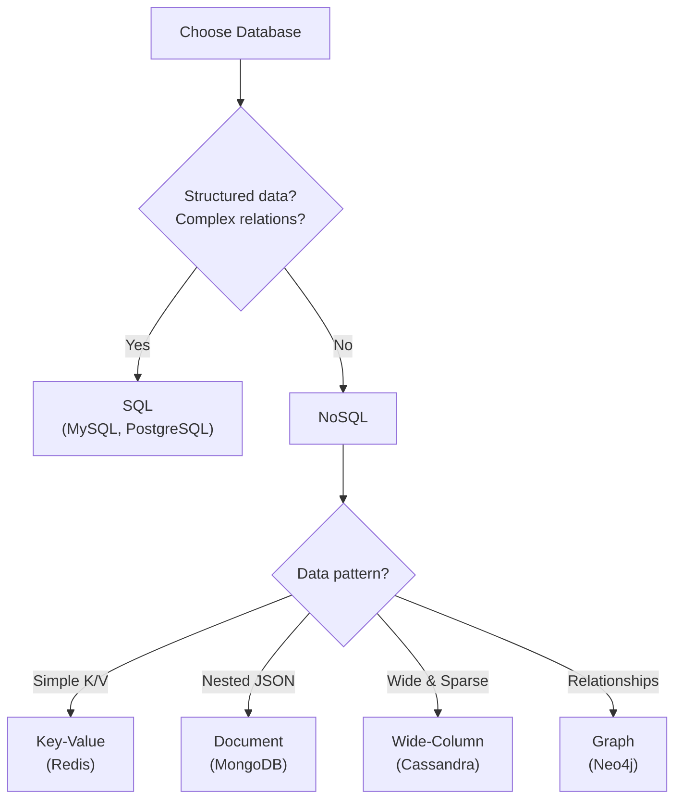
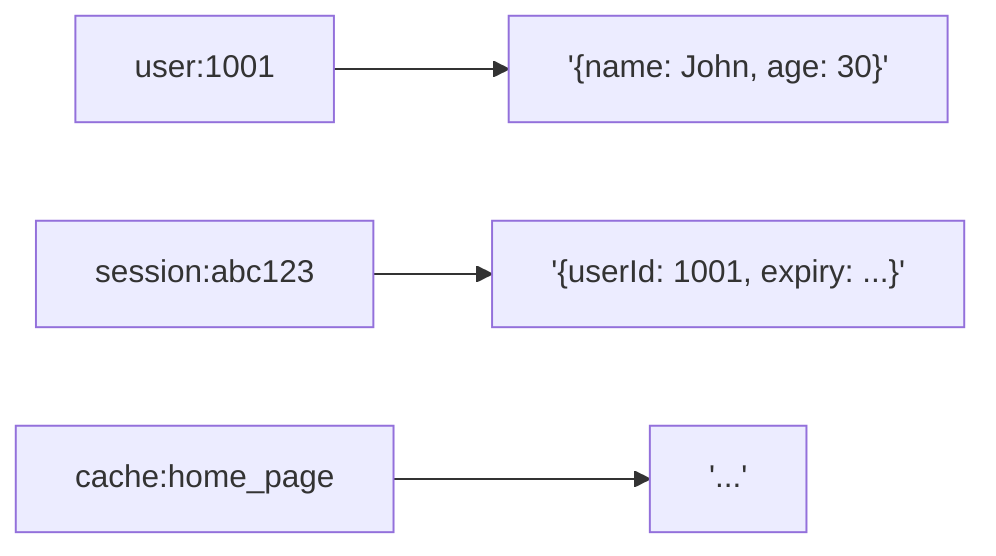
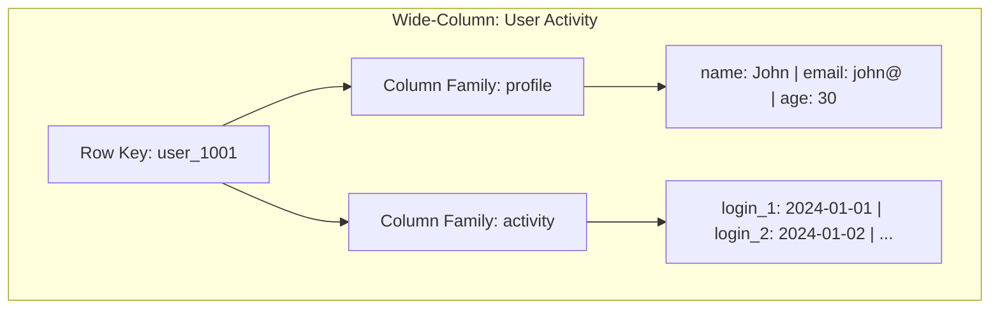
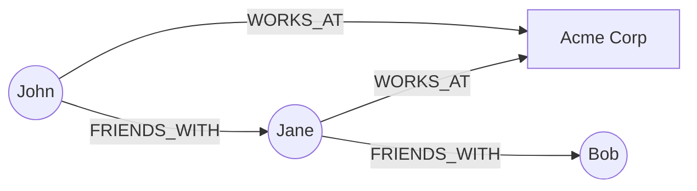

[🏠 Home](../../README.md) | [🗄️ DBMS Roadmap](./00-roadmap.md) | [⬅️ Replication](./16-replication.md) | [➡️ CAP Theorem](./18-cap-theorem.md)

# 📦 NoSQL Database Types

> Understanding when and why to choose NoSQL over relational databases.

---

## 📊 Quick Reference

| Type | Data Model | Example |
|------|------------|---------|
| **Key-Value** | key → value | Redis, DynamoDB |
| **Document** | JSON documents | MongoDB, CouchDB |
| **Wide-Column** | Column families | Cassandra, HBase |
| **Graph** | Nodes & edges | Neo4j, Neptune |

---

## 🆚 SQL vs NoSQL



---

## 🔑 Key-Value Stores

**Model:** Simple key → value mapping.



### Characteristics

| Aspect | Description |
|--------|-------------|
| **Operations** | GET, PUT, DELETE |
| **Queries** | Only by key (no search by value) |
| **Performance** | O(1) lookups |
| **Use Cases** | Caching, sessions, real-time data |

### Examples

| Database | Notes |
|----------|-------|
| **Redis** | In-memory, rich data types (lists, sets, sorted sets) |
| **DynamoDB** | Managed, auto-scaling, AWS native |
| **Memcached** | Simple caching, no persistence |

---

## 📄 Document Stores

**Model:** JSON/BSON documents with nested structures.

```json
{
  "_id": "user_1001",
  "name": "John Doe",
  "email": "john@example.com",
  "addresses": [
    {"type": "home", "city": "NYC"},
    {"type": "work", "city": "Boston"}
  ],
  "orders": [
    {"id": "ord_1", "total": 99.99}
  ]
}
```

### Characteristics

| Aspect | Description |
|--------|-------------|
| **Schema** | Flexible, schemaless |
| **Queries** | Rich queries on any field |
| **Nesting** | Natural for hierarchical data |
| **Use Cases** | Content management, user profiles, catalogs |

### Examples

| Database | Notes |
|----------|-------|
| **MongoDB** | Most popular, aggregation pipeline |
| **CouchDB** | Multi-master replication |
| **Firestore** | Google's serverless document DB |

---

## 📊 Wide-Column Stores

**Model:** Tables with rows and dynamic columns.



### Characteristics

| Aspect | Description |
|--------|-------------|
| **Structure** | Row key → Column families → Columns |
| **Sparse** | Each row can have different columns |
| **Scale** | Designed for massive scale (petabytes) |
| **Use Cases** | Time-series, event logs, IoT |

### Examples

| Database | Notes |
|----------|-------|
| **Cassandra** | Masterless, high availability |
| **HBase** | Hadoop ecosystem, strong consistency |
| **ScyllaDB** | Cassandra-compatible, C++ (faster) |

---

## 🕸️ Graph Databases

**Model:** Nodes (entities) and Edges (relationships).



### Characteristics

| Aspect | Description |
|--------|-------------|
| **Data** | Nodes have properties, edges have types/properties |
| **Queries** | Traversal-based (find paths, connections) |
| **Performance** | O(1) relationship traversal |
| **Use Cases** | Social networks, recommendations, fraud detection |

### Query Example (Cypher - Neo4j)

```cypher
// Find friends of friends
MATCH (me:Person {name: 'John'})-[:FRIENDS_WITH]->
      (friend)-[:FRIENDS_WITH]->(fof)
RETURN fof.name
```

### Examples

| Database | Notes |
|----------|-------|
| **Neo4j** | Most popular, Cypher query language |
| **Amazon Neptune** | Managed, supports Gremlin and SPARQL |
| **ArangoDB** | Multi-model (graph + document) |

---

## 📊 Comparison Table

| Aspect | Key-Value | Document | Wide-Column | Graph |
|--------|-----------|----------|-------------|-------|
| **Schema** | None | Flexible | Column families | Node/Edge types |
| **Query** | By key only | Rich queries | Row key + columns | Traversals |
| **Best for** | Caching | Content | Time-series | Relationships |
| **Scale** | High | High | Very High | Moderate |
| **Joins** | None | Embedded/App | None | Native |

---

## 🧠 Interview Questions

1. **Q: When would you choose MongoDB over PostgreSQL?**
   - **A:** When data is naturally nested/hierarchical, schema evolves frequently, or you don't need complex JOINs. Example: blog posts with embedded comments.

2. **Q: What is Cassandra good for?**
   - **A:** High write throughput, time-series data, globally distributed with tunable consistency. Not good for ad-hoc queries or frequent data updates.

3. **Q: When to use a Graph database?**
   - **A:** When queries are relationship-heavy (friends-of-friends, shortest path, recommendations). SQL JOINs become expensive for deep traversals.

4. **Q: Key-Value vs Document database?**
   - **A:** Key-Value: Simple access by key, no query on content. Document: Rich querying on any field, but more overhead.

---
