[🏠 Home](../../README.md) | [🗄️ DBMS Roadmap](./00-roadmap.md) | [⬅️ NoSQL Types](./17-nosql-types.md) | [➡️ Database Deep Dive](./20-database-deep-dive.md)

# ⚖️ CAP Theorem & PACELC

> Understanding the fundamental trade-offs in distributed databases.

---

## 📊 Quick Reference

| Term | Meaning |
|------|---------|
| **C** (Consistency) | All nodes see same data at same time |
| **A** (Availability) | Every request gets a response |
| **P** (Partition Tolerance) | System works despite network failures |

---

## 🔺 The CAP Theorem

> "In a distributed system during a network partition, you can only have Consistency OR Availability, not both."


### Understanding the Trade-off

```mermaid
sequenceDiagram
    participant Client
    participant Node1
    participant Node2
    
    Note over Node1, Node2: 🔌 Network Partition!
    
    Client->>Node1: Write X=5
    Node1-->>Node1: Store X=5
    Note over Node1, Node2: Can't replicate to Node2!
    
    Client->>Node2: Read X
    
    alt Choose Consistency (CP)
        Node2-->>Client: ERROR: System unavailable
        Note over Client: Sacrificed Availability
    else Choose Availability (AP)
        Node2-->>Client: X=old_value (stale)
        Note over Client: Sacrificed Consistency
    end
```



---

## 🏷️ CAP Categories

### CP Systems (Consistency + Partition Tolerance)


**Examples:** MongoDB (default), HBase, Redis Cluster

**Behavior:** During partition, system may become unavailable for writes.

### AP Systems (Availability + Partition Tolerance)


**Examples:** Cassandra, CouchDB, DynamoDB

**Behavior:** Always available, but may return stale data.

### CA Systems (Consistency + Availability)


**Examples:** Traditional RDBMS (single node MySQL/PostgreSQL)

**Note:** CA doesn't really exist in distributed systems (partitions WILL happen).

---

## 📊 PACELC Theorem

CAP only describes behavior during partitions. PACELC extends this:

> "If Partition (P), choose A or C. Else (E), choose Latency (L) or Consistency (C)."


### Database Classifications

| Database | During Partition | Else (Normal) | Full Code |
|----------|------------------|---------------|-----------|
| **DynamoDB** | Availability | Latency | PA/EL |
| **Cassandra** | Availability | Latency | PA/EL |
| **MongoDB** | Consistency | Consistency | PC/EC |
| **PostgreSQL** | Consistency | Consistency | PC/EC |
| **CockroachDB** | Consistency | Latency | PC/EL |

---

## 🎚️ Tunable Consistency

Many databases let you choose per-operation.


### Cassandra Example

```sql
-- Write to just one node (fast, risky)
INSERT INTO users (id, name) VALUES (1, 'John') USING CONSISTENCY ONE;

-- Write to majority (balanced)
INSERT INTO users (id, name) VALUES (1, 'John') USING CONSISTENCY QUORUM;

-- Write to all replicas (slow, safe)
INSERT INTO users (id, name) VALUES (1, 'John') USING CONSISTENCY ALL;
```

### Strong Consistency Formula

```
R + W > N

R = Read quorum
W = Write quorum
N = Number of replicas
```

Example: N=3, W=2, R=2 → 2+2=4 > 3 ✅ Strong consistency

---

## 🆚 Eventual vs Strong Consistency


| Aspect | Eventual | Strong |
|--------|----------|--------|
| **Latency** | Low | High |
| **Availability** | High | Lower |
| **Data freshness** | May be stale | Always current |
| **Use case** | Social feeds, analytics | Banking, inventory |

---

## 🔄 BASE vs ACID

| ACID | BASE |
|------|------|
| Atomicity | **B**asically **A**vailable |
| Consistency | **S**oft state |
| Isolation | **E**ventual consistency |
| Durability | |

### BASE Philosophy

- System is always available
- State may not be consistent at all times
- Consistency is achieved eventually

---

## 🧠 Interview Questions

1. **Q: Explain CAP Theorem with an example.**
   - **A:** In a distributed DB with 2 nodes, if network partitions, you must choose: (C) Reject operations to stay consistent, or (A) Accept operations but risk stale data. Example: Cassandra chooses A, MongoDB chooses C.

2. **Q: Why can't we have CA in distributed systems?**
   - **A:** Network partitions are inevitable in distributed systems. When partition happens, you MUST choose between C and A. CA only works for single-node systems.

3. **Q: What is PACELC?**
   - **A:** Extends CAP: During Partition (P), choose Availability or Consistency. Else (E), during normal operation, choose Latency or Consistency.

4. **Q: What is Tunable Consistency?**
   - **A:** Ability to choose consistency level per operation. Write to ONE node (fast) vs ALL nodes (safe). Used in Cassandra, DynamoDB.

---
