```mermaid
flowchart TB
    subgraph Instance["Oracle Instance"]
        subgraph SGA["System Global Area (SGA) — Shared Memory"]
            DBC["Database Buffer Cache"]
            SP["Shared Pool<br/>(Library Cache + Data Dict)"]
            RLB["Redo Log Buffer"]
            LP["Large Pool"]
            JP["Java Pool"]
        end
        
        subgraph BGP["Background Processes"]
            DBWn["DBWn (DB Writer)"]
            LGWR["LGWR (Log Writer)"]
            CKPT["CKPT (Checkpoint)"]
            SMON["SMON (System Monitor)"]
            PMON["PMON (Process Monitor)"]
            ARCn["ARCn (Archiver)"]
        end
    end
    
    subgraph PGA["PGA (per server process)"]
        SortArea["Sort Area"]
        HashArea["Hash Area"]
        SessionMem["Session Memory"]
    end
    
    subgraph DB["Database (Physical Files)"]
        DataFiles["Data Files<br/>(Tablespaces)"]
        RedoLogs["Online Redo Log Files"]
        ControlFile["Control File"]
        ArchiveLogs["Archive Logs"]
    end
    
    SGA --> DB
    BGP --> DB
```

[🏠 Home](../../README.md) | [🗄️ DBMS Roadmap](./00-roadmap.md) | [⬅️ CAP Theorem](./18-cap-theorem.md)

# 🗃️ The Complete Database Deep Dive — From Internals to Architecture Decisions

> **Your one-stop guide** to understand every major database in the market — how they work internally, when to pick one over another, and the trade-offs that matter at architect-level decisions.

---

## 📑 Table of Contents

1. [Database Landscape at a Glance](#-database-landscape-at-a-glance)
2. [SQL / Relational Databases](#-sql--relational-databases)
   - [PostgreSQL](#-postgresql)
   - [MySQL (InnoDB)](#-mysql-innodb)
   - [Oracle Database](#-oracle-database)
3. [NoSQL — Document Stores](#-nosql--document-stores)
   - [MongoDB](#-mongodb)
4. [NoSQL — Wide-Column Stores](#-nosql--wide-column-stores)
   - [Apache Cassandra](#-apache-cassandra)
5. [NoSQL — Key-Value Stores](#-nosql--key-value-stores)
   - [Redis](#-redis)
   - [Amazon DynamoDB](#-amazon-dynamodb)
6. [NoSQL — Graph Databases](#-nosql--graph-databases)
   - [Neo4j](#-neo4j)
7. [Search Engines](#-search-engines)
   - [Elasticsearch](#-elasticsearch)
8. [Vector Databases](#-vector-databases)
   - [How Vector Search Works](#how-vector-search-works-ann-algorithms)
   - [Pinecone](#pinecone)
   - [Milvus](#milvus)
   - [Weaviate](#weaviate)
   - [pgvector](#pgvector)
   - [Chroma](#chroma)
9. [The Ultimate Comparison Matrix](#-the-ultimate-comparison-matrix)
10. [Decision Framework — "When to Use What"](#-decision-framework--when-to-use-what)
11. [Architect Interview Questions](#-architect-interview-questions)

---

## 🌍 Database Landscape at a Glance


### Category Quick Reference

| Category | Data Model | Query Style | Best For |
|----------|-----------|-------------|----------|
| **Relational (SQL)** | Tables, rows, columns | SQL | Structured data, ACID transactions, complex JOINs |
| **Document** | JSON/BSON documents | JSON query / MQL | Flexible schema, nested data, content management |
| **Wide-Column** | Row key → Column families | CQL (Cassandra Query Language) | High write throughput, time-series, IoT |
| **Key-Value** | Key → Value | GET / PUT / DELETE | Caching, sessions, low-latency lookups |
| **Graph** | Nodes + Edges | Cypher / Gremlin | Relationship-heavy data, social networks |
| **Search Engine** | Inverted index documents | Query DSL / REST | Full-text search, log analytics |
| **Vector DB** | High-dimensional vectors | Similarity search (ANN) | AI/ML embeddings, semantic search, RAG |

---

## 🏛️ SQL / Relational Databases

### 🐘 PostgreSQL

> *"The world's most advanced open-source relational database"*

#### Architecture Overview


#### How It Works Internally

| Component | How It Works |
|-----------|-------------|
| **Storage (Heap)** | Data stored in fixed-size **8 KB pages**. Each row (tuple) gets a physical address called `ctid` (block number + offset). Heap is **append-only** — updates create new tuple versions, old ones become "dead tuples". |
| **MVCC** | Every row has hidden `xmin` (inserting txn) and `xmax` (deleting/updating txn) columns. Each transaction sees a **consistent snapshot** — readers never block writers, writers never block readers. No read locks needed. |
| **B-tree Index** | Default index type. Balanced tree (B+ tree) where **leaf nodes** contain keys + pointers (TIDs) to heap rows. Provides O(log n) lookups. Internal nodes contain keys + pointers to children. |
| **WAL** | Every change is first written to the **Write-Ahead Log** (sequential, append-only) before data files. On crash, PostgreSQL replays WAL to recover. WAL also powers **replication** and **point-in-time recovery**. |
| **VACUUM** | Background process that reclaims space from dead tuples left by MVCC. `AUTOVACUUM` runs automatically. Without it, table bloat grows unbounded. |
| **Checkpoints** | Periodically flushes all dirty pages from buffer pool to disk, creating a recovery point. Reduces WAL replay time on crash recovery. |

#### Advanced Index Types

| Index Type | Use Case | How It Works |
|-----------|----------|-------------|
| **B-tree** | Equality, range queries, sorting | Balanced tree, default for most columns |
| **Hash** | Equality only (`=`) | Hash table, faster than B-tree for exact match |
| **GIN** | Full-text search, JSONB, arrays | Inverted index — maps values → rows |
| **GiST** | Geospatial, range types, fuzzy search | Generalized search tree, supports custom operators |
| **BRIN** | Very large tables with natural ordering | Block Range Index — stores min/max per block range. Tiny index, huge tables |
| **SP-GiST** | Phone numbers, IP addresses, quad-trees | Space-partitioned GiST |

#### Strengths & Weaknesses

| ✅ Strengths | ❌ Weaknesses |
|-------------|--------------|
| Most feature-rich open-source RDBMS | Write amplification from MVCC (dead tuples) |
| Rich index types (GIN, GiST, BRIN, etc.) | Replication is not as seamless as MySQL |
| Native JSON/JSONB support | Connection-per-process model (use PgBouncer) |
| Extensible (custom types, operators, languages) | Vacuum overhead for high-write workloads |
| ACID + MVCC without read locks | Complex tuning for very high throughput |
| PostGIS for geospatial | Lacks built-in multi-master clustering |

#### When to Use

- ✅ Complex queries with many JOINs
- ✅ Need rich data types (JSONB, arrays, hstore, geospatial)
- ✅ ACID compliance is critical
- ✅ Full-text search (with `tsvector` + GIN)
- ❌ Avoid for simple key-value lookups at extreme scale → Use Redis/DynamoDB

---

### 🐬 MySQL (InnoDB)

> *"The world's most popular open-source database"*

#### Architecture Overview


#### How It Works Internally

| Component | How It Works |
|-----------|-------------|
| **Clustered Index** | In InnoDB, the PRIMARY KEY **IS** the table. Data rows are stored physically sorted by PK in a B+ tree. Leaf nodes contain the actual row data. If no PK exists, InnoDB creates a hidden 6-byte row ID. |
| **Secondary Index** | Leaf nodes store the **primary key** value (not a pointer). Lookups require a second hop to the clustered index ("double lookup"). |
| **Buffer Pool** | In-memory cache of data + index pages. Uses a midpoint-insertion LRU algorithm — new pages go to the middle, not head, to prevent full-table scans from evicting hot data. Typically 80% of RAM on dedicated servers. |
| **Redo Log** | Circular, fixed-size log files that record every data modification. Ensures crash durability — committed changes in redo log can be replayed even if data pages weren't flushed. Uses Log Sequence Numbers (LSNs). |
| **Undo Log** | Stores "before-image" of modified rows. Powers MVCC (consistent reads see old versions via undo chain) and transaction rollback. Each row has a rollback pointer to its most recent undo record. |
| **Doublewrite Buffer** | Guards against partial page writes (torn pages). Pages are first written to a contiguous area, then to actual data files. |
| **Change Buffer** | Caches changes to secondary index pages that aren't in the buffer pool. Merges happen later when pages are read. Avoids random I/O for non-unique secondary index updates. |

#### MySQL vs PostgreSQL

| Aspect | MySQL (InnoDB) | PostgreSQL |
|--------|---------------|------------|
| **Architecture** | Thread-per-connection | Process-per-connection |
| **MVCC** | Undo log chain | Heap-based tuple versioning |
| **Clustered Index** | PK is the table (mandatory) | Heap storage (no clustering by default) |
| **Replication** | Excellent (Group Replication, InnoDB Cluster) | Streaming + Logical replication |
| **JSON** | JSON type (limited indexing) | JSONB (binary, fully indexable with GIN) |
| **Full-text search** | Basic (InnoDB FTS) | Advanced (tsvector + GIN) |
| **Ecosystem** | Huge (WordPress, Drupal, etc.) | Enterprise/analytics focused |
| **Best For** | Web apps, read-heavy OLTP | Complex queries, analytics, extensions |

#### Strengths & Weaknesses

| ✅ Strengths | ❌ Weaknesses |
|-------------|--------------|
| Massive ecosystem & community | Fewer advanced index types than PostgreSQL |
| Superior replication (InnoDB Cluster) | Limited extensibility |
| Easy to learn and operate | Weaker JSON support vs PostgreSQL |
| Excellent read performance | No partial indexes, expression indexes |
| Well-documented, battle-tested | No native materialized views |

---

### 🏢 Oracle Database

> *"The enterprise-grade RDBMS that powers Fortune 500"*

#### Architecture Overview



#### How It Works Internally

| Component | How It Works |
|-----------|-------------|
| **SGA** | Shared memory area across all sessions. Contains buffer cache (data blocks), shared pool (parsed SQL, data dictionary), redo log buffer. Sized by `SGA_TARGET` or `MEMORY_TARGET`. |
| **PGA** | Private memory per server process. Contains sort areas (for ORDER BY, GROUP BY), hash join areas, session data. Sized by `PGA_AGGREGATE_TARGET`. |
| **Buffer Cache** | Caches data blocks from data files. Uses a touch-count LRU algorithm. Blocks are "hot" or "cold". DBWn writes dirty blocks to disk. |
| **Redo Log** | Circular log files (minimum 2 groups). LGWR writes redo entries from buffer → online redo log. On log switch, ARCn copies to archive logs. Powers crash recovery and Data Guard replication. |
| **UNDO** | Stored in dedicated UNDO tablespace. Provides read consistency (long queries see snapshot), rollback capability, and Flashback queries. Oracle manages UNDO retention automatically. |
| **Tablespaces** | Logical containers for segments (tables, indexes). SYSTEM (data dictionary), SYSAUX (auxiliary), UNDO, TEMP (sorts), USER-defined. Each tablespace → one or more data files. |
| **RAC** | Real Application Clusters — multiple instances share **one** database on shared storage. Cache Fusion protocol transfers blocks between instances via interconnect. True active-active clustering. |

#### Oracle-Specific Features

| Feature | Description |
|---------|------------|
| **RAC** | Multi-instance, shared-disk clustering for HA and scalability |
| **Data Guard** | Physical/Logical standby for DR. Zero data loss possible |
| **Flashback** | Query data as it existed at a past point in time |
| **Partitioning** | Range, list, hash, composite partitioning (enterprise feature) |
| **AWR / ASH** | Automatic Workload Repository / Active Session History for performance diagnostics |
| **Exadata** | Engineered system with Smart Scan (offload query processing to storage) |

#### Strengths & Weaknesses

| ✅ Strengths | ❌ Weaknesses |
|-------------|--------------|
| Most feature-rich commercial RDBMS | Extremely expensive licensing |
| RAC for high availability | Complex administration |
| Excellent optimizer & diagnostics | Vendor lock-in |
| Partitioning, compression, security | Heavy resource requirements |
| Longest track record in enterprise | Over-engineered for small workloads |

---

## 📄 NoSQL — Document Stores

### 🍃 MongoDB

> *"The most popular document database"*

#### Architecture Overview


#### How It Works Internally

| Component | How It Works |
|-----------|-------------|
| **BSON** | Documents stored in Binary JSON (BSON) format. Extends JSON with additional types (ObjectId, Date, Binary, Decimal128). Max document size: **16 MB**. Each document has a unique `_id` field (default: 12-byte ObjectId). |
| **WiredTiger** | Default storage engine since v3.0. Uses B-tree for indexes, **document-level locking** (not collection-level). Supports Snappy/zlib/zstd **compression**. Uses MVCC for consistent reads within a transaction. |
| **Oplog** | Operation log — a special capped collection on the primary. Records all write operations (inserts, updates, deletes). Secondaries continuously tail the oplog to replicate data. Powers point-in-time recovery. |
| **Sharding** | Data distributed across shards using a **shard key**. Data split into **chunks** (64 MB default). `mongos` routes queries to correct shards. A **balancer** moves chunks to maintain even distribution. |
| **Aggregation Pipeline** | Data processing pipeline: `$match → $group → $sort → $project → $lookup`. Stages process documents sequentially. `$lookup` does left outer JOINs. Can be more expressive than SQL for nested data. |
| **Indexes** | B-tree indexes on any field (including nested fields and arrays). Supports compound, multikey (array), text, geospatial (2dsphere), hashed, and wildcard indexes. |

#### Strengths & Weaknesses

| ✅ Strengths | ❌ Weaknesses |
|-------------|--------------|
| Flexible schema — adapts to evolving data | No real JOINs — `$lookup` is limited & slow |
| Horizontal scaling via sharding | Transactions added late (v4.0+), overhead |
| Rich query language + aggregation pipeline | High storage overhead (field names in every doc) |
| Built-in replication & automatic failover | Choosing a bad shard key is catastrophic |
| Atlas managed service (cloud-native) | Denormalization leads to data duplication |
| Full-text search (Atlas Search / Lucene) | Weaker consistency guarantees by default |

#### When to Use

- ✅ Rapidly evolving schema (startups, prototyping)
- ✅ Content management, product catalogs, user profiles
- ✅ Document-centric data (nested JSON)
- ✅ Need horizontal scaling with auto-sharding
- ❌ Avoid for highly relational data with complex JOINs
- ❌ Avoid when strong ACID is critical across multiple collections

---

## 📊 NoSQL — Wide-Column Stores

### 🌐 Apache Cassandra

> *"Designed for massive write throughput with zero downtime"*

#### Architecture Overview


#### How It Works Internally

| Component | How It Works |
|-----------|-------------|
| **Ring Architecture** | All nodes are peers (no master). Data distributed using **consistent hashing** on partition key. Each node owns a token range on the ring. **Virtual nodes (vnodes)** give each physical node multiple small ranges for better distribution. |
| **Gossip Protocol** | Nodes exchange state information every second with random peers. Within seconds, all nodes know about every other node's health, token ownership, and schema version. No central coordinator. |
| **Write Path** | 1) Write to **commit log** (durability). 2) Write to **memtable** (in-memory, sorted by key). 3) When memtable full → **flush** to immutable **SSTable** on disk. Writes are sequential → extremely fast. |
| **Read Path** | 1) Check **memtable** for recent data. 2) Check **bloom filters** to avoid reading SSTables that don't have the key. 3) Read from matching SSTables + merge results. |
| **SSTables** | Sorted String Tables — immutable files on disk. Each SSTable has: Data.db, Index.db, Summary.db, Filter.db (bloom filter), Statistics.db. Never modified — updates create new SSTables with newer timestamps. |
| **Compaction** | Background process that merges multiple SSTables → fewer, consolidated ones. Discards tombstones (deleted data) and superseded versions. Strategies: **STCS** (write-heavy), **LCS** (read-heavy), **TWCS** (time-series). |
| **Tunable Consistency** | Per-query consistency level: `ONE` (fast, less consistent), `QUORUM` (majority), `ALL` (slowest, strongest). `LOCAL_QUORUM` for multi-DC. Trade-off: `W + R > N` ensures strong consistency. |

#### Data Model Insight

```
Keyspace (≈ Database)
  └── Table
       └── Partition (identified by partition key)
            └── Rows (sorted by clustering columns)
                 └── Columns (dynamic per row)
```

> **Key Design Rule:** Design tables around your **query patterns**, not your entities. One table per query. Denormalization is expected.

#### Strengths & Weaknesses

| ✅ Strengths | ❌ Weaknesses |
|-------------|--------------|
| Linear horizontal scalability | No JOINs, no subqueries |
| Masterless — no single point of failure | Data modeling requires knowing queries upfront |
| Tunable consistency per query | Limited ad-hoc querying capability |
| Incredible write throughput | Compaction can cause latency spikes |
| Multi-datacenter replication built-in | Tombstones can cause read performance issues |
| Time-series data with TWCS | No aggregation framework (limited GROUP BY) |

#### When to Use

- ✅ Massive write-heavy workloads (IoT, event logging)
- ✅ Time-series data (metrics, sensor data)
- ✅ Global multi-datacenter deployment (active-active)
- ✅ Need five 9s availability (99.999%)
- ❌ Avoid for ad-hoc analytics or complex queries
- ❌ Avoid when you need strong consistency for every read

---

## 🔑 NoSQL — Key-Value Stores

### ⚡ Redis

> *"In-memory data structure store — sub-millisecond latency"*

#### Architecture Overview


#### How It Works Internally

| Component | How It Works |
|-----------|-------------|
| **Single-Threaded Model** | All commands processed sequentially by one thread. No context switching, no locks, no race conditions → deterministic, predictable performance. Redis 6.0+ uses multi-threading for I/O (reading/writing network data) but command execution stays single-threaded. |
| **Event Loop (epoll)** | Uses I/O multiplexing (`epoll` on Linux) to monitor thousands of client connections. Only processes connections that have data ready — non-blocking. Avoids one-thread-per-connection overhead. |
| **Data Structures** | Not just strings! Supports: Strings, Lists (linked list), Hashes (field-value maps), Sets, Sorted Sets (skip list + hash table), Bitmaps, HyperLogLogs, Streams (append-only log with consumer groups). |
| **RDB Persistence** | Periodic snapshots of entire dataset to a binary `.rdb` file. Uses `fork()` + copy-on-write. Great for backups, fast restores. Risk: data loss between snapshots. |
| **AOF Persistence** | Appends every write command to a log file. Configurable fsync: `always` (safest, slowest), `everysec` (good tradeoff), `no` (OS decides). AOF rewrite compacts the log. On restart, replays AOF to reconstruct dataset. |
| **Cluster Mode** | Hash slots (0-16383) distributed across nodes. Automatic sharding and failover. Each master can have replicas. Client-side routing with MOVED/ASK redirects. |

#### Strengths & Weaknesses

| ✅ Strengths | ❌ Weaknesses |
|-------------|--------------|
| Sub-millisecond latency | Data must fit in RAM (expensive at scale) |
| Rich data structures (not just key-value) | Single-threaded for commands (CPU bottleneck) |
| Pub/Sub, Lua scripting, Transactions (MULTI) | Persistence adds complexity |
| Simple, elegant API | No built-in query language for complex queries |
| Redis Streams for event streaming | Limited security model (historically) |

#### When to Use

- ✅ Caching (session, page, API responses)
- ✅ Real-time leaderboards (Sorted Sets)
- ✅ Rate limiting, counting (atomic increments)
- ✅ Pub/Sub messaging, job queues
- ✅ Session storage
- ❌ Avoid as a primary database for large datasets
- ❌ Avoid when data exceeds available RAM budget

---

### 🔶 Amazon DynamoDB

> *"Fully managed NoSQL — single-digit ms latency at any scale"*

#### How It Works Internally

| Component | How It Works |
|-----------|-------------|
| **Partition Key** | Every item requires a partition key. DynamoDB hashes it to determine which partition stores the item. Good key = high cardinality + even access → avoids "hot partitions". |
| **Sort Key** | Optional. Items with the same partition key are sorted by sort key within the partition. Enables range queries within a partition. |
| **Consistent Hashing** | Data distributed across partitions in a ring. Adding/removing nodes causes minimal data movement. Each partition replicated across **3 Availability Zones**. |
| **Replication (Multi-Paxos)** | Leader-based replication within each partition. Leader handles writes, logs to WAL, replicates to followers. Multi-Paxos for leader election. |
| **LSI (Local Secondary Index)** | Same partition key, different sort key. Shares capacity with base table. Must be created at table creation time. Supports strong consistency. 10 GB per partition key limit. |
| **GSI (Global Secondary Index)** | Different partition key + sort key. Eventually consistent. Has its own independent capacity. Can be created/deleted anytime. Like a "projection" of the table. |
| **DAX** | DynamoDB Accelerator — in-memory cache for sub-millisecond reads. Sits between app and DynamoDB. Eventually consistent reads only. |

#### Strengths & Weaknesses

| ✅ Strengths | ❌ Weaknesses |
|-------------|--------------|
| Fully managed, zero ops | Expensive at scale (pay per RCU/WCU) |
| Single-digit ms, predictable latency | Limited querying (only by key or index) |
| Auto-scaling, on-demand capacity | No JOINs, no aggregations |
| Built-in encryption, backups, streams | GSIs are eventually consistent |
| Multi-region (Global Tables) | Hot partition problem with bad key design |

---

## 🕸️ NoSQL — Graph Databases

### 🔵 Neo4j

> *"The native graph database — relationships are first-class citizens"*

#### Architecture Overview


#### How It Works Internally

| Component | How It Works |
|-----------|-------------|
| **Native Graph Storage** | Nodes, relationships, and properties stored in separate, purpose-built store files. Fixed-size node records enable O(1) lookups by ID. |
| **Index-Free Adjacency** | Each node directly contains pointers to its relationships and neighbors. No index lookup needed to traverse. Relationship traversal is **O(1)** regardless of total graph size. This is THE key differentiator from SQL JOINs. |
| **Cypher** | Declarative query language using ASCII-art syntax: `(a:Person)-[:KNOWS]->(b:Person)`. Cost-based optimizer generates efficient traversal plans. |
| **Transactions** | Full ACID compliance. Write-ahead logging for durability. Supports concurrent read/write transactions. |
| **Causal Clustering** | Leader-follower topology for writes, read replicas for scaling reads. Uses Raft consensus. Causal consistency between core members. |

#### SQL JOIN vs Graph Traversal

```
SQL: Find friends-of-friends (3 JOINs)
SELECT DISTINCT fof.name
FROM person p
JOIN friendship f1 ON p.id = f1.person_id
JOIN friendship f2 ON f1.friend_id = f2.person_id
JOIN person fof ON f2.friend_id = fof.id
WHERE p.name = 'Alice';

Cypher: Same query (natural!)
MATCH (p:Person {name: 'Alice'})-[:FRIENDS_WITH]->
      ()-[:FRIENDS_WITH]->(fof)
RETURN DISTINCT fof.name;
```

> As the depth increases (friends-of-friends-of-friends...), SQL performance degrades exponentially. Neo4j remains constant time per hop.

#### When to Use

- ✅ Social networks (who-knows-whom)
- ✅ Recommendation engines (users who bought X also bought Y)
- ✅ Fraud detection (find cycles, unusual patterns)
- ✅ Network topology (IT infrastructure, dependencies)
- ✅ Knowledge graphs
- ❌ Avoid for simple tabular data or bulk analytics
- ❌ Not a replacement for RDBMS — use alongside it

---

## 🔎 Search Engines

### 🔍 Elasticsearch

> *"Distributed search and analytics engine built on Apache Lucene"*

#### Architecture Overview


#### How It Works Internally

| Component | How It Works |
|-----------|-------------|
| **Inverted Index** | Core data structure. Maps **terms → documents** (reverse of normal lookup). When you index "The quick brown fox", each word gets mapped to the document ID. Enables O(1) term lookup + fast full-text search. |
| **Lucene Segments** | Each shard is a Lucene index. Data stored in **immutable segments**. New documents go to an in-memory buffer → flushed to new segments. Updates = mark old doc as deleted + create new one. |
| **Segment Merging** | Background process merges small segments into larger ones. Reclaims space from deleted documents. Reduces number of segments to search → better read performance. |
| **Shards** | An index is split into primary shards (fixed at creation). Each shard is an independent Lucene index. Documents routed to shards via hash of `_id`. Enables horizontal scaling. |
| **Replicas** | Each primary shard can have replica shards on different nodes. Provides fault tolerance + parallel read capacity. Number of replicas can be changed dynamically. |
| **Near Real-Time (NRT)** | Documents become searchable within **~1 second** of indexing (not immediate). "Refresh" operation flushes in-memory buffer to a searchable segment in filesystem cache. Configurable via `refresh_interval`. |
| **Analyzers** | Text analysis pipeline: Character Filters → Tokenizer → Token Filters. Example: "Running quickly" → ["run", "quick"] (stemming). Custom analyzers for different languages. |

#### Strengths & Weaknesses

| ✅ Strengths | ❌ Weaknesses |
|-------------|--------------|
| Best-in-class full-text search | Not designed as a primary database |
| Near real-time search (<1s) | No transactions, no ACID |
| Powerful aggregation framework | High memory consumption (JVM heap) |
| Built-in distributed architecture | Schema changes can be painful (reindex) |
| ELK Stack for log analytics | Number of primary shards fixed at creation |
| Kibana for visualization | Split-brain risk without proper config |

#### When to Use

- ✅ Full-text search (e-commerce, documentation)
- ✅ Log and event analytics (ELK stack)
- ✅ Autocomplete, fuzzy search, faceted search
- ✅ Real-time application monitoring
- ❌ NOT a replacement for a primary database
- ❌ Avoid for transactional workloads

---

## 🧠 Vector Databases

> *"Purpose-built for AI/ML embeddings and semantic search"*

### How Vector Search Works (ANN Algorithms)

Vector databases store **high-dimensional vectors** (embeddings) and find **similar** items using **Approximate Nearest Neighbor (ANN)** algorithms instead of exact search (which is computationally prohibitive at scale).


#### HNSW vs IVF — The Two Main ANN Approaches

| Aspect | **HNSW** (Hierarchical Navigable Small World) | **IVF** (Inverted File Index) |
|--------|----------------------------------------------|------------------------------|
| **Approach** | Graph-based, multi-layered | Clustering-based (K-means) |
| **How it works** | Multi-layer graph. Top layers = sparse shortcuts. Bottom layers = dense, precise connections. Search starts at top, greedily descends. | Divides vectors into K clusters. Search first finds nearest cluster centroids, then searches within closest clusters. |
| **Search speed** | Very fast (graph traversal) | Fast (narrows search space) |
| **Accuracy (Recall)** | Very high | Good (depends on `nprobe`) |
| **Memory** | High (graph must fit in RAM) | Lower (quantization possible) |
| **Updates** | Dynamic inserts/deletes | Usually requires full rebuild |
| **Best for** | High-recall, dynamic datasets | Large static datasets |

#### Distance Metrics

| Metric | Formula | Use Case |
|--------|---------|----------|
| **Cosine Similarity** | cos(θ) between vectors | Text embeddings (direction matters, not magnitude) |
| **Euclidean (L2)** | Straight-line distance | Image embeddings, spatial data |
| **Dot Product** | Sum of element-wise products | When vectors are normalized (equivalent to cosine) |

---

### Vector Database Comparison

| Feature | **Pinecone** | **Milvus** | **Weaviate** | **pgvector** | **Chroma** |
|---------|------------|---------|-----------|-----------|---------|
| **Type** | Managed SaaS | Open-source, cloud-native | Open-source, cloud-native | PostgreSQL extension | Open-source, lightweight |
| **ANN Index** | HNSW | HNSW, IVF, DiskANN, SCANN | HNSW | HNSW, IVFFlat | HNSW |
| **Architecture** | Serverless, log-structured merge trees | Microservices, separated storage & compute | 3-layer (API, search, persistence) | Extends PostgreSQL | Modular (Gateway, Log, Executor, Compactor) |
| **Metadata Filter** | Roaring bitmaps | Rich filtering | Inverted index + vector search | SQL WHERE clauses | Key-value filters |
| **Hybrid Search** | Vector + metadata | Vector + scalar + full-text | Vector + BM25 + Hybrid Fusion | SQL + vector distance | Vector + metadata |
| **Consistency** | Strong (within namespace) | Tunable | ACID within shards | PostgreSQL ACID | Eventual |
| **Scaling** | Auto (managed) | Horizontal (shared-nothing) | Horizontal (leaderless) | Vertical (PostgreSQL limits) | Horizontal |
| **Best For** | Production RAG at scale | Large-scale, multi-modal AI | Object store + vector + search | Already using PostgreSQL | Prototyping, lightweight AI apps |
| **Pricing** | Pay-per-use | Free (self-hosted) / Zilliz Cloud | Free (self-hosted) / Weaviate Cloud | Free (PostgreSQL) | Free |

### Pinecone

- **Managed, serverless** — zero infrastructure management
- Slab architecture: writes → memtable → immutable slabs in object storage
- Separates write and read paths for independent scaling
- Metadata filtering with **roaring bitmaps**
- Best for: **production RAG pipelines** without ops overhead

### Milvus

- **Open-source**, microservices architecture (access layer, coordinators, worker nodes, storage)
- Supports multiple index types: HNSW, IVF, DiskANN, SCANN
- Separates storage (object storage + etcd) and compute
- Supports **data sharding** and **streaming data ingestion**
- Best for: **large-scale AI** with diverse embedding types

### Weaviate

- **Open-source**, 3-layer architecture (client, search engine, persistence)
- Stores **objects + vectors** together
- **Leaderless replication** — all nodes accept reads and writes
- Combines **HNSW** (vector) + **BM25** (keyword) + **Hybrid Fusion** (RRF)
- Real-time indexing — continuously updates index as data arrives
- Best for: **hybrid search** (semantic + keyword)

### pgvector

- **PostgreSQL extension** — adds `vector` type and distance operators
- Uses PostgreSQL's B-tree planner + custom HNSW/IVFFlat indexes
- Full SQL power + vector similarity in one query
- Inherits PostgreSQL's ACID, replication, and ecosystem
- Best for: **teams already on PostgreSQL** that need vector search without a new database

### Chroma

- **Lightweight, open-source** — designed for AI application developers
- Modular architecture: Gateway → Log → Query Executor → Compactor
- SQLite-based for local development, scales to cloud object storage
- Focus on developer experience — simple API, easy to integrate
- Best for: **prototyping, small to medium AI projects**, LangChain/LlamaIndex integration

---

## 📊 The Ultimate Comparison Matrix

### Core Capabilities

| Database | Type | Data Model | Query Language | ACID | Distributed |
|----------|------|-----------|---------------|------|-------------|
| **PostgreSQL** | Relational | Tables + JSONB | SQL | ✅ Full | ❌ (use Citus for horizontal) |
| **MySQL** | Relational | Tables | SQL | ✅ Full | ✅ (InnoDB Cluster) |
| **Oracle** | Relational | Tables | SQL/PL-SQL | ✅ Full | ✅ (RAC) |
| **MongoDB** | Document | BSON Documents | MQL | ✅ (v4.0+) | ✅ (Sharding) |
| **Cassandra** | Wide-Column | Rows + Column Families | CQL | ❌ (Tunable) | ✅ (Masterless Ring) |
| **Redis** | Key-Value | Data Structures | Commands API | ❌ (MULTI/EXEC) | ✅ (Cluster) |
| **DynamoDB** | Key-Value + Document | Items + Attributes | PartiQL / API | ✅ (per-item) | ✅ (Managed) |
| **Neo4j** | Graph | Nodes + Edges | Cypher | ✅ Full | ✅ (Causal Clustering) |
| **Elasticsearch** | Search Engine | JSON Documents | Query DSL | ❌ | ✅ (Shards + Replicas) |
| **Pinecone** | Vector | Vectors + Metadata | API / SDK | ❌ | ✅ (Managed) |
| **Milvus** | Vector | Vectors + Scalars | API / SDK | ❌ | ✅ (Microservices) |

### Performance Characteristics

| Database | Read Latency | Write Latency | Write Throughput | Scalability Model |
|----------|-------------|---------------|-----------------|-------------------|
| **PostgreSQL** | Low (with indexes) | Low | Medium | Vertical + Read Replicas |
| **MySQL** | Low | Low | Medium-High | Vertical + InnoDB Cluster |
| **Oracle** | Low | Low | High | RAC (Shared-Disk) |
| **MongoDB** | Low | Low-Medium | High | Horizontal (Sharding) |
| **Cassandra** | Medium | Very Low | **Very High** | **Linear Horizontal** |
| **Redis** | **Sub-ms** | **Sub-ms** | Very High | Horizontal (Cluster) |
| **DynamoDB** | Single-digit ms | Single-digit ms | High | **Auto-scaling** |
| **Neo4j** | Very Low (traversals) | Low | Medium | Vertical + Read Replicas |
| **Elasticsearch** | Low (~NRT) | Low | High | Horizontal (Shards) |

### Consistency & Availability

| Database | Consistency Model | CAP Theorem Focus | Replication |
|----------|------------------|-------------------|-------------|
| **PostgreSQL** | Strong (SERIALIZABLE) | CP | Streaming + Logical |
| **MySQL** | Strong | CP | Group Replication |
| **Oracle** | Strong | CP | Data Guard, RAC |
| **MongoDB** | Strong (configurable) | CP (default) | Replica Sets (automatic failover) |
| **Cassandra** | Tunable (ONE→ALL) | **AP** | Token-based + Multi-DC |
| **Redis** | Eventual (async replication) | AP | Master-Replica |
| **DynamoDB** | Strong or Eventual | CP or AP | 3-AZ replication |
| **Neo4j** | Strong (within cluster) | CP | Causal Clustering (Raft) |
| **Elasticsearch** | NRT (near real-time) | AP | Primary + Replica Shards |

---

## 🎯 Decision Framework — "When to Use What"

### Decision Tree

```mermaid
flowchart TD
    Start["What's your primary need?"]
    
    Start --> Q1{"Structured data?\nComplex relationships\nbetween tables?"}
    Q1 --> |"Yes"| Q2{"Budget constraints?"}
    Q2 --> |"Open-source"| Q3{"Need advanced\nfeatures (JSONB,\nfull-text, geo)?"}
    Q3 --> |"Yes"| PG["✅ PostgreSQL"]
    Q3 --> |"No, simple OLTP"| MY["✅ MySQL"]
    Q2 --> |"Enterprise budget"| OR["✅ Oracle"]
    
    Q1 --> |"No"| Q4{"What type of data?"}
    
    Q4 --> |"JSON Documents\nFlexible schema"| MO["✅ MongoDB"]
    
    Q4 --> |"Simple Key-Value\nCaching"| Q5{"Need persistence?"}
    Q5 --> |"Yes, primary store"| DY["✅ DynamoDB"]
    Q5 --> |"Cache / ephemeral"| RE["✅ Redis"]
    
    Q4 --> |"Massive writes\nTime-series"| CA["✅ Cassandra"]
    
    Q4 --> |"Relationships\nGraph traversals"| NE["✅ Neo4j"]
    
    Q4 --> |"Full-text search\nLog analytics"| ES["✅ Elasticsearch"]
    
    Q4 --> |"AI Embeddings\nSemantic search"| Q6{"Infrastructure\npreference?"}
    Q6 --> |"Managed / No-ops"| PI["✅ Pinecone"]
    Q6 --> |"Already on PostgreSQL"| PGV["✅ pgvector"]
    Q6 --> |"Self-hosted, scale"| MI["✅ Milvus"]
    Q6 --> |"Hybrid search"| WE["✅ Weaviate"]
    Q6 --> |"Quick prototype"| CH["✅ Chroma"]
```



### Quick Reference — Use Case to Database

| Use Case | Primary DB | Secondary / Support DB |
|----------|-----------|----------------------|
| **E-commerce (products + orders)** | PostgreSQL / MySQL | Redis (cache), Elasticsearch (search) |
| **Social network** | Neo4j (relationships) | PostgreSQL (user data), Redis (feeds) |
| **IoT / Sensor data** | Cassandra | Redis (real-time), Elasticsearch (analytics) |
| **Content management / CMS** | MongoDB | Elasticsearch (search) |
| **Session management** | Redis | — |
| **Real-time analytics dashboard** | Elasticsearch | PostgreSQL (source of truth) |
| **AI / RAG application** | PostgreSQL + pgvector | Pinecone or Milvus (at scale) |
| **Financial transactions** | Oracle / PostgreSQL | — (ACID is non-negotiable) |
| **Logging & monitoring** | Elasticsearch (ELK) | — |
| **Gaming leaderboard** | Redis (Sorted Sets) | PostgreSQL (persistent) |
| **Product catalog** | MongoDB | Elasticsearch (search) |
| **Global multi-region app** | DynamoDB / Cassandra | — |
| **Recommendation engine** | Neo4j | Redis (cache users), PostgreSQL (products) |

---

## 🧠 Architect Interview Questions

### 1. Storage Engine Internals
1. **Q:** How does PostgreSQL's MVCC differ from MySQL's InnoDB MVCC?
   - **A:** PostgreSQL stores old tuple versions **in the heap** (requiring VACUUM to reclaim space). InnoDB stores old versions in a separate **undo log** (cleaner heap, but undo log can grow). PostgreSQL uses `xmin/xmax` for visibility; InnoDB uses rollback pointers forming a version chain.

2. **Q:** Why is Cassandra optimized for writes?
   - **A:** Writes go to an append-only commit log + in-memory memtable. No read-before-write. No in-place updates. Sequential I/O only. Reads are more expensive because they must check memtable + bloom filters + multiple SSTables.

3. **Q:** How does Redis achieve sub-millisecond latency?
   - **A:** All data in RAM + single-threaded event loop (no locking overhead) + I/O multiplexing with `epoll` (handles thousands of connections efficiently) + simple data structure operations.

### 2. Distributed Systems
4. **Q:** How does Cassandra handle node failures?
   - **A:** Gossip protocol detects unresponsive nodes. With replication factor 3 and `QUORUM` consistency, reads/writes succeed as long as 2/3 replicas are available. Hinted handoff stores writes for offline nodes. Read repair and anti-entropy repair fix inconsistencies.

5. **Q:** Explain DynamoDB's partition strategy.
   - **A:** Hash of partition key → partition placement via consistent hashing ring. Data replicated across 3 AZs. Multi-Paxos for leader election within each partition. Bad key = hot partition = throttling. Solution: composite key or write sharding.

6. **Q:** How does Elasticsearch achieve near real-time search?
   - **A:** New documents buffered in memory → periodically "refreshed" (default 1s) to a new Lucene segment in filesystem cache. Searchable before being committed to disk. Full commit (flush) happens less frequently.

### 3. Data Modeling
7. **Q:** When would you use MongoDB over PostgreSQL?
   - **A:** When data is naturally hierarchical/nested (product catalogs with varying attributes), schema changes frequently, you don't need complex JOINs, and you need built-in horizontal scaling. PostgreSQL is better when you need strong consistency, complex queries, and relational integrity.

8. **Q:** How do you model data in Cassandra?
   - **A:** Start from **queries**, not entities. One table per query pattern. Partition key = how data is distributed. Clustering columns = how data is sorted within a partition. Denormalization is the norm. No JOINs means data duplication is expected and necessary.

### 4. Architecture Decisions
9. **Q:** Design the database architecture for a large e-commerce platform.
   - **A:**
     - **PostgreSQL**: Core transactional data (orders, payments, users) — ACID compliance
     - **Redis**: Session store, shopping cart cache, rate limiting
     - **Elasticsearch**: Product search with facets, autocomplete, typo tolerance
     - **MongoDB**: Product catalog (varying attributes per category)
     - **Cassandra**: Clickstream analytics, recommendation events
     - **Neo4j**: "Customers who bought X also bought Y" recommendations

10. **Q:** When would you choose Cassandra over DynamoDB?
    - **A:**
      | Cassandra | DynamoDB |
      |-----------|----------|
      | Open-source, no vendor lock-in | Fully managed, zero ops |
      | Multi-DC active-active built-in | Global Tables (managed) |
      | Full tuning control | Limited control, opaque internals |
      | On-premise or any cloud | AWS only |
      | Predictable cost at scale | Can be expensive at high throughput |

### 5. Vector Databases
11. **Q:** When should you use pgvector vs Pinecone?
    - **A:** Use **pgvector** when you already run PostgreSQL and need vector search alongside relational queries (hybrid SQL + similarity). Use **Pinecone** when you need managed infrastructure, very large vector datasets, and don't want to manage PostgreSQL scaling for vector workloads.

12. **Q:** Explain how HNSW index works.
    - **A:** HNSW builds a multi-layered graph. Top layers are sparse with long-range connections (express highways). Lower layers are dense with local connections. Search starts at the top layer, greedily moves to the nearest neighbor, then drops to the next layer for refinement. O(log n) search time with high recall.

---

> 📖 **Related Files:**
> - [DBMS Roadmap](./00-roadmap.md)
> - [NoSQL Types](./17-nosql-types.md)
> - [CAP Theorem](./18-cap-theorem.md)
> - [Storage Internals](./05-storage-internals.md)
> - [Indexing & B-trees](./06-indexing-btree.md)
> - [ACID Properties](./08-acid-properties.md)
> - [Scaling](./15-scaling.md)
> - [Replication](./16-replication.md)

---
