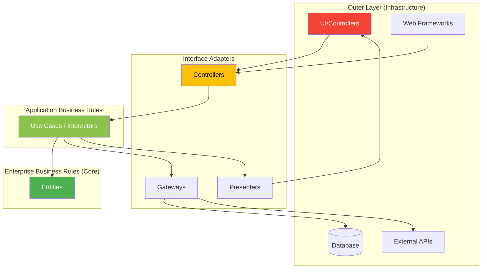
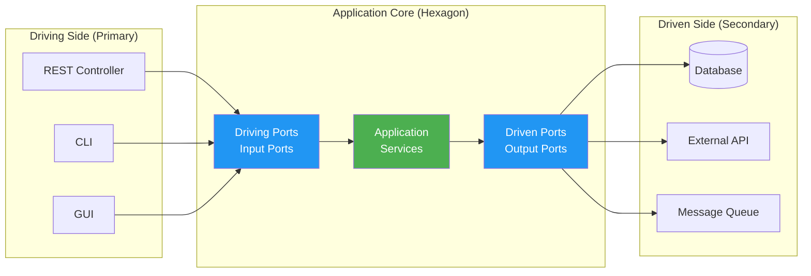

# 🏛️ Clean Architecture & Hexagonal Architecture

> Master the art of building maintainable, testable, and decoupled software systems.

---

## 📋 Table of Contents

1. [Overview](#-overview)
2. [Clean Architecture](#-clean-architecture)
3. [Hexagonal Architecture](#-hexagonal-architecture-ports--adapters)
4. [Comparison](#-comparison)
5. [Java Examples](#-java-examples)
6. [Interview Questions](#-interview-questions)

---

## 🎯 Overview

Both **Clean Architecture** (by Robert C. Martin) and **Hexagonal Architecture** (by Alistair Cockburn) are architectural patterns that emphasize:

| Principle | Benefit |
|-----------|---------|
| **Separation of Concerns** | Each layer has a single responsibility |
| **Dependency Inversion** | High-level modules don't depend on low-level modules |
| **Testability** | Business logic can be tested without frameworks/DBs |
| **Framework Independence** | Core business logic is free from external libraries |

---

## 🧅 Clean Architecture

### The Dependency Rule

> **Source code dependencies must point ONLY INWARD, toward higher-level policies.**

The inner layers know nothing about the outer layers. This is achieved through **Dependency Inversion**.

### The Layers



### Layer Responsibilities

| Layer | Responsibility | Examples |
|-------|----------------|----------|
| **Entities** | Enterprise-wide business rules, domain objects | `Order`, `Customer`, `Product` |
| **Use Cases** | Application-specific business rules | `PlaceOrderUseCase`, `CreateUserUseCase` |
| **Interface Adapters** | Convert data between use cases and external formats | Controllers, Repositories, Presenters |
| **Frameworks & Drivers** | External tools and delivery mechanisms | Spring, Hibernate, REST APIs, UI |

### Clean Architecture Diagram (Concentric Circles)

```
┌──────────────────────────────────────────────────────────────────┐
│                    Frameworks & Drivers                          │
│  ┌────────────────────────────────────────────────────────────┐  │
│  │                   Interface Adapters                        │  │
│  │  ┌──────────────────────────────────────────────────────┐  │  │
│  │  │                  Application Layer                    │  │  │
│  │  │  ┌────────────────────────────────────────────────┐  │  │  │
│  │  │  │               ENTITIES (Core)                   │  │  │  │
│  │  │  │                                                 │  │  │  │
│  │  │  │   • Domain Models                               │  │  │  │
│  │  │  │   • Business Rules                              │  │  │  │
│  │  │  │   • Value Objects                               │  │  │  │
│  │  │  │                                                 │  │  │  │
│  │  │  └────────────────────────────────────────────────┘  │  │  │
│  │  │                                                      │  │  │
│  │  │   • Use Cases (Interactors)                          │  │  │
│  │  │   • Input/Output Ports (Interfaces)                  │  │  │
│  │  │                                                      │  │  │
│  │  └──────────────────────────────────────────────────────┘  │  │
│  │                                                            │  │
│  │   • Controllers     • Presenters                           │  │
│  │   • Gateways        • Repositories (Impl)                  │  │
│  │                                                            │  │
│  └────────────────────────────────────────────────────────────┘  │
│                                                                  │
│   • Web (Spring MVC)    • Database (JPA/Hibernate)               │
│   • UI (React/Angular)  • External Services (REST Clients)       │
│                                                                  │
└──────────────────────────────────────────────────────────────────┘

    DEPENDENCIES FLOW INWARD →→→ (Never outward!)
```

### Key Concepts

#### 1. Entities (Domain Models)
```java
// Pure business logic, NO framework dependencies
public class Order {
    private OrderId id;
    private List<OrderItem> items;
    private OrderStatus status;
    
    public Money calculateTotal() {
        return items.stream()
            .map(OrderItem::getSubtotal)
            .reduce(Money.ZERO, Money::add);
    }
    
    public void confirm() {
        if (items.isEmpty()) {
            throw new OrderValidationException("Cannot confirm empty order");
        }
        this.status = OrderStatus.CONFIRMED;
    }
}
```

#### 2. Use Cases (Application Services)
```java
public class PlaceOrderUseCase {
    private final OrderRepository orderRepository;
    private final PaymentGateway paymentGateway;
    private final OrderPresenter presenter;
    
    public void execute(PlaceOrderRequest request) {
        Order order = Order.create(request.getItems());
        order.confirm();
        
        PaymentResult payment = paymentGateway.charge(order.calculateTotal());
        if (payment.isFailed()) {
            presenter.presentFailure(payment.getError());
            return;
        }
        
        orderRepository.save(order);
        presenter.presentSuccess(order);
    }
}
```

#### 3. Ports (Interfaces)
```java
// OUTPUT PORT (driven by the use case)
public interface OrderRepository {
    void save(Order order);
    Optional<Order> findById(OrderId id);
}

// INPUT PORT (drives the use case)
public interface PlaceOrderInputPort {
    void execute(PlaceOrderRequest request);
}
```

#### 4. Adapters (Implementations)
```java
// ADAPTER: Implements the port using JPA
@Repository
public class JpaOrderRepository implements OrderRepository {
    private final OrderJpaRepository jpaRepository;
    private final OrderMapper mapper;
    
    @Override
    public void save(Order order) {
        OrderEntity entity = mapper.toEntity(order);
        jpaRepository.save(entity);
    }
}
```

---

## ⬡ Hexagonal Architecture (Ports & Adapters)

### Core Concept

The application is at the center, defining **Ports** (interfaces) that the outside world must conform to. **Adapters** connect the application to the outside world (databases, UIs, external services).



### The Hexagon Diagram

```
                          ┌─────────────────┐
                          │   REST API      │
                          │   (Adapter)     │
                          └────────┬────────┘
                                   │
                                   ▼
                    ┌──────────────────────────────┐
    ┌───────────┐   │        INPUT PORT            │   ┌───────────┐
    │    CLI    │──▶│    (Driving Interface)       │◀──│    GUI    │
    │ (Adapter) │   │                              │   │ (Adapter) │
    └───────────┘   ├──────────────────────────────┤   └───────────┘
                    │                              │
                    │      ╔══════════════════╗    │
                    │      ║   APPLICATION    ║    │
                    │      ║      CORE        ║    │
                    │      ║                  ║    │
                    │      ║  Domain + Logic  ║    │
                    │      ╚══════════════════╝    │
                    │                              │
                    ├──────────────────────────────┤
    ┌───────────┐   │       OUTPUT PORT            │   ┌───────────┐
    │    DB     │◀──│    (Driven Interface)        │──▶│  Ext API  │
    │ (Adapter) │   │                              │   │ (Adapter) │
    └───────────┘   └──────────────────────────────┘   └───────────┘
                                   │
                                   ▼
                          ┌─────────────────┐
                          │  Message Queue  │
                          │   (Adapter)     │
                          └─────────────────┘
```

### Port Types

| Port Type | Direction | Purpose | Example |
|-----------|-----------|---------|---------|
| **Driving Port** (Primary/Input) | Outside → Core | Allow external actors to use the application | `OrderService`, `UserService` |
| **Driven Port** (Secondary/Output) | Core → Outside | Allow the application to use external resources | `OrderRepository`, `PaymentGateway` |

### Adapter Types

| Adapter Type | Example |
|--------------|---------|
| **REST Adapter** | Spring `@RestController` calling input ports |
| **CLI Adapter** | Command-line tool invoking use cases |
| **Database Adapter** | JPA Repository implementing output port |
| **Message Queue Adapter** | Kafka Consumer/Producer |
| **External API Adapter** | REST Client for third-party services |

### Java Project Structure

```
src/main/java/com/example/order/
├── application/              # APPLICATION CORE
│   ├── port/
│   │   ├── in/              # Driving Ports (Input)
│   │   │   └── PlaceOrderUseCase.java
│   │   └── out/             # Driven Ports (Output)
│   │       ├── OrderRepository.java
│   │       └── PaymentGateway.java
│   └── service/             # Use Case Implementations
│       └── PlaceOrderService.java
│
├── domain/                  # DOMAIN (Entities, Value Objects)
│   ├── Order.java
│   ├── OrderItem.java
│   └── Money.java
│
└── adapter/                 # ADAPTERS (Infrastructure)
    ├── in/                  # Driving Adapters
    │   ├── web/
    │   │   └── OrderController.java
    │   └── cli/
    │       └── OrderCli.java
    └── out/                 # Driven Adapters
        ├── persistence/
        │   └── JpaOrderRepository.java
        └── payment/
            └── StripePaymentGateway.java
```

---

## ⚖️ Comparison

| Aspect | Clean Architecture | Hexagonal Architecture |
|--------|-------------------|------------------------|
| **Origin** | Robert C. Martin (Uncle Bob) | Alistair Cockburn |
| **Core Idea** | Concentric circles with dependency rule | Hexagon with ports/adapters |
| **Layers** | 4 layers (Entities, Use Cases, Interface Adapters, Frameworks) | No strict layers, but Core + Ports + Adapters |
| **Terminology** | Entities, Use Cases, Gateways | Domain, Ports, Adapters |
| **Focus** | Dependency direction | Symmetry between driving/driven sides |
| **Testing** | Test use cases in isolation | Test core via ports |

### When to Use Which?

| Scenario | Recommended |
|----------|-------------|
| Complex enterprise domain | **Clean Architecture** (stricter separation) |
| Multiple entry points (API + CLI + Events) | **Hexagonal** (explicit port/adapter symmetry) |
| Team familiar with DDD | Either works well |
| Simple CRUD apps | *May be overkill* – consider simpler layered approach |

---

## ☕ Java Examples

### Complete Hexagonal Architecture Example

#### 1. Domain

```java
// domain/Order.java
public class Order {
    private final OrderId id;
    private final List<OrderItem> items;
    private OrderStatus status;

    public static Order create(List<OrderItem> items) {
        return new Order(OrderId.generate(), items, OrderStatus.DRAFT);
    }

    public Money total() {
        return items.stream()
            .map(OrderItem::subtotal)
            .reduce(Money.ZERO, Money::add);
    }

    public void confirm() {
        if (items.isEmpty()) throw new EmptyOrderException();
        this.status = OrderStatus.CONFIRMED;
    }
}
```

#### 2. Ports

```java
// application/port/in/PlaceOrderUseCase.java
public interface PlaceOrderUseCase {
    OrderId execute(PlaceOrderCommand command);
}

// application/port/out/OrderRepository.java
public interface OrderRepository {
    void save(Order order);
    Optional<Order> findById(OrderId id);
}

// application/port/out/PaymentGateway.java
public interface PaymentGateway {
    PaymentResult charge(Money amount);
}
```

#### 3. Application Service

```java
// application/service/PlaceOrderService.java
@Service
@Transactional
public class PlaceOrderService implements PlaceOrderUseCase {
    private final OrderRepository orderRepository;
    private final PaymentGateway paymentGateway;

    @Override
    public OrderId execute(PlaceOrderCommand command) {
        Order order = Order.create(command.items());
        order.confirm();

        PaymentResult result = paymentGateway.charge(order.total());
        if (result.failed()) {
            throw new PaymentFailedException(result.error());
        }

        orderRepository.save(order);
        return order.id();
    }
}
```

#### 4. Adapters

```java
// adapter/in/web/OrderController.java
@RestController
@RequestMapping("/orders")
public class OrderController {
    private final PlaceOrderUseCase placeOrderUseCase;

    @PostMapping
    public ResponseEntity<OrderResponse> placeOrder(@RequestBody PlaceOrderRequest request) {
        PlaceOrderCommand command = request.toCommand();
        OrderId orderId = placeOrderUseCase.execute(command);
        return ResponseEntity.created(URI.create("/orders/" + orderId)).build();
    }
}

// adapter/out/persistence/JpaOrderRepository.java
@Repository
public class JpaOrderRepository implements OrderRepository {
    private final SpringDataOrderRepository springDataRepo;
    private final OrderMapper mapper;

    @Override
    public void save(Order order) {
        OrderEntity entity = mapper.toEntity(order);
        springDataRepo.save(entity);
    }
}

// adapter/out/payment/StripePaymentGateway.java
public class StripePaymentGateway implements PaymentGateway {
    private final StripeClient stripeClient;

    @Override
    public PaymentResult charge(Money amount) {
        try {
            stripeClient.createCharge(amount.cents());
            return PaymentResult.success();
        } catch (StripeException e) {
            return PaymentResult.failure(e.getMessage());
        }
    }
}
```

---

## 🧠 Interview Questions

### 1. What is the main benefit of Clean Architecture?

**Answer:**
The **Dependency Rule** ensures that business logic (inner circles) is completely independent of frameworks, databases, and UI. This means:
- Business rules can be tested without Spring, JPA, or REST.
- You can swap databases (MySQL → PostgreSQL) without touching core logic.
- The system is more maintainable and adaptable to change.

### 2. How do Ports & Adapters improve testability?

**Answer:**
Ports are **interfaces** defined by the application core:
- **For tests**, you provide **mock adapters** (e.g., `InMemoryOrderRepository`).
- Core logic runs without real databases or external APIs.
- Tests are fast, isolated, and deterministic.

### 3. What's the difference between a Driving and Driven Port?

| Driving Port (Input) | Driven Port (Output) |
|----------------------|----------------------|
| Called **by** external actors | Called **by** the application |
| Example: `PlaceOrderUseCase` | Example: `OrderRepository` |
| Adapters: REST, CLI, GUI | Adapters: DB, API, Queue |

### 4. When would you NOT use these architectures?

**Answer:**
- Simple CRUD applications with minimal business logic.
- Prototypes or MVPs where speed is prioritized over longevity.
- Small scripts or utilities.
- Teams without experience (high learning curve).

---

## 📚 Resources

- [Clean Architecture (Book) - Robert C. Martin](https://www.amazon.com/Clean-Architecture-Craftsmans-Software-Structure/dp/0134494164)
- [Hexagonal Architecture - Alistair Cockburn](https://alistair.cockburn.us/hexagonal-architecture/)
- [Netflix Blog - Ready for changes with Hexagonal Architecture](https://netflixtechblog.com/ready-for-changes-with-hexagonal-architecture-b315ec967749)

---
