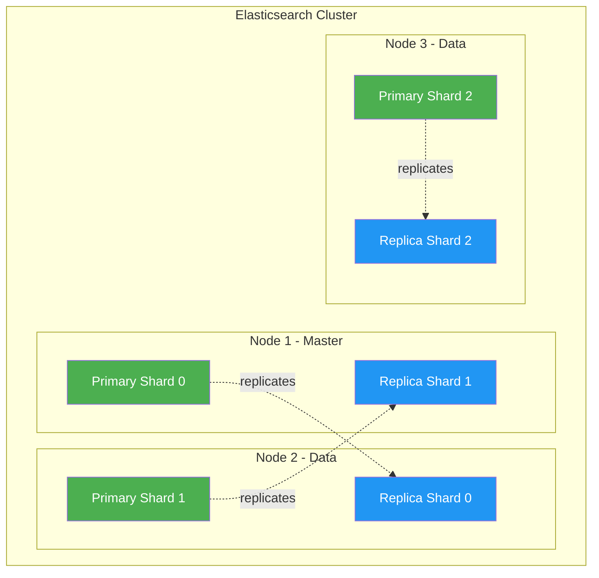
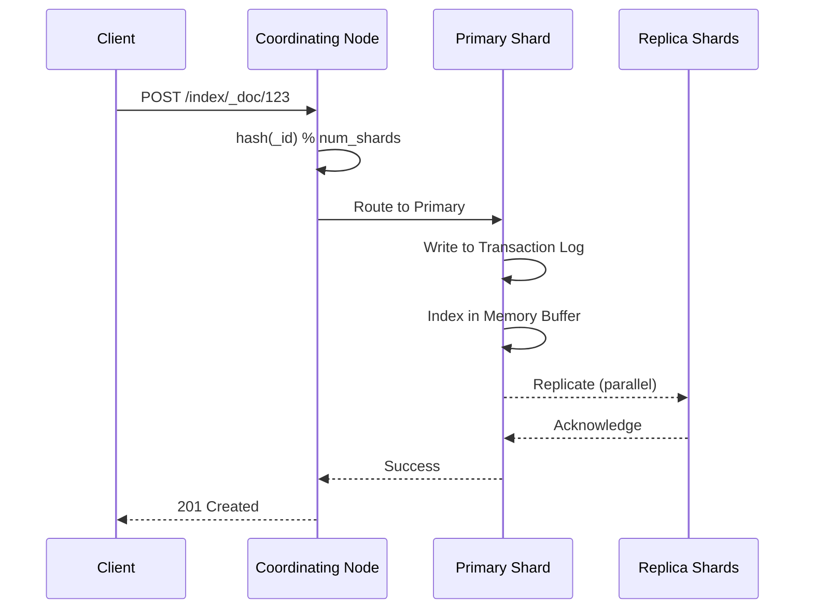
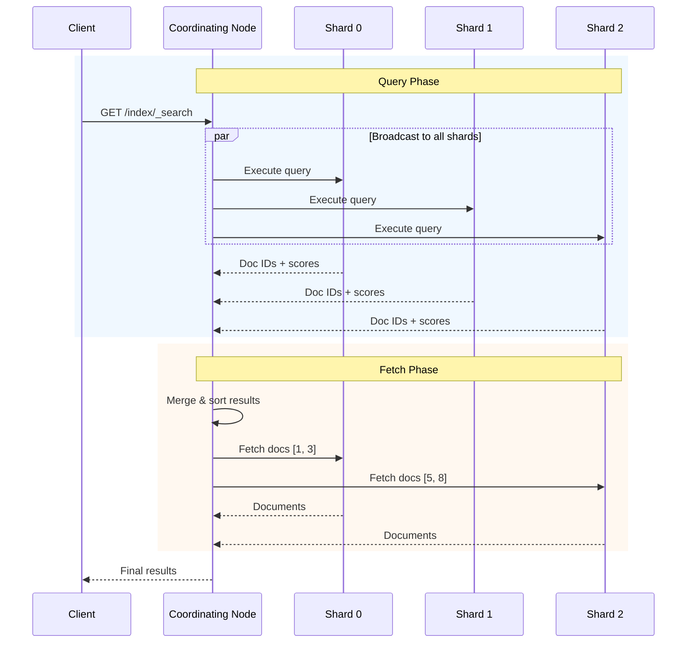

# Elasticsearch In-Depth Research

> 📘 **Level: Beginner to Intermediate** | ⏱️ **Reading Time: 45 min** | 🔗 **[← Learning Hub](./elasticsearch-deep-dive.md)** | **[Internals Guide →](./elasticsearch-internals-architecture.md)**

---

## 🗺️ Quick Navigation

| Section | What You'll Learn |
|---------|-------------------|
| [Core Concepts](#core-concepts) | Index, Document, Shard, Replica basics |
| [Architecture](#architecture) | Cluster, Node types, Shard distribution |
| [How It Works](#how-elasticsearch-works) | Indexing & Search flows |
| [Query DSL](#search--query-dsl) | Full-text, Term, Bool, Multi-match queries |
| [Aggregations](#aggregations--analytics) | Metrics, Buckets, Nested aggregations |
| [Real-World Examples](#real-world-examples) | E-commerce, Log analytics, Geo-spatial |

> [!TIP]
> **New to Elasticsearch?** Start with [Core Concepts](#core-concepts). Already familiar? Jump to [Query DSL](#search--query-dsl) or [Real-World Examples](#real-world-examples).

---

## Table of Contents
1. [Introduction](#introduction)
2. [Core Concepts](#core-concepts)
3. [Architecture](#architecture)
4. [How Elasticsearch Works](#how-elasticsearch-works)
5. [Indexing & Document Management](#indexing--document-management)
6. [Search & Query DSL](#search--query-dsl)
7. [Aggregations & Analytics](#aggregations--analytics)
8. [Cluster Management](#cluster-management)
9. [Performance Optimization](#performance-optimization)
10. [Real-World Examples](#real-world-examples)

---

## Introduction


**Elasticsearch** is a distributed, RESTful search and analytics engine built on Apache Lucene. It's designed for:
- Full-text search
- Log and event data analysis
- Real-time analytics
- Application search functionality
- Security intelligence

### Key Features
- **Distributed & Scalable**: Horizontal scaling across nodes
- **Near Real-Time**: Documents searchable ~1 second after indexing
- **Schema-Free**: Dynamic mapping (though explicit mapping recommended)
- **RESTful API**: JSON over HTTP
- **Multi-tenancy**: Multiple indices with different configurations

---

## Core Concepts

### 1. **Index**
A collection of documents with similar characteristics (like a database)

```
Example: "products", "users", "logs-2024-01"
```

### 2. **Document**
A basic unit of information, stored as JSON

```json
{
  "_index": "products",
  "_id": "1",
  "_source": {
    "name": "Laptop",
    "price": 999.99,
    "category": "electronics"
  }
}
```

### 3. **Field**
Key-value pair within a document (like columns in a database)

### 4. **Mapping**
Schema definition that defines how documents and fields are stored/indexed

```json
{
  "mappings": {
    "properties": {
      "name": { "type": "text" },
      "price": { "type": "float" },
      "category": { "type": "keyword" },
      "created_at": { "type": "date" }
    }
  }
}
```

### 5. **Shard**
A single Lucene index; an index is split into multiple shards for distribution

### 6. **Replica**
Copy of a shard for redundancy and increased search throughput

---

## Architecture

### Cluster Architecture Diagram



> 🟢 **Primary Shards** = Original data  |  🔵 **Replica Shards** = Copies for high availability

<details>
<summary>📝 ASCII Version (click to expand)</summary>

```text
┌─────────────────────────────────────────────────────────────┐
│                    ELASTICSEARCH CLUSTER                     │
│                                                              │
│  ┌────────────┐  ┌────────────┐  ┌────────────┐            │
│  │   Node 1   │  │   Node 2   │  │   Node 3   │            │
│  │  (Master)  │  │   (Data)   │  │   (Data)   │            │
│  │            │  │            │  │            │            │
│  │ ┌────────┐ │  │ ┌────────┐ │  │ ┌────────┐ │            │
│  │ │Shard P0│ │  │ │Shard P1│ │  │ │Shard R0│ │            │
│  │ │(Index A)│ │  │ │(Index A)│ │  │ │(Index A)│ │            │
│  │ └────────┘ │  │ └────────┘ │  │ └────────┘ │            │
│  │            │  │            │  │            │            │
│  │ ┌────────┐ │  │ ┌────────┐ │  │ ┌────────┐ │            │
│  │ │Shard R1│ │  │ │Shard P2│ │  │ │Shard R2│ │            │
│  │ │(Index A)│ │  │ │(Index A)│ │  │ │(Index A)│ │            │
│  │ └────────┘ │  │ └────────┘ │  │ └────────┘ │            │
│  └────────────┘  └────────────┘  └────────────┘            │
│                                                              │
│  P = Primary Shard    R = Replica Shard                     │
└─────────────────────────────────────────────────────────────┘
```

</details>


### Node Types

1. **Master Node**: Cluster management (creating/deleting indices, tracking nodes)
2. **Data Node**: Stores data and executes data-related operations
3. **Ingest Node**: Pre-processes documents before indexing
4. **Coordinating Node**: Routes requests, handles search reduce phase

### Index Structure

```
Index "products"
├── Primary Shard 0 → Replica Shard 0 (on different node)
├── Primary Shard 1 → Replica Shard 1 (on different node)
└── Primary Shard 2 → Replica Shard 2 (on different node)
```

---

## How Elasticsearch Works

### Indexing Flow



<details>
<summary>📝 Step-by-step breakdown</summary>

1. **Client Request** → POST /index/_doc/123
2. **Coordinating Node** → Determines target shard using: `hash(_id) % num_primary_shards`
3. **Routes** to Primary Shard
4. **Primary Shard** indexes document & writes to Transaction Log
5. **Replicates** to Replica Shards (in parallel)
6. **Returns** success response

</details>

### Search Flow



<details>
<summary>📝 Two-phase search explained</summary>

**Query Phase (Scatter):**
1. Client sends search query
2. Coordinating Node broadcasts to all shards
3. Each shard executes query locally
4. Returns document IDs + scores

**Fetch Phase (Gather):**
5. Coordinating Node merges/sorts results
6. Fetches actual documents from relevant shards
7. Returns final results to client

</details>


### Inverted Index Concept

```
Document 1: "The quick brown fox"
Document 2: "The lazy dog"
Document 3: "Quick brown dogs"

Inverted Index:
Term      → Document IDs
-------------------------------
quick     → [1, 3]
brown     → [1, 3]
fox       → [1]
lazy      → [2]
dog       → [2]
dogs      → [3]
the       → [1, 2]
```

---

## Indexing & Document Management

### Creating an Index

```bash
PUT /products
{
  "settings": {
    "number_of_shards": 3,
    "number_of_replicas": 2
  },
  "mappings": {
    "properties": {
      "name": {
        "type": "text",
        "analyzer": "standard"
      },
      "price": {
        "type": "float"
      },
      "tags": {
        "type": "keyword"
      },
      "description": {
        "type": "text",
        "fields": {
          "keyword": {
            "type": "keyword"
          }
        }
      },
      "created_at": {
        "type": "date",
        "format": "yyyy-MM-dd HH:mm:ss"
      }
    }
  }
}
```

### Indexing Documents

**Single Document:**
```bash
POST /products/_doc/1
{
  "name": "Gaming Laptop",
  "price": 1299.99,
  "tags": ["electronics", "gaming", "computers"],
  "description": "High-performance gaming laptop with RTX 4090",
  "created_at": "2024-01-15 10:30:00"
}
```

**Bulk Indexing:**
```bash
POST /_bulk
{ "index": { "_index": "products", "_id": "1" } }
{ "name": "Laptop", "price": 999.99, "category": "electronics" }
{ "index": { "_index": "products", "_id": "2" } }
{ "name": "Mouse", "price": 29.99, "category": "accessories" }
{ "update": { "_index": "products", "_id": "1" } }
{ "doc": { "price": 899.99 } }
{ "delete": { "_index": "products", "_id": "3" } }
```

### Updating Documents

**Partial Update:**
```bash
POST /products/_update/1
{
  "doc": {
    "price": 1199.99
  }
}
```

**Script Update:**
```bash
POST /products/_update/1
{
  "script": {
    "source": "ctx._source.price *= params.discount",
    "params": {
      "discount": 0.9
    }
  }
}
```

### Deleting Documents

```bash
DELETE /products/_doc/1
```

---

## Search & Query DSL

### Basic Search

**Match All:**
```bash
GET /products/_search
{
  "query": {
    "match_all": {}
  }
}
```

**Match Query (Full-text):**
```bash
GET /products/_search
{
  "query": {
    "match": {
      "name": "gaming laptop"
    }
  }
}
```

### Term-Level Queries

**Exact Match:**
```bash
GET /products/_search
{
  "query": {
    "term": {
      "category.keyword": "electronics"
    }
  }
}
```

**Range Query:**
```bash
GET /products/_search
{
  "query": {
    "range": {
      "price": {
        "gte": 500,
        "lte": 1500
      }
    }
  }
}
```

### Compound Queries

**Bool Query:**
```bash
GET /products/_search
{
  "query": {
    "bool": {
      "must": [
        { "match": { "name": "laptop" } }
      ],
      "filter": [
        { "range": { "price": { "lte": 1000 } } },
        { "term": { "tags": "gaming" } }
      ],
      "should": [
        { "match": { "description": "RTX" } }
      ],
      "must_not": [
        { "term": { "discontinued": true } }
      ]
    }
  }
}
```

**Bool Query Logic:**
- `must`: Conditions that MUST match (affects scoring)
- `filter`: Conditions that MUST match (no scoring, cacheable)
- `should`: Nice to have (affects scoring if matched)
- `must_not`: Must NOT match

### Advanced Search Features

**Multi-field Search:**
```bash
GET /products/_search
{
  "query": {
    "multi_match": {
      "query": "gaming laptop",
      "fields": ["name^2", "description", "tags"],
      "type": "best_fields"
    }
  }
}
```

**Fuzzy Search (typo tolerance):**
```bash
GET /products/_search
{
  "query": {
    "fuzzy": {
      "name": {
        "value": "laptpo",
        "fuzziness": "AUTO"
      }
    }
  }
}
```

**Wildcard Search:**
```bash
GET /products/_search
{
  "query": {
    "wildcard": {
      "name": "lap*"
    }
  }
}
```

**Highlighting:**
```bash
GET /products/_search
{
  "query": {
    "match": { "description": "gaming" }
  },
  "highlight": {
    "fields": {
      "description": {}
    }
  }
}
```

### Pagination

```bash
GET /products/_search
{
  "from": 0,
  "size": 10,
  "query": { "match_all": {} }
}
```

**Search After (for deep pagination):**
```bash
GET /products/_search
{
  "size": 10,
  "query": { "match_all": {} },
  "sort": [
    { "price": "asc" },
    { "_id": "asc" }
  ],
  "search_after": [999.99, "product_123"]
}
```

---

## Aggregations & Analytics

### Metrics Aggregations

**Average Price:**
```bash
GET /products/_search
{
  "size": 0,
  "aggs": {
    "avg_price": {
      "avg": { "field": "price" }
    }
  }
}
```

**Stats:**
```bash
GET /products/_search
{
  "size": 0,
  "aggs": {
    "price_stats": {
      "stats": { "field": "price" }
    }
  }
}
```

### Bucket Aggregations

**Terms Aggregation (Group by category):**
```bash
GET /products/_search
{
  "size": 0,
  "aggs": {
    "categories": {
      "terms": {
        "field": "category.keyword",
        "size": 10
      }
    }
  }
}
```

**Histogram (Price ranges):**
```bash
GET /products/_search
{
  "size": 0,
  "aggs": {
    "price_ranges": {
      "histogram": {
        "field": "price",
        "interval": 500
      }
    }
  }
}
```

**Date Histogram (Time series):**
```bash
GET /logs/_search
{
  "size": 0,
  "aggs": {
    "sales_over_time": {
      "date_histogram": {
        "field": "created_at",
        "calendar_interval": "day"
      }
    }
  }
}
```

### Nested Aggregations

```bash
GET /products/_search
{
  "size": 0,
  "aggs": {
    "categories": {
      "terms": { "field": "category.keyword" },
      "aggs": {
        "avg_price": {
          "avg": { "field": "price" }
        },
        "price_ranges": {
          "range": {
            "field": "price",
            "ranges": [
              { "to": 100 },
              { "from": 100, "to": 500 },
              { "from": 500 }
            ]
          }
        }
      }
    }
  }
}
```

---

## Cluster Management

### Cluster Health

```bash
GET /_cluster/health

Response:
{
  "cluster_name": "my-cluster",
  "status": "green",  # green | yellow | red
  "number_of_nodes": 3,
  "number_of_data_nodes": 3,
  "active_primary_shards": 15,
  "active_shards": 30,
  "relocating_shards": 0,
  "initializing_shards": 0,
  "unassigned_shards": 0
}
```

**Status Meanings:**
- **Green**: All shards allocated
- **Yellow**: All primary shards allocated, some replicas missing
- **Red**: Some primary shards not allocated (data loss risk)

### Node Information

```bash
GET /_cat/nodes?v

Response:
ip            heap.percent ram.percent cpu load_1m role   master name
192.168.1.1   45           75          5   0.12    mdi    *      node-1
192.168.1.2   38           65          3   0.08    di     -      node-2
192.168.1.3   42           70          4   0.10    di     -      node-3
```

### Index Management

**List Indices:**
```bash
GET /_cat/indices?v
```

**Close/Open Index:**
```bash
POST /products/_close
POST /products/_open
```

**Reindex:**
```bash
POST /_reindex
{
  "source": { "index": "products_old" },
  "dest": { "index": "products_new" }
}
```

### Shard Allocation

```bash
GET /_cat/shards?v

Response:
index     shard prirep state   docs  store ip            node
products  0     p      STARTED 1000  5.2mb 192.168.1.1   node-1
products  0     r      STARTED 1000  5.2mb 192.168.1.2   node-2
products  1     p      STARTED 950   4.8mb 192.168.1.2   node-2
products  1     r      STARTED 950   4.8mb 192.168.1.3   node-3
```

---

## Performance Optimization

### Indexing Performance

1. **Bulk Operations**: Always use `_bulk` API for multiple documents
2. **Disable Refresh During Bulk**: 
   ```bash
   PUT /products/_settings
   {
     "index": {
       "refresh_interval": "-1"
     }
   }
   ```
   Re-enable after: `"refresh_interval": "1s"`

3. **Increase Indexing Buffer**:
   ```bash
   PUT /_cluster/settings
   {
     "transient": {
       "indices.memory.index_buffer_size": "20%"
     }
   }
   ```

### Search Performance

1. **Use Filter Context**: Filters are cached
   ```bash
   "bool": {
     "filter": [  # Cached, faster
       { "term": { "status": "active" } }
     ]
   }
   ```

2. **Limit Fields Returned**:
   ```bash
   GET /products/_search
   {
     "_source": ["name", "price"],
     "query": { "match_all": {} }
   }
   ```

3. **Use Routing**: Co-locate related documents
   ```bash
   POST /products/_doc/1?routing=user123
   ```

4. **Tune Shard Count**: 
   - **Too many shards**: Overhead increases
   - **Too few shards**: Can't distribute load
   - Rule of thumb: 20-40GB per shard

### Mapping Optimization

**Disable indexing for non-searchable fields:**
```json
{
  "mappings": {
    "properties": {
      "metadata": {
        "type": "object",
        "enabled": false
      }
    }
  }
}
```

**Use `keyword` for exact matches:**
```json
{
  "category": {
    "type": "keyword"
  }
}
```

**Multi-fields for different use cases:**
```json
{
  "name": {
    "type": "text",
    "fields": {
      "keyword": { "type": "keyword" },
      "english": { "type": "text", "analyzer": "english" }
    }
  }
}
```

---

## Real-World Examples

### Example 1: E-commerce Product Search

**Index Setup:**
```bash
PUT /ecommerce_products
{
  "settings": {
    "number_of_shards": 5,
    "number_of_replicas": 1,
    "analysis": {
      "analyzer": {
        "autocomplete": {
          "tokenizer": "autocomplete_tokenizer",
          "filter": ["lowercase"]
        }
      },
      "tokenizer": {
        "autocomplete_tokenizer": {
          "type": "edge_ngram",
          "min_gram": 2,
          "max_gram": 10,
          "token_chars": ["letter", "digit"]
        }
      }
    }
  },
  "mappings": {
    "properties": {
      "name": {
        "type": "text",
        "analyzer": "autocomplete",
        "fields": {
          "keyword": { "type": "keyword" }
        }
      },
      "description": { "type": "text" },
      "price": { "type": "float" },
      "category": { "type": "keyword" },
      "brand": { "type": "keyword" },
      "tags": { "type": "keyword" },
      "rating": { "type": "float" },
      "in_stock": { "type": "boolean" },
      "created_at": { "type": "date" }
    }
  }
}
```

**Search with Filters & Aggregations:**
```bash
GET /ecommerce_products/_search
{
  "query": {
    "bool": {
      "must": [
        {
          "multi_match": {
            "query": "wireless headphones",
            "fields": ["name^3", "description", "tags^2"]
          }
        }
      ],
      "filter": [
        { "range": { "price": { "lte": 200 } } },
        { "term": { "in_stock": true } },
        { "terms": { "brand": ["Sony", "Bose", "JBL"] } }
      ]
    }
  },
  "sort": [
    { "rating": { "order": "desc" } },
    { "_score": { "order": "desc" } }
  ],
  "aggs": {
    "brands": {
      "terms": { "field": "brand", "size": 10 }
    },
    "price_ranges": {
      "range": {
        "field": "price",
        "ranges": [
          { "key": "Under $50", "to": 50 },
          { "key": "$50-$100", "from": 50, "to": 100 },
          { "key": "$100-$200", "from": 100, "to": 200 },
          { "key": "Over $200", "from": 200 }
        ]
      }
    },
    "avg_rating": {
      "avg": { "field": "rating" }
    }
  },
  "from": 0,
  "size": 20
}
```

### Example 2: Log Analytics

**Index Template for Daily Logs:**
```bash
PUT /_index_template/logs_template
{
  "index_patterns": ["logs-*"],
  "template": {
    "settings": {
      "number_of_shards": 3,
      "number_of_replicas": 1,
      "index.lifecycle.name": "logs_policy"
    },
    "mappings": {
      "properties": {
        "timestamp": { "type": "date" },
        "level": { "type": "keyword" },
        "message": { "type": "text" },
        "service": { "type": "keyword" },
        "host": { "type": "keyword" },
        "user_id": { "type": "keyword" },
        "response_time": { "type": "float" },
        "status_code": { "type": "integer" },
        "ip": { "type": "ip" }
      }
    }
  }
}
```

**Query Errors in Last 24 Hours:**
```bash
GET /logs-*/_search
{
  "query": {
    "bool": {
      "must": [
        { "term": { "level": "ERROR" } },
        {
          "range": {
            "timestamp": {
              "gte": "now-24h"
            }
          }
        }
      ]
    }
  },
  "aggs": {
    "errors_by_service": {
      "terms": { "field": "service", "size": 10 },
      "aggs": {
        "error_timeline": {
          "date_histogram": {
            "field": "timestamp",
            "calendar_interval": "hour"
          }
        }
      }
    },
    "top_error_messages": {
      "terms": { "field": "message.keyword", "size": 5 }
    }
  }
}
```

### Example 3: Geo-spatial Search

**Index with Geo-point:**
```bash
PUT /restaurants
{
  "mappings": {
    "properties": {
      "name": { "type": "text" },
      "location": { "type": "geo_point" },
      "cuisine": { "type": "keyword" },
      "rating": { "type": "float" }
    }
  }
}
```

**Index Restaurant:**
```bash
POST /restaurants/_doc/1
{
  "name": "Pizza Palace",
  "location": {
    "lat": 40.7128,
    "lon": -74.0060
  },
  "cuisine": "Italian",
  "rating": 4.5
}
```

**Search Within Radius:**
```bash
GET /restaurants/_search
{
  "query": {
    "bool": {
      "must": [
        { "match": { "cuisine": "Italian" } }
      ],
      "filter": {
        "geo_distance": {
          "distance": "5km",
          "location": {
            "lat": 40.7128,
            "lon": -74.0060
          }
        }
      }
    }
  },
  "sort": [
    {
      "_geo_distance": {
        "location": {
          "lat": 40.7128,
          "lon": -74.0060
        },
        "order": "asc",
        "unit": "km"
      }
    }
  ]
}
```

---

## Best Practices Summary

### Data Modeling
1. **Denormalize data**: Elasticsearch isn't relational; embed related data
2. **Use appropriate field types**: `text` for full-text, `keyword` for exact match
3. **Plan shard strategy**: Number of shards can't be changed later without reindexing

### Performance
1. **Bulk operations**: Use `_bulk` for multiple documents
2. **Filter over query**: Filters are cached and faster
3. **Limit `_source` fields**: Only retrieve needed fields
4. **Use routing**: For multi-tenant data

### Operations
1. **Monitor cluster health**: Set up alerts for yellow/red status
2. **Regular backups**: Use snapshots
3. **Index lifecycle management**: Automate rollover, delete old data
4. **Hardware**: SSD for speed, plenty of RAM for caching

### Security
1. **Enable authentication**: Use Elastic Stack security features
2. **Use HTTPS**: Encrypt data in transit
3. **Role-based access**: Limit permissions per user/application
4. **Audit logging**: Track who accessed what

---

## Useful Resources

- **Official Docs**: https://www.elastic.co/guide/en/elasticsearch/reference/current/index.html
- **Query DSL Reference**: https://www.elastic.co/guide/en/elasticsearch/reference/current/query-dsl.html
- **Kibana** (Visualization): https://www.elastic.co/kibana
- **Logstash** (Data Pipeline): https://www.elastic.co/logstash
- **Beats** (Data Shippers): https://www.elastic.co/beats

---

**Document created:** 2026-02-09
**For:** Research on Elasticsearch architecture, concepts, and usage
