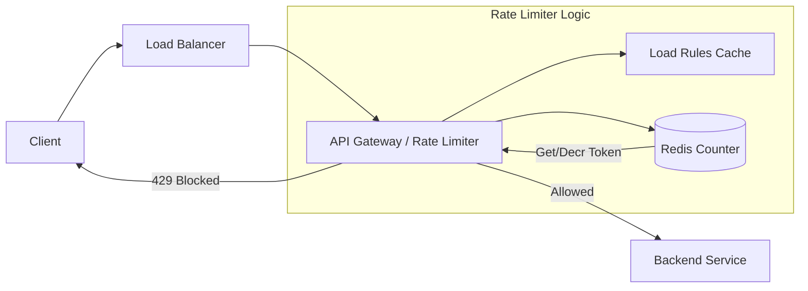

[🏠 Home](../README.md) | [⬅️ 06 URL Shortener](./06-url-shortener.md) | [➡️ 08 ID Generator](./08-unique-id-generator.md)

# 🛑 System Design: Rate Limiter

> Design a service to throttle traffic based on user ID, IP, or API key.

---

## 📊 Quick Reference Card

| Aspect | Decision |
|--------|----------|
| **Placement** | Middleware / API Gateway / Sidecar |
| **Storage** | In-Memory Cache (Redis) |
| **Algorithm** | Token Bucket (Standard) or Sliding Window (Strict precision) |
| **Performance** | Low Latency (< 10ms added overhead) |
| **Communication** | HTTP Headers (`429 Too Many Requests`) |
| **Distributed** | Redis with Lua Scripts (Atomic operations) |

---

## 📋 Table of Contents
1. [Functional Requirements](#-functional-requirements)
2. [Algorithms (The Core)](#-algorithms)
3. [High-Level Architecture](#-high-level-architecture)
4. [Distributed Rate Limiting](#-distributed-rate-limiting)
5. [Deep Dives](#-deep-dives)

---

## ✅ Functional Requirements

| Feature | Description | Priority |
|---------|-------------|----------|
| **Throttling** | Limit X requests per Y seconds | P0 |
| **Granularity** | Limit by User ID, IP Address, or API Key | P0 |
| **Feedback** | Inform client of limit status (Headers) | P1 |
| **Distributed** | Work across multiple servers globally | P1 |

---

## 🧠 Algorithms

### 1. Token Bucket 🪣 (Most Common)
*   **Concept**: A bucket holds `N` tokens. Tokens refill at `R` rate per second. Each request consumes 1 token.
*   **Pros**: Allows bursts of traffic (up to bucket size). Memory efficient.
*   **Cons**: Slight complexity in refill logic.
*   **Used By**: Amazon, Stripe.

### 2. Leaky Bucket 💧
*   **Concept**: Requests enter a queue (bucket). They are processed at a constant fixed rate (leak). If queue is full, discard.
*   **Pros**: Smooths out traffic spikes (stable outflow).
*   **Cons**: Bursts are lost/delayed.
*   **Used By**: Shopify (queue processing).

### 3. Fixed Window Counter 🪟
*   **Concept**: Count requests in 1-minute windows (e.g., 10:00-10:01).
*   **Pros**: Very simple memory (just an integer).
*   **Cons**: **Edge Case**: If 10 requests come at 10:00:59 and 10 at 10:01:01, you allow 20 requests in 2 seconds (spike allowed at boundary).

### 4. Sliding Window Log 📜
*   **Concept**: Keep a timestamp of every request in a sorted set. Count how many are within the last window.
*   **Pros**: Perfectly accurate.
*   **Cons**: High memory usage (stores every timestamp).

### 5. Sliding Window Counter 🧮 (Hybrid)
*   **Concept**: Weighted average of previous window and current window.
*   **Formula**: `Requests = Current_Counter + Previous_Counter * (Overlap_Percentage)`
*   **Pros**: Memory efficient and handles boundary spikes well.

---

## 🔌 API Headers

When a user makes a request, the Rate Limiter adds headers:

```http
HTTP/1.1 200 OK
X-Ratelimit-Limit: 100        (Window size)
X-Ratelimit-Remaining: 25     (Tokens left)
X-Ratelimit-Reset: 1640995200 (Timestamp when limit resets)
```

If limit exceeded:
```http
HTTP/1.1 429 Too Many Requests
Retry-After: 30
```

---

## 🏛️ High-Level Architecture



---

## 🌐 Distributed Rate Limiting

**The Problem**: In a distributed system with 10 API Gateway servers, if each tracks limits locally, the total traffic allowed is $10 \times \text{Limit}$. We must verify against a **central store** (Redis).

**Race Conditions:**
*   Thread A reads counter: 9
*   Thread B reads counter: 9
*   Thread A increments: 10
*   Thread B increments: 10
*   *Result*: Both allowed, but limit was 10. Actual calls: 11.

**The Solution: Lua Scripts**
Redis allows executing Lua scripts atomically. We can combine "Read-Check-Increment" into a single atomic operation.

```lua
-- Simple Token Bucket in Lua
local tokens_key = KEYS[1]
local timestamp_key = KEYS[2]
local capacity = tonumber(ARGV[1])
local refill_rate = tonumber(ARGV[2])
local now = tonumber(ARGV[3])
local requested = tonumber(ARGV[4])

-- Logic to calculate refill based on time difference 
-- ... (omitted for brevity)
```

---

## 🔍 Deep Dives

### Where to run the Rate Limiter?
1.  **Client-Side**: Unreliable (can be forged).
2.  **Server-Side (In-App)**: Hard to scale cleanly. Limits coupled with business logic.
3.  **Middleware / Gateway (Preferred)**: Centralized (Kong, Zuul, Nginx).
4.  **Sidecar (Service Mesh)**: Good for microservice-to-microservice throttling (Istio).

### Hard vs Soft Throttling
*   **Hard Throttling**: 429 immediately. Good for security (DDoS).
*   **Soft Throttling**: Allow overage for a brief period or "shape" traffic (delay it slightly) instead of blocking. Good for user experience.

---

## 🧠 Interview Questions

1.  **Q**: How to handle a huge burst of traffic that overwhelms Redis?
    *   **A**: Use local memory caching for extremely hot keys (approximate counting) or shard Redis cluster. If Redis dies, fail **open** (allow traffic) to preserve availability, unless security is paramount.
2.  **Q**: How to rate limit by IP when users are behind a shared NAT?
    *   **A**: IP-based limiting is flawed for this reason. Better to limit by `API_Key` or `User_ID`. IP limiting is a fallback for unauthenticated endpoints (login).

---
