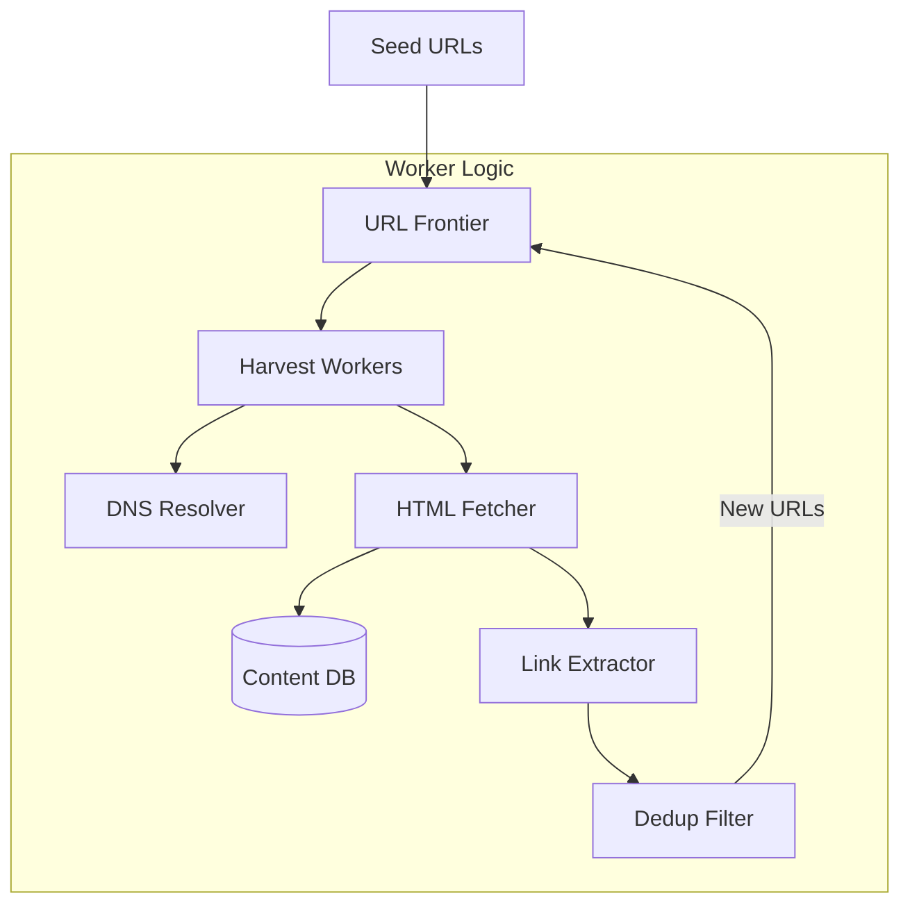
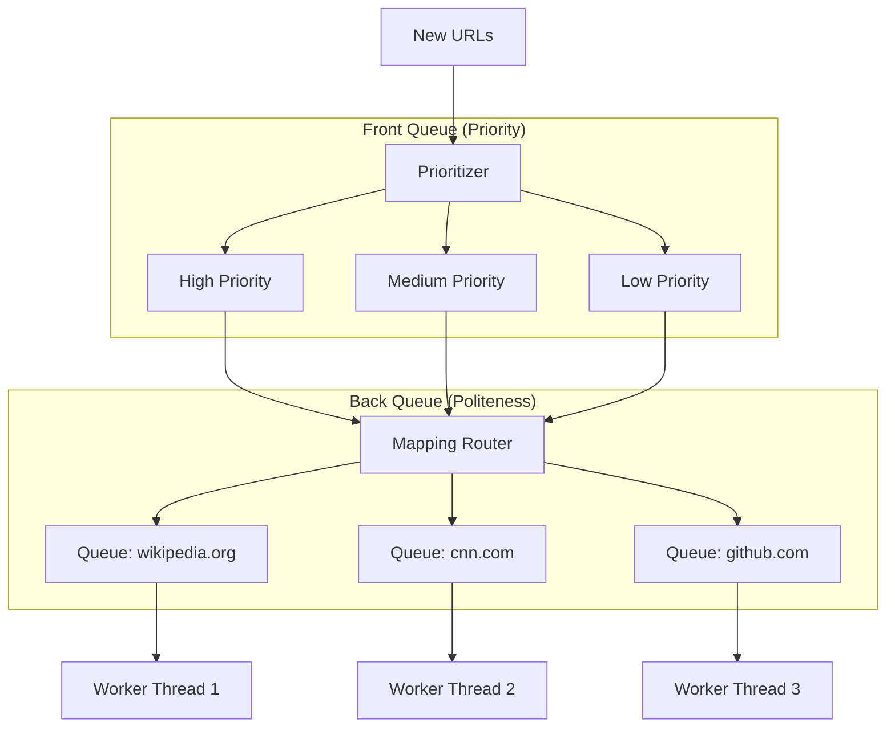

[🏠 Home](../README.md) | [⬅️ 08 ID Generator](./08-unique-id-generator.md) | [➡️ 10 Notification System](./10-notification-system.md)

# 🕷️ System Design: Web Crawler

> Design a scalable web crawler (like Googlebot) to index 1 billion pages.

---

## 📊 Quick Reference Card

| Aspect | Decision |
|--------|----------|
| **Traversal** | BFS (Breadth-First Search) for wide coverage |
| **Protocol** | HTTP/HTTPS (Respect `robots.txt`) |
| **Parsing** | DOM Parser (Extract Links + Text) |
| **Storage** | BigTable / HBase (Content) |
| **Queue** | URL Frontier (Kafka/Redis) |
| **Deduplication** | Bloom Filters (URLs) + SimHash (Content) |
| **Politeness** | Limit requests per domain (Delay queues) |

---

## 📋 Table of Contents
1. [Functional Requirements](#-functional-requirements)
2. [Back-of-the-Envelope Estimation](#-back-of-the-envelope-estimation)
3. [Core Logic: DFS vs BFS](#-core-logic-dfs-vs-bfs)
4. [High-Level Architecture](#-high-level-architecture)
5. [The URL Frontier](#-the-url-frontier)
6. [Deep Dives](#-deep-dives)

---

## ✅ Functional Requirements

| Feature | Description | Priority |
|---------|-------------|----------|
| **Crawl** | Fetch pages given a seed URL | P0 |
| **Parse** | Extract hyperlinks and content | P0 |
| **Store** | Save HTML/Text for indexing | P0 |
| **Politeness** | Do not DDoS servers; respect rules | P0 |
| **Recrawl** | Update stale pages periodically | P1 |

---

## 📈 Back-of-the-Envelope Estimation

*   **Target**: 1 Billion Pages per month.
*   **QPS**:
    *   30 days $\approx 2.5 \times 10^6$ seconds.
    *   $10^9 / 2.5 \times 10^6 \approx 400$ pages/sec.
    *   *Peak*: Allow $1000+$ pages/sec.
*   **Storage**:
    *   Avg page size: 500KB.
    *   Total: $1B \times 500KB = 500 \text{ TB}$ per month.
    *   *Need*: Compressed storage (S3/HDFS/BigTable).

---

## 🛣️ Core Logic: DFS vs BFS

*   **DFS (Depth First)**: Go deep into one site (`a.com/1` -> `a.com/1/foo` -> `a.com/1/foo/bar`).
    *   *Problem*: Gets stuck in "Spider Traps" (infinite recursive links).
*   **BFS (Breadth First)**: Crawl neighbors first.
    *   *Pros*: Natural for "Internet coverage". Prioritizes high-level pages.
    *   *Verdict*: **Use BFS**.

---

## 🏛️ High-Level Architecture

### Components
1.  **Seed URLs**: Starting points (e.g., cnn.com, wikipedia.org).
2.  **URL Frontier**: The brain. Decides *what* to crawl next.
3.  **HTML Fetcher**: Downloads pages.
4.  **DNS Resolver**: Caches IP addresses (bottleneck optimization).
5.  **Dedup Filter**: Checks if URL/Content already seen.
6.  **Content DB**: Stores the result.

---

## 🚧 The URL Frontier (The Hard Part)

The Frontier isn't just a simple FIFO queue. It must handle **Priority** and **Politeness**.

### Architecture: Split Queues

1.  **Prioritizer**: Sorts URLs by importance (PageRank, frequency of updates).
2.  **Router**: Ensures all URLs for `wikipedia.org` go to the **same** Back Queue.
3.  **Politeness**: Worker 1 processes `wikipedia.org`. After fetching one page, it **waits** (e.g., 2 seconds) before fetching the next from `BQ1`.

---

## 🔍 Deep Dives

### 1. Handling Spider Traps
*   **Infinite Loops**: `example.com/calendar/next_month/next_month...`
*   **Fix**:
    *   Limit max URL length.
    *   Limit max depth from seed.
    *   Bloom Filters to detect cycles.

### 2. DNS Resolution
*   DNS is slow (10ms - 200ms).
*   **Optimization**: Maintain a massive customized DNS cache. Do not rely on OS DNS.

### 3. Content Deduplication
*   **URL Dedup**: `example.com?a=1&b=2` vs `example.com?b=2&a=1`. Normalize parameters.
*   **Content Dedup**:
    *   30% of web pages are duplicates.
    *   **SimHash**: Fingerprint the content. If Hamming Distance between two hashes is small, pages are near-duplicates.

---

## 🧠 Interview Questions

1.  **Q**: How to handle robots.txt?
    *   **A**: Fetch `domain.com/robots.txt` first. Cache it. Check every URL against rules before creating a fetch task.
2.  **Q**: How to crawl dynamic content (React/Angular)?
    *   **A**: Simple HTTP request gets empty HTML. Requires **Headless Browser** (Puppeteer/Selenium) to render JS. This is 100x slower/more expensive.
3.  **Q**: How to detect updated content?
    *   **A**: Track `Last-Modified` header. Adapt crawl frequency based on history (e.g., news sites = hourly, static blogs = monthly).

---
