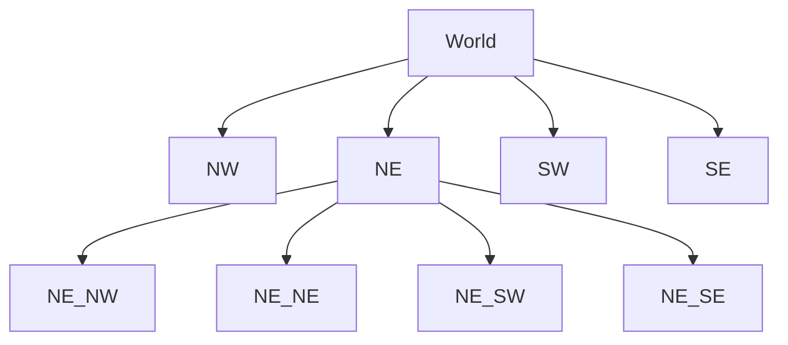
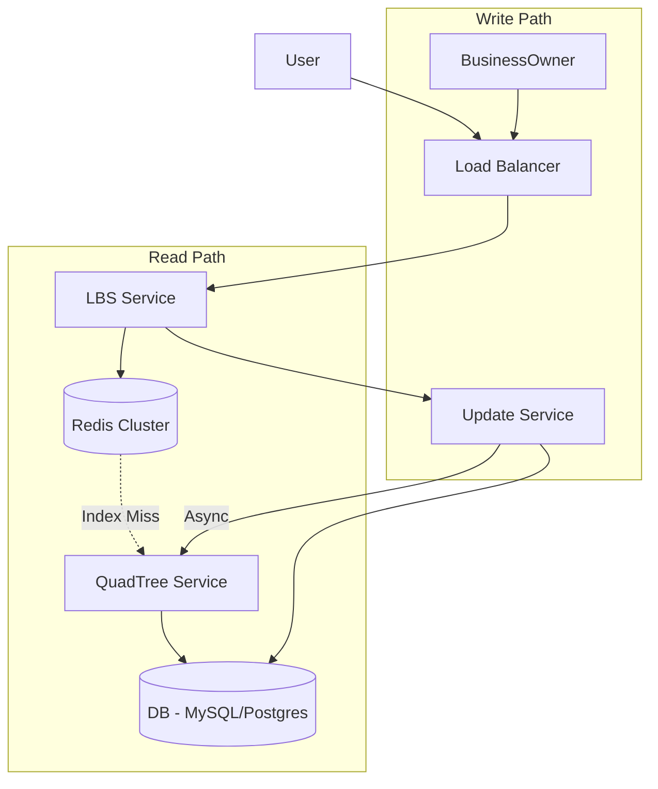

[🏠 Home](../README.md) | [⬅️ 11 E-Commerce](./11-ecommerce.md) | [➡️ 13 Google Docs](./13-google-docs.md)

# 📍 System Design: Location Based Service (Yelp/Google Maps)

> Design a backend to find "Nearby Restaurants" or track "Drivers Nearby".

---

## 📊 Quick Reference Card

| Aspect | Decision |
|--------|----------|
| **Indexing** | QuadTree or Geohash (Google S2) |
| **Database** | Postgres (PostGIS) or NoSQL (Cassandra/DynamoDB) |
| **Query** | k-Nearest Neighbors (k-NN) / Radius Search |
| **Partitioning** | Shard by Region (not User ID) |
| **Updates** | Batch updates for static places; Real-time for drivers |

---

## 📋 Table of Contents
1. [Functional Requirements](#-functional-requirements)
2. [The Challenge of SQL](#-the-challenge-of-sql)
3. [Geospatial Indexing](#-geospatial-indexing)
4. [High-Level Architecture](#-high-level-architecture)
5. [Scale & Sharding](#-scale--sharding)

---

## ✅ Functional Requirements

| Feature | Description | Priority |
|---------|-------------|----------|
| **Add Place** | Register a new business/driver location (Lat/Long) | P0 |
| **Search Nearby** | "Find coffee shops within 2km" | P0 |
| **View Details** | Get metadata (Reviews, Menu) | P1 |
| **Scale** | 500M places, 100k queries/sec | P0 |

---

## 🐢 The Challenge of SQL

Standard SQL is bad at "2D" range queries.

```sql
SELECT * FROM Places 
WHERE lat BETWEEN x1 AND x2 
AND long BETWEEN y1 AND y2
```

**Why it fails**:
*   Indexes usually work on *one* column.
*   You can index `lat`, or `long`, but intersecting two B-Trees is inefficient.
*   We need a data structure that preserves **locality** (nearby points should be close in memory).

---

## 🗺️ Geospatial Indexing

### 1. Geohash (Base32 String)
*   **Concept**: Divide world into a grid. Sub-divide grids recursively.
*   **Representation**: A string. `9q8yy` is a sub-region of `9q8y`.
*   **Locality**: Places with common prefixes are close together.
*   **Searching**: `SELECT * FROM Table WHERE geohash LIKE '9q8%'`.
*   **Problem**: Edge cases. Two very close points might have completely different hashes if they straddle a boundary (e.g., Prime Meridian).

### 2. QuadTree 🌳 (Preferred for dynamic updates)
*   **Concept**: A Tree where every node has exactly 4 children (NW, NE, SW, SE).
*   **Logic**:
    *   Start with whole world.
    *   If a node has > 100 places, split it into 4 quadrants.
*   **Search**: Traverse tree. Identify which leaf nodes intersect your search radius.



---

## 🏛️ High-Level Architecture



---

## ⚙️ Partitioning / Sharding

### Shard by Region (Zip Code / City)
*   **Pros**: Queries deal with one shard. Fast.
*   **Cons**: **Hot Shards**. "New York" shard will melt; "North Dakota" shard will be empty. (Uneven distribution).

### Shard by Place ID (Consistent Hashing)
*   **Pros**: Perfectly even distribution.
*   **Cons**: "Find nearby" requires querying **ALL** shards and aggregating. Slow.

### Verdict: Hybrid
*   Shard by Region (S2 Cell ID).
*   Split dense regions (NYC) into smaller sub-cells recursively until load is balanced.

---

## 🧠 Interview Questions

1.  **Q**: How to handle a moving user (e.g., Live Tracking)?
    *   **A**: Do not write to DB every second.
    *   1. Update local Redis cache (`Driver:Location`).
    *   2. Flush to DB only every 15-30 seconds.
    *   3. Use a "Gossip Protocol" or ephemeral PubSub if clients just need to see each other (gaming).
2.  **Q**: Google Maps finds route A to B. How?
    *   **A**: This is Graph Theory, not just LBS. Use **A* (A-Star)** or **Dijkstra's Algorithm** on a weighted graph (Edges = Roads, Weights = Traffic/Distance).
3.  **Q**: How to store Geohashes in DB efficiently?
    *   **A**: INTEGER. Convert the Base32 string to a 64-bit integer. B-Tree indexes work faster on Ints than Strings.

---
