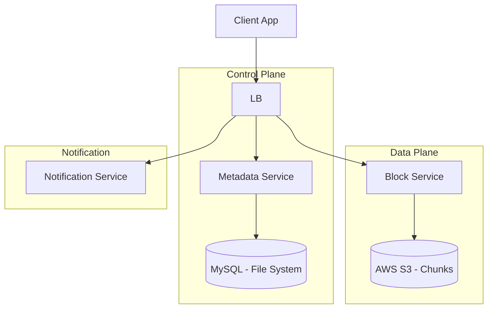

[🏠 Home](../README.md) | [⬅️ 15 Distributed Cache](./15-distributed-cache.md) | [➡️ 17 Gaming Leaderboard](./17-gaming-leaderboard.md)

# ☁️ System Design: Cloud Storage (Google Drive / Dropbox)

> Design a file hosting service for syncing files across devices.

---

## 📊 Quick Reference Card

| Aspect | Decision |
|--------|----------|
| **Storage (Metadata)** | SQL (MySQL) - ACID needed for hierarchy |
| **Storage (Blobs)** | Object Storage (S3) |
| **Processing** | Client-side Chunking & Deduplication |
| **Transfer** | Block-level sync (Delta Sync) |
| **Notification** | Long Polling / WebSockets |

---

## 📋 Table of Contents
1. [Functional Requirements](#-functional-requirements)
2. [High-Level Architecture](#-high-level-architecture)
3. [The Magic: Chunking & Deduplication](#-the-magic-chunking--deduplication)
4. [Metadata Database](#-metadata-database)
5. [Synchronization Flow](#-synchronization-flow)

---

## ✅ Functional Requirements

| Feature | Description | Priority |
|---------|-------------|----------|
| **Upload/Download** | Sync files reliably | P0 |
| **Versioning** | Keep history of changes | P1 |
| **Sharing** | Share files via link | P1 |
| **Offline** | Allow local edits, sync when online | P1 |

---

## 🏛️ High-Level Architecture

Separate **Metadata** (File name, folder structure) from **Block Data** (Content).

---

## 🪄 The Magic: Chunking & Deduplication

We do NOT upload the whole file every time.

### 1. Chunking
Split a 1GB file into 4MB chunks.
*   **Result**: File = `[ChunkA, ChunkB, ChunkC, ChunkD]`

### 2. Deduplication (Client-Side)
Before uploading `ChunkA`:
1.  Calculate Hash (SHA-256) of `ChunkA`.
2.  Ask Server: "Do you have hash `abc123`?"
3.  Server: "Yes." (Maybe another user uploaded the same movie).
4.  Client: "Okay, I won't upload bytes. Just link my file object to `abc123`."

**Result**: Massive bandwidth and storage saving.

### 3. Delta Sync
If you edit 1 byte in a 1GB file:
*   Only **one** 4MB chunk changes hash.
*   Client uploads only that 1 new chunk.

---

## 💾 Metadata Database

We need to store the directory tree.
*   **NoSQL?** No. Moving a folder needs ACID (atomic move of subtree).
*   **SQL Schema**:

**Table: Files**
| id | name | is_folder | parent_id | latest_version | checksum |
|:---|:---|:---|:---|:---|:---|
| 10 | Photos | true | NULL | - | - |
| 11 | cat.png | false | 10 | 5 | (hash) |

**Table: Versions**
| file_id | version | chunks_order |
|:---|:---|:---|
| 11 | 5 | `[chunk_hash_1, chunk_hash_2]` |

---

## 🔄 Synchronization Flow

**Scenario**: User A adds `foo.txt`. User B needs to see it.

1.  **User A Client**:
    *   Detects change (File Watcher).
    *   Chunks file. Checks dedup. Uploads new chunks to S3.
    *   Calls Metadata Service: "Create `foo.txt`, parent=root, chunks=[hash1]".
2.  **Metadata Service**:
    *   Updates MySQL.
    *   Sends event to Notification Service ("Change in Root Folder").
3.  **Notification Service**:
    *   Finds all active clients watching User A's root.
    *   Sends "Sync Trigger".
4.  **User B Client**:
    *   Receives trigger.
    *   Calls Metadata Service: "What changed?"
    *   Downloads only new chunks from S3.
    *   Reconstructs file locally.

---

## 🧠 Interview Questions

1.  **Q**: Single Block vs Variable Size Chunking?
    *   **A**:
        *   **Fixed Size**: Fast, simple. Bad if you insert 1 byte at start (shifts all chunk boundaries).
        *   **Rolling Hash (Rabin-Karp)**: Finds boundaries based on content. Resilient to insertions. (Used by rsync/Dropbox).
2.  **Q**: Consistency?
    *   **A**: Strong Consistency for Metadata (ACID). Eventual Consistency for Block propagation (it takes time for S3 to replicate).
3.  **Q**: How to save storage costs?
    *   **A**: **Cold Storage**. Move old versions (v1, v2) to AWS Glacier (cheaper, slower access) after 30 days.

---
