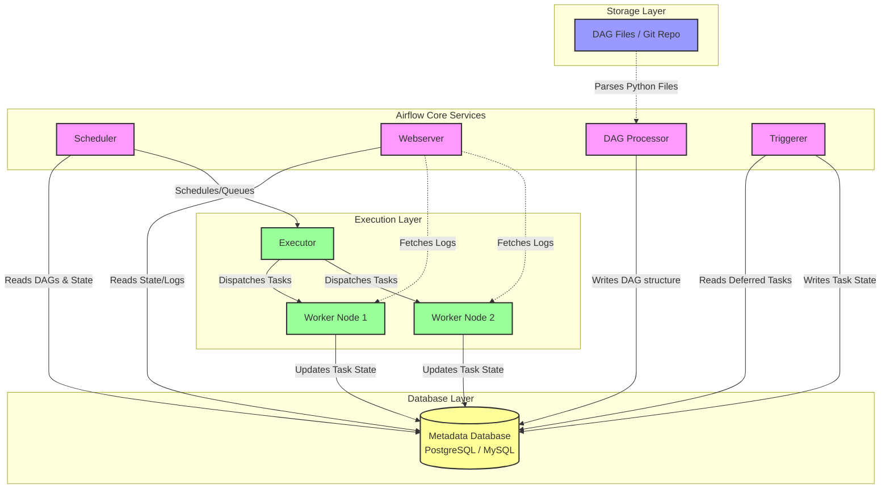
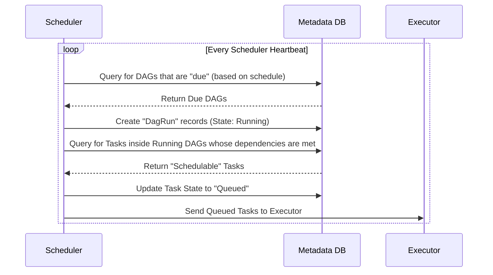
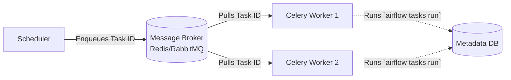
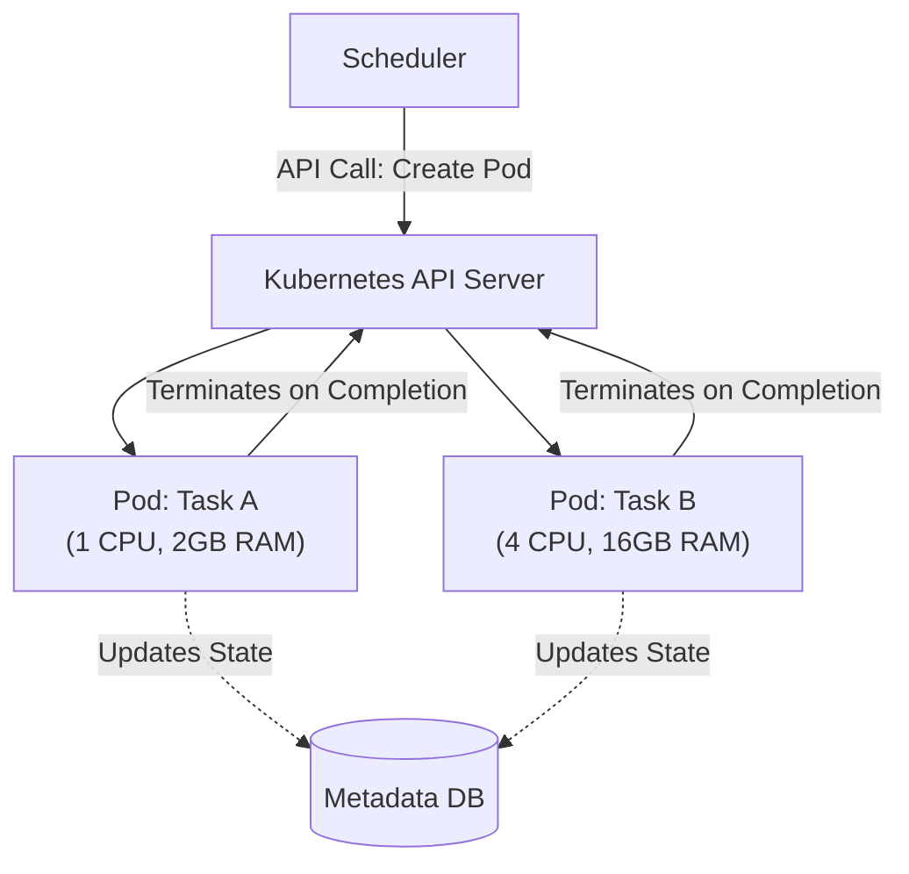
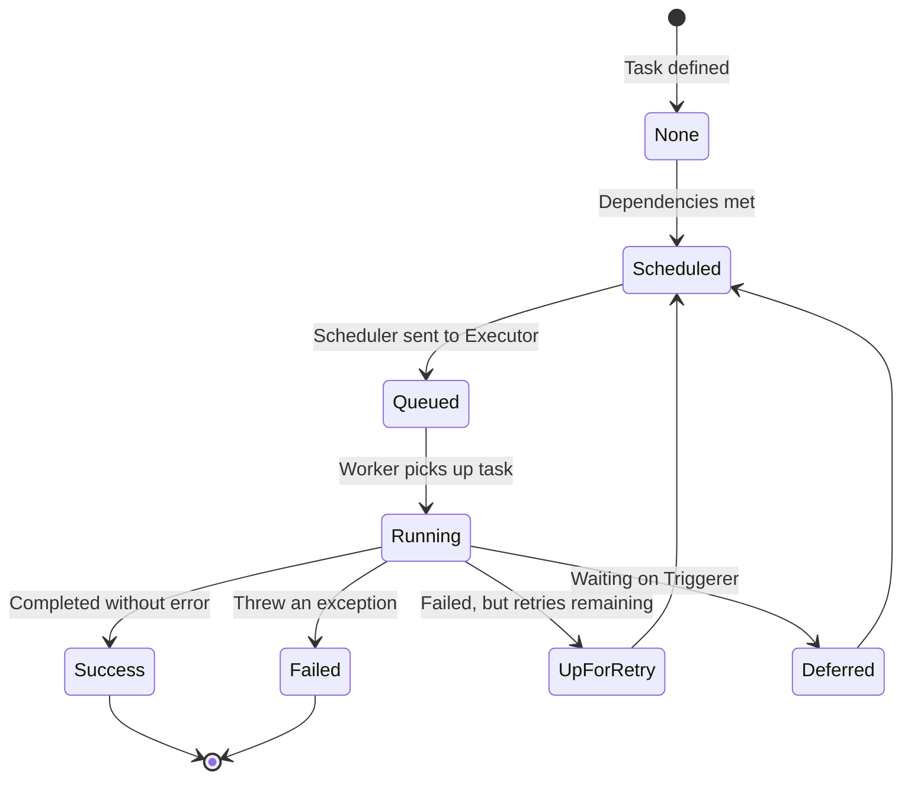

# Deep Dive: Apache Airflow Architecture & Internals

📄 **Navigation:**
[🏠 Back to Index](airflow_comprehensive_guide.md) | [Next: Module 2](02_core_concepts_deep_dive.md) ➔

---

## 1. The Big Picture: System Architecture

The following diagram illustrates the modern Airflow architecture (3.0+) and how the different services interact with each other and the Metadata Database.

---

## 2. Component Internals: How They Actually Work

### A. The DAG Processor
In older versions of Airflow, the Scheduler was responsible for both parsing Python files and scheduling tasks. This caused performance bottlenecks. Now, the **DAG Processor** is a standalone component.

1.  **Scanning:** It continuously scans your `dags_folder` (usually synced via Git).
2.  **Parsing:** It executes the Python code at the top level of your DAG files.
3.  **Serialization:** It converts the DAG structure (tasks, dependencies, schedules) into a serialized JSON format.
4.  **Storage:** It saves this serialized DAG into the Metadata Database. 
*Why?* So the Webserver and Scheduler don't have to parse Python code; they just read the fast JSON representation from the DB.

### B. The Scheduler Internals (The Heartbeat)
The Scheduler is a multi-process component. It runs a continuous loop (the "Heartbeat") to determine what needs to run.

**The Scheduling Loop Workflow:**

### C. The Triggerer & Deferrable Operators
Historically, if a task needed to wait for an external event (e.g., waiting for an EMR cluster to start), it would sit in a "running" state on a Worker node, consuming a valuable worker slot and CPU/RAM while doing nothing but sleeping.

Enter the **Triggerer** (introduced in 2.2, perfected in 3.0).

1.  A worker starts a task using a **Deferrable Operator**.
2.  The operator realizes it needs to wait. It suspends itself, freeing up the worker slot, and registers a "Trigger" with the Metadata DB.
3.  The **Triggerer** service runs in an asyncio loop, efficiently monitoring thousands of triggers simultaneously (e.g., polling an API).
4.  Once the event occurs, the Triggerer updates the DB, and the task is thrown back to the Executor to resume on a normal Worker.

---

## 3. Executor Internals: Celery vs. Kubernetes

The Executor is the mechanism by which task instances get run. It is an API/Interface, not a physical server.

### The Celery Executor Architecture
Used for high-throughput, predictable workloads. It relies on a Message Broker (RabbitMQ/Redis).

*   **Pros:** Instant task startup (workers are always running). High throughput.
*   **Cons:** "Noisy neighbor" problem. If Worker 1 runs out of memory because of Task A, Task B running on the same worker might fail.

### The Kubernetes Executor Architecture
Used for dynamic scaling, resource isolation, and cloud-native environments.

*   **Pros:** Total isolation. You can specify exact CPU/RAM limits per task. Scales to absolute zero when no tasks are running.
*   **Cons:** Slower startup time (it takes time for Kubernetes to provision and spin up a new Pod).

---

## 4. State Transitions (The Task Lifecycle)

Understanding the lifecycle of a task is critical for debugging.

---

📄 **Navigation:**
[🏠 Back to Index](airflow_comprehensive_guide.md) | [Next: Module 2](02_core_concepts_deep_dive.md) ➔
