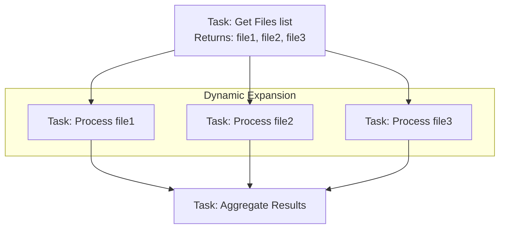
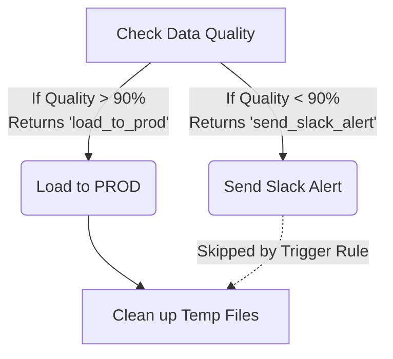

# Deep Dive: Airflow Core Concepts & Dynamic Workflows

Once you understand the architecture of Airflow, you must master the syntax and logical flow controls to build robust data pipelines. This section covers the modern TaskFlow API, Cross-Communication (XComs), dynamic scaling, and workflow logic.

## 1. The TaskFlow API & XComs Internals

Before Airflow 2.0, passing data between tasks was cumbersome. You had to manually push and pull from the `kwargs['ti']` (Task Instance) object. The **TaskFlow API** (`@task` decorator) abstracts this entirely.

### How XComs Work Under the Hood
XComs (Cross-Communications) are not magically passed in memory from worker to worker.

1.  Task A runs on Worker 1. It `return`s a Python dictionary.
2.  Airflow automatically serializes this dictionary (usually to JSON) and saves it in the **Metadata Database** in the `xcom` table.
3.  Task B runs on Worker 2. The Airflow framework queries the DB, deserializes the JSON, and injects it as an argument into Task B's function.

> [!WARNING]
> **The XCom Anti-Pattern:** Because XComs are stored in your relational database (Postgres/MySQL), you must **never** pass large data (like Pandas DataFrames or large arrays) through XComs. It will bloat your database, slow down the Scheduler, and eventually crash your Airflow instance. 
> 
> *Solution:* Write the large data to Cloud Storage (S3/GCS), and pass only the *URI/Path* via XCom.

### Modern TaskFlow Example
```python
from airflow.decorators import dag, task
from pendulum import datetime

@dag(start_date=datetime(2025, 1, 1), schedule=None)
def xcom_example():

    @task
    def extract_data():
        # DO NOT return the actual data here if it's large!
        # Return a reference to it instead.
        file_path = "s3://my-bucket/temp/data_20250101.csv"
        print(f"Data saved to {file_path}")
        return {"data_uri": file_path, "record_count": 500}

    @task
    def process_data(metadata: dict):
        # Airflow automatically pulled the dict from the DB!
        uri = metadata["data_uri"]
        print(f"I will now download and process data from: {uri}")
        
    # The dependency (extract -> process) is inferred automatically
    process_data(extract_data())

xcom_example()
```

---

## 2. Dynamic Task Mapping (Scaling at Runtime)

Often, you don't know how many tasks you need to run until the pipeline actually starts. For example, you might need to process an unknown number of files that arrived overnight.

**Dynamic Task Mapping** allows a single task definition to expand into multiple parallel Task Instances at runtime based on the output of an upstream task.



### Implementation with `.expand()`
```python
from airflow.decorators import task

@task
def get_files():
    # Imagine this queries an API or S3 bucket
    return ["file_A.csv", "file_B.csv", "file_C.csv"]

@task
def process_file(filename: str, environment: str):
    print(f"Processing {filename} in {environment}")
    return True

@task
def aggregate(results: list):
    print(f"All files processed. Success count: {sum(results)}")

with DAG(...) as dag:
    files = get_files()
    
    # .expand() creates a new task instance for EVERY item in the list
    # .partial() passes static arguments that apply to ALL instances
    results = process_file.partial(environment="PROD").expand(filename=files)
    
    aggregate(results)
```

---

## 3. Workflow Control: Branching

Sometimes your DAG needs to make a decision and follow different paths (an "If/Else" statement for workflows).

Use the `@task.branch` decorator. The function must return the `task_id` (or list of `task_ids`) of the path(s) you want to follow.



```python
from airflow.decorators import task
from airflow.operators.empty import EmptyOperator

@task.branch
def check_quality():
    quality_score = 95 # Assume calculated dynamically
    if quality_score >= 90:
        return "load_to_prod"
    else:
        return "send_slack_alert"

# ... define load_to_prod and send_slack_alert tasks ...
```

---

## 4. Trigger Rules (Managing Dependencies)

By default, an Airflow task will only run if **ALL** of its direct upstream parents succeeded (`all_success`). However, you can change this behavior using `trigger_rule`.

This is especially critical after a Branching operation.

### Common Trigger Rules:
- `all_success`: (Default) All parents must succeed.
- `all_failed`: All parents must fail (useful for a global error handling task).
- `one_success`: Fires as soon as *at least one* parent succeeds (useful for racing tasks).
- `none_failed_min_one_success`: Useful for joining branches where some upstream tasks were skipped, but you want to proceed if the executed ones succeeded.

### The Branch Join Problem
If you have a branching task, the un-selected branch is marked as **Skipped**. By default, any downstream task that relies on a Skipped task will *also* be Skipped.

If you need a "Clean Up" task to run regardless of which branch was taken, you must change its trigger rule.

```python
from airflow.utils.trigger_rule import TriggerRule

@task(trigger_rule=TriggerRule.NONE_FAILED_MIN_ONE_SUCCESS)
def cleanup():
    print("Running cleanup regardless of which branch was taken!")

# DAG Flow:
# branch_task >> [path_A, path_B] >> cleanup()
```
