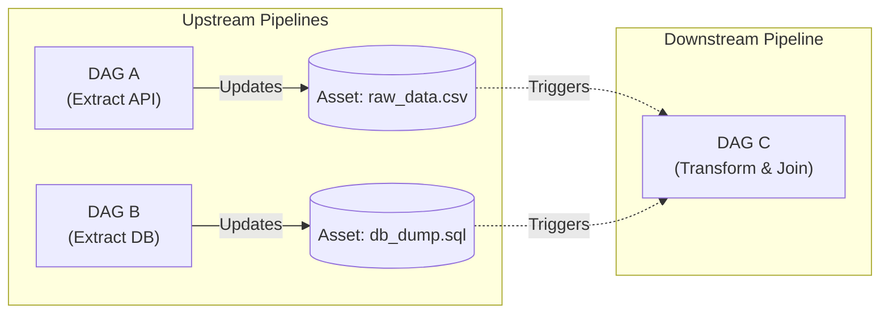

# Deep Dive: Advanced Scheduling & Scaling (Airflow 3.0+)

📄 **Navigation:**
[« Previous: Module 2](02_core_concepts_deep_dive.md) | [🏠 Back to Index](airflow_comprehensive_guide.md) | [Next: Module 4](04_production_best_practices.md) ➔

---

## 1. Event-Driven Scheduling & Assets (Airflow 3.0+)

Historically, Airflow DAGs were scheduled via Cron expressions (e.g., run every day at midnight). This is inefficient for modern data architectures where data arrives unpredictably.

Airflow 3.0 fully embraces **Data-Aware Scheduling** via **Assets** (formerly Datasets) and **Asset Watchers**.

### The Concept
Instead of scheduling `DAG B` to run at 2:00 AM (hoping `DAG A` finished at 1:59 AM), you schedule `DAG B` to run *whenever the logical data asset it needs is updated*.



### Implementation
```python
from airflow.datasets import Dataset # Uses Dataset/Asset interchangeably in 3.0

# Define the logical assets
raw_api_data = Dataset("s3://data-lake/api/raw.csv")
db_dump_data = Dataset("gcs://data-lake/db/dump.sql")

# Upstream DAG A updates the asset
@task(outlets=[raw_api_data])
def extract_api():
    # ... logic ...
    pass

# Downstream DAG C triggers only when BOTH assets are updated
@dag(schedule=[raw_api_data, db_dump_data])
def process_data_dag():
    # ... logic ...
    pass
```

### External Event Watchers
In Airflow 3.0, an Asset can also be updated by an external event via **AssetWatchers** without an upstream DAG running at all (e.g., an AWS SQS queue receives a message, triggering the DAG).

---

## 2. Resource Management: Pools & Priority Weights

When you scale up, you will eventually hit external limits (e.g., an API that allows only 5 requests per second, or a Database that can only handle 10 concurrent connections).

### Pools (Concurrency Limits)
A Pool acts as a concurrency limiter for a specific group of tasks.

1.  **Define a Pool:** In the Airflow UI (Admin -> Pools), create a pool named `snowflake_queries` with `slots = 10`.
2.  **Assign Tasks:** In your DAG, assign tasks to this pool.
3.  **Behavior:** If 50 `snowflake_query` tasks are queued simultaneously, Airflow will only allow 10 to execute at once. The remaining 40 will stay in the `Queued` state until slots free up.

```python
@task(pool="snowflake_queries", pool_slots=1)
def heavy_query():
    pass
```
*Note: You can use `pool_slots=2` if a specific task is extremely heavy and should consume two slots from the pool.*

### Priority Weights (Queue Skipping)
When tasks are waiting in a Pool (or when global Worker slots are full), Airflow uses `priority_weight` to decide who goes next.

- Default weight is 1.
- Higher weight = Higher priority.

```mermaid
graph TD
    subgraph Queued Tasks (Pool Full)
        T1["Task A \n Weight: 1"]
        T2["Task B \n Weight: 10"]
        T3["Task C \n Weight: 5"]
    end
    
    subgraph Execution Order (Next slot opens)
        T2 -->|Runs 1st| Exec
        T3 -->|Runs 2nd| Exec
        T1 -->|Runs 3rd| Exec
    end
```

---

## 3. SLAs (Service Level Agreements) & Callbacks

In production, you need to know if a critical pipeline is running slow *before* business stakeholders complain.

### SLAs
An SLA defines the maximum time a task (or DAG) is allowed to take relative to the start of the DAG run.

```python
from datetime import timedelta

@task(sla=timedelta(hours=2))
def generate_daily_report():
    # If this takes more than 2 hours from DAG start, it triggers an SLA Miss
    pass
```

### Callbacks
Callbacks are custom Python functions that execute when a task's state changes. They are the backbone of alerting (Slack, PagerDuty).

- `on_success_callback`
- `on_failure_callback`
- `on_retry_callback`
- `sla_miss_callback`

```python
def slack_alert(context):
    task_id = context.get('task_instance').task_id
    # Logic to send Slack webhook here
    print(f"ALERT: Task {task_id} failed!")

@task(on_failure_callback=slack_alert)
def risky_task():
    raise Exception("Database Connection Failed")
```

> [!IMPORTANT]
> **Keep Callbacks Lightweight!** 
> Callbacks run in the same process as the task/scheduler. If your callback contains complex logic or takes a long time to execute, it will block Airflow. Keep them fast (e.g., just firing off a webhook).

---

## 4. DAG Versioning (Airflow 3.0+)

A major issue in older Airflow versions was modifying a DAG while it was running. The Scheduler would parse the new file, and the running DAG could crash or skip tasks unpredictably.

**DAG Versioning** solves this:
- Every execution of a DAG is tied to a specific, immutable version snapshot of the code.
- If you push new code to production, currently running DAGs will continue using the old version until they finish.
- The UI allows you to inspect history and see exactly which version of the code was executed on a specific date.

---

📄 **Navigation:**
[« Previous: Module 2](02_core_concepts_deep_dive.md) | [🏠 Back to Index](airflow_comprehensive_guide.md) | [Next: Module 4](04_production_best_practices.md) ➔
