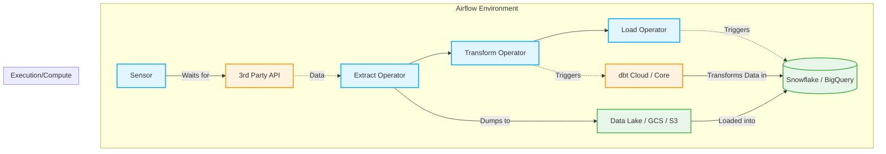

# Deep Dive: Production Best Practices & Testing

📄 **Navigation:**
[« Previous: Module 3](03_advanced_scheduling_and_scaling.md) | [🏠 Back to Index](airflow_comprehensive_guide.md) | [Next: Module 5](05_real_world_projects.md) ➔

---

## 1. The Golden Rule: Idempotency

**Idempotency** means that running a task once has the exact same effect as running it 100 times.

If a task fails halfway through, you must be able to clear it in the Airflow UI and restart it without corrupting data or duplicating records.

### Non-Idempotent (Bad)
```sql
-- If this runs twice, you get duplicate records!
INSERT INTO target_table SELECT * FROM source_table WHERE date = '2025-01-01';
```

### Idempotent (Good)
```sql
-- Safe to run multiple times
DELETE FROM target_table WHERE date = '2025-01-01';
INSERT INTO target_table SELECT * FROM source_table WHERE date = '2025-01-01';

-- OR (using Upsert/Merge)
MERGE INTO target_table USING source_table ON ...
```

---

## 2. Real-World Architecture: The Modern ETL Pipeline

Let's look at how Airflow fits into a modern, distributed data stack. Airflow should act as the orchestrator (the conductor), while external systems do the heavy lifting (the orchestra).



### Why this is a good architecture:
1. **Separation of Concerns:** Airflow doesn't process gigabytes of data in memory. It asks dbt and Snowflake to do it.
2. **Resilience:** If the Snowflake load fails, Airflow knows exactly which step failed and can retry it automatically.
3. **Cost Efficiency:** Using operators like `DataprocSubmitJobOperator` (for Spark) allows you to spin up cluster compute, do the work, and spin it down, saving money.

---

## 3. Top Anti-Patterns to Avoid

> [!CAUTION]
> **1. The "Godzilla" Task**
> *What it is:* A single Python function that extracts from an API, parses JSON, connects to Postgres, and inserts data.
> *Why it's bad:* If the Postgres insert fails, retrying the task means you re-extract from the API, wasting time and resources. Break it down into atomic tasks (Extract -> Transform -> Load).

> [!WARNING]
> **2. Top-Level Code in DAG Files**
> *What it is:* Placing database queries or heavy API calls outside of your task functions in the Python file.
> *Why it's bad:* The Airflow DAG Processor parses every Python file in the `dags` folder every ~30 seconds. If you have an API call at the top level, you will ping that API thousands of times a day and potentially crash your scheduler.
> *Fix:* Put ALL logic inside the `@task` decorator or the Operator's `execute` method.

> [!WARNING]
> **3. Using `catchup=True` on new DAGs without thinking**
> *What it is:* Setting `catchup=True` with a `start_date` of 2020-01-01 on a daily DAG.
> *Why it's bad:* The moment you turn the DAG on, Airflow will instantly schedule hundreds of runs to "catch up" to the current date, potentially crashing your infrastructure.
> *Fix:* Always default to `catchup=False` unless you specifically need to backfill data.

---

## 4. Testing Airflow Code

Because Airflow is just Python, you can test it like Python.

### 1. DAG Integrity Tests (Unit Tests)
You should run these in your CI/CD pipeline to ensure your DAGs aren't broken before deploying to production.

```python
import pytest
from airflow.models import DagBag

def test_no_import_errors():
    # Loads all DAGs and checks for syntax/import errors
    dag_bag = DagBag(dag_folder='dags/', include_examples=False)
    assert len(dag_bag.import_errors) == 0, "DAGs have import errors"

def test_dag_structure():
    dag_bag = DagBag(dag_folder='dags/', include_examples=False)
    dag = dag_bag.get_dag(dag_id='my_etl_pipeline')
    
    # Check for specific tasks
    assert dag.has_task('extract')
    assert dag.has_task('load')
```

### 2. Local Environment Testing
Never test logic in production. Use the provided Docker Compose setup to run a local instance of Airflow, mount your DAGs folder, and run them locally to verify logic and XCom passing.

---

📄 **Navigation:**
[« Previous: Module 3](03_advanced_scheduling_and_scaling.md) | [🏠 Back to Index](airflow_comprehensive_guide.md) | [Next: Module 5](05_real_world_projects.md) ➔
