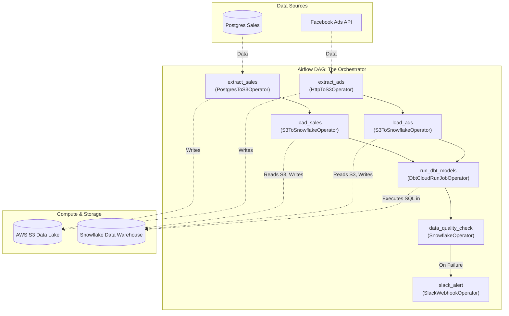
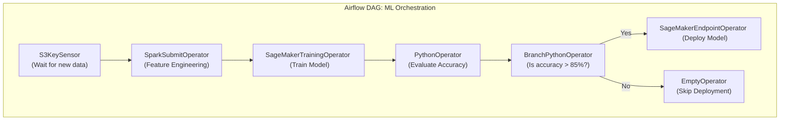
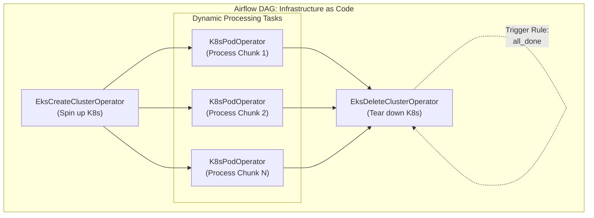

# Deep Dive: Real-World Airflow Projects & Pipelines

📄 **Navigation:**
[« Previous: Module 4](04_production_best_practices.md) | [🏠 Back to Index](airflow_comprehensive_guide.md)

---

Airflow is incredibly versatile. It is used across various domains from standard Data Engineering to MLOps and Infrastructure management. Below are three detailed, real-world project architectures and their corresponding DAG structures.

---

## Project 1: The Modern Data Warehouse (ELT)
**Scenario:** An e-commerce company needs to aggregate daily sales data from a Postgres database and marketing ad spend data from the Facebook Ads API. They load this raw data into Snowflake, use dbt to transform it into a final "ROI Dashboard" table, and alert the data team on Slack.

### The Pipeline Architecture

### The Workflow Explained
1.  **Extract (Parallel):** Two tasks run concurrently to pull data. Instead of keeping this data in memory, Airflow streams it directly to AWS S3 (the Data Lake).
2.  **Load (Parallel):** Once the data is in S3, Airflow commands Snowflake to ingest the raw S3 files into raw staging tables.
3.  **Transform (dbt):** Airflow does not process the data. It uses the `DbtCloudRunJobOperator` to trigger a remote dbt Cloud job. dbt executes SQL inside Snowflake to join sales and ad spend data.
4.  **Quality Check:** A simple SQL query runs in Snowflake (`SELECT count(*) FROM final_table WHERE roi IS NULL`). If it returns rows, the task fails.
5.  **Alert:** If the quality check fails, a Slack message is triggered via the `on_failure_callback`.

---

## Project 2: Machine Learning Operations (MLOps)
**Scenario:** A data science team needs to retrain a customer churn prediction model every week using the latest data, evaluate its accuracy, and deploy it to a SageMaker endpoint *only* if the accuracy is better than the current model.

### The Pipeline Architecture

### The Workflow Explained
1.  **Sensor:** The DAG doesn't run on a strict schedule. It uses an `S3KeySensor` to wait until the Data Engineering team uploads a file named `churn_features_latest.csv`.
2.  **Feature Engineering:** Airflow submits a job to an EMR/Spark cluster to handle heavy matrix multiplications and feature scaling.
3.  **Training:** Airflow triggers AWS SageMaker to train an XGBoost model. (Again, offloading heavy compute).
4.  **Evaluation & Branching:** A Python task compares the new model's metrics against the old one. The `@task.branch` decorator is used. If the new model is better, it returns the `task_id` for deployment. Otherwise, it returns the `task_id` for the skip task.
5.  **Deployment:** If approved, Airflow triggers the API to update the live SageMaker prediction endpoint.

---

## Project 3: Ephemeral Infrastructure Provisioning
**Scenario:** A company needs to run a massive, highly parallel data processing job once a month. Instead of keeping a 50-node Kubernetes cluster running 24/7 (which is expensive), Airflow provisions the cluster, runs the jobs, and tears the cluster down.

### The Pipeline Architecture

### The Workflow Explained
1.  **Provision:** Airflow uses an AWS Operator to instruct AWS to create an Elastic Kubernetes Service (EKS) cluster. The operator waits until the cluster is fully active.
2.  **Process (Dynamic Task Mapping):** Using `.expand()`, Airflow dynamically maps tasks to chunks of data. Each task uses the `KubernetesPodOperator` to launch a container inside the *newly created* EKS cluster.
3.  **Teardown (Crucial Trigger Rule):** The final task deletes the cluster to save money. 
    *   *The Catch:* If `Process Chunk 2` fails, by default, the downstream `Destroy` task would be skipped, leaving the expensive cluster running indefinitely!
    *   *The Fix:* The `Destroy` task is given `trigger_rule=TriggerRule.ALL_DONE`. This ensures that whether the processing tasks succeed, fail, or crash, Airflow will *always* tear down the infrastructure.

---

📄 **Navigation:**
[« Previous: Module 4](04_production_best_practices.md) | [🏠 Back to Index](airflow_comprehensive_guide.md)
