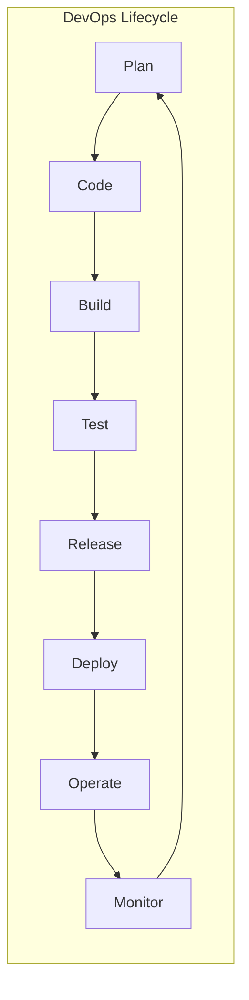
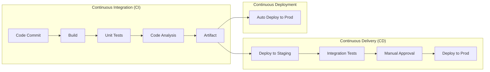
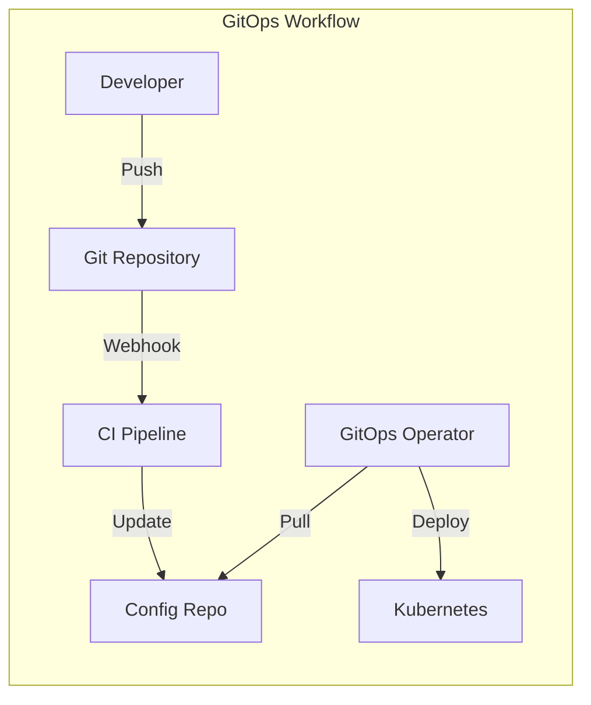
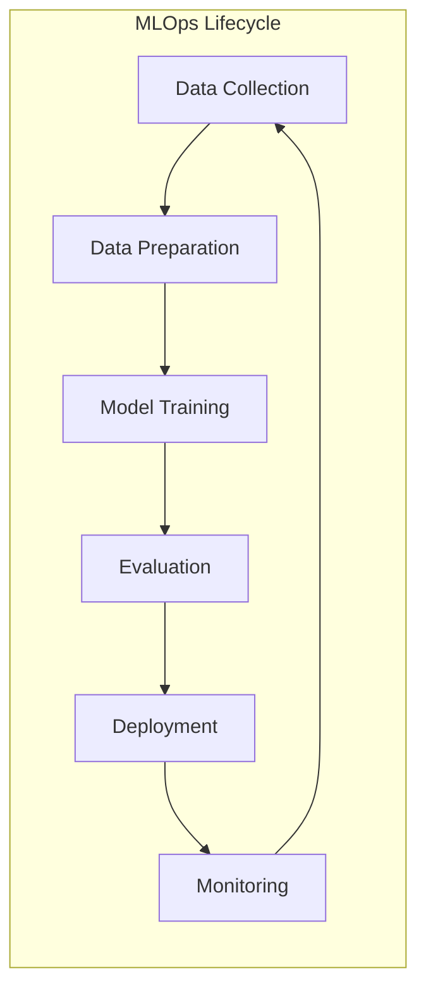

[🏠 Home](../README.md) | [⬅️ Docker & K8s](../interview-prep/system-design/components/devops/docker-k8s-deep-dive.md)

# CI/CD, GitOps, DevOps & MLOps Deep Dive

A comprehensive guide covering modern software delivery practices including Continuous Integration/Deployment, GitOps principles, DevOps culture, and Machine Learning Operations.

---

## Table of Contents

1. [DevOps Fundamentals](#1-devops-fundamentals)
2. [CI/CD Pipelines](#2-cicd-pipelines)
3. [GitOps](#3-gitops)
4. [MLOps](#4-mlops)
5. [Tools Comparison](#5-tools-comparison)
6. [Best Practices](#6-best-practices)

---

## 1. DevOps Fundamentals

### What is DevOps?

DevOps is a culture, methodology, and set of practices that combines software development (Dev) and IT operations (Ops) to shorten the development lifecycle while delivering features, fixes, and updates frequently.



### DevOps Principles

| Principle | Description |
|-----------|-------------|
| **Collaboration** | Break down silos between Dev and Ops |
| **Automation** | Automate repetitive tasks (testing, deployment) |
| **Continuous Improvement** | Iterate and improve processes |
| **Customer-Centric** | Focus on delivering value to end users |
| **End-to-End Responsibility** | Teams own the full lifecycle |
| **Fail Fast** | Detect and fix issues early |

### DevOps vs Traditional IT

```
┌─────────────────────────────────────────────────────────────┐
│                Traditional vs DevOps                         │
├─────────────────────────────────────────────────────────────┤
│                                                              │
│  TRADITIONAL                    DEVOPS                       │
│  ─────────────                  ───────                      │
│  Siloed teams                   Cross-functional teams       │
│  Manual processes               Automated pipelines          │
│  Monthly/quarterly releases     Daily/weekly releases        │
│  Long feedback loops            Fast feedback loops          │
│  Reactive monitoring            Proactive observability      │
│  Change is risky                Change is normal             │
│  Operations owns production     Developers on-call           │
│                                                              │
└─────────────────────────────────────────────────────────────┘
```

### Key Metrics (DORA)

| Metric | Elite | High | Medium | Low |
|--------|-------|------|--------|-----|
| **Deployment Frequency** | On-demand (multiple/day) | Daily-Weekly | Weekly-Monthly | Monthly-6 months |
| **Lead Time for Changes** | < 1 hour | 1 day - 1 week | 1 week - 1 month | 1-6 months |
| **Mean Time to Recovery** | < 1 hour | < 1 day | 1 day - 1 week | 1 week - 1 month |
| **Change Failure Rate** | 0-15% | 16-30% | 16-30% | 46-60% |

---

## 2. CI/CD Pipelines

### CI vs CD



| Term | Definition |
|------|------------|
| **Continuous Integration** | Frequent merging of code changes with automated testing |
| **Continuous Delivery** | Code is always deployable, but deployment requires approval |
| **Continuous Deployment** | Every change that passes tests is automatically deployed |

### Pipeline Stages

```yaml
# Example: GitHub Actions Pipeline
name: CI/CD Pipeline

on:
  push:
    branches: [main, develop]
  pull_request:
    branches: [main]

jobs:
  # Stage 1: Build
  build:
    runs-on: ubuntu-latest
    steps:
      - uses: actions/checkout@v4
      - name: Set up JDK 21
        uses: actions/setup-java@v4
        with:
          java-version: '21'
          distribution: 'temurin'
      - name: Build with Maven
        run: mvn clean package -DskipTests
      - name: Upload artifact
        uses: actions/upload-artifact@v4
        with:
          name: app-jar
          path: target/*.jar

  # Stage 2: Test
  test:
    needs: build
    runs-on: ubuntu-latest
    steps:
      - uses: actions/checkout@v4
      - name: Run Unit Tests
        run: mvn test
      - name: Run Integration Tests
        run: mvn verify -Pintegration-tests
      - name: Upload Coverage Report
        uses: codecov/codecov-action@v3

  # Stage 3: Security Scan
  security:
    needs: build
    runs-on: ubuntu-latest
    steps:
      - uses: actions/checkout@v4
      - name: Run SAST (Semgrep)
        uses: returntocorp/semgrep-action@v1
      - name: Run Dependency Scan
        run: mvn org.owasp:dependency-check-maven:check

  # Stage 4: Build & Push Docker Image
  docker:
    needs: [test, security]
    runs-on: ubuntu-latest
    steps:
      - uses: actions/checkout@v4
      - name: Login to Docker Hub
        uses: docker/login-action@v3
        with:
          username: ${{ secrets.DOCKER_USERNAME }}
          password: ${{ secrets.DOCKER_PASSWORD }}
      - name: Build and Push
        uses: docker/build-push-action@v5
        with:
          push: true
          tags: myapp:${{ github.sha }}

  # Stage 5: Deploy to Staging
  deploy-staging:
    needs: docker
    runs-on: ubuntu-latest
    environment: staging
    steps:
      - name: Deploy to Kubernetes
        uses: azure/k8s-deploy@v4
        with:
          namespace: staging
          manifests: k8s/staging/
          images: myapp:${{ github.sha }}

  # Stage 6: Deploy to Production
  deploy-prod:
    needs: deploy-staging
    runs-on: ubuntu-latest
    environment: production
    steps:
      - name: Deploy to Kubernetes
        uses: azure/k8s-deploy@v4
        with:
          namespace: production
          manifests: k8s/production/
          images: myapp:${{ github.sha }}
```

### Jenkins Pipeline (Declarative)

```groovy
pipeline {
    agent any
    
    environment {
        DOCKER_REGISTRY = 'registry.example.com'
        IMAGE_NAME = 'myapp'
    }
    
    stages {
        stage('Checkout') {
            steps {
                checkout scm
            }
        }
        
        stage('Build') {
            steps {
                sh 'mvn clean package -DskipTests'
            }
        }
        
        stage('Test') {
            parallel {
                stage('Unit Tests') {
                    steps {
                        sh 'mvn test'
                    }
                }
                stage('Integration Tests') {
                    steps {
                        sh 'mvn verify -Pintegration'
                    }
                }
            }
        }
        
        stage('Code Quality') {
            steps {
                withSonarQubeEnv('SonarQube') {
                    sh 'mvn sonar:sonar'
                }
            }
        }
        
        stage('Build Docker Image') {
            steps {
                script {
                    docker.build("${DOCKER_REGISTRY}/${IMAGE_NAME}:${BUILD_NUMBER}")
                }
            }
        }
        
        stage('Push to Registry') {
            steps {
                script {
                    docker.withRegistry("https://${DOCKER_REGISTRY}", 'docker-credentials') {
                        docker.image("${DOCKER_REGISTRY}/${IMAGE_NAME}:${BUILD_NUMBER}").push()
                        docker.image("${DOCKER_REGISTRY}/${IMAGE_NAME}:${BUILD_NUMBER}").push('latest')
                    }
                }
            }
        }
        
        stage('Deploy to Staging') {
            steps {
                sh "kubectl set image deployment/myapp myapp=${DOCKER_REGISTRY}/${IMAGE_NAME}:${BUILD_NUMBER} -n staging"
            }
        }
        
        stage('Deploy to Production') {
            when {
                branch 'main'
            }
            input {
                message "Deploy to production?"
                ok "Deploy"
            }
            steps {
                sh "kubectl set image deployment/myapp myapp=${DOCKER_REGISTRY}/${IMAGE_NAME}:${BUILD_NUMBER} -n production"
            }
        }
    }
    
    post {
        always {
            cleanWs()
        }
        failure {
            slackSend channel: '#alerts', message: "Build Failed: ${env.JOB_NAME} ${env.BUILD_NUMBER}"
        }
    }
}
```

### Testing Pyramid

```
                  ┌───────────────┐
                 │   E2E Tests   │  ← Few, Slow, Expensive
                 │   (UI/API)    │
                ├───────────────────┤
               │ Integration Tests  │  ← Some, Medium Speed
               │  (Service Layer)   │
              ├─────────────────────────┤
             │      Unit Tests          │  ← Many, Fast, Cheap
             │  (Functions/Classes)     │
            └────────────────────────────┘
```

---

## 3. GitOps

### What is GitOps?

GitOps is a way of implementing Continuous Deployment for cloud-native applications. It uses Git as the single source of truth for declarative infrastructure and applications.



### GitOps Principles

| Principle | Description |
|-----------|-------------|
| **Declarative** | Entire system described declaratively |
| **Versioned** | Desired state stored in Git |
| **Automated** | Changes automatically applied |
| **Auditable** | Git history provides audit trail |
| **Self-healing** | Agents detect and correct drift |

### Push vs Pull Model

```
┌─────────────────────────────────────────────────────────────┐
│                Push vs Pull GitOps                           │
├─────────────────────────────────────────────────────────────┤
│                                                              │
│  PUSH MODEL (Traditional CI/CD)                             │
│  ─────────────────────────────                              │
│  CI Server ──push──► Kubernetes                             │
│  - CI has cluster credentials                               │
│  - Security risk (credentials in CI)                        │
│  - No drift detection                                        │
│                                                              │
│  PULL MODEL (GitOps)                                         │
│  ─────────────────                                           │
│  GitOps Operator ──pull──► Git Repo                         │
│  Operator ──reconcile──► Kubernetes                          │
│  - Operator runs in cluster                                  │
│  - No external credentials needed                            │
│  - Continuous drift detection & correction                   │
│                                                              │
└─────────────────────────────────────────────────────────────┘
```

### ArgoCD Example

```yaml
# ArgoCD Application
apiVersion: argoproj.io/v1alpha1
kind: Application
metadata:
  name: my-application
  namespace: argocd
spec:
  project: default
  
  source:
    repoURL: https://github.com/org/my-app-config
    targetRevision: HEAD
    path: environments/production
    
  destination:
    server: https://kubernetes.default.svc
    namespace: production
    
  syncPolicy:
    automated:
      prune: true        # Delete resources not in Git
      selfHeal: true     # Auto-correct drift
    syncOptions:
      - CreateNamespace=true
      
---
# ApplicationSet for multiple environments
apiVersion: argoproj.io/v1alpha1
kind: ApplicationSet
metadata:
  name: my-app-environments
  namespace: argocd
spec:
  generators:
    - list:
        elements:
          - env: dev
            namespace: development
          - env: staging
            namespace: staging
          - env: prod
            namespace: production
  template:
    metadata:
      name: 'my-app-{{env}}'
    spec:
      project: default
      source:
        repoURL: https://github.com/org/my-app-config
        path: 'environments/{{env}}'
        targetRevision: HEAD
      destination:
        server: https://kubernetes.default.svc
        namespace: '{{namespace}}'
      syncPolicy:
        automated:
          selfHeal: true
```

### Flux Example

```yaml
# Flux GitRepository
apiVersion: source.toolkit.fluxcd.io/v1
kind: GitRepository
metadata:
  name: my-app
  namespace: flux-system
spec:
  interval: 1m
  url: https://github.com/org/my-app-config
  ref:
    branch: main
  secretRef:
    name: github-token

---
# Flux Kustomization
apiVersion: kustomize.toolkit.fluxcd.io/v1
kind: Kustomization
metadata:
  name: my-app
  namespace: flux-system
spec:
  interval: 10m
  targetNamespace: production
  sourceRef:
    kind: GitRepository
    name: my-app
  path: ./environments/production
  prune: true
  healthChecks:
    - apiVersion: apps/v1
      kind: Deployment
      name: my-app
      namespace: production
```

### Repository Structure

```
my-app-config/
├── base/                          # Base Kubernetes manifests
│   ├── deployment.yaml
│   ├── service.yaml
│   ├── configmap.yaml
│   └── kustomization.yaml
├── environments/
│   ├── dev/
│   │   ├── kustomization.yaml
│   │   └── patches/
│   │       └── replicas.yaml      # 1 replica
│   ├── staging/
│   │   ├── kustomization.yaml
│   │   └── patches/
│   │       └── replicas.yaml      # 2 replicas
│   └── production/
│       ├── kustomization.yaml
│       └── patches/
│           ├── replicas.yaml      # 5 replicas
│           └── resources.yaml     # Higher limits
└── README.md
```

---

## 4. MLOps

### What is MLOps?

MLOps (Machine Learning Operations) extends DevOps principles to machine learning systems, addressing the unique challenges of ML workflows: data versioning, model training, experiment tracking, and model deployment.



### DevOps vs MLOps

| Aspect | DevOps | MLOps |
|--------|--------|-------|
| **Artifacts** | Code, binaries | Code, data, models |
| **Testing** | Unit, integration, E2E | + Data validation, model validation |
| **Versioning** | Code only | Code + Data + Models |
| **CI** | Build, test code | + Train model, validate metrics |
| **CD** | Deploy application | Deploy model (A/B, canary, shadow) |
| **Monitoring** | Latency, errors | + Model drift, data drift, bias |

### MLOps Maturity Levels

```
┌─────────────────────────────────────────────────────────────┐
│                MLOps Maturity Levels                         │
├─────────────────────────────────────────────────────────────┤
│                                                              │
│  Level 0: Manual                                             │
│  ├─ Manual data prep, training, deployment                  │
│  ├─ No automation                                           │
│  └─ Notebooks in production                                 │
│                                                              │
│  Level 1: ML Pipeline Automation                             │
│  ├─ Automated training pipeline                             │
│  ├─ Experiment tracking                                     │
│  └─ Model registry                                          │
│                                                              │
│  Level 2: CI/CD Pipeline Automation                          │
│  ├─ Automated CI/CD for ML pipelines                        │
│  ├─ Automated testing (data, model)                         │
│  └─ Feature store                                           │
│                                                              │
│  Level 3: Full MLOps                                         │
│  ├─ Automated retraining on data/concept drift              │
│  ├─ A/B testing, canary deployments                         │
│  └─ Full observability                                      │
│                                                              │
└─────────────────────────────────────────────────────────────┘
```

### MLOps Pipeline Example

```yaml
# Kubeflow Pipeline (Python SDK)
from kfp import dsl
from kfp.components import create_component_from_func

@dsl.component(base_image='python:3.10')
def load_data(output_path: dsl.OutputPath('Dataset')):
    import pandas as pd
    df = pd.read_csv('s3://bucket/data.csv')
    df.to_parquet(output_path)

@dsl.component(base_image='python:3.10')
def preprocess(input_path: dsl.InputPath('Dataset'),
               output_path: dsl.OutputPath('Dataset')):
    import pandas as pd
    df = pd.read_parquet(input_path)
    # Preprocessing steps...
    df.to_parquet(output_path)

@dsl.component(base_image='tensorflow/tensorflow:2.12.0')
def train_model(data_path: dsl.InputPath('Dataset'),
                model_path: dsl.OutputPath('Model'),
                epochs: int = 10):
    import tensorflow as tf
    # Training logic...
    model.save(model_path)

@dsl.component(base_image='python:3.10')
def evaluate_model(model_path: dsl.InputPath('Model'),
                   test_data: dsl.InputPath('Dataset'),
                   metrics_path: dsl.OutputPath('Metrics')):
    # Evaluation logic...
    pass

@dsl.component(base_image='python:3.10')
def deploy_model(model_path: dsl.InputPath('Model'),
                 endpoint_name: str):
    # Deployment logic (e.g., to SageMaker, Vertex AI)
    pass

@dsl.pipeline(name='ML Training Pipeline')
def ml_pipeline(epochs: int = 10):
    load_task = load_data()
    preprocess_task = preprocess(input_path=load_task.output)
    train_task = train_model(
        data_path=preprocess_task.output,
        epochs=epochs
    )
    eval_task = evaluate_model(
        model_path=train_task.output,
        test_data=preprocess_task.output
    )
    with dsl.Condition(eval_task.output['accuracy'] > 0.9):
        deploy_model(
            model_path=train_task.output,
            endpoint_name='production-model'
        )
```

### MLflow Tracking

```python
import mlflow
import mlflow.sklearn
from sklearn.ensemble import RandomForestClassifier
from sklearn.metrics import accuracy_score, f1_score

# Start experiment
mlflow.set_experiment("fraud-detection")

with mlflow.start_run(run_name="rf-baseline"):
    # Log parameters
    mlflow.log_param("n_estimators", 100)
    mlflow.log_param("max_depth", 10)
    mlflow.log_param("data_version", "v2.3")
    
    # Train model
    model = RandomForestClassifier(n_estimators=100, max_depth=10)
    model.fit(X_train, y_train)
    
    # Log metrics
    predictions = model.predict(X_test)
    mlflow.log_metric("accuracy", accuracy_score(y_test, predictions))
    mlflow.log_metric("f1_score", f1_score(y_test, predictions))
    
    # Log model
    mlflow.sklearn.log_model(
        model,
        "model",
        registered_model_name="fraud-detection-model"
    )
    
    # Log artifacts
    mlflow.log_artifact("feature_importance.png")
    mlflow.log_artifact("confusion_matrix.png")
```

### Model Deployment Patterns

```
┌─────────────────────────────────────────────────────────────┐
│              Model Deployment Strategies                     │
├─────────────────────────────────────────────────────────────┤
│                                                              │
│  1. SHADOW DEPLOYMENT                                        │
│     ┌──────────┐  requests  ┌───────────┐                   │
│     │  Client  │──────────►│ Model v1  │ ← serves response  │
│     └──────────┘      │     └───────────┘                   │
│                       │     ┌───────────┐                   │
│                       └────►│ Model v2  │ ← logs only       │
│                             └───────────┘                   │
│                                                              │
│  2. A/B TESTING                                              │
│     ┌──────────┐  90%  ┌───────────┐                        │
│     │  Client  │──────►│ Model v1  │                        │
│     └──────────┘       └───────────┘                        │
│          │     10%  ┌───────────┐                           │
│          └─────────►│ Model v2  │                           │
│                     └───────────┘                           │
│                                                              │
│  3. CANARY DEPLOYMENT                                        │
│     ┌──────────┐  99%  ┌───────────┐                        │
│     │  Client  │──────►│ Model v1  │                        │
│     └──────────┘       └───────────┘                        │
│          │      1%  ┌───────────┐                           │
│          └─────────►│ Model v2  │ ← gradually increase      │
│                     └───────────┘                           │
│                                                              │
│  4. BLUE-GREEN                                               │
│     ┌───────────┐    ┌───────────┐                          │
│     │   Blue    │ ◄──│  Switch   │                          │
│     │ (Model v1)│    │ instantly │                          │
│     └───────────┘    └───────────┘                          │
│     ┌───────────┐         ▲                                 │
│     │   Green   │─────────┘                                 │
│     │ (Model v2)│                                           │
│     └───────────┘                                           │
│                                                              │
└─────────────────────────────────────────────────────────────┘
```

### Model Monitoring

```python
# Example: Monitoring with Evidently
from evidently.report import Report
from evidently.metric_preset import DataDriftPreset, TargetDriftPreset
from evidently.metrics import ClassificationQualityMetric

# Data Drift Detection
drift_report = Report(metrics=[
    DataDriftPreset(),
    TargetDriftPreset(),
])

drift_report.run(
    reference_data=training_data,
    current_data=production_data
)

# Check for drift
drift_detected = drift_report.as_dict()['metrics'][0]['result']['dataset_drift']

if drift_detected:
    # Trigger retraining pipeline
    trigger_retraining_pipeline()
    send_alert("Data drift detected! Retraining triggered.")
```

---

## 5. Tools Comparison

### CI/CD Tools

| Tool | Type | Best For | Pricing |
|------|------|----------|---------|
| **GitHub Actions** | SaaS | GitHub repos | Free tier + paid |
| **GitLab CI** | SaaS/Self-hosted | GitLab users | Free tier + paid |
| **Jenkins** | Self-hosted | Enterprise, customization | Free (OSS) |
| **CircleCI** | SaaS | Fast builds, Docker | Free tier + paid |
| **Azure DevOps** | SaaS | Microsoft stack | Free tier + paid |
| **AWS CodePipeline** | SaaS | AWS-native | Pay per use |

### GitOps Tools

| Tool | Approach | Features |
|------|----------|----------|
| **ArgoCD** | Pull | Rich UI, SSO, RBAC, multi-tenancy |
| **Flux** | Pull | Lightweight, Helm/Kustomize native |
| **Rancher Fleet** | Pull | Multi-cluster at scale |
| **Jenkins X** | Push/Pull | Opinionated K8s CI/CD |

### MLOps Platforms

| Platform | Type | Best For |
|----------|------|----------|
| **MLflow** | OSS | Experiment tracking, model registry |
| **Kubeflow** | OSS | K8s-native ML pipelines |
| **SageMaker** | AWS | End-to-end AWS ML |
| **Vertex AI** | GCP | End-to-end GCP ML |
| **Azure ML** | Azure | End-to-end Azure ML |
| **Weights & Biases** | SaaS | Experiment tracking |
| **DVC** | OSS | Data & model versioning |
| **Feast** | OSS | Feature store |

---

## 6. Best Practices

### CI/CD Best Practices

```
✅ DO:
├─ Keep pipelines fast (< 10 minutes)
├─ Run tests in parallel
├─ Use caching for dependencies
├─ Fail fast (run quick tests first)
├─ Use semantic versioning
├─ Automate security scanning (SAST, SCA)
├─ Implement proper secret management
├─ Use ephemeral environments for PRs
└─ Monitor pipeline metrics

❌ DON'T:
├─ Store secrets in code/config
├─ Skip tests for "quick fixes"
├─ Have flaky tests
├─ Allow long-running pipelines
└─ Deploy without proper testing
```

### GitOps Best Practices

```
✅ DO:
├─ Separate application and config repos
├─ Use pull-based deployment
├─ Enable auto-sync with self-healing
├─ Implement proper RBAC
├─ Use sealed secrets for credentials
├─ Review config changes via PR
└─ Set up drift detection alerts

❌ DON'T:
├─ Store plain-text secrets in Git
├─ Allow direct kubectl access
├─ Skip PR reviews for config changes
└─ Ignore sync failures
```

### MLOps Best Practices

```
✅ DO:
├─ Version data alongside code
├─ Track all experiments
├─ Use a model registry
├─ Implement automated retraining
├─ Monitor for data/concept drift
├─ A/B test model changes
├─ Set up model performance alerts
└─ Document model cards

❌ DON'T:
├─ Deploy notebooks to production
├─ Skip model validation
├─ Ignore bias testing
├─ Train on production data directly
└─ Forget to log hyperparameters
```

---

## Quick Reference

### Common Pipeline Commands

```bash
# GitHub Actions - Trigger workflow
gh workflow run deploy.yml --ref main

# ArgoCD - Sync application
argocd app sync my-app
argocd app wait my-app --health

# Flux - Reconcile
flux reconcile kustomization my-app

# MLflow - Start server
mlflow server --backend-store-uri sqlite:///mlflow.db
```

### Key Concepts Cheatsheet

| Term | Definition |
|------|------------|
| **Blue-Green** | Two identical environments, instant switch |
| **Canary** | Gradual rollout to subset of users |
| **Feature Flag** | Toggle features without deployment |
| **Trunk-Based Dev** | Short-lived branches, frequent merges |
| **GitFlow** | Long-lived branches (develop, release) |
| **Model Drift** | Model performance degradation over time |
| **Data Drift** | Input data distribution changes |
| **Feature Store** | Centralized repository for ML features |

---

## Further Reading

- [Google SRE Book](https://sre.google/sre-book/table-of-contents/)
- [The DevOps Handbook](https://itrevolution.com/product/the-devops-handbook/)
- [Accelerate (DORA Metrics)](https://itrevolution.com/product/accelerate/)
- [GitOps and Kubernetes](https://www.manning.com/books/gitops-and-kubernetes)
- [Machine Learning Engineering](https://www.mlebook.com/)

---

[🏠 Home](../README.md) | [⬅️ Docker & K8s](../interview-prep/system-design/components/devops/docker-k8s-deep-dive.md)
