# JavaScript ES6+ Complete Guide

A comprehensive guide to modern JavaScript (ES6 and beyond) with examples, best practices, and interview preparation.

---

## 🗺️ Learning Roadmap

```mermaid
flowchart LR
    subgraph Basics["1. ES6 Basics"]
        VAR[let, const, var]
        ARROW[Arrow Functions]
        TEMPLATE[Template Literals]
    end
    
    subgraph DataStructures["2. Data Structures"]
        DESTRUCT[Destructuring]
        SPREAD[Spread/Rest]
        MAP[Map & Set]
    end
    
    subgraph Advanced["3. Async & Modules"]
        PROMISE[Promises]
        ASYNC[Async/Await]
        MODULES[ES Modules]
    end
    
    subgraph Modern["4. Modern Features"]
        OPTIONAL[Optional Chaining]
        NULLISH[Nullish Coalescing]
        CLASS[Classes]
    end
    
    Basics --> DataStructures --> Advanced --> Modern
```



---

## 1️⃣ Variable Declarations

### var vs let vs const

| Feature | `var` | `let` | `const` |
| :--- | :--- | :--- | :--- |
| **Scope** | Function | Block | Block |
| **Hoisting** | Yes (undefined) | Yes (TDZ) | Yes (TDZ) |
| **Reassignable** | Yes | Yes | No |
| **Redeclarable** | Yes | No | No |

**TDZ (Temporal Dead Zone)**: Variables exist but can't be accessed before declaration.

```javascript
// var - function scoped, hoisted
console.log(x); // undefined (hoisted)
var x = 5;

// let - block scoped
if (true) {
    let y = 10;
}
// console.log(y); // ReferenceError

// const - block scoped, immutable binding
const PI = 3.14159;
// PI = 3; // TypeError

// But objects/arrays can be mutated!
const user = { name: 'John' };
user.name = 'Jane'; // OK - object mutated, not reassigned
```

**Best Practice**: Default to `const`, use `let` when reassignment needed, avoid `var`.

---

## 2️⃣ Arrow Functions

Arrow functions provide shorter syntax and lexically bind `this`.

```javascript
// Traditional function
function add(a, b) {
    return a + b;
}

// Arrow function
const add = (a, b) => a + b;

// Single parameter - no parentheses needed
const square = x => x * x;

// No parameters
const greet = () => 'Hello!';

// Multi-line - need braces and return
const calculate = (a, b) => {
    const sum = a + b;
    const product = a * b;
    return { sum, product };
};
```

### Lexical `this` Binding

**This is the key difference!** Arrow functions don't have their own `this`.

```javascript
// Problem with traditional functions
const person = {
    name: 'John',
    greet: function() {
        setTimeout(function() {
            console.log(`Hello, ${this.name}`); // undefined! 'this' is window
        }, 1000);
    }
};

// Solution with arrow functions
const person = {
    name: 'John',
    greet: function() {
        setTimeout(() => {
            console.log(`Hello, ${this.name}`); // 'John' - inherits 'this'
        }, 1000);
    }
};
```

**When NOT to use arrow functions:**
- Object methods that need `this`
- Event handlers that need `this` to be the element
- Constructors (arrow functions can't be used with `new`)

---

## 3️⃣ Template Literals

Multi-line strings and string interpolation.

```javascript
const name = 'World';
const age = 25;

// String interpolation
const greeting = `Hello, ${name}!`;

// Expressions in templates
const message = `You are ${age >= 18 ? 'an adult' : 'a minor'}`;

// Multi-line strings
const html = `
    <div class="card">
        <h2>${name}</h2>
        <p>Age: ${age}</p>
    </div>
`;

// Tagged templates (advanced)
function highlight(strings, ...values) {
    return strings.reduce((result, str, i) => 
        `${result}${str}<mark>${values[i] || ''}</mark>`, '');
}

const highlighted = highlight`Hello ${name}, you are ${age} years old`;
```

---

## 4️⃣ Destructuring

Extract values from arrays and objects into distinct variables.

### Array Destructuring

```javascript
const colors = ['red', 'green', 'blue'];

// Basic
const [first, second, third] = colors;

// Skip elements
const [primary, , tertiary] = colors;

// Default values
const [a, b, c, d = 'yellow'] = colors;

// Rest pattern
const [head, ...tail] = colors; // head = 'red', tail = ['green', 'blue']

// Swapping variables
let x = 1, y = 2;
[x, y] = [y, x]; // x = 2, y = 1
```

### Object Destructuring

```javascript
const user = {
    name: 'John',
    age: 30,
    address: {
        city: 'NYC',
        country: 'USA'
    }
};

// Basic
const { name, age } = user;

// Rename variables
const { name: userName, age: userAge } = user;

// Default values
const { name, role = 'user' } = user;

// Nested destructuring
const { address: { city, country } } = user;

// Function parameters
function greet({ name, age }) {
    return `${name} is ${age} years old`;
}
greet(user);
```

---

## 5️⃣ Spread & Rest Operators

### Spread (`...`) - Expands iterables

```javascript
// Arrays
const arr1 = [1, 2, 3];
const arr2 = [4, 5, 6];
const combined = [...arr1, ...arr2]; // [1, 2, 3, 4, 5, 6]

// Clone array (shallow)
const clone = [...arr1];

// Objects
const defaults = { theme: 'dark', lang: 'en' };
const userPrefs = { lang: 'es' };
const settings = { ...defaults, ...userPrefs }; // { theme: 'dark', lang: 'es' }

// Function arguments
const numbers = [1, 2, 3];
console.log(Math.max(...numbers)); // 3
```

### Rest (`...`) - Collects into array

```javascript
// Function parameters
function sum(...numbers) {
    return numbers.reduce((a, b) => a + b, 0);
}
sum(1, 2, 3, 4); // 10

// Destructuring remainder
const [first, ...rest] = [1, 2, 3, 4];
// first = 1, rest = [2, 3, 4]

const { name, ...otherProps } = user;
```

---

## 6️⃣ Enhanced Object Literals

```javascript
const name = 'John';
const age = 30;

// Property shorthand
const user = { name, age }; // { name: 'John', age: 30 }

// Method shorthand
const calculator = {
    add(a, b) {
        return a + b;
    },
    subtract(a, b) {
        return a - b;
    }
};

// Computed property names
const key = 'email';
const user = {
    [key]: 'john@example.com',
    [`get${key.charAt(0).toUpperCase() + key.slice(1)}`]() {
        return this.email;
    }
};
```

---

## 7️⃣ Promises

Handle asynchronous operations.

```mermaid
flowchart LR
    PENDING[Pending] --> FULFILLED[Fulfilled\n.then()]
    PENDING --> REJECTED[Rejected\n.catch()]
```

```javascript
// Creating a Promise
const fetchData = () => {
    return new Promise((resolve, reject) => {
        setTimeout(() => {
            const success = true;
            if (success) {
                resolve({ data: 'Hello!' });
            } else {
                reject(new Error('Failed to fetch'));
            }
        }, 1000);
    });
};

// Using Promises
fetchData()
    .then(result => console.log(result.data))
    .catch(error => console.error(error))
    .finally(() => console.log('Done'));

// Promise.all - wait for all
Promise.all([fetch('/api/users'), fetch('/api/posts')])
    .then(([users, posts]) => {
        console.log(users, posts);
    });

// Promise.race - first to complete
Promise.race([fetch('/api/fast'), fetch('/api/slow')])
    .then(result => console.log('First:', result));

// Promise.allSettled - all results regardless of success/failure
Promise.allSettled([promise1, promise2])
    .then(results => {
        results.forEach(r => console.log(r.status, r.value || r.reason));
    });
```

---

## 8️⃣ Async/Await

Syntactic sugar over Promises - write async code that looks synchronous.

```javascript
// Async function returns a Promise
async function fetchUser(id) {
    try {
        const response = await fetch(`/api/users/${id}`);
        
        if (!response.ok) {
            throw new Error('User not found');
        }
        
        const user = await response.json();
        return user;
    } catch (error) {
        console.error('Error:', error);
        throw error;
    }
}

// Using async/await
async function main() {
    const user = await fetchUser(1);
    console.log(user);
}

// Parallel execution
async function fetchAll() {
    const [users, posts] = await Promise.all([
        fetch('/api/users').then(r => r.json()),
        fetch('/api/posts').then(r => r.json())
    ]);
    return { users, posts };
}

// Top-level await (ES2022, in modules)
const data = await fetch('/api/data').then(r => r.json());
```

---

## 9️⃣ ES Modules

```javascript
// math.js - Named exports
export const PI = 3.14159;
export function add(a, b) { return a + b; }
export function subtract(a, b) { return a - b; }

// Default export
export default class Calculator {
    // ...
}

// main.js - Importing
import Calculator, { PI, add, subtract } from './math.js';
import * as math from './math.js'; // Import all as namespace

// Dynamic imports (code splitting)
async function loadModule() {
    const module = await import('./heavy-module.js');
    module.doSomething();
}

// Re-exporting
export { add, subtract } from './math.js';
export * from './utils.js';
```

---

## 🔟 Classes

```javascript
class Animal {
    // Private field (ES2022)
    #id;
    
    // Static property
    static kingdom = 'Animalia';
    
    constructor(name, age) {
        this.name = name;
        this.age = age;
        this.#id = Math.random();
    }
    
    // Instance method
    speak() {
        console.log(`${this.name} makes a sound`);
    }
    
    // Getter
    get info() {
        return `${this.name}, ${this.age} years old`;
    }
    
    // Setter
    set nickname(value) {
        this.name = value;
    }
    
    // Static method
    static isAnimal(obj) {
        return obj instanceof Animal;
    }
    
    // Private method (ES2022)
    #generateId() {
        return Math.random().toString(36);
    }
}

// Inheritance
class Dog extends Animal {
    constructor(name, age, breed) {
        super(name, age); // Call parent constructor
        this.breed = breed;
    }
    
    speak() {
        console.log(`${this.name} barks!`);
    }
    
    fetch() {
        console.log(`${this.name} fetches the ball`);
    }
}

const dog = new Dog('Buddy', 3, 'Labrador');
dog.speak(); // Buddy barks!
```

---

## 1️⃣1️⃣ Modern Features (ES2020+)

### Optional Chaining (`?.`)

Safely access deeply nested properties.

```javascript
const user = {
    name: 'John',
    address: {
        city: 'NYC'
    }
};

// Without optional chaining
const zip = user.address && user.address.zip;

// With optional chaining
const zip = user.address?.zip; // undefined, no error

// Works with methods
const result = user.getAddress?.();

// Works with arrays
const first = arr?.[0];
```

### Nullish Coalescing (`??`)

Default value only for `null` or `undefined` (not `0`, `''`, `false`).

```javascript
const value = null;

// || treats 0, '', false as falsy
const result1 = value || 'default'; // 'default'
const result2 = 0 || 'default';     // 'default' (not what we want!)

// ?? only checks for null/undefined
const result3 = value ?? 'default'; // 'default'
const result4 = 0 ?? 'default';     // 0 (correct!)
const result5 = '' ?? 'default';    // '' (correct!)
```

### Logical Assignment

```javascript
// ||= (OR assignment)
let x = null;
x ||= 'default'; // x = 'default'

// ??= (Nullish assignment)
let y = 0;
y ??= 'default'; // y = 0 (not changed)

// &&= (AND assignment)
let z = 'value';
z &&= 'new value'; // z = 'new value'
```

### Other Modern Features

```javascript
// Array.at() - negative indexing
const arr = [1, 2, 3, 4, 5];
arr.at(-1); // 5
arr.at(-2); // 4

// Object.fromEntries()
const entries = [['name', 'John'], ['age', 30]];
const obj = Object.fromEntries(entries); // { name: 'John', age: 30 }

// String methods
'  hello  '.trimStart(); // 'hello  '
'  hello  '.trimEnd();   // '  hello'
'hello'.padStart(10, '0'); // '00000hello'

// Array flat/flatMap
[[1, 2], [3, 4]].flat(); // [1, 2, 3, 4]
[1, 2].flatMap(x => [x, x * 2]); // [1, 2, 2, 4]

// globalThis (works in browser, Node, workers)
globalThis.setTimeout();

// BigInt for large integers
const big = 9007199254740991n;
const bigger = BigInt('9007199254740991');
```

---

## 1️⃣2️⃣ Array Methods

```javascript
const numbers = [1, 2, 3, 4, 5];

// map - transform each element
const doubled = numbers.map(n => n * 2); // [2, 4, 6, 8, 10]

// filter - keep elements that pass test
const evens = numbers.filter(n => n % 2 === 0); // [2, 4]

// reduce - accumulate into single value
const sum = numbers.reduce((acc, n) => acc + n, 0); // 15

// find - first element that matches
const found = numbers.find(n => n > 3); // 4

// findIndex - index of first match
const index = numbers.findIndex(n => n > 3); // 3

// some - at least one matches
const hasEven = numbers.some(n => n % 2 === 0); // true

// every - all elements match
const allPositive = numbers.every(n => n > 0); // true

// includes - contains element
numbers.includes(3); // true

// forEach - side effects only (no return)
numbers.forEach(n => console.log(n));

// Method chaining
const result = numbers
    .filter(n => n % 2 === 0)
    .map(n => n * 2)
    .reduce((acc, n) => acc + n, 0); // 12
```

---

## 1️⃣3️⃣ Map & Set

### Map - Key-Value pairs (any key type)

```javascript
const map = new Map();

// Set values
map.set('name', 'John');
map.set(1, 'one');
map.set({ id: 1 }, 'object key');

// Get values
map.get('name'); // 'John'
map.get(1);      // 'one'

// Check existence
map.has('name'); // true

// Size
map.size; // 3

// Delete
map.delete('name');

// Iterate
for (const [key, value] of map) {
    console.log(key, value);
}

// Convert to array
const entries = [...map]; // [[key1, val1], [key2, val2]]
```

### Set - Unique values only

```javascript
const set = new Set([1, 2, 3, 3, 3]);
console.log(set); // Set { 1, 2, 3 }

// Add
set.add(4);

// Check
set.has(2); // true

// Delete
set.delete(1);

// Size
set.size; // 3

// Use case: Remove duplicates
const arr = [1, 2, 2, 3, 3, 3];
const unique = [...new Set(arr)]; // [1, 2, 3]
```

---

## 📚 Quick Reference

| Feature | Syntax | Use Case |
| :--- | :--- | :--- |
| **let/const** | `let x = 1; const y = 2;` | Block-scoped variables |
| **Arrow Function** | `const fn = (x) => x * 2` | Short functions, preserve `this` |
| **Template Literal** | `` `Hello ${name}` `` | String interpolation |
| **Destructuring** | `const { a, b } = obj` | Extract values |
| **Spread** | `[...arr1, ...arr2]` | Expand iterables |
| **Rest** | `function(...args)` | Collect arguments |
| **Promise** | `promise.then().catch()` | Async operations |
| **Async/Await** | `await promise` | Readable async code |
| **Optional Chaining** | `obj?.prop?.val` | Safe property access |
| **Nullish Coalescing** | `val ?? 'default'` | Default for null/undefined |

---

## 🧪 Interview Questions with Answers

### 1. What's the difference between `==` and `===`?

**`==` (Loose Equality)**: Performs type coercion before comparison.
```javascript
1 == '1'     // true (string converted to number)
null == undefined // true
```

**`===` (Strict Equality)**: No type coercion, types must match.
```javascript
1 === '1'    // false
null === undefined // false
```

**Best Practice**: Always use `===` to avoid unexpected bugs.

---

### 2. Explain closures.

A **closure** is a function that remembers variables from its outer scope even after the outer function has returned.

```javascript
function createCounter() {
    let count = 0; // This variable is "closed over"
    
    return function() {
        count++;
        return count;
    };
}

const counter = createCounter();
counter(); // 1
counter(); // 2
counter(); // 3
```

**Use cases**: Data privacy, factory functions, callbacks with state.

---

### 3. What is the event loop?

JavaScript is single-threaded. The **event loop** allows async operations by:

1. **Call Stack**: Executes synchronous code
2. **Web APIs**: Handle async operations (setTimeout, fetch)
3. **Callback Queue**: Holds callbacks ready to execute
4. **Event Loop**: Moves callbacks to stack when stack is empty

```javascript
console.log('1');
setTimeout(() => console.log('2'), 0);
console.log('3');
// Output: 1, 3, 2 (setTimeout callback waits for stack to clear)
```

---

### 4. What's the difference between `null` and `undefined`?

- **`undefined`**: Variable declared but not assigned (default state)
- **`null`**: Intentional absence of value (assigned explicitly)

```javascript
let x;        // undefined
let y = null; // null

typeof undefined // 'undefined'
typeof null      // 'object' (historical bug)
```

---

### 5. Explain `this` in JavaScript.

`this` depends on **how a function is called**, not where it's defined.

| Context | `this` Value |
| :--- | :--- |
| Global | `window` (browser) / `global` (Node) |
| Object method | The object |
| Arrow function | Inherited from parent scope |
| `new` keyword | The new instance |
| `call/apply/bind` | Explicitly set |

```javascript
const obj = {
    name: 'John',
    greet() { console.log(this.name); },  // 'John'
    arrow: () => console.log(this.name)   // undefined (global this)
};
```

---

*Master Modern JavaScript! 🚀*
