# TypeScript Complete Guide

A comprehensive guide from beginner to advanced TypeScript with examples and real-world use cases.

---

## 🗺️ Learning Roadmap

```mermaid
flowchart LR
    subgraph Beginner["1. Beginner"]
        BASIC[Basic Types]
        FUNC[Functions]
        OBJ[Objects & Interfaces]
    end
    
    subgraph Intermediate["2. Intermediate"]
        UNION[Union & Intersection]
        GEN[Generics]
        CLASS[Classes]
    end
    
    subgraph Advanced["3. Advanced"]
        MAPPED[Mapped Types]
        COND[Conditional Types]
        UTIL[Utility Types]
    end
    
    subgraph Expert["4. Expert"]
        INFER[Type Inference]
        TEMPLATE[Template Literals]
        DECORATOR[Decorators]
    end
    
    Beginner --> Intermediate --> Advanced --> Expert
```



---

# 🟢 BEGINNER LEVEL

## 1️⃣ Basic Types

### Primitive Types

```typescript
// String
let name: string = 'John';

// Number (integers and floats)
let age: number = 30;
let price: number = 19.99;

// Boolean
let isActive: boolean = true;

// Null and Undefined
let nothing: null = null;
let notDefined: undefined = undefined;

// Symbol (unique identifiers)
let sym: symbol = Symbol('id');

// BigInt (large integers)
let big: bigint = 100n;
```

### Arrays

```typescript
// Two syntaxes
let numbers: number[] = [1, 2, 3];
let strings: Array<string> = ['a', 'b', 'c'];

// Mixed array (tuple)
let tuple: [string, number] = ['hello', 42];

// Readonly array
let readonly: readonly number[] = [1, 2, 3];
// readonly.push(4); // Error!
```

### Special Types

```typescript
// any - opt out of type checking (avoid!)
let anything: any = 'hello';
anything = 42;
anything = true;

// unknown - safer than any (must narrow before use)
let data: unknown = fetchData();
if (typeof data === 'string') {
    console.log(data.toUpperCase()); // Safe after check
}

// void - function returns nothing
function log(message: string): void {
    console.log(message);
}

// never - function never returns (throws or infinite loop)
function throwError(message: string): never {
    throw new Error(message);
}

// object - any non-primitive
let obj: object = { x: 1 };
```

---

## 2️⃣ Type Annotations

### Variable Annotations

```typescript
// Explicit typing (optional when obvious)
let explicit: string = 'hello';

// Type inference (TypeScript figures it out)
let inferred = 'hello';  // inferred as string

// When to be explicit:
// 1. Function parameters - ALWAYS
// 2. Function return types - RECOMMENDED
// 3. Variables with unclear initialization
let items;  // any - unclear!
let items: string[] = [];  // Better!
```

### Function Annotations

```typescript
// Parameter and return types
function add(a: number, b: number): number {
    return a + b;
}

// Arrow function
const multiply = (a: number, b: number): number => a * b;

// Optional parameter
function greet(name: string, greeting?: string): string {
    return `${greeting || 'Hello'}, ${name}!`;
}

// Default parameter
function greetDefault(name: string, greeting: string = 'Hello'): string {
    return `${greeting}, ${name}!`;
}

// Rest parameters
function sum(...numbers: number[]): number {
    return numbers.reduce((a, b) => a + b, 0);
}

// Function type
type MathOperation = (a: number, b: number) => number;
const subtract: MathOperation = (a, b) => a - b;
```

---

## 3️⃣ Objects & Interfaces

### Object Types

```typescript
// Inline object type
function printUser(user: { name: string; age: number }) {
    console.log(`${user.name}, ${user.age}`);
}

// Interface - preferred for objects
interface User {
    id: number;
    name: string;
    email: string;
    age?: number;          // Optional
    readonly createdAt: Date;  // Can't be changed
}

const user: User = {
    id: 1,
    name: 'John',
    email: 'john@example.com',
    createdAt: new Date()
};
```

### Interface vs Type Alias

```typescript
// Interface - can be extended, merged
interface Animal {
    name: string;
}

interface Dog extends Animal {
    breed: string;
}

// Declaration merging (interfaces auto-merge)
interface User {
    name: string;
}
interface User {
    email: string;
}
// User now has both name and email

// Type Alias - more flexible
type Point = { x: number; y: number };

type ID = string | number;  // Union (can't do with interface)

type Name = string;  // Primitive alias

type Callback = (data: string) => void;  // Function type
```

**When to use what:**
- **Interface**: Objects, especially when extending or implementing
- **Type**: Unions, primitives, tuples, complex types

---

## 4️⃣ Type Assertions

Tell TypeScript "trust me, I know what this is."

```typescript
// as syntax (preferred)
const canvas = document.getElementById('canvas') as HTMLCanvasElement;
canvas.getContext('2d');

// Angle-bracket syntax (doesn't work in JSX)
const input = <HTMLInputElement>document.querySelector('input');

// Non-null assertion (! postfix)
const element = document.getElementById('app')!;
// Tells TypeScript: "This won't be null"

// const assertion
const config = {
    endpoint: 'https://api.example.com',
    timeout: 5000
} as const;
// All properties become readonly and literal types
```

---

# 🟡 INTERMEDIATE LEVEL

## 5️⃣ Union & Intersection Types

### Union Types (OR)

```typescript
// Value can be one of several types
type StringOrNumber = string | number;

let id: StringOrNumber = 'abc123';
id = 42;  // Also valid

// Function with union
function formatId(id: string | number): string {
    // Type narrowing required
    if (typeof id === 'string') {
        return id.toUpperCase();
    }
    return id.toString();
}

// Literal unions
type Status = 'pending' | 'approved' | 'rejected';
type HttpMethod = 'GET' | 'POST' | 'PUT' | 'DELETE';

function setStatus(status: Status) {
    console.log(`Status: ${status}`);
}
setStatus('approved');  // OK
// setStatus('invalid');  // Error!
```

### Intersection Types (AND)

```typescript
// Combine multiple types
interface Printable {
    print(): void;
}

interface Loggable {
    log(): void;
}

type PrintableLoggable = Printable & Loggable;

const obj: PrintableLoggable = {
    print: () => console.log('Printing'),
    log: () => console.log('Logging')
};

// Combining object types
type Employee = {
    employeeId: number;
    department: string;
};

type Manager = Employee & {
    teamSize: number;
    reports: Employee[];
};
```

---

## 6️⃣ Type Narrowing

Refine types within conditional blocks.

```typescript
// typeof narrowing
function padLeft(value: string, padding: string | number): string {
    if (typeof padding === 'number') {
        return ' '.repeat(padding) + value;
    }
    return padding + value;
}

// instanceof narrowing
class Cat { meow() {} }
class Dog { bark() {} }

function makeSound(animal: Cat | Dog) {
    if (animal instanceof Cat) {
        animal.meow();
    } else {
        animal.bark();
    }
}

// in narrowing
interface Fish { swim: () => void }
interface Bird { fly: () => void }

function move(animal: Fish | Bird) {
    if ('swim' in animal) {
        animal.swim();
    } else {
        animal.fly();
    }
}

// Discriminated unions (best pattern!)
interface Square {
    kind: 'square';  // Discriminant
    size: number;
}

interface Circle {
    kind: 'circle';  // Discriminant
    radius: number;
}

type Shape = Square | Circle;

function getArea(shape: Shape): number {
    switch (shape.kind) {
        case 'square':
            return shape.size ** 2;
        case 'circle':
            return Math.PI * shape.radius ** 2;
    }
}
```

---

## 7️⃣ Generics

Write reusable code that works with any type.

### Basic Generics

```typescript
// Generic function
function identity<T>(value: T): T {
    return value;
}

const str = identity<string>('hello');  // Explicit
const num = identity(42);  // Inferred as number

// Generic interface
interface Box<T> {
    content: T;
}

const stringBox: Box<string> = { content: 'hello' };
const numberBox: Box<number> = { content: 42 };

// Generic class
class Stack<T> {
    private items: T[] = [];
    
    push(item: T): void {
        this.items.push(item);
    }
    
    pop(): T | undefined {
        return this.items.pop();
    }
}

const numberStack = new Stack<number>();
numberStack.push(1);
numberStack.push(2);
```

### Generic Constraints

```typescript
// Constrain T to have certain properties
interface HasLength {
    length: number;
}

function logLength<T extends HasLength>(value: T): void {
    console.log(value.length);
}

logLength('hello');      // OK - string has length
logLength([1, 2, 3]);    // OK - array has length
// logLength(42);        // Error - number has no length

// keyof constraint
function getProperty<T, K extends keyof T>(obj: T, key: K): T[K] {
    return obj[key];
}

const person = { name: 'John', age: 30 };
const name = getProperty(person, 'name');  // string
const age = getProperty(person, 'age');    // number
// getProperty(person, 'invalid');          // Error!
```

### Multiple Type Parameters

```typescript
function merge<T, U>(obj1: T, obj2: U): T & U {
    return { ...obj1, ...obj2 };
}

const result = merge({ name: 'John' }, { age: 30 });
// result: { name: string } & { age: number }

// With defaults
interface Response<T = unknown, E = Error> {
    data: T;
    error: E | null;
}
```

---

## 8️⃣ Classes

### Class Basics

```typescript
class Person {
    // Properties
    public name: string;
    private age: number;
    protected id: number;
    readonly createdAt: Date;
    
    // Static property
    static count: number = 0;
    
    // Constructor
    constructor(name: string, age: number) {
        this.name = name;
        this.age = age;
        this.id = ++Person.count;
        this.createdAt = new Date();
    }
    
    // Method
    greet(): string {
        return `Hello, I'm ${this.name}`;
    }
    
    // Getter
    get birthYear(): number {
        return new Date().getFullYear() - this.age;
    }
    
    // Setter
    set setAge(value: number) {
        if (value > 0) this.age = value;
    }
    
    // Static method
    static create(name: string, age: number): Person {
        return new Person(name, age);
    }
}
```

### Parameter Properties (Shorthand)

```typescript
// Instead of explicit property declarations
class User {
    constructor(
        public name: string,
        private email: string,
        readonly id: number
    ) {}
}
// Properties are automatically declared and assigned
```

### Inheritance & Abstract Classes

```typescript
abstract class Animal {
    constructor(public name: string) {}
    
    // Abstract method - must be implemented
    abstract makeSound(): string;
    
    // Concrete method - inherited as-is
    move(): void {
        console.log(`${this.name} is moving`);
    }
}

class Dog extends Animal {
    constructor(name: string, public breed: string) {
        super(name);
    }
    
    makeSound(): string {
        return 'Woof!';
    }
    
    // Additional method
    fetch(): void {
        console.log(`${this.name} fetches the ball`);
    }
}
```

### Implementing Interfaces

```typescript
interface Printable {
    print(): void;
}

interface Serializable {
    serialize(): string;
}

class Document implements Printable, Serializable {
    constructor(public content: string) {}
    
    print(): void {
        console.log(this.content);
    }
    
    serialize(): string {
        return JSON.stringify({ content: this.content });
    }
}
```

---

# 🟠 ADVANCED LEVEL

## 9️⃣ Utility Types

Built-in type transformations.

```typescript
interface User {
    id: number;
    name: string;
    email: string;
    age: number;
}

// Partial - all properties optional
type PartialUser = Partial<User>;
// { id?: number; name?: string; email?: string; age?: number }

// Required - all properties required
type RequiredUser = Required<PartialUser>;

// Readonly - all properties readonly
type ReadonlyUser = Readonly<User>;

// Pick - select specific properties
type UserPreview = Pick<User, 'id' | 'name'>;
// { id: number; name: string }

// Omit - exclude specific properties
type UserWithoutId = Omit<User, 'id'>;
// { name: string; email: string; age: number }

// Record - create object type from keys and values
type UserRoles = Record<string, 'admin' | 'user' | 'guest'>;
// { [key: string]: 'admin' | 'user' | 'guest' }

// Exclude - remove types from union
type NotString = Exclude<string | number | boolean, string>;
// number | boolean

// Extract - keep only matching types
type JustString = Extract<string | number | boolean, string>;
// string

// NonNullable - remove null and undefined
type Definite = NonNullable<string | null | undefined>;
// string

// ReturnType - get function return type
function getUser() { return { id: 1, name: 'John' }; }
type UserReturn = ReturnType<typeof getUser>;
// { id: number; name: string }

// Parameters - get function parameter types
type GetUserParams = Parameters<typeof getUser>;
// []
```

---

## 🔟 Mapped Types

Transform types programmatically.

```typescript
// Basic mapped type
type Readonly<T> = {
    readonly [K in keyof T]: T[K];
};

type Optional<T> = {
    [K in keyof T]?: T[K];
};

// Make all properties nullable
type Nullable<T> = {
    [K in keyof T]: T[K] | null;
};

interface User {
    id: number;
    name: string;
}

type NullableUser = Nullable<User>;
// { id: number | null; name: string | null }

// Key remapping (TypeScript 4.1+)
type Getters<T> = {
    [K in keyof T as `get${Capitalize<string & K>}`]: () => T[K];
};

type UserGetters = Getters<User>;
// { getId: () => number; getName: () => string }

// Filter properties by value type
type StringProperties<T> = {
    [K in keyof T as T[K] extends string ? K : never]: T[K];
};

interface Mixed {
    name: string;
    age: number;
    email: string;
}

type OnlyStrings = StringProperties<Mixed>;
// { name: string; email: string }
```

---

## 1️⃣1️⃣ Conditional Types

Types that depend on conditions.

```typescript
// Basic conditional
type IsString<T> = T extends string ? true : false;

type A = IsString<string>;  // true
type B = IsString<number>;  // false

// Extract array element type
type ElementType<T> = T extends (infer E)[] ? E : never;

type NumArray = number[];
type Num = ElementType<NumArray>;  // number

// Extract function return type (how ReturnType works)
type GetReturnType<T> = T extends (...args: any[]) => infer R ? R : never;

type FnReturn = GetReturnType<() => string>;  // string

// Distributive conditional types
type ToArray<T> = T extends any ? T[] : never;

type StringOrNumber = string | number;
type Arrays = ToArray<StringOrNumber>;
// string[] | number[] (not (string | number)[])

// Practical example: NonNullable
type NonNullable<T> = T extends null | undefined ? never : T;

type Clean = NonNullable<string | null | undefined>;  // string
```

---

## 1️⃣2️⃣ Template Literal Types

String manipulation at the type level.

```typescript
// Basic template literal
type Greeting = `Hello, ${string}`;

const g1: Greeting = 'Hello, World';  // OK
// const g2: Greeting = 'Hi, World';  // Error!

// Combining with unions
type HttpMethod = 'GET' | 'POST' | 'PUT' | 'DELETE';
type Endpoint = '/users' | '/posts';

type ApiRoute = `${HttpMethod} ${Endpoint}`;
// "GET /users" | "GET /posts" | "POST /users" | "POST /posts" | ...

// Intrinsic string manipulation types
type Upper = Uppercase<'hello'>;      // "HELLO"
type Lower = Lowercase<'HELLO'>;      // "hello"
type Capital = Capitalize<'hello'>;   // "Hello"
type Uncap = Uncapitalize<'Hello'>;   // "hello"

// Event handlers pattern
type EventName = 'click' | 'focus' | 'blur';
type EventHandler = `on${Capitalize<EventName>}`;
// "onClick" | "onFocus" | "onBlur"
```

---

## 1️⃣3️⃣ Decorators (Experimental)

Meta-programming pattern (used heavily in Angular, NestJS).

```typescript
// Enable: "experimentalDecorators": true in tsconfig.json

// Class decorator
function Component(metadata: { selector: string }) {
    return function<T extends { new(...args: any[]): {} }>(constructor: T) {
        return class extends constructor {
            selector = metadata.selector;
        };
    };
}

@Component({ selector: 'app-user' })
class UserComponent {}

// Method decorator
function Log(target: any, key: string, descriptor: PropertyDescriptor) {
    const original = descriptor.value;
    
    descriptor.value = function(...args: any[]) {
        console.log(`Calling ${key} with`, args);
        const result = original.apply(this, args);
        console.log(`Result:`, result);
        return result;
    };
}

class Calculator {
    @Log
    add(a: number, b: number): number {
        return a + b;
    }
}

// Property decorator
function Required(target: any, key: string) {
    let value: any;
    
    Object.defineProperty(target, key, {
        get: () => value,
        set: (newValue) => {
            if (newValue === undefined || newValue === null) {
                throw new Error(`${key} is required`);
            }
            value = newValue;
        }
    });
}
```

---

# 🔴 EXPERT LEVEL

## 1️⃣4️⃣ Advanced Type Patterns

### Type Guards

```typescript
// Custom type guard
interface Cat { meow(): void; }
interface Dog { bark(): void; }

function isCat(animal: Cat | Dog): animal is Cat {
    return 'meow' in animal;
}

function makeSound(animal: Cat | Dog) {
    if (isCat(animal)) {
        animal.meow();  // TypeScript knows it's Cat
    } else {
        animal.bark();  // TypeScript knows it's Dog
    }
}

// Assertion function
function assertIsDefined<T>(value: T): asserts value is NonNullable<T> {
    if (value === null || value === undefined) {
        throw new Error('Value is not defined');
    }
}

function process(value: string | null) {
    assertIsDefined(value);
    console.log(value.toUpperCase());  // Safe - TypeScript knows it's string
}
```

### Branded Types

```typescript
// Create distinct types from primitives
type UserId = string & { __brand: 'UserId' };
type PostId = string & { __brand: 'PostId' };

function createUserId(id: string): UserId {
    return id as UserId;
}

function createPostId(id: string): PostId {
    return id as PostId;
}

function getUser(id: UserId): User { /* ... */ }
function getPost(id: PostId): Post { /* ... */ }

const userId = createUserId('user-123');
const postId = createPostId('post-456');

getUser(userId);  // OK
// getUser(postId);  // Error! PostId is not UserId
```

### Recursive Types

```typescript
// JSON type (recursive)
type JSONValue = 
    | string 
    | number 
    | boolean 
    | null 
    | JSONValue[] 
    | { [key: string]: JSONValue };

// Deep readonly
type DeepReadonly<T> = {
    readonly [K in keyof T]: T[K] extends object 
        ? DeepReadonly<T[K]> 
        : T[K];
};

// Tree structure
interface TreeNode<T> {
    value: T;
    children: TreeNode<T>[];
}
```

---

## 1️⃣5️⃣ Module Patterns

### Declaration Files

```typescript
// types.d.ts - Ambient declarations
declare module 'untyped-library' {
    export function doSomething(value: string): number;
    export default class MyClass {
        constructor(options: Options);
        method(): void;
    }
}

// Global augmentation
declare global {
    interface Window {
        myGlobal: string;
    }
}

// Module augmentation
import { AxiosInstance } from 'axios';

declare module 'axios' {
    interface AxiosInstance {
        myCustomMethod(): void;
    }
}
```

### Triple-Slash Directives

```typescript
/// <reference path="./types.d.ts" />
/// <reference types="node" />
/// <reference lib="es2015" />
```

---

## 📚 Quick Reference

| Type | Example | Use Case |
| :--- | :--- | :--- |
| `Partial<T>` | `Partial<User>` | Optional properties |
| `Required<T>` | `Required<Config>` | All properties required |
| `Readonly<T>` | `Readonly<State>` | Immutable objects |
| `Pick<T, K>` | `Pick<User, 'id'>` | Select properties |
| `Omit<T, K>` | `Omit<User, 'password'>` | Exclude properties |
| `Record<K, V>` | `Record<string, User>` | Object type |
| `keyof T` | `keyof User` | Get property keys |
| `T extends U` | `T extends string` | Conditional type |
| `infer R` | `infer R` | Extract type |
| `as const` | `{} as const` | Literal types |

---

## 🧪 Interview Questions

### 1. What's the difference between `interface` and `type`?

- **Interface**: Extendable, mergeable, better for objects
- **Type**: More flexible, can define unions/intersections/primitives

### 2. What is type narrowing?

Refining a type within a code block using type guards (`typeof`, `instanceof`, `in`, custom guards).

### 3. Explain `unknown` vs `any`.

- **any**: No type checking, avoid
- **unknown**: Must narrow before use, type-safe

### 4. What are generics?

Type parameters that allow writing reusable code that works with any type while maintaining type safety.

### 5. How do conditional types work?

`T extends U ? X : Y` - Returns X if T is assignable to U, otherwise Y.

---

*Master TypeScript! 💪*
