[🏠 Home](../README.md) | [⬅️ MySQL Guide](./05-mysql-indexing-sharding-partitioning.md) | [➡️ Oracle Guide](./07-oracle-deep-dive.md)

# MongoDB Deep Dive: Indexing, Sharding & Performance

A comprehensive guide to MongoDB internals, document model, indexing strategies, sharding architecture, and performance optimization—complete with mathematical foundations and practical examples.

---

## Table of Contents

1. [Architecture Overview](#1-architecture-overview)
2. [Document Model & Storage](#2-document-model--storage)
3. [Indexing Deep Dive](#3-indexing-deep-dive)
4. [Sharding Architecture](#4-sharding-architecture)
5. [Replication & Consistency](#5-replication--consistency)
6. [Performance Optimization](#6-performance-optimization)
7. [Practical Examples](#7-practical-examples)

---

## 1. Architecture Overview

MongoDB is a **document-oriented** NoSQL database designed for flexibility, scalability, and high availability.

### Component Architecture


### Storage Engine: WiredTiger

```
┌─────────────────────────────────────────────────────────────┐
│                 WiredTiger Architecture                      │
├─────────────────────────────────────────────────────────────┤
│                                                              │
│  ┌─────────────────────────────────────────────────────┐   │
│  │                 In-Memory Cache                      │   │
│  │  ┌──────────────────┐  ┌──────────────────┐        │   │
│  │  │   Internal Cache  │  │  Filesystem Cache │        │   │
│  │  │   (50% free RAM)  │  │   (OS managed)   │        │   │
│  │  └──────────────────┘  └──────────────────┘        │   │
│  └─────────────────────────────────────────────────────┘   │
│                                                              │
│  ┌─────────────────────────────────────────────────────┐   │
│  │               Storage Layer                          │   │
│  │  ┌────────────┐  ┌────────────┐  ┌────────────┐   │   │
│  │  │ Collection │  │   Index    │  │   Journal   │   │   │
│  │  │   Files    │  │   Files    │  │    (WAL)    │   │   │
│  │  │  .wt       │  │  .wt       │  │             │   │   │
│  │  └────────────┘  └────────────┘  └────────────┘   │   │
│  └─────────────────────────────────────────────────────┘   │
│                                                              │
│  Compression: Snappy (default), zlib, zstd                  │
│                                                              │
└─────────────────────────────────────────────────────────────┘
```

### Memory Configuration

| Component | Default | Recommendation |
|-----------|---------|----------------|
| **WiredTiger Cache** | 50% of (RAM - 1GB) | Leave default or tune based on working set |
| **Filesystem Cache** | OS managed | Remaining RAM after WT cache |
| **Connection Pool** | Per driver | Match to replica set members × concurrent ops |

---

## 2. Document Model & Storage

### BSON Format

MongoDB stores documents in **BSON** (Binary JSON), which extends JSON with additional data types.

```
┌─────────────────────────────────────────────────────────────┐
│                    BSON Document                            │
├─────────────────────────────────────────────────────────────┤
│                                                              │
│  ┌─────────────────────────────────────────────────────┐   │
│  │ Total Document Size (4 bytes)                        │   │
│  └─────────────────────────────────────────────────────┘   │
│                                                              │
│  ┌─────────────────────────────────────────────────────┐   │
│  │ Element 1                                            │   │
│  │ ┌──────────┬───────────────┬───────────────────┐   │   │
│  │ │Type (1B) │ Field Name    │ Value             │   │   │
│  │ │ 0x02     │ "name\0"      │ "John Doe\0"      │   │   │
│  │ └──────────┴───────────────┴───────────────────┘   │   │
│  └─────────────────────────────────────────────────────┘   │
│                                                              │
│  ┌─────────────────────────────────────────────────────┐   │
│  │ Element 2                                            │   │
│  │ ┌──────────┬───────────────┬───────────────────┐   │   │
│  │ │Type (1B) │ Field Name    │ Value             │   │   │
│  │ │ 0x10     │ "age\0"       │ 30 (4 bytes)      │   │   │
│  │ └──────────┴───────────────┴───────────────────┘   │   │
│  └─────────────────────────────────────────────────────┘   │
│                                                              │
│  ┌─────────────────────────────────────────────────────┐   │
│  │ Terminator (1 byte): 0x00                            │   │
│  └─────────────────────────────────────────────────────┘   │
│                                                              │
└─────────────────────────────────────────────────────────────┘
```

### BSON Types

| Type | Number | Description | Size |
|------|--------|-------------|------|
| Double | 1 | 64-bit floating point | 8 bytes |
| String | 2 | UTF-8 string | 4 + len + 1 |
| Object | 3 | Embedded document | Variable |
| Array | 4 | Array of values | Variable |
| ObjectId | 7 | 12-byte unique ID | 12 bytes |
| Boolean | 8 | true/false | 1 byte |
| Date | 9 | UTC datetime | 8 bytes |
| Int32 | 16 | 32-bit integer | 4 bytes |
| Int64 | 18 | 64-bit integer | 8 bytes |
| Decimal128 | 19 | 128-bit decimal | 16 bytes |

### ObjectId Structure

```
┌──────────────────────────────────────────────────────────┐
│                   ObjectId (12 bytes)                     │
├──────────────────────────────────────────────────────────┤
│                                                           │
│  ┌──────────┬──────────┬──────────┬──────────────────┐  │
│  │ Timestamp│ Random   │ Random   │ Counter          │  │
│  │ (4 bytes)│ (5 bytes)│          │ (3 bytes)        │  │
│  │ Seconds  │ Machine  │          │ Increments       │  │
│  │ since    │ + PID    │          │ per second       │  │
│  │ epoch    │ unique   │          │                  │  │
│  └──────────┴──────────┴──────────┴──────────────────┘  │
│                                                           │
│  Example: 507f1f77bcf86cd799439011                       │
│  - 507f1f77: timestamp (2012-10-17 18:56:23)            │
│  - bcf86cd799: random                                    │
│  - 439011: counter                                       │
│                                                           │
└──────────────────────────────────────────────────────────┘
```

> [!IMPORTANT]
> **Document Size Limit: 16MB**
> For larger data, use GridFS which chunks files into 255KB pieces.

---

## 3. Indexing Deep Dive

### 3.1 B-Tree Index (Default)

MongoDB uses B-Tree indexes similar to relational databases.

**Index Structure:**

```mermaid
graph TD
    subgraph "B-Tree Index on 'age'"
        Root["Root Node<br/>[25, 50]"]
        
        Root --> L1["Node<br/>[10, 15, 20]"]
        Root --> L2["Node<br/>[30, 35, 40]"]
        Root --> L3["Node<br/>[55, 60, 70]"]
        
        L1 --> D1["Leaf: age=10 → Doc1<br/>age=15 → Doc5"]
        L2 --> D2["Leaf: age=30 → Doc2<br/>age=35 → Doc8"]
        L3 --> D3["Leaf: age=55 → Doc3<br/>age=60 → Doc4"]
    end
```



**Index Size Calculation:**

```
Index Entry Size = Key Size + RecordId (typically 12 bytes)

For field "email" (avg 30 bytes):
  Entry ≈ 30 + 12 + overhead ≈ 50 bytes

For 10 million documents:
  Index Size ≈ 10,000,000 × 50 = 500 MB

With B-Tree overhead (internal nodes, ~10%):
  Total ≈ 550 MB
```

### 3.2 Compound Indexes

```javascript
// Create compound index
db.orders.createIndex({ 
    customer_id: 1,    // Ascending
    order_date: -1     // Descending
});
```

**Prefix Rule (Same as SQL):**

```
Index on {a: 1, b: 1, c: 1} supports:

✅ {a: value}
✅ {a: value, b: value}
✅ {a: value, b: value, c: value}
✅ Sort by {a: 1} or {a: 1, b: 1}

❌ {b: value}
❌ {c: value}
❌ {b: value, c: value}
```

### 3.3 Covered Queries

A **covered query** is satisfied entirely from the index.

```javascript
// Index
db.users.createIndex({ email: 1, name: 1 });

// Covered query (no document fetch needed)
db.users.find(
    { email: "john@example.com" },
    { _id: 0, email: 1, name: 1 }  // Projection matches index
);

// explain() shows: "stage": "IXSCAN" with no FETCH
```

### 3.4 Text Indexes

```javascript
// Create text index
db.articles.createIndex({
    title: "text",
    body: "text"
}, {
    weights: { title: 10, body: 1 },  // Title matches score 10x
    default_language: "english"
});

// Text search
db.articles.find({
    $text: { $search: "mongodb indexing" }
}, {
    score: { $meta: "textScore" }
}).sort({ score: { $meta: "textScore" } });
```

**Text Score Calculation:**

```
score = SUM(term_frequency × inverse_document_frequency × weight)

Where:
  TF = occurrences in document / total terms
  IDF = log(total_docs / docs_with_term)
```

### 3.5 Geospatial Indexes

**2dsphere (for Earth-like coordinates):**

```javascript
// Create geospatial index
db.stores.createIndex({ location: "2dsphere" });

// Document structure
{
    name: "Store A",
    location: {
        type: "Point",
        coordinates: [77.5946, 12.9716]  // [longitude, latitude]
    }
}

// Find within radius
db.stores.find({
    location: {
        $nearSphere: {
            $geometry: {
                type: "Point",
                coordinates: [77.5946, 12.9716]
            },
            $maxDistance: 5000  // meters
        }
    }
});

// Find within polygon
db.stores.find({
    location: {
        $geoWithin: {
            $geometry: {
                type: "Polygon",
                coordinates: [[
                    [77.5, 12.9], [77.6, 12.9],
                    [77.6, 13.0], [77.5, 13.0],
                    [77.5, 12.9]
                ]]
            }
        }
    }
});
```

### 3.6 Wildcard Indexes

For flexible schemas with varying field names:

```javascript
// Index all fields in nested document
db.products.createIndex({ "attributes.$**": 1 });

// Queries that use the wildcard index
db.products.find({ "attributes.color": "red" });
db.products.find({ "attributes.size": "large" });
db.products.find({ "attributes.weight": { $gt: 100 } });
```

### 3.7 Partial Indexes

Index only documents that match a filter:

```javascript
// Only index active users
db.users.createIndex(
    { email: 1 },
    { partialFilterExpression: { status: "active" } }
);

// Smaller index, faster updates
// Query MUST include the filter condition to use the index
db.users.find({ email: "john@example.com", status: "active" });
```

### Index Comparison

| Index Type | Use Case | Query Operators |
|------------|----------|-----------------|
| **Single Field** | Simple queries | `=, <, >, $in, $exists` |
| **Compound** | Multi-field queries | Same, respecting prefix |
| **Text** | Full-text search | `$text, $search` |
| **2dsphere** | Geographic queries | `$near, $geoWithin, $geoIntersects` |
| **Hashed** | Equality only (sharding) | `=` only |
| **Wildcard** | Flexible schemas | Field-level queries |
| **TTL** | Auto-expire documents | N/A (background job) |

---

## 4. Sharding Architecture

### Sharding Components


### Shard Key Selection

> [!CAUTION]
> **Shard key cannot be changed after sharding is enabled!**
> Choose carefully as it affects all future query performance.

**Good Shard Key Properties:**

| Property | Description | Example |
|----------|-------------|---------|
| **High Cardinality** | Many distinct values | `user_id`, `order_id` |
| **Low Frequency** | Values occur similar number of times | Avoid `status`, `country` |
| **Non-Monotonic** | Doesn't always increase | Avoid `created_at`, `ObjectId` |
| **Query Isolation** | Queries target single shard | `tenant_id` for multi-tenant |

### Sharding Strategies

**1. Hashed Sharding:**

```javascript
// Enable sharding
sh.enableSharding("ecommerce");

// Shard collection with hashed key
sh.shardCollection("ecommerce.orders", { user_id: "hashed" });
```

```
┌─────────────────────────────────────────────────────────────┐
│                  Hashed Sharding                            │
├─────────────────────────────────────────────────────────────┤
│                                                              │
│   user_id: 12345                                            │
│   hash(12345) = 0x7F3E2A1B                                  │
│                                                              │
│   Chunk ranges:                                              │
│   Shard 1: MinKey → 0x40000000                              │
│   Shard 2: 0x40000000 → 0x80000000                          │
│   Shard 3: 0x80000000 → MaxKey                              │
│                                                              │
│   0x7F3E2A1B falls in Shard 2 ✓                             │
│                                                              │
│   Pros: Even distribution, no hotspots                       │
│   Cons: Range queries hit all shards                         │
│                                                              │
└─────────────────────────────────────────────────────────────┘
```

**2. Range Sharding:**

```javascript
// Shard with range-based key
sh.shardCollection("logs.events", { timestamp: 1 });
```

```
┌─────────────────────────────────────────────────────────────┐
│                   Range Sharding                            │
├─────────────────────────────────────────────────────────────┤
│                                                              │
│   Chunk ranges (by timestamp):                               │
│   Shard 1: 2024-01-01 → 2024-04-01                          │
│   Shard 2: 2024-04-01 → 2024-07-01                          │
│   Shard 3: 2024-07-01 → 2024-10-01                          │
│                                                              │
│   Pros: Efficient range queries                              │
│   Cons: Hotspot on latest shard (monotonic keys!)           │
│                                                              │
└─────────────────────────────────────────────────────────────┘
```

**3. Compound Shard Key:**

```javascript
// Zone sharding for multi-tenant
sh.shardCollection("saas.data", { tenant_id: 1, _id: 1 });

// Assign zones
sh.addShardTag("shard0001", "TenantA");
sh.addShardTag("shard0002", "TenantB");

sh.addTagRange(
    "saas.data",
    { tenant_id: "A", _id: MinKey },
    { tenant_id: "A", _id: MaxKey },
    "TenantA"
);
```

### Chunk Management

```
┌─────────────────────────────────────────────────────────────┐
│                    Chunk Operations                          │
├─────────────────────────────────────────────────────────────┤
│                                                              │
│  Default chunk size: 128 MB                                  │
│                                                              │
│  Split: When chunk exceeds size limit                        │
│  ┌────────────────┐         ┌────────┐ ┌────────┐          │
│  │ Chunk [A-Z]    │   →     │[A-M]   │+│[N-Z]   │          │
│  │ 150MB          │         │ 75MB   │ │ 75MB   │          │
│  └────────────────┘         └────────┘ └────────┘          │
│                                                              │
│  Migration: Balancer moves chunks for even distribution      │
│  Shard 1: 10 chunks  →  Balancer moves 2  →  Shard 1: 8    │
│  Shard 2: 6 chunks                            Shard 2: 8    │
│                                                              │
│  Jumbo Chunks: Chunks that can't be split (single key)      │
│  → Very bad! Avoid low-cardinality shard keys               │
│                                                              │
└─────────────────────────────────────────────────────────────┘
```

### Query Routing


---

## 5. Replication & Consistency

### Replica Set Architecture


### Write Concern

```javascript
// Write concern options
db.orders.insertOne(
    { item: "notebook", qty: 50 },
    { writeConcern: { w: "majority", j: true, wtimeout: 5000 } }
);
```

| Write Concern | Meaning | Durability | Latency |
|---------------|---------|------------|---------|
| `w: 0` | Fire and forget | None | Fastest |
| `w: 1` | Primary acknowledged | Primary disk | Fast |
| `w: "majority"` | Majority acknowledged | Multiple nodes | Medium |
| `w: <n>` | n nodes acknowledged | n nodes | Slower |
| `j: true` | Journaled to disk | Journal persisted | +latency |

### Read Preference

```javascript
// Read from secondary for analytics
db.orders.find().readPref("secondary");

// Read from nearest for low latency
db.orders.find().readPref("nearest", [{ "dc": "us-east" }]);
```

| Read Preference | Description | Use Case |
|-----------------|-------------|----------|
| `primary` | Always read from primary | Strong consistency |
| `primaryPreferred` | Primary, fallback to secondary | Mostly consistent |
| `secondary` | Always secondary | Analytics, reports |
| `secondaryPreferred` | Secondary, fallback to primary | Read scaling |
| `nearest` | Lowest latency node | Geo-distributed |

### Consistency Levels


### Causal Consistency

```javascript
// Enable causal consistency in session
const session = client.startSession({ causalConsistency: true });

session.startTransaction();

// Write operation
db.orders.insertOne({ item: "book" }, { session });

// Read sees previous write (even on secondary)
const order = db.orders.findOne({ item: "book" }, { session });

session.commitTransaction();
```

---

## 6. Performance Optimization

### 6.1 Query Analysis

```javascript
// Explain query execution
db.orders.find({ customer_id: 123 }).explain("executionStats");

// Key metrics
{
    "executionStats": {
        "executionTimeMillis": 23,
        "totalDocsExamined": 10000,    // Docs scanned
        "totalKeysExamined": 100,       // Index entries scanned
        "nReturned": 100,               // Docs returned
        // GOAL: totalDocsExamined ≈ nReturned
    },
    "winningPlan": {
        "stage": "FETCH",
        "inputStage": {
            "stage": "IXSCAN",          // Using index ✓
            "indexName": "customer_id_1"
        }
    }
}
```

**Query Plan Stages:**

| Stage | Description | Efficiency |
|-------|-------------|------------|
| `COLLSCAN` | Collection scan (no index) | ❌ Bad |
| `IXSCAN` | Index scan | ✅ Good |
| `FETCH` | Retrieve document from collection | Okay |
| `PROJECTION_COVERED` | Index-only query | ✅ Best |
| `SORT` | In-memory sort | ⚠️ Check memory |
| `SORT_KEY_GENERATOR` | Generate sort keys | N/A |

### 6.2 Index Optimization

```javascript
// Find slow queries (>100ms)
db.system.profile.find({ millis: { $gt: 100 } }).sort({ ts: -1 });

// Index usage statistics
db.orders.aggregate([
    { $indexStats: {} }
]);

// Returns:
{
    "name": "customer_id_1",
    "accesses": {
        "ops": 50000,           // Times index was used
        "since": ISODate(...)
    }
}
```

### 6.3 Aggregation Pipeline Optimization

```javascript
// Inefficient: $match after $lookup
db.orders.aggregate([
    { $lookup: { from: "products", ... } },  // Joins ALL orders first
    { $match: { status: "shipped" } }        // Then filters
]);

// Efficient: $match before $lookup
db.orders.aggregate([
    { $match: { status: "shipped" } },       // Filter first (uses index)
    { $lookup: { from: "products", ... } }   // Join only matched
]);

// Allow disk use for large aggregations
db.orders.aggregate([...], { allowDiskUse: true });
```

**Aggregation Optimization Rules:**

1. Place `$match` as early as possible
2. Use `$project` to reduce document size early
3. `$limit` before `$skip` when possible
4. Indexes only help `$match` and `$sort` at pipeline start

### 6.4 Configuration Tuning

```yaml
# mongod.conf

storage:
  wiredTiger:
    engineConfig:
      cacheSizeGB: 8                    # 50% of RAM typically
    collectionConfig:
      blockCompressor: snappy           # or zstd for better ratio
    indexConfig:
      prefixCompression: true

operationProfiling:
  mode: slowOp
  slowOpThresholdMs: 100

setParameter:
  diagnosticDataCollectionEnabled: true
```

### 6.5 Common Anti-Patterns

| Anti-Pattern | Problem | Solution |
|--------------|---------|----------|
| Large arrays in documents | Updates rewrite entire doc | Use separate collection |
| Unbounded arrays | Document grows forever | Bucketing pattern |
| No index on query fields | Full collection scan | Add appropriate index |
| Regex without anchor | Cannot use index | Use `^prefix` regex |
| `$where` operator | JavaScript evaluation, no index | Use query operators |
| Too many indexes | Slow writes, RAM usage | Remove unused indexes |

---

## 7. Practical Examples

### 7.1 E-Commerce Product Catalog

```javascript
// Document design with denormalization
{
    _id: ObjectId("..."),
    sku: "LAPTOP-001",
    name: "Pro Laptop 15",
    description: "High-performance laptop...",
    
    // Embedded for query efficiency
    category: {
        primary: "Electronics",
        secondary: "Computers",
        path: ["Electronics", "Computers", "Laptops"]
    },
    
    // Flexible attributes (wildcard index candidate)
    attributes: {
        brand: "TechBrand",
        screen_size: 15.6,
        processor: "Intel i9",
        ram_gb: 32,
        storage_type: "SSD"
    },
    
    // Current price (frequently updated separately)
    pricing: {
        base_price: 1299.99,
        sale_price: 1199.99,
        currency: "USD"
    },
    
    // Inventory tracked separately or embedded
    inventory: {
        in_stock: true,
        quantity: 45,
        warehouse_id: ObjectId("...")
    },
    
    // For search
    search_keywords: ["laptop", "gaming", "professional", "i9"],
    
    // Timestamps
    created_at: ISODate("2024-01-15"),
    updated_at: ISODate("2024-06-20")
}

// Indexes
db.products.createIndex({ sku: 1 }, { unique: true });
db.products.createIndex({ "category.path": 1 });
db.products.createIndex({ "attributes.$**": 1 });  // Wildcard for flexible queries
db.products.createIndex({ name: "text", description: "text", search_keywords: "text" });
db.products.createIndex({ "pricing.sale_price": 1, "category.primary": 1 });
```

### 7.2 Time-Series IoT Data

```javascript
// Bucketed document pattern (groups readings by hour)
{
    _id: ObjectId("..."),
    device_id: "sensor-001",
    bucket_start: ISODate("2024-06-20T14:00:00Z"),
    bucket_end: ISODate("2024-06-20T15:00:00Z"),
    
    // Pre-aggregated stats
    count: 3600,
    avg_temp: 23.5,
    min_temp: 21.2,
    max_temp: 25.8,
    
    // Individual readings (array)
    readings: [
        { ts: ISODate("..."), temp: 23.1, humidity: 45 },
        { ts: ISODate("..."), temp: 23.3, humidity: 44 },
        // ... up to 3600 readings per document
    ]
}

// Using native time series collection (MongoDB 5.0+)
db.createCollection("sensor_data", {
    timeseries: {
        timeField: "timestamp",
        metaField: "device_id",
        granularity: "minutes"
    },
    expireAfterSeconds: 2592000  // 30 days TTL
});

// Insert normally - MongoDB handles bucketing
db.sensor_data.insertOne({
    device_id: "sensor-001",
    timestamp: new Date(),
    temperature: 23.5,
    humidity: 45
});

// Efficient time range query
db.sensor_data.find({
    device_id: "sensor-001",
    timestamp: {
        $gte: ISODate("2024-06-20T00:00:00Z"),
        $lt: ISODate("2024-06-21T00:00:00Z")
    }
});
```

### 7.3 Multi-Tenant SaaS

```javascript
// Shard by tenant for isolation
sh.shardCollection("saas.user_data", { tenant_id: "hashed", _id: 1 });

// Document structure
{
    _id: ObjectId("..."),
    tenant_id: "acme-corp",
    user_id: "user-123",
    
    data: {
        // Tenant-specific data
    },
    
    // For query filtering
    created_by: "admin@acme.com",
    created_at: ISODate("...")
}

// All queries MUST include tenant_id for efficiency
// Enforced at application layer or with views

// Create filtered view per tenant
db.createView(
    "acme_user_data",
    "user_data",
    [{ $match: { tenant_id: "acme-corp" } }]
);

// Indexes include tenant_id prefix
db.user_data.createIndex({ tenant_id: 1, user_id: 1 }, { unique: true });
db.user_data.createIndex({ tenant_id: 1, created_at: -1 });
```

---

## Quick Reference

### Index Creation Patterns

```javascript
// Single field
db.coll.createIndex({ field: 1 });

// Compound
db.coll.createIndex({ a: 1, b: -1 });

// Unique
db.coll.createIndex({ email: 1 }, { unique: true });

// Partial
db.coll.createIndex({ email: 1 }, { 
    partialFilterExpression: { active: true } 
});

// TTL (auto-expire)
db.coll.createIndex({ createdAt: 1 }, { 
    expireAfterSeconds: 86400 
});

// Text
db.coll.createIndex({ content: "text" });

// Geospatial
db.coll.createIndex({ location: "2dsphere" });

// Wildcard
db.coll.createIndex({ "data.$**": 1 });
```

### Key Formulas

| Metric | Formula |
|--------|---------|
| **Index Efficiency** | `nReturned / totalDocsExamined` (goal: ≈ 1.0) |
| **Working Set** | `db.stats().indexSize + frequently accessed docs` |
| **Oplog Window** | `oplog_size / write_rate_per_hour` |
| **Replication Lag** | `primary.optime - secondary.optime` |

---

## Further Reading

- [MongoDB Manual](https://www.mongodb.com/docs/manual/)
- [MongoDB University](https://learn.mongodb.com/)
- [Practical MongoDB Aggregations](https://www.practical-mongodb-aggregations.com/)
- [MongoDB Performance Best Practices](https://www.mongodb.com/docs/manual/administration/production-notes/)

---

[🏠 Home](../README.md) | [⬅️ MySQL Guide](./05-mysql-indexing-sharding-partitioning.md) | [➡️ Oracle Guide](./07-oracle-deep-dive.md)
