# 🔌 Model Context Protocol (MCP) — Practical README

> A hands-on guide to understand the **Model Context Protocol (MCP)** with intuition, architecture, diagrams, and code examples.  
> **Spec versions covered**: `2025-06-18` and `2025-11-25` (latest stable)

---

## 📑 Table of Contents

| # | Section | What you'll learn |
|---|---------|-------------------|
| 1 | [What MCP is](#1-what-mcp-is) | Core idea and analogies |
| 2 | [Core mental model](#2-core-mental-model) | Host → Client → Server architecture |
| 3 | [Main primitives](#3-main-primitives) | Resources, Tools, Prompts + client-side features |
| 4 | [Protocol basics](#4-protocol-basics) | JSON-RPC, lifecycle, capability negotiation |
| 5 | [Transport layer](#5-transport-layer-stdio-vs-streamable-http) | STDIO vs Streamable HTTP (SSE deprecated) |
| 6 | [MCP vs function calling](#6-mcp-vs-function-calling) | Why MCP goes beyond simple tool calling |
| 7 | [A practical example](#7-a-practical-example) | Weather server walkthrough |
| 8 | [Python example (FastMCP)](#8-full-python-example-fastmcp) | Complete server with tools, resources, prompts |
| 9 | [TypeScript tool shape](#9-typescript-tool-shape) | JSON Schema tool definition |
| 10 | [Java / Spring intuition](#10-java--spring-intuition) | How MCP maps to backend patterns |
| 11 | [Resources vs Tools decision](#11-resources-vs-tools-decision-guide) | When to use which primitive |
| 12 | [Security & authorization](#12-security--authorization) | OAuth 2.0, consent, best practices |
| 13 | [What's new in 2025 spec](#13-whats-new-in-the-2025-spec) | Structured output, elicitation, async tasks |
| 14 | [MCP ecosystem](#14-mcp-ecosystem-landscape) | Real-world servers and integrations |
| 15 | [Where MCP fits in real systems](#15-where-mcp-fits-in-real-systems) | Production use cases |
| 16 | [Common mistakes](#16-common-mistakes) | Pitfalls and how to avoid them |
| 17 | [Learning roadmap](#17-learning-roadmap) | Stage-by-stage guide |
| 18 | [Suggested project](#18-suggested-project-for-you) | Engineering Copilot MCP Server |
| 19 | [Interview-style explanation](#19-interview-style-explanation) | How to explain MCP concisely |
| 20 | [Quick glossary](#20-quick-glossary) | Key terms reference |
| 21 | [Best references](#21-best-references) | Official and community links |

---

## 1) What MCP is

MCP is a **standard way** for AI applications to connect to external systems — files, APIs, databases, business tools, developer environments — instead of writing separate custom integrations for every model-tool pair.

### 💡 Analogies

```
┌─────────────────────────────────────────────────────────────────┐
│  🔌 USB-C for AI                                                │
│  ─────────────────                                              │
│  One port ↔ many devices           One protocol ↔ many tools   │
│  Phone ↔ charger/display/drive     LLM ↔ GitHub/Slack/DB/APIs  │
├─────────────────────────────────────────────────────────────────┤
│  📝 LSP for AI                                                  │
│  ─────────────────                                              │
│  LSP: editor ↔ language server      MCP: AI app ↔ tool server  │
│  VS Code ↔ TypeScript server        Claude ↔ GitHub MCP server  │
└─────────────────────────────────────────────────────────────────┘
```

### ❌ Without MCP vs ✅ With MCP

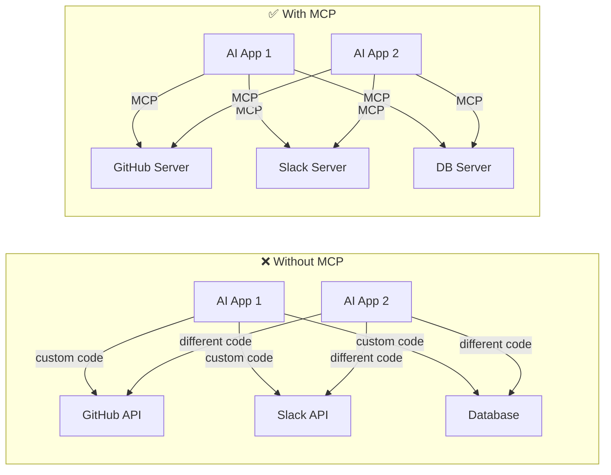

> **Key insight**: A tool/data provider implements **one** MCP server. Different hosts connect through the **same protocol shape**. Build once, integrate everywhere.

---

## 2) Core mental model

MCP has **three main runtime roles**:

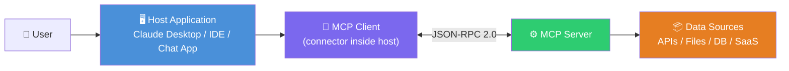

| Role | Responsibility | Examples |
|------|---------------|----------|
| **Host** | Initiates connections, manages clients, enforces security policies, coordinates AI/LLM | Claude Desktop, VS Code, Cursor, custom chat app |
| **Client** | MCP-speaking connector inside the host; maintains isolated 1:1 connection with a server | SDK client instance |
| **Server** | Exposes capabilities (tools, resources, prompts) to clients | GitHub MCP server, filesystem server, DB server |

### 🔄 End-to-end request flow

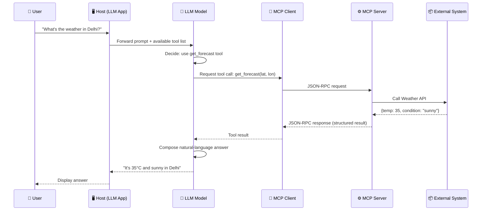

### 🏗️ One host, many servers

A single host typically connects to **multiple** MCP servers simultaneously:

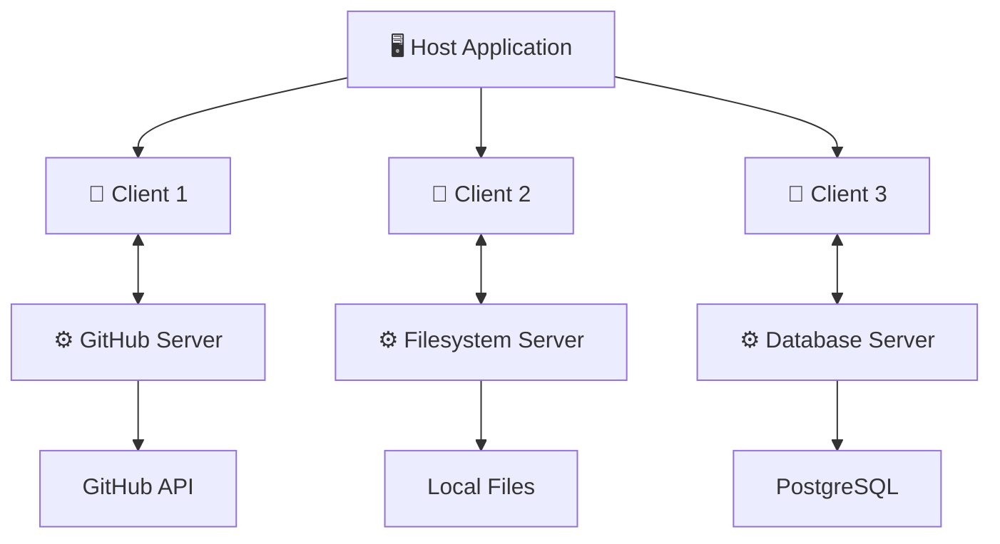

> **Important**: Each client maintains an **isolated 1:1 connection** with its server. Servers don't talk to each other directly.

---

## 3) Main primitives

MCP servers expose **three primary capability types**, and clients can optionally expose additional capabilities back to servers.

### 🔷 Server-side primitives

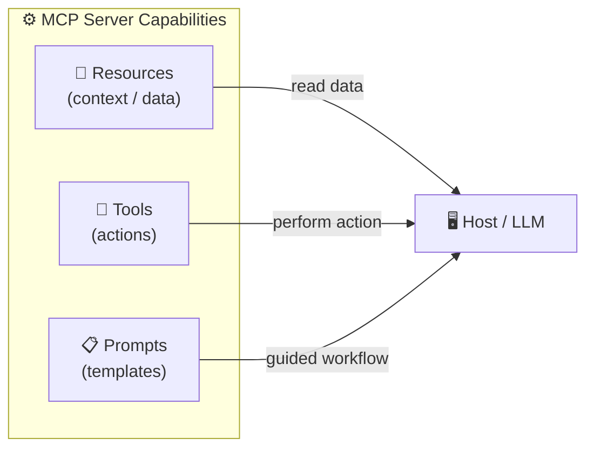

#### 📄 1. Resources — *things you read*
Resources are file-like or data-like things the client can read: file contents, API responses, logs, or generated context.

| Use resources when... | Example URIs |
|---|---|
| You want to provide context to the model | `file:///repo/README.md` |
| The operation is more "read this" than "do this" | `db://orders/today` |
| Content may be browsed, selected, or injected into prompts | `docs://runbook/oncall` |

**New in 2025**: Resources can now contain **resource links** — a `resource_link` type that allows tools to point to URIs instead of inlining all data, reducing payload size.

#### 🔧 2. Tools — *things the model can do*
Tools are executable functions that the model can invoke (typically with user approval) to perform actions or compute results.

| Use tools when... | Examples |
|---|---|
| The model needs to take an action | `create_jira_ticket` |
| Arguments should be validated | `get_weather_forecast` |
| The result is dynamic or operational | `deploy_service` |

**New in 2025**: Tools can now return **structured JSON output** via `structuredContent`, not just text. They can also have **icons** for richer UI display.

#### 📋 3. Prompts — *reusable workflows*
Prompts are reusable templates or interaction patterns that help users accomplish common tasks.

| Use prompts when... | Examples |
|---|---|
| You want a guided interaction pattern | "Summarize this incident timeline" |
| The workflow is repeatable | "Generate release notes from commits" |
| You want consistency | "Create test cases for this API spec" |

### 🔶 Client-side primitives

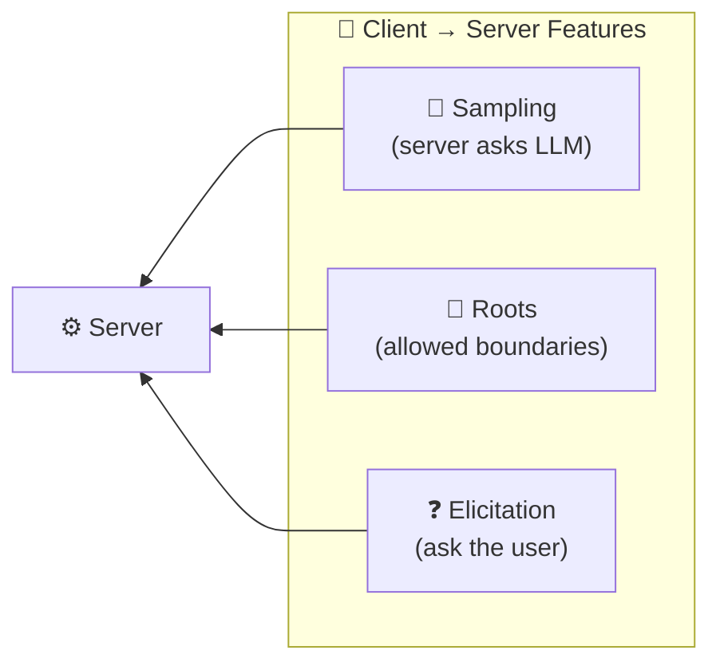

| Primitive | Direction | Purpose |
|---|---|---|
| **Sampling** | Server → LLM | Server-initiated LLM interactions or recursive agent behavior |
| **Roots** | Client → Server | Boundaries (allowed filesystem/URI roots) |
| **Elicitation** | Server → User | Structured requests for additional user input mid-session |

### 🧠 Memory aid

```
┌──────────────────────────────────────────────┐
│          PRIMITIVES CHEAT SHEET              │
├─────────────┬────────────────────────────────┤
│ Resources   │  📄 = context (read data)      │
│ Tools       │  🔧 = actions (do things)      │
│ Prompts     │  📋 = templates (guided flows) │
├─────────────┼────────────────────────────────┤
│ Sampling    │  🧠 = ask the model            │
│ Roots       │  📁 = where server may operate │
│ Elicitation │  ❓ = ask the user             │
└─────────────┴────────────────────────────────┘
```

---

## 4) Protocol basics

The MCP protocol uses **JSON-RPC 2.0** message format, **stateful connections**, and **capability negotiation** between client and server.

### 🔄 Connection lifecycle

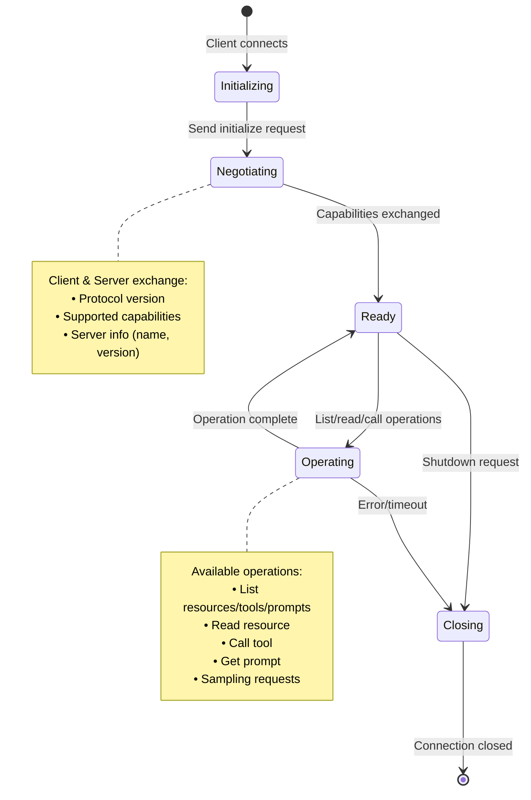

### 📨 JSON-RPC message examples

```json
// ── Client → Server: Initialize ──
{
  "jsonrpc": "2.0",
  "id": 1,
  "method": "initialize",
  "params": {
    "protocolVersion": "2025-11-25",
    "capabilities": {
      "roots": { "listChanged": true },
      "sampling": {}
    },
    "clientInfo": {
      "name": "my-ai-app",
      "version": "1.0.0"
    }
  }
}

// ── Client → Server: Call a tool ──
{
  "jsonrpc": "2.0",
  "id": 42,
  "method": "tools/call",
  "params": {
    "name": "get_forecast",
    "arguments": { "latitude": 28.6139, "longitude": 77.2090 }
  }
}

// ── Server → Client: Tool result ──
{
  "jsonrpc": "2.0",
  "id": 42,
  "result": {
    "content": [
      { "type": "text", "text": "35°C, sunny, humidity 45%" }
    ]
  }
}
```

### Why JSON-RPC?

JSON-RPC gives MCP a **clean request/response structure** with named methods and structured parameters, making tool invocation predictable and easy to implement across languages.

### Why stateful connections?

Stateful communication helps maintain **session context**, supports **progress tracking**, **cancellation**, and richer interaction patterns — instead of treating every call as an isolated HTTP request.

> **Breaking change (2025-06-18)**: JSON-RPC batching has been **removed** from the MCP spec. Each message must be sent individually.

---

## 5) Transport layer: STDIO vs Streamable HTTP

MCP supports two transport mechanisms. The choice depends on whether your server is **local** or **remote**.

### 📊 Transport comparison

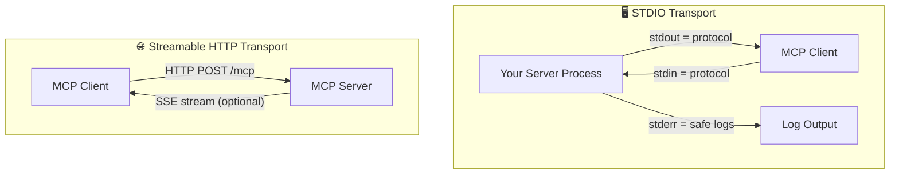

| Feature | STDIO | Streamable HTTP |
|---------|-------|-----------------|
| **Use case** | Local, same-machine | Remote, over network |
| **Network needed?** | ❌ No | ✅ Yes |
| **Latency** | Very low | Network-dependent |
| **Single endpoint** | N/A | ✅ `/mcp` |
| **Streaming support** | Via pipes | Via SSE on same endpoint |
| **Auth support** | Process-level | OAuth 2.0 |
| **Scalability** | Single process | Horizontally scalable |

### ⚠️ The #1 STDIO gotcha

```
┌──────────────────────────────────────────────────────────────┐
│  🚨 CRITICAL: In STDIO mode, stdout IS the protocol channel │
│                                                              │
│  ✅ DO:   Use stderr for logs, or write to a file            │
│  ❌ DON'T: Use print() / console.log to stdout               │
│                                                              │
│  Random print() statements WILL break the JSON-RPC stream!   │
└──────────────────────────────────────────────────────────────┘
```

```python
# ❌ BAD — breaks the protocol
print("Debug: processing request")

# ✅ GOOD — logs to stderr
import sys
print("Debug: processing request", file=sys.stderr)

# ✅ GOOD — use Python logging
import logging
logging.basicConfig(stream=sys.stderr)
logger = logging.getLogger(__name__)
logger.info("Processing request")
```

### 🔄 SSE → Streamable HTTP evolution

The **March 2025 spec** (`2025-03-26`) introduced **Streamable HTTP** as the modern standard, deprecating the older SSE-based transport:

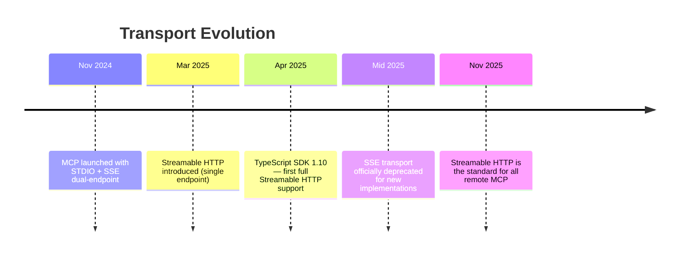

**Why the change?**
- SSE required **two endpoints** (one for SSE stream, one for HTTP POST) — complex
- Long-lived SSE connections had **scalability issues**
- Response loss if SSE connection dropped mid-operation
- Streamable HTTP uses a **single `/mcp` endpoint** for everything

---

## 6) MCP vs function calling

Many people first think MCP is just "tool calling." That is **incomplete**.

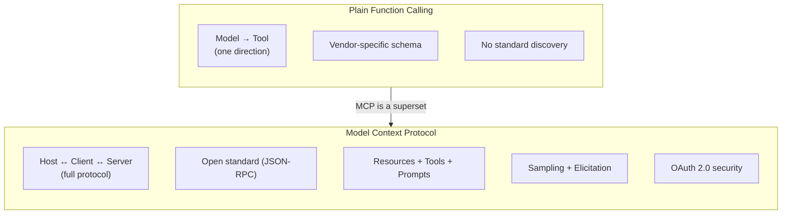

| Dimension | Plain Function Calling | MCP |
|---|---|---|
| **Scope** | Model-to-tool only | Full protocol: host ↔ client ↔ server |
| **Standardization** | Often vendor-specific | Open protocol with shared spec |
| **Read/context data** | Ad hoc | First-class **Resources** |
| **Reusable workflows** | Limited | First-class **Prompts** |
| **Bidirectional** | Usually one-way | **Sampling** (server asks LLM), **Elicitation** (server asks user) |
| **Transport** | Varies | JSON-RPC 2.0 over STDIO or Streamable HTTP |
| **Auth/Security** | Varies | OAuth 2.0, consent model, resource indicators |
| **Discovery** | Manual | Auto-discovery of tools, resources, prompts |
| **Structured output** | Vendor-dependent | `structuredContent` (JSON) since June 2025 |

> **Intuition**: Function calling is **one feature** inside the broader problem space that MCP standardizes.

---

## 7) A practical example

The official tutorial uses a **weather server** with two tools: `get_alerts` and `get_forecast`.

### 🔧 Tool exposure

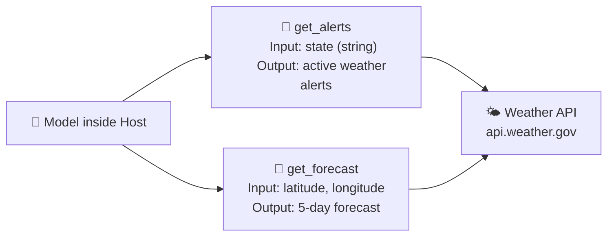

### ⚡ What happens under the hood (step by step)

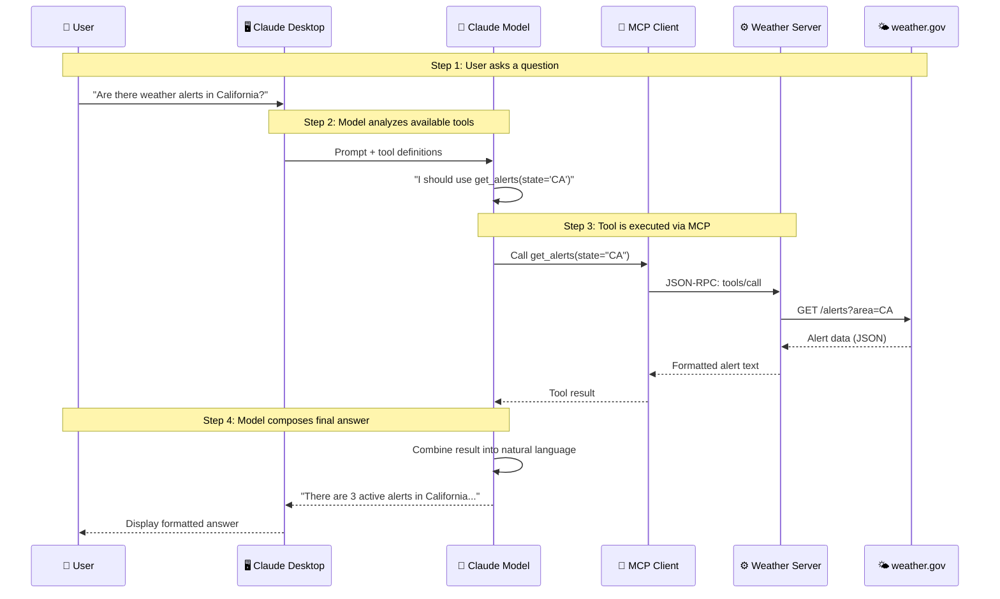

---

## 8) Full Python example (FastMCP)

Here's a comprehensive example showing **all three primitives** — not just tools.

```python
from mcp.server.fastmcp import FastMCP

# ── Initialize the server ──────────────────────────────
mcp = FastMCP("engineering-copilot")


# ═══════════════════════════════════════════════════════
# 📄 RESOURCES — contextual data the model can read
# ═══════════════════════════════════════════════════════

@mcp.resource("docs://system-design/{topic}")
def get_design_doc(topic: str) -> str:
    """Get system design notes on a given topic."""
    docs = {
        "cache-strategies": "## Caching\n- Write-through\n- Write-back\n- Write-around\n- Read-through vs Cache-aside...",
        "kafka-patterns":   "## Kafka\n- Producer → Topic → Partition → Consumer Group\n- Exactly-once semantics with idempotent producer...",
        "database-sharding": "## Sharding\n- Hash-based vs Range-based\n- Consistent hashing for rebalancing...",
    }
    return docs.get(topic, f"No notes found for '{topic}'")

@mcp.resource("config://app/settings")
def get_app_config() -> str:
    """Return current application configuration."""
    return """{
        "environment": "production",
        "database": "postgresql://db.internal:5432/myapp",
        "cache_ttl_seconds": 300,
        "feature_flags": {"new_ui": true, "beta_api": false}
    }"""


# ═══════════════════════════════════════════════════════
# 🔧 TOOLS — actions the model can perform
# ═══════════════════════════════════════════════════════

@mcp.tool()
def search_notes(query: str, max_results: int = 5) -> str:
    """Search through engineering notes and return relevant matches.

    Args:
        query: Search query string
        max_results: Maximum number of results to return (default: 5)
    """
    # In production, this would search a vector DB or full-text index
    return f"Found {max_results} results for '{query}':\n1. Kafka consumer lag monitoring\n2. Cache invalidation strategies..."

@mcp.tool()
def get_interview_question(topic: str, difficulty: str = "medium") -> str:
    """Generate a technical interview question on a given topic.

    Args:
        topic: The technical topic (e.g., 'system-design', 'java', 'kafka')
        difficulty: Question difficulty — easy, medium, or hard
    """
    return f"[{difficulty.upper()}] {topic}: Design a distributed rate limiter that handles 10K req/s..."

@mcp.tool()
def run_health_check(service: str) -> str:
    """Check the health status of a backend service.

    Args:
        service: Name of the service to check
    """
    # In production, this would hit actual health endpoints
    return f"✅ {service}: healthy | latency: 12ms | uptime: 99.97%"


# ═══════════════════════════════════════════════════════
# 📋 PROMPTS — reusable interaction templates
# ═══════════════════════════════════════════════════════

@mcp.prompt()
def mock_interview(topic: str) -> str:
    """Start a mock backend engineering interview session."""
    return f"""You are a senior engineering interviewer. Conduct a technical interview 
    focused on {topic}. Start with a concept question, then move to a system design 
    problem. Give feedback on each answer. Be encouraging but rigorous."""

@mcp.prompt()
def incident_review(service: str, timeframe: str) -> str:
    """Guide through a structured incident review."""
    return f"""Review the incident for {service} during {timeframe}.
    Follow this structure:
    1. Timeline of events
    2. Root cause analysis
    3. Impact assessment
    4. Action items
    5. Lessons learned"""


# ── Run the server ─────────────────────────────────────
if __name__ == "__main__":
    # Use STDIO for local, "streamable-http" for remote
    mcp.run(transport="stdio")
```

### ✨ Why FastMCP is nice

FastMCP uses Python **type hints** and **docstrings** to automatically generate tool definitions:

```
┌────────────────────────────────┬───────────────────────────────┐
│  Your Python Code              │  Auto-generated MCP Schema    │
├────────────────────────────────┼───────────────────────────────┤
│  Function name                 │  → tool name                  │
│  Function signature            │  → input JSON Schema          │
│  Type hints (str, int, etc.)   │  → parameter types            │
│  Docstring                     │  → tool description           │
│  Default values                │  → optional parameters        │
└────────────────────────────────┴───────────────────────────────┘
```

For a backend engineer, this should feel similar to **exposing typed service contracts** and letting framework metadata drive interface generation (think: Spring Boot `@RestController` with auto-generated OpenAPI docs).

---

## 9) TypeScript tool shape

The MCP quickstart shows tools being listed with name, description, and JSON Schema for inputs:

```ts
// Tool definition — what the server advertises to the client
{
  name: "get-forecast",
  description: "Get weather forecast for a location",
  inputSchema: {
    type: "object",
    properties: {
      latitude:  { type: "number", description: "Latitude coordinate"  },
      longitude: { type: "number", description: "Longitude coordinate" }
    },
    required: ["latitude", "longitude"]
  }
}

// Tool result — what the server returns after execution
{
  content: [
    {
      type: "text",
      text: "Temperature: 35°C, Condition: Sunny, Humidity: 45%"
    }
  ],
  // NEW in 2025-06-18: optional structured JSON output
  structuredContent: {
    temperature: 35,
    condition: "sunny",
    humidity: 45,
    unit: "celsius"
  }
}
```

---

## 10) Java / Spring intuition

If you work in Java/Spring, here's how MCP concepts map to familiar patterns:

```
┌─────────────────────┬──────────────────────────────────────────┐
│  MCP Concept        │  Java/Spring Equivalent                  │
├─────────────────────┼──────────────────────────────────────────┤
│  MCP Server         │  Spring Boot microservice                │
│  Tool               │  @RestController endpoint                │
│  Tool inputSchema   │  @RequestBody DTO with @Valid            │
│  Resource           │  @GetMapping read-only endpoint          │
│  Prompt             │  Reusable service template / workflow    │
│  JSON-RPC           │  REST/gRPC contract                      │
│  Capability negotiation │  Content negotiation / API versioning│
│  Client discovery   │  Service registry (Eureka/Consul)        │
├─────────────────────┼──────────────────────────────────────────┤
│  KEY DIFFERENCE     │  The caller is an LLM, not a human       │
│                     │  frontend or another microservice.        │
└─────────────────────┴──────────────────────────────────────────┘
```

```java
// Conceptual Java equivalent of an MCP tool definition
@McpTool(name = "deploy_service", description = "Deploy a service to production")
public DeployResult deployService(
    @McpParam(description = "Service name") String serviceName,
    @McpParam(description = "Target environment") String environment,
    @McpParam(description = "Docker image tag") String imageTag
) {
    // validate, deploy, return structured result
    return new DeployResult(serviceName, environment, "deployed", Instant.now());
}
```

> **Note**: This is conceptual pseudocode. The actual Java MCP SDK (developed by Spring/Microsoft) follows similar patterns. The C# SDK 1.0 was released March 2026 with full 2025-11-25 spec support.

---

## 11) Resources vs Tools decision guide

A common beginner mistake is turning **everything** into a tool. Use the right primitive:

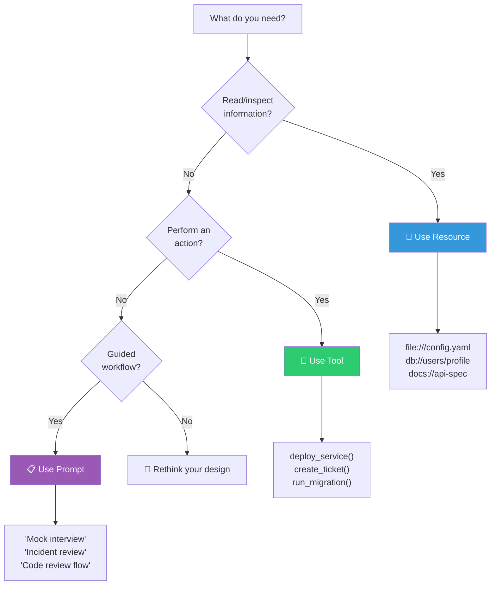

| Need | Better Fit | Why |
|---|---|---|
| Read a config file | 📄 Resource | Contextual data, not an action |
| Fetch API result for model context | 📄 Resource | Read-only context |
| Fetch API result with user parameters | 🔧 Tool | Dynamic, parameterized action |
| Trigger deployment | 🔧 Tool | Performs an action with side effects |
| "Summarize this incident" template | 📋 Prompt | Reusable guided workflow |
| Ask user for missing info mid-session | ❓ Elicitation | Structured user input request |

> **Rule of thumb**: If the user/model wants to *inspect* information → Resource. If the model needs to *make something happen* → Tool.

---

## 12) Security & authorization

The MCP spec emphasizes that MCP can enable **arbitrary data access and code execution paths**, so implementers must handle security carefully.

### 🔐 Security architecture (2025-11-25 spec)

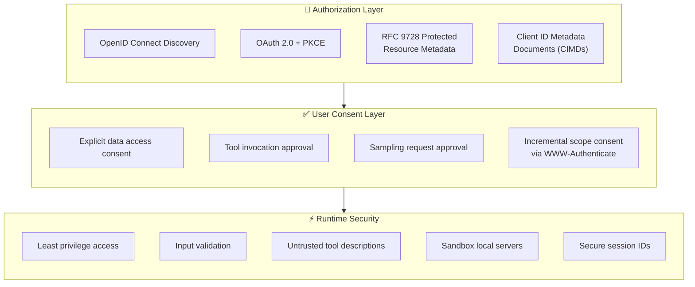

### 🔑 Key security principles (from the spec)

| Principle | What it means |
|---|---|
| **Explicit consent** | Users must approve data access, tool invocation, and sampling |
| **Untrusted descriptions** | Tool descriptions from third-party servers should be treated as untrusted |
| **Least privilege** | Grant servers only the minimum necessary access |
| **OAuth 2.0 Resource Servers** | MCP servers are OAuth 2.0 Resource Servers (June 2025+) |
| **Resource indicators** | Clients include `resource` parameter (RFC 8707) to bind tokens to specific servers |
| **Sender-constrained tokens** | Access tokens scoped to a specific sender (mTLS or DPoP) |

### ✅ Practical security checklist

```
 ✅  Prefer least privilege for server access
 ✅  Whitelist directories, repos, or APIs via Roots
 ✅  Log sensitive actions to stderr (STDIO) or secure logging
 ✅  Require user confirmation for write/destructive tools
 ✅  Separate read-only and write-capable servers
 ✅  Treat third-party MCP servers like any privileged integration
 ✅  Use OAuth 2.0 with PKCE for remote servers
 ✅  Rotate session IDs and bind to user-specific info
 ✅  Run local servers in sandboxed environments
 ✅  Implement input validation and output filtering
 ✅  Use short-lived access tokens (5-15 min) + refresh tokens
```

---

## 13) What's new in the 2025 spec

Two major spec releases happened in 2025:

### 📅 Spec timeline

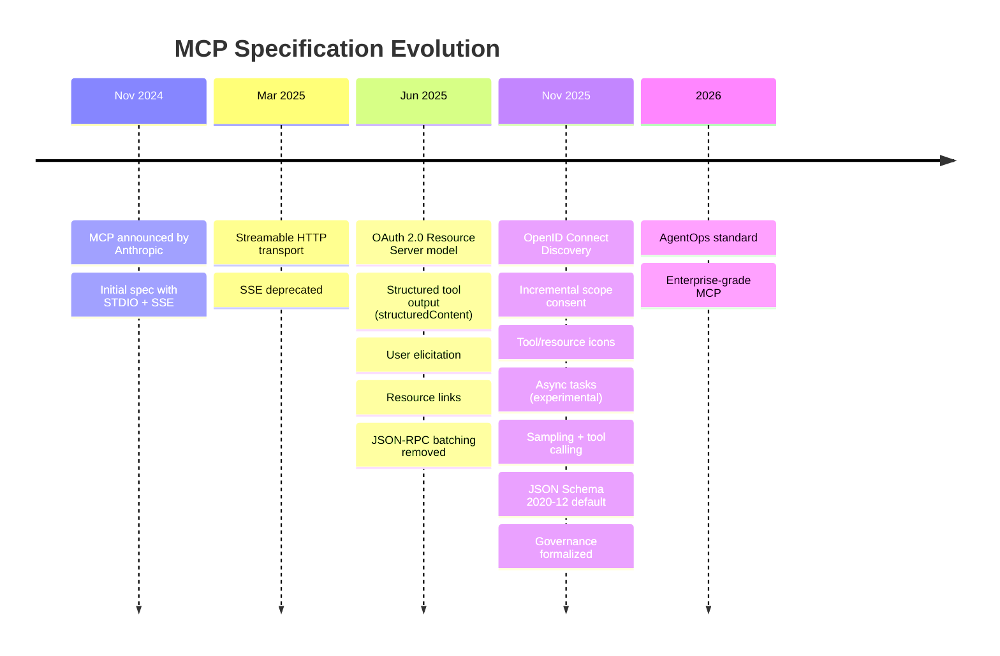

### 🆕 Key new features

| Feature | Spec Version | What it does |
|---|---|---|
| **Structured tool output** | June 2025 | Tools return JSON via `structuredContent` alongside text |
| **User elicitation** | June 2025 | Server sends `elicitation/create` to ask user for input mid-session |
| **Resource links** | June 2025 | Tools return `resource_link` URIs instead of inlining all data |
| **OAuth 2.0 model** | June 2025 | MCP servers classified as OAuth 2.0 Resource Servers |
| **Server icons** | Nov 2025 | Tools, resources, prompts can have icons for richer UI |
| **Async tasks** | Nov 2025 | Track long-running operations with polling + deferred results |
| **Sampling + tools** | Nov 2025 | `tools` and `toolChoice` parameters in sampling requests |
| **Enum schemas** | Nov 2025 | Titled, untitled, single-select, multi-select enums in elicitation |
| **SDK tiering** | Nov 2025 | Clear requirements for SDK feature support and maintenance |

### 💡 What async tasks unlock

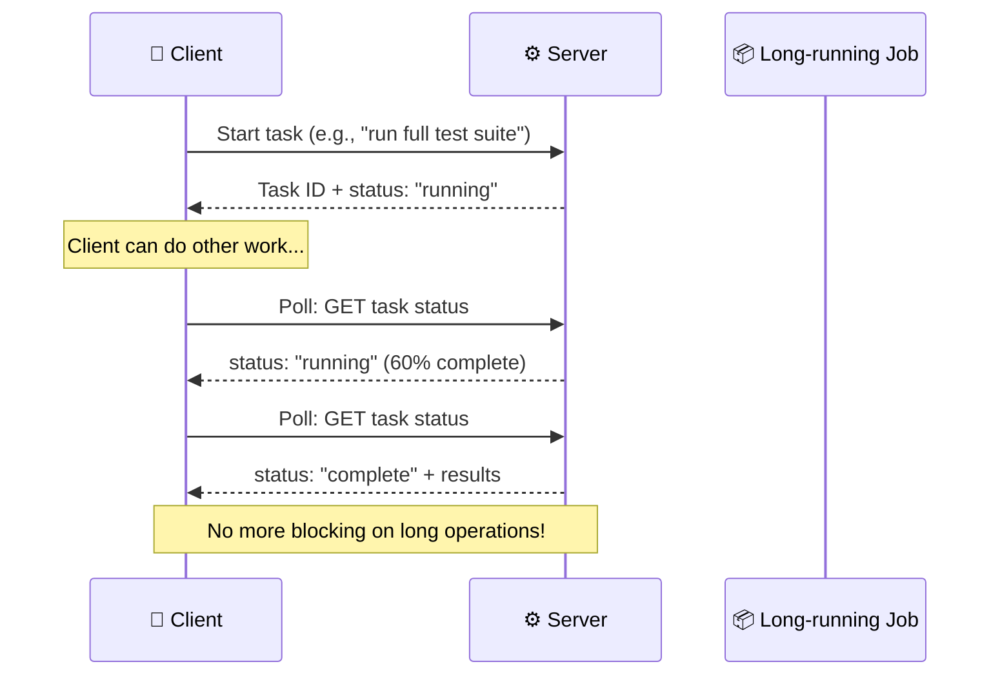

---

## 14) MCP ecosystem landscape

The MCP ecosystem has grown rapidly since late 2024. Here are notable servers and integrations:

### 🗺️ Ecosystem map

```mermaid
flowchart TB
    MCP["🔌 MCP Ecosystem"] --> DEV["💻 Developer Tools"]
    MCP --> CLOUD["☁️ Cloud & Infra"]
    MCP --> PROD["📊 Productivity"]
    MCP --> DATA["🗄️ Data & Search"]
    MCP --> SPECIAL["🎯 Specialized"]

    DEV --> D1["GitHub — repo management, PRs, issues"]
    DEV --> D2["Playwright — browser automation & testing"]
    DEV --> D3["Figma — design access from AI"]
    DEV --> D4["Docker — sandboxed tool execution"]
    DEV --> D5["Context7 — live docs for frameworks"]

    CLOUD --> C1["AWS — CLI commands via MCP"]
    CLOUD --> C2["Google Cloud — Maps, BigQuery, GKE"]
    CLOUD --> C3["Cloudflare — Workers, KV, R2"]

    PROD --> P1["Notion — page management"]
    PROD --> P2["Slack — notifications & commands"]
    PROD --> P3["Google Workspace — Docs, Sheets, Drive"]

    DATA --> DA1["PostgreSQL — database operations"]
    DATA --> DA2["Elasticsearch — log/metric queries"]
    DATA --> DA3["SQLite — lightweight DB access"]
    DATA --> DA4["Filesystem — local file operations"]

    SPECIAL --> S1["Blender — 3D design via AI"]
    SPECIAL --> S2["Ghidra — reverse engineering"]
    SPECIAL --> S3["SVGMaker — SVG generation"]
```

### 🏢 Who supports MCP as a host?

| Host | Type | Status |
|------|------|--------|
| **Claude Desktop** | Desktop AI assistant | ✅ Native support |
| **Cursor** | AI-powered IDE | ✅ Native support |
| **VS Code (Copilot)** | IDE | ✅ MCP integration |
| **Windsurf** | AI IDE | ✅ Native support |
| **OpenAI (ChatGPT)** | AI platform | ✅ MCP support announced |
| **Custom apps** | Any LLM application | ✅ Via SDKs (Python, TypeScript, C#, Kotlin, Rust, Ruby) |

---

## 15) Where MCP fits in real systems

MCP shines when you want **one AI host** to work with **many tools and data sources in a modular way**.

### 🏗️ Real-world architecture example

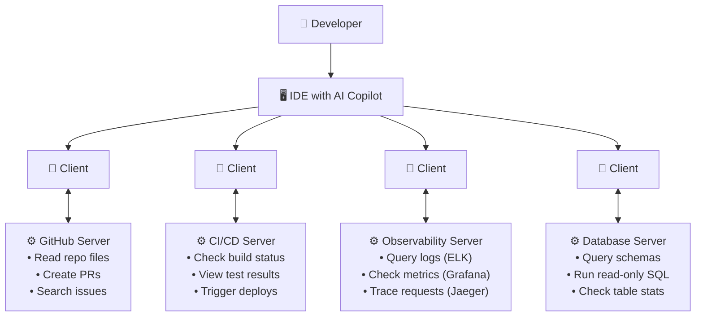

### 💼 Use case examples

| Use Case | Resources | Tools | Prompts |
|---|---|---|---|
| **IDE assistant** | Repo files, docs, configs | Run tests, create PRs, search code | "Code review checklist" |
| **DevOps copilot** | Deploy status, logs, metrics | Restart service, scale pods, rollback | "Incident response flow" |
| **Support bot** | KB articles, ticket history | Create ticket, escalate, tag | "Troubleshooting guide" |
| **Data assistant** | Dashboard data, table schemas | Run queries, generate reports | "Data analysis workflow" |
| **Interview prep** | Study notes, question bank | Generate questions, grade answers | "Mock interview session" |

---

## 16) Common mistakes

```
 ❌  Treating MCP as only tool calling
     → It also includes resources, prompts, sampling, elicitation

 ❌  Exposing dangerous tools without approval UX
     → The spec emphasizes explicit consent for all operations

 ❌  Logging to stdout in STDIO mode
     → This breaks the JSON-RPC protocol stream

 ❌  Vague tool descriptions or weak schemas
     → Models make worse decisions with poor metadata

 ❌  Turning read-only context into tools
     → Use resources for data the model reads, tools for actions

 ❌  Ignoring the transport evolution
     → SSE is deprecated; use Streamable HTTP for remote servers

 ❌  Skipping capability negotiation
     → Always implement proper initialize → negotiate → operate flow

 ❌  Not using structured output
     → Since June 2025, tools can return structuredContent (JSON)

 ❌  Hardcoding auth instead of using OAuth 2.0
     → The spec standardizes OAuth 2.0 for remote server auth
```

---

## 17) Learning roadmap

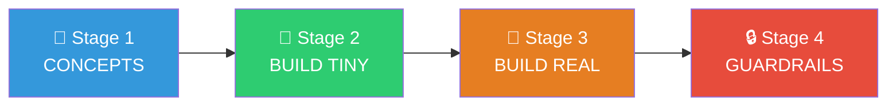

### 🎯 Stage 1: Understand the concepts
- Host, Client, Server roles
- Resources, Tools, Prompts
- JSON-RPC and capability negotiation
- STDIO vs Streamable HTTP transport

### 🔨 Stage 2: Build a tiny local server
- One or two toy tools (`add`, `greet`, `read_log_tail`)
- One resource (`config://settings`)
- STDIO transport
- Clean schemas and docstrings

### 🚀 Stage 3: Build something real
- GitHub issue helper
- Local repo context server
- AWS diagnostics assistant
- Interview-prep knowledge server
- Kafka monitoring dashboard server

### 🔒 Stage 4: Add guardrails
- User approval flows
- OAuth 2.0 for remote access
- Scoped access via Roots
- Structured error handling
- Logging to stderr for STDIO servers
- Input validation and output filtering

---

## 18) Suggested project for you

A strong learning project for a **Java/backend engineer** preparing for high-package roles:

### 🛠️ Engineering Copilot MCP Server

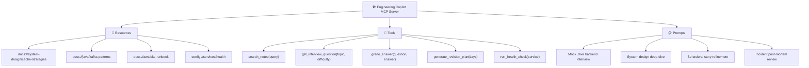

### Why this is a great project

| Benefit | How |
|---|---|
| Shows protocol understanding | You implement all 3 primitives correctly |
| Demonstrates structured tooling | Type-safe inputs, structured outputs |
| Practically useful | Actually helps you prepare for interviews |
| Portfolio-worthy | Shows AI integration design aligned with your backend profile |
| Extensible | Can add Kafka diagnostics, DynamoDB stats, deployment tools |

---

## 19) Interview-style explanation

### "What is MCP?"

> MCP is an open standard for connecting AI applications to external tools and context through a consistent protocol. It uses JSON-RPC 2.0, defines host-client-server roles, and supports primitives like resources (read data), tools (perform actions), and prompts (reusable workflows) — so integrations are reusable instead of vendor-specific.

### "Why should backend engineers care?"

> Because MCP lets you package business capabilities and context as standardized services for AI hosts — similar to how APIs package application capabilities for other software systems. With MCP, your service health checks, deployment tools, and operational runbooks become first-class capabilities that any AI host can discover and use.

### "How is it different from just function calling?"

> Function calling is one feature inside the broader problem space MCP standardizes. MCP adds first-class resources (read-only context), prompts (reusable templates), bidirectional features (sampling, elicitation), standardized transport, OAuth 2.0 security, and auto-discovery of capabilities. It's a full protocol, not just a tool-calling mechanism.

### "What changed in 2025?"

> Two major spec releases: June 2025 added structured tool output, OAuth 2.0 security model, user elicitation, and resource links. November 2025 added async tasks for long-running operations, server icons, advanced authorization (OpenID Connect), and governance formalization. The transport also evolved from SSE to Streamable HTTP as the standard for remote servers.

---

## 20) Quick glossary

| Term | Definition |
|---|---|
| **Host** | The app that uses the model and starts MCP connections (e.g., Claude Desktop, Cursor) |
| **Client** | The MCP-speaking connector inside the host; 1:1 with a server |
| **Server** | The provider of tools, resources, or prompts |
| **Resource** | Read-oriented context/data exposed by the server |
| **Tool** | Executable function the model can use (with user approval) |
| **Prompt** | Reusable template/workflow for common tasks |
| **Sampling** | Server-triggered LLM interaction, subject to user control |
| **Roots** | Allowed working boundaries (filesystem/URI scope) |
| **Elicitation** | Server asking the user for structured input mid-session |
| **Streamable HTTP** | Modern transport for remote MCP (replaced SSE) |
| **JSON-RPC 2.0** | The message format MCP uses for client-server communication |
| **structuredContent** | JSON output from tools (added June 2025) |
| **Async tasks** | Long-running operations with polling (added Nov 2025, experimental) |
| **Resource links** | URIs returned by tools pointing to resources (added June 2025) |

---

## 21) Best references

| Resource | Best for |
|---|---|
| [Anthropic intro article](https://anthropic.com/news/model-context-protocol) | Motivation and open-standard positioning |
| [Official specification](https://spec.modelcontextprotocol.io/) | Protocol roles, features, security guidance |
| [Official build-server tutorial](https://modelcontextprotocol.io/quickstart/server) | Practical implementation details and gotchas |
| [FastMCP documentation](https://gofastmcp.com/) | Python SDK for building MCP servers |
| [MCP TypeScript SDK](https://github.com/modelcontextprotocol/typescript-sdk) | TypeScript SDK and examples |
| [Nov 2025 changelog](https://modelcontextprotocol.io/blog/changelog-2025-11-25) | Latest spec changes and new features |
| [MCP GitHub org](https://github.com/modelcontextprotocol) | Official repos, SDKs, inspector, registry |

---

## 🎯 Final intuition

```
┌──────────────────────────────────────────────────────────────┐
│                                                              │
│   APIs expose software → to software                        │
│   MCP  exposes context & capabilities → to AI applications  │
│                                                              │
│   📄  Resources  let models KNOW                             │
│   🔧  Tools      let models ACT                              │
│   📋  Prompts    let users REUSE workflows                   │
│   🧠  Sampling   lets servers ASK the model                  │
│   ❓  Elicitation lets servers ASK the user                  │
│                                                              │
│   Once that clicks, the rest of MCP becomes                 │
│   much easier to reason about.                              │
│                                                              │
└──────────────────────────────────────────────────────────────┘
```

---

*Last updated: March 2026 | Covers MCP spec versions up to 2025-11-25*