# 🧠 RAG, Fine-Tuning & LLM Mastery — Practical README

> A comprehensive guide to **Retrieval-Augmented Generation (RAG)**, **Fine-Tuning**, **Prompt Engineering**, and related LLM concepts — with architecture diagrams, code examples, decision frameworks, and interview-ready explanations.  
> *Last updated: March 2026*

---

## 📑 Table of Contents

| # | Section | What you'll learn |
|---|---------|-------------------|
| 1 | [The Big Picture](#1-the-big-picture) | How RAG, fine-tuning, and prompt engineering fit together |
| 2 | [Vector Embeddings](#2-vector-embeddings--semantic-search) | How text becomes math the model can search |
| 3 | [RAG Architecture](#3-rag-architecture) | End-to-end retrieval-augmented generation pipeline |
| 4 | [Advanced RAG Techniques](#4-advanced-rag-techniques) | Reranking, query rewriting, hybrid search, GraphRAG, Agentic RAG |
| 5 | [Chunking Strategies](#5-chunking-strategies) | How to split documents for optimal retrieval |
| 6 | [Fine-Tuning Fundamentals](#6-fine-tuning-fundamentals) | Full fine-tuning, PEFT, LoRA, QLoRA |
| 7 | [Alignment Techniques](#7-alignment-techniques-rlhf--dpo) | RLHF, DPO, and human preference optimization |
| 8 | [RAG vs Fine-Tuning](#8-rag-vs-fine-tuning--decision-framework) | When to use which, and when to combine both |
| 9 | [Prompt Engineering](#9-prompt-engineering) | Zero-shot, few-shot, CoT, system prompts |
| 10 | [The LLM Application Stack](#10-the-llm-application-stack) | Full architecture from model to production |
| 11 | [Code Examples](#11-code-examples) | Python code for RAG, fine-tuning, and prompting |
| 12 | [Evaluation & Metrics](#12-evaluation--metrics) | How to measure RAG and fine-tuning quality |
| 13 | [Common Mistakes](#13-common-mistakes) | Pitfalls to avoid |
| 14 | [Interview-Ready Explanations](#14-interview-ready-explanations) | Concise answers for technical interviews |
| 15 | [Learning Roadmap](#15-learning-roadmap) | Stage-by-stage progression |
| 16 | [Glossary](#16-glossary) | Quick reference for all key terms |

---

## 1) The Big Picture

There are **three main strategies** for making an LLM more useful for your specific needs:

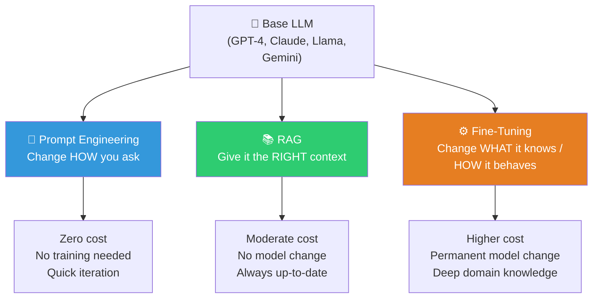

### 💡 One-line intuition for each

```
┌───────────────────────────────────────────────────────────────────┐
│                                                                   │
│  📝 Prompt Engineering  →  "Ask smarter questions"                │
│  📚 RAG                 →  "Give the model a cheat sheet"         │
│  ⚙️ Fine-Tuning         →  "Send the model back to school"       │
│                                                                   │
│  🔗 Combine them        →  "Best of all worlds"                   │
│                                                                   │
└───────────────────────────────────────────────────────────────────┘
```

### 🤔 When to use what (quick reference)

| Scenario | Best approach |
|---|---|
| Need latest/real-time data | 📚 RAG |
| Need to change model's tone/style | ⚙️ Fine-tuning |
| Quick experiment, no infra | 📝 Prompt engineering |
| Domain-specific jargon/reasoning | ⚙️ Fine-tuning + 📚 RAG |
| Reduce hallucinations with source citations | 📚 RAG |
| Lower inference latency | ⚙️ Fine-tuning (no retrieval step) |
| Enterprise with proprietary docs | 📚 RAG (data stays in your infra) |

---

## 2) Vector Embeddings & Semantic Search

Before understanding RAG, you need to understand **how text becomes searchable math**.

### What are embeddings?

Embeddings convert unstructured data (text, images, audio) into **dense numerical vectors** — lists of numbers where similar meanings are **close together** in vector space.

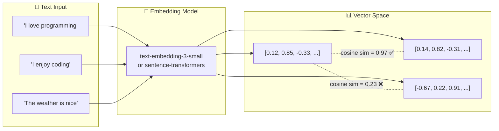

### 🔍 Keyword search vs Semantic search

```
┌─────────────────────────────────┬──────────────────────────────────┐
│  🔤 Keyword Search (BM25)       │  🧠 Semantic Search (Vectors)    │
├─────────────────────────────────┼──────────────────────────────────┤
│  Matches exact words            │  Matches meaning/intent          │
│  "car" ≠ "automobile"          │  "car" ≈ "automobile" ✅          │
│  Fast, simple                   │  More compute, richer results    │
│  Great for precise terms        │  Great for natural questions     │
│  No understanding of context    │  Understands paraphrasing        │
├─────────────────────────────────┴──────────────────────────────────┤
│  💡 BEST PRACTICE: Use HYBRID SEARCH (combine both)               │
│     BM25 for precision + vectors for semantic recall              │
└───────────────────────────────────────────────────────────────────┘
```

### 🗄️ Popular vector databases

| Database | Type | Key features |
|---|---|---|
| **Pinecone** | Managed cloud | Fully managed, scales to billions |
| **Weaviate** | Open-source | Hybrid search, multimodal |
| **Qdrant** | Open-source | Rust-based, fast, filtered search |
| **Chroma** | Open-source | Lightweight, great for prototyping |
| **Milvus** | Open-source | Enterprise-grade, GPU acceleration |
| **PostgreSQL + pgvector** | Extension | Familiar SQL, good for small-medium scale |
| **Elasticsearch** | Hybrid | Dense + sparse vectors, k-NN search |

### Similarity metrics

```
 Cosine Similarity  →  Measures angle between vectors (most common)
 Euclidean Distance →  Measures straight-line distance
 Dot Product        →  Measures both magnitude and direction
 
 💡 Use cosine similarity for text. It normalizes for length,
    so short and long texts can still match well.
```

---

## 3) RAG Architecture

RAG = **Retrieval-Augmented Generation**. It gives the LLM access to external knowledge **at inference time** without changing the model's weights.

### 🏗️ End-to-end RAG pipeline

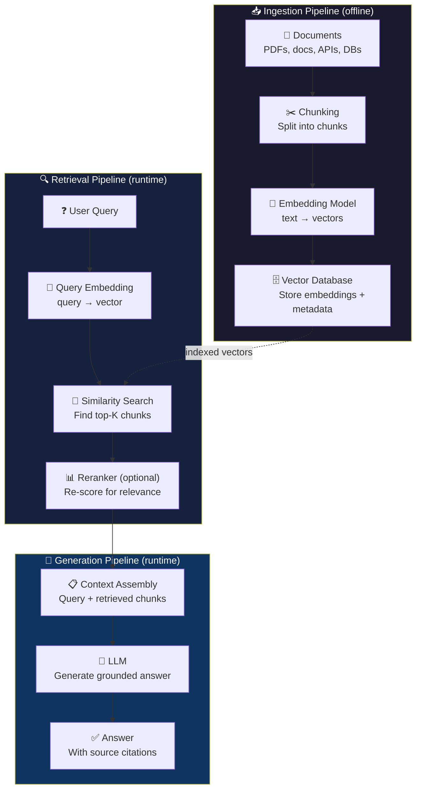

### 🔄 Step-by-step RAG flow

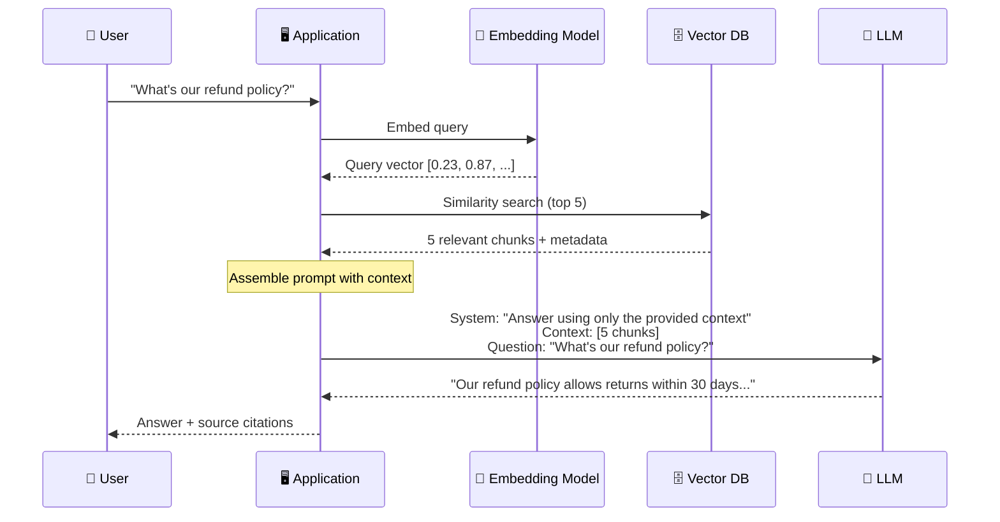

### Why RAG works

| Problem with base LLMs | How RAG solves it |
|---|---|
| **Knowledge cutoff** — model doesn't know recent info | Retrieves from updated knowledge base |
| **Hallucinations** — model confidently makes things up | Grounds answers in real documents |
| **No access to private data** — model never saw your docs | Retrieves from your private knowledge base |
| **No source attribution** — "trust me bro" | Can cite exact documents and passages |
| **Expensive to update** — retraining costs $$$  | Just update the knowledge base |

---

## 4) Advanced RAG Techniques

Basic RAG (query → retrieve → generate) has limitations. Advanced techniques address them:

### 🗺️ Advanced RAG landscape

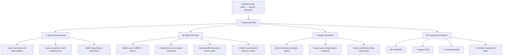

### 🔑 Key techniques explained

#### 🔄 Query rewriting
The user's raw query is often suboptimal for retrieval. An LLM **rewrites** the query before searching.

```
User query:    "why is my app slow?"
Rewritten:     "common causes of application performance degradation 
                in microservices architecture including database latency 
                and memory leaks"
```

#### 📊 Reranking
Initial retrieval finds ~20 candidates. A **cross-encoder reranker** (like Cohere Rerank or a fine-tuned model) rescores them for relevance, keeping only the best 3-5.

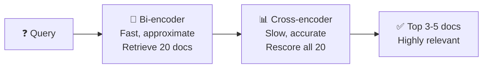

#### 🔀 HyDE (Hypothetical Document Embeddings)
Instead of embedding the query, ask the LLM to generate a **hypothetical answer**, then embed *that* to find similar real documents.

```
Query: "How does Kafka ensure message ordering?"

Step 1: LLM generates hypothetical answer:
  "Kafka ensures message ordering within a partition by assigning
   monotonically increasing offsets. Producers can specify partition 
   keys to ensure related messages go to the same partition..."

Step 2: Embed this hypothetical answer → search vector DB
  (Better semantic match than the short query alone)
```

#### 🕸️ GraphRAG
Uses a **knowledge graph** instead of (or alongside) flat text chunks. Entities and relationships enable **multi-hop reasoning**.

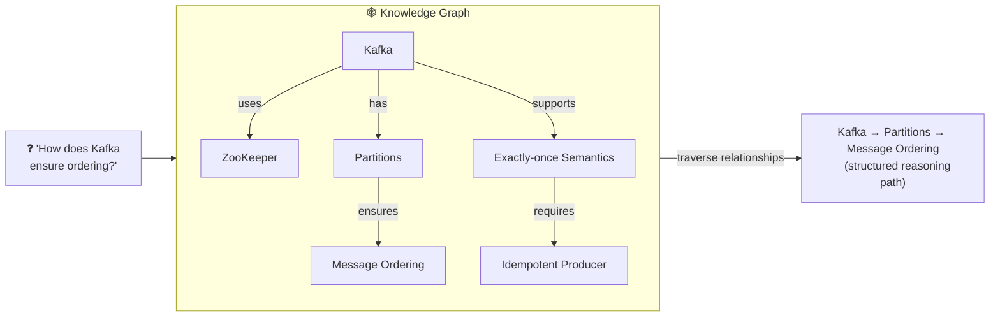

#### 🤖 Agentic RAG
An **autonomous agent** orchestrates retrieval: it plans, retrieves, evaluates, and iterates until it has enough context.

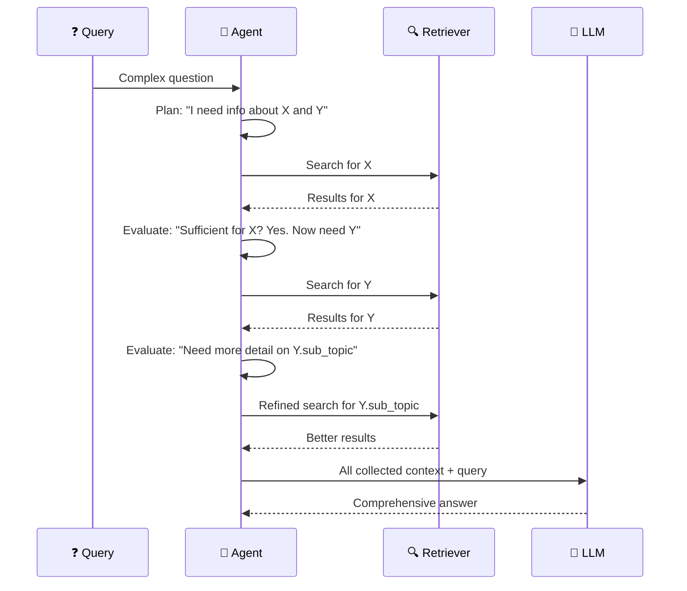

#### 📸 Multimodal RAG
Retrieves and reasons across **text, images, tables, and diagrams** — not just plain text.

#### 💾 Memory-Augmented RAG
Adds **conversation history** to the retrieval context, enabling multi-turn dialogue where the model remembers previous answers.

---

## 5) Chunking Strategies

How you split documents into chunks **dramatically affects** retrieval quality.

### 📐 Chunking comparison

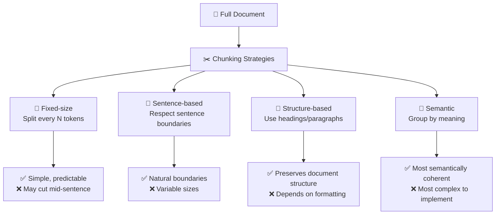

### 📊 Chunking strategy details

| Strategy | Chunk size | Overlap | Best for |
|---|---|---|---|
| **Fixed token window** | 200-400 tokens | 10-20% overlap | General purpose, quick setup |
| **Sentence-based** | Group sentences to ~300 tokens | Full sentence overlap | Well-written prose, articles |
| **Paragraph/heading** | Natural paragraphs | None (natural boundaries) | Structured documents (docs, wikis) |
| **Semantic chunking** | Variable | Based on similarity threshold | Complex documents, technical content |
| **Recursive splitting** | Hierarchical (try paragraphs → sentences → words) | Configurable | Mixed document types |

### ⚖️ The chunk size tradeoff

```
 Too small (50-100 tokens)          Too large (1000+ tokens)
 ┌──────────────────────┐          ┌──────────────────────┐
 │ ✅ Precise retrieval  │          │ ✅ More context       │
 │ ❌ Missing context    │          │ ❌ Noisy retrieval    │
 │ ❌ Fragmented meaning │          │ ❌ Diluted relevance  │
 │ ❌ More API calls     │          │ ❌ Hits context limits│
 └──────────────────────┘          └──────────────────────┘
                     
                 🎯 Sweet spot: 200-500 tokens
                    (experiment for your domain)
```

### 💡 Chunking best practices

```
 ✅  Always add metadata (source, page, section, date)
 ✅  Use overlap (10-20%) to prevent context loss at boundaries
 ✅  Match chunk size to your embedding model's optimal input
 ✅  Test with your actual queries — there's no universal best
 ✅  Consider parent-child chunking: small chunks for retrieval,
     return the parent (larger context) for generation
```

---

## 6) Fine-Tuning Fundamentals

Fine-tuning **modifies the model's weights** so it internalizes domain knowledge, tone, or behavior.

### 🎯 Full fine-tuning vs PEFT

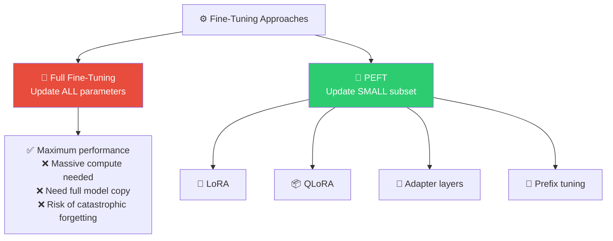

### 🔧 LoRA — How it works

**LoRA (Low-Rank Adaptation)** freezes all original model weights and injects small trainable matrices into specific layers.

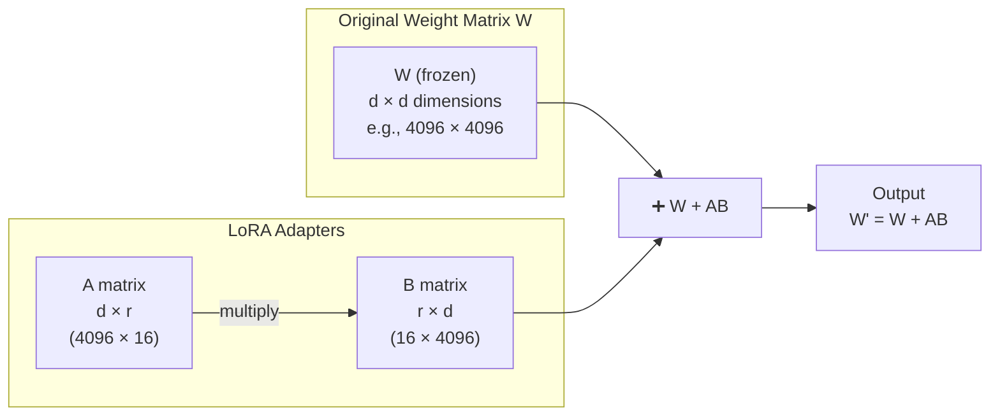

```
┌─────────────────────────────────────────────────────────────────┐
│  LoRA Key Insight                                               │
│  ─────────────────                                              │
│  Original: 4096 × 4096 = 16.7M parameters per layer            │
│  LoRA:     4096 × 16 + 16 × 4096 = 131K parameters per layer   │
│                                                                  │
│  That's ~128× fewer trainable parameters!                       │
│  r (rank) is a hyperparameter: typically 4, 8, 16, or 32       │
└─────────────────────────────────────────────────────────────────┘
```

### 📦 QLoRA — LoRA + Quantization

QLoRA makes fine-tuning even more accessible by **quantizing the base model to 4-bit** before applying LoRA:

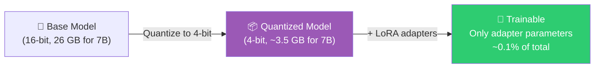

### 📊 Fine-tuning methods comparison

| Method | Trainable params | GPU memory | Training time | Performance |
|---|---|---|---|---|
| **Full fine-tuning** | 100% | Very high (4-8× A100s) | Days-weeks | 🏆 Best (theoretical) |
| **LoRA** | ~0.1-1% | Moderate (1× A100) | Hours-days | 🥈 Near full FT |
| **QLoRA** | ~0.1-1% | Low (1× consumer GPU) | Hours-days | 🥉 Slightly below LoRA |
| **Adapter layers** | ~1-5% | Moderate | Hours | Good for classification |
| **Prefix tuning** | ~0.1% | Low | Hours | Good for generation |

### When to fine-tune

```
 ✅ Fine-tune when you need to:
    • Change the model's tone/style/personality permanently
    • Teach domain-specific jargon and reasoning patterns
    • Improve performance on a narrow, well-defined task
    • Reduce inference cost (fine-tuned model needs shorter prompts)
    • Enforce specific output formats consistently

 ❌ Don't fine-tune when:
    • Your data changes frequently (use RAG instead)
    • You need source attribution (use RAG instead)
    • You have very little training data (<100 examples)
    • A good prompt can solve the problem (try prompt engineering first)
```

---

## 7) Alignment Techniques: RLHF & DPO

After initial training/fine-tuning, models need **alignment** — teaching them to produce outputs humans actually prefer.

### 🔄 RLHF (Reinforcement Learning from Human Feedback)

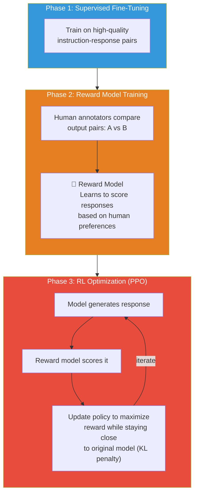

### 🎯 DPO (Direct Preference Optimization)

DPO simplifies RLHF by **eliminating the reward model entirely**:

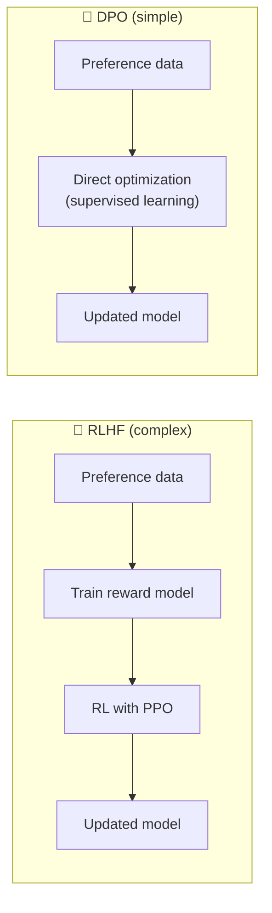

### RLHF vs DPO comparison

| Feature | RLHF | DPO |
|---|---|---|
| **Complexity** | High (3 phases, RL loop) | Low (single training phase) |
| **Reward model needed?** | ✅ Yes | ❌ No |
| **Stability** | Sensitive to hyperparameters | More stable |
| **Compute cost** | High | Lower (~50% of RLHF) |
| **Implementation** | Complex (PPO is tricky) | Simple (supervised loss) |
| **Performance** | Excellent with good reward model | Comparable or slightly better |
| **2025 trend** | Still used for complex cases | **Becoming the default** |

### 💡 Practical recommendation (2025)

```
┌───────────────────────────────────────────────────────────┐
│  The winning combo in 2025:                               │
│                                                           │
│  1. SFT (Supervised Fine-Tuning) on your task data        │
│  2. QLoRA to keep compute manageable                      │
│  3. DPO for preference alignment                          │
│                                                           │
│  This gives you domain expertise + aligned behavior       │
│  on a single consumer GPU (24-48 GB VRAM)                 │
└───────────────────────────────────────────────────────────┘
```

---

## 8) RAG vs Fine-Tuning — Decision Framework

### 🎯 Decision flowchart

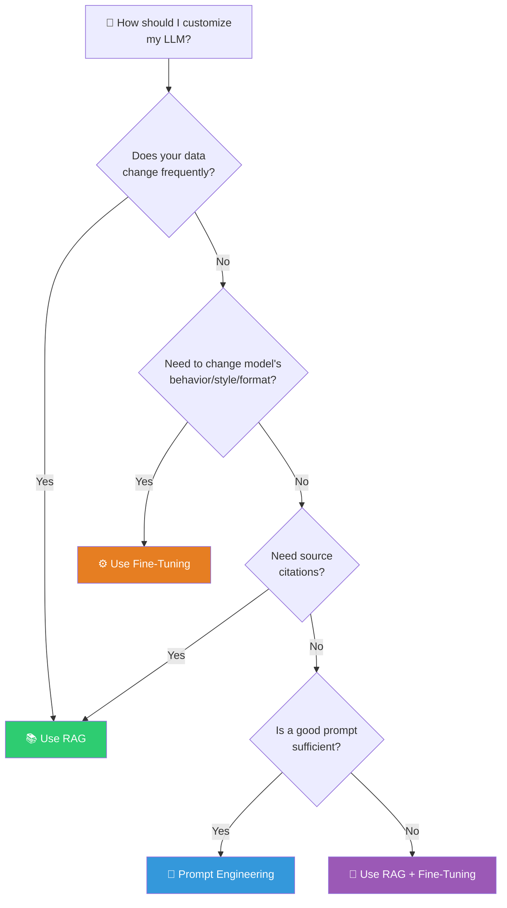

### 📊 Head-to-head comparison

| Dimension | 📚 RAG | ⚙️ Fine-Tuning |
|---|---|---|
| **How it works** | Retrieves external data at query time | Modifies model weights permanently |
| **Data freshness** | ✅ Always up-to-date (update KB) | ❌ Locked at training time |
| **Cost** | ✅ Lower (no training, just infra) | ❌ Higher (GPU training costs) |
| **Setup time** | ✅ Hours-days | ❌ Days-weeks |
| **Latency** | ❌ Higher (retrieval step) | ✅ Lower (no retrieval) |
| **Source citations** | ✅ Built-in | ❌ Not natively supported |
| **Behavior change** | ❌ Limited (can't change style) | ✅ Full control over tone/format |
| **Domain knowledge** | Surface-level (retrieves, doesn't internalize) | ✅ Deep internalization |
| **Hallucination risk** | ✅ Lower (grounded in docs) | ❌ Can still hallucinate |
| **Data requirement** | Knowledge base (any format) | Curated training dataset |
| **Privacy** | ✅ Data stays in your infra | ❌ Data used in training |

### 🔗 The Hybrid Approach (2025 best practice)

The most sophisticated systems in 2025 combine both:

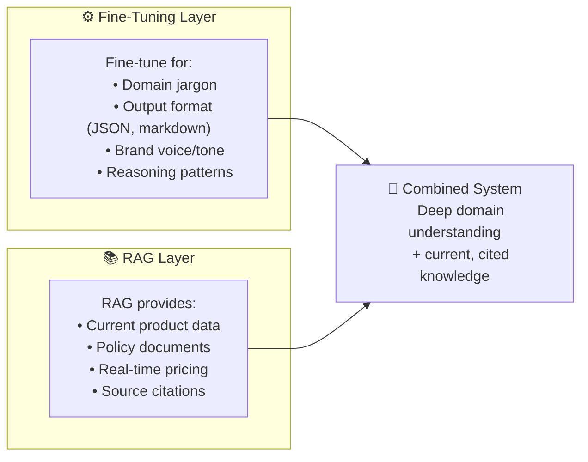

**Example**: A legal AI assistant:
- **Fine-tuned** on legal reasoning patterns, citation formats, and case law terminology
- **RAG** retrieves the latest statutes, case law, and firm-specific briefs at query time

---

## 9) Prompt Engineering

Prompt engineering is the art of crafting inputs to get the best outputs from an LLM — **no training required**.

### 📊 Technique overview

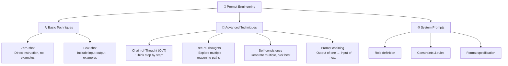

### 🔤 Zero-shot prompting

Direct instruction without examples. Relies on the model's pre-trained knowledge.

```
 ┌──────────────────────────────────────────────────────────┐
 │  Prompt:                                                  │
 │  "Classify this customer email as positive, negative,     │
 │  or neutral: 'The product arrived late but works great'"  │
 │                                                           │
 │  Output: "Mixed/Neutral — negative delivery experience,   │
 │  positive product satisfaction"                            │
 └──────────────────────────────────────────────────────────┘
```

**Best for**: Simple, well-defined tasks. Quick prototyping.

### 📋 Few-shot prompting

Include **examples** in the prompt to show the model the desired format and reasoning:

```
 ┌──────────────────────────────────────────────────────────┐
 │  Prompt:                                                  │
 │                                                           │
 │  Classify customer emails:                                │
 │                                                           │
 │  Email: "Love it! Best purchase ever!"                    │
 │  Classification: POSITIVE                                 │
 │                                                           │
 │  Email: "It broke on day one. Want a refund."             │
 │  Classification: NEGATIVE                                 │
 │                                                           │
 │  Email: "The product arrived late but works great"        │
 │  Classification:                                          │
 │                                                           │
 │  Output: MIXED                                            │
 └──────────────────────────────────────────────────────────┘
```

**Best for**: Tasks where format/style matters. When zero-shot isn't accurate enough.

### 🧠 Chain-of-Thought (CoT) prompting

Ask the model to **show its reasoning step by step**. Dramatically improves accuracy on math, logic, and multi-step problems.

```
 ┌──────────────────────────────────────────────────────────┐
 │  ❌ Without CoT:                                          │
 │  Q: "If a shirt costs ₹800 and is 25% off, what's the   │
 │  price after 18% GST on the discounted price?"           │
 │  A: "₹629"  (wrong!)                                     │
 │                                                           │
 │  ✅ With CoT:                                              │
 │  Q: "...Think step by step."                              │
 │  A: "Step 1: Original price = ₹800                        │
 │      Step 2: Discount = 25% of 800 = ₹200                │
 │      Step 3: Discounted price = 800 - 200 = ₹600         │
 │      Step 4: GST = 18% of 600 = ₹108                     │
 │      Step 5: Final price = 600 + 108 = ₹708"  ✅         │
 └──────────────────────────────────────────────────────────┘
```

### 🌳 Tree-of-Thoughts (ToT)

For complex planning, explore **multiple reasoning paths** and evaluate each:

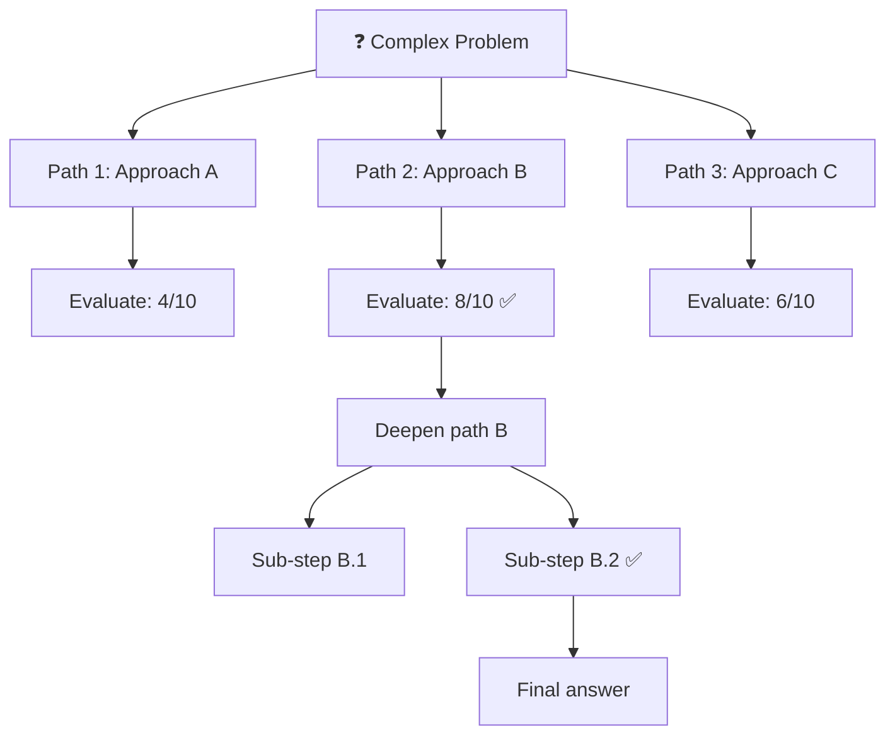

### ⚙️ System prompt best practices

```
 ✅  Define a clear role and persona
     "You are a senior Java backend engineer with 10 years of experience..."

 ✅  Set explicit output format
     "Respond in JSON with keys: analysis, recommendation, confidence"

 ✅  Include constraints and boundaries
     "Never make up statistics. If unsure, say 'I don't know'."

 ✅  Provide guidelines and anti-patterns
     "Use strong, specific verbs. Avoid vague phrases like 'it depends'."

 ✅  Use delimiters for sections
     "Context will be enclosed in <context></context> tags."

 ✅  Add examples of desired output
     "Here is an example of a good response: ..."
```

---

## 10) The LLM Application Stack

How all these concepts fit together in a production system:

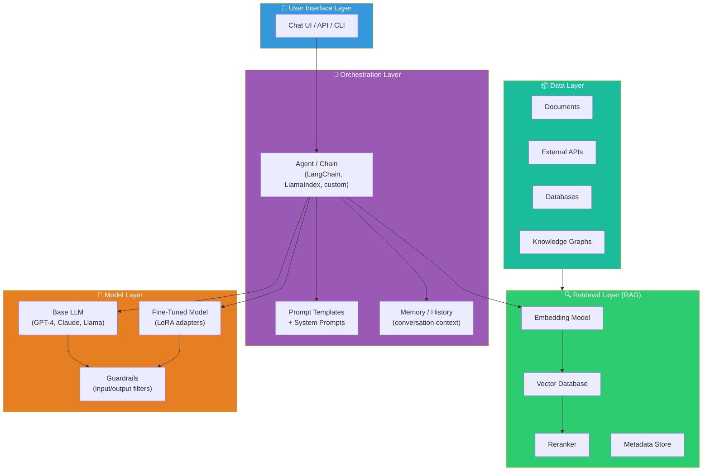

---

## 11) Code Examples

### 📚 Basic RAG with Python

```python
# ── RAG Pipeline using LangChain + ChromaDB ──────────

from langchain_community.document_loaders import TextLoader
from langchain.text_splitter import RecursiveCharacterTextSplitter
from langchain_openai import OpenAIEmbeddings, ChatOpenAI
from langchain_community.vectorstores import Chroma
from langchain.chains import RetrievalQA

# ============================
# Step 1: Load & chunk documents
# ============================
loader = TextLoader("company_policies.txt")
documents = loader.load()

splitter = RecursiveCharacterTextSplitter(
    chunk_size=500,      # ~500 tokens per chunk
    chunk_overlap=50,    # 50 token overlap for context continuity
    separators=["\n\n", "\n", ". ", " "],  # Try paragraph → sentence → word
)
chunks = splitter.split_documents(documents)
print(f"Split into {len(chunks)} chunks")

# ============================
# Step 2: Embed & store in vector DB
# ============================
embeddings = OpenAIEmbeddings(model="text-embedding-3-small")
vectorstore = Chroma.from_documents(
    documents=chunks,
    embedding=embeddings,
    persist_directory="./chroma_db"
)

# ============================
# Step 3: Query with RAG
# ============================
llm = ChatOpenAI(model="gpt-4o-mini", temperature=0)
qa_chain = RetrievalQA.from_chain_type(
    llm=llm,
    chain_type="stuff",  # stuff = inject all retrieved chunks into prompt
    retriever=vectorstore.as_retriever(
        search_kwargs={"k": 5}  # retrieve top 5 chunks
    ),
    return_source_documents=True,
)

result = qa_chain.invoke({"query": "What is our refund policy?"})
print(result["result"])
for doc in result["source_documents"]:
    print(f"  Source: {doc.metadata['source']}")
```

### ⚙️ Fine-Tuning with QLoRA

```python
# ── QLoRA Fine-Tuning with Hugging Face + PEFT ──────

from transformers import (
    AutoModelForCausalLM,
    AutoTokenizer,
    TrainingArguments,
    Trainer,
    BitsAndBytesConfig,
)
from peft import LoraConfig, get_peft_model, prepare_model_for_kbit_training
from datasets import load_dataset
import torch

# ============================
# Step 1: Load model in 4-bit (QLoRA)
# ============================
bnb_config = BitsAndBytesConfig(
    load_in_4bit=True,
    bnb_4bit_quant_type="nf4",          # NormalFloat4 quantization
    bnb_4bit_compute_dtype=torch.bfloat16,
    bnb_4bit_use_double_quant=True,     # Double quantization for even less memory
)

model_name = "meta-llama/Llama-3.2-3B-Instruct"
model = AutoModelForCausalLM.from_pretrained(
    model_name,
    quantization_config=bnb_config,
    device_map="auto",
)
tokenizer = AutoTokenizer.from_pretrained(model_name)

# ============================
# Step 2: Configure LoRA adapters
# ============================
model = prepare_model_for_kbit_training(model)

lora_config = LoraConfig(
    r=16,               # Rank — higher = more capacity, more memory
    lora_alpha=32,       # Scaling factor
    target_modules=[     # Which layers to adapt
        "q_proj", "k_proj", "v_proj", "o_proj",
        "gate_proj", "up_proj", "down_proj",
    ],
    lora_dropout=0.05,
    bias="none",
    task_type="CAUSAL_LM",
)
model = get_peft_model(model, lora_config)
model.print_trainable_parameters()
# → "trainable params: 13.1M || all params: 3.21B || trainable%: 0.41%"

# ============================
# Step 3: Train
# ============================
dataset = load_dataset("your-dataset", split="train")

training_args = TrainingArguments(
    output_dir="./lora-finetuned",
    num_train_epochs=3,
    per_device_train_batch_size=4,
    gradient_accumulation_steps=4,
    learning_rate=2e-4,
    fp16=True,
    logging_steps=10,
    save_strategy="epoch",
)

trainer = Trainer(
    model=model,
    args=training_args,
    train_dataset=dataset,
    tokenizer=tokenizer,
)
trainer.train()

# ============================
# Step 4: Save & load adapter
# ============================
model.save_pretrained("./my-lora-adapter")
# Only the adapter weights are saved (~50 MB vs ~6 GB for full model)
```

### 📝 Prompt engineering examples

```python
# ── Prompt Engineering Patterns ──────────────────────

# Zero-shot
zero_shot = """Classify the following text as POSITIVE, NEGATIVE, or NEUTRAL.
Text: "The new update made the app much slower"
Classification:"""

# Few-shot  
few_shot = """Classify customer feedback.

Text: "Absolutely love it!" → POSITIVE
Text: "Worst purchase ever" → NEGATIVE  
Text: "It's okay, nothing special" → NEUTRAL

Text: "Great features but buggy interface" → """

# Chain-of-Thought
cot_prompt = """Solve this step by step:

A Kafka cluster has 3 brokers and a topic with 12 partitions.
If consumer group A has 4 consumers and consumer group B has 6 consumers,
how many partitions does each consumer in each group handle?

Think through this step by step:"""

# System prompt for a backend engineering assistant
system_prompt = """You are a senior Java/Spring Boot backend engineer 
with 10+ years of experience in distributed systems, Kafka, and AWS.

Rules:
- Always consider scalability, reliability, and security
- Use industry-standard patterns (CQRS, event sourcing, saga pattern)
- Provide code examples in Java 21+ with Spring Boot 3.x
- When suggesting architecture, include trade-offs
- Never guess — if unsure, explicitly say so
- Format code with clear comments

Output format:
1. Brief analysis of the problem
2. Recommended approach with justification
3. Code example (if applicable)
4. Trade-offs and considerations"""
```

---

## 12) Evaluation & Metrics

### 📚 RAG evaluation metrics

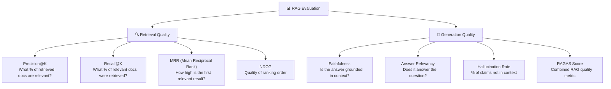

### ⚙️ Fine-tuning evaluation

| Metric | What it measures | Tools |
|---|---|---|
| **Perplexity** | How surprised the model is by test data (lower = better) | Built into training |
| **BLEU / ROUGE** | Overlap with reference outputs | `evaluate` library |
| **Human eval** | Real humans rate quality | Labeling platform |
| **Task-specific accuracy** | Correct answers on your test set | Custom eval script |
| **Win rate** | % of time fine-tuned beats base in A/B test | Side-by-side comparison |

### 📊 The evaluation pyramid

```
                    ┌───────────────┐
                    │  Human Eval   │  Most reliable, most expensive
                    │  (gold std)   │
                ┌───┴───────────────┴───┐
                │  LLM-as-Judge         │  Use GPT-4 / Claude to evaluate
                │  (scalable + cheap)   │
            ┌───┴───────────────────────┴───┐
            │  Automated Metrics            │  BLEU, ROUGE, RAGAS, etc.
            │  (fast + free)                │
        ┌───┴───────────────────────────────┴───┐
        │  Retrieval Metrics                    │  Precision, Recall, MRR
        │  (RAG-specific, measure pipeline)     │
        └───────────────────────────────────────┘
```

---

## 13) Common Mistakes

```
 ❌  Jumping to fine-tuning before trying RAG or prompt engineering
     → Try the cheapest approach first, escalate only if needed

 ❌  Using tiny chunks without overlap
     → Results in fragmented, context-less retrieval

 ❌  Ignoring metadata in your vector DB
     → Metadata filtering is one of the biggest accuracy boosters

 ❌  Not evaluating retrieval quality separately from generation
     → Bad retrieval = bad answers, regardless of LLM quality

 ❌  Fine-tuning on too little data
     → Need at minimum ~100-500 high-quality examples

 ❌  Not using hybrid search (BM25 + vector)
     → Pure vector search misses exact-match scenarios

 ❌  Stuffing too much context into the prompt
     → More context ≠ better answers. Use reranking to filter

 ❌  Treating RAG as set-and-forget
     → Need continuous evaluation, feedback loops, and KB updates

 ❌  Ignoring the chunk size ↔ embedding model relationship
     → Match your chunk size to your embedding model's sweet spot

 ❌  Using RLHF when DPO would suffice
     → DPO is simpler, more stable, and often better in practice

 ❌  Not having a system prompt
     → System prompts are the highest-leverage prompt engineering tool
```

---

## 14) Interview-Ready Explanations

### "What is RAG?"

> RAG connects an LLM to an external knowledge base at query time. When a user asks a question, the system embeds the query, searches a vector database for relevant document chunks, and injects them as context into the LLM's prompt — so the model answers based on real, citable data rather than its training knowledge alone.

### "How is RAG different from fine-tuning?"

> RAG gives the model **access to information** at query time without changing it. Fine-tuning **changes the model itself** by modifying its weights. RAG is like giving someone a reference book during an exam; fine-tuning is like making them study the material beforehand. In 2025, the best systems combine both: fine-tune for behavior/style, RAG for fresh knowledge.

### "What is LoRA?"

> LoRA freezes all the original model weights and injects small trainable matrices into specific layers. These low-rank adapter matrices have ~100-1000× fewer parameters than the full model. This means you can fine-tune a 7B parameter model on a single consumer GPU and store the adapter in ~50MB instead of ~14GB.

### "Explain embeddings to a non-ML person"

> Embeddings convert text into lists of numbers where similar meanings are close together, like coordinates on a map. "happy" and "joyful" would be near each other, while "happy" and "database" would be far apart. This lets computers understand that two differently-worded sentences can mean the same thing.

### "When would you use RAG vs fine-tuning vs prompt engineering?"

> Start with **prompt engineering** — it's free and instant. If the model lacks knowledge, add **RAG** — it retrieves the right context without retraining. If the model's *behavior* or *style* needs to change (jargon, format, personality), then **fine-tune**. For complex production systems, use **all three**: fine-tune the base behavior, RAG for fresh knowledge, and careful prompts to orchestrate the flow.

### "What is Chain-of-Thought prompting?"

> Chain-of-Thought asks the model to break down complex problems into intermediate reasoning steps before giving a final answer — literally "think step by step." This dramatically improves accuracy on math, logic, and multi-step problems because the model allocates compute to each sub-step rather than jumping to a conclusion.

---

## 15) Learning Roadmap

```mermaid
flowchart LR
    S1["🎯 Stage 1
    FOUNDATIONS"] --> S2["📚 Stage 2
    BUILD RAG"] --> S3["⚙️ Stage 3
    FINE-TUNING"] --> S4["🚀 Stage 4
    PRODUCTION"]

    style S1 fill:#3498DB,color:#fff
    style S2 fill:#2ECC71,color:#fff
    style S3 fill:#E67E22,color:#fff
    style S4 fill:#E74C3C,color:#fff
```

### 🎯 Stage 1: Foundations (Week 1-2)
- Understand embeddings, vector spaces, similarity search
- Learn prompt engineering: zero-shot, few-shot, CoT
- Experiment with system prompts on Claude/ChatGPT
- Read about transformer architecture (attention is all you need)

### 📚 Stage 2: Build RAG (Week 3-4)
- Build a basic RAG pipeline with LangChain + ChromaDB
- Experiment with chunking strategies
- Add hybrid search (BM25 + vector)
- Implement reranking with a cross-encoder
- Evaluate with RAGAS metrics

### ⚙️ Stage 3: Fine-Tuning (Week 5-6)
- Fine-tune a small model (Llama 3.2-3B) with QLoRA
- Prepare training data in instruction-response format
- Train on a specific task (classification, Q&A, style transfer)
- Compare fine-tuned vs base + RAG performance

### 🚀 Stage 4: Production systems (Week 7+)
- Build a hybrid system: fine-tuned model + RAG
- Add guardrails (input validation, output filtering)
- Implement evaluation and monitoring
- Deploy with proper auth, rate limiting, and observability
- Build an Agentic RAG system with tool use

---

## 16) Glossary

| Term | Definition |
|---|---|
| **RAG** | Retrieval-Augmented Generation — retrieve docs, inject into LLM prompt |
| **Embedding** | Numerical vector representation of text capturing semantic meaning |
| **Vector Database** | Database optimized for storing and searching embeddings (Pinecone, Chroma, Weaviate) |
| **Chunking** | Splitting documents into smaller pieces for embedding and retrieval |
| **Reranking** | Rescoring retrieved results with a more accurate model before passing to LLM |
| **Fine-Tuning** | Further training a pre-trained model on task-specific data |
| **LoRA** | Low-Rank Adaptation — inject small trainable matrices, freeze base model |
| **QLoRA** | LoRA + 4-bit quantization — fine-tune large models on consumer GPUs |
| **PEFT** | Parameter-Efficient Fine-Tuning — umbrella term for LoRA, adapters, prefix tuning |
| **RLHF** | Reinforcement Learning from Human Feedback — train reward model, optimize with RL |
| **DPO** | Direct Preference Optimization — align model directly from preference data, no reward model |
| **SFT** | Supervised Fine-Tuning — train on instruction-response pairs |
| **CoT** | Chain-of-Thought — prompting technique: "think step by step" |
| **ToT** | Tree-of-Thoughts — explore multiple reasoning paths |
| **HyDE** | Hypothetical Document Embeddings — embed a generated answer to find similar real docs |
| **GraphRAG** | RAG using knowledge graphs for multi-hop reasoning |
| **Agentic RAG** | Autonomous agent that plans, retrieves, evaluates, and iterates |
| **Hybrid Search** | Combining keyword (BM25) + semantic (vector) search |
| **Cross-Encoder** | Model that scores query-document pairs together (used for reranking) |
| **Bi-Encoder** | Model that embeds query and documents separately (used for retrieval) |
| **Cosine Similarity** | Measures angle between vectors — standard similarity metric |
| **Quantization** | Reducing model precision (32-bit → 4-bit) to save memory |
| **Catastrophic Forgetting** | Model forgets general knowledge after fine-tuning on narrow data |
| **Context Window** | Maximum number of tokens an LLM can process at once |
| **Guardrails** | Input/output validation to keep LLM responses safe and on-topic |
| **RAGAS** | Framework for evaluating RAG pipeline quality |

---

*Last updated: March 2026 | Covers RAG, fine-tuning, alignment, and prompt engineering through 2025-2026*
