# 📐 Vector Databases & The Math Behind AI Search — Practical README

> A deep-dive guide to **vector databases**, **similarity mathematics**, **indexing algorithms**, and **the linear algebra that makes AI search work** — with visual diagrams, worked examples, code samples, and engineering intuition.  
> *Last updated: March 2026*

---

## 📑 Table of Contents

| # | Section | What you'll learn |
|---|---------|-------------------|
| 1 | [Why Vector Databases Exist](#1-why-vector-databases-exist) | The problem traditional DBs can't solve |
| 2 | [Linear Algebra Foundations](#2-linear-algebra-foundations) | Vectors, matrices, transformations |
| 3 | [The Math of Similarity](#3-the-math-of-similarity) | Dot product, cosine similarity, Euclidean distance |
| 4 | [Embeddings Deep Dive](#4-embeddings-deep-dive) | How text/images become vectors |
| 5 | [Vector Database Architecture](#5-vector-database-architecture) | Internal components and data flow |
| 6 | [Indexing Algorithms](#6-indexing-algorithms) | HNSW, IVF, LSH — how fast search works |
| 7 | [Product Quantization](#7-product-quantization) | Compressing vectors for scale |
| 8 | [Dimensionality Reduction](#8-dimensionality-reduction) | PCA, t-SNE — seeing high-dimensional data |
| 9 | [Vector DB Comparison](#9-vector-database-comparison) | Pinecone vs Weaviate vs Qdrant vs Chroma vs Milvus vs pgvector |
| 10 | [Hybrid Search](#10-hybrid-search) | Combining keyword + semantic search |
| 11 | [Code Examples](#11-code-examples) | Python — store, search, evaluate |
| 12 | [Performance Tuning](#12-performance-tuning) | Optimizing for production |
| 13 | [System Design Perspective](#13-system-design-perspective) | How to design a vector search system |
| 14 | [Common Mistakes](#14-common-mistakes) | Pitfalls and how to avoid them |
| 15 | [Interview-Ready Explanations](#15-interview-ready-explanations) | Concise answers for interviews |
| 16 | [Glossary](#16-glossary) | Quick reference |

---

## 1) Why Vector Databases Exist

Traditional databases are designed for **exact matching** — find the row where `id = 42` or `name = 'Kafka'`. But AI applications need to answer a fundamentally different question: **"What is most similar to this?"**

### The problem

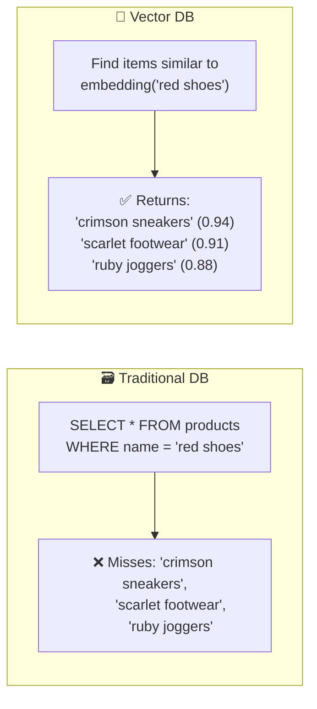

### Traditional vs Vector databases

```
┌────────────────────────────────┬──────────────────────────────────┐
│  🗃️ Traditional Database       │  📐 Vector Database              │
├────────────────────────────────┼──────────────────────────────────┤
│  Stores rows and columns       │  Stores high-dimensional vectors│
│  Exact match (WHERE x = y)     │  Approximate similarity search  │
│  B-tree / hash indexes         │  ANN indexes (HNSW, IVF)        │
│  SQL queries                   │  Vector similarity queries      │
│  Fast: O(log n) exact lookup   │  Fast: O(log n) approx search   │
│  "Find this exact thing"       │  "Find things like this"        │
└────────────────────────────────┴──────────────────────────────────┘
```

---

## 2) Linear Algebra Foundations

Everything in vector databases builds on a few core linear algebra concepts.

### 📊 Scalars, vectors, matrices, tensors

```
 Scalar     →  A single number
                42, 3.14, -7

 Vector     →  An ordered list of numbers (1D)
                [0.23, 0.87, -0.15, 0.62]
                This is what embeddings ARE

 Matrix     →  A 2D grid of numbers (rows × columns)
                [[1, 2, 3],
                 [4, 5, 6]]
                Neural network weights are matrices

 Tensor     →  A generalized n-dimensional array
                Scalar (0D) → Vector (1D) → Matrix (2D) → Tensor (nD)
                Deep learning frameworks work with tensors
```

### 🧮 Vector operations with worked examples

#### Vector addition

```
 a = [1, 3, 5]
 b = [2, 4, 6]
 
 a + b = [1+2, 3+4, 5+6] = [3, 7, 11]
 
 💡 Intuition: Combining two signals/features
```

#### Scalar multiplication

```
 a = [1, 3, 5]
 k = 2
 
 k × a = [2×1, 2×3, 2×5] = [2, 6, 10]
 
 💡 Intuition: Scaling the magnitude without changing direction
```

#### Vector magnitude (norm)

```
 a = [3, 4]
 
 ||a|| = √(3² + 4²) = √(9 + 16) = √25 = 5
 
 For n dimensions:
 ||a|| = √(a₁² + a₂² + ... + aₙ²)
 
 💡 Intuition: The "length" of the vector. Like the hypotenuse 
    of a right triangle (Pythagoras extended to n dimensions)
```

#### Unit vector (normalization)

```
 a = [3, 4],  ||a|| = 5

 â = a / ||a|| = [3/5, 4/5] = [0.6, 0.8]
 
 Now ||â|| = √(0.6² + 0.8²) = √(0.36 + 0.64) = √1 = 1 ✅

 💡 Intuition: Same direction, length = 1
    Cosine similarity normalizes vectors like this internally
```

### 🔢 Matrix multiplication — the heart of neural networks

```
 A (2×3)          B (3×2)          C = A × B (2×2)
 
 [1  2  3]   ×   [7   10]    =   [1×7+2×8+3×9    1×10+2×11+3×12]
 [4  5  6]       [8   11]        [4×7+5×8+6×9    4×10+5×11+6×12]
                  [9   12]    
                              =   [50    68]
                                  [122   167]
                                  
 Rule: (m×n) × (n×p) = (m×p)  — inner dimensions must match!
 
 💡 Intuition: Every neuron in a neural network computes a dot product.
    Matrix multiplication = batched dot products.
    Forward pass through a layer = input × weight matrix
```

---

## 3) The Math of Similarity

Three core metrics used to measure how "close" two vectors are:

### 📐 The three distance/similarity metrics

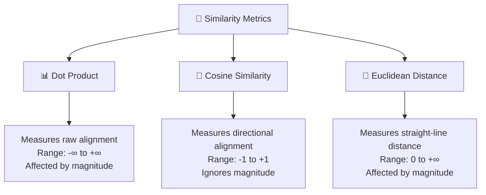

### 1️⃣ Dot Product

The **workhorse** of neural networks. Sum of element-wise products.

```
 a = [2, 3, 1]
 b = [4, 1, 5]
 
 a · b = (2×4) + (3×1) + (1×5)
       = 8 + 3 + 5
       = 16
       
 Geometrically:  a · b = ||a|| × ||b|| × cos(θ)
 
 Positive → vectors point similarly
 Zero     → vectors are perpendicular (orthogonal)
 Negative → vectors point in opposite directions
```

```
 💡 Why it matters:
    • Every neuron computes: output = dot(weights, input) + bias
    • Attention in transformers = dot product of Q and K vectors
    • Fastest to compute of all similarity metrics
    • Use when vectors are already normalized
```

### 2️⃣ Cosine Similarity

Measures the **angle** between vectors, ignoring their length.

```
                    a · b
 cos(θ) = ─────────────────────
           ||a|| × ||b||


 a = [2, 3, 1],  b = [4, 1, 5]
 
 a · b = 16
 ||a|| = √(4 + 9 + 1) = √14 ≈ 3.74
 ||b|| = √(16 + 1 + 25) = √42 ≈ 6.48
 
 cos(θ) = 16 / (3.74 × 6.48) ≈ 16 / 24.24 ≈ 0.66

 Interpretation: 0.66 → moderately similar
```

```
 Value   Meaning            Visual
 ─────   ─────────────      ──────
  1.0    Identical           →  → (same direction)
  0.0    Orthogonal          →  ↑ (perpendicular)
 -1.0    Opposite            →  ← (opposite direction)
  0.95+  Very similar        Typically your "match" threshold
  < 0.5  Quite different     Probably not a good match
```

```
 💡 Why it's the #1 metric for text search:
    • Ignores magnitude → "happy" has the same similarity to "joyful"
      whether the embedding model outputs [0.5, 0.8] or [5.0, 8.0]
    • Works well in high dimensions
    • Most embedding models are trained to maximize cosine similarity
      between semantically related inputs
```

### 3️⃣ Euclidean Distance (L2)

Measures the **straight-line distance** between two points.

```
 d(a, b) = √((a₁-b₁)² + (a₂-b₂)² + ... + (aₙ-bₙ)²)

 a = [2, 3, 1],  b = [4, 1, 5]
 
 d = √((2-4)² + (3-1)² + (1-5)²)
   = √(4 + 4 + 16)
   = √24 ≈ 4.90

 Smaller distance = more similar (opposite of cosine!)
```

```
 💡 When to use Euclidean:
    • When absolute position matters (geographic data, pixel coordinates)
    • Image similarity in some embedding spaces
    • When vectors are already normalized (then cosine ≈ Euclidean)
```

### 🎯 Which metric to use?

```
┌──────────────────┬────────────────────────────────────────────┐
│  Metric          │  When to use                               │
├──────────────────┼────────────────────────────────────────────┤
│  Cosine          │  TEXT search (default for most use cases)   │
│                  │  When magnitude doesn't matter              │
│                  │  When embedding model uses cosine in training│
├──────────────────┼────────────────────────────────────────────┤
│  Dot Product     │  When vectors are normalized (same as cos)  │
│                  │  When magnitude IS meaningful               │
│                  │  Fastest computation                        │
├──────────────────┼────────────────────────────────────────────┤
│  Euclidean (L2)  │  Geographic/spatial data                    │
│                  │  Image embeddings (some models)             │
│                  │  When absolute distance matters             │
└──────────────────┴────────────────────────────────────────────┘

 🔑  Rule: Use whatever metric your EMBEDDING MODEL was trained with.
     If unsure, cosine similarity is almost always a safe default.
```

---

## 4) Embeddings Deep Dive

Embeddings are the **bridge** between human concepts and mathematical vectors.

### 🧠 How embedding models work

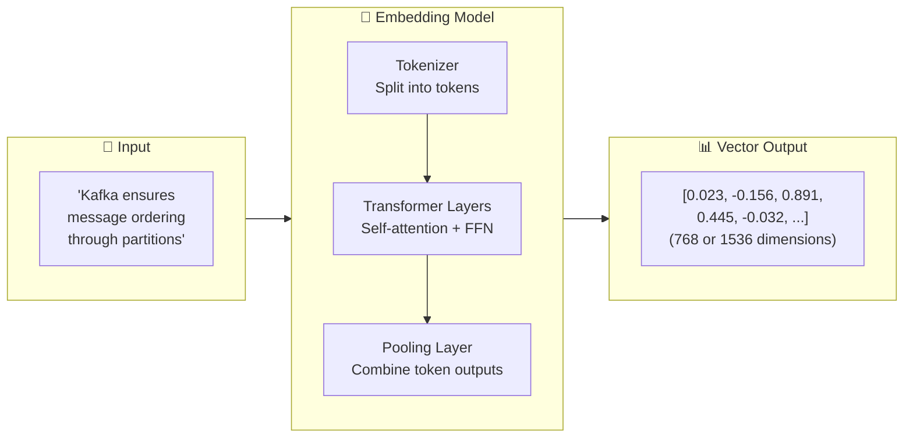

### 📊 Popular embedding models (2025)

| Model | Dimensions | Provider | Best for |
|---|---|---|---|
| **text-embedding-3-large** | 3072 | OpenAI | Highest accuracy, long documents |
| **text-embedding-3-small** | 1536 | OpenAI | Good accuracy, cost-effective |
| **all-MiniLM-L6-v2** | 384 | Sentence-Transformers | Fast, lightweight, open-source |
| **nomic-embed-text** | 768 | Nomic | Open-source, strong performance |
| **Cohere embed-v3** | 1024 | Cohere | Multilingual, search-optimized |
| **BGE-large-en-v1.5** | 1024 | BAAI | Open-source, strong benchmarks |
| **Gemini embedding** | 768 | Google | Multimodal (text + images) |

### 💡 Key insight: Same model for query and document

```
 ⚠️ CRITICAL: The SAME embedding model must be used for both
    indexing documents AND embedding the search query.
    
    Different models produce vectors in DIFFERENT vector spaces.
    Comparing vectors from different models is like comparing
    coordinates on different maps — meaningless!

 ✅ Index with text-embedding-3-small → Query with text-embedding-3-small
 ❌ Index with text-embedding-3-small → Query with all-MiniLM-L6-v2
```

### Dimension tradeoffs

```
 Low dimensions (128-384)          High dimensions (1024-3072)
 ┌──────────────────────┐          ┌──────────────────────┐
 │ ✅ Less memory/storage│          │ ✅ Richer semantics    │
 │ ✅ Faster search       │          │ ✅ Better accuracy     │
 │ ❌ Less nuanced       │          │ ❌ More memory         │
 │ ❌ May lose detail    │          │ ❌ Slower search       │
 └──────────────────────┘          └──────────────────────┘
 
 💡 768 dimensions is the current sweet spot for most use cases.
    Start there, go higher only if recall is insufficient.
```

---

## 5) Vector Database Architecture

A vector database is more than just an ANN index — it's a full data management system.

### 🏗️ Internal architecture

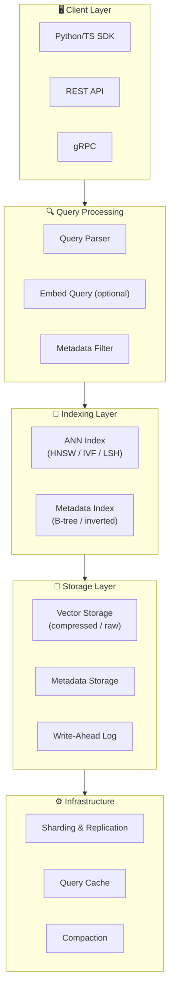

### 📥 Write path (indexing)

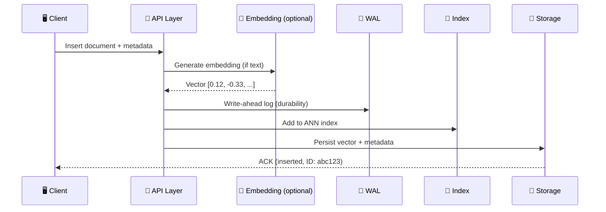

### 🔍 Read path (querying)

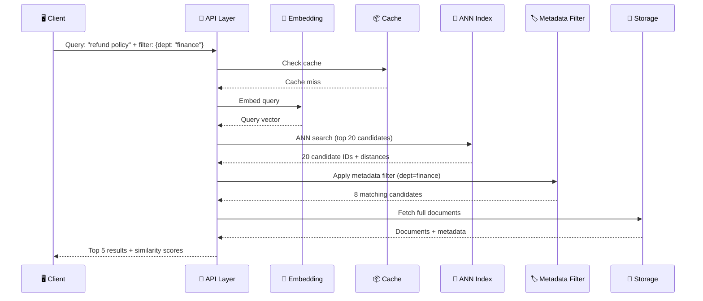

---

## 6) Indexing Algorithms

The **ANN (Approximate Nearest Neighbor)** index is the core innovation that makes vector search fast. Without it, you'd need to compare every query against every stored vector — impossibly slow at scale.

### 🔍 Exact vs Approximate search

```
 Exact (brute force):   Compare query to ALL N vectors
                        O(N × D) — D is dimensions
                        100% accurate, impossibly slow at scale
 
 Approximate (ANN):     Use smart data structures to narrow search
                        O(log N) or O(√N) — depending on algorithm
                        95-99% accurate, fast enough for production
```

### 🏗️ HNSW — Hierarchical Navigable Small World

The **"reigning champion"** of in-memory vector search. A multi-layer graph where you navigate from coarse to fine.

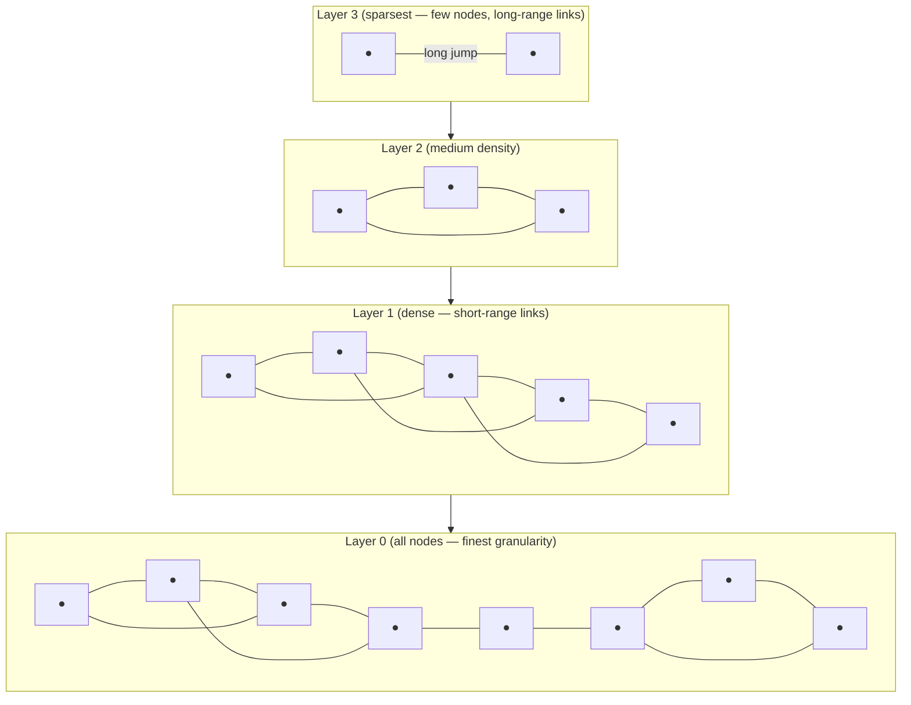

**How HNSW search works:**

```
 1.  Start at the TOP layer (sparse, few nodes)
 2.  Greedily walk to the node closest to query vector
 3.  Drop DOWN one layer (denser, more nodes)
 4.  Repeat greedy walk from the current node
 5.  Continue until Layer 0 (all nodes)
 6.  Return the closest neighbors found
 
 Like using Google Maps:
   Layer 3 = continent view → find the right country
   Layer 2 = country view → find the right city
   Layer 1 = city view → find the right neighborhood
   Layer 0 = street view → find the exact house
```

**HNSW parameters:**

| Parameter | Controls | Tradeoff |
|---|---|---|
| `M` | Max connections per node | Higher = better recall, more memory |
| `efConstruction` | Build-time search width | Higher = better index, slower build |
| `efSearch` | Query-time search width | Higher = better recall, slower query |

### 📊 IVF — Inverted File Index

Divides vectors into **clusters** using k-means. Only search the relevant clusters.

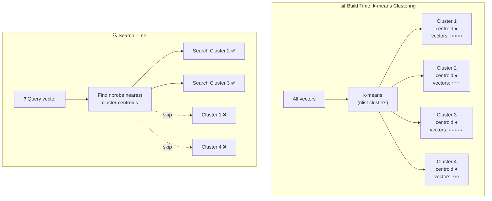

**IVF parameters:**

| Parameter | Controls | Tradeoff |
|---|---|---|
| `nlist` | Number of clusters | Higher = more granular, slower build |
| `nprobe` | Clusters searched at query time | Higher = better recall, slower query |

### 🆚 HNSW vs IVF comparison

| Feature | HNSW | IVF |
|---|---|---|
| **Type** | Graph-based | Cluster-based |
| **Search complexity** | O(log N) | O(N/nlist × nprobe) |
| **Memory usage** | 🔴 High (3-5× data size) | 🟢 Low (with PQ compression) |
| **Recall** | 🟢 95%+ typical | 🟡 Depends on nprobe |
| **Build speed** | 🟡 Moderate | 🟢 Faster for massive datasets |
| **Incremental updates** | 🟢 Yes, dynamic insert | 🔴 Need to rebuild clusters |
| **Filtered search** | 🟡 Post-filter | 🟢 Better (filter at centroid level) |
| **Best for** | Low-latency, dynamic data | Massive scale, memory-constrained |
| **Used by** | Qdrant, Weaviate, Chroma | Milvus, FAISS |

### #️⃣ LSH — Locality Sensitive Hashing

Uses **hash functions** that intentionally create collisions for similar vectors.

```
 Traditional hashing:  "hello" → bucket 42,  "hallo" → bucket 17  (different!)
 LSH hashing:          "hello" → bucket 7,   "hallo" → bucket 7   (same! ✅)

 Multiple hash tables → if two vectors land in the same bucket
 across multiple hash functions → they're probably similar.
```

```
 💡 LSH is fast but less accurate than HNSW/IVF.
    Used when memory is very limited or approximate results are fine.
    More common as a pre-filter than a primary index today.
```

---

## 7) Product Quantization

When you have **billions of vectors**, even ANN indexes need help. Product Quantization (PQ) **compresses** vectors to fit in memory.

### How PQ works

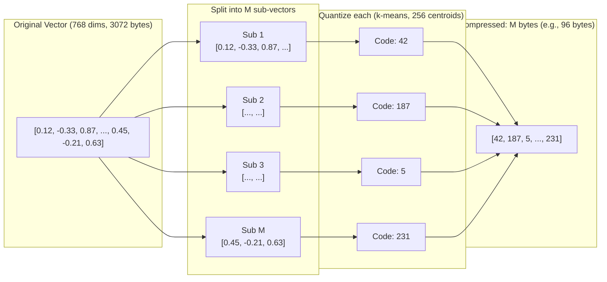

### Compression math

```
 Original:     768 dimensions × 4 bytes (float32) = 3,072 bytes per vector
 With PQ(M=96): 96 sub-vectors × 1 byte (code) = 96 bytes per vector
 
 Compression ratio: 3072 / 96 = 32× !!
 
 1 billion vectors:
   Without PQ: 3,072 GB (~3 TB) → needs a cluster
   With PQ:    96 GB → fits on a single beefy machine
```

### IVF + PQ (the dream team)

```
 IVF narrows the search space (fewer candidates)
 PQ compresses vectors (less memory per candidate)
 
 Together: search billions of vectors on modest hardware
```

---

## 8) Dimensionality Reduction

Sometimes you need to **visualize** or **compress** high-dimensional vectors.

### PCA — Principal Component Analysis

**Linear** technique. Finds the directions of maximum variance and projects data onto them.

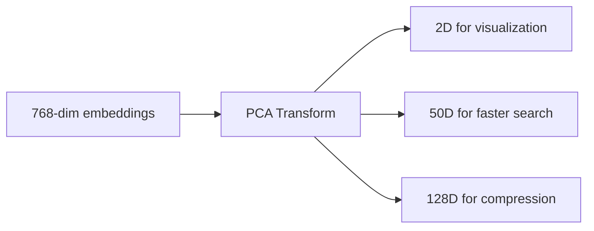

```
 How PCA works (intuition):
 
 Step 1: Center the data (subtract mean)
 Step 2: Find the direction of maximum variance → PC1
 Step 3: Find the next direction (perpendicular to PC1) → PC2
 Step 4: Continue for as many components as you want
 Step 5: Project data onto these new axes
 
 💡 PCA is like finding the best camera angle to photograph
    a 3D object on a 2D screen — you pick the angle that
    captures the most shape information.
```

### t-SNE — for visualization

**Non-linear** technique. Best for visualizing clusters in 2D/3D. Preserves **local** structure.

```
 💡 Use PCA for actual dimensionality reduction (preserves global structure)
    Use t-SNE for visualization only (distorts distances, can't be reversed)
    
 PCA:   Fast, deterministic, invertible, preserves global structure
 t-SNE: Slow, random seed-dependent, non-invertible, preserves clusters
```

### UMAP — the modern alternative

```
 UMAP (Uniform Manifold Approximation & Projection):
 • Faster than t-SNE
 • Better preserves global structure
 • Works in higher dimensions (not just 2D/3D)
 • Becoming the default for embedding visualization
```

---

## 9) Vector Database Comparison

### 📊 Head-to-head comparison (2025 benchmarks)

| Feature | Pinecone | Qdrant | Weaviate | Milvus | Chroma | pgvector |
|---|---|---|---|---|---|---|
| **Type** | Managed cloud | Open-source | Open-source | Open-source | Open-source | PG extension |
| **Language** | Proprietary | Rust 🦀 | Go | Go/C++ | Python | C |
| **Max scale** | Billions | 100M+ | 100M+ | Billions | ~500K | ~1M |
| **P50 latency** | ~20ms | <10ms | 20-40ms | <10ms | ~50ms | ~100ms |
| **Memory** | Managed | Moderate | Higher | High (GPU opt) | Low | Low |
| **Hybrid search** | ✅ | ✅ | ✅✅ (best) | ✅ | Basic | Basic |
| **Filtering** | ✅ | ✅✅ (best) | ✅ | ✅ | Basic | SQL ✅ |
| **Self-host** | ❌ Cloud only | ✅ | ✅ | ✅ | ✅ | ✅ |
| **Cost** | $$ Premium | Free / Cloud | Free / Cloud | Free / Cloud | Free | Free |
| **Best for** | Enterprise, managed low-ops | Performance + filters | Hybrid search | Massive scale | Prototyping | PostgreSQL users |

### 🎯 Decision flowchart

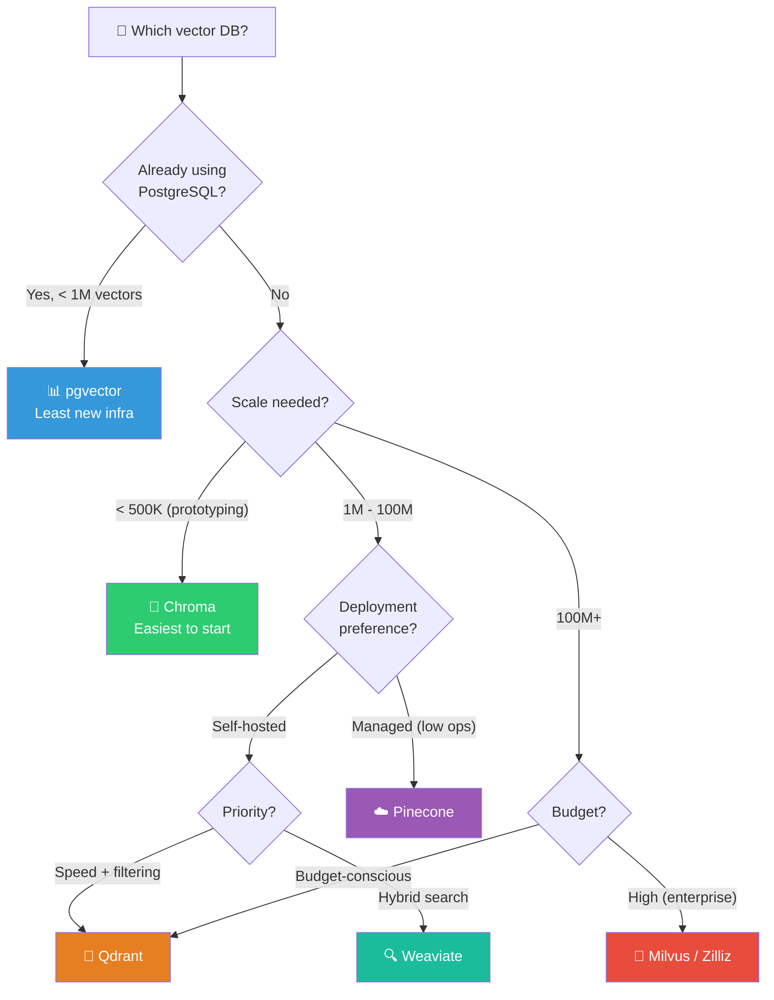

---

## 10) Hybrid Search

Pure vector search misses exact keyword matches. Pure keyword search misses semantic meaning. **Combine both.**

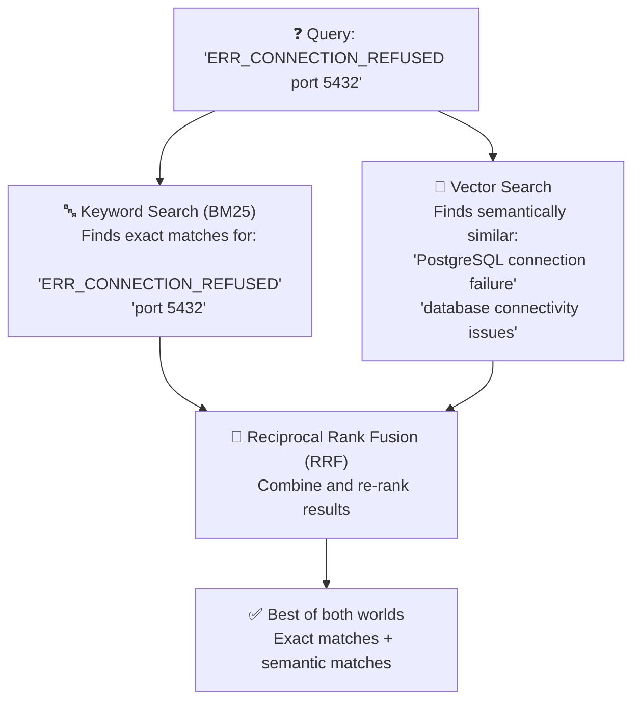

### Reciprocal Rank Fusion (RRF) formula

```
 For each document d appearing in any result list:
 
 RRF_score(d) = Σ  1 / (k + rank_i(d))
                 i
 
 where k = 60 (constant), rank_i(d) = document's rank in list i
 
 Example:
   Document X: rank 1 in keyword, rank 5 in vector
   RRF = 1/(60+1) + 1/(60+5) = 0.0164 + 0.0154 = 0.0318
   
   Document Y: rank 3 in keyword, rank 2 in vector
   RRF = 1/(60+3) + 1/(60+2) = 0.0159 + 0.0161 = 0.0320 ← winner
```

---

## 11) Code Examples

### 📐 Math in Python (from scratch)

```python
import numpy as np

# ════════════════════════════════════════════════
# Dot Product
# ════════════════════════════════════════════════
a = np.array([2, 3, 1])
b = np.array([4, 1, 5])

dot_product = np.dot(a, b)  # = 16
print(f"Dot product: {dot_product}")

# ════════════════════════════════════════════════
# Cosine Similarity
# ════════════════════════════════════════════════
def cosine_similarity(a, b):
    return np.dot(a, b) / (np.linalg.norm(a) * np.linalg.norm(b))

cos_sim = cosine_similarity(a, b)  # ≈ 0.66
print(f"Cosine similarity: {cos_sim:.4f}")

# ════════════════════════════════════════════════
# Euclidean Distance
# ════════════════════════════════════════════════
euclidean = np.linalg.norm(a - b)  # ≈ 4.90
print(f"Euclidean distance: {euclidean:.4f}")

# ════════════════════════════════════════════════
# Embedding + Similarity Search (OpenAI)
# ════════════════════════════════════════════════
from openai import OpenAI
client = OpenAI()

texts = [
    "Kafka ensures message ordering through partitions",
    "Message sequence is guaranteed within a Kafka partition",
    "PostgreSQL supports ACID transactions",
]

# Generate embeddings
embeddings = []
for text in texts:
    response = client.embeddings.create(
        input=text,
        model="text-embedding-3-small"
    )
    embeddings.append(response.data[0].embedding)

# Compare similarities
for i in range(len(texts)):
    for j in range(i + 1, len(texts)):
        sim = cosine_similarity(
            np.array(embeddings[i]),
            np.array(embeddings[j])
        )
        print(f"  '{texts[i][:40]}...' ↔ '{texts[j][:40]}...'")
        print(f"  Similarity: {sim:.4f}\n")
```

### 🗄️ ChromaDB (quickest start)

```python
import chromadb

# Create a client and collection
client = chromadb.Client()
collection = client.create_collection(
    name="engineering_docs",
    metadata={"hnsw:space": "cosine"}  # Use cosine similarity
)

# Add documents (Chroma auto-embeds with default model)
collection.add(
    documents=[
        "Kafka ensures ordering within partitions using monotonic offsets",
        "PostgreSQL MVCC provides snapshot isolation for transactions",
        "Redis uses single-threaded event loop for atomic operations",
        "DynamoDB uses consistent hashing for partition key distribution",
    ],
    metadatas=[
        {"topic": "kafka", "type": "architecture"},
        {"topic": "postgres", "type": "transactions"},
        {"topic": "redis", "type": "architecture"},
        {"topic": "dynamodb", "type": "architecture"},
    ],
    ids=["doc1", "doc2", "doc3", "doc4"],
)

# Query with semantic search + metadata filter
results = collection.query(
    query_texts=["How does message ordering work?"],
    n_results=3,
    where={"type": "architecture"},  # Only search architecture docs
)

for doc, dist in zip(results["documents"][0], results["distances"][0]):
    print(f"  [{1 - dist:.3f}] {doc}")
```

### 🚀 Qdrant (production-grade)

```python
from qdrant_client import QdrantClient
from qdrant_client.models import (
    VectorParams, Distance, PointStruct,
    Filter, FieldCondition, MatchValue,
)

# Connect (local or cloud)
client = QdrantClient(host="localhost", port=6333)

# Create collection with HNSW config
client.create_collection(
    collection_name="engineering_docs",
    vectors_config=VectorParams(
        size=1536,                    # Embedding dimensions
        distance=Distance.COSINE,     # Similarity metric
        hnsw_config={
            "m": 16,                  # Connections per node
            "ef_construct": 200,      # Build-time search width
        }
    ),
)

# Insert vectors (pre-computed embeddings)
client.upsert(
    collection_name="engineering_docs",
    points=[
        PointStruct(
            id=1,
            vector=embedding_1,  # Your 1536-dim vector
            payload={
                "text": "Kafka partition ordering...",
                "topic": "kafka",
                "importance": "high",
            },
        ),
        # ... more points
    ],
)

# Search with metadata filtering
results = client.search(
    collection_name="engineering_docs",
    query_vector=query_embedding,
    query_filter=Filter(
        must=[
            FieldCondition(key="topic", match=MatchValue(value="kafka"))
        ]
    ),
    limit=5,
    search_params={"hnsw_ef": 128},  # Query-time search width
)

for result in results:
    print(f"  [{result.score:.3f}] {result.payload['text'][:60]}")
```

---

## 12) Performance Tuning

### ⚡ Key levers

```
┌─────────────────────────────────────────────────────────────────┐
│  Performance Optimization Checklist                             │
├─────────────────────────────────────────────────────────────────┤
│                                                                 │
│  📐 Embedding dimensions                                        │
│     • 768 is the sweet spot for most use cases                  │
│     • Higher dims only if recall is insufficient                │
│     • Some models support dimension truncation (Matryoshka)     │
│                                                                 │
│  📇 Index parameters                                            │
│     HNSW: start M=16, efConstruction=200, efSearch=100         │
│     IVF: nlist=√N, nprobe=nlist/10                              │
│                                                                 │
│  🗜️ Compression                                                 │
│     • Scalar quantization: float32 → int8 (4× smaller)         │
│     • Product quantization: further 8-32× compression          │
│     • Binary quantization: fastest, lowest accuracy             │
│                                                                 │
│  📦 Caching                                                     │
│     • Cache identical/similar query embeddings                  │
│     • Preload hot vectors into memory                           │
│     • Cache reranker scores for frequent queries                │
│                                                                 │
│  🔀 Batching                                                    │
│     • Batch insert/upsert operations (don't insert one-by-one)  │
│     • Batch query embeddings when searching multiple queries     │
│                                                                 │
│  🏗️ Infrastructure                                              │
│     • Separate read and write paths                             │
│     • Shard by partition key for even distribution              │
│     • Use replicas for read-heavy workloads                     │
│                                                                 │
└─────────────────────────────────────────────────────────────────┘
```

---

## 13) System Design Perspective

How to design a vector search system at scale:

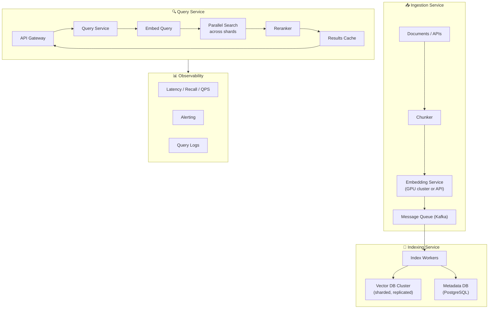

### Key design decisions

| Decision | Options | Recommendation |
|---|---|---|
| **Embedding location** | Client-side / server-side | Server-side for consistency |
| **Index type** | HNSW / IVF / Flat | HNSW for <100M, IVF+PQ for billions |
| **Sharding** | By ID / by partition key | By partition key for filtered queries |
| **Replication** | None / async / sync | Async for read replicas |
| **Update strategy** | Full rebuild / incremental | Incremental for HNSW, rebuild for IVF |

---

## 14) Common Mistakes

```
 ❌  Using different embedding models for indexing and querying
     → Vectors must be in the same space to be comparable

 ❌  Not normalizing vectors when using dot product
     → Dot product is sensitive to magnitude; normalize first or use cosine

 ❌  Choosing dimensions or metric without considering the embedding model
     → Use what your model was TRAINED with

 ❌  Ignoring metadata filtering
     → Metadata filters are one of the biggest accuracy boosters

 ❌  Starting with a complex setup (Milvus cluster) for a prototype
     → Start with Chroma or pgvector, scale up when needed

 ❌  Indexing entire documents as single vectors
     → Chunk them! A 10-page doc as one vector loses all granularity

 ❌  Not evaluating recall separately
     → Measure retrieval quality with Precision@K, not just end-to-end

 ❌  Setting HNSW parameters without benchmarking
     → Always test M, efConstruction, efSearch on YOUR data

 ❌  Using only vector search when exact matches matter
     → Use hybrid search (BM25 + vector) for best results

 ❌  Forgetting that vector DBs need maintenance
     → Plan for index compaction, KB refreshes, and model upgrades
```

---

## 15) Interview-Ready Explanations

### "What is a vector database?"

> A vector database stores high-dimensional numerical representations (embeddings) and is optimized for similarity search rather than exact matching. It uses ANN indexing algorithms like HNSW to find the closest vectors to a query in logarithmic time, enabling semantic search, recommendations, and RAG systems.

### "Explain cosine similarity"

> Cosine similarity measures the angle between two vectors, returning a value from -1 to 1. It equals the dot product divided by the product of magnitudes. A value of 1 means identical direction, 0 means perpendicular, -1 means opposite. It's the standard metric for text search because it ignores vector length and focuses purely on directional alignment.

### "How does HNSW work?"

> HNSW builds a multi-layer graph. The top layers are sparse with long-range connections for fast coarse navigation. Lower layers are progressively denser. During search, you start at the top, greedily walk to the nearest node, drop down a layer, and repeat. It's like zooming in on a map — continent → country → city → street.

### "HNSW vs IVF — when to use which?"

> HNSW is the default for applications needing high recall and low latency with dynamic data — it supports incremental inserts. IVF is better for massive-scale (billions), memory-constrained environments with mostly static data. IVF+PQ can compress data 30×+, making billion-scale search feasible on modest hardware.

### "What is product quantization?"

> PQ compresses vectors by splitting them into sub-vectors, clustering each independently with k-means, and storing only the cluster ID (1 byte) instead of the full float values. A 768-dim float32 vector (3KB) can be compressed to ~96 bytes — 32× smaller — while keeping enough structure for approximate distance calculations.

---

## 16) Glossary

| Term | Definition |
|---|---|
| **Vector** | An ordered list of numbers representing data in n-dimensional space |
| **Embedding** | A learned vector representation that captures semantic meaning |
| **Cosine Similarity** | Angle-based similarity metric, range [-1, 1] |
| **Dot Product** | Sum of element-wise products; measures raw alignment |
| **Euclidean Distance** | Straight-line distance between two points in vector space |
| **ANN** | Approximate Nearest Neighbor — fast similarity search with slight accuracy tradeoff |
| **HNSW** | Hierarchical Navigable Small World — graph-based ANN index |
| **IVF** | Inverted File Index — cluster-based ANN index |
| **LSH** | Locality Sensitive Hashing — hash-based ANN index |
| **Product Quantization (PQ)** | Vector compression by sub-vector clustering |
| **Scalar Quantization** | Reducing float precision (float32 → int8) |
| **PCA** | Principal Component Analysis — linear dimensionality reduction |
| **t-SNE** | t-Distributed Stochastic Neighbor Embedding — non-linear visualization |
| **UMAP** | Uniform Manifold Approximation — modern alternative to t-SNE |
| **BM25** | Best Matching 25 — classic keyword search algorithm |
| **Hybrid Search** | Combining keyword (BM25) + semantic (vector) search |
| **RRF** | Reciprocal Rank Fusion — method for combining multiple ranked lists |
| **Metadata Filtering** | Restricting search by structured attributes (date, type, category) |
| **Recall@K** | % of relevant results found in top K results |
| **Precision@K** | % of top K results that are actually relevant |
| **Sharding** | Splitting data across multiple nodes for horizontal scale |
| **Reranking** | Second-pass scoring with a more accurate model |
| **Cross-encoder** | Model that jointly encodes query + document for reranking |
| **Bi-encoder** | Model that encodes query and document separately for retrieval |
| **Curse of Dimensionality** | High-dimensional spaces make distance metrics less discriminative |
| **Matryoshka Embeddings** | Embeddings that support dimension truncation at multiple levels |

---

*Last updated: March 2026 | Covers vector database internals, mathematics, and engineering best practices for 2025-2026*
