[🏠 Home](../../../README.md) | [➡️ Time Complexity](./01-time-space-complexity.md)

# 🎯 DSA & LeetCode Patterns Roadmap

> Master algorithmic patterns, not individual problems

---

## 📚 Learning Philosophy

```
❌ Wrong: Solve 500 random problems
✅ Right: Master 15 patterns, solve 100 curated problems
```

The key to cracking coding interviews is **pattern recognition**. Once you understand a pattern, you can solve dozens of problems that use it.

---

## 🧠 Why Pattern Learning Works: The Math Behind It

> **🎯 For Beginners:** Understanding WHY patterns work is more valuable than memorizing solutions!

### The Problem with "500 Random LeetCode Problems"

```
❌ Brute Force Learning:
   Problem 1: Solve → Forget in 2 weeks
   Problem 2: Solve → Forget in 2 weeks
   ...
   Problem 500: Still feels lost in interviews

   Time spent: 500 hours
   Problems mastered: ~50 (10% retention)
```

### Why Patterns Are 10x More Effective

```
✅ Pattern-Based Learning:
   
   Pattern: Two Pointers (2 hours to master)
   └── Applies to: ~40 problems
       • Two Sum II
       • 3Sum
       • Container With Most Water
       • Trapping Rain Water
       • Remove Duplicates
       ...and 35 more!

   15 Patterns × 2 hours = 30 hours
   Problems mastered: 300+ (because each pattern generalizes)
```

### The Science Behind It

**1. Transfer Learning**
```
Once you understand that Two Pointers works because:
- Sorted array = predictable movement direction
- O(n²) → O(n) by eliminating redundant comparisons

You can apply this insight to ANY new problem with sorted arrays!
```

**2. Pattern Recognition in Your Brain**
```
Random solving: Each problem is a "new" memory
Pattern learning: New problems connect to existing neural pathways

Your brain: "This looks like Two Pointers because... sorted array!"
```

### Quick Pattern Matching Cheat

| See This Keyword | Think This Pattern | Why It Works |
|------------------|-------------------|--------------|
| "Sorted array" | Two Pointers, Binary Search | Predictable order eliminates search |
| "Contiguous subarray" | Sliding Window | Reuse previous computation |
| "Shortest path" | BFS | Layer-by-layer guarantees minimum |
| "Count ways" | DP | Overlapping subproblems |
| "All combinations" | Backtracking | Systematic exploration |

---

## 🗺️ Pattern Categories

```mermaid
flowchart TB
    subgraph Tier1["⭐ Tier 1: Must Master"]
        A[Arrays & Hashing]
        B[Two Pointers]
        C[Sliding Window]
        D[Binary Search]
        E[Linked Lists]
        F[Trees]
        G[Dynamic Programming]
    end
    
    subgraph Tier2["🔥 Tier 2: Important"]
        H[Stacks & Queues]
        I[Heaps]
        J[Graphs]
        K[Backtracking]
    end
    
    subgraph Tier3["💡 Tier 3: Good to Know"]
        L[Greedy]
        M[Intervals]
        N[Bit Manipulation]
    end
    
    A --> B --> C --> D
    D --> E --> F --> G
    G --> H --> I --> J --> K
    K --> L --> M --> N
```



---

## 📖 Study Plan

### Week 1-2: Foundation
| Day | Pattern | Problems | Time |
|-----|---------|----------|------|
| 1-2 | [Arrays & Hashing](../../system-design/components/overview.md) | 8 | 3h |
| 3-4 | [Two Pointers](../../system-design/components/overview.md) | 6 | 2h |
| 5-6 | [Sliding Window](../../system-design/components/overview.md) | 6 | 2h |
| 7 | Review & Practice | - | 2h |

### Week 3-4: Core Data Structures
| Day | Pattern | Problems | Time |
|-----|---------|----------|------|
| 8-9 | [Binary Search](../../system-design/components/overview.md) | 6 | 2h |
| 10-11 | [Linked Lists](../../system-design/components/overview.md) | 8 | 3h |
| 12-13 | [Stacks & Queues](../../system-design/components/overview.md) | 6 | 2h |
| 14 | Review & Practice | - | 2h |

### Week 5-6: Trees & Graphs
| Day | Pattern | Problems | Time |
|-----|---------|----------|------|
| 15-17 | [Trees](../../system-design/components/overview.md) | 12 | 4h |
| 18-19 | [Heaps](../../system-design/components/overview.md) | 5 | 2h |
| 20-22 | [Graphs](../../system-design/components/overview.md) | 10 | 4h |

### Week 7-8: Advanced Patterns
| Day | Pattern | Problems | Time |
|-----|---------|----------|------|
| 23-24 | [Backtracking](../../system-design/components/overview.md) | 8 | 3h |
| 25-28 | [Dynamic Programming](../../system-design/components/overview.md) | 12 | 5h |
| 29-30 | [Greedy](../../system-design/components/overview.md) + [Intervals](../../system-design/components/overview.md) | 10 | 3h |

---

## 🧠 Problem-Solving Framework

### UMPIRE Method

```
U - Understand the problem
M - Match to known patterns
P - Plan your approach
I - Implement the solution
R - Review and test
E - Evaluate complexity
```

### Pattern Recognition Checklist

| If you see... | Think about... |
|---------------|----------------|
| "Sorted array" | Binary Search, Two Pointers |
| "Subarray/Substring" | Sliding Window |
| "Pairs that sum to X" | Two Pointers, HashMap |
| "All combinations/permutations" | Backtracking |
| "Shortest path (unweighted)" | BFS |
| "Connected components" | DFS, Union-Find |
| "Optimal substructure" | Dynamic Programming |
| "K largest/smallest" | Heap |
| "Next greater element" | Monotonic Stack |

---

## 📊 Complexity Cheat Sheet

| Operation | Array | HashMap | Heap | BST |
|-----------|-------|---------|------|-----|
| Access | O(1) | O(1) | O(1)* | O(log n) |
| Search | O(n) | O(1) | O(n) | O(log n) |
| Insert | O(n) | O(1) | O(log n) | O(log n) |
| Delete | O(n) | O(1) | O(log n) | O(log n) |

*Heap: O(1) for min/max only

---

## 🎯 Priority Problems (Blind 75 Core)

> 📖 **[Complete BLIND 75 Study Guide →](./18-blind-75.md)** — All 75 problems with Java solutions, visualizations, and complexity analysis.

### Must Complete First
- [ ] Two Sum
- [ ] Valid Parentheses
- [ ] Merge Two Sorted Lists
- [ ] Best Time to Buy and Sell Stock
- [ ] Valid Palindrome
- [ ] Invert Binary Tree
- [ ] Maximum Subarray
- [ ] Contains Duplicate
- [ ] Climbing Stairs
- [ ] Binary Search

### Then Focus On
- [ ] 3Sum
- [ ] Container With Most Water
- [ ] Longest Substring Without Repeating Characters
- [ ] Search in Rotated Sorted Array
- [ ] Linked List Cycle
- [ ] Maximum Depth of Binary Tree
- [ ] Number of Islands
- [ ] Course Schedule

---

## 📁 Quick Navigation

| Category | Overview | Problems |
|----------|----------|----------|
| Arrays & Hashing | [Overview](../../system-design/components/overview.md) | [Problems](./02-arrays-hashing/problems.md) |
| Two Pointers | [Overview](../../system-design/components/overview.md) | [Problems](./03-two-pointers/problems.md) |
| Sliding Window | [Overview](../../system-design/components/overview.md) | [Problems](./04-sliding-window/problems.md) |
| Binary Search | [Overview](../../system-design/components/overview.md) | [Problems](./05-binary-search/problems.md) |
| Linked Lists | [Overview](../../system-design/components/overview.md) | [Problems](./06-linked-lists/problems.md) |
| Trees | [Overview](../../system-design/components/overview.md) | [Problems](./08-trees/problems.md) |
| Dynamic Programming | [Overview](../../system-design/components/overview.md) | [Problems](./12-dynamic-programming/problems.md) |

---

*Start your journey: [Time & Space Complexity →](./01-time-space-complexity.md)*
