[🏠 Home](../README.md) | [⬅️ Roadmap](./00-dsa-roadmap.md) | [➡️ Arrays & Hashing](./02-arrays-hashing/00-overview.md)

# ⏱️ Time & Space Complexity

> Understanding Big O notation for interview success

---

## 📊 Big O Complexity Chart

```
        Horrible  Bad    Fair   Good  Excellent
          O(n!)  O(2ⁿ)  O(n²)  O(n log n)  O(n)  O(log n)  O(1)
           |      |      |        |         |       |       |
Time  ███████████████████████████████████████████████████████▓
           ← Slower                              Faster →
```

---

## 🎯 Common Complexities

### Time Complexity (Best to Worst)

| Notation | Name | Example | 1000 elements |
|----------|------|---------|---------------|
| O(1) | Constant | Array access, HashMap get | 1 op |
| O(log n) | Logarithmic | Binary search | 10 ops |
| O(n) | Linear | Loop through array | 1,000 ops |
| O(n log n) | Linearithmic | Merge sort, Heap sort | 10,000 ops |
| O(n²) | Quadratic | Nested loops, Bubble sort | 1,000,000 ops |
| O(2ⁿ) | Exponential | Recursive Fibonacci | 10^301 ops |
| O(n!) | Factorial | Permutations | ∞ |

### Visual Growth

```
n=10:
O(1)       : *
O(log n)   : ***
O(n)       : **********
O(n log n) : *********************************
O(n²)      : ****************************************************************************************************
```

### 📈 Growth Rate Comparison


> **Key Takeaway**: O(n²) explodes at scale — at n=500, it's **500×** slower than O(n)!

---

## 🧭 How to Determine Complexity — Flowchart


---

## 🧮 How to Calculate

### Rule 1: Drop Constants
```java
// O(2n) → O(n)
for (int i = 0; i < n; i++) { }
for (int i = 0; i < n; i++) { }
```

### Rule 2: Drop Non-Dominant Terms
```java
// O(n² + n) → O(n²)
for (int i = 0; i < n; i++) {
    for (int j = 0; j < n; j++) { }
}
for (int k = 0; k < n; k++) { }
```

### Rule 3: Different Inputs = Different Variables
```java
// O(a * b), NOT O(n²)
void process(int[] arr1, int[] arr2) {
    for (int i : arr1) {        // O(a)
        for (int j : arr2) { }  // O(b)
    }
}
```

---

## 📝 Common Patterns

### O(1) - Constant
```java
int getFirst(int[] arr) {
    return arr[0];  // Direct access
}

map.get(key);      // HashMap lookup
stack.push(x);     // Stack push
```

### O(log n) - Logarithmic
```java
// Binary Search - halves search space each iteration
int binarySearch(int[] arr, int target) {
    int left = 0, right = arr.length - 1;
    while (left <= right) {
        int mid = left + (right - left) / 2;
        if (arr[mid] == target) return mid;
        if (arr[mid] < target) left = mid + 1;
        else right = mid - 1;
    }
    return -1;
}
```

### O(n) - Linear
```java
// Single loop through n elements
int sum(int[] arr) {
    int total = 0;
    for (int num : arr) {  // n iterations
        total += num;
    }
    return total;
}
```

### O(n log n) - Linearithmic
```java
// Sorting algorithms (Merge Sort, Heap Sort)
Arrays.sort(arr);  // Java uses Dual-Pivot Quicksort

// Divide and conquer
void mergeSort(int[] arr, int left, int right) {
    if (left < right) {
        int mid = (left + right) / 2;
        mergeSort(arr, left, mid);      // T(n/2)
        mergeSort(arr, mid + 1, right); // T(n/2)
        merge(arr, left, mid, right);   // O(n)
    }
}
// T(n) = 2*T(n/2) + O(n) = O(n log n)
```

### O(n²) - Quadratic
```java
// Nested loops
void printPairs(int[] arr) {
    for (int i = 0; i < arr.length; i++) {
        for (int j = 0; j < arr.length; j++) {
            System.out.println(arr[i] + ", " + arr[j]);
        }
    }
}
```

### O(2ⁿ) - Exponential
```java
// Recursive without memoization
int fib(int n) {
    if (n <= 1) return n;
    return fib(n - 1) + fib(n - 2);  // Two recursive calls
}
```

---

## 💾 Space Complexity

### What Counts as Space?
1. Variables
2. Data structures (arrays, maps, stacks)
3. Function call stack (recursion)

### Examples

```java
// O(1) Space - In-place
void reverse(int[] arr) {
    int left = 0, right = arr.length - 1;
    while (left < right) {
        int temp = arr[left];
        arr[left++] = arr[right];
        arr[right--] = temp;
    }
}

// O(n) Space - Linear
int[] copy(int[] arr) {
    int[] result = new int[arr.length];  // n extra space
    for (int i = 0; i < arr.length; i++) {
        result[i] = arr[i];
    }
    return result;
}

// O(n) Space - Recursion Stack
void printReverse(int[] arr, int i) {
    if (i == arr.length) return;
    printReverse(arr, i + 1);  // n recursive calls
    System.out.println(arr[i]);
}
```

---

## 🎯 Interview Quick Reference

### Sorting Algorithms

| Algorithm | Time (Best) | Time (Avg) | Time (Worst) | Space | Stable |
|-----------|-------------|------------|--------------|-------|--------|
| Bubble Sort | O(n) | O(n²) | O(n²) | O(1) | ✅ |
| Selection Sort | O(n²) | O(n²) | O(n²) | O(1) | ❌ |
| Insertion Sort | O(n) | O(n²) | O(n²) | O(1) | ✅ |
| Merge Sort | O(n log n) | O(n log n) | O(n log n) | O(n) | ✅ |
| Quick Sort | O(n log n) | O(n log n) | O(n²) | O(log n) | ❌ |
| Heap Sort | O(n log n) | O(n log n) | O(n log n) | O(1) | ❌ |

### Data Structure Operations

| Structure | Access | Search | Insert | Delete |
|-----------|--------|--------|--------|--------|
| Array | O(1) | O(n) | O(n) | O(n) |
| Linked List | O(n) | O(n) | O(1) | O(1) |
| Stack | O(n) | O(n) | O(1) | O(1) |
| Queue | O(n) | O(n) | O(1) | O(1) |
| HashMap | N/A | O(1) | O(1) | O(1) |
| BST | O(log n) | O(log n) | O(log n) | O(log n) |
| Heap | O(1)* | O(n) | O(log n) | O(log n) |

*Only for min/max element

---

## 🧠 Memory Visualization

### Stack vs Heap Memory

```
┌─────────────────────────────────────┐
│           STACK MEMORY              │  ← Function calls, local variables
│  ┌─────────────────────────────┐    │
│  │ main()                      │    │
│  │   int x = 5                 │    │
│  ├─────────────────────────────┤    │
│  │ helper()                    │    │
│  │   int y = 10                │    │
│  └─────────────────────────────┘    │
├─────────────────────────────────────┤
│           HEAP MEMORY               │  ← Objects, arrays
│  ┌─────────────────────────────┐    │
│  │ int[] arr = [1, 2, 3, 4, 5] │    │
│  │ HashMap<K,V> map            │    │
│  └─────────────────────────────┘    │
└─────────────────────────────────────┘
```

---

## 📝 Practice Problems — Detailed Complexity Analysis

| Problem | Analyze Time | Analyze Space |
|---------|--------------|---------------|
| Two Sum (HashMap) | O(n) | O(n) |
| Two Sum (Brute Force) | O(n²) | O(1) |
| Binary Search | O(log n) | O(1) |
| Merge Sort | O(n log n) | O(n) |
| DFS on Tree | O(n) | O(h) |
| BFS on Graph | O(V + E) | O(V) |

---

### Problem 1: Two Sum — HashMap vs Brute Force

> **Problem:** Given an array and a target, find two numbers that add up to the target.

#### 🧠 Complexity Comparison Diagram

```mermaid
flowchart LR
    subgraph BF["❌ Brute Force"]
        A["For each element i"] --> B["Check every j > i"]
        B --> C["n × (n-1)/2 pairs"]
        C --> D["O(n²) Time\nO(1) Space"]
    end

    subgraph HM["✅ HashMap"]
        E["For each element"] --> F["Check map for\ncomplement"]
        F --> G["n lookups × O(1)"]
        G --> H["O(n) Time\nO(n) Space"]
    end

    style BF fill:#fecaca,stroke:#ef4444
    style HM fill:#d1fae5,stroke:#22c55e
```



#### ❌ Brute Force: O(n²) Time, O(1) Space

```java
public int[] twoSum(int[] nums, int target) {
    for (int i = 0; i < nums.length; i++) {         // n iterations
        for (int j = i + 1; j < nums.length; j++) { // n-1, n-2, ... 1
            if (nums[i] + nums[j] == target) {
                return new int[]{i, j};
            }
        }
    }
    return new int[]{};
}
```

```
Time Analysis:
  Outer loop: n iterations
  Inner loop: (n-1) + (n-2) + ... + 1 = n(n-1)/2
  Total: O(n²)

Space Analysis:
  Only using two loop variables: O(1)

Example: nums = [2, 7, 11, 15], target = 9
  i=0: check (2,7)✅ → found!
  Worst case: check ALL pairs before finding answer
```

#### ✅ HashMap: O(n) Time, O(n) Space

```java
public int[] twoSum(int[] nums, int target) {
    Map<Integer, Integer> map = new HashMap<>();  // O(n) space
    
    for (int i = 0; i < nums.length; i++) {       // O(n) iterations
        int complement = target - nums[i];
        if (map.containsKey(complement)) {         // O(1) lookup
            return new int[]{map.get(complement), i};
        }
        map.put(nums[i], i);                       // O(1) insert
    }
    return new int[]{};
}
```

```
Time Analysis:
  Loop: n iterations
  Each iteration: O(1) map lookup + O(1) map insert
  Total: n × O(1) = O(n)

Space Analysis:
  HashMap stores up to n entries: O(n)

💡 TRADEOFF: We traded O(n) space for O(n) time improvement!
   Time went from O(n²) → O(n) by using O(n) → O(n) space
```

---

### Problem 2: Binary Search — O(log n) Time

> **Problem:** Find target in a sorted array.

#### 🧠 Why O(log n)?

```mermaid
flowchart TD
    A["Array: 16 elements"] --> B["Split in half → 8"]
    B --> C["Split in half → 4"]
    C --> D["Split in half → 2"]
    D --> E["Split in half → 1 ✅"]

    style A fill:#3b82f6,color:#fff
    style E fill:#22c55e,color:#fff
```



#### ✅ Code + Analysis

```java
public int binarySearch(int[] arr, int target) {
    int left = 0, right = arr.length - 1;
    
    while (left <= right) {          // How many times?
        int mid = left + (right - left) / 2;
        
        if (arr[mid] == target) return mid;
        else if (arr[mid] < target) left = mid + 1;
        else right = mid - 1;
    }
    return -1;
}
```

```
Time Analysis — Step by Step:
  Array size: n = 16

  Iteration 1: search space = 16  (n)
  Iteration 2: search space = 8   (n/2)
  Iteration 3: search space = 4   (n/4)
  Iteration 4: search space = 2   (n/8)
  Iteration 5: search space = 1   (n/16) → found or not found

  How many times can we halve n until we reach 1?
  n / 2^k = 1  →  k = log₂(n)

  For n = 16: log₂(16) = 4 iterations
  For n = 1,000,000: log₂(1,000,000) ≈ 20 iterations! 🤯

Space Analysis:
  Only 3 variables (left, right, mid): O(1)
  Note: Recursive version would be O(log n) space (call stack)
```

| Array Size | Linear Search | Binary Search | Speedup |
|-----------|---------------|---------------|---------|
| 100 | 100 ops | 7 ops | 14x |
| 10,000 | 10,000 ops | 14 ops | 714x |
| 1,000,000 | 1,000,000 ops | 20 ops | 50,000x |

---

### Problem 3: Merge Sort — O(n log n) Time, O(n) Space

> **Problem:** Sort an array using divide-and-conquer.

#### 🧠 Why O(n log n)?


#### ✅ Code + Analysis

```java
public void mergeSort(int[] arr, int l, int r) {
    if (l >= r) return;                    // Base case
    
    int mid = l + (r - l) / 2;
    mergeSort(arr, l, mid);                // T(n/2)
    mergeSort(arr, mid + 1, r);            // T(n/2)
    merge(arr, l, mid, r);                 // O(n) work
}

private void merge(int[] arr, int l, int mid, int r) {
    int[] temp = new int[r - l + 1];       // O(n) extra space
    int i = l, j = mid + 1, k = 0;
    
    while (i <= mid && j <= r) {
        if (arr[i] <= arr[j]) temp[k++] = arr[i++];
        else temp[k++] = arr[j++];
    }
    while (i <= mid) temp[k++] = arr[i++];
    while (j <= r) temp[k++] = arr[j++];
    
    System.arraycopy(temp, 0, arr, l, temp.length);
}
```

```
Time Analysis — Recurrence Relation:
  T(n) = 2·T(n/2) + O(n)
  
  Level 0: 1 problem of size n     → n work
  Level 1: 2 problems of size n/2  → n work  
  Level 2: 4 problems of size n/4  → n work
  ...
  Level k: 2^k problems of size n/2^k → n work

  Number of levels = log₂(n)
  Work per level = O(n)
  Total = O(n) × log(n) = O(n log n)

Space Analysis:
  Temp array in merge: O(n)
  Recursion call stack depth: O(log n)
  Total: O(n) + O(log n) = O(n)
```

| Level | Subproblems | Size Each | Total Work |
|-------|------------|-----------|------------|
| 0 | 1 | n | n |
| 1 | 2 | n/2 | n |
| 2 | 4 | n/4 | n |
| 3 | 8 | n/8 | n |
| ... | ... | ... | n |
| log n | n | 1 | n |
| **Total** | | | **n × log n** |

---

### Problem 4: DFS on Tree — O(n) Time, O(h) Space

> **Problem:** Visit every node in a binary tree using depth-first traversal.

#### 🧠 Call Stack Visualization


#### ✅ Code + Analysis

```java
public void dfs(TreeNode node) {
    if (node == null) return;       // Base case
    
    System.out.println(node.val);   // Process: O(1)
    dfs(node.left);                 // Visit left subtree
    dfs(node.right);                // Visit right subtree
}
```

```
Time Analysis:
  Each node is visited exactly ONCE
  Work per node: O(1)
  Total: O(n) where n = number of nodes

Space Analysis (Call Stack):
  
  Balanced tree (h = log n):        Skewed tree (h = n):
       1                             1
      / \                             \
     2   3          Stack depth:        2
    / \ / \         = height h           \
   4  5 6  7       = O(log n)            3    Stack depth:
                                           \   = O(n)
                                            4

  Call stack at deepest point visiting node 4:
  ┌─────────────┐
  │ dfs(node=4)  │ ← current
  │ dfs(node=2)  │
  │ dfs(node=1)  │ ← root
  └─────────────┘
  Depth = h (height of tree)
  
  Space: O(h) where h = height
    Balanced: O(log n)
    Worst case (skewed): O(n)
```

---

### Problem 5: BFS on Graph — O(V + E) Time, O(V) Space

> **Problem:** Visit every node in a graph using breadth-first traversal.

#### 🧠 BFS Traversal Diagram


#### ✅ Code + Analysis

```java
public void bfs(int start, List<List<Integer>> graph) {
    boolean[] visited = new boolean[graph.size()];  // O(V) space
    Queue<Integer> queue = new LinkedList<>();       // O(V) space worst
    
    queue.offer(start);
    visited[start] = true;
    
    while (!queue.isEmpty()) {            // Runs V times total
        int node = queue.poll();
        System.out.println(node);
        
        for (int neighbor : graph.get(node)) {  // Sum = E total
            if (!visited[neighbor]) {
                visited[neighbor] = true;
                queue.offer(neighbor);
            }
        }
    }
}
```

```
Time Analysis:
  Outer while loop: each vertex dequeued ONCE → V iterations
  Inner for loop: each edge checked ONCE across all iterations
    
    Vertex 0: 2 neighbors (edges to 1, 2)
    Vertex 1: 1 neighbor  (edge to 3)
    Vertex 2: 1 neighbor  (edge to 3)
    Vertex 3: 1 neighbor  (edge to 4)
    Vertex 4: 0 neighbors
    Total inner iterations = 2+1+1+1+0 = 5 = E (total edges)
    
  Total: V (outer) + E (inner across all) = O(V + E)

Space Analysis:
  visited[] array: O(V)
  Queue: at most O(V) nodes (in a star graph, all at once)
  Total: O(V)

💡 KEY INSIGHT: V + E, NOT V × E!
   Each vertex processed once, each edge examined once.
```

#### Step-by-Step BFS Example

```
Graph: 0→1, 0→2, 1→3, 2→3, 3→4

Step 1: Start at 0
        Queue: [0]      Visited: {0}

Step 2: Process 0, add neighbors 1, 2
        Queue: [1, 2]   Visited: {0, 1, 2}

Step 3: Process 1, add neighbor 3
        Queue: [2, 3]   Visited: {0, 1, 2, 3}

Step 4: Process 2, neighbor 3 already visited
        Queue: [3]      Visited: {0, 1, 2, 3}

Step 5: Process 3, add neighbor 4
        Queue: [4]      Visited: {0, 1, 2, 3, 4}

Step 6: Process 4, no neighbors
        Queue: []       Done!

Operations: 5 vertex processings + 5 edge checks = V + E ✅
```

---

## 📊 Master Complexity Comparison

| Algorithm | Time | Space | Why? |
|-----------|------|-------|------|
| Two Sum (Brute) | O(n²) | O(1) | Every pair checked |
| Two Sum (HashMap) | O(n) | O(n) | Trade space for time |
| Binary Search | O(log n) | O(1) | Halving each step |
| Merge Sort | O(n log n) | O(n) | log n levels × n work |
| DFS on Tree | O(n) | O(h) | Visit each node once |
| BFS on Graph | O(V+E) | O(V) | Each vertex+edge once |

---

*Next: [Arrays & Hashing →](./02-arrays-hashing/00-overview.md)*
