```mermaid
flowchart LR
    A["For each num"] --> B{"num in\nHashSet?"}
    B -->|Yes| C["Return true ✅"]
    B -->|No| D["Add to HashSet"]
    D --> A
```

[🏠 Home](../../README.md) | [⬅️ Time Complexity](../01-time-space-complexity.md) | [➡️ Two Pointers](../03-two-pointers/00-overview.md)

# 📦 Arrays & Hashing

> The foundation of most coding problems

---

## 🎯 When to Use

| Clue | Pattern |
|------|---------|
| "Find if exists" | HashMap/HashSet |
| "Count frequency" | HashMap |
| "Find pair that sums to X" | HashMap (complement lookup) |
| "Group similar items" | HashMap with List values |
| "Find duplicates" | HashSet |

---

## 🧠 WHY HashMap is Magic: The Beginner's Guide

> **🎯 Before You Code:** Understanding WHY HashMap gives O(1) makes you a better problem solver!

### The Core Insight: Trading Space for Time

```
❌ Without HashMap (Linear Search):
   "Is 'John' in my list of 1,000,000 names?"
   
   Check name 1: "Alice" - No
   Check name 2: "Bob" - No
   ...
   Check name 999,999: "Jane" - No
   Check name 1,000,000: "John" - YES!
   
   → Worst case: 1,000,000 checks = O(n)

✅ With HashMap (Direct Access):
   "Is 'John' in my map?"
   
   Step 1: hash("John") = 2847593
   Step 2: buckets[2847593 % 16] = bucket 9
   Step 3: bucket 9 contains "John" → YES!
   
   → Always: 3 operations = O(1)
```

### The Mathematical Magic

```
hash("John") → 2847593  (unique-ish number)
2847593 % 16 = 9        (bucket index in array of 16)

Like a library:
  Instead of searching every book (O(n))
  Go directly to shelf #9 (O(1))
```

### 🗺️ HashMap Internal Architecture

```mermaid
graph TD
    subgraph HashMap["HashMap&lt;String, Integer&gt;"]
        direction TB
        KEY["key: 'John'"] --> HASH["hashCode() → 2847593"]
        HASH --> MOD["2847593 % 16 = 9"]
        MOD --> BUCKET["Bucket Array (size 16)"]
    end

    subgraph Buckets["Bucket Array"]
        B0["[0] null"]
        B1["[1] null"]
        B2["[2] 'Alice'→5"]
        B3["[3] null"]
        B9["[9] 'John'→28 → 'Bob'→15"]
        B15["[15] 'Eve'→42"]
    end

    BUCKET --> B9

    subgraph Collision["Collision at Bucket 9"]
        N1["Node: John=28"] --> N2["Node: Bob=15"] --> N3["null"]
    end

    B9 --> Collision

    style KEY fill:#3b82f6,color:#fff
    style HASH fill:#8b5cf6,color:#fff
    style B9 fill:#f59e0b,color:#000
    style N1 fill:#22c55e,color:#fff
    style N2 fill:#22c55e,color:#fff
```



> **Load Factor**: When buckets > 75% full, HashMap **doubles** its size and rehashes everything. This keeps average chain length short → O(1) lookups.

### When HashMap FAILS (and what to use instead)

| Problem | Why HashMap Fails | Alternative |
|---------|------------------|-------------|
| Need sorted order | HashMap has no order | TreeMap O(log n) |
| Range queries | Can't find "between A and B" | TreeMap |
| Limited memory | HashMap uses extra space | Two Pointers |

### Thought Process Template

```
🧠 "Can I use HashMap here?"

1. Do I need to look up something by a KEY?
   → Yes: HashMap is probably the answer

2. What is my KEY and what is my VALUE?
   → Two Sum: KEY = number, VALUE = index
   → Frequency: KEY = element, VALUE = count

3. Am I trading space for time?
   → HashMap uses O(n) extra space
   → But gives O(1) lookup (worth it!)
```

---

## 🔧 Core Techniques

### 1. HashMap for O(1) Lookup

**Problem**: Find two numbers that sum to target

```java
// ❌ Brute Force: O(n²)
for (int i = 0; i < n; i++) {
    for (int j = i + 1; j < n; j++) {
        if (nums[i] + nums[j] == target) return new int[]{i, j};
    }
}

// ✅ HashMap: O(n)
public int[] twoSum(int[] nums, int target) {
    Map<Integer, Integer> map = new HashMap<>();
    for (int i = 0; i < nums.length; i++) {
        int complement = target - nums[i];
        if (map.containsKey(complement)) {
            return new int[]{map.get(complement), i};
        }
        map.put(nums[i], i);
    }
    return new int[]{};
}
```

**Memory Visualization**:
```
nums = [2, 7, 11, 15], target = 9

Step 1: i=0, nums[i]=2
        complement = 9-2 = 7
        map = {2: 0}
        
Step 2: i=1, nums[i]=7
        complement = 9-7 = 2
        map.containsKey(2) ✅ → return [0, 1]
```

---

### 2. HashSet for Duplicate Detection

```java
// Check if array contains duplicate
public boolean containsDuplicate(int[] nums) {
    Set<Integer> seen = new HashSet<>();
    for (int num : nums) {
        if (!seen.add(num)) {  // add() returns false if exists
            return true;
        }
    }
    return false;
}
```

---

### 3. Frequency Counting

```java
// Count character frequency
public Map<Character, Integer> countFrequency(String s) {
    Map<Character, Integer> freq = new HashMap<>();
    for (char c : s.toCharArray()) {
        freq.put(c, freq.getOrDefault(c, 0) + 1);
    }
    return freq;
}

// Java 8+ Alternative
Map<Character, Long> freq = s.chars()
    .mapToObj(c -> (char) c)
    .collect(Collectors.groupingBy(c -> c, Collectors.counting()));
```

---

### 4. Grouping with HashMap

```java
// Group anagrams: ["eat","tea","tan","ate","nat","bat"]
// Output: [["bat"],["nat","tan"],["ate","eat","tea"]]
public List<List<String>> groupAnagrams(String[] strs) {
    Map<String, List<String>> map = new HashMap<>();
    
    for (String s : strs) {
        char[] chars = s.toCharArray();
        Arrays.sort(chars);
        String key = new String(chars);  // "eat" → "aet"
        
        map.computeIfAbsent(key, k -> new ArrayList<>()).add(s);
    }
    
    return new ArrayList<>(map.values());
}
```

---

### 5. Prefix Sum for Range Queries

```java
// Compute prefix sum for O(1) range sum queries
public class PrefixSum {
    private int[] prefix;
    
    public PrefixSum(int[] nums) {
        prefix = new int[nums.length + 1];
        for (int i = 0; i < nums.length; i++) {
            prefix[i + 1] = prefix[i] + nums[i];
        }
    }
    
    // Sum of elements from index i to j (inclusive)
    public int rangeSum(int i, int j) {
        return prefix[j + 1] - prefix[i];
    }
}
```

**Visualization**:
```
nums   = [1, 2, 3, 4, 5]
prefix = [0, 1, 3, 6, 10, 15]
         
rangeSum(1, 3) = prefix[4] - prefix[1] = 10 - 1 = 9
                 (2 + 3 + 4 = 9) ✅
```

---

## 📊 Complexity Summary

| Technique | Time | Space |
|-----------|------|-------|
| HashMap lookup | O(1) avg | O(n) |
| HashSet add/contains | O(1) avg | O(n) |
| Frequency count | O(n) | O(k) k=unique |
| Prefix sum build | O(n) | O(n) |
| Prefix sum query | O(1) | - |

---

## ⚠️ Common Mistakes

1. **Not handling duplicates**: Use `getOrDefault()` for counting
2. **Wrong key type**: Use `Arrays.toString()` for array keys
3. **Modifying during iteration**: Use iterator or collect first

---

## 📝 Practice Problems — Detailed Solutions

| # | Problem | Difficulty | Link | Key Pattern |
|---|---------|------------|------|-------------|
| 1 | Two Sum | 🟢 Easy | [LeetCode](https://leetcode.com/problems/two-sum/) | HashMap complement |
| 2 | Contains Duplicate | 🟢 Easy | [LeetCode](https://leetcode.com/problems/contains-duplicate/) | HashSet |
| 3 | Valid Anagram | 🟢 Easy | [LeetCode](https://leetcode.com/problems/valid-anagram/) | Frequency count |
| 4 | Group Anagrams | 🟡 Medium | [LeetCode](https://leetcode.com/problems/group-anagrams/) | HashMap grouping |
| 5 | Top K Frequent Elements | 🟡 Medium | [LeetCode](https://leetcode.com/problems/top-k-frequent-elements/) | Frequency + Bucket |
| 6 | Product of Array Except Self | 🟡 Medium | [LeetCode](https://leetcode.com/problems/product-of-array-except-self/) | Prefix/Suffix |
| 7 | Longest Consecutive Sequence | 🟡 Medium | [LeetCode](https://leetcode.com/problems/longest-consecutive-sequence/) | HashSet |
| 8 | Encode and Decode Strings | 🟡 Medium | [LeetCode](https://leetcode.com/problems/encode-and-decode-strings/) | String encoding |

---

### Problem 1: Two Sum 🟢

> **Given** an array of integers `nums` and an integer `target`, return indices of the two numbers that add up to `target`.

#### 🧠 Approach Diagram



```mermaid
flowchart LR
    A["For each num"] --> B{"complement\nin map?"}
    B -->|Yes| C["Return indices ✅"]
    B -->|No| D["Store num→index\nin map"]
    D --> A
```

#### ✅ Optimal: HashMap — O(n) Time, O(n) Space

```java
public int[] twoSum(int[] nums, int target) {
    Map<Integer, Integer> map = new HashMap<>();
    
    for (int i = 0; i < nums.length; i++) {
        int complement = target - nums[i];
        if (map.containsKey(complement)) {
            return new int[]{map.get(complement), i};
        }
        map.put(nums[i], i);
    }
    return new int[]{};
}
```

```
Example: nums = [2, 7, 11, 15], target = 9

Step 1: num=2, complement=7, map={}        → not found, store {2:0}
Step 2: num=7, complement=2, map={2:0}     → FOUND! Return [0, 1] ✅

💡 KEY INSIGHT: Instead of searching for a pair, search for what's MISSING.
   complement = target - current = 9 - 7 = 2 → look up 2 in map!
```

---

### Problem 2: Contains Duplicate 🟢

> **Given** an integer array `nums`, return `true` if any value appears at least twice.

#### 🧠 Approach Diagram



#### ✅ Optimal: HashSet — O(n) Time, O(n) Space

```java
public boolean containsDuplicate(int[] nums) {
    Set<Integer> seen = new HashSet<>();
    for (int num : nums) {
        if (!seen.add(num)) return true;  // add returns false if exists
    }
    return false;
}
```

```
Example: nums = [1, 2, 3, 1]

Step 1: num=1, set={}     → add 1, set={1}
Step 2: num=2, set={1}    → add 2, set={1,2}
Step 3: num=3, set={1,2}  → add 3, set={1,2,3}
Step 4: num=1, set={1,2,3} → 1 EXISTS! Return true ✅

💡 TRICK: HashSet.add() returns false if element already exists!
   No need for separate contains() check.
```

---

### Problem 3: Valid Anagram 🟢

> **Given** two strings `s` and `t`, return `true` if `t` is an anagram of `s`.

#### 🧠 Approach Diagram



```mermaid
flowchart LR
    A["Count chars in s\n(increment)"] --> B["Count chars in t\n(decrement)"]
    B --> C{"All counts\n== 0?"}
    C -->|Yes| D["Anagram ✅"]
    C -->|No| E["Not anagram ❌"]
```

#### ✅ Optimal: Frequency Array — O(n) Time, O(1) Space

```java
public boolean isAnagram(String s, String t) {
    if (s.length() != t.length()) return false;
    
    int[] count = new int[26];  // O(1) space — fixed 26 letters
    
    for (int i = 0; i < s.length(); i++) {
        count[s.charAt(i) - 'a']++;  // increment for s
        count[t.charAt(i) - 'a']--;  // decrement for t
    }
    
    for (int c : count) {
        if (c != 0) return false;
    }
    return true;
}
```

```
Example: s = "anagram", t = "nagaram"

After processing both strings:
  a: +3 -3 = 0 ✅    n: +1 -1 = 0 ✅
  g: +1 -1 = 0 ✅    r: +1 -1 = 0 ✅
  m: +1 -1 = 0 ✅
  
All zeros → valid anagram!

💡 WHY int[26] is O(1) space: Array size is constant regardless of input.
```

---

### Problem 4: Group Anagrams 🟡

> **Given** an array of strings, group anagrams together.

#### 🧠 Approach Diagram



```mermaid
flowchart TD
    A["For each word"] --> B["Sort letters\nor count chars"]
    B --> C["Use as\nHashMap key"]
    C --> D["Group words\nwith same key"]
    
    E["'eat' → 'aet'"] --> F["Map: 'aet' → [eat, tea, ate]"]
    G["'tan' → 'ant'"] --> H["Map: 'ant' → [tan, nat]"]
```

#### ✅ Optimal: Sorted Key — O(n·k·log k) Time

```java
public List<List<String>> groupAnagrams(String[] strs) {
    Map<String, List<String>> map = new HashMap<>();
    
    for (String s : strs) {
        char[] chars = s.toCharArray();
        Arrays.sort(chars);                    // O(k log k)
        String key = new String(chars);        // sorted = canonical key
        
        map.computeIfAbsent(key, k -> new ArrayList<>()).add(s);
    }
    return new ArrayList<>(map.values());
}
```

#### 🚀 Optimized: Char Count Key — O(n·k) Time

```java
public List<List<String>> groupAnagrams(String[] strs) {
    Map<String, List<String>> map = new HashMap<>();
    
    for (String s : strs) {
        int[] count = new int[26];
        for (char c : s.toCharArray()) count[c - 'a']++;
        
        // Build key: "1#0#0#...#0" for counts of a-z
        StringBuilder sb = new StringBuilder();
        for (int c : count) sb.append(c).append('#');
        String key = sb.toString();
        
        map.computeIfAbsent(key, k -> new ArrayList<>()).add(s);
    }
    return new ArrayList<>(map.values());
}
```

```
Example: strs = ["eat","tea","tan","ate","nat","bat"]

Sorted key approach:
  "eat" → sort → "aet"     "tea" → sort → "aet"
  "tan" → sort → "ant"     "ate" → sort → "aet"
  "nat" → sort → "ant"     "bat" → sort → "abt"

Map: {"aet": [eat,tea,ate], "ant": [tan,nat], "abt": [bat]}

💡 WHY count key is faster: Avoids sorting each word.
   Sorting = O(k log k), counting = O(k)
```

---

### Problem 5: Top K Frequent Elements 🟡

> **Given** an integer array and integer `k`, return the `k` most frequent elements.

#### 🧠 Approach Diagram


#### ✅ Optimal: Bucket Sort — O(n) Time, O(n) Space

```java
public int[] topKFrequent(int[] nums, int k) {
    // Step 1: Count frequencies
    Map<Integer, Integer> freq = new HashMap<>();
    for (int n : nums) freq.merge(n, 1, Integer::sum);
    
    // Step 2: Bucket sort — index = frequency
    List<Integer>[] buckets = new List[nums.length + 1];
    for (var entry : freq.entrySet()) {
        int f = entry.getValue();
        if (buckets[f] == null) buckets[f] = new ArrayList<>();
        buckets[f].add(entry.getKey());
    }
    
    // Step 3: Collect from highest frequency
    int[] result = new int[k];
    int idx = 0;
    for (int i = buckets.length - 1; i >= 0 && idx < k; i--) {
        if (buckets[i] != null) {
            for (int num : buckets[i]) {
                result[idx++] = num;
                if (idx == k) break;
            }
        }
    }
    return result;
}
```

```
Example: nums = [1,1,1,2,2,3], k = 2

Step 1 — Count: {1:3, 2:2, 3:1}

Step 2 — Buckets (index = frequency):
  bucket[1] = [3]      ← appears 1 time
  bucket[2] = [2]      ← appears 2 times
  bucket[3] = [1]      ← appears 3 times

Step 3 — Pick from right: bucket[3]→[1], bucket[2]→[2]
  Result: [1, 2] ✅

💡 WHY bucket sort? Max frequency = n, so bucket array size = n+1.
   No comparison sort needed → O(n) instead of O(n log n)!
```

---

### Problem 6: Product of Array Except Self 🟡

> **Given** an integer array `nums`, return an array where each element is the product of all elements except itself. **No division allowed.**

#### 🧠 Approach Diagram



```mermaid
flowchart LR
    A["Pass 1 →\nPrefix products"] --> B["Pass 2 ←\nSuffix products"]
    B --> C["result[i] =\nprefix × suffix"]

    style A fill:#3b82f6,color:#fff
    style B fill:#f59e0b,color:#fff
    style C fill:#22c55e,color:#fff
```

#### ✅ Optimal: Two-Pass — O(n) Time, O(1) Extra Space

```java
public int[] productExceptSelf(int[] nums) {
    int n = nums.length;
    int[] result = new int[n];
    
    // Pass 1: prefix products (left to right)
    result[0] = 1;
    for (int i = 1; i < n; i++) {
        result[i] = result[i-1] * nums[i-1];
    }
    
    // Pass 2: multiply by suffix products (right to left)
    int suffix = 1;
    for (int i = n - 2; i >= 0; i--) {
        suffix *= nums[i+1];
        result[i] *= suffix;
    }
    return result;
}
```

```
Example: nums = [1, 2, 3, 4]

Pass 1 — Prefix (product of everything LEFT of i):
  result = [1, 1, 2, 6]
           1  1  1×2  1×2×3

Pass 2 — Multiply by Suffix (product of everything RIGHT of i):
  i=2: suffix=4,     result[2] = 2×4 = 8
  i=1: suffix=4×3=12, result[1] = 1×12 = 12
  i=0: suffix=12×2=24, result[0] = 1×24 = 24

  result = [24, 12, 8, 6] ✅
  
  Verify: [2×3×4, 1×3×4, 1×2×4, 1×2×3] = [24, 12, 8, 6] ✅

💡 KEY TRICK: result[i] = (product of all left) × (product of all right)
   Use result array for prefix, single variable for suffix → O(1) extra space!
```

---

### Problem 7: Longest Consecutive Sequence 🟡

> **Given** an unsorted array of integers, find the length of the longest consecutive elements sequence. Must run in O(n) time.

#### 🧠 Approach Diagram


#### ✅ Optimal: HashSet — O(n) Time, O(n) Space

```java
public int longestConsecutive(int[] nums) {
    Set<Integer> set = new HashSet<>();
    for (int n : nums) set.add(n);
    
    int maxLen = 0;
    for (int num : set) {
        // Only start counting from sequence START
        if (!set.contains(num - 1)) {  // ← THE KEY CHECK
            int length = 1;
            while (set.contains(num + length)) {
                length++;
            }
            maxLen = Math.max(maxLen, length);
        }
    }
    return maxLen;
}
```

```
Example: nums = [100, 4, 200, 1, 3, 2]

Set = {1, 2, 3, 4, 100, 200}

num=1:   1-1=0 not in set → START! Count: 1→2→3→4 = length 4
num=2:   2-1=1 in set → SKIP (not a start)
num=3:   3-1=2 in set → SKIP
num=4:   4-1=3 in set → SKIP
num=100: 99 not in set → START! Count: 100 = length 1
num=200: 199 not in set → START! Count: 200 = length 1

maxLen = 4 ✅

💡 WHY O(n) not O(n²)?
   The inner while loop only runs for SEQUENCE STARTS.
   Each element is visited at most twice (once in outer, once in inner).
   Total work across ALL iterations = O(n).
```

---

### Problem 8: Encode and Decode Strings 🟡

> **Design** an algorithm to encode a list of strings into a single string and decode it back.

#### 🧠 Approach Diagram



```mermaid
flowchart LR
    A["[hello, world]"] --> B["Encode:\n5#hello5#world"]
    B --> C["Decode:\nRead length → '#' → string"]
    C --> D["[hello, world]"]

    style B fill:#8b5cf6,color:#fff
    style C fill:#22c55e,color:#fff
```

#### ✅ Optimal: Length Prefix — O(n) Time

```java
// Encode: "5#hello5#world"
public String encode(List<String> strs) {
    StringBuilder sb = new StringBuilder();
    for (String s : strs) {
        sb.append(s.length()).append('#').append(s);
    }
    return sb.toString();
}

// Decode: parse length, skip '#', read that many chars
public List<String> decode(String str) {
    List<String> result = new ArrayList<>();
    int i = 0;
    
    while (i < str.length()) {
        int j = str.indexOf('#', i);               // find delimiter
        int len = Integer.parseInt(str.substring(i, j));  // parse length
        result.add(str.substring(j + 1, j + 1 + len));   // extract string
        i = j + 1 + len;                            // move pointer
    }
    return result;
}
```

```
Encode: ["hello", "world"] → "5#hello5#world"

Decode: "5#hello5#world"
  i=0: find '#' at j=1, len=5, extract "hello" (pos 2..6), i=7
  i=7: find '#' at j=8, len=5, extract "world" (pos 9..13), i=14
  Done!

💡 WHY length prefix works:
   Even if strings contain '#' or digits, the length tells us
   EXACTLY how many chars to read — no ambiguity!
   
   Example: ["a#b", "c"] → "3#a#b1#c"
   Decode: len=3 → read "a#b", len=1 → read "c" ✅
```

---

## 📊 Complexity Comparison

| # | Problem | Time | Space | Key Technique |
|---|---------|------|-------|---------------|
| 1 | Two Sum | O(n) | O(n) | HashMap complement lookup |
| 2 | Contains Duplicate | O(n) | O(n) | HashSet existence check |
| 3 | Valid Anagram | O(n) | O(1) | Frequency array (fixed 26) |
| 4 | Group Anagrams | O(n·k) | O(n·k) | Sorted/count key grouping |
| 5 | Top K Frequent | O(n) | O(n) | Bucket sort by frequency |
| 6 | Product Except Self | O(n) | O(1)* | Prefix + suffix products |
| 7 | Longest Consecutive | O(n) | O(n) | HashSet sequence start |
| 8 | Encode/Decode | O(n) | O(n) | Length-prefixed encoding |

> *O(1) extra space — output array doesn't count.

---

*Next: [Two Pointers →](../03-two-pointers/00-overview.md)*
