```mermaid
flowchart LR
    A["left →"] --> B{"Both\nalphanumeric?"}
    B -->|No| C["Skip non-alpha"]
    B -->|Yes| D{"chars\nmatch?"}
    D -->|Yes| E["Move both\ninward"]
    D -->|No| F["Return false ❌"]
    E --> G{"left ≥ right?"}
    G -->|Yes| H["Return true ✅"]
    G -->|No| B
    
    I["← right"]
```

```mermaid
flowchart TD
    A["left=0, right=n-1"] --> B{"sum vs\ntarget?"}
    B -->|"sum < target"| C["left++ (need bigger)"]
    B -->|"sum > target"| D["right-- (need smaller)"]
    B -->|"sum == target"| E["Found! ✅"]
    C --> B
    D --> B
```

```mermaid
flowchart TD
    A["left=0, right=n-1\nMax width first"] --> B["Calculate area\nmin(h[l],h[r]) × width"]
    B --> C{"Which side\nis shorter?"}
    C -->|"h[left] < h[right]"| D["Move left →\n(shorter limits area)"]
    C -->|"h[right] ≤ h[left]"| E["Move right ←"]
    D --> B
    E --> B
```

[🏠 Home](../../README.md) | [⬅️ Arrays & Hashing](../02-arrays-hashing/00-overview.md) | [➡️ Sliding Window](../04-sliding-window/00-overview.md)

# 👆👆 Two Pointers Pattern

> Use two indices to traverse data efficiently

---

## 🎯 When to Use

| Clue | Variation |
|------|-----------|
| Sorted array + pair/triplet | Opposite direction |
| Palindrome check | Opposite direction |
| Merge sorted arrays | Same direction |
| Slow & fast (linked list) | Different speeds |
| Remove duplicates in-place | Read/Write pointers |

---

## 🧠 WHY Two Pointers Work: The Math Behind It

> **🎯 For Beginners:** Two Pointers isn't magic - it's smart elimination of unnecessary work!

### The Core Insight: Sorted = Predictable Movement

```
❌ Brute Force (O(n²)):
   For each element i:
     For each element j > i:
       Check if arr[i] + arr[j] == target
   
   10,000 elements → 50,000,000 pairs to check!

✅ Two Pointers (O(n)):
   left = 0, right = n-1
   
   sum < target → left++  (we need LARGER sum)
   sum > target → right-- (we need SMALLER sum)
   sum == target → FOUND!
   
   10,000 elements → max 10,000 moves!
```

### Why This Works (Mathematical Proof)

```
Sorted array: [1, 2, 4, 6, 8, 10]
               ↑              ↑
             left           right
             
Target = 10

If left + right = 1 + 10 = 11 > 10:
  Can we move left++? NO! 2 + 10 = 12 (even bigger)
  
  The ONLY way to reduce sum is: right--
  
Similarly, if sum < target, left++ is the ONLY option.
This GUARANTEES we never skip the answer!
```

### The Key Requirement: SORTED Array

```
❌ Unsorted: [5, 1, 8, 3, 2]
   Moving left/right has no predictable effect
   → Must use HashMap instead

✅ Sorted: [1, 2, 3, 5, 8]
   Moving left ALWAYS increases sum
   Moving right ALWAYS decreases sum
   → Two Pointers works!
```

### Thought Process Template

```
🧠 "Can I use Two Pointers here?"

1. Is the array SORTED (or can I sort it)?
   → Yes: Two Pointers may apply
   → No: Consider HashMap

2. What happens when I move left/right?
   → Predictable change: ✅ Two Pointers
   → Unpredictable: ❌ Different pattern

3. Am I looking for a pair/triplet matching condition?
   → Sum equals target: Converging pointers
   → Partition: Same-direction pointers
```

---

## 📊 Two Pointer Variations — Visual Overview

```mermaid
graph LR
    subgraph Converging["🔄 Opposite Direction (Converging)"]
        direction LR
        CL["L →"] ~~~ CM["· · ·"] ~~~ CR["← R"]
    end

    subgraph Parallel["➡️ Same Direction (Fast-Slow)"]
        direction LR
        PS["S →"] ~~~ PF["F →→"]
    end

    subgraph Anchor["📌 Anchor + Expand"]
        direction LR
        AI["Fix i"] ~~~ AL["L →"] ~~~ AR["← R"]
    end

    style Converging fill:#3b82f6,color:#fff
    style Parallel fill:#22c55e,color:#fff
    style Anchor fill:#f59e0b,color:#000
```



### 🧭 Which Variation Should I Use?

```mermaid
flowchart TD
    A["Two Pointer Problem?"] --> B{"Is array sorted?"}
    B -- Yes --> C{"Looking for pair/triplet?"}
    C -- Yes --> D["🔄 Converging Pointers\n(opposite ends)"]
    C -- No --> E{"Merging two arrays?"}
    E -- Yes --> F["➡️ Same Direction\n(parallel pointers)"]
    B -- No --> G{"Remove duplicates\nor partition?"}
    G -- Yes --> H["➡️ Read/Write Pointers\n(slow + fast)"]
    G -- No --> I{"Linked list cycle?"}
    I -- Yes --> J["➡️ Fast-Slow Pointers\n(Floyd's Algorithm)"]
    I -- No --> K["Consider HashMap\ninstead"]

    style D fill:#3b82f6,color:#fff
    style F fill:#22c55e,color:#fff
    style H fill:#22c55e,color:#fff
    style J fill:#8b5cf6,color:#fff
    style K fill:#ef4444,color:#fff
```



---

## 🔧 Pattern Variations

### 1. Opposite Direction (Converging)

Start from both ends, move towards center.

```
Array: [1, 2, 3, 4, 5, 6, 7]
        ↑                 ↑
       left             right
       
Move left → or ← right based on condition
```

**Template**:
```java
public void oppositeDirection(int[] arr) {
    int left = 0, right = arr.length - 1;
    
    while (left < right) {
        // Process arr[left] and arr[right]
        
        if (/* condition to move left */) {
            left++;
        } else {
            right--;
        }
    }
}
```

---

### 2. Same Direction (Parallel)

Both pointers move in same direction at different speeds.

```
Array: [1, 1, 2, 2, 3, 4, 4]
        ↑  ↑
       slow fast
       
fast scans, slow marks position
```

**Template**:
```java
public void sameDirection(int[] arr) {
    int slow = 0;
    
    for (int fast = 0; fast < arr.length; fast++) {
        if (/* condition to keep element */) {
            arr[slow] = arr[fast];
            slow++;
        }
    }
    // slow is now the new length
}
```

---

## 💻 Core Problems

### Problem 1: Valid Palindrome

```java
// "A man, a plan, a canal: Panama" → true
public boolean isPalindrome(String s) {
    int left = 0, right = s.length() - 1;
    
    while (left < right) {
        // Skip non-alphanumeric
        while (left < right && !Character.isLetterOrDigit(s.charAt(left))) {
            left++;
        }
        while (left < right && !Character.isLetterOrDigit(s.charAt(right))) {
            right--;
        }
        
        if (Character.toLowerCase(s.charAt(left)) != 
            Character.toLowerCase(s.charAt(right))) {
            return false;
        }
        left++;
        right--;
    }
    return true;
}
```

**Visualization**:
```
"racecar"
 ↑     ↑     r == r ✅, move both
  ↑   ↑      a == a ✅, move both
   ↑ ↑       c == c ✅, move both
    ↑        left >= right, DONE → true
```

---

### Problem 2: Two Sum II (Sorted Array)

```java
// Find indices of two numbers that sum to target
public int[] twoSum(int[] numbers, int target) {
    int left = 0, right = numbers.length - 1;
    
    while (left < right) {
        int sum = numbers[left] + numbers[right];
        
        if (sum == target) {
            return new int[]{left + 1, right + 1};  // 1-indexed
        } else if (sum < target) {
            left++;   // Need larger sum
        } else {
            right--;  // Need smaller sum
        }
    }
    return new int[]{-1, -1};
}
```

**Why it works**: Array is sorted, so moving left increases sum, moving right decreases sum.

---

### Problem 3: Three Sum (3Sum)

```java
// Find all unique triplets that sum to zero
public List<List<Integer>> threeSum(int[] nums) {
    List<List<Integer>> result = new ArrayList<>();
    Arrays.sort(nums);  // Must sort first!
    
    for (int i = 0; i < nums.length - 2; i++) {
        // Skip duplicates for first element
        if (i > 0 && nums[i] == nums[i - 1]) continue;
        
        int left = i + 1, right = nums.length - 1;
        int target = -nums[i];
        
        while (left < right) {
            int sum = nums[left] + nums[right];
            
            if (sum == target) {
                result.add(Arrays.asList(nums[i], nums[left], nums[right]));
                
                // Skip duplicates
                while (left < right && nums[left] == nums[left + 1]) left++;
                while (left < right && nums[right] == nums[right - 1]) right--;
                
                left++;
                right--;
            } else if (sum < target) {
                left++;
            } else {
                right--;
            }
        }
    }
    return result;
}
```

**Time**: O(n²) - outer loop O(n) × two pointers O(n)
**Space**: O(1) excluding output

---

### Problem 4: Container With Most Water

```java
// Find max area between vertical lines
public int maxArea(int[] height) {
    int left = 0, right = height.length - 1;
    int maxArea = 0;
    
    while (left < right) {
        int width = right - left;
        int h = Math.min(height[left], height[right]);
        maxArea = Math.max(maxArea, width * h);
        
        // Move the shorter line (greedy)
        if (height[left] < height[right]) {
            left++;
        } else {
            right--;
        }
    }
    return maxArea;
}
```

**Visual**:
```
height = [1,8,6,2,5,4,8,3,7]
          |         |
          8         7  ← Area = 7 * 7 = 49
```

---

### Problem 5: Remove Duplicates (In-Place)

```java
// Remove duplicates from sorted array, return new length
public int removeDuplicates(int[] nums) {
    if (nums.length == 0) return 0;
    
    int slow = 0;  // Position to write next unique element
    
    for (int fast = 1; fast < nums.length; fast++) {
        if (nums[fast] != nums[slow]) {
            slow++;
            nums[slow] = nums[fast];
        }
    }
    return slow + 1;
}
```

**Visualization**:
```
Before: [1, 1, 2, 2, 3]
         s  f           nums[f] == nums[s], skip
         s     f        nums[f] != nums[s], write
After:  [1, 2, _, _, _]
            s
```

---

## 📊 Complexity Summary

| Problem | Time | Space |
|---------|------|-------|
| Valid Palindrome | O(n) | O(1) |
| Two Sum II | O(n) | O(1) |
| 3Sum | O(n²) | O(1) |
| Container With Most Water | O(n) | O(1) |
| Remove Duplicates | O(n) | O(1) |

---

## ⚠️ Common Mistakes

1. **Forgetting to sort for 3Sum**
2. **Not handling duplicates** (causes duplicate triplets)
3. **Off-by-one errors** with `left < right` vs `left <= right`
4. **Wrong pointer to move** in converging pattern

---

## 📝 Practice Problems — Detailed Solutions

| # | Problem | Difficulty | Link | Key Insight |
|---|---------|------------|------|-------------|
| 1 | Valid Palindrome | 🟢 Easy | [LeetCode](https://leetcode.com/problems/valid-palindrome/) | Skip non-alpha |
| 2 | Two Sum II | 🟡 Medium | [LeetCode](https://leetcode.com/problems/two-sum-ii-input-array-is-sorted/) | Sorted + converge |
| 3 | 3Sum | 🟡 Medium | [LeetCode](https://leetcode.com/problems/3sum/) | Fix one, two-pointer |
| 4 | Container With Most Water | 🟡 Medium | [LeetCode](https://leetcode.com/problems/container-with-most-water/) | Move shorter |
| 5 | Trapping Rain Water | 🔴 Hard | [LeetCode](https://leetcode.com/problems/trapping-rain-water/) | Track max heights |
| 6 | Remove Duplicates | 🟢 Easy | [LeetCode](https://leetcode.com/problems/remove-duplicates-from-sorted-array/) | Slow/fast |

---

### Problem 1: Valid Palindrome 🟢

> **Given** a string `s`, return `true` if it is a palindrome, considering only alphanumeric characters and ignoring cases.

#### 🧠 Approach Diagram



#### ✅ Optimal: Two Pointers — O(n) Time, O(1) Space

```java
public boolean isPalindrome(String s) {
    int left = 0, right = s.length() - 1;
    
    while (left < right) {
        while (left < right && !Character.isLetterOrDigit(s.charAt(left)))
            left++;                                    // skip non-alpha
        while (left < right && !Character.isLetterOrDigit(s.charAt(right)))
            right--;                                   // skip non-alpha
        
        if (Character.toLowerCase(s.charAt(left)) != 
            Character.toLowerCase(s.charAt(right)))
            return false;
        
        left++;
        right--;
    }
    return true;
}
```

```
Example: s = "A man, a plan, a canal: Panama"

Cleaned: "amanaplanacanalpanama"

left=0('a')  right=19('a')  → match ✅, move inward
left=1('m')  right=18('m')  → match ✅
left=2('a')  right=17('a')  → match ✅
... all match → return true ✅

💡 KEY: Don't create a new cleaned string! Use two pointers + skip.
   Saves O(n) space.
```

---

### Problem 2: Two Sum II (Sorted Array) 🟡

> **Given** a 1-indexed sorted array, find two numbers that add up to `target`.

#### 🧠 Approach Diagram



#### ✅ Optimal: Converging Pointers — O(n) Time, O(1) Space

```java
public int[] twoSum(int[] numbers, int target) {
    int left = 0, right = numbers.length - 1;
    
    while (left < right) {
        int sum = numbers[left] + numbers[right];
        
        if (sum == target) return new int[]{left + 1, right + 1};
        else if (sum < target) left++;    // need bigger → move left up
        else right--;                      // need smaller → move right down
    }
    return new int[]{};
}
```

```
Example: numbers = [2, 7, 11, 15], target = 9

left=0(2), right=3(15): sum=17 > 9 → right--
left=0(2), right=2(11): sum=13 > 9 → right--
left=0(2), right=1(7):  sum=9  == 9 → return [1, 2] ✅

💡 WHY THIS WORKS: Array is SORTED!
   Sum too big → decrease right (making sum smaller)
   Sum too small → increase left (making sum bigger)
   Guaranteed to find answer in O(n).
```

---

### Problem 3: 3Sum 🟡

> **Given** an array `nums`, find all unique triplets that sum to zero.

#### 🧠 Approach Diagram


#### ✅ Optimal: Sort + Two Pointers — O(n²) Time, O(1) Space

```java
public List<List<Integer>> threeSum(int[] nums) {
    Arrays.sort(nums);
    List<List<Integer>> result = new ArrayList<>();
    
    for (int i = 0; i < nums.length - 2; i++) {
        if (i > 0 && nums[i] == nums[i-1]) continue;  // skip duplicate i
        
        int left = i + 1, right = nums.length - 1;
        
        while (left < right) {
            int sum = nums[i] + nums[left] + nums[right];
            
            if (sum == 0) {
                result.add(Arrays.asList(nums[i], nums[left], nums[right]));
                while (left < right && nums[left] == nums[left+1]) left++;   // skip dup
                while (left < right && nums[right] == nums[right-1]) right--; // skip dup
                left++;
                right--;
            } else if (sum < 0) left++;
            else right--;
        }
    }
    return result;
}
```

```
Example: nums = [-1, 0, 1, 2, -1, -4]

Step 1: Sort → [-4, -1, -1, 0, 1, 2]

i=0 (nums[i]=-4): left=1, right=5
  sum = -4+-1+2 = -3 < 0 → left++
  sum = -4+-1+2 = -3 ... eventually no valid triplet

i=1 (nums[i]=-1): left=2, right=5
  sum = -1+-1+2 = 0 → FOUND [-1,-1,2] ✅, skip dups
  left=3, right=4: sum = -1+0+1 = 0 → FOUND [-1,0,1] ✅

i=2 (nums[i]=-1): SKIP (duplicate of i=1)

Result: [[-1,-1,2], [-1,0,1]]

💡 DUPLICATE HANDLING: Three levels of dedup:
   1. Skip duplicate i values
   2. Skip duplicate left values after finding a triplet
   3. Skip duplicate right values after finding a triplet
```

---

### Problem 4: Container With Most Water 🟡

> **Given** `height[i]`, find two lines that together with x-axis form a container holding the most water.

#### 🧠 Approach Diagram



#### ✅ Optimal: Converging Pointers — O(n) Time, O(1) Space

```java
public int maxArea(int[] height) {
    int left = 0, right = height.length - 1;
    int maxArea = 0;
    
    while (left < right) {
        int area = Math.min(height[left], height[right]) * (right - left);
        maxArea = Math.max(maxArea, area);
        
        if (height[left] < height[right]) left++;   // move shorter side
        else right--;
    }
    return maxArea;
}
```

```
Example: height = [1, 8, 6, 2, 5, 4, 8, 3, 7]

left=0(1), right=8(7): area = min(1,7)×8 = 8,  move left (shorter)
left=1(8), right=8(7): area = min(8,7)×7 = 49,  move right
left=1(8), right=7(3): area = min(8,3)×6 = 18,  move right
left=1(8), right=6(8): area = min(8,8)×5 = 40,  move right
left=1(8), right=5(4): area = min(8,4)×4 = 16,  move right
left=1(8), right=4(5): area = min(8,5)×3 = 15,  move right
left=1(8), right=3(2): area = min(8,2)×2 = 4,   move right
left=1(8), right=2(6): area = min(8,6)×1 = 6,   done

maxArea = 49 ✅

💡 WHY move the SHORTER side?
   Area = min(h[l], h[r]) × width
   Moving the taller side can only DECREASE area (width shrinks, min stays)
   Moving the shorter side MIGHT increase area (new height could be taller)
```

---

### Problem 5: Trapping Rain Water 🔴

> **Given** `height[]` representing elevation, compute how much water can be trapped.

#### 🧠 Approach Diagram



```mermaid
flowchart TD
    A["left=0, right=n-1"] --> B{"leftMax ≤\nrightMax?"}
    B -->|Yes| C["Process left side\nwater = leftMax - h[left]\nleft++"]
    B -->|No| D["Process right side\nwater = rightMax - h[right]\nright--"]
    C --> E["Update leftMax"]
    D --> F["Update rightMax"]
    E --> B
    F --> B
```

#### ❌ Brute Force: O(n²) Time

```java
// For each position, find max height on left and right
public int trap(int[] height) {
    int water = 0;
    for (int i = 0; i < height.length; i++) {
        int leftMax = 0, rightMax = 0;
        for (int j = 0; j <= i; j++) leftMax = Math.max(leftMax, height[j]);
        for (int j = i; j < height.length; j++) rightMax = Math.max(rightMax, height[j]);
        water += Math.min(leftMax, rightMax) - height[i];
    }
    return water;
}
```

#### ✅ Optimal: Two Pointers — O(n) Time, O(1) Space

```java
public int trap(int[] height) {
    int left = 0, right = height.length - 1;
    int leftMax = 0, rightMax = 0;
    int water = 0;
    
    while (left < right) {
        if (height[left] <= height[right]) {
            leftMax = Math.max(leftMax, height[left]);
            water += leftMax - height[left];  // water trapped at left
            left++;
        } else {
            rightMax = Math.max(rightMax, height[right]);
            water += rightMax - height[right]; // water trapped at right
            right--;
        }
    }
    return water;
}
```

```
Example: height = [0, 1, 0, 2, 1, 0, 1, 3, 2, 1, 2, 1]

Visual:
        █
    █   ██ █
  █ ██ ████ █
  ─────────────
  0 1 0 2 1 0 1 3 2 1 2 1

Step-by-step (showing water additions):
l=0(0), r=11(1): leftMax=0, water += 0-0=0, left++
l=1(1), r=11(1): leftMax=1, water += 1-1=0, left++
l=2(0), r=11(1): leftMax=1, water += 1-0=1, left++   ← 1 unit trapped!
l=3(2), r=11(1): rightMax=1, water += 1-1=0, right--
l=3(2), r=10(2): rightMax=2, water += 2-2=0, right--
l=3(2), r=9(1):  rightMax=2, water += 2-1=1, right--  ← 1 more!
...
Total water = 6 ✅

💡 KEY INSIGHT: Water at position i = min(leftMax, rightMax) - height[i]
   We process the SHORTER side because we KNOW the other side is taller.
   So min(leftMax, rightMax) is guaranteed to be leftMax (or rightMax).
```

---

### Problem 6: Remove Duplicates from Sorted Array 🟢

> **Given** a sorted array, remove duplicates in-place and return the new length.

#### 🧠 Approach Diagram



```mermaid
flowchart LR
    A["slow = write position"] --> B["fast scans ahead"]
    B --> C{"nums[fast] ≠\nnums[slow]?"}
    C -->|Yes| D["slow++\nnums[slow] = nums[fast]"]
    C -->|No| E["Skip duplicate"]
    D --> B
    E --> B
```

#### ✅ Optimal: Slow/Fast Pointers — O(n) Time, O(1) Space

```java
public int removeDuplicates(int[] nums) {
    if (nums.length == 0) return 0;
    
    int slow = 0;  // last unique position
    
    for (int fast = 1; fast < nums.length; fast++) {
        if (nums[fast] != nums[slow]) {
            slow++;
            nums[slow] = nums[fast];  // overwrite next position
        }
    }
    return slow + 1;  // length = last index + 1
}
```

```
Example: nums = [0, 0, 1, 1, 1, 2, 2, 3, 3, 4]

fast=1: nums[1]=0 == nums[0]=0 → skip
fast=2: nums[2]=1 ≠ nums[0]=0 → slow=1, nums[1]=1  → [0,1,1,1,1,2,2,3,3,4]
fast=3: nums[3]=1 == nums[1]=1 → skip
fast=4: nums[4]=1 == nums[1]=1 → skip
fast=5: nums[5]=2 ≠ nums[1]=1 → slow=2, nums[2]=2  → [0,1,2,1,1,2,2,3,3,4]
fast=6: nums[6]=2 == nums[2]=2 → skip
fast=7: nums[7]=3 ≠ nums[2]=2 → slow=3, nums[3]=3  → [0,1,2,3,1,2,2,3,3,4]
fast=8: nums[8]=3 == nums[3]=3 → skip
fast=9: nums[9]=4 ≠ nums[3]=3 → slow=4, nums[4]=4  → [0,1,2,3,4,2,2,3,3,4]

Return slow+1 = 5, first 5 elements: [0, 1, 2, 3, 4] ✅

💡 PATTERN: "slow" marks the boundary of processed results.
   "fast" scans ahead looking for new unique elements.
   This slow/fast pattern is reusable for many in-place problems!
```

---

## 📊 Complexity Comparison

| # | Problem | Time | Space | Pointer Type |
|---|---------|------|-------|--------------|
| 1 | Valid Palindrome | O(n) | O(1) | Converging |
| 2 | Two Sum II | O(n) | O(1) | Converging |
| 3 | 3Sum | O(n²) | O(1) | Fix + Converge |
| 4 | Container With Most Water | O(n) | O(1) | Converging |
| 5 | Trapping Rain Water | O(n) | O(1) | Converging |
| 6 | Remove Duplicates | O(n) | O(1) | Slow/Fast |

---

*Next: [Sliding Window →](../04-sliding-window/00-overview.md)*
