[🏠 Home](../../README.md) | [⬅️ Arrays & Hashing](../02-arrays-hashing/00-overview.md) | [➡️ Sliding Window](../04-sliding-window/00-overview.md)

# 👆👆 Two Pointers Pattern

> Use two indices to traverse data efficiently

---

## 🎯 When to Use

| Clue | Variation |
|------|-----------|
| Sorted array + pair/triplet | Opposite direction |
| Palindrome check | Opposite direction |
| Merge sorted arrays | Same direction |
| Slow & fast (linked list) | Different speeds |
| Remove duplicates in-place | Read/Write pointers |

---

## 🧠 WHY Two Pointers Work: The Math Behind It

> **🎯 For Beginners:** Two Pointers isn't magic - it's smart elimination of unnecessary work!

### The Core Insight: Sorted = Predictable Movement

```
❌ Brute Force (O(n²)):
   For each element i:
     For each element j > i:
       Check if arr[i] + arr[j] == target
   
   10,000 elements → 50,000,000 pairs to check!

✅ Two Pointers (O(n)):
   left = 0, right = n-1
   
   sum < target → left++  (we need LARGER sum)
   sum > target → right-- (we need SMALLER sum)
   sum == target → FOUND!
   
   10,000 elements → max 10,000 moves!
```

### Why This Works (Mathematical Proof)

```
Sorted array: [1, 2, 4, 6, 8, 10]
               ↑              ↑
             left           right
             
Target = 10

If left + right = 1 + 10 = 11 > 10:
  Can we move left++? NO! 2 + 10 = 12 (even bigger)
  
  The ONLY way to reduce sum is: right--
  
Similarly, if sum < target, left++ is the ONLY option.
This GUARANTEES we never skip the answer!
```

### The Key Requirement: SORTED Array

```
❌ Unsorted: [5, 1, 8, 3, 2]
   Moving left/right has no predictable effect
   → Must use HashMap instead

✅ Sorted: [1, 2, 3, 5, 8]
   Moving left ALWAYS increases sum
   Moving right ALWAYS decreases sum
   → Two Pointers works!
```

### Thought Process Template

```
🧠 "Can I use Two Pointers here?"

1. Is the array SORTED (or can I sort it)?
   → Yes: Two Pointers may apply
   → No: Consider HashMap

2. What happens when I move left/right?
   → Predictable change: ✅ Two Pointers
   → Unpredictable: ❌ Different pattern

3. Am I looking for a pair/triplet matching condition?
   → Sum equals target: Converging pointers
   → Partition: Same-direction pointers
```

---

## 📊 Two Pointer Variations — Visual Overview

```mermaid
graph LR
    subgraph Converging["🔄 Opposite Direction (Converging)"]
        direction LR
        CL["L →"] ~~~ CM["· · ·"] ~~~ CR["← R"]
    end

    subgraph Parallel["➡️ Same Direction (Fast-Slow)"]
        direction LR
        PS["S →"] ~~~ PF["F →→"]
    end

    subgraph Anchor["📌 Anchor + Expand"]
        direction LR
        AI["Fix i"] ~~~ AL["L →"] ~~~ AR["← R"]
    end

    style Converging fill:#3b82f6,color:#fff
    style Parallel fill:#22c55e,color:#fff
    style Anchor fill:#f59e0b,color:#000
```



### 🧭 Which Variation Should I Use?

```mermaid
flowchart TD
    A["Two Pointer Problem?"] --> B{"Is array sorted?"}
    B -- Yes --> C{"Looking for pair/triplet?"}
    C -- Yes --> D["🔄 Converging Pointers\n(opposite ends)"]
    C -- No --> E{"Merging two arrays?"}
    E -- Yes --> F["➡️ Same Direction\n(parallel pointers)"]
    B -- No --> G{"Remove duplicates\nor partition?"}
    G -- Yes --> H["➡️ Read/Write Pointers\n(slow + fast)"]
    G -- No --> I{"Linked list cycle?"}
    I -- Yes --> J["➡️ Fast-Slow Pointers\n(Floyd's Algorithm)"]
    I -- No --> K["Consider HashMap\ninstead"]

    style D fill:#3b82f6,color:#fff
    style F fill:#22c55e,color:#fff
    style H fill:#22c55e,color:#fff
    style J fill:#8b5cf6,color:#fff
    style K fill:#ef4444,color:#fff
```



---

## 🔧 Pattern Variations

### 1. Opposite Direction (Converging)

Start from both ends, move towards center.

```
Array: [1, 2, 3, 4, 5, 6, 7]
        ↑                 ↑
       left             right
       
Move left → or ← right based on condition
```

**Template**:
```java
public void oppositeDirection(int[] arr) {
    int left = 0, right = arr.length - 1;
    
    while (left < right) {
        // Process arr[left] and arr[right]
        
        if (/* condition to move left */) {
            left++;
        } else {
            right--;
        }
    }
}
```

---

### 2. Same Direction (Parallel)

Both pointers move in same direction at different speeds.

```
Array: [1, 1, 2, 2, 3, 4, 4]
        ↑  ↑
       slow fast
       
fast scans, slow marks position
```

**Template**:
```java
public void sameDirection(int[] arr) {
    int slow = 0;
    
    for (int fast = 0; fast < arr.length; fast++) {
        if (/* condition to keep element */) {
            arr[slow] = arr[fast];
            slow++;
        }
    }
    // slow is now the new length
}
```

---

## 💻 Core Problems

### Problem 1: Valid Palindrome

```java
// "A man, a plan, a canal: Panama" → true
public boolean isPalindrome(String s) {
    int left = 0, right = s.length() - 1;
    
    while (left < right) {
        // Skip non-alphanumeric
        while (left < right && !Character.isLetterOrDigit(s.charAt(left))) {
            left++;
        }
        while (left < right && !Character.isLetterOrDigit(s.charAt(right))) {
            right--;
        }
        
        if (Character.toLowerCase(s.charAt(left)) != 
            Character.toLowerCase(s.charAt(right))) {
            return false;
        }
        left++;
        right--;
    }
    return true;
}
```

**Visualization**:
```
"racecar"
 ↑     ↑     r == r ✅, move both
  ↑   ↑      a == a ✅, move both
   ↑ ↑       c == c ✅, move both
    ↑        left >= right, DONE → true
```

---

### Problem 2: Two Sum II (Sorted Array)

```java
// Find indices of two numbers that sum to target
public int[] twoSum(int[] numbers, int target) {
    int left = 0, right = numbers.length - 1;
    
    while (left < right) {
        int sum = numbers[left] + numbers[right];
        
        if (sum == target) {
            return new int[]{left + 1, right + 1};  // 1-indexed
        } else if (sum < target) {
            left++;   // Need larger sum
        } else {
            right--;  // Need smaller sum
        }
    }
    return new int[]{-1, -1};
}
```

**Why it works**: Array is sorted, so moving left increases sum, moving right decreases sum.

---

### Problem 3: Three Sum (3Sum)

```java
// Find all unique triplets that sum to zero
public List<List<Integer>> threeSum(int[] nums) {
    List<List<Integer>> result = new ArrayList<>();
    Arrays.sort(nums);  // Must sort first!
    
    for (int i = 0; i < nums.length - 2; i++) {
        // Skip duplicates for first element
        if (i > 0 && nums[i] == nums[i - 1]) continue;
        
        int left = i + 1, right = nums.length - 1;
        int target = -nums[i];
        
        while (left < right) {
            int sum = nums[left] + nums[right];
            
            if (sum == target) {
                result.add(Arrays.asList(nums[i], nums[left], nums[right]));
                
                // Skip duplicates
                while (left < right && nums[left] == nums[left + 1]) left++;
                while (left < right && nums[right] == nums[right - 1]) right--;
                
                left++;
                right--;
            } else if (sum < target) {
                left++;
            } else {
                right--;
            }
        }
    }
    return result;
}
```

**Time**: O(n²) - outer loop O(n) × two pointers O(n)
**Space**: O(1) excluding output

---

### Problem 4: Container With Most Water

```java
// Find max area between vertical lines
public int maxArea(int[] height) {
    int left = 0, right = height.length - 1;
    int maxArea = 0;
    
    while (left < right) {
        int width = right - left;
        int h = Math.min(height[left], height[right]);
        maxArea = Math.max(maxArea, width * h);
        
        // Move the shorter line (greedy)
        if (height[left] < height[right]) {
            left++;
        } else {
            right--;
        }
    }
    return maxArea;
}
```

**Visual**:
```
height = [1,8,6,2,5,4,8,3,7]
          |         |
          8         7  ← Area = 7 * 7 = 49
```

---

### Problem 5: Remove Duplicates (In-Place)

```java
// Remove duplicates from sorted array, return new length
public int removeDuplicates(int[] nums) {
    if (nums.length == 0) return 0;
    
    int slow = 0;  // Position to write next unique element
    
    for (int fast = 1; fast < nums.length; fast++) {
        if (nums[fast] != nums[slow]) {
            slow++;
            nums[slow] = nums[fast];
        }
    }
    return slow + 1;
}
```

**Visualization**:
```
Before: [1, 1, 2, 2, 3]
         s  f           nums[f] == nums[s], skip
         s     f        nums[f] != nums[s], write
After:  [1, 2, _, _, _]
            s
```

---

## 📊 Complexity Summary

| Problem | Time | Space |
|---------|------|-------|
| Valid Palindrome | O(n) | O(1) |
| Two Sum II | O(n) | O(1) |
| 3Sum | O(n²) | O(1) |
| Container With Most Water | O(n) | O(1) |
| Remove Duplicates | O(n) | O(1) |

---

## ⚠️ Common Mistakes

1. **Forgetting to sort for 3Sum**
2. **Not handling duplicates** (causes duplicate triplets)
3. **Off-by-one errors** with `left < right` vs `left <= right`
4. **Wrong pointer to move** in converging pattern

---

## 📝 Practice Problems

| # | Problem | Difficulty | Link | Key Insight |
|---|---------|------------|------|-------------|
| 1 | Valid Palindrome | 🟢 Easy | [LeetCode](https://leetcode.com/problems/valid-palindrome/) | Skip non-alpha |
| 2 | Two Sum II | 🟡 Medium | [LeetCode](https://leetcode.com/problems/two-sum-ii-input-array-is-sorted/) | Sorted + converge |
| 3 | 3Sum | 🟡 Medium | [LeetCode](https://leetcode.com/problems/3sum/) | Fix one, two-pointer |
| 4 | Container With Most Water | 🟡 Medium | [LeetCode](https://leetcode.com/problems/container-with-most-water/) | Move shorter |
| 5 | Trapping Rain Water | 🔴 Hard | [LeetCode](https://leetcode.com/problems/trapping-rain-water/) | Track max heights |
| 6 | Remove Duplicates | 🟢 Easy | [LeetCode](https://leetcode.com/problems/remove-duplicates-from-sorted-array/) | Slow/fast |

---

*Next: [Sliding Window →](../04-sliding-window/00-overview.md)*
