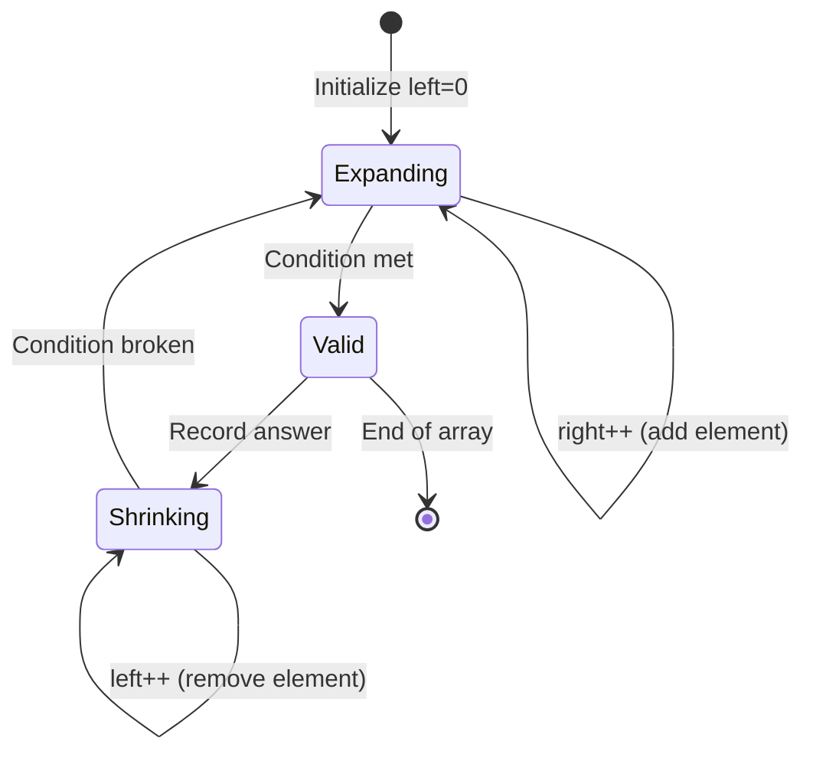
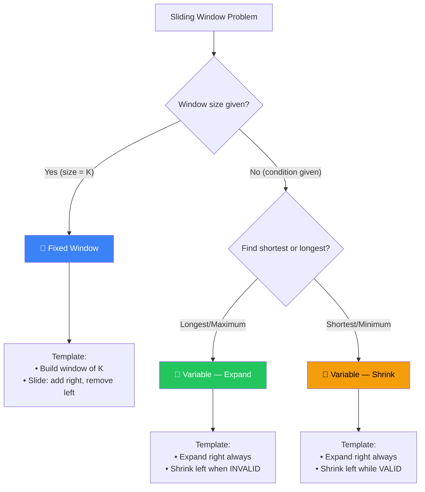

[🏠 Home](../../README.md) | [⬅️ Two Pointers](../03-two-pointers/00-overview.md) | [➡️ Binary Search](../05-binary-search/00-overview.md)

# 🪟 Sliding Window Pattern

> Efficiently process contiguous subarrays/substrings

---

## 🎯 When to Use

| Clue | Window Type |
|------|-------------|
| "Maximum/Minimum subarray of size K" | Fixed size |
| "Subarray with sum = K" | Variable size |
| "Longest substring with condition" | Variable size |
| "Smallest subarray with condition" | Variable size |
| Contiguous elements | Both |

---

## 🧠 WHY Sliding Window Works: The Math Behind It

> **🎯 For Beginners:** Sliding Window is about REUSING computation instead of REPEATING it!

### The Core Insight: Don't Re-Calculate What You Already Know

```
❌ Brute Force (O(n × k)):
   "Find max sum of any 3 consecutive elements"
   
   [2, 1, 5, 1, 3, 2]
   
   Window 1: 2 + 1 + 5 = 8  (3 additions)
   Window 2: 1 + 5 + 1 = 7  (3 additions)  ← Recalculating 1+5!
   Window 3: 5 + 1 + 3 = 9  (3 additions)  ← Recalculating 5+1!
   
   Total: n × k operations

✅ Sliding Window (O(n)):
   Window 1: 2 + 1 + 5 = 8
   Window 2: 8 - 2 + 1 = 7   ← Just subtract old, add new!
   Window 3: 7 - 1 + 3 = 9   ← Just subtract old, add new!
   
   Total: n operations (each element added/removed once)
```

### Mathematical Proof

```
Why is each element touched only TWICE?

[a, b, c, d, e, f, g]
     └──window──┘

Element 'd':
  - Added when right pointer reaches it
  - Removed when left pointer passes it

Every element: 1 add + 1 remove = 2 operations
Total: 2n operations = O(n)
```

### Fixed vs Variable Window

```
FIXED Window (size given):
│ a b c │ d e f g    ← Always size 3
  │ b c d │ e f g    ← Slide by 1

VARIABLE Window (condition given):
│ a b c d e f │ g    ← Expand until condition breaks
    │ b c d │ e f g  ← Shrink while condition holds
```

### Thought Process Template

```
🧠 "Can I use Sliding Window here?"

1. Is the problem about CONTIGUOUS elements?
   → Yes: Sliding Window candidate
   → No: Different pattern

2. Is window size FIXED or determined by CONDITION?
   → Fixed: Simple add/remove at boundaries
   → Variable: Expand right, shrink left

3. What STATE do I need to track in the window?
   → Sum: Just a single variable
   → Frequencies: HashMap
   → Unique count: HashSet
```

---

## 📊 Sliding Window — State Machine



### 🧭 Fixed or Variable? Decision Flowchart



---

## 🔧 Pattern Variations

### 1. Fixed Size Window

Window size is given (K).

```
Array: [1, 3, 2, 6, -1, 4, 1, 8, 2], K=5
        └────────────┘
        Window of size 5
```

**Template**:
```java
public int fixedWindow(int[] arr, int k) {
    int windowSum = 0;
    int result = 0;
    
    for (int i = 0; i < arr.length; i++) {
        windowSum += arr[i];  // Add right element
        
        if (i >= k - 1) {     // Window is full
            result = Math.max(result, windowSum);
            windowSum -= arr[i - k + 1];  // Remove left element
        }
    }
    return result;
}
```

---

### 2. Variable Size Window

Window size depends on condition.

```
String: "ADOBECODEBANC"
         └──────┘       Expand until condition met
            └─────┘     Shrink while condition holds
```

**Template (Longest/Maximum)**:
```java
public int longestWindow(String s) {
    int left = 0;
    int maxLen = 0;
    // Data structure to track window state
    
    for (int right = 0; right < s.length(); right++) {
        // Add s.charAt(right) to window
        
        while (/* window invalid */) {
            // Remove s.charAt(left) from window
            left++;
        }
        
        maxLen = Math.max(maxLen, right - left + 1);
    }
    return maxLen;
}
```

**Template (Shortest/Minimum)**:
```java
public int shortestWindow(String s, String target) {
    int left = 0;
    int minLen = Integer.MAX_VALUE;
    
    for (int right = 0; right < s.length(); right++) {
        // Add to window
        
        while (/* window valid */) {
            minLen = Math.min(minLen, right - left + 1);
            // Remove from window
            left++;
        }
    }
    return minLen == Integer.MAX_VALUE ? 0 : minLen;
}
```

---

## 💻 Core Problems

### Problem 1: Maximum Sum Subarray of Size K

```java
public int maxSumSubarray(int[] arr, int k) {
    int windowSum = 0;
    int maxSum = Integer.MIN_VALUE;
    
    for (int i = 0; i < arr.length; i++) {
        windowSum += arr[i];
        
        if (i >= k - 1) {
            maxSum = Math.max(maxSum, windowSum);
            windowSum -= arr[i - k + 1];
        }
    }
    return maxSum;
}
```

**Visualization**:
```
arr = [2, 1, 5, 1, 3, 2], k = 3

Window 1: [2, 1, 5] = 8
Window 2: [1, 5, 1] = 7
Window 3: [5, 1, 3] = 9  ← max
Window 4: [1, 3, 2] = 6

Answer: 9
```

---

### Problem 2: Longest Substring Without Repeating Characters

```java
public int lengthOfLongestSubstring(String s) {
    Set<Character> window = new HashSet<>();
    int left = 0;
    int maxLen = 0;
    
    for (int right = 0; right < s.length(); right++) {
        char c = s.charAt(right);
        
        // Shrink window until no duplicate
        while (window.contains(c)) {
            window.remove(s.charAt(left));
            left++;
        }
        
        window.add(c);
        maxLen = Math.max(maxLen, right - left + 1);
    }
    return maxLen;
}
```

**Optimized with HashMap (jump directly)**:
```java
public int lengthOfLongestSubstring(String s) {
    Map<Character, Integer> lastSeen = new HashMap<>();
    int left = 0;
    int maxLen = 0;
    
    for (int right = 0; right < s.length(); right++) {
        char c = s.charAt(right);
        
        if (lastSeen.containsKey(c) && lastSeen.get(c) >= left) {
            left = lastSeen.get(c) + 1;  // Jump!
        }
        
        lastSeen.put(c, right);
        maxLen = Math.max(maxLen, right - left + 1);
    }
    return maxLen;
}
```

**Visualization**:
```
s = "abcabcbb"
     ↑↑↑        "abc" length=3
      ↑↑↑       "bca" length=3
       ↑↑↑      "cab" length=3
        ↑↑↑     "abc" length=3
         ↑↑     duplicate 'b', shrink
          ↑↑    "cb" length=2
           ↑    "b" length=1

Answer: 3
```

---

### Problem 3: Minimum Window Substring

```java
// Find minimum window in s that contains all chars of t
public String minWindow(String s, String t) {
    if (s.length() < t.length()) return "";
    
    // Count required characters
    Map<Character, Integer> need = new HashMap<>();
    for (char c : t.toCharArray()) {
        need.put(c, need.getOrDefault(c, 0) + 1);
    }
    
    Map<Character, Integer> window = new HashMap<>();
    int have = 0, required = need.size();
    int left = 0;
    int minLen = Integer.MAX_VALUE;
    int minStart = 0;
    
    for (int right = 0; right < s.length(); right++) {
        char c = s.charAt(right);
        window.put(c, window.getOrDefault(c, 0) + 1);
        
        // Check if this char's requirement is met
        if (need.containsKey(c) && window.get(c).equals(need.get(c))) {
            have++;
        }
        
        // Shrink window while valid
        while (have == required) {
            if (right - left + 1 < minLen) {
                minLen = right - left + 1;
                minStart = left;
            }
            
            char leftChar = s.charAt(left);
            window.put(leftChar, window.get(leftChar) - 1);
            
            if (need.containsKey(leftChar) && 
                window.get(leftChar) < need.get(leftChar)) {
                have--;
            }
            left++;
        }
    }
    
    return minLen == Integer.MAX_VALUE ? "" : s.substring(minStart, minStart + minLen);
}
```

---

### Problem 4: Best Time to Buy and Sell Stock

```java
public int maxProfit(int[] prices) {
    int minPrice = Integer.MAX_VALUE;
    int maxProfit = 0;
    
    for (int price : prices) {
        minPrice = Math.min(minPrice, price);
        maxProfit = Math.max(maxProfit, price - minPrice);
    }
    return maxProfit;
}
```

**This is a sliding window variant** - tracking min from left and max profit.

---

### Problem 5: Longest Repeating Character Replacement

```java
// Replace at most k characters to get longest repeating substring
public int characterReplacement(String s, int k) {
    int[] count = new int[26];
    int left = 0;
    int maxCount = 0;  // Count of most frequent char in window
    int maxLen = 0;
    
    for (int right = 0; right < s.length(); right++) {
        count[s.charAt(right) - 'A']++;
        maxCount = Math.max(maxCount, count[s.charAt(right) - 'A']);
        
        // Window size - maxCount = chars to replace
        // If > k, shrink window
        while ((right - left + 1) - maxCount > k) {
            count[s.charAt(left) - 'A']--;
            left++;
        }
        
        maxLen = Math.max(maxLen, right - left + 1);
    }
    return maxLen;
}
```

---

## 🧠 Memory Visualization

### Sliding Window State

```
String: "ADOBECODEBANC", t = "ABC"

Step 1: Expand right
        A D O B E C O D E B A N C
        ↑         ↑
      left      right
        Window: "ADOBEC" ← Contains A,B,C ✅

Step 2: Shrink left
        A D O B E C O D E B A N C
          ↑       ↑
        left    right
        Window: "DOBEC" ← Missing A ❌

Continue until find minimum...
```

---

## 📊 Complexity Summary

| Problem | Time | Space |
|---------|------|-------|
| Max Sum K | O(n) | O(1) |
| Longest No Repeat | O(n) | O(min(n, 26)) |
| Min Window Substring | O(n) | O(26) |
| Character Replacement | O(n) | O(26) |

---

## ⚠️ Common Mistakes

1. **Off-by-one in window size**: `right - left + 1`
2. **Forgetting to shrink**: Always check shrink condition
3. **Wrong shrink condition**: Longest → shrink when invalid, Shortest → shrink when valid

---

## 📝 Practice Problems

| # | Problem | Difficulty | Link | Key Insight |
|---|---------|------------|------|-------------|
| 1 | Best Time to Buy/Sell Stock | 🟢 Easy | [LeetCode](https://leetcode.com/problems/best-time-to-buy-and-sell-stock/) | Track min |
| 2 | Longest Substring No Repeat | 🟡 Medium | [LeetCode](https://leetcode.com/problems/longest-substring-without-repeating-characters/) | HashSet/Map |
| 3 | Longest Repeating Replacement | 🟡 Medium | [LeetCode](https://leetcode.com/problems/longest-repeating-character-replacement/) | maxCount trick |
| 4 | Permutation in String | 🟡 Medium | [LeetCode](https://leetcode.com/problems/permutation-in-string/) | Fixed window |
| 5 | Minimum Window Substring | 🔴 Hard | [LeetCode](https://leetcode.com/problems/minimum-window-substring/) | Two maps |
| 6 | Sliding Window Maximum | 🔴 Hard | [LeetCode](https://leetcode.com/problems/sliding-window-maximum/) | Deque |

---

*Next: [Binary Search →](../05-binary-search/00-overview.md)*
