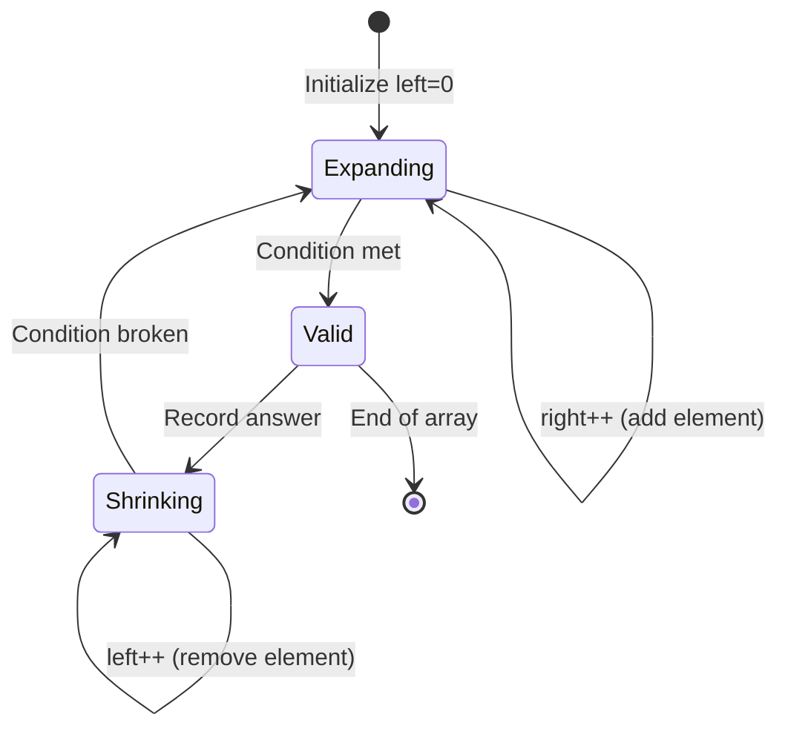
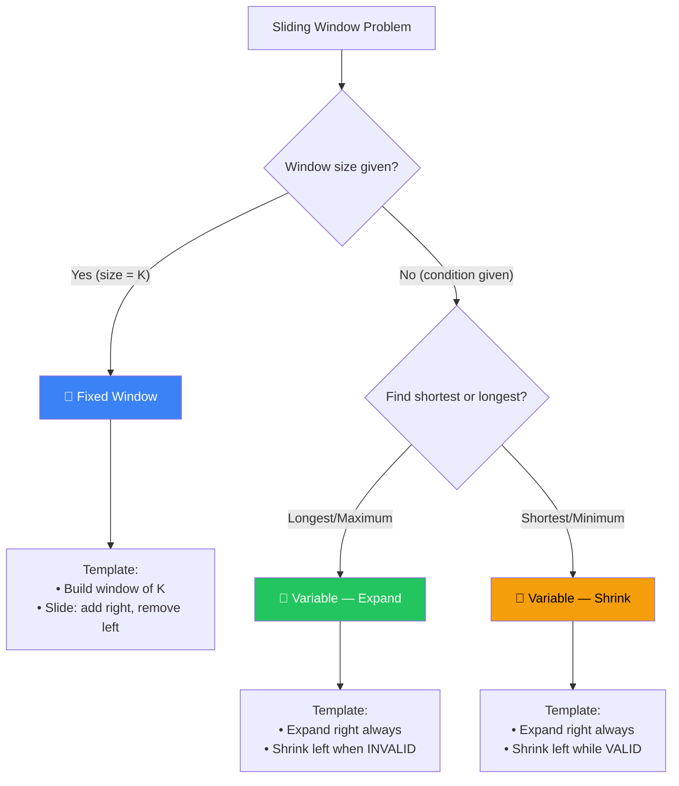
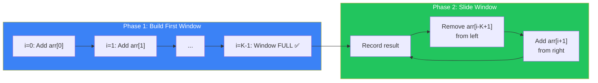
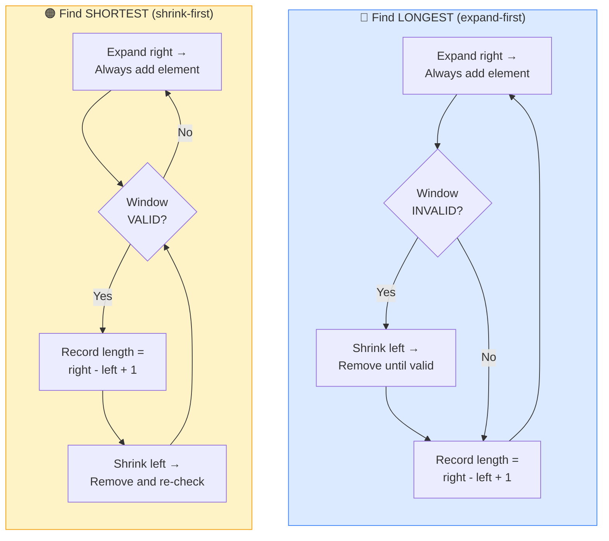
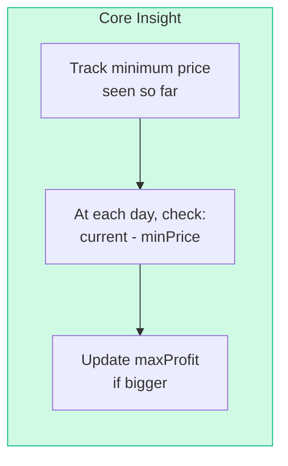
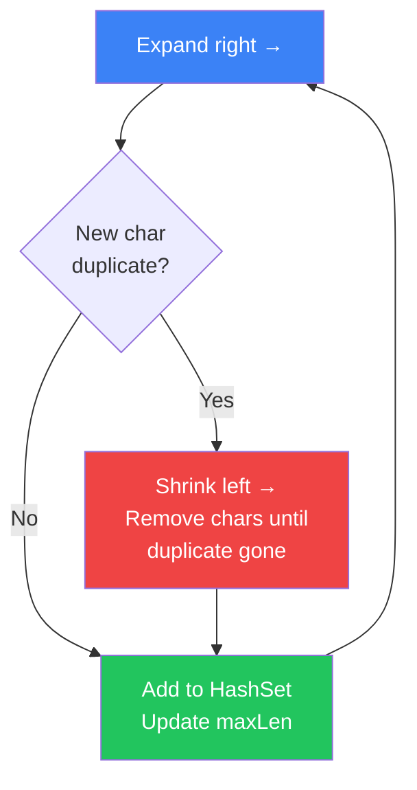
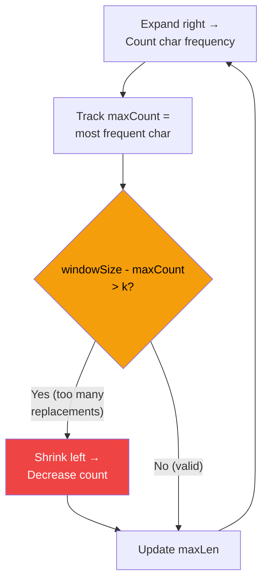
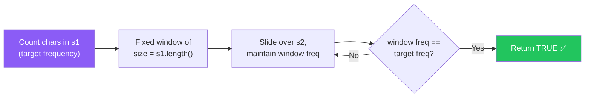
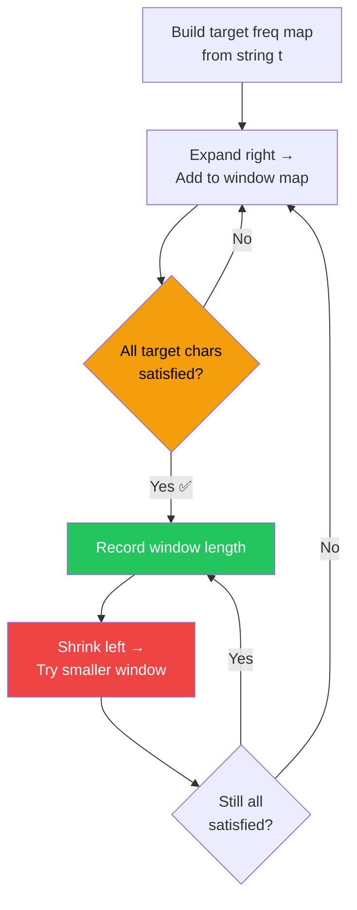
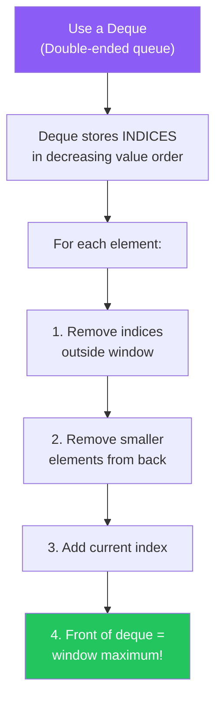

[🏠 Home](../../README.md) | [⬅️ Two Pointers](../03-two-pointers/00-overview.md) | [➡️ Binary Search](../05-binary-search/00-overview.md)

# 🪟 Sliding Window Pattern

> Efficiently process contiguous subarrays/substrings

---

## 🎯 When to Use

| Clue | Window Type |
|------|-------------|
| "Maximum/Minimum subarray of size K" | Fixed size |
| "Subarray with sum = K" | Variable size |
| "Longest substring with condition" | Variable size |
| "Smallest subarray with condition" | Variable size |
| Contiguous elements | Both |

---

## 🧠 WHY Sliding Window Works: The Math Behind It

> **🎯 For Beginners:** Sliding Window is about REUSING computation instead of REPEATING it!

### The Core Insight: Don't Re-Calculate What You Already Know

```
❌ Brute Force (O(n × k)):
   "Find max sum of any 3 consecutive elements"
   
   [2, 1, 5, 1, 3, 2]
   
   Window 1: 2 + 1 + 5 = 8  (3 additions)
   Window 2: 1 + 5 + 1 = 7  (3 additions)  ← Recalculating 1+5!
   Window 3: 5 + 1 + 3 = 9  (3 additions)  ← Recalculating 5+1!
   
   Total: n × k operations

✅ Sliding Window (O(n)):
   Window 1: 2 + 1 + 5 = 8
   Window 2: 8 - 2 + 1 = 7   ← Just subtract old, add new!
   Window 3: 7 - 1 + 3 = 9   ← Just subtract old, add new!
   
   Total: n operations (each element added/removed once)
```

### Mathematical Proof

```
Why is each element touched only TWICE?

[a, b, c, d, e, f, g]
     └──window──┘

Element 'd':
  - Added when right pointer reaches it
  - Removed when left pointer passes it

Every element: 1 add + 1 remove = 2 operations
Total: 2n operations = O(n)
```

### Fixed vs Variable Window

```
FIXED Window (size given):
│ a b c │ d e f g    ← Always size 3
  │ b c d │ e f g    ← Slide by 1

VARIABLE Window (condition given):
│ a b c d e f │ g    ← Expand until condition breaks
    │ b c d │ e f g  ← Shrink while condition holds
```

### Thought Process Template

```
🧠 "Can I use Sliding Window here?"

1. Is the problem about CONTIGUOUS elements?
   → Yes: Sliding Window candidate
   → No: Different pattern

2. Is window size FIXED or determined by CONDITION?
   → Fixed: Simple add/remove at boundaries
   → Variable: Expand right, shrink left

3. What STATE do I need to track in the window?
   → Sum: Just a single variable
   → Frequencies: HashMap
   → Unique count: HashSet
```

---

## 📊 Sliding Window — State Machine



### 🧭 Fixed or Variable? Decision Flowchart



---

## 🔧 Pattern Variations

### 1. Fixed Size Window

Window size is given (K).

```
Array: [1, 3, 2, 6, -1, 4, 1, 8, 2], K=5
        └────────────┘
        Window of size 5
```

#### 📊 How Fixed Window Works — Flow Diagram



#### 📝 Detailed Example: Max Sum Subarray of Size K=3

> **Problem:** Find the maximum sum of any 3 consecutive elements in `[2, 1, 5, 1, 3, 2]`

**Step-by-step walkthrough:**

```
Array: [2, 1, 5, 1, 3, 2],  K = 3

── Phase 1: Build first window (i = 0 to K-1) ──

i=0: windowSum = 0 + 2 = 2
     [2, 1, 5, 1, 3, 2]
      ^
      Window not full yet (size=1 < 3)

i=1: windowSum = 2 + 1 = 3
     [2, 1, 5, 1, 3, 2]
      ^  ^
      Window not full yet (size=2 < 3)

i=2: windowSum = 3 + 5 = 8   ← Window is FULL! (i >= K-1)
     [2, 1, 5, 1, 3, 2]
      ^  ^  ^
     [── window ──]
     maxSum = max(-∞, 8) = 8
     Remove left: windowSum = 8 - arr[0] = 8 - 2 = 6

── Phase 2: Slide window ──

i=3: windowSum = 6 + 1 = 7
     [2, 1, 5, 1, 3, 2]
         ^  ^  ^
        [── window ──]
     maxSum = max(8, 7) = 8
     Remove left: windowSum = 7 - arr[1] = 7 - 1 = 6

i=4: windowSum = 6 + 3 = 9
     [2, 1, 5, 1, 3, 2]
            ^  ^  ^
           [── window ──]
     maxSum = max(8, 9) = 9  ✅ New max!
     Remove left: windowSum = 9 - arr[2] = 9 - 5 = 4

i=5: windowSum = 4 + 2 = 6
     [2, 1, 5, 1, 3, 2]
               ^  ^  ^
              [── window ──]
     maxSum = max(9, 6) = 9

🎯 Answer: 9  (subarray [5, 1, 3])
```

**Summary Table:**

| Step (i) | Window Elements | Sum | Max So Far | Removed |
|----------|----------------|-----|------------|---------|
| 0 | [2] | 2 | — | — |
| 1 | [2, 1] | 3 | — | — |
| 2 | **[2, 1, 5]** | 8 | **8** | 2 |
| 3 | **[1, 5, 1]** | 7 | 8 | 1 |
| 4 | **[5, 1, 3]** | 9 | **9** ✅ | 5 |
| 5 | **[1, 3, 2]** | 6 | 9 | — |

**Template**:
```java
public int fixedWindow(int[] arr, int k) {
    int windowSum = 0;
    int result = 0;
    
    for (int i = 0; i < arr.length; i++) {
        windowSum += arr[i];  // Add right element
        
        if (i >= k - 1) {     // Window is full
            result = Math.max(result, windowSum);
            windowSum -= arr[i - k + 1];  // Remove left element
        }
    }
    return result;
}
```

---

### 2. Variable Size Window

Window size depends on condition.

```
String: "ADOBECODEBANC"
         └──────┘       Expand until condition met
            └─────┘     Shrink while condition holds
```

#### 📊 How Variable Window Works — Flow Diagram



> **Key Difference:** For **longest** → shrink when INVALID. For **shortest** → shrink while VALID.

#### 📝 Detailed Example A: Longest Substring Without Repeating (Variable — Longest)

> **Problem:** Find longest substring with all unique characters in `"abcabcbb"`

**Step-by-step walkthrough:**

```
String: "a b c a b c b b"
Index:   0 1 2 3 4 5 6 7

── Expand and track with HashSet ──

right=0: Add 'a' → window={a}
         "a b c a b c b b"
          L
          R
         length = 0-0+1 = 1, maxLen = 1

right=1: Add 'b' → window={a,b}
         "a b c a b c b b"
          L R
         length = 1-0+1 = 2, maxLen = 2

right=2: Add 'c' → window={a,b,c}
         "a b c a b c b b"
          L   R
         length = 2-0+1 = 3, maxLen = 3

right=3: 'a' already in window! ⚠️ INVALID
         Shrink: Remove 'a', left=1 → window={b,c}
         Add 'a' → window={b,c,a}
         "a b c a b c b b"
            L   R
         length = 3-1+1 = 3, maxLen = 3

right=4: 'b' already in window! ⚠️ INVALID
         Shrink: Remove 'b', left=2 → window={c,a}
         Add 'b' → window={c,a,b}
         "a b c a b c b b"
              L   R
         length = 4-2+1 = 3, maxLen = 3

right=5: 'c' already in window! ⚠️ INVALID
         Shrink: Remove 'c', left=3 → window={a,b}
         Add 'c' → window={a,b,c}
         "a b c a b c b b"
                L     R
         length = 5-3+1 = 3, maxLen = 3

right=6: 'b' already in window! ⚠️ INVALID
         Shrink: Remove 'a', left=4 → window={b,c}
         Shrink: Remove 'b', left=5 → window={c}
         Add 'b' → window={c,b}
         "a b c a b c b b"
                    L R
         length = 6-5+1 = 2, maxLen = 3

right=7: 'b' already in window! ⚠️ INVALID
         Shrink: Remove 'c', left=6 → window={b}
         Shrink: Remove 'b', left=7 → window={}
         Add 'b' → window={b}
         "a b c a b c b b"
                        LR
         length = 7-7+1 = 1, maxLen = 3

🎯 Answer: 3  (substrings "abc", "bca", "cab" all have length 3)
```

**Summary Table:**

| right | char | Duplicate? | Shrink to left= | Window | Length | maxLen |
|-------|------|-----------|-----------------|--------|--------|--------|
| 0 | a | No | — | {a} | 1 | 1 |
| 1 | b | No | — | {a,b} | 2 | 2 |
| 2 | c | No | — | {a,b,c} | 3 | **3** |
| 3 | a | Yes ⚠️ | 1 | {b,c,a} | 3 | 3 |
| 4 | b | Yes ⚠️ | 2 | {c,a,b} | 3 | 3 |
| 5 | c | Yes ⚠️ | 3 | {a,b,c} | 3 | 3 |
| 6 | b | Yes ⚠️ | 5 | {c,b} | 2 | 3 |
| 7 | b | Yes ⚠️ | 7 | {b} | 1 | 3 |

**Template (Longest/Maximum)**:
```java
public int longestWindow(String s) {
    int left = 0;
    int maxLen = 0;
    // Data structure to track window state
    
    for (int right = 0; right < s.length(); right++) {
        // Add s.charAt(right) to window
        
        while (/* window invalid */) {
            // Remove s.charAt(left) from window
            left++;
        }
        
        maxLen = Math.max(maxLen, right - left + 1);
    }
    return maxLen;
}
```

---

#### 📝 Detailed Example B: Smallest Subarray with Sum ≥ Target (Variable — Shortest)

> **Problem:** Find the smallest contiguous subarray with sum ≥ `7` in `[2, 3, 1, 2, 4, 3]`

**Step-by-step walkthrough:**

```
Array: [2, 3, 1, 2, 4, 3],  target = 7

right=0: Add 2 → windowSum = 2
         [2, 3, 1, 2, 4, 3]
          LR
         sum=2 < 7 → NOT valid, keep expanding

right=1: Add 3 → windowSum = 5
         [2, 3, 1, 2, 4, 3]
          L  R
         sum=5 < 7 → NOT valid, keep expanding

right=2: Add 1 → windowSum = 6
         [2, 3, 1, 2, 4, 3]
          L     R
         sum=6 < 7 → NOT valid, keep expanding

right=3: Add 2 → windowSum = 8
         [2, 3, 1, 2, 4, 3]
          L        R
         sum=8 ≥ 7 → ✅ VALID! Record length=4, minLen=4
         Shrink: Remove 2, left=1 → windowSum=6
         sum=6 < 7 → stop shrinking

right=4: Add 4 → windowSum = 10
         [2, 3, 1, 2, 4, 3]
             L        R
         sum=10 ≥ 7 → ✅ VALID! Record length=4, minLen=4
         Shrink: Remove 3, left=2 → windowSum=7
         sum=7 ≥ 7 → ✅ VALID! Record length=3, minLen=3
         Shrink: Remove 1, left=3 → windowSum=6
         sum=6 < 7 → stop shrinking

right=5: Add 3 → windowSum = 9
         [2, 3, 1, 2, 4, 3]
                   L     R
         sum=9 ≥ 7 → ✅ VALID! Record length=3, minLen=3
         Shrink: Remove 2, left=4 → windowSum=7
         sum=7 ≥ 7 → ✅ VALID! Record length=2, minLen=2 ✅ New min!
         Shrink: Remove 4, left=5 → windowSum=3
         sum=3 < 7 → stop shrinking

🎯 Answer: 2  (subarray [4, 3])
```

**Summary Table:**

| right | Added | windowSum | Valid? | Shrink Result | Window | minLen |
|-------|-------|-----------|--------|---------------|--------|--------|
| 0 | 2 | 2 | ❌ | — | [2] | ∞ |
| 1 | 3 | 5 | ❌ | — | [2,3] | ∞ |
| 2 | 1 | 6 | ❌ | — | [2,3,1] | ∞ |
| 3 | 2 | 8 | ✅ | Remove 2→sum=6 | [3,1,2] | 4 |
| 4 | 4 | 10 | ✅ | Remove 3→7✅→Remove 1→6 | [2,4] | 3 |
| 5 | 3 | 9 | ✅ | Remove 2→7✅→Remove 4→3 | [3] | **2** ✅ |

**Template (Shortest/Minimum)**:
```java
public int shortestWindow(int[] arr, int target) {
    int left = 0;
    int windowSum = 0;
    int minLen = Integer.MAX_VALUE;
    
    for (int right = 0; right < arr.length; right++) {
        windowSum += arr[right];  // Add to window
        
        while (windowSum >= target) {  // While VALID → shrink!
            minLen = Math.min(minLen, right - left + 1);
            windowSum -= arr[left];    // Remove from window
            left++;
        }
    }
    return minLen == Integer.MAX_VALUE ? 0 : minLen;
}
```

---

## 💻 Core Problems

### Problem 1: Maximum Sum Subarray of Size K

```java
public int maxSumSubarray(int[] arr, int k) {
    int windowSum = 0;
    int maxSum = Integer.MIN_VALUE;
    
    for (int i = 0; i < arr.length; i++) {
        windowSum += arr[i];
        
        if (i >= k - 1) {
            maxSum = Math.max(maxSum, windowSum);
            windowSum -= arr[i - k + 1];
        }
    }
    return maxSum;
}
```

**Visualization**:
```
arr = [2, 1, 5, 1, 3, 2], k = 3

Window 1: [2, 1, 5] = 8
Window 2: [1, 5, 1] = 7
Window 3: [5, 1, 3] = 9  ← max
Window 4: [1, 3, 2] = 6

Answer: 9
```

---

### Problem 2: Longest Substring Without Repeating Characters

```java
public int lengthOfLongestSubstring(String s) {
    Set<Character> window = new HashSet<>();
    int left = 0;
    int maxLen = 0;
    
    for (int right = 0; right < s.length(); right++) {
        char c = s.charAt(right);
        
        // Shrink window until no duplicate
        while (window.contains(c)) {
            window.remove(s.charAt(left));
            left++;
        }
        
        window.add(c);
        maxLen = Math.max(maxLen, right - left + 1);
    }
    return maxLen;
}
```

**Optimized with HashMap (jump directly)**:
```java
public int lengthOfLongestSubstring(String s) {
    Map<Character, Integer> lastSeen = new HashMap<>();
    int left = 0;
    int maxLen = 0;
    
    for (int right = 0; right < s.length(); right++) {
        char c = s.charAt(right);
        
        if (lastSeen.containsKey(c) && lastSeen.get(c) >= left) {
            left = lastSeen.get(c) + 1;  // Jump!
        }
        
        lastSeen.put(c, right);
        maxLen = Math.max(maxLen, right - left + 1);
    }
    return maxLen;
}
```

**Visualization**:
```
s = "abcabcbb"
     ↑↑↑        "abc" length=3
      ↑↑↑       "bca" length=3
       ↑↑↑      "cab" length=3
        ↑↑↑     "abc" length=3
         ↑↑     duplicate 'b', shrink
          ↑↑    "cb" length=2
           ↑    "b" length=1

Answer: 3
```

---

### Problem 3: Minimum Window Substring

```java
// Find minimum window in s that contains all chars of t
public String minWindow(String s, String t) {
    if (s.length() < t.length()) return "";
    
    // Count required characters
    Map<Character, Integer> need = new HashMap<>();
    for (char c : t.toCharArray()) {
        need.put(c, need.getOrDefault(c, 0) + 1);
    }
    
    Map<Character, Integer> window = new HashMap<>();
    int have = 0, required = need.size();
    int left = 0;
    int minLen = Integer.MAX_VALUE;
    int minStart = 0;
    
    for (int right = 0; right < s.length(); right++) {
        char c = s.charAt(right);
        window.put(c, window.getOrDefault(c, 0) + 1);
        
        // Check if this char's requirement is met
        if (need.containsKey(c) && window.get(c).equals(need.get(c))) {
            have++;
        }
        
        // Shrink window while valid
        while (have == required) {
            if (right - left + 1 < minLen) {
                minLen = right - left + 1;
                minStart = left;
            }
            
            char leftChar = s.charAt(left);
            window.put(leftChar, window.get(leftChar) - 1);
            
            if (need.containsKey(leftChar) && 
                window.get(leftChar) < need.get(leftChar)) {
                have--;
            }
            left++;
        }
    }
    
    return minLen == Integer.MAX_VALUE ? "" : s.substring(minStart, minStart + minLen);
}
```

---

### Problem 4: Best Time to Buy and Sell Stock

```java
public int maxProfit(int[] prices) {
    int minPrice = Integer.MAX_VALUE;
    int maxProfit = 0;
    
    for (int price : prices) {
        minPrice = Math.min(minPrice, price);
        maxProfit = Math.max(maxProfit, price - minPrice);
    }
    return maxProfit;
}
```

**This is a sliding window variant** - tracking min from left and max profit.

---

### Problem 5: Longest Repeating Character Replacement

```java
// Replace at most k characters to get longest repeating substring
public int characterReplacement(String s, int k) {
    int[] count = new int[26];
    int left = 0;
    int maxCount = 0;  // Count of most frequent char in window
    int maxLen = 0;
    
    for (int right = 0; right < s.length(); right++) {
        count[s.charAt(right) - 'A']++;
        maxCount = Math.max(maxCount, count[s.charAt(right) - 'A']);
        
        // Window size - maxCount = chars to replace
        // If > k, shrink window
        while ((right - left + 1) - maxCount > k) {
            count[s.charAt(left) - 'A']--;
            left++;
        }
        
        maxLen = Math.max(maxLen, right - left + 1);
    }
    return maxLen;
}
```

---

## 🧠 Memory Visualization

### Sliding Window State

```
String: "ADOBECODEBANC", t = "ABC"

Step 1: Expand right
        A D O B E C O D E B A N C
        ↑         ↑
      left      right
        Window: "ADOBEC" ← Contains A,B,C ✅

Step 2: Shrink left
        A D O B E C O D E B A N C
          ↑       ↑
        left    right
        Window: "DOBEC" ← Missing A ❌

Continue until find minimum...
```

---

## 📊 Complexity Summary

| Problem | Time | Space |
|---------|------|-------|
| Max Sum K | O(n) | O(1) |
| Longest No Repeat | O(n) | O(min(n, 26)) |
| Min Window Substring | O(n) | O(26) |
| Character Replacement | O(n) | O(26) |

---

## ⚠️ Common Mistakes

1. **Off-by-one in window size**: `right - left + 1`
2. **Forgetting to shrink**: Always check shrink condition
3. **Wrong shrink condition**: Longest → shrink when invalid, Shortest → shrink when valid

---

## 📝 Practice Problems — Detailed Solutions

| # | Problem | Difficulty | Link | Key Insight |
|---|---------|------------|------|-------------|
| 1 | Best Time to Buy/Sell Stock | 🟢 Easy | [LeetCode](https://leetcode.com/problems/best-time-to-buy-and-sell-stock/) | Track min |
| 2 | Longest Substring No Repeat | 🟡 Medium | [LeetCode](https://leetcode.com/problems/longest-substring-without-repeating-characters/) | HashSet/Map |
| 3 | Longest Repeating Replacement | 🟡 Medium | [LeetCode](https://leetcode.com/problems/longest-repeating-character-replacement/) | maxCount trick |
| 4 | Permutation in String | 🟡 Medium | [LeetCode](https://leetcode.com/problems/permutation-in-string/) | Fixed window |
| 5 | Minimum Window Substring | 🔴 Hard | [LeetCode](https://leetcode.com/problems/minimum-window-substring/) | Two maps |
| 6 | Sliding Window Maximum | 🔴 Hard | [LeetCode](https://leetcode.com/problems/sliding-window-maximum/) | Deque |

---

### Practice 1: Best Time to Buy and Sell Stock 🟢

> **Problem:** Given array `prices` where `prices[i]` is the stock price on day `i`, find the maximum profit from one buy and one sell. You must buy before you sell.

#### 🧠 Approach Diagram



#### ❌ Brute Force: O(n²)

```java
// Check every pair (buy, sell) where buy < sell
public int maxProfit(int[] prices) {
    int maxProfit = 0;
    for (int i = 0; i < prices.length; i++) {        // buy day
        for (int j = i + 1; j < prices.length; j++) { // sell day
            maxProfit = Math.max(maxProfit, prices[j] - prices[i]);
        }
    }
    return maxProfit;
}
// Time: O(n²)  |  Space: O(1)
```

#### ✅ Optimal: Sliding Window O(n)

```java
public int maxProfit(int[] prices) {
    int minPrice = Integer.MAX_VALUE;  // cheapest buy so far
    int maxProfit = 0;
    
    for (int price : prices) {
        minPrice = Math.min(minPrice, price);          // update best buy
        maxProfit = Math.max(maxProfit, price - minPrice); // check profit
    }
    return maxProfit;
}
// Time: O(n)  |  Space: O(1)
```

#### 📝 Step-by-Step Example

```
prices = [7, 1, 5, 3, 6, 4]

Day 0: price=7  minPrice=7  profit=7-7=0   maxProfit=0
       [7, 1, 5, 3, 6, 4]
        ^ buy here? price is 7

Day 1: price=1  minPrice=1  profit=1-1=0   maxProfit=0
       [7, 1, 5, 3, 6, 4]
           ^ new minimum! (cheapest buy day)

Day 2: price=5  minPrice=1  profit=5-1=4   maxProfit=4
       [7, 1, 5, 3, 6, 4]
           B     S
           buy=1, sell=5, profit=4 ✅

Day 3: price=3  minPrice=1  profit=3-1=2   maxProfit=4
       [7, 1, 5, 3, 6, 4]
           B        S
           profit=2, not better

Day 4: price=6  minPrice=1  profit=6-1=5   maxProfit=5
       [7, 1, 5, 3, 6, 4]
           B           S
           buy=1, sell=6, profit=5 ✅ New max!

Day 5: price=4  minPrice=1  profit=4-1=3   maxProfit=5
       [7, 1, 5, 3, 6, 4]
           B              S
           profit=3, not better

🎯 Answer: 5  (buy at 1, sell at 6)
```

| Day | Price | minPrice | Profit | maxProfit |
|-----|-------|----------|--------|-----------|
| 0 | 7 | 7 | 0 | 0 |
| 1 | 1 | **1** | 0 | 0 |
| 2 | 5 | 1 | 4 | 4 |
| 3 | 3 | 1 | 2 | 4 |
| 4 | 6 | 1 | **5** | **5** ✅ |
| 5 | 4 | 1 | 3 | 5 |

#### 💡 Why This Is a Sliding Window

```
The "window" is [minPrice ... currentPrice]
  - Left boundary = minimum price found so far
  - Right boundary = current price
  - We're maximizing the "span" (profit) of this window

     prices: [7, 1, 5, 3, 6, 4]
              └─────────┘
              min=1     max profit at price=6
              window tracks the best buy-to-sell range
```

---

### Practice 2: Longest Substring Without Repeating Characters 🟡

> **Problem:** Given string `s`, find the length of the longest substring without repeating characters.

#### 🧠 Approach Diagram



#### ❌ Brute Force: O(n³)

```java
// Check every substring, verify all unique
public int lengthOfLongestSubstring(String s) {
    int maxLen = 0;
    for (int i = 0; i < s.length(); i++) {
        for (int j = i; j < s.length(); j++) {
            if (allUnique(s, i, j)) {
                maxLen = Math.max(maxLen, j - i + 1);
            }
        }
    }
    return maxLen;
}

private boolean allUnique(String s, int start, int end) {
    Set<Character> set = new HashSet<>();
    for (int i = start; i <= end; i++) {
        if (!set.add(s.charAt(i))) return false;
    }
    return true;
}
// Time: O(n³)  |  Space: O(min(n, 26))
```

#### ✅ Optimal: HashSet Sliding Window O(n)

```java
public int lengthOfLongestSubstring(String s) {
    Set<Character> window = new HashSet<>();
    int left = 0, maxLen = 0;
    
    for (int right = 0; right < s.length(); right++) {
        char c = s.charAt(right);
        
        while (window.contains(c)) {   // shrink until no duplicate
            window.remove(s.charAt(left));
            left++;
        }
        
        window.add(c);
        maxLen = Math.max(maxLen, right - left + 1);
    }
    return maxLen;
}
// Time: O(n)  |  Space: O(min(n, 26))
```

#### 🚀 Further Optimized: HashMap (Jump Instead of Shrink)

```java
public int lengthOfLongestSubstring(String s) {
    Map<Character, Integer> lastSeen = new HashMap<>();
    int left = 0, maxLen = 0;
    
    for (int right = 0; right < s.length(); right++) {
        char c = s.charAt(right);
        
        if (lastSeen.containsKey(c) && lastSeen.get(c) >= left) {
            left = lastSeen.get(c) + 1;  // Jump past duplicate!
        }
        
        lastSeen.put(c, right);
        maxLen = Math.max(maxLen, right - left + 1);
    }
    return maxLen;
}
// Time: O(n)  |  Space: O(min(n, 26))
// Optimization: left pointer JUMPS instead of incrementing one-by-one
```

#### 📝 Step-by-Step Example

```
s = "pwwkew"

right=0: 'p' → window={p}
         "p w w k e w"
          LR
         maxLen = 1

right=1: 'w' → window={p,w}
         "p w w k e w"
          L R
         maxLen = 2

right=2: 'w' duplicate! ⚠️
         Shrink: remove 'p' (left=1) → {w}
         Shrink: remove 'w' (left=2) → {}
         Add 'w' → {w}
         "p w w k e w"
              LR
         maxLen = 2

right=3: 'k' → window={w,k}
         "p w w k e w"
              L R
         maxLen = 2

right=4: 'e' → window={w,k,e}
         "p w w k e w"
              L   R
         maxLen = 3  ✅

right=5: 'w' duplicate! ⚠️
         Shrink: remove 'w' (left=3) → {k,e}
         Add 'w' → {k,e,w}
         "p w w k e w"
                L   R
         maxLen = 3

🎯 Answer: 3  (substring "wke" or "kew")
```

| right | char | Action | left | Window | Length | maxLen |
|-------|------|--------|------|--------|--------|--------|
| 0 | p | Add | 0 | {p} | 1 | 1 |
| 1 | w | Add | 0 | {p,w} | 2 | 2 |
| 2 | w | Shrink→Add | 2 | {w} | 1 | 2 |
| 3 | k | Add | 2 | {w,k} | 2 | 2 |
| 4 | e | Add | 2 | {w,k,e} | 3 | **3** ✅ |
| 5 | w | Shrink→Add | 3 | {k,e,w} | 3 | 3 |

---

### Practice 3: Longest Repeating Character Replacement 🟡

> **Problem:** Given string `s` and integer `k`, find the length of longest substring with the same letter after replacing at most `k` characters.

#### 🧠 Approach Diagram



#### Key Insight

```
Window = "AABABBA", k = 1

Window "AABAB":
  A appears 3 times (maxCount = 3)
  B appears 2 times
  Window size = 5
  
  Chars to replace = windowSize - maxCount = 5 - 3 = 2
  But k = 1, so 2 > 1 → INVALID! Shrink!
  
💡 We only need to replace NON-majority characters
   So: replacements needed = windowSize - count(most frequent char)
```

#### ✅ Optimal Solution: O(n)

```java
public int characterReplacement(String s, int k) {
    int[] count = new int[26];
    int left = 0, maxCount = 0, maxLen = 0;
    
    for (int right = 0; right < s.length(); right++) {
        count[s.charAt(right) - 'A']++;
        maxCount = Math.max(maxCount, count[s.charAt(right) - 'A']);
        
        // replacements needed = window size - most frequent count
        while ((right - left + 1) - maxCount > k) {
            count[s.charAt(left) - 'A']--;
            left++;
        }
        
        maxLen = Math.max(maxLen, right - left + 1);
    }
    return maxLen;
}
// Time: O(n)  |  Space: O(26) = O(1)
```

#### 📝 Step-by-Step Example

```
s = "AABABBA", k = 1

right=0: 'A' count={A:1}  maxCount=1
         "A A B A B B A"
          LR
         size=1, replace=1-1=0 ≤ 1 ✅  maxLen=1

right=1: 'A' count={A:2}  maxCount=2
         "A A B A B B A"
          L R
         size=2, replace=2-2=0 ≤ 1 ✅  maxLen=2

right=2: 'B' count={A:2,B:1}  maxCount=2
         "A A B A B B A"
          L   R
         size=3, replace=3-2=1 ≤ 1 ✅  maxLen=3

right=3: 'A' count={A:3,B:1}  maxCount=3
         "A A B A B B A"
          L     R
         size=4, replace=4-3=1 ≤ 1 ✅  maxLen=4  ← "AABA" (replace B→A)

right=4: 'B' count={A:3,B:2}  maxCount=3
         "A A B A B B A"
          L       R
         size=5, replace=5-3=2 > 1 ❌ INVALID!
         Shrink: remove 'A', left=1 → count={A:2,B:2}
         size=4, replace=4-3=1 ≤ 1 ✅  maxLen=4

right=5: 'B' count={A:2,B:3}  maxCount=3
         "A A B A B B A"
            L       R
         size=5, replace=5-3=2 > 1 ❌ INVALID!
         Shrink: remove 'A', left=2 → count={A:1,B:3}
         size=4, replace=4-3=1 ≤ 1 ✅  maxLen=4

right=6: 'A' count={A:2,B:3}  maxCount=3
         "A A B A B B A"
              L       R
         size=5, replace=5-3=2 > 1 ❌ INVALID!
         Shrink: remove 'B', left=3 → count={A:2,B:2}
         size=4, replace=4-3=1 ≤ 1 ✅  maxLen=4

🎯 Answer: 4  (substring "AABA" — replace one B with A)
```

| right | char | maxCount | Window Size | Replacements | Valid? | maxLen |
|-------|------|----------|-------------|--------------|--------|--------|
| 0 | A | 1 | 1 | 0 | ✅ | 1 |
| 1 | A | 2 | 2 | 0 | ✅ | 2 |
| 2 | B | 2 | 3 | 1 | ✅ | 3 |
| 3 | A | 3 | 4 | 1 | ✅ | **4** |
| 4 | B | 3 | 5→4 | 2→1 | ❌→✅ | 4 |
| 5 | B | 3 | 5→4 | 2→1 | ❌→✅ | 4 |
| 6 | A | 3 | 5→4 | 2→1 | ❌→✅ | 4 |

#### 💡 Why We Don't Decrease maxCount

```
🤔 "When we shrink, shouldn't maxCount decrease?"

Actually, NO! maxCount only needs to INCREASE.

Why? We want the LONGEST window. A smaller maxCount
would only make the window SHORTER. So keeping the
historical max is safe — if it doesn't lead to a
longer window, we just won't update maxLen.

This is the KEY optimization that keeps it O(n)!
```

---

### Practice 4: Permutation in String 🟡

> **Problem:** Given strings `s1` and `s2`, return `true` if `s2` contains a permutation of `s1`.

#### 🧠 Approach Diagram



#### Key Insight

```
s1 = "ab"  →  Permutations: "ab", "ba"
s2 = "eidbaooo"

Instead of generating all permutations (k!), 
just check if any window of size k has the SAME character frequencies!

"ab" needs: {a:1, b:1}

Window "ei" → {e:1, i:1} ≠ {a:1, b:1}  ❌
Window "id" → {i:1, d:1} ≠ {a:1, b:1}  ❌
Window "db" → {d:1, b:1} ≠ {a:1, b:1}  ❌
Window "ba" → {b:1, a:1} == {a:1, b:1}  ✅ 
```

#### ✅ Optimal Solution: Fixed Window O(n)

```java
public boolean checkInclusion(String s1, String s2) {
    if (s1.length() > s2.length()) return false;
    
    int[] s1Count = new int[26];
    int[] windowCount = new int[26];
    
    // Build s1 frequency map
    for (char c : s1.toCharArray()) {
        s1Count[c - 'a']++;
    }
    
    int k = s1.length();
    
    for (int i = 0; i < s2.length(); i++) {
        windowCount[s2.charAt(i) - 'a']++;  // add right
        
        if (i >= k) {
            windowCount[s2.charAt(i - k) - 'a']--;  // remove left
        }
        
        if (Arrays.equals(s1Count, windowCount)) {
            return true;  // permutation found!
        }
    }
    return false;
}
// Time: O(n × 26) = O(n)  |  Space: O(26) = O(1)
```

#### 🚀 Optimized: Match Counter (Avoid Comparing Arrays)

```java
public boolean checkInclusion(String s1, String s2) {
    if (s1.length() > s2.length()) return false;
    
    int[] count = new int[26];
    for (char c : s1.toCharArray()) count[c - 'a']++;
    
    int k = s1.length();
    int matches = 0;  // how many chars have matching count
    
    // Count initial matches (chars with count 0 already match)
    for (int i = 0; i < 26; i++) {
        if (count[i] == 0) matches++;
    }
    
    for (int i = 0; i < s2.length(); i++) {
        int idx = s2.charAt(i) - 'a';
        count[idx]--;
        if (count[idx] == 0) matches++;       // became a match
        else if (count[idx] == -1) matches--;  // was a match, now isn't
        
        if (i >= k) {
            idx = s2.charAt(i - k) - 'a';
            count[idx]++;
            if (count[idx] == 0) matches++;       // became a match
            else if (count[idx] == 1) matches--;   // was a match, now isn't
        }
        
        if (matches == 26) return true;  // all 26 chars match!
    }
    return false;
}
// Time: O(n)  |  Space: O(1)
// Optimization: O(1) comparison per step instead of O(26)
```

#### 📝 Step-by-Step Example

```
s1 = "ab"  →  need: {a:1, b:1},  k = 2
s2 = "eidbaooo"

i=0: Add 'e' → window={e:1}
     "e i d b a o o o"
      ^
     Window not full yet

i=1: Add 'i' → window={e:1,i:1}
     "e i d b a o o o"
      ^ ^
     [e, i] → {e:1,i:1} ≠ {a:1,b:1}  ❌

i=2: Add 'd', remove 'e' → window={i:1,d:1}
     "e i d b a o o o"
        ^ ^
     [i, d] → {i:1,d:1} ≠ {a:1,b:1}  ❌

i=3: Add 'b', remove 'i' → window={d:1,b:1}
     "e i d b a o o o"
          ^ ^
     [d, b] → {d:1,b:1} ≠ {a:1,b:1}  ❌

i=4: Add 'a', remove 'd' → window={b:1,a:1}
     "e i d b a o o o"
            ^ ^
     [b, a] → {b:1,a:1} == {a:1,b:1}  ✅ MATCH!

🎯 Answer: true  ("ba" is a permutation of "ab")
```

| i | Window | Freq | Match? |
|---|--------|------|--------|
| 1 | [e, i] | {e:1,i:1} | ❌ |
| 2 | [i, d] | {i:1,d:1} | ❌ |
| 3 | [d, b] | {d:1,b:1} | ❌ |
| 4 | **[b, a]** | **{b:1,a:1}** | ✅ |

---

### Practice 5: Minimum Window Substring 🔴

> **Problem:** Given strings `s` and `t`, find the minimum window in `s` that contains all characters of `t`.

#### 🧠 Approach Diagram



#### Key Insight

```
s = "ADOBECODEBANC", t = "ABC"

Need: {A:1, B:1, C:1}

This is "Variable Window — Shortest" pattern:
  1. EXPAND right until window contains all of A, B, C
  2. SHRINK left while window still contains all of A, B, C
  3. Track minimum window found

The trick: use a "have" counter to avoid checking 
all frequencies every time!
  - have++ when a char's count MEETS its requirement
  - have-- when a char's count FALLS BELOW requirement
  - Window valid when: have == number of unique chars in t
```

#### ✅ Optimal Solution: O(n)

```java
public String minWindow(String s, String t) {
    if (s.length() < t.length()) return "";
    
    Map<Character, Integer> need = new HashMap<>();
    for (char c : t.toCharArray()) {
        need.put(c, need.getOrDefault(c, 0) + 1);
    }
    
    Map<Character, Integer> window = new HashMap<>();
    int have = 0, required = need.size();
    int left = 0, minLen = Integer.MAX_VALUE, minStart = 0;
    
    for (int right = 0; right < s.length(); right++) {
        char c = s.charAt(right);
        window.put(c, window.getOrDefault(c, 0) + 1);
        
        if (need.containsKey(c) && window.get(c).equals(need.get(c))) {
            have++;
        }
        
        while (have == required) {       // window VALID → shrink!
            if (right - left + 1 < minLen) {
                minLen = right - left + 1;
                minStart = left;
            }
            char leftChar = s.charAt(left);
            window.put(leftChar, window.get(leftChar) - 1);
            if (need.containsKey(leftChar) && 
                window.get(leftChar) < need.get(leftChar)) {
                have--;
            }
            left++;
        }
    }
    
    return minLen == Integer.MAX_VALUE ? "" : 
           s.substring(minStart, minStart + minLen);
}
// Time: O(n)  |  Space: O(t + s) where t = unique chars in t
```

#### 📝 Step-by-Step Example

```
s = "ADOBECODEBANC", t = "ABC"
need = {A:1, B:1, C:1}, required = 3

── Phase 1: Expand until we have all of A, B, C ──

right=0: 'A' → window={A:1}  have=1 (A met!)
         A D O B E C O D E B A N C
         LR
         have(1) ≠ required(3)

right=1: 'D' → window={A:1,D:1}  have=1
right=2: 'O' → window={A:1,D:1,O:1}  have=1
right=3: 'B' → window={...,B:1}  have=2 (B met!)
right=4: 'E' → window={...,E:1}  have=2

right=5: 'C' → window={...,C:1}  have=3 ✅ ALL MET!
         A D O B E C O D E B A N C
         L         R
         Window = "ADOBEC" (length=6), minLen=6

── Shrink while valid ──

   Remove 'A' (left=1): window={A:0,...}  have=2 ❌
   (A no longer met, stop shrinking)

── Continue expanding ──

right=6: 'O' → have=2
right=7: 'D' → have=2
right=8: 'E' → have=2

right=9: 'B' → window={...,B:1}  have=2 (B already counted)

right=10: 'A' → window={...,A:1}  have=3 ✅ ALL MET!
          A D O B E C O D E B A N C
            L                 R
          Window = "DOBECODEBA" (length=10), minLen=6
          
   Shrink: Remove 'D' (left=2) → have=3 ✅  len=9
   Shrink: Remove 'O' (left=3) → have=3 ✅  len=8
   Shrink: Remove 'B' (left=4) → have=2 ❌ (B lost!)

right=11: 'N' → have=2

right=12: 'C' → window={...,C:2}  have=2 (C already met before)
          Wait — B count is still 1 from index 9!
          have=3 ✅ ALL MET!
          A D O B E C O D E B A N C
                  L             R
          Window = "EBANC" (length=5)
          
   Shrink: Remove 'E' (left=5) → len=8... 

   Eventually find "BANC" (length=4) ✅

🎯 Answer: "BANC"
```

| Event | Window | Length | minLen |
|-------|--------|--------|--------|
| First valid | "ADOBEC" | 6 | 6 |
| After shrink | — | — | 6 |
| Second valid | "DOBECODEBA" | 10 | 6 |
| Shrink... | "CODEBA" | 6 | 6 |
| Third valid | "BANC" | 4 | **4** ✅ |

---

### Practice 6: Sliding Window Maximum 🔴

> **Problem:** Given array `nums` and window size `k`, return the maximum element in each window position.

#### 🧠 Approach Diagram



#### Key Insight

```
Why a Deque and not a max-heap?

Max-heap: Difficult to remove element leaving the window → O(n log n)
Deque:    Elements leaving from front, smaller elements removed from back → O(n)

The deque maintains a "decreasing monotonic queue":
  Front → largest element's index
  Back  → smallest element's index

When new element comes:
  - Remove all SMALLER elements from back (they'll never be the max)
  - Remove front if it's OUTSIDE the window
  - Front is always the CURRENT MAX
```

#### ❌ Brute Force: O(n × k)

```java
public int[] maxSlidingWindow(int[] nums, int k) {
    int n = nums.length;
    int[] result = new int[n - k + 1];
    
    for (int i = 0; i <= n - k; i++) {
        int max = nums[i];
        for (int j = i; j < i + k; j++) {
            max = Math.max(max, nums[j]);
        }
        result[i] = max;
    }
    return result;
}
// Time: O(n × k)  |  Space: O(1)
```

#### ✅ Optimal: Monotonic Deque O(n)

```java
public int[] maxSlidingWindow(int[] nums, int k) {
    int n = nums.length;
    int[] result = new int[n - k + 1];
    Deque<Integer> deque = new ArrayDeque<>();  // stores INDICES
    
    for (int i = 0; i < n; i++) {
        // 1. Remove indices outside the window
        while (!deque.isEmpty() && deque.peekFirst() < i - k + 1) {
            deque.pollFirst();
        }
        
        // 2. Remove smaller elements (they'll never be the max)
        while (!deque.isEmpty() && nums[deque.peekLast()] < nums[i]) {
            deque.pollLast();
        }
        
        // 3. Add current index
        deque.offerLast(i);
        
        // 4. Record result (window is full when i >= k-1)
        if (i >= k - 1) {
            result[i - k + 1] = nums[deque.peekFirst()];  // front = max
        }
    }
    return result;
}
// Time: O(n)  |  Space: O(k)
// Each element is added/removed from deque at most once = amortized O(1)
```

#### 📝 Step-by-Step Example

```
nums = [1, 3, -1, -3, 5, 3, 6, 7],  k = 3
Deque stores INDICES (shown with values for clarity)

i=0: num=1
     Remove smaller from back: deque empty
     Add: deque=[0(1)]
     Window not full yet

i=1: num=3
     Remove smaller from back: 1 < 3, remove 0
     Add: deque=[1(3)]
     Window not full yet

i=2: num=-1
     Remove smaller from back: -1 < 3? No
     Add: deque=[1(3), 2(-1)]
     Window FULL! result[0] = nums[1] = 3
     
     [1, 3, -1, -3, 5, 3, 6, 7]
      └────────┘
     deque front → 3 is the max ✅

i=3: num=-3
     Remove outside window: idx 1 ≥ 3-3+1=1 ✅ (still in)
     Remove smaller from back: -3 < -1? No
     Add: deque=[1(3), 2(-1), 3(-3)]
     result[1] = nums[1] = 3

     [1, 3, -1, -3, 5, 3, 6, 7]
         └──────────┘
     deque front → 3 is the max ✅

i=4: num=5
     Remove outside window: idx 1 < 4-3+1=2 → remove 1!
     deque=[2(-1), 3(-3)]
     Remove smaller from back: -3 < 5 → remove; -1 < 5 → remove
     deque=[]
     Add: deque=[4(5)]
     result[2] = nums[4] = 5

     [1, 3, -1, -3, 5, 3, 6, 7]
              └──────────┘
     deque front → 5 is the max ✅

i=5: num=3
     Remove smaller from back: 3 < 5? No
     Add: deque=[4(5), 5(3)]
     result[3] = nums[4] = 5

i=6: num=6
     Remove outside: idx 4 ≥ 6-3+1=4 ✅
     Remove smaller: 3 < 6 → remove; 5 < 6 → remove
     Add: deque=[6(6)]
     result[4] = nums[6] = 6

i=7: num=7
     Remove smaller: 6 < 7 → remove
     Add: deque=[7(7)]
     result[5] = nums[7] = 7

🎯 Answer: [3, 3, 5, 5, 6, 7]
```

**Deque State at Each Step:**

| i | num | Deque (indices→values) | Window | Max |
|---|-----|----------------------|--------|-----|
| 0 | 1 | [0→1] | — | — |
| 1 | 3 | [1→3] | — | — |
| 2 | -1 | [1→3, 2→-1] | [1,3,-1] | **3** |
| 3 | -3 | [1→3, 2→-1, 3→-3] | [3,-1,-3] | **3** |
| 4 | 5 | [4→5] | [-1,-3,5] | **5** |
| 5 | 3 | [4→5, 5→3] | [-3,5,3] | **5** |
| 6 | 6 | [6→6] | [5,3,6] | **6** |
| 7 | 7 | [7→7] | [3,6,7] | **7** |

#### 💡 Why Monotonic Deque Works

```
The deque is "monotonic decreasing" — front is always the largest.

When we add element X:
  - Any element SMALLER than X in the deque will NEVER be the 
    max again (X is newer AND bigger)
  - So we safely remove them → keeps deque small!

Visual:
  Deque: [10, 7, 3]  ← decreasing order
  New element: 8
  
  Remove 3 (3 < 8, will never be max)
  Remove 7 (7 < 8, will never be max)
  Keep 10 (10 > 8, might still be max)
  
  Deque: [10, 8]  ← still decreasing ✅
```

---

## 📊 All Problems — Complexity Comparison

| # | Problem | Brute Force | Optimal | Space | Key Data Structure |
|---|---------|-------------|---------|-------|-------------------|
| 1 | Buy/Sell Stock | O(n²) | **O(n)** | O(1) | Variable tracking |
| 2 | Longest No Repeat | O(n³) | **O(n)** | O(26) | HashSet / HashMap |
| 3 | Character Replacement | O(n × 26) | **O(n)** | O(26) | Frequency array |
| 4 | Permutation in String | O(n × k!) | **O(n)** | O(26) | Two frequency arrays |
| 5 | Min Window Substring | O(n²) | **O(n)** | O(52) | Two HashMaps |
| 6 | Sliding Window Max | O(n × k) | **O(n)** | O(k) | Monotonic Deque |

---

*Next: [Binary Search →](../05-binary-search/00-overview.md)*
