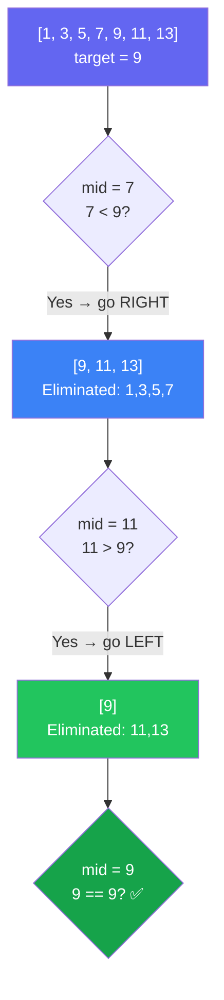
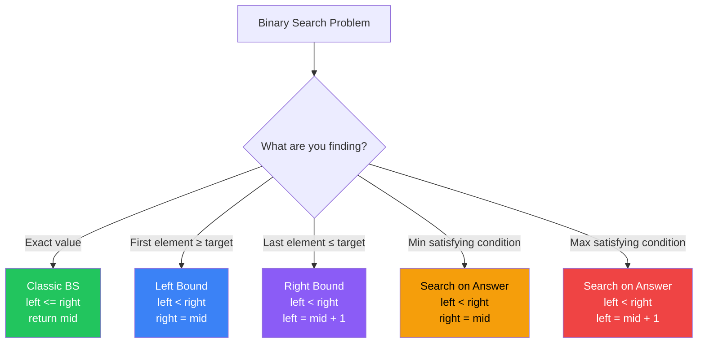
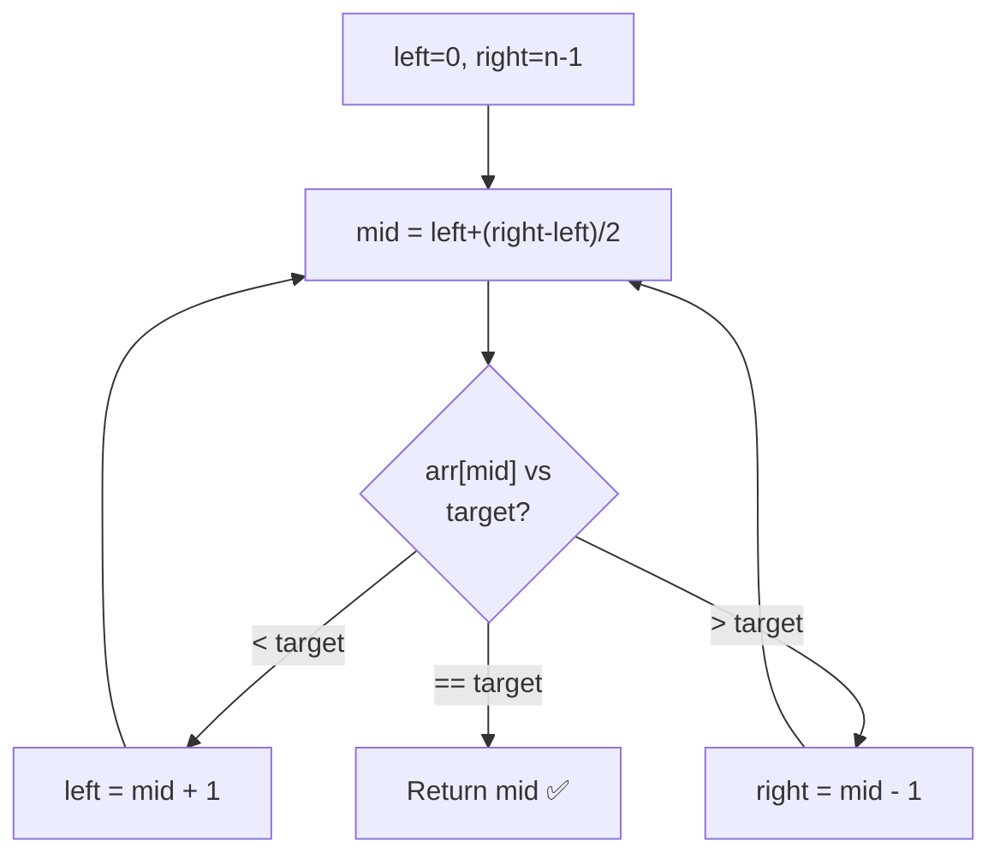
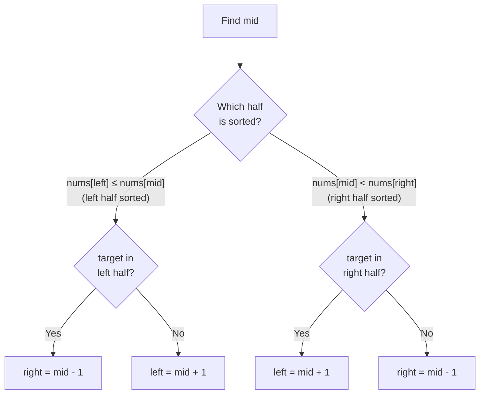
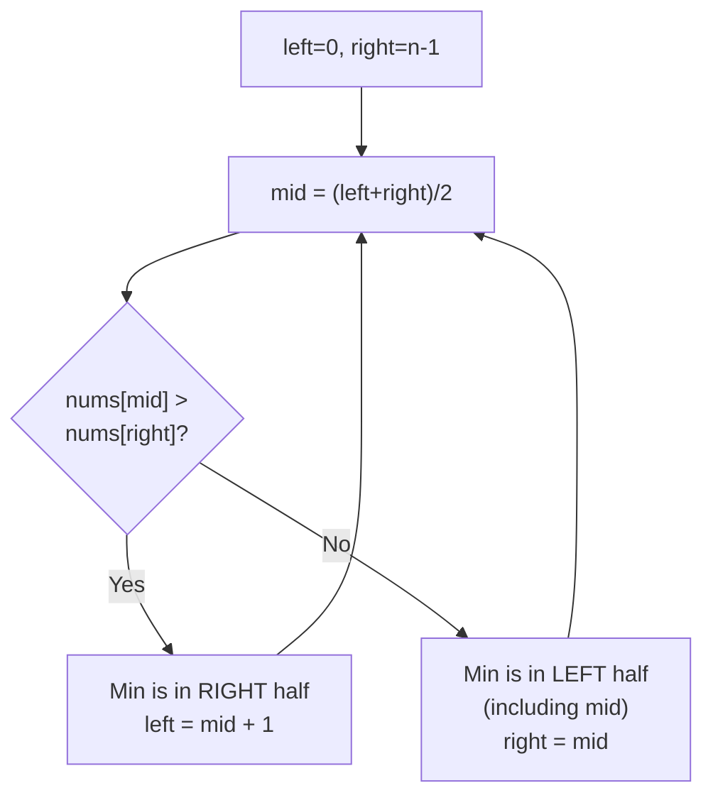
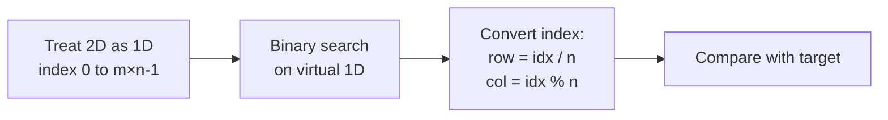
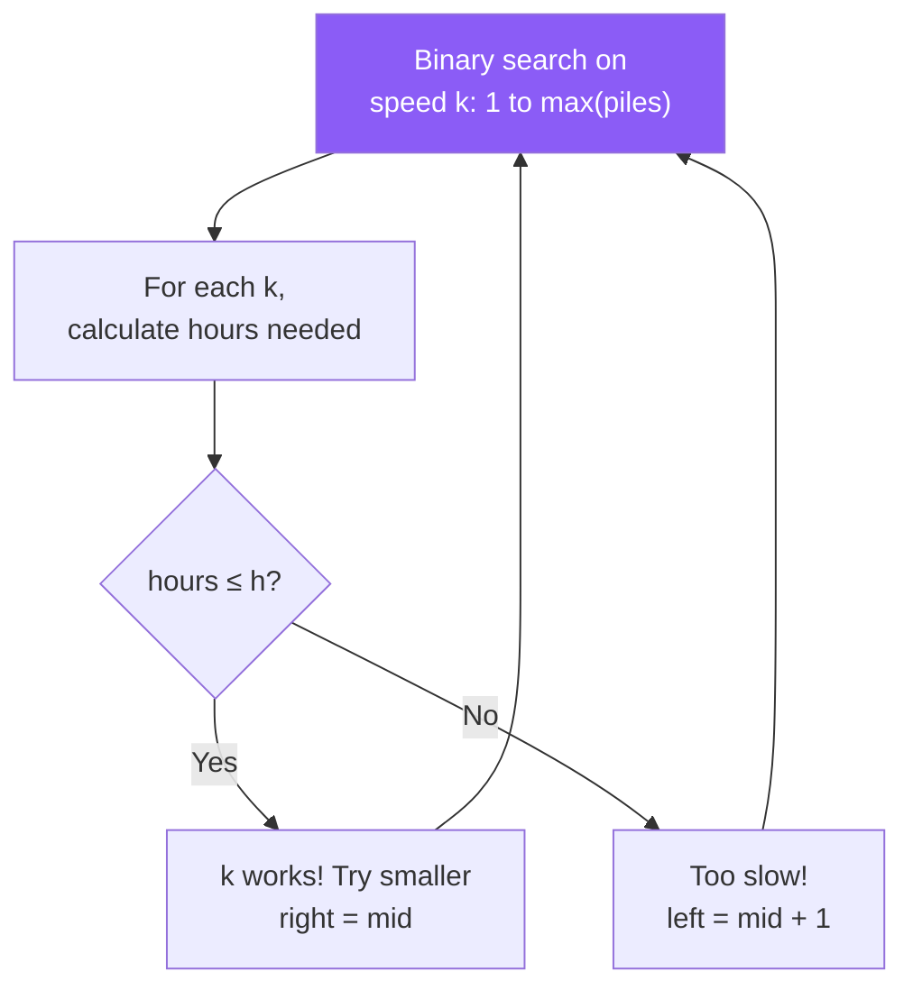
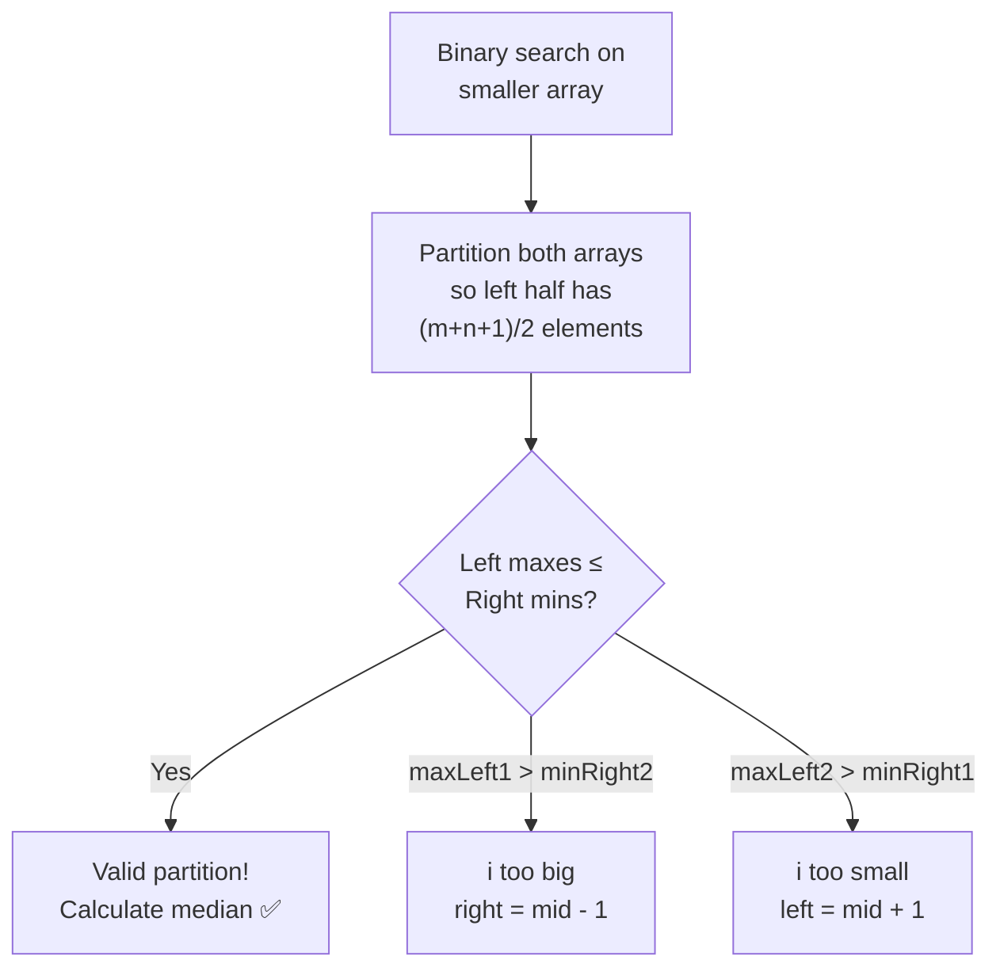

[🏠 Home](../../../README.md) | [⬅️ Sliding Window](../../system-design/components/overview.md) | [➡️ Linked Lists](../../system-design/components/overview.md)

# 🔍 Binary Search Pattern

> O(log n) search by halving the search space

---

## 🎯 When to Use

| Clue | Apply Binary Search |
|------|---------------------|
| Sorted array | Classic BS |
| "Minimum/Maximum that satisfies X" | Search on answer |
| Rotated sorted array | Modified BS |
| "Find position to insert" | Lower/Upper bound |
| Monotonic function | Decision BS |

---

## 🧠 WHY Binary Search is Magical: O(log n) Explained

> **🎯 For Beginners:** Understanding WHY halving works makes you see optimization opportunities everywhere!

### The Core Insight: Eliminating Half the Problem

```
❌ Linear Search (O(n)):
   Array of 1,000,000 elements
   Worst case: 1,000,000 comparisons

✅ Binary Search (O(log n)):
   Array of 1,000,000 elements
   Worst case: 20 comparisons!   ← log₂(1,000,000) ≈ 20
```

### Mathematical Proof: Why O(log n)?

```
Starting with n elements:

Step 1: n/2 elements remain
Step 2: n/4 elements remain  
Step 3: n/8 elements remain
...
Step k: n/2^k elements remain

We stop when n/2^k = 1
Solving: 2^k = n
Therefore: k = log₂(n)

This is why Binary Search is O(log n)!
```

### The Power of Halving (Visualization)

```
Array size: 1,000,000 elements

Step 1:  1,000,000 → 500,000  (half eliminated)
Step 2:    500,000 → 250,000
Step 3:    250,000 → 125,000
Step 4:    125,000 →  62,500
Step 5:     62,500 →  31,250
...
Step 20:        2 →       1   ← FOUND!

Only 20 steps to search 1 MILLION items!
```

### When Binary Search APPLIES (Key Insight)

```
🔑 The Secret: You need a DECISION BOUNDARY

✅ Works: "Is this number >= target?"
   [1, 3, 5, 7, 9, 11]
   FALSE FALSE FALSE TRUE TRUE TRUE ← Clear boundary!
                     ↑
                 Answer here

❌ Fails: "Is this the peak?" (in unsorted)
   [3, 7, 2, 9, 1, 5]
   No predictable pattern → Can't binary search
```

### Thought Process Template

```
🧠 "Can I use Binary Search here?"

1. Is there a sorted/monotonic property?
   → Yes: Binary Search candidate

2. Can I define a decision boundary?
   → "All elements < X are FALSE, all >= X are TRUE"
   → Yes: Binary Search works!

3. What am I searching FOR?
   → Exact value: Classic BS
   → First TRUE: Left boundary
   → Last TRUE: Right boundary
   → Minimum satisfying condition: Search on answer
```

---

## 📊 Search Space Elimination — Visual



> Each step eliminates **half** the remaining elements → O(log n)

### 🧭 Which Binary Search Template?



---

## 🔧 Templates

### 1. Classic Binary Search

```java
public int binarySearch(int[] nums, int target) {
    int left = 0, right = nums.length - 1;
    
    while (left <= right) {
        int mid = left + (right - left) / 2;  // Avoid overflow
        
        if (nums[mid] == target) {
            return mid;
        } else if (nums[mid] < target) {
            left = mid + 1;
        } else {
            right = mid - 1;
        }
    }
    return -1;  // Not found
}
```

**Visualization**:
```
nums = [1, 3, 5, 7, 9, 11, 13], target = 7

Step 1: left=0, right=6, mid=3
        nums[3]=7 == target ✅
        Return 3
```

---

### 2. Left Bound (First Occurrence)

```java
// Find first index where nums[i] >= target
public int leftBound(int[] nums, int target) {
    int left = 0, right = nums.length;  // Note: right = length
    
    while (left < right) {
        int mid = left + (right - left) / 2;
        
        if (nums[mid] < target) {
            left = mid + 1;
        } else {
            right = mid;  // Don't exclude mid
        }
    }
    return left;  // Insertion point
}
```

---

### 3. Right Bound (Last Occurrence)

```java
// Find last index where nums[i] <= target
public int rightBound(int[] nums, int target) {
    int left = 0, right = nums.length;
    
    while (left < right) {
        int mid = left + (right - left) / 2;
        
        if (nums[mid] <= target) {
            left = mid + 1;
        } else {
            right = mid;
        }
    }
    return left - 1;  // Last valid position
}
```

---

### 4. Binary Search on Answer

When you need to find min/max value that satisfies condition.

```java
// Find minimum capacity to ship within D days
public int minCapacity(int[] weights, int days) {
    int left = max(weights);  // Min possible
    int right = sum(weights);  // Max possible
    
    while (left < right) {
        int mid = left + (right - left) / 2;
        
        if (canShip(weights, days, mid)) {
            right = mid;  // Try smaller
        } else {
            left = mid + 1;  // Need larger
        }
    }
    return left;
}

private boolean canShip(int[] weights, int days, int capacity) {
    int currentLoad = 0;
    int daysNeeded = 1;
    
    for (int w : weights) {
        if (currentLoad + w > capacity) {
            daysNeeded++;
            currentLoad = 0;
        }
        currentLoad += w;
    }
    return daysNeeded <= days;
}
```

---

## 💻 Core Problems

### Problem 1: Search in Rotated Sorted Array

```java
// [4,5,6,7,0,1,2], target=0 → return 4
public int search(int[] nums, int target) {
    int left = 0, right = nums.length - 1;
    
    while (left <= right) {
        int mid = left + (right - left) / 2;
        
        if (nums[mid] == target) return mid;
        
        // Left half is sorted
        if (nums[left] <= nums[mid]) {
            if (nums[left] <= target && target < nums[mid]) {
                right = mid - 1;
            } else {
                left = mid + 1;
            }
        }
        // Right half is sorted
        else {
            if (nums[mid] < target && target <= nums[right]) {
                left = mid + 1;
            } else {
                right = mid - 1;
            }
        }
    }
    return -1;
}
```

**Visualization**:
```
nums = [4, 5, 6, 7, 0, 1, 2], target = 0

Step 1: left=0, right=6, mid=3 → nums[3]=7 ≠ 0
        Left half [4,5,6,7] sorted (nums[0]=4 ≤ nums[3]=7)
        target=0 NOT in [4,7) → search right: left=4

        [4, 5, 6, 7, 0, 1, 2]
                     L     R

Step 2: left=4, right=6, mid=5 → nums[5]=1 ≠ 0
        Left half [0,1] sorted (nums[4]=0 ≤ nums[5]=1)
        target=0 IS in [0,1) → search left: right=4

        [4, 5, 6, 7, 0, 1, 2]
                     LR

Step 3: left=4, right=4, mid=4 → nums[4]=0 == target → return 4 ✅
```

**Key Insight**: One half is always sorted — check if target is in that half.

**Complexity**: Time O(log n) — halving search space each step. Space O(1).

---

### Problem 2: Find Minimum in Rotated Sorted Array

```java
public int findMin(int[] nums) {
    int left = 0, right = nums.length - 1;
    
    while (left < right) {
        int mid = left + (right - left) / 2;
        
        if (nums[mid] > nums[right]) {
            // Min is in right half
            left = mid + 1;
        } else {
            // Min is in left half (including mid)
            right = mid;
        }
    }
    return nums[left];
}
```

**Visualization**:
```
nums = [3, 4, 5, 1, 2]

Step 1: left=0, right=4, mid=2 → nums[2]=5 > nums[4]=2
        Min is in RIGHT half → left=3
        [3, 4, 5, 1, 2]
                  L  R

Step 2: left=3, right=4, mid=3 → nums[3]=1 ≤ nums[4]=2
        Min is in LEFT half (including mid) → right=3
        [3, 4, 5, 1, 2]
                  LR

Step 3: left=3 == right=3 → return nums[3]=1 ✅

💡 KEY: Compare mid with RIGHT (not left)!
   If nums[mid] > nums[right] → rotation pivot is to the right
   Otherwise → min is at mid or to the left
```

**Complexity**: Time O(log n). Space O(1).

---

### Problem 3: Search a 2D Matrix

```java
// Treat 2D matrix as 1D sorted array
public boolean searchMatrix(int[][] matrix, int target) {
    int m = matrix.length, n = matrix[0].length;
    int left = 0, right = m * n - 1;
    
    while (left <= right) {
        int mid = left + (right - left) / 2;
        int row = mid / n;
        int col = mid % n;
        int val = matrix[row][col];
        
        if (val == target) return true;
        if (val < target) left = mid + 1;
        else right = mid - 1;
    }
    return false;
}
```

**Visualization**:
```
matrix = [[1,  3,  5,  7],
          [10, 11, 16, 20],
          [23, 30, 34, 60]]    target = 16

Treat as 1D: [1, 3, 5, 7, 10, 11, 16, 20, 23, 30, 34, 60]
              0  1  2  3   4   5   6   7   8   9  10  11

Index→2D: row = mid / n, col = mid % n  (n=4 columns)

Step 1: left=0, right=11, mid=5 → row=5/4=1, col=5%4=1
        matrix[1][1]=11 < 16 → left=6

Step 2: left=6, right=11, mid=8 → row=8/4=2, col=8%4=0
        matrix[2][0]=23 > 16 → right=7

Step 3: left=6, right=7, mid=6 → row=6/4=1, col=6%4=2
        matrix[1][2]=16 == target → return true ✅
```

**Complexity**: Time O(log(m×n)). Space O(1).

---

### Problem 4: Koko Eating Bananas

```java
// Minimum eating speed to finish in h hours
public int minEatingSpeed(int[] piles, int h) {
    int left = 1;
    int right = Arrays.stream(piles).max().getAsInt();
    
    while (left < right) {
        int mid = left + (right - left) / 2;
        
        if (canFinish(piles, h, mid)) {
            right = mid;
        } else {
            left = mid + 1;
        }
    }
    return left;
}

private boolean canFinish(int[] piles, int h, int speed) {
    int hours = 0;
    for (int pile : piles) {
        hours += (pile + speed - 1) / speed;  // Ceiling division
    }
    return hours <= h;
}
```

**Visualization**:
```
piles = [3, 6, 7, 11], h = 8

Search space: speed ∈ [1, 11]

Step 1: left=1, right=11, mid=6
        Hours: ⌈3/6⌉+⌈6/6⌉+⌈7/6⌉+⌈11/6⌉ = 1+1+2+2 = 6 ≤ 8 ✅
        Can finish → try slower: right=6

Step 2: left=1, right=6, mid=3
        Hours: ⌈3/3⌉+⌈6/3⌉+⌈7/3⌉+⌈11/3⌉ = 1+2+3+4 = 10 > 8 ❌
        Too slow → try faster: left=4

Step 3: left=4, right=6, mid=5
        Hours: ⌈3/5⌉+⌈6/5⌉+⌈7/5⌉+⌈11/5⌉ = 1+2+2+3 = 8 ≤ 8 ✅
        Can finish → try slower: right=5

Step 4: left=4, right=5, mid=4
        Hours: ⌈3/4⌉+⌈6/4⌉+⌈7/4⌉+⌈11/4⌉ = 1+2+2+3 = 8 ≤ 8 ✅
        Can finish → right=4

Step 5: left=4 == right=4 → return 4 ✅

💡 "Search on Answer" pattern: Binary search on the ANSWER space,
   not the input array. Feasibility check replaces comparison.
```

**Complexity**: Time O(n log k) where n=piles, k=max pile. Space O(1).

---

## 🧠 Visual Guide

### When to Use Which Template

```
┌────────────────────────────────────────────────────┐
│                   BINARY SEARCH                     │
├────────────────────────────────────────────────────┤
│  Find exact value?                                  │
│  → Classic: left <= right, return mid               │
│                                                     │
│  Find insertion point / first >= target?            │
│  → Left bound: left < right, right = mid            │
│                                                     │
│  Find min value that satisfies condition?           │
│  → Search on answer: left < right, right = mid      │
│                                                     │
│  Find max value that satisfies condition?           │
│  → Search on answer: left < right, left = mid + 1   │
└────────────────────────────────────────────────────┘
```

---

## 📊 Complexity Summary

| Problem | Time | Space |
|---------|------|-------|
| Classic BS | O(log n) | O(1) |
| Rotated Array | O(log n) | O(1) |
| Find Min | O(log n) | O(1) |
| Search 2D | O(log(m*n)) | O(1) |
| Search on Answer | O(n log k) | O(1) |

---

## ⚠️ Common Mistakes

1. **Integer overflow**: Use `left + (right - left) / 2` not `(left + right) / 2`
2. **Infinite loop**: Check `left < right` vs `left <= right` carefully
3. **Off-by-one**: Know when to use `right = mid` vs `right = mid - 1`

---

## 📝 Practice Problems — Detailed Solutions

| # | Problem | Difficulty | Link | Key Insight |
|---|---------|------------|------|-------------|
| 1 | Binary Search | 🟢 Easy | [LeetCode](https://leetcode.com/problems/binary-search/) | Classic |
| 2 | Search in Rotated Array | 🟡 Medium | [LeetCode](https://leetcode.com/problems/search-in-rotated-sorted-array/) | One half sorted |
| 3 | Find Minimum in Rotated | 🟡 Medium | [LeetCode](https://leetcode.com/problems/find-minimum-in-rotated-sorted-array/) | Compare with right |
| 4 | Search 2D Matrix | 🟡 Medium | [LeetCode](https://leetcode.com/problems/search-a-2d-matrix/) | 2D → 1D |
| 5 | Koko Eating Bananas | 🟡 Medium | [LeetCode](https://leetcode.com/problems/koko-eating-bananas/) | Search on answer |
| 6 | Median of Two Sorted | 🔴 Hard | [LeetCode](https://leetcode.com/problems/median-of-two-sorted-arrays/) | Binary partition |

---

### Problem 1: Binary Search 🟢

> **Given** a sorted array of integers and a target, return its index or `-1`.

#### 🧠 Approach Diagram



#### ✅ Optimal — O(log n) Time, O(1) Space

```java
public int search(int[] nums, int target) {
    int left = 0, right = nums.length - 1;
    
    while (left <= right) {
        int mid = left + (right - left) / 2;  // avoid overflow!
        
        if (nums[mid] == target) return mid;
        else if (nums[mid] < target) left = mid + 1;
        else right = mid - 1;
    }
    return -1;
}
```

```
Example: nums = [-1, 0, 3, 5, 9, 12], target = 9

Step 1: left=0, right=5, mid=2 → nums[2]=3 < 9 → left=3
Step 2: left=3, right=5, mid=4 → nums[4]=9 == 9 → return 4 ✅

💡 OVERFLOW PREVENTION:
   BAD:  mid = (left + right) / 2   → can overflow if left+right > INT_MAX
   GOOD: mid = left + (right - left) / 2  → always safe
```

---

### Problem 2: Search in Rotated Sorted Array 🟡

> **Given** a rotated sorted array (no duplicates), find the target.

#### 🧠 Approach Diagram



#### ✅ Optimal — O(log n) Time, O(1) Space

```java
public int search(int[] nums, int target) {
    int left = 0, right = nums.length - 1;
    
    while (left <= right) {
        int mid = left + (right - left) / 2;
        
        if (nums[mid] == target) return mid;
        
        // Left half is sorted
        if (nums[left] <= nums[mid]) {
            if (target >= nums[left] && target < nums[mid])
                right = mid - 1;  // target in left sorted half
            else
                left = mid + 1;   // target in right half
        }
        // Right half is sorted
        else {
            if (target > nums[mid] && target <= nums[right])
                left = mid + 1;   // target in right sorted half
            else
                right = mid - 1;  // target in left half
        }
    }
    return -1;
}
```

```
Example: nums = [4, 5, 6, 7, 0, 1, 2], target = 0

Step 1: left=0, right=6, mid=3 → nums[3]=7
        nums[0]=4 ≤ 7 → left half [4,5,6,7] sorted
        target=0 NOT in [4,7] → left=4

Step 2: left=4, right=6, mid=5 → nums[5]=1
        nums[4]=0 ≤ 1 → left half [0,1] sorted
        target=0 in [0,1) → right=4

Step 3: left=4, right=4, mid=4 → nums[4]=0 == 0 → return 4 ✅

💡 KEY INSIGHT: In a rotated array, at least ONE half is always sorted.
   Determine which half is sorted, then check if target is in that range.
```

---

### Problem 3: Find Minimum in Rotated Sorted Array 🟡

> **Given** a rotated sorted array, find the minimum element.

#### 🧠 Approach Diagram



#### ✅ Optimal — O(log n) Time, O(1) Space

```java
public int findMin(int[] nums) {
    int left = 0, right = nums.length - 1;
    
    while (left < right) {  // Note: < not <=
        int mid = left + (right - left) / 2;
        
        if (nums[mid] > nums[right]) {
            left = mid + 1;    // min is to the right of mid
        } else {
            right = mid;       // mid might be the min
        }
    }
    return nums[left];  // left == right, pointing at min
}
```

```
Example: nums = [3, 4, 5, 1, 2]

Step 1: left=0, right=4, mid=2 → nums[2]=5 > nums[4]=2
        Min is RIGHT → left=3

Step 2: left=3, right=4, mid=3 → nums[3]=1 ≤ nums[4]=2
        Min could be mid → right=3

left==right==3 → return nums[3] = 1 ✅

💡 WHY compare with RIGHT (not left)?
   If nums[mid] > nums[right] → rotation point is to the right
   If nums[mid] ≤ nums[right] → this half is sorted, min is at or before mid
   
   Comparing with LEFT doesn't work because left could equal mid!
```

---

### Problem 4: Search a 2D Matrix 🟡

> **Given** an m×n matrix where each row is sorted and the first element of each row is greater than the last element of the previous row, search for a target.

#### 🧠 Approach Diagram



#### ✅ Optimal — O(log(m·n)) Time, O(1) Space

```java
public boolean searchMatrix(int[][] matrix, int target) {
    int m = matrix.length, n = matrix[0].length;
    int left = 0, right = m * n - 1;
    
    while (left <= right) {
        int mid = left + (right - left) / 2;
        int val = matrix[mid / n][mid % n];  // 1D → 2D conversion!
        
        if (val == target) return true;
        else if (val < target) left = mid + 1;
        else right = mid - 1;
    }
    return false;
}
```

```
Example: matrix = [[1,3,5,7],[10,11,16,20],[23,30,34,60]], target = 3
         m=3, n=4 → virtual array of 12 elements

Step 1: left=0, right=11, mid=5
        row=5/4=1, col=5%4=1 → matrix[1][1]=11 > 3 → right=4

Step 2: left=0, right=4, mid=2
        row=2/4=0, col=2%4=2 → matrix[0][2]=5 > 3 → right=1

Step 3: left=0, right=1, mid=0
        row=0/4=0, col=0%4=0 → matrix[0][0]=1 < 3 → left=1

Step 4: left=1, right=1, mid=1
        row=1/4=0, col=1%4=1 → matrix[0][1]=3 == 3 → return true ✅

💡 THE TRICK: row = index / numCols, col = index % numCols
   This converts any 1D index back to 2D coordinates!
```

---

### Problem 5: Koko Eating Bananas 🟡

> **Given** piles of bananas and `h` hours, find the minimum eating speed `k` to finish all bananas.

#### 🧠 Approach Diagram



#### ✅ Optimal: Binary Search on Answer — O(n·log(max)) Time

```java
public int minEatingSpeed(int[] piles, int h) {
    int left = 1, right = Arrays.stream(piles).max().getAsInt();
    
    while (left < right) {
        int mid = left + (right - left) / 2;
        
        if (canFinish(piles, mid, h)) {
            right = mid;      // speed works, try slower
        } else {
            left = mid + 1;   // too slow, need faster
        }
    }
    return left;
}

private boolean canFinish(int[] piles, int speed, int h) {
    int hours = 0;
    for (int pile : piles) {
        hours += (pile + speed - 1) / speed;  // ceiling division
    }
    return hours <= h;
}
```

```
Example: piles = [3, 6, 7, 11], h = 8

Binary search on speed: left=1, right=11

mid=6: hours = ceil(3/6)+ceil(6/6)+ceil(7/6)+ceil(11/6) = 1+1+2+2 = 6 ≤ 8 ✅
       right=6

mid=3: hours = ceil(3/3)+ceil(6/3)+ceil(7/3)+ceil(11/3) = 1+2+3+4 = 10 > 8 ❌
       left=4

mid=5: hours = 1+2+2+3 = 8 ≤ 8 ✅ → right=5

mid=4: hours = 1+2+2+3 = 8 ≤ 8 ✅ → right=4

left==right==4 → return 4 ✅

💡 "BINARY SEARCH ON ANSWER" PATTERN:
   Instead of searching IN an array, search the ANSWER SPACE.
   Answer space: [1, max(piles)] — monotonic!
   If speed k works, all speeds > k also work.
```

---

### Problem 6: Median of Two Sorted Arrays 🔴

> **Given** two sorted arrays, find the median of the merged array in O(log(m+n)) time.

#### 🧠 Approach Diagram



#### ✅ Optimal — O(log(min(m,n))) Time, O(1) Space

```java
public double findMedianSortedArrays(int[] nums1, int[] nums2) {
    // Always binary search on the SMALLER array
    if (nums1.length > nums2.length) 
        return findMedianSortedArrays(nums2, nums1);
    
    int m = nums1.length, n = nums2.length;
    int left = 0, right = m;
    
    while (left <= right) {
        int i = left + (right - left) / 2;  // partition in nums1
        int j = (m + n + 1) / 2 - i;        // partition in nums2
        
        int maxLeft1 = (i == 0) ? Integer.MIN_VALUE : nums1[i - 1];
        int minRight1 = (i == m) ? Integer.MAX_VALUE : nums1[i];
        int maxLeft2 = (j == 0) ? Integer.MIN_VALUE : nums2[j - 1];
        int minRight2 = (j == n) ? Integer.MAX_VALUE : nums2[j];
        
        if (maxLeft1 <= minRight2 && maxLeft2 <= minRight1) {
            // Valid partition found!
            if ((m + n) % 2 == 0) {
                return (Math.max(maxLeft1, maxLeft2) + 
                        Math.min(minRight1, minRight2)) / 2.0;
            } else {
                return Math.max(maxLeft1, maxLeft2);
            }
        } else if (maxLeft1 > minRight2) {
            right = i - 1;  // too many from nums1 on left
        } else {
            left = i + 1;   // too few from nums1 on left
        }
    }
    return 0;
}
```

```
Example: nums1 = [1, 3], nums2 = [2]

m=2, n=1, total=3 (odd), need (3+1)/2 = 2 elements on left

i=1, j=2-1=1:
  maxLeft1=nums1[0]=1,  minRight1=nums1[1]=3
  maxLeft2=nums2[0]=2,  minRight2=∞
  
  1 ≤ ∞ ✅ and 2 ≤ 3 ✅ → VALID!
  
  Odd total → median = max(1, 2) = 2.0 ✅

Partition visualization:
  nums1: [1 | 3]      left: {1, 2}
  nums2: [2 | ]        right: {3}
  
  All left ≤ all right: {1,2} ≤ {3} ✅

💡 KEY INSIGHT: We're partitioning BOTH arrays simultaneously.
   If we take i elements from nums1, we need (total/2 - i) from nums2.
   Valid when: maxLeft1 ≤ minRight2 AND maxLeft2 ≤ minRight1
```

---

## 📊 Complexity Comparison

| # | Problem | Time | Space | Pattern |
|---|---------|------|-------|---------|
| 1 | Binary Search | O(log n) | O(1) | Classic |
| 2 | Search in Rotated | O(log n) | O(1) | Modified BS |
| 3 | Find Min in Rotated | O(log n) | O(1) | Modified BS |
| 4 | Search 2D Matrix | O(log(m·n)) | O(1) | Index mapping |
| 5 | Koko Eating Bananas | O(n·log(max)) | O(1) | BS on answer |
| 6 | Median of Two Sorted | O(log(min(m,n))) | O(1) | Binary partition |

---

*Next: [Linked Lists →](../../system-design/components/overview.md)*
