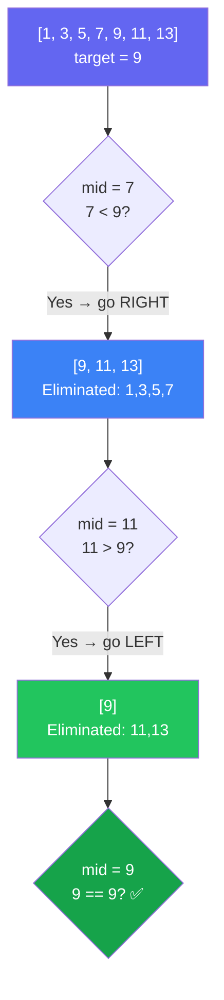
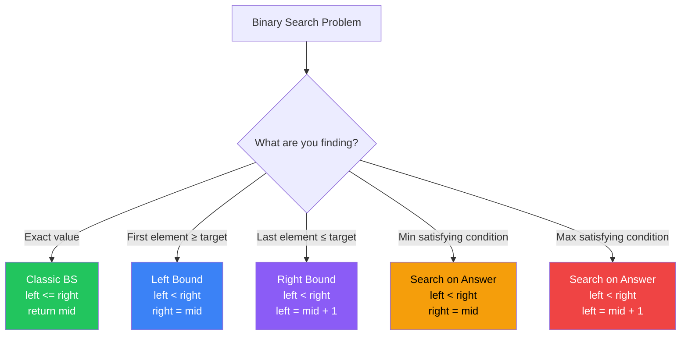

[🏠 Home](../../README.md) | [⬅️ Sliding Window](../04-sliding-window/00-overview.md) | [➡️ Linked Lists](../06-linked-lists/00-overview.md)

# 🔍 Binary Search Pattern

> O(log n) search by halving the search space

---

## 🎯 When to Use

| Clue | Apply Binary Search |
|------|---------------------|
| Sorted array | Classic BS |
| "Minimum/Maximum that satisfies X" | Search on answer |
| Rotated sorted array | Modified BS |
| "Find position to insert" | Lower/Upper bound |
| Monotonic function | Decision BS |

---

## 🧠 WHY Binary Search is Magical: O(log n) Explained

> **🎯 For Beginners:** Understanding WHY halving works makes you see optimization opportunities everywhere!

### The Core Insight: Eliminating Half the Problem

```
❌ Linear Search (O(n)):
   Array of 1,000,000 elements
   Worst case: 1,000,000 comparisons

✅ Binary Search (O(log n)):
   Array of 1,000,000 elements
   Worst case: 20 comparisons!   ← log₂(1,000,000) ≈ 20
```

### Mathematical Proof: Why O(log n)?

```
Starting with n elements:

Step 1: n/2 elements remain
Step 2: n/4 elements remain  
Step 3: n/8 elements remain
...
Step k: n/2^k elements remain

We stop when n/2^k = 1
Solving: 2^k = n
Therefore: k = log₂(n)

This is why Binary Search is O(log n)!
```

### The Power of Halving (Visualization)

```
Array size: 1,000,000 elements

Step 1:  1,000,000 → 500,000  (half eliminated)
Step 2:    500,000 → 250,000
Step 3:    250,000 → 125,000
Step 4:    125,000 →  62,500
Step 5:     62,500 →  31,250
...
Step 20:        2 →       1   ← FOUND!

Only 20 steps to search 1 MILLION items!
```

### When Binary Search APPLIES (Key Insight)

```
🔑 The Secret: You need a DECISION BOUNDARY

✅ Works: "Is this number >= target?"
   [1, 3, 5, 7, 9, 11]
   FALSE FALSE FALSE TRUE TRUE TRUE ← Clear boundary!
                     ↑
                 Answer here

❌ Fails: "Is this the peak?" (in unsorted)
   [3, 7, 2, 9, 1, 5]
   No predictable pattern → Can't binary search
```

### Thought Process Template

```
🧠 "Can I use Binary Search here?"

1. Is there a sorted/monotonic property?
   → Yes: Binary Search candidate

2. Can I define a decision boundary?
   → "All elements < X are FALSE, all >= X are TRUE"
   → Yes: Binary Search works!

3. What am I searching FOR?
   → Exact value: Classic BS
   → First TRUE: Left boundary
   → Last TRUE: Right boundary
   → Minimum satisfying condition: Search on answer
```

---

## 📊 Search Space Elimination — Visual



> Each step eliminates **half** the remaining elements → O(log n)

### 🧭 Which Binary Search Template?



---

## 🔧 Templates

### 1. Classic Binary Search

```java
public int binarySearch(int[] nums, int target) {
    int left = 0, right = nums.length - 1;
    
    while (left <= right) {
        int mid = left + (right - left) / 2;  // Avoid overflow
        
        if (nums[mid] == target) {
            return mid;
        } else if (nums[mid] < target) {
            left = mid + 1;
        } else {
            right = mid - 1;
        }
    }
    return -1;  // Not found
}
```

**Visualization**:
```
nums = [1, 3, 5, 7, 9, 11, 13], target = 7

Step 1: left=0, right=6, mid=3
        nums[3]=7 == target ✅
        Return 3
```

---

### 2. Left Bound (First Occurrence)

```java
// Find first index where nums[i] >= target
public int leftBound(int[] nums, int target) {
    int left = 0, right = nums.length;  // Note: right = length
    
    while (left < right) {
        int mid = left + (right - left) / 2;
        
        if (nums[mid] < target) {
            left = mid + 1;
        } else {
            right = mid;  // Don't exclude mid
        }
    }
    return left;  // Insertion point
}
```

---

### 3. Right Bound (Last Occurrence)

```java
// Find last index where nums[i] <= target
public int rightBound(int[] nums, int target) {
    int left = 0, right = nums.length;
    
    while (left < right) {
        int mid = left + (right - left) / 2;
        
        if (nums[mid] <= target) {
            left = mid + 1;
        } else {
            right = mid;
        }
    }
    return left - 1;  // Last valid position
}
```

---

### 4. Binary Search on Answer

When you need to find min/max value that satisfies condition.

```java
// Find minimum capacity to ship within D days
public int minCapacity(int[] weights, int days) {
    int left = max(weights);  // Min possible
    int right = sum(weights);  // Max possible
    
    while (left < right) {
        int mid = left + (right - left) / 2;
        
        if (canShip(weights, days, mid)) {
            right = mid;  // Try smaller
        } else {
            left = mid + 1;  // Need larger
        }
    }
    return left;
}

private boolean canShip(int[] weights, int days, int capacity) {
    int currentLoad = 0;
    int daysNeeded = 1;
    
    for (int w : weights) {
        if (currentLoad + w > capacity) {
            daysNeeded++;
            currentLoad = 0;
        }
        currentLoad += w;
    }
    return daysNeeded <= days;
}
```

---

## 💻 Core Problems

### Problem 1: Search in Rotated Sorted Array

```java
// [4,5,6,7,0,1,2], target=0 → return 4
public int search(int[] nums, int target) {
    int left = 0, right = nums.length - 1;
    
    while (left <= right) {
        int mid = left + (right - left) / 2;
        
        if (nums[mid] == target) return mid;
        
        // Left half is sorted
        if (nums[left] <= nums[mid]) {
            if (nums[left] <= target && target < nums[mid]) {
                right = mid - 1;
            } else {
                left = mid + 1;
            }
        }
        // Right half is sorted
        else {
            if (nums[mid] < target && target <= nums[right]) {
                left = mid + 1;
            } else {
                right = mid - 1;
            }
        }
    }
    return -1;
}
```

**Key Insight**: One half is always sorted.

---

### Problem 2: Find Minimum in Rotated Sorted Array

```java
public int findMin(int[] nums) {
    int left = 0, right = nums.length - 1;
    
    while (left < right) {
        int mid = left + (right - left) / 2;
        
        if (nums[mid] > nums[right]) {
            // Min is in right half
            left = mid + 1;
        } else {
            // Min is in left half (including mid)
            right = mid;
        }
    }
    return nums[left];
}
```

---

### Problem 3: Search a 2D Matrix

```java
// Treat 2D matrix as 1D sorted array
public boolean searchMatrix(int[][] matrix, int target) {
    int m = matrix.length, n = matrix[0].length;
    int left = 0, right = m * n - 1;
    
    while (left <= right) {
        int mid = left + (right - left) / 2;
        int row = mid / n;
        int col = mid % n;
        int val = matrix[row][col];
        
        if (val == target) return true;
        if (val < target) left = mid + 1;
        else right = mid - 1;
    }
    return false;
}
```

---

### Problem 4: Koko Eating Bananas

```java
// Minimum eating speed to finish in h hours
public int minEatingSpeed(int[] piles, int h) {
    int left = 1;
    int right = Arrays.stream(piles).max().getAsInt();
    
    while (left < right) {
        int mid = left + (right - left) / 2;
        
        if (canFinish(piles, h, mid)) {
            right = mid;
        } else {
            left = mid + 1;
        }
    }
    return left;
}

private boolean canFinish(int[] piles, int h, int speed) {
    int hours = 0;
    for (int pile : piles) {
        hours += (pile + speed - 1) / speed;  // Ceiling division
    }
    return hours <= h;
}
```

---

## 🧠 Visual Guide

### When to Use Which Template

```
┌────────────────────────────────────────────────────┐
│                   BINARY SEARCH                     │
├────────────────────────────────────────────────────┤
│  Find exact value?                                  │
│  → Classic: left <= right, return mid               │
│                                                     │
│  Find insertion point / first >= target?            │
│  → Left bound: left < right, right = mid            │
│                                                     │
│  Find min value that satisfies condition?           │
│  → Search on answer: left < right, right = mid      │
│                                                     │
│  Find max value that satisfies condition?           │
│  → Search on answer: left < right, left = mid + 1   │
└────────────────────────────────────────────────────┘
```

---

## 📊 Complexity Summary

| Problem | Time | Space |
|---------|------|-------|
| Classic BS | O(log n) | O(1) |
| Rotated Array | O(log n) | O(1) |
| Find Min | O(log n) | O(1) |
| Search 2D | O(log(m*n)) | O(1) |
| Search on Answer | O(n log k) | O(1) |

---

## ⚠️ Common Mistakes

1. **Integer overflow**: Use `left + (right - left) / 2` not `(left + right) / 2`
2. **Infinite loop**: Check `left < right` vs `left <= right` carefully
3. **Off-by-one**: Know when to use `right = mid` vs `right = mid - 1`

---

## 📝 Practice Problems

| # | Problem | Difficulty | Link | Key Insight |
|---|---------|------------|------|-------------|
| 1 | Binary Search | 🟢 Easy | [LeetCode](https://leetcode.com/problems/binary-search/) | Classic |
| 2 | Search in Rotated Array | 🟡 Medium | [LeetCode](https://leetcode.com/problems/search-in-rotated-sorted-array/) | One half sorted |
| 3 | Find Minimum in Rotated | 🟡 Medium | [LeetCode](https://leetcode.com/problems/find-minimum-in-rotated-sorted-array/) | Compare with right |
| 4 | Search 2D Matrix | 🟡 Medium | [LeetCode](https://leetcode.com/problems/search-a-2d-matrix/) | 2D → 1D |
| 5 | Koko Eating Bananas | 🟡 Medium | [LeetCode](https://leetcode.com/problems/koko-eating-bananas/) | Search on answer |
| 6 | Median of Two Sorted | 🔴 Hard | [LeetCode](https://leetcode.com/problems/median-of-two-sorted-arrays/) | Binary partition |

---

*Next: [Linked Lists →](../06-linked-lists/00-overview.md)*
