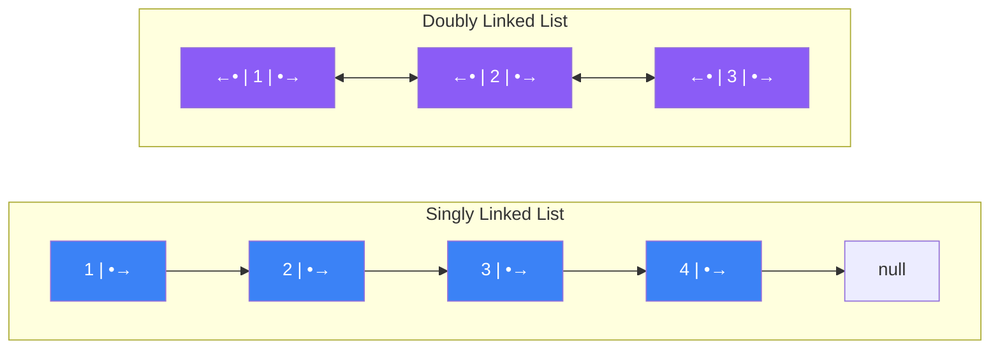
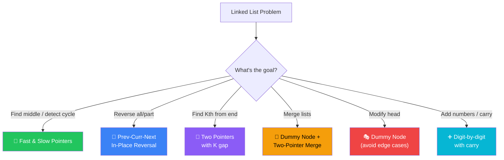
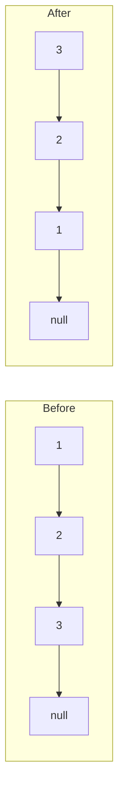
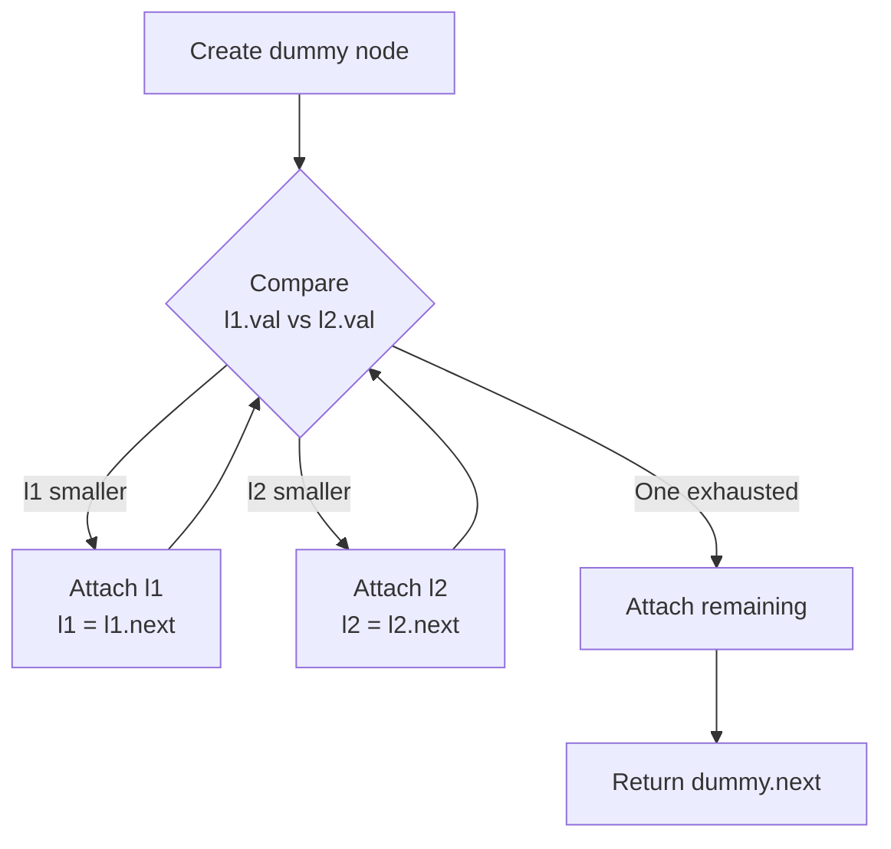
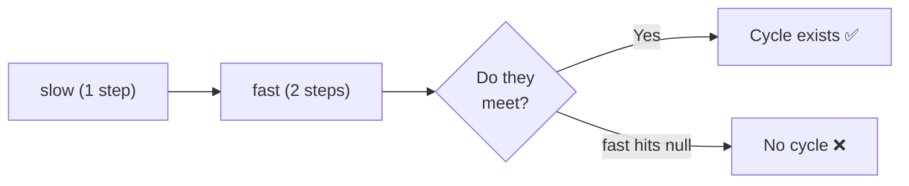
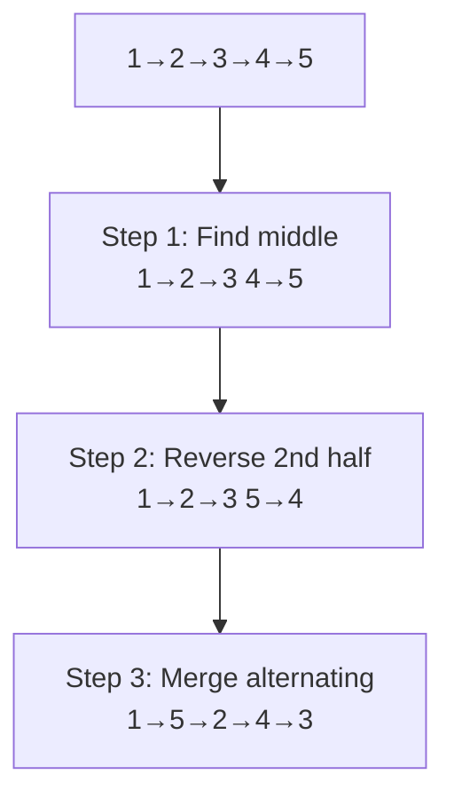
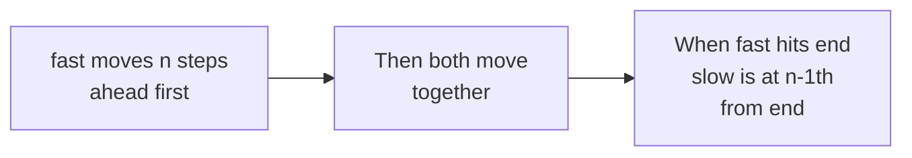
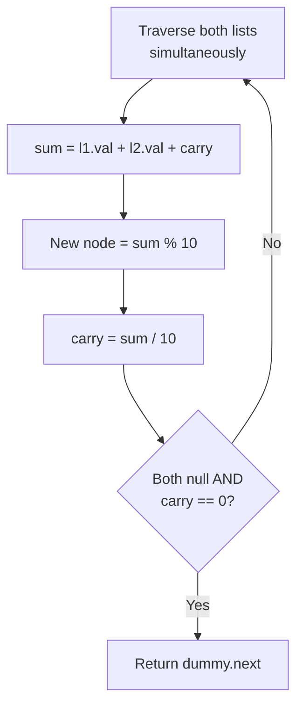
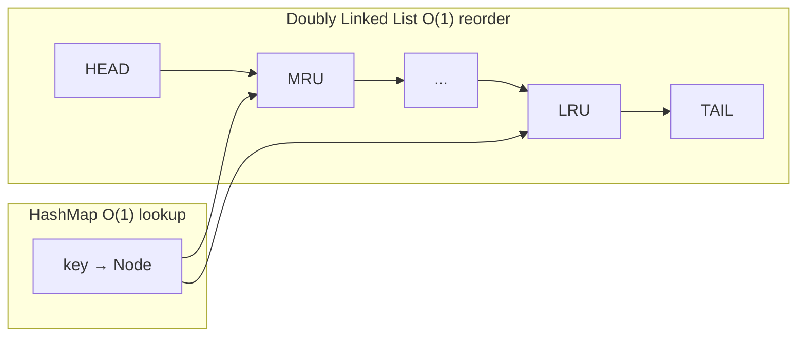
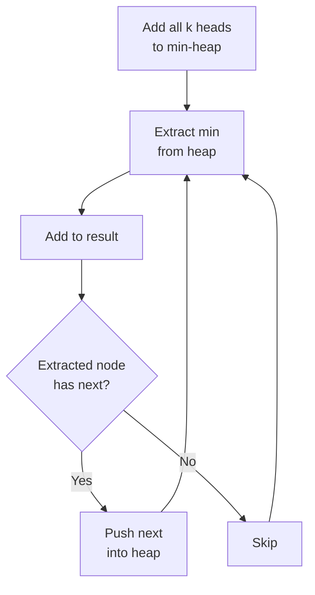

[🏠 Home](../../README.md) | [⬅️ Binary Search](../05-binary-search/00-overview.md) | [➡️ Stacks](../07-stacks-queues/00-overview.md)

# 🔗 Linked List Patterns

> Pointer manipulation and in-place operations

---

## 🎯 When to Use

| Clue | Pattern |
|------|---------|
| "Find middle of list" | Fast & Slow pointers |
| "Detect cycle" | Fast & Slow pointers |
| "Reverse a list" | In-place reversal |
| "Merge sorted lists" | Two-pointer merge |
| "Kth from end" | Two pointers with gap |

---

## 🧠 WHY Linked Lists Matter: Key Insights for Developers

> **🎯 For Beginners:** Linked Lists test your pointer manipulation skills - master these and interviews become easier!

### The Core Advantage: O(1) Insert/Delete

```
ArrayList (Array-backed):
  Insert at middle: [1, 2, 3, 4, 5]
                       ↓ Insert 9
                    [1, 2, 9, 3, 4, 5]
  
  Must shift ALL elements after insert point = O(n)

LinkedList:
  Insert at middle: 1 → 2 → 3 → 4 → 5
                         ↓ Insert 9
                    1 → 2 → 9 → 3 → 4 → 5
  
  Just rewire 2 pointers = O(1) *

  * Finding the position is O(n), but insertion itself is O(1)
```

### Why "Dummy Node" is Your Best Friend

```
❌ Without Dummy Node (Edge case nightmare):
   if (head == null) return newNode;
   if (position == 0) { newNode.next = head; return newNode; }
   // Different logic for head vs middle...

✅ With Dummy Node (Clean and uniform):
   ListNode dummy = new ListNode(0);
   dummy.next = head;
   // Now treat ALL positions the same way!
   return dummy.next;

The dummy eliminates special cases for head operations.
```

### Fast & Slow Pointer: The Magic Ratio

```
Why does Fast/Slow find the middle?

Fast moves 2x speed:
  When fast reaches end (traveled 2n)
  Slow has traveled n (half)
  
  slow: 1 step/iteration
  fast: 2 steps/iteration
  
  After k iterations:
    slow position: k
    fast position: 2k
    
  When 2k = n (end): k = n/2 (middle!)
```

### Common Mistake: Losing Your Reference

```
❌ WRONG - Lost the list!
   head = head.next;  // Original head is gone forever!

✅ CORRECT - Use a pointer
   ListNode curr = head;
   curr = curr.next;  // head still points to original
```

### Thought Process Template

```
🧠 "How do I solve this linked list problem?"

1. Do I need to modify the head?
   → Yes: Use a dummy node

2. Do I need to find middle/cycle?
   → Yes: Fast & Slow pointers

3. Do I need to reverse?
   → Remember: prev, curr, next pattern

4. Do I need Kth from end?
   → Two pointers with K gap

5. Am I modifying links?
   → ALWAYS save .next before changing it!
```

---

## 📊 Linked List — Visual Architecture



### 🧭 Linked List Problem Decision Tree



---

## 🔧 Core Techniques

### 1. Fast & Slow Pointers (Floyd's Algorithm)

**Use Cases**: Find middle, detect cycle, find cycle start

```java
// Find middle node
public ListNode findMiddle(ListNode head) {
    ListNode slow = head, fast = head;
    
    while (fast != null && fast.next != null) {
        slow = slow.next;
        fast = fast.next.next;
    }
    return slow;  // Middle (or second middle if even)
}
```

**Visualization**:
```
List: 1 → 2 → 3 → 4 → 5
      s   
      f

Step 1: slow=2, fast=3
Step 2: slow=3, fast=5
Step 3: fast.next = null → STOP

Middle = 3 ✅
```

---

### 2. Cycle Detection

```java
public boolean hasCycle(ListNode head) {
    ListNode slow = head, fast = head;
    
    while (fast != null && fast.next != null) {
        slow = slow.next;
        fast = fast.next.next;
        
        if (slow == fast) return true;  // Cycle detected
    }
    return false;
}

// Find where cycle starts
public ListNode detectCycle(ListNode head) {
    ListNode slow = head, fast = head;
    
    while (fast != null && fast.next != null) {
        slow = slow.next;
        fast = fast.next.next;
        
        if (slow == fast) {
            // Reset slow to head, move both at same speed
            slow = head;
            while (slow != fast) {
                slow = slow.next;
                fast = fast.next;
            }
            return slow;  // Cycle start
        }
    }
    return null;
}
```

---

### 3. In-Place Reversal

```java
public ListNode reverseList(ListNode head) {
    ListNode prev = null;
    ListNode curr = head;
    
    while (curr != null) {
        ListNode next = curr.next;  // Save next
        curr.next = prev;           // Reverse link
        prev = curr;                // Move prev
        curr = next;                // Move curr
    }
    return prev;
}
```

**Visualization**:
```
Original: 1 → 2 → 3 → null
          p   c

Step 1:   null ← 1   2 → 3 → null
                 p   c

Step 2:   null ← 1 ← 2   3 → null
                     p   c

Step 3:   null ← 1 ← 2 ← 3   null
                         p   c

Result:   3 → 2 → 1 → null
```

---

### 4. Reverse Between (Partial Reversal)

```java
// Reverse from position m to n
public ListNode reverseBetween(ListNode head, int m, int n) {
    ListNode dummy = new ListNode(0);
    dummy.next = head;
    ListNode prev = dummy;
    
    // Move to position before m
    for (int i = 0; i < m - 1; i++) {
        prev = prev.next;
    }
    
    // Reverse n - m + 1 nodes
    ListNode curr = prev.next;
    for (int i = 0; i < n - m; i++) {
        ListNode next = curr.next;
        curr.next = next.next;
        next.next = prev.next;
        prev.next = next;
    }
    
    return dummy.next;
}
```

**Visualization**:
```
List: 1 → 2 → 3 → 4 → 5, m=2, n=4

Before: dummy → 1 → [2 → 3 → 4] → 5
                prev  curr

Iteration 1: Move 3 to front of reversed section
  dummy → 1 → [3 → 2 → 4] → 5

Iteration 2: Move 4 to front of reversed section
  dummy → 1 → [4 → 3 → 2] → 5

Result: 1 → 4 → 3 → 2 → 5 ✅
```

**Complexity**: Time O(n). Space O(1).

---

## 💻 Core Problems

### Problem 1: Merge Two Sorted Lists

```java
public ListNode mergeTwoLists(ListNode l1, ListNode l2) {
    ListNode dummy = new ListNode(0);
    ListNode curr = dummy;
    
    while (l1 != null && l2 != null) {
        if (l1.val <= l2.val) {
            curr.next = l1;
            l1 = l1.next;
        } else {
            curr.next = l2;
            l2 = l2.next;
        }
        curr = curr.next;
    }
    
    curr.next = (l1 != null) ? l1 : l2;
    return dummy.next;
}
```

**Visualization**:
```
List: 1 → 2 → 3 → 4 → 5, merge l1=[1,2,4], l2=[1,3,4]

dummy → ?

Step 1: 1(l1) ≤ 1(l2) → attach l1   dummy → 1
Step 2: 2(l1) > 1(l2)  → attach l2   dummy → 1 → 1
Step 3: 2(l1) ≤ 3(l2)  → attach l1   dummy → 1 → 1 → 2
Step 4: 4(l1) > 3(l2)  → attach l2   dummy → 1 → 1 → 2 → 3
Step 5: 4(l1) ≤ 4(l2)  → attach l1   dummy → 1 → 1 → 2 → 3 → 4
Step 6: l1 exhausted → attach remaining l2(4)

Result: 1 → 1 → 2 → 3 → 4 → 4 ✅
```

**Complexity**: Time O(n + m). Space O(1).

---

### Problem 2: Remove Nth Node From End

```java
public ListNode removeNthFromEnd(ListNode head, int n) {
    ListNode dummy = new ListNode(0);
    dummy.next = head;
    ListNode slow = dummy, fast = dummy;
    
    // Move fast n+1 steps ahead
    for (int i = 0; i <= n; i++) {
        fast = fast.next;
    }
    
    // Move both until fast reaches end
    while (fast != null) {
        slow = slow.next;
        fast = fast.next;
    }
    
    // Skip the nth node
    slow.next = slow.next.next;
    return dummy.next;
}
```

**Visualization**:
```
List: 1 → 2 → 3 → 4 → 5, n=2 (remove 4)

dummy → 1 → 2 → 3 → 4 → 5 → null

Step 1: Move fast n+1=3 steps:
  fast                         ↓
  dummy → 1 → 2 → 3 → 4 → 5 → null
  slow ↑

Step 2: Move both until fast=null:
  slow → 1 → 2 → 3 → 4 → 5 → null ← fast
                  ↑slow

Step 3: Skip: slow.next = slow.next.next
  1 → 2 → 3 → 5 → null  (Node 4 removed ✅)

💡 The n+1 gap ensures slow stops ONE BEFORE the target.
```

**Complexity**: Time O(n) — single pass. Space O(1).

---

### Problem 3: Reorder List

```java
// 1→2→3→4→5 becomes 1→5→2→4→3
public void reorderList(ListNode head) {
    if (head == null || head.next == null) return;
    
    // Step 1: Find middle
    ListNode slow = head, fast = head;
    while (fast.next != null && fast.next.next != null) {
        slow = slow.next;
        fast = fast.next.next;
    }
    
    // Step 2: Reverse second half
    ListNode second = reverse(slow.next);
    slow.next = null;
    
    // Step 3: Merge alternating
    ListNode first = head;
    while (second != null) {
        ListNode temp1 = first.next;
        ListNode temp2 = second.next;
        first.next = second;
        second.next = temp1;
        first = temp1;
        second = temp2;
    }
}

private ListNode reverse(ListNode head) {
    ListNode prev = null;
    while (head != null) {
        ListNode next = head.next;
        head.next = prev;
        prev = head;
        head = next;
    }
    return prev;
}
```

**Visualization**:
```
List: 1 → 2 → 3 → 4 → 5

Step 1: Find middle (slow/fast)
  1 → 2 → 3 → 4 → 5
            s         f    → middle = 3

Step 2: Reverse second half (4 → 5 becomes 5 → 4)
  First half:  1 → 2 → 3
  Second half: 5 → 4

Step 3: Merge alternating
  1 → 5 → 2 → 4 → 3 ✅

  Take from first, then second, repeat:
    first=1  → attach second=5 → first.next=2
    first=2  → attach second=4 → first.next=3
    second=null → done
```

**Complexity**: Time O(n). Space O(1) — all in-place.

---

### Problem 4: Add Two Numbers

```java
// Lists represent numbers in reverse (2→4→3 = 342)
public ListNode addTwoNumbers(ListNode l1, ListNode l2) {
    ListNode dummy = new ListNode(0);
    ListNode curr = dummy;
    int carry = 0;
    
    while (l1 != null || l2 != null || carry > 0) {
        int sum = carry;
        if (l1 != null) {
            sum += l1.val;
            l1 = l1.next;
        }
        if (l2 != null) {
            sum += l2.val;
            l2 = l2.next;
        }
        
        carry = sum / 10;
        curr.next = new ListNode(sum % 10);
        curr = curr.next;
    }
    
    return dummy.next;
}
```

---

## 🧠 Common Patterns Summary

```
┌─────────────────────────────────────────────────────┐
│                 LINKED LIST PATTERNS                 │
├─────────────────────────────────────────────────────┤
│ 1. Dummy Node: Use when head might change           │
│    ListNode dummy = new ListNode(0);                │
│    dummy.next = head;                               │
│    return dummy.next;                               │
├─────────────────────────────────────────────────────┤
│ 2. Save Next: Before changing pointers              │
│    ListNode next = curr.next;                       │
│    curr.next = prev;                                │
├─────────────────────────────────────────────────────┤
│ 3. Two Pointers: Gap of k nodes                     │
│    Move fast k steps, then move both                │
├─────────────────────────────────────────────────────┤
│ 4. Fast/Slow: Half speed difference                 │
│    slow = slow.next;                                │
│    fast = fast.next.next;                           │
└─────────────────────────────────────────────────────┘
```

---

## 📊 Complexity Summary

| Problem | Time | Space |
|---------|------|-------|
| Reverse List | O(n) | O(1) |
| Find Middle | O(n) | O(1) |
| Detect Cycle | O(n) | O(1) |
| Merge Two | O(n+m) | O(1) |
| Remove Nth | O(n) | O(1) |

---

## 📝 Practice Problems — Detailed Solutions

| # | Problem | Difficulty | Link | Key Insight |
|---|---------|------------|------|-------------|
| 1 | Reverse Linked List | 🟢 Easy | [LeetCode](https://leetcode.com/problems/reverse-linked-list/) | Prev/Curr/Next |
| 2 | Merge Two Sorted | 🟢 Easy | [LeetCode](https://leetcode.com/problems/merge-two-sorted-lists/) | Dummy node |
| 3 | Linked List Cycle | 🟢 Easy | [LeetCode](https://leetcode.com/problems/linked-list-cycle/) | Fast/Slow |
| 4 | Reorder List | 🟡 Medium | [LeetCode](https://leetcode.com/problems/reorder-list/) | Find mid + reverse |
| 5 | Remove Nth From End | 🟡 Medium | [LeetCode](https://leetcode.com/problems/remove-nth-node-from-end-of-list/) | Gap pointers |
| 6 | Add Two Numbers | 🟡 Medium | [LeetCode](https://leetcode.com/problems/add-two-numbers/) | Carry handling |
| 7 | LRU Cache | 🟡 Medium | [LeetCode](https://leetcode.com/problems/lru-cache/) | Doubly linked + HashMap |
| 8 | Merge K Sorted | 🔴 Hard | [LeetCode](https://leetcode.com/problems/merge-k-sorted-lists/) | Heap + merge |

---

### Problem 1: Reverse Linked List 🟢

> **Given** the head of a singly linked list, reverse and return the new head.

#### 🧠 Approach Diagram



#### ✅ Optimal: Iterative — O(n) Time, O(1) Space

```java
public ListNode reverseList(ListNode head) {
    ListNode prev = null, curr = head;
    
    while (curr != null) {
        ListNode next = curr.next;  // save next
        curr.next = prev;           // reverse pointer
        prev = curr;                // advance prev
        curr = next;                // advance curr
    }
    return prev;
}
```

```
Example: 1 → 2 → 3 → null

Step 1: prev=null, curr=1
        save next=2, 1→null, prev=1, curr=2
        null ← 1  2 → 3 → null

Step 2: prev=1, curr=2
        save next=3, 2→1, prev=2, curr=3
        null ← 1 ← 2  3 → null

Step 3: prev=2, curr=3
        save next=null, 3→2, prev=3, curr=null
        null ← 1 ← 2 ← 3

Return prev = 3 → 2 → 1 → null ✅

💡 PATTERN: Always "save next" BEFORE changing pointers!
   Without saving, you lose the rest of the list.
```

---

### Problem 2: Merge Two Sorted Lists 🟢

> **Given** two sorted linked lists, merge them into one sorted list.

#### 🧠 Approach Diagram



#### ✅ Optimal — O(n+m) Time, O(1) Space

```java
public ListNode mergeTwoLists(ListNode l1, ListNode l2) {
    ListNode dummy = new ListNode(0);
    ListNode curr = dummy;
    
    while (l1 != null && l2 != null) {
        if (l1.val <= l2.val) {
            curr.next = l1;
            l1 = l1.next;
        } else {
            curr.next = l2;
            l2 = l2.next;
        }
        curr = curr.next;
    }
    curr.next = (l1 != null) ? l1 : l2;  // attach remaining
    return dummy.next;
}
```

```
Example: l1 = 1→2→4, l2 = 1→3→4

dummy → ∅
Compare 1 vs 1: attach l1(1), l1=2
dummy → 1
Compare 2 vs 1: attach l2(1), l2=3
dummy → 1 → 1
Compare 2 vs 3: attach l1(2), l1=4
dummy → 1 → 1 → 2
Compare 4 vs 3: attach l2(3), l2=4
dummy → 1 → 1 → 2 → 3
Compare 4 vs 4: attach l1(4), l1=null
dummy → 1 → 1 → 2 → 3 → 4
Attach remaining l2(4):
dummy → 1 → 1 → 2 → 3 → 4 → 4 ✅

💡 DUMMY NODE: Avoids special-casing the first node.
   Just return dummy.next at the end!
```

---

### Problem 3: Linked List Cycle 🟢

> **Given** head of a linked list, determine if it has a cycle.

#### 🧠 Approach Diagram



#### ✅ Optimal: Floyd's Tortoise & Hare — O(n) Time, O(1) Space

```java
public boolean hasCycle(ListNode head) {
    ListNode slow = head, fast = head;
    
    while (fast != null && fast.next != null) {
        slow = slow.next;         // 1 step
        fast = fast.next.next;    // 2 steps
        
        if (slow == fast) return true;  // they meet = cycle!
    }
    return false;  // fast reached end = no cycle
}
```

```
Example with cycle: 3 → 2 → 0 → -4 → (back to 2)

Step 1: slow=3, fast=3
Step 2: slow=2, fast=0
Step 3: slow=0, fast=2  (fast wrapped around!)
Step 4: slow=-4, fast=-4 → MEET! Return true ✅

💡 WHY does fast catch slow?
   Fast gains 1 node per step. If cycle has length L,
   they'll meet within L steps after both enter the cycle.
   Like two runners on a circular track — the faster one laps!
```

---

### Problem 4: Reorder List 🟡

> **Given** L0→L1→…→Ln, reorder to L0→Ln→L1→Ln-1→L2→Ln-2→…

#### 🧠 Approach Diagram



#### ✅ Optimal — O(n) Time, O(1) Space

```java
public void reorderList(ListNode head) {
    if (head == null || head.next == null) return;
    
    // Step 1: Find middle
    ListNode slow = head, fast = head;
    while (fast.next != null && fast.next.next != null) {
        slow = slow.next;
        fast = fast.next.next;
    }
    
    // Step 2: Reverse second half
    ListNode second = reverse(slow.next);
    slow.next = null;  // cut first half
    
    // Step 3: Merge alternating
    ListNode first = head;
    while (second != null) {
        ListNode tmp1 = first.next, tmp2 = second.next;
        first.next = second;
        second.next = tmp1;
        first = tmp1;
        second = tmp2;
    }
}

private ListNode reverse(ListNode head) {
    ListNode prev = null;
    while (head != null) {
        ListNode next = head.next;
        head.next = prev;
        prev = head;
        head = next;
    }
    return prev;
}
```

```
Example: 1 → 2 → 3 → 4 → 5

Step 1: Find middle → slow at 3
        First:  1 → 2 → 3
        Second: 4 → 5

Step 2: Reverse second half
        Second: 5 → 4

Step 3: Merge alternating
        first=1, second=5: 1→5→2, first=2, second=4
        first=2, second=4: 2→4→3, first=3, second=null
        Result: 1 → 5 → 2 → 4 → 3 ✅

💡 THREE TECHNIQUES COMBINED:
   1. Fast/slow to find middle
   2. Reverse linked list
   3. Merge two lists
   This is a classic "combo" problem!
```

---

### Problem 5: Remove Nth Node From End 🟡

> **Given** a linked list, remove the nth node from the end.

#### 🧠 Approach Diagram



#### ✅ Optimal: Gap Pointers — O(n) Time, O(1) Space

```java
public ListNode removeNthFromEnd(ListNode head, int n) {
    ListNode dummy = new ListNode(0);
    dummy.next = head;
    ListNode fast = dummy, slow = dummy;
    
    // Move fast n+1 steps ahead
    for (int i = 0; i <= n; i++) {
        fast = fast.next;
    }
    
    // Move both until fast reaches end
    while (fast != null) {
        fast = fast.next;
        slow = slow.next;
    }
    
    // Skip the target node
    slow.next = slow.next.next;
    return dummy.next;
}
```

```
Example: 1 → 2 → 3 → 4 → 5, n = 2 (remove "4")

dummy → 1 → 2 → 3 → 4 → 5 → null

Step 1: Move fast n+1=3 steps
        fast at "3", slow at dummy

Step 2: Move both
        fast=4, slow=1
        fast=5, slow=2
        fast=null, slow=3 ← slow.next is "4" (target!)

Step 3: slow.next = slow.next.next → skip "4"
        1 → 2 → 3 → 5 ✅

💡 WHY dummy node? If we need to remove the HEAD (n = list length),
   slow stays at dummy and dummy.next = head.next works!
   
💡 GAP = n+1 (not n) so slow lands BEFORE the target.
```

---

### Problem 6: Add Two Numbers 🟡

> **Given** two linked lists representing numbers in reverse order, return their sum as a linked list.

#### 🧠 Approach Diagram



#### ✅ Optimal — O(max(m,n)) Time, O(max(m,n)) Space

```java
public ListNode addTwoNumbers(ListNode l1, ListNode l2) {
    ListNode dummy = new ListNode(0);
    ListNode curr = dummy;
    int carry = 0;
    
    while (l1 != null || l2 != null || carry > 0) {
        int sum = carry;
        if (l1 != null) { sum += l1.val; l1 = l1.next; }
        if (l2 != null) { sum += l2.val; l2 = l2.next; }
        
        carry = sum / 10;
        curr.next = new ListNode(sum % 10);
        curr = curr.next;
    }
    return dummy.next;
}
```

```
Example: l1 = 2→4→3 (342), l2 = 5→6→4 (465)

Step 1: 2+5+0 = 7, carry=0, node=7
Step 2: 4+6+0 = 10, carry=1, node=0
Step 3: 3+4+1 = 8, carry=0, node=8

Result: 7→0→8 (807) = 342 + 465 ✅

💡 EDGE CASE: Don't forget carry > 0 in the while condition!
   Example: 5 + 5 = 10 → need extra node for the "1"
   l1=5, l2=5 → 5+5=10 → node=0, carry=1
   Both null but carry=1 → node=1
   Result: 0→1 (10) ✅
```

---

### Problem 7: LRU Cache 🟡

> **Design** a data structure with O(1) `get` and `put`, evicting least recently used when at capacity.

#### 🧠 Approach Diagram



#### ✅ Optimal: HashMap + Doubly Linked List — O(1) for both ops

```java
class LRUCache {
    private int capacity;
    private Map<Integer, Node> map = new HashMap<>();
    private Node head = new Node(0, 0);  // dummy head (MRU side)
    private Node tail = new Node(0, 0);  // dummy tail (LRU side)
    
    class Node {
        int key, val;
        Node prev, next;
        Node(int k, int v) { key = k; val = v; }
    }
    
    public LRUCache(int capacity) {
        this.capacity = capacity;
        head.next = tail;
        tail.prev = head;
    }
    
    public int get(int key) {
        if (!map.containsKey(key)) return -1;
        Node node = map.get(key);
        remove(node);          // remove from current position
        insertAtHead(node);    // move to front (most recent)
        return node.val;
    }
    
    public void put(int key, int value) {
        if (map.containsKey(key)) {
            remove(map.get(key));
        }
        if (map.size() == capacity) {
            remove(tail.prev);  // evict LRU (node before tail)
        }
        Node node = new Node(key, value);
        insertAtHead(node);
    }
    
    private void remove(Node node) {
        map.remove(node.key);
        node.prev.next = node.next;
        node.next.prev = node.prev;
    }
    
    private void insertAtHead(Node node) {
        map.put(node.key, node);
        node.next = head.next;
        node.prev = head;
        head.next.prev = node;
        head.next = node;
    }
}
```

```
Example: capacity = 2

put(1,1): HEAD ↔ [1:1] ↔ TAIL
put(2,2): HEAD ↔ [2:2] ↔ [1:1] ↔ TAIL
get(1):   HEAD ↔ [1:1] ↔ [2:2] ↔ TAIL  (moved 1 to front)
put(3,3): evict LRU (key=2)!
          HEAD ↔ [3:3] ↔ [1:1] ↔ TAIL
get(2):   returns -1 (evicted!) ✅

💡 WHY doubly linked list?
   - Need O(1) removal from MIDDLE (when accessing a key)
   - Need O(1) removal from TAIL (eviction)
   - Need O(1) insertion at HEAD (mark as recent)
   Singly linked can't do O(1) removal without prev pointer!
```

---

### Problem 8: Merge K Sorted Lists 🔴

> **Given** `k` sorted linked lists, merge them into one sorted list.

#### 🧠 Approach Diagram



#### ❌ Brute Force: O(N·k) — merge one at a time

#### ✅ Optimal: Min-Heap — O(N·log k) Time, O(k) Space

```java
public ListNode mergeKLists(ListNode[] lists) {
    PriorityQueue<ListNode> heap = new PriorityQueue<>(
        (a, b) -> a.val - b.val
    );
    
    // Add all non-null heads
    for (ListNode list : lists) {
        if (list != null) heap.offer(list);
    }
    
    ListNode dummy = new ListNode(0);
    ListNode curr = dummy;
    
    while (!heap.isEmpty()) {
        ListNode smallest = heap.poll();  // O(log k)
        curr.next = smallest;
        curr = curr.next;
        
        if (smallest.next != null) {
            heap.offer(smallest.next);    // O(log k)
        }
    }
    return dummy.next;
}
```

```
Example: lists = [[1,4,5], [1,3,4], [2,6]]

Heap initially: [1, 1, 2]
Poll 1 (from list1), push 4: heap=[1, 2, 4]
Poll 1 (from list2), push 3: heap=[2, 3, 4]
Poll 2 (from list3), push 6: heap=[3, 4, 6]
Poll 3, push 4:               heap=[4, 4, 6]
Poll 4 (from list1), push 5:  heap=[4, 5, 6]
Poll 4 (from list2):          heap=[5, 6]
Poll 5:                        heap=[6]
Poll 6:                        heap=[]

Result: 1→1→2→3→4→4→5→6 ✅

💡 WHY heap of size k (not N)?
   Only k elements in heap at any time (one from each list).
   Each insert/extract is O(log k), total N operations = O(N log k).
   
   ALTERNATIVE: Divide & Conquer merge (like merge sort)
   Also O(N log k) but uses recursion stack.
```

---

## 📊 Complexity Comparison

| # | Problem | Time | Space | Key Technique |
|---|---------|------|-------|---------------|
| 1 | Reverse List | O(n) | O(1) | Prev/Curr/Next |
| 2 | Merge Two Sorted | O(n+m) | O(1) | Dummy node |
| 3 | Linked List Cycle | O(n) | O(1) | Floyd's algorithm |
| 4 | Reorder List | O(n) | O(1) | Find mid + reverse + merge |
| 5 | Remove Nth From End | O(n) | O(1) | Gap pointers + dummy |
| 6 | Add Two Numbers | O(max(m,n)) | O(max(m,n)) | Carry handling |
| 7 | LRU Cache | O(1) | O(capacity) | DLL + HashMap |
| 8 | Merge K Sorted | O(N·log k) | O(k) | Min-heap |

---

*Next: [Stacks & Queues →](../07-stacks-queues/00-overview.md)*
