```mermaid
flowchart TD
    A["Read char"] --> B{"Opening\nbracket?"}
    B -->|Yes| C["Push to stack"]
    B -->|No| D{"Stack empty OR\ntop doesn't match?"}
    D -->|Yes| E["Return false ❌"]
    D -->|No| F["Pop from stack"]
    C --> A
    F --> A
    A --> G{"End of string?\nStack empty?"}
    G -->|Yes| H["Return true ✅"]
```

[🏠 Home](../../../README.md) | [⬅️ Linked Lists](../../system-design/components/overview.md) | [➡️ Trees](../../system-design/components/overview.md)

# 📚 Stacks & Queues

> LIFO and FIFO data structures for order-dependent problems

---

## 🎯 When to Use

### Stack (LIFO)
| Clue | Pattern |
|------|---------|
| "Next greater/smaller" | Monotonic Stack |
| "Matching parentheses" | Classic Stack |
| "Undo operations" | Stack |
| "Expression evaluation" | Stack |
| "Backtracking" | Implicit Stack |

### Queue (FIFO)
| Clue | Pattern |
|------|---------|
| "Level order traversal" | BFS Queue |
| "Sliding window max" | Monotonic Deque |
| "Process in order" | Queue |

---

## 🧠 WHY Stacks & Queues Are Powerful: Developer's Guide

> **🎯 For Beginners:** Understanding LIFO vs FIFO unlocks many "hard" problems!

### The Core Insight: Order of Processing

```
STACK (LIFO - Last In, First Out):
  
  Push: 1, 2, 3
  Stack: [1, 2, 3]  ← Top
  
  Pop: 3, 2, 1  (reverse order!)
  
  Use when: Need to process MOST RECENT first
  Real life: Ctrl+Z (undo), browser back button

QUEUE (FIFO - First In, First Out):
  
  Enqueue: 1, 2, 3
  Queue: [1, 2, 3]
         ↑ Front
         
  Dequeue: 1, 2, 3  (same order!)
  
  Use when: Need to process in ORDER
  Real life: Print queue, BFS traversal
```

### Why Monotonic Stack is Magical

```
Problem: "Next Greater Element"
  For each element, find the next larger one

❌ Brute Force O(n²):
   For each i, scan all elements to the right

✅ Monotonic Stack O(n):
   
   nums = [2, 1, 2, 4, 3]
   
   Key Insight: Keep stack DECREASING
   When we find something bigger, it's the answer
   for everything smaller in the stack!
   
   Process 4:
     Stack has [2, 1, 2]
     4 > 2 → pop 2, answer[2] = 4
     4 > 1 → pop 1, answer[1] = 4  
     4 > 2 → pop 2, answer[0] = 4
     
   One pass handles multiple elements!
```

### When Stack vs Queue?

```
Ask yourself: What order do I need?

STACK situations:
  ├── Matching parentheses (most recent open)
  ├── Next greater/smaller (waiting for answer)
  ├── Expression evaluation (operators wait)
  └── Recursion simulation (call stack)

QUEUE situations:
  ├── BFS / Level order (process layer by layer)
  ├── Sliding window max (with Deque)
  └── Process tasks in order
```

### The Deque Secret: Best of Both Worlds

```
Deque = Double-Ended Queue

Can add/remove from BOTH ends in O(1)!

┌─────────────────────────────┐
│  addFirst  ←  [A B C D]  ← addLast
│ removeFirst →           → removeLast
└─────────────────────────────┘

Perfect for: Sliding Window Maximum
  - Add new elements at back
  - Remove old elements from front
  - Keep it monotonic by removing smaller from back
```

### Thought Process Template

```
🧠 "Should I use Stack or Queue?"

1. Need to match something recently seen?
   → Stack (parentheses, tags)

2. Need NEXT greater/smaller element?
   → Monotonic Stack

3. Level-by-level or shortest path?
   → Queue (BFS)

4. Need max/min in sliding window?
   → Monotonic Deque
```

---

## 📊 Stack vs Queue — Visual Comparison

```mermaid
graph TB
    subgraph Stack["📚 Stack (LIFO)"]
        direction TB
        ST["Top → "] --> S3["3 ← push/pop"]
        S3 --> S2["2"]
        S2 --> S1["1"]
    end

    subgraph Queue["🚶 Queue (FIFO)"]
        direction LR
        QIN["Enqueue →"] --> Q1["1"] --> Q2["2"] --> Q3["3"] --> QOUT["→ Dequeue"]
    end

    subgraph Deque["🔄 Deque (Both ends)"]
        direction LR
        DIN["←→"] --> DA["A"] --> DB["B"] --> DC["C"] --> DOUT["←→"]
    end

    style Stack fill:#3b82f6,color:#fff
    style Queue fill:#22c55e,color:#fff
    style Deque fill:#f59e0b,color:#000
```



### 🧭 Stack / Queue Problem Selector

```mermaid
flowchart TD
    A["Stack or Queue?"] --> B{"Processing order?"}
    B -- "Most recent first" --> C{"What kind?"}
    C -- "Matching pairs" --> D["📚 Classic Stack\n(parentheses, tags)"]
    C -- "Next greater/smaller" --> E["📊 Monotonic Stack\n(decreasing/increasing)"]
    C -- "Evaluate expression" --> F["🔢 Operator Stack\n(RPN, calculator)"]
    C -- "Track min/max" --> G["📋 Auxiliary Stack\n(MinStack pattern)"]
    B -- "In order / level-by-level" --> H{"Constraint?"}
    H -- "Level order tree" --> I["🌳 BFS Queue"]
    H -- "Sliding window max/min" --> J["🔄 Monotonic Deque"]

    style D fill:#3b82f6,color:#fff
    style E fill:#8b5cf6,color:#fff
    style F fill:#06b6d4,color:#fff
    style G fill:#ef4444,color:#fff
    style I fill:#22c55e,color:#fff
    style J fill:#f59e0b,color:#000
```



---

## 🔧 Core Techniques

### 1. Monotonic Stack

Maintain a stack where elements are always in increasing or decreasing order.

**Next Greater Element Template**:
```java
public int[] nextGreaterElement(int[] nums) {
    int n = nums.length;
    int[] result = new int[n];
    Arrays.fill(result, -1);
    
    Stack<Integer> stack = new Stack<>();  // Store indices
    
    for (int i = 0; i < n; i++) {
        // Pop smaller elements - nums[i] is their next greater
        while (!stack.isEmpty() && nums[stack.peek()] < nums[i]) {
            result[stack.pop()] = nums[i];
        }
        stack.push(i);
    }
    return result;
}
```

**Visualization**:
```
nums = [2, 1, 2, 4, 3]
result = [-1, -1, -1, -1, -1]

i=0: stack=[0]      (push 2)
i=1: stack=[0,1]    (push 1)
i=2: 2 > nums[1]=1  → result[1]=2, stack=[0,2]
i=3: 4 > nums[2]=2  → result[2]=4
     4 > nums[0]=2  → result[0]=4, stack=[3]
i=4: stack=[3,4]    (push 3)

result = [4, 2, 4, -1, -1]
```

---

### 2. Valid Parentheses Pattern

```java
public boolean isValid(String s) {
    Stack<Character> stack = new Stack<>();
    Map<Character, Character> pairs = Map.of(')', '(', ']', '[', '}', '{');
    
    for (char c : s.toCharArray()) {
        if (pairs.containsKey(c)) {
            // Closing bracket
            if (stack.isEmpty() || stack.pop() != pairs.get(c)) {
                return false;
            }
        } else {
            // Opening bracket
            stack.push(c);
        }
    }
    return stack.isEmpty();
}
```

---

### 3. Min Stack

```java
class MinStack {
    private Stack<Integer> stack;
    private Stack<Integer> minStack;
    
    public MinStack() {
        stack = new Stack<>();
        minStack = new Stack<>();
    }
    
    public void push(int val) {
        stack.push(val);
        int min = minStack.isEmpty() ? val : Math.min(val, minStack.peek());
        minStack.push(min);
    }
    
    public void pop() {
        stack.pop();
        minStack.pop();
    }
    
    public int top() {
        return stack.peek();
    }
    
    public int getMin() {
        return minStack.peek();
    }
}
```

---

## 💻 Core Problems

### Problem 1: Daily Temperatures

```java
// Days until warmer temperature
public int[] dailyTemperatures(int[] temperatures) {
    int n = temperatures.length;
    int[] result = new int[n];
    Stack<Integer> stack = new Stack<>();  // Decreasing stack
    
    for (int i = 0; i < n; i++) {
        while (!stack.isEmpty() && temperatures[i] > temperatures[stack.peek()]) {
            int prevIndex = stack.pop();
            result[prevIndex] = i - prevIndex;
        }
        stack.push(i);
    }
    return result;
}
```

**Visualization**:
```
temps = [73, 74, 75, 71, 69, 72, 76, 73]

i=0: push 0. stack=[0(73)]
i=1: 74>73 → pop 0, result[0]=1-0=1. push 1. stack=[1(74)]
i=2: 75>74 → pop 1, result[1]=2-1=1. push 2. stack=[2(75)]
i=3: 71<75 → push. stack=[2(75), 3(71)]
i=4: 69<71 → push. stack=[2(75), 3(71), 4(69)]
i=5: 72>69 → pop 4, result[4]=5-4=1
     72>71 → pop 3, result[3]=5-3=2. push 5. stack=[2(75), 5(72)]
i=6: 76>72 → pop 5, result[5]=6-5=1
     76>75 → pop 2, result[2]=6-2=4. push 6. stack=[6(76)]
i=7: 73<76 → push. stack=[6(76), 7(73)]

result = [1, 1, 4, 2, 1, 1, 0, 0] ✅
```

**Complexity**: Time O(n) — each index pushed/popped once. Space O(n).

---

### Problem 2: Largest Rectangle in Histogram

```java
public int largestRectangleArea(int[] heights) {
    Stack<Integer> stack = new Stack<>();
    int maxArea = 0;
    
    for (int i = 0; i <= heights.length; i++) {
        int h = (i == heights.length) ? 0 : heights[i];
        
        while (!stack.isEmpty() && h < heights[stack.peek()]) {
            int height = heights[stack.pop()];
            int width = stack.isEmpty() ? i : i - stack.peek() - 1;
            maxArea = Math.max(maxArea, height * width);
        }
        stack.push(i);
    }
    return maxArea;
}
```

**Visualization**:
```
heights = [2, 1, 5, 6, 2, 3], answer = 10

i=0: push 0. stack=[0(2)]
i=1: 1<2 → pop 0, height=2, width=1, area=2. push 1. stack=[1(1)]
i=2: push. stack=[1(1), 2(5)]
i=3: push. stack=[1(1), 2(5), 3(6)]
i=4: 2<6 → pop 3, height=6, width=4-2-1=1, area=6
     2<5 → pop 2, height=5, width=4-1-1=2, area=10 ✅
     push 4. stack=[1(1), 4(2)]
i=5: push. stack=[1(1), 4(2), 5(3)]
i=6: sentinel 0 triggers cleanup:
     pop 5: height=3, width=6-4-1=1, area=3
     pop 4: height=2, width=6-1-1=4, area=8
     pop 1: height=1, width=6, area=6

Max area = 10 ✅ (height=5, width=2)
```

**Key Insight**: For each bar, find how far left and right it extends.

**Complexity**: Time O(n). Space O(n).

---

### Problem 3: Evaluate Reverse Polish Notation

```java
public int evalRPN(String[] tokens) {
    Stack<Integer> stack = new Stack<>();
    Set<String> ops = Set.of("+", "-", "*", "/");
    
    for (String token : tokens) {
        if (ops.contains(token)) {
            int b = stack.pop();
            int a = stack.pop();
            switch (token) {
                case "+": stack.push(a + b); break;
                case "-": stack.push(a - b); break;
                case "*": stack.push(a * b); break;
                case "/": stack.push(a / b); break;
            }
        } else {
            stack.push(Integer.parseInt(token));
        }
    }
    return stack.pop();
}
```

**Visualization**:
```
tokens = ["2", "1", "+", "3", "*"]

Step 1: "2" → push 2.            stack=[2]
Step 2: "1" → push 1.            stack=[2, 1]
Step 3: "+" → pop 1, pop 2.      2+1=3, push.  stack=[3]
Step 4: "3" → push 3.            stack=[3, 3]
Step 5: "*" → pop 3, pop 3.      3*3=9, push.  stack=[9]

Result: 9 ✅

💡 Operands go on stack, operators pop two and push result.
   Order matters for - and /: first popped = b, second = a → a op b
```

**Complexity**: Time O(n). Space O(n).

---

### Problem 4: Sliding Window Maximum (Monotonic Deque)

```java
public int[] maxSlidingWindow(int[] nums, int k) {
    Deque<Integer> deque = new ArrayDeque<>();  // Store indices
    int[] result = new int[nums.length - k + 1];
    
    for (int i = 0; i < nums.length; i++) {
        // Remove indices outside window
        if (!deque.isEmpty() && deque.peekFirst() <= i - k) {
            deque.pollFirst();
        }
        
        // Remove smaller elements (they can never be max)
        while (!deque.isEmpty() && nums[deque.peekLast()] < nums[i]) {
            deque.pollLast();
        }
        
        deque.offerLast(i);
        
        // Start recording results when window is full
        if (i >= k - 1) {
            result[i - k + 1] = nums[deque.peekFirst()];
        }
    }
    return result;
}
```

**Visualization**:
```
nums = [1, 3, -1, -3, 5, 3, 6, 7], k=3

i=0: deque=[0(1)]
i=1: 3>1 → remove 0. deque=[1(3)]
i=2: -1<3 → keep. deque=[1(3), 2(-1)]. Window full → result[0]=3
i=3: -3<-1 → keep. deque=[1(3), 2(-1), 3(-3)]. result[1]=3
i=4: 5>-3,-1,3 → clear all. deque=[4(5)]. result[2]=5
i=5: 3<5. deque=[4(5), 5(3)]. result[3]=5
i=6: 6>3,5. idx 4 out of window. deque=[6(6)]. result[4]=6
i=7: 7>6. deque=[7(7)]. result[5]=7

result = [3, 3, 5, 5, 6, 7] ✅

💡 Deque front = max of current window (always valid index).
   Back elements removed if smaller than incoming element.
```

**Complexity**: Time O(n) — each element added/removed once. Space O(k).

---

## 🧠 Monotonic Stack Patterns

```
┌─────────────────────────────────────────────────────┐
│              MONOTONIC STACK USAGE                   │
├─────────────────────────────────────────────────────┤
│ Next Greater Element:                                │
│   → Decreasing stack (pop when curr > top)          │
│                                                      │
│ Next Smaller Element:                                │
│   → Increasing stack (pop when curr < top)          │
│                                                      │
│ Previous Greater Element:                            │
│   → Iterate right to left, decreasing stack         │
│                                                      │
│ Previous Smaller Element:                            │
│   → Iterate right to left, increasing stack         │
└─────────────────────────────────────────────────────┘
```

---

## 📊 Complexity Summary

| Problem | Time | Space |
|---------|------|-------|
| Valid Parentheses | O(n) | O(n) |
| Min Stack | O(1) all ops | O(n) |
| Daily Temperatures | O(n) | O(n) |
| Largest Rectangle | O(n) | O(n) |
| Sliding Window Max | O(n) | O(k) |

---

## 📝 Practice Problems — Detailed Solutions

| # | Problem | Difficulty | Link | Key Insight |
|---|---------|------------|------|-------------|
| 1 | Valid Parentheses | 🟢 Easy | [LeetCode](https://leetcode.com/problems/valid-parentheses/) | Match pairs |
| 2 | Min Stack | 🟡 Medium | [LeetCode](https://leetcode.com/problems/min-stack/) | Parallel min stack |
| 3 | Evaluate RPN | 🟡 Medium | [LeetCode](https://leetcode.com/problems/evaluate-reverse-polish-notation/) | Operator stack |
| 4 | Daily Temperatures | 🟡 Medium | [LeetCode](https://leetcode.com/problems/daily-temperatures/) | Monotonic decreasing |
| 5 | Car Fleet | 🟡 Medium | [LeetCode](https://leetcode.com/problems/car-fleet/) | Stack + collision |
| 6 | Largest Rectangle | 🔴 Hard | [LeetCode](https://leetcode.com/problems/largest-rectangle-in-histogram/) | Monotonic + area |

---

### Problem 1: Valid Parentheses 🟢

> **Given** a string containing `(){}[]`, determine if it is valid.

#### 🧠 Approach Diagram



#### ✅ Optimal — O(n) Time, O(n) Space

```java
public boolean isValid(String s) {
    Deque<Character> stack = new ArrayDeque<>();
    
    for (char c : s.toCharArray()) {
        if (c == '(') stack.push(')');      // push expected closing
        else if (c == '{') stack.push('}');
        else if (c == '[') stack.push(']');
        else if (stack.isEmpty() || stack.pop() != c)
            return false;
    }
    return stack.isEmpty();  // all opened brackets must be closed
}
```

```
Example: s = "{[()]}"

Read '{': push '}' → stack: [}]
Read '[': push ']' → stack: [}, ]]
Read '(': push ')' → stack: [}, ], )]
Read ')': pop ')' matches → stack: [}, ]]
Read ']': pop ']' matches → stack: [}]
Read '}': pop '}' matches → stack: []

Stack empty → return true ✅

💡 TRICK: Push the EXPECTED closing bracket.
   Then comparison is just stack.pop() != c (one check, not three).
```

---

### Problem 2: Min Stack 🟡

> **Design** a stack that supports push, pop, top, and getMin in O(1).

#### 🧠 Approach Diagram


#### ✅ Optimal: Two Stacks — O(1) for all operations

```java
class MinStack {
    private Deque<Integer> stack = new ArrayDeque<>();
    private Deque<Integer> minStack = new ArrayDeque<>();
    
    public void push(int val) {
        stack.push(val);
        int min = minStack.isEmpty() ? val : Math.min(val, minStack.peek());
        minStack.push(min);  // always push current min
    }
    
    public void pop() {
        stack.pop();
        minStack.pop();  // remove corresponding min
    }
    
    public int top() {
        return stack.peek();
    }
    
    public int getMin() {
        return minStack.peek();  // O(1)!
    }
}
```

```
Example:
push(5):  stack=[5],       minStack=[5]
push(2):  stack=[5,2],     minStack=[5,2]
push(3):  stack=[5,2,3],   minStack=[5,2,2]   ← min still 2
push(1):  stack=[5,2,3,1], minStack=[5,2,2,1] ← new min 1
getMin(): return 1 ✅
pop():    stack=[5,2,3],   minStack=[5,2,2]
getMin(): return 2 ✅ (1 was removed)

💡 KEY: minStack tracks the minimum at every level of the stack.
   When we pop, the min is always correct because it corresponds
   to that exact stack state.
```

---

### Problem 3: Evaluate Reverse Polish Notation 🟡

> **Evaluate** an arithmetic expression in Reverse Polish Notation (postfix).

#### 🧠 Approach Diagram


#### ✅ Optimal — O(n) Time, O(n) Space

```java
public int evalRPN(String[] tokens) {
    Deque<Integer> stack = new ArrayDeque<>();
    
    for (String token : tokens) {
        switch (token) {
            case "+": stack.push(stack.pop() + stack.pop()); break;
            case "-": { int b = stack.pop(), a = stack.pop();
                        stack.push(a - b); break; }
            case "*": stack.push(stack.pop() * stack.pop()); break;
            case "/": { int b = stack.pop(), a = stack.pop();
                        stack.push(a / b); break; }
            default:  stack.push(Integer.parseInt(token));
        }
    }
    return stack.peek();
}
```

```
Example: tokens = ["2", "1", "+", "3", "*"]
         Represents: (2 + 1) * 3 = 9

Read "2": push 2     → stack: [2]
Read "1": push 1     → stack: [2, 1]
Read "+": pop 1, 2   → push 3  → stack: [3]
Read "3": push 3     → stack: [3, 3]
Read "*": pop 3, 3   → push 9  → stack: [9]

Return 9 ✅

💡 ORDER MATTERS for - and /!
   Pop gives b first, then a → compute a OP b (not b OP a).
   For + and *, order doesn't matter (commutative).
```

---

### Problem 4: Daily Temperatures 🟡

> **Given** daily temperatures, find how many days until a warmer day.

#### 🧠 Approach Diagram


#### ✅ Optimal: Monotonic Decreasing Stack — O(n) Time, O(n) Space

```java
public int[] dailyTemperatures(int[] temperatures) {
    int n = temperatures.length;
    int[] result = new int[n];
    Deque<Integer> stack = new ArrayDeque<>();  // stores indices
    
    for (int i = 0; i < n; i++) {
        while (!stack.isEmpty() && temperatures[i] > temperatures[stack.peek()]) {
            int idx = stack.pop();
            result[idx] = i - idx;  // days until warmer
        }
        stack.push(i);
    }
    return result;  // unsolved indices remain 0
}
```

```
Example: temps = [73, 74, 75, 71, 69, 72, 76, 73]

i=0(73): push 0         stack: [0]
i=1(74): 74>73 → pop 0, result[0]=1. push 1  stack: [1]
i=2(75): 75>74 → pop 1, result[1]=1. push 2  stack: [2]
i=3(71): push 3         stack: [2, 3]
i=4(69): push 4         stack: [2, 3, 4]
i=5(72): 72>69 → pop 4, result[4]=1
         72>71 → pop 3, result[3]=2. push 5   stack: [2, 5]
i=6(76): 76>72 → pop 5, result[5]=1
         76>75 → pop 2, result[2]=4. push 6   stack: [6]
i=7(73): push 7         stack: [6, 7]

Result: [1, 1, 4, 2, 1, 1, 0, 0] ✅

💡 MONOTONIC STACK: Stack maintains decreasing order of temps.
   When a warmer day arrives, it "resolves" all cooler pending days.
   Each element is pushed/popped at most once → O(n) total.
```

---

### Problem 5: Car Fleet 🟡

> **Given** positions and speeds of cars heading to `target`, find how many car fleets arrive.

#### 🧠 Approach Diagram


#### ✅ Optimal — O(n log n) Time, O(n) Space

```java
public int carFleet(int target, int[] position, int[] speed) {
    int n = position.length;
    int[][] cars = new int[n][2];
    for (int i = 0; i < n; i++) cars[i] = new int[]{position[i], speed[i]};
    
    Arrays.sort(cars, (a, b) -> b[0] - a[0]);  // sort by position desc
    
    Deque<Double> stack = new ArrayDeque<>();
    
    for (int[] car : cars) {
        double time = (double)(target - car[0]) / car[1];
        
        if (stack.isEmpty() || time > stack.peek()) {
            stack.push(time);  // new fleet — takes longer than car ahead
        }
        // else: this car catches up to car ahead → same fleet, skip
    }
    return stack.size();
}
```

```
Example: target=12, position=[10,8,0,5,3], speed=[2,4,1,1,3]

Sort by position (closest to target first):
  (10,2) → time = (12-10)/2 = 1.0
  (8,4)  → time = (12-8)/4  = 1.0
  (5,1)  → time = (12-5)/1  = 7.0
  (3,3)  → time = (12-3)/3  = 3.0
  (0,1)  → time = (12-0)/1  = 12.0

Processing:
  time=1.0: stack empty → push. stack: [1.0]
  time=1.0: 1.0 ≤ 1.0 → joins fleet, skip
  time=7.0: 7.0 > 1.0 → new fleet! stack: [1.0, 7.0]
  time=3.0: 3.0 ≤ 7.0 → joins fleet, skip
  time=12.0: 12.0 > 7.0 → new fleet! stack: [1.0, 7.0, 12.0]

Answer: 3 fleets ✅

💡 WHY sort by position descending?
   Car closest to target leads. If a behind car takes LESS time,
   it catches up and merges into the same fleet (limited by leader).
   If it takes MORE time, it forms a new fleet.
```

---

### Problem 6: Largest Rectangle in Histogram 🔴

> **Given** an array of bar heights, find the largest rectangle that can be formed.

#### 🧠 Approach Diagram



```mermaid
flowchart TD
    A["Monotonic increasing stack\nstores indices"] --> B{"Current bar <\nstack top bar?"}
    B -->|Yes| C["Pop top\nwidth = i - stack.peek - 1\narea = height × width"]
    B -->|No| D["Push current index"]
    C --> B
    D --> A
```

#### ✅ Optimal: Monotonic Stack — O(n) Time, O(n) Space

```java
public int largestRectangleArea(int[] heights) {
    Deque<Integer> stack = new ArrayDeque<>();
    int maxArea = 0;
    int n = heights.length;
    
    for (int i = 0; i <= n; i++) {
        int currHeight = (i == n) ? 0 : heights[i];  // sentinel at end
        
        while (!stack.isEmpty() && currHeight < heights[stack.peek()]) {
            int h = heights[stack.pop()];
            int w = stack.isEmpty() ? i : i - stack.peek() - 1;
            maxArea = Math.max(maxArea, h * w);
        }
        stack.push(i);
    }
    return maxArea;
}
```

```
Example: heights = [2, 1, 5, 6, 2, 3]

i=0(2): push 0            stack: [0]
i=1(1): 1<2 → pop 0, h=2, w=1, area=2.  push 1  stack: [1]
i=2(5): push 2            stack: [1, 2]
i=3(6): push 3            stack: [1, 2, 3]
i=4(2): 2<6 → pop 3, h=6, w=1, area=6
        2<5 → pop 2, h=5, w=2, area=10 ← MAX!
        push 4              stack: [1, 4]
i=5(3): push 5            stack: [1, 4, 5]
i=6(0): sentinel triggers cleanup
        0<3 → pop 5, h=3, w=1, area=3
        0<2 → pop 4, h=2, w=4, area=8
        0<1 → pop 1, h=1, w=6, area=6

maxArea = 10 ✅ (height 5, width 2: indices 2-3)

💡 KEY INSIGHT: When we pop a bar, we know:
   - Its height = heights[popped]
   - Its RIGHT boundary = current index i (first shorter bar on right)
   - Its LEFT boundary = new stack top (first shorter bar on left)
   - Width = i - stack.peek() - 1
   
   Sentinel value 0 at end ensures all bars get processed.
```

---

## 📊 Complexity Comparison

| # | Problem | Time | Space | Stack Type |
|---|---------|------|-------|------------|
| 1 | Valid Parentheses | O(n) | O(n) | Matching |
| 2 | Min Stack | O(1) ops | O(n) | Parallel |
| 3 | Evaluate RPN | O(n) | O(n) | Operand |
| 4 | Daily Temperatures | O(n) | O(n) | Monotonic ↘ |
| 5 | Car Fleet | O(n log n) | O(n) | Time-based |
| 6 | Largest Rectangle | O(n) | O(n) | Monotonic ↗ |

---

*Next: [Trees →](../../system-design/components/overview.md)*
