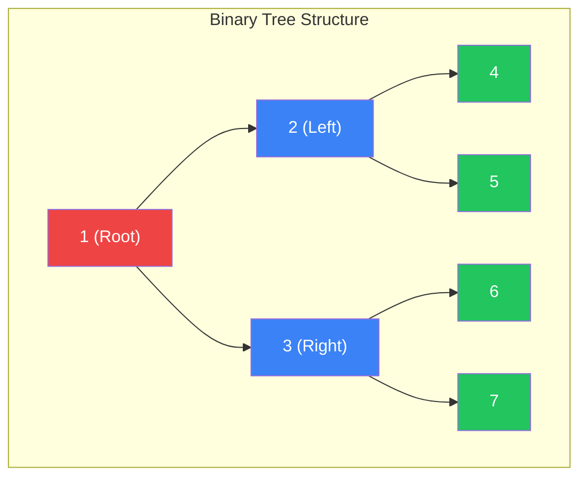
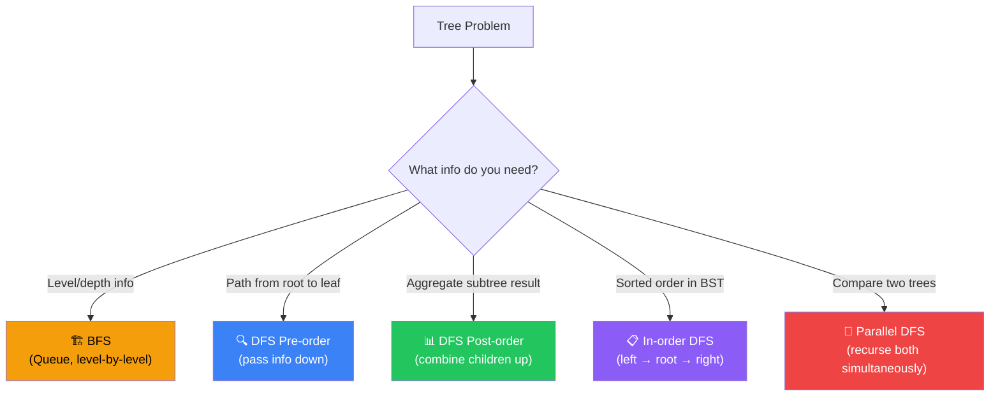
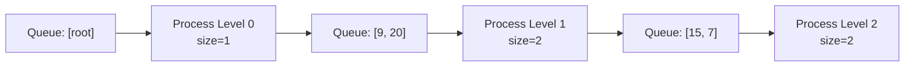
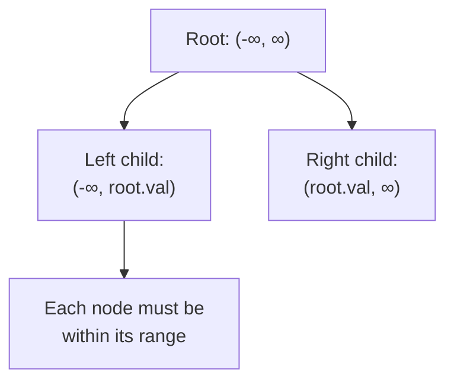
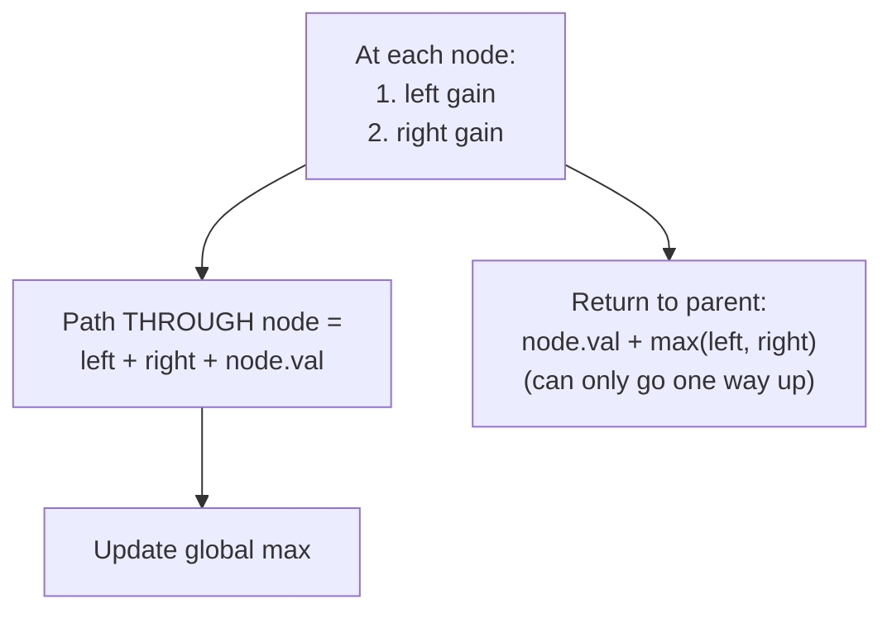

[🏠 Home](../../README.md) | [⬅️ Stacks](../07-stacks-queues/00-overview.md) | [➡️ Heaps](../09-heaps-priority-queues/00-overview.md)

# 🌳 Tree Patterns

> Hierarchical data traversal and manipulation

---

## 🎯 When to Use

| Clue | Pattern |
|------|---------|
| "Level by level" | BFS (Queue) |
| "Path from root" | DFS (Recursion) |
| "BST property" | In-order traversal |
| "All paths/combinations" | Backtracking DFS |
| "Lowest common ancestor" | DFS with tracking |

---

## 🧠 WHY Tree Algorithms Work: The Beginner's Guide

> **🎯 For Beginners:** Trees are recursive by nature - understanding this unlocks everything!

### The Core Insight: Every Node is a "Mini-Tree"

```
        1           ← This is a tree
       / \
      2   3         ← Node 2 is ALSO a tree (subtree)
     / \   \
    4   5   6       ← Node 4 is ALSO a tree (leaf = tiny tree)

Key Realization:
  Any operation on the whole tree
  = Same operation on root + Same operation on children
  
  This is why RECURSION is natural for trees!
```

### DFS vs BFS: When to Use Which

```
DFS (Depth-First Search):
  Go deep before going wide
  Use when: Path questions, root-to-leaf problems
  
        1
       / \
      2   3
     / \
    4   5
    
  Visit order: 1 → 2 → 4 → 5 → 3

BFS (Breadth-First Search):
  Go level by level
  Use when: Level questions, shortest path in unweighted
  
  Visit order: 1 → 2, 3 → 4, 5
  (Level 0, then Level 1, then Level 2)
```

### Why DFS Uses Recursion (or Stack)

```
DFS naturally uses recursion because:

Call Stack during DFS:
  process(1)
    ├── process(2)
    │     ├── process(4) ← base case, return
    │     └── process(5) ← base case, return
    └── process(3)
          └── return

The call stack "remembers" the path back up!
This is why DFS is perfect for path problems.
```

### Why BFS Uses Queue

```
BFS uses a queue because:

Process Level 0: [1]
  Add children → Queue: [2, 3]

Process Level 1: [2, 3]
  Add 2's children → Queue: [3, 4, 5]
  Add 3's children → Queue: [4, 5, 6]

Process Level 2: [4, 5, 6]
  No children left

The queue ensures FIFO order = level-by-level!
```

### Thought Process Template

```
🧠 "How should I traverse this tree?"

1. Does the problem mention "levels" or "depth"?
   → Yes: BFS (use Queue)
   → "Level order", "minimum depth" → BFS

2. Does it mention "paths" or "root to leaf"?
   → Yes: DFS (use Recursion or Stack)
   → "All paths", "path sum" → DFS

3. Do I need the whole tree's answer?
   → Combine children's answers: Post-order DFS
   → e.g., "height", "max depth"

4. Do I need parent info while going down?
   → Pass info down: Pre-order DFS
   → e.g., "path matching sum X"
```

---

## 📊 Binary Tree — Structure & Traversal



> **Traversal orders**: Preorder `[1,2,4,5,3,6,7]` • Inorder `[4,2,5,1,6,3,7]` • Postorder `[4,5,2,6,7,3,1]`

### 🧭 Tree Problem Decision Flowchart



---

## 🔧 Core Traversals

### 1. DFS Traversals

```java
// Preorder: Root → Left → Right
public void preorder(TreeNode root) {
    if (root == null) return;
    process(root.val);      // Root
    preorder(root.left);    // Left
    preorder(root.right);   // Right
}

// Inorder: Left → Root → Right (BST gives sorted)
public void inorder(TreeNode root) {
    if (root == null) return;
    inorder(root.left);     // Left
    process(root.val);      // Root
    inorder(root.right);    // Right
}

// Postorder: Left → Right → Root
public void postorder(TreeNode root) {
    if (root == null) return;
    postorder(root.left);   // Left
    postorder(root.right);  // Right
    process(root.val);      // Root
}
```

**Visualization**:
```
        1
       / \
      2   3
     / \
    4   5

Preorder:  [1, 2, 4, 5, 3]
Inorder:   [4, 2, 5, 1, 3]
Postorder: [4, 5, 2, 3, 1]
```

---

### 2. BFS (Level Order)

```java
public List<List<Integer>> levelOrder(TreeNode root) {
    List<List<Integer>> result = new ArrayList<>();
    if (root == null) return result;
    
    Queue<TreeNode> queue = new LinkedList<>();
    queue.offer(root);
    
    while (!queue.isEmpty()) {
        int levelSize = queue.size();
        List<Integer> level = new ArrayList<>();
        
        for (int i = 0; i < levelSize; i++) {
            TreeNode node = queue.poll();
            level.add(node.val);
            
            if (node.left != null) queue.offer(node.left);
            if (node.right != null) queue.offer(node.right);
        }
        result.add(level);
    }
    return result;
}
```

**Visualization**:
```
        3
       / \
      9   20
         /  \
        15   7

Queue processing:
  Level 0: [3]      → result = [[3]]
  Level 1: [9, 20]  → result = [[3], [9, 20]]
  Level 2: [15, 7]  → result = [[3], [9, 20], [15, 7]]
```

**Complexity**: Time O(n). Space O(w) where w = max width.

---

## 💻 Core Problems

### Problem 1: Maximum Depth of Binary Tree

```java
public int maxDepth(TreeNode root) {
    if (root == null) return 0;
    return 1 + Math.max(maxDepth(root.left), maxDepth(root.right));
}
```

**Iterative BFS**:
```java
public int maxDepth(TreeNode root) {
    if (root == null) return 0;
    Queue<TreeNode> queue = new LinkedList<>();
    queue.offer(root);
    int depth = 0;
    
    while (!queue.isEmpty()) {
        depth++;
        int size = queue.size();
        for (int i = 0; i < size; i++) {
            TreeNode node = queue.poll();
            if (node.left != null) queue.offer(node.left);
            if (node.right != null) queue.offer(node.right);
        }
    }
    return depth;
}
```

**Visualization**:
```
        3
       / \
      9   20
         /  \
        15   7

Recursive: maxDepth(3) = 1 + max(maxDepth(9), maxDepth(20))
           maxDepth(9) = 1 + max(0, 0) = 1
           maxDepth(20)= 1 + max(maxDepth(15), maxDepth(7)) = 2
           maxDepth(3) = 1 + max(1, 2) = 3 ✅

BFS: Level 1: [3], Level 2: [9,20], Level 3: [15,7] → depth=3 ✅
```

**Complexity**: Time O(n). Space O(h) recursive / O(w) BFS.

---

### Problem 2: Invert Binary Tree

```java
public TreeNode invertTree(TreeNode root) {
    if (root == null) return null;
    
    TreeNode left = invertTree(root.left);
    TreeNode right = invertTree(root.right);
    
    root.left = right;
    root.right = left;
    
    return root;
}
```

**Visualization**:
```
Before:       4          After:        4
             / \                      / \
            2   7         →          7   2
           / \ / \                  / \ / \
          1  3 6  9                9  6 3  1

Recursion (bottom-up): swap children at each node.
  invertTree(2) swaps 1↔2↔3 → 3↔2↔1
  invertTree(7) swaps 6↔7↔9 → 9↔7↔6
  invertTree(4) swaps left↔right subtrees
```

**Complexity**: Time O(n). Space O(h).

---

### Problem 3: Same Tree / Symmetric Tree

```java
public boolean isSameTree(TreeNode p, TreeNode q) {
    if (p == null && q == null) return true;
    if (p == null || q == null) return false;
    if (p.val != q.val) return false;
    
    return isSameTree(p.left, q.left) && isSameTree(p.right, q.right);
}

public boolean isSymmetric(TreeNode root) {
    return isMirror(root, root);
}

private boolean isMirror(TreeNode t1, TreeNode t2) {
    if (t1 == null && t2 == null) return true;
    if (t1 == null || t2 == null) return false;
    
    return t1.val == t2.val 
        && isMirror(t1.left, t2.right) 
        && isMirror(t1.right, t2.left);
}
```

**Visualization**:
```
Same Tree:       Symmetric Tree:
  1     1          1
 / \   / \        / \
2   3 2   3      2   2
 ✅ Both match     / \ / \
                3  4 4  3  ✅ Mirror match

isMirror compares: left.left ↔ right.right AND left.right ↔ right.left
```

**Complexity**: Time O(n). Space O(h).

---

### Problem 4: Validate BST

```java
public boolean isValidBST(TreeNode root) {
    return validate(root, Long.MIN_VALUE, Long.MAX_VALUE);
}

private boolean validate(TreeNode node, long min, long max) {
    if (node == null) return true;
    if (node.val <= min || node.val >= max) return false;
    
    return validate(node.left, min, node.val) 
        && validate(node.right, node.val, max);
}
```

**Visualization**:
```
        5
       / \
      1   7
     / \ / \
    0  3 6  8

validate(5, -∞, +∞) ✅  5 in range
  validate(1, -∞, 5) ✅  1 < 5
    validate(0, -∞, 1) ✅
    validate(3, 1, 5)  ✅  1 < 3 < 5
  validate(7, 5, +∞)  ✅  7 > 5
    validate(6, 5, 7)  ✅  5 < 6 < 7
    validate(8, 7, +∞) ✅

💡 Pass valid range down. Each node tightens the range.
```

**Complexity**: Time O(n). Space O(h).

---

### Problem 5: Lowest Common Ancestor

```java
public TreeNode lowestCommonAncestor(TreeNode root, TreeNode p, TreeNode q) {
    if (root == null || root == p || root == q) return root;
    
    TreeNode left = lowestCommonAncestor(root.left, p, q);
    TreeNode right = lowestCommonAncestor(root.right, p, q);
    
    if (left != null && right != null) return root;  // p,q on different sides
    return left != null ? left : right;
}
```

**Visualization**:
```
        3
       / \
      5   1
     / \ / \
    6  2 0  8

Find LCA of 5 and 1:
  lca(3, 5, 1): left=lca(5...) right=lca(1...)
    lca(5, 5, 1): root==p → return 5
    lca(1, 5, 1): root==q → return 1
  Both non-null → return 3 ✅

Find LCA of 5 and 4:
  lca(3): left=lca(5...) returns 5 (found p)
    right=lca(1...) returns null (neither found)
  left non-null, right null → return 5 (LCA of node with its descendant)
```

**Complexity**: Time O(n). Space O(h).

---

### Problem 6: Serialize and Deserialize

```java
public class Codec {
    public String serialize(TreeNode root) {
        if (root == null) return "null";
        return root.val + "," + serialize(root.left) + "," + serialize(root.right);
    }

    public TreeNode deserialize(String data) {
        Queue<String> queue = new LinkedList<>(Arrays.asList(data.split(",")));
        return build(queue);
    }
    
    private TreeNode build(Queue<String> queue) {
        String val = queue.poll();
        if (val.equals("null")) return null;
        
        TreeNode node = new TreeNode(Integer.parseInt(val));
        node.left = build(queue);
        node.right = build(queue);
        return node;
    }
}
```

**Visualization**:
```
Tree:     1
         / \
        2   3
       / \
      4   5

Serialize (preorder): "1,2,4,null,null,5,null,null,3,null,null"

Deserialize:
  poll "1" → node(1)
    left:  poll "2" → node(2)
      left:  poll "4" → node(4)
        left:  poll "null" → null
        right: poll "null" → null
      right: poll "5" → node(5)
        left:  poll "null" → null
        right: poll "null" → null
    right: poll "3" → node(3)
      left:  poll "null" → null
      right: poll "null" → null

Reconstructed tree matches original ✅
```

**Complexity**: Time O(n). Space O(n) for the string.

---

## 🧠 Pattern Templates

### Template 1: Return Value DFS
```java
// Use when: Need aggregate result from subtrees
int dfs(TreeNode node) {
    if (node == null) return BASE_CASE;
    
    int left = dfs(node.left);
    int right = dfs(node.right);
    
    return COMBINE(left, right, node);
}
```

### Template 2: Global Variable DFS
```java
// Use when: Finding max across all nodes
int maxVal = 0;

int dfs(TreeNode node) {
    if (node == null) return 0;
    
    int left = dfs(node.left);
    int right = dfs(node.right);
    
    maxVal = Math.max(maxVal, left + right + node.val);
    return Math.max(left, right) + node.val;
}
```

---

## 📊 Complexity Summary

| Problem | Time | Space |
|---------|------|-------|
| Max Depth | O(n) | O(h) |
| Level Order | O(n) | O(w) |
| Validate BST | O(n) | O(h) |
| LCA | O(n) | O(h) |
| Serialize | O(n) | O(n) |

*h = height, w = max width*

---

## 📝 Practice Problems — Detailed Solutions

| # | Problem | Difficulty | Link | Key Insight |
|---|---------|------------|------|-------------|
| 1 | Max Depth | 🟢 Easy | [LeetCode](https://leetcode.com/problems/maximum-depth-of-binary-tree/) | Simple recursion |
| 2 | Invert Tree | 🟢 Easy | [LeetCode](https://leetcode.com/problems/invert-binary-tree/) | Swap children |
| 3 | Same Tree | 🟢 Easy | [LeetCode](https://leetcode.com/problems/same-tree/) | Compare recursively |
| 4 | Level Order | 🟡 Medium | [LeetCode](https://leetcode.com/problems/binary-tree-level-order-traversal/) | BFS queue |
| 5 | Validate BST | 🟡 Medium | [LeetCode](https://leetcode.com/problems/validate-binary-search-tree/) | Range checking |
| 6 | LCA | 🟡 Medium | [LeetCode](https://leetcode.com/problems/lowest-common-ancestor-of-a-binary-tree/) | Split point |
| 7 | Kth Smallest BST | 🟡 Medium | [LeetCode](https://leetcode.com/problems/kth-smallest-element-in-a-bst/) | Inorder |
| 8 | Binary Tree Max Path | 🔴 Hard | [LeetCode](https://leetcode.com/problems/binary-tree-maximum-path-sum/) | Global max |

---

### Problem 1: Maximum Depth of Binary Tree 🟢

> **Given** a binary tree, find its maximum depth.

#### ✅ Optimal: DFS Recursion — O(n) Time, O(h) Space

```java
public int maxDepth(TreeNode root) {
    if (root == null) return 0;
    return 1 + Math.max(maxDepth(root.left), maxDepth(root.right));
}
```

```
Example:
        3
       / \
      9   20
         / \
        15   7

maxDepth(3) = 1 + max(maxDepth(9), maxDepth(20))
  maxDepth(9) = 1 + max(0, 0) = 1
  maxDepth(20) = 1 + max(maxDepth(15), maxDepth(7))
    maxDepth(15) = 1, maxDepth(7) = 1
  maxDepth(20) = 1 + max(1, 1) = 2
maxDepth(3) = 1 + max(1, 2) = 3 ✅

💡 BASE CASE: null → 0 depth. Each call adds 1.
```

---

### Problem 2: Invert Binary Tree 🟢

> **Given** a binary tree, invert it (mirror image).

#### ✅ Optimal — O(n) Time, O(h) Space

```java
public TreeNode invertTree(TreeNode root) {
    if (root == null) return null;
    
    TreeNode temp = root.left;
    root.left = invertTree(root.right);
    root.right = invertTree(temp);
    return root;
}
```

```
Example:
     4              4
    / \    →       / \
   2   7          7   2
  / \ / \        / \ / \
 1  3 6  9      9  6 3  1

💡 SWAP left and right children recursively at every node.
   Postorder or preorder both work — just swap + recurse.
```

---

### Problem 3: Same Tree 🟢

> **Given** two binary trees, check if they are structurally identical.

#### ✅ Optimal — O(n) Time, O(h) Space

```java
public boolean isSameTree(TreeNode p, TreeNode q) {
    if (p == null && q == null) return true;
    if (p == null || q == null) return false;
    
    return p.val == q.val && 
           isSameTree(p.left, q.left) && 
           isSameTree(p.right, q.right);
}
```

```
Check three things at each node:
1. Both null → true (bases match)
2. One null → false (structure differs)
3. Values equal AND left subtrees match AND right subtrees match

💡 SHORT-CIRCUIT: If values differ, don't recurse further.
```

---

### Problem 4: Binary Tree Level Order Traversal 🟡

> **Given** a binary tree, return level-by-level values (BFS).

#### 🧠 Approach Diagram



#### ✅ Optimal: BFS — O(n) Time, O(w) Space

```java
public List<List<Integer>> levelOrder(TreeNode root) {
    List<List<Integer>> result = new ArrayList<>();
    if (root == null) return result;
    
    Queue<TreeNode> queue = new LinkedList<>();
    queue.offer(root);
    
    while (!queue.isEmpty()) {
        int size = queue.size();  // nodes at current level
        List<Integer> level = new ArrayList<>();
        
        for (int i = 0; i < size; i++) {
            TreeNode node = queue.poll();
            level.add(node.val);
            if (node.left != null) queue.offer(node.left);
            if (node.right != null) queue.offer(node.right);
        }
        result.add(level);
    }
    return result;
}
```

```
Example:
        3
       / \
      9   20
         / \
        15   7

Level 0: queue=[3], size=1 → [3]
Level 1: queue=[9,20], size=2 → [9, 20]
Level 2: queue=[15,7], size=2 → [15, 7]

Result: [[3], [9, 20], [15, 7]] ✅

💡 KEY: Snapshot queue.size() BEFORE processing.
   This separates nodes by level — without it, levels blur together.
```

---

### Problem 5: Validate Binary Search Tree 🟡

> **Given** a binary tree, determine if it is a valid BST.

#### 🧠 Approach Diagram



#### ✅ Optimal: Range Checking — O(n) Time, O(h) Space

```java
public boolean isValidBST(TreeNode root) {
    return validate(root, Long.MIN_VALUE, Long.MAX_VALUE);
}

private boolean validate(TreeNode node, long min, long max) {
    if (node == null) return true;
    if (node.val <= min || node.val >= max) return false;
    
    return validate(node.left, min, node.val) &&   // left < node
           validate(node.right, node.val, max);     // right > node
}
```

```
Example:
      5
     / \
    1   4     ← INVALID! 4 < 5 but is right child
       / \
      3   6

validate(5, -∞, ∞): 5 in range ✅
  validate(1, -∞, 5): 1 in range ✅
  validate(4, 5, ∞): 4 NOT in (5, ∞) → return false ❌

💡 COMMON MISTAKE: Only checking node vs parent.
   Must check against ENTIRE range!
   Example: [5, 1, 6, null, null, 3, 7]
   Node 3 is right-left child. It's < 6 ✅ but also must be > 5!
```

---

### Problem 6: Lowest Common Ancestor 🟡

> **Given** a binary tree and two nodes p, q, find their LCA.

#### ✅ Optimal — O(n) Time, O(h) Space

```java
public TreeNode lowestCommonAncestor(TreeNode root, TreeNode p, TreeNode q) {
    if (root == null || root == p || root == q) return root;
    
    TreeNode left = lowestCommonAncestor(root.left, p, q);
    TreeNode right = lowestCommonAncestor(root.right, p, q);
    
    if (left != null && right != null) return root;  // split point!
    return left != null ? left : right;
}
```

```
Example: Find LCA of 5 and 1
         3
        / \
       5   1
      / \ / \
     6  2 0  8

LCA(3, 5, 1):
  Left: LCA(5, 5, 1) → returns 5 (root == p)
  Right: LCA(1, 5, 1) → returns 1 (root == q)
  Both non-null → root=3 is the split point!

Return 3 ✅

💡 THREE CASES:
   1. Both found in left subtree → LCA is in left
   2. Both found in right subtree → LCA is in right
   3. One in each → current root IS the LCA (split point)
```

---

### Problem 7: Kth Smallest Element in BST 🟡

> **Given** a BST, find the kth smallest element.

#### ✅ Optimal: Inorder Traversal — O(h+k) Time, O(h) Space

```java
public int kthSmallest(TreeNode root, int k) {
    Deque<TreeNode> stack = new ArrayDeque<>();
    TreeNode curr = root;
    
    while (curr != null || !stack.isEmpty()) {
        while (curr != null) {
            stack.push(curr);
            curr = curr.left;     // go left first
        }
        
        curr = stack.pop();
        k--;
        if (k == 0) return curr.val;  // found kth!
        
        curr = curr.right;        // then go right
    }
    return -1;
}
```

```
Example: k=3
        5
       / \
      3   6
     / \
    2   4
   /
  1

Inorder traversal: 1, 2, 3, 4, 5, 6
k=3 → pop 1 (k=2), pop 2 (k=1), pop 3 (k=0) → return 3 ✅

💡 BST PROPERTY: Inorder traversal gives sorted order!
   So kth smallest = kth element in inorder.
   Iterative avoids traversing the entire tree — stop at k.
```

---

### Problem 8: Binary Tree Maximum Path Sum 🔴

> **Given** a binary tree, find the maximum path sum (any node to any node).

#### 🧠 Approach Diagram



#### ✅ Optimal: DFS with Global Max — O(n) Time, O(h) Space

```java
int maxSum = Integer.MIN_VALUE;

public int maxPathSum(TreeNode root) {
    dfs(root);
    return maxSum;
}

private int dfs(TreeNode node) {
    if (node == null) return 0;
    
    int left = Math.max(0, dfs(node.left));   // ignore negative paths
    int right = Math.max(0, dfs(node.right));
    
    maxSum = Math.max(maxSum, left + right + node.val);  // path through node
    return node.val + Math.max(left, right);  // return best single path
}
```

```
Example:
       -10
       / \
      9   20
         / \
        15   7

dfs(-10):
  left = max(0, dfs(9)) = max(0, 9) = 9
  right = max(0, dfs(20)):
    dfs(20): left=15, right=7
             maxSum = max(maxSum, 15+7+20) = 42 ✅
             return 20+max(15,7) = 35
  right = 35
  maxSum = max(42, 9+35+(-10)) = max(42, 34) = 42
  return -10 + max(9, 35) = 25

maxSum = 42 ✅ (path: 15 → 20 → 7)

💡 TWO DIFFERENT VALUES:
   - Global max: best path THROUGH any node (left + right + node)
   - Return value: best path going UP from node (can only pick one direction)
   
   max(0, ...) ensures we IGNORE negative subtrees.
```

---

## 📊 Complexity Comparison

| # | Problem | Time | Space | Traversal |
|---|---------|------|-------|-----------|
| 1 | Max Depth | O(n) | O(h) | DFS |
| 2 | Invert Tree | O(n) | O(h) | DFS |
| 3 | Same Tree | O(n) | O(h) | DFS |
| 4 | Level Order | O(n) | O(w) | BFS |
| 5 | Validate BST | O(n) | O(h) | DFS + range |
| 6 | LCA | O(n) | O(h) | DFS |
| 7 | Kth Smallest | O(h+k) | O(h) | Inorder |
| 8 | Max Path Sum | O(n) | O(h) | DFS + global |

*h = height, w = max width*

---

*Next: [Heaps & Priority Queues →](../09-heaps-priority-queues/00-overview.md)*
