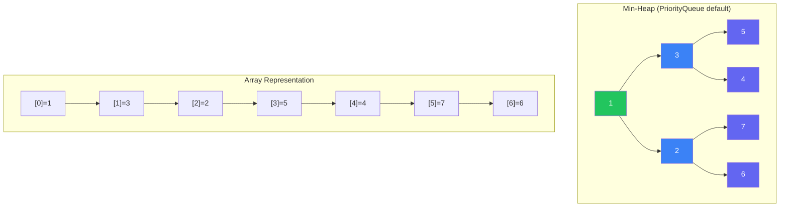
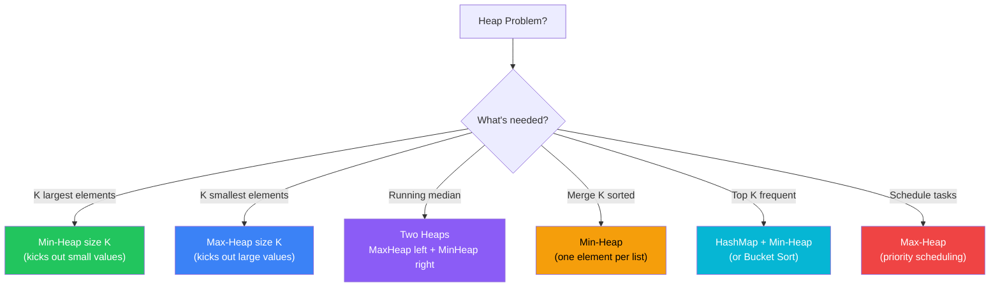
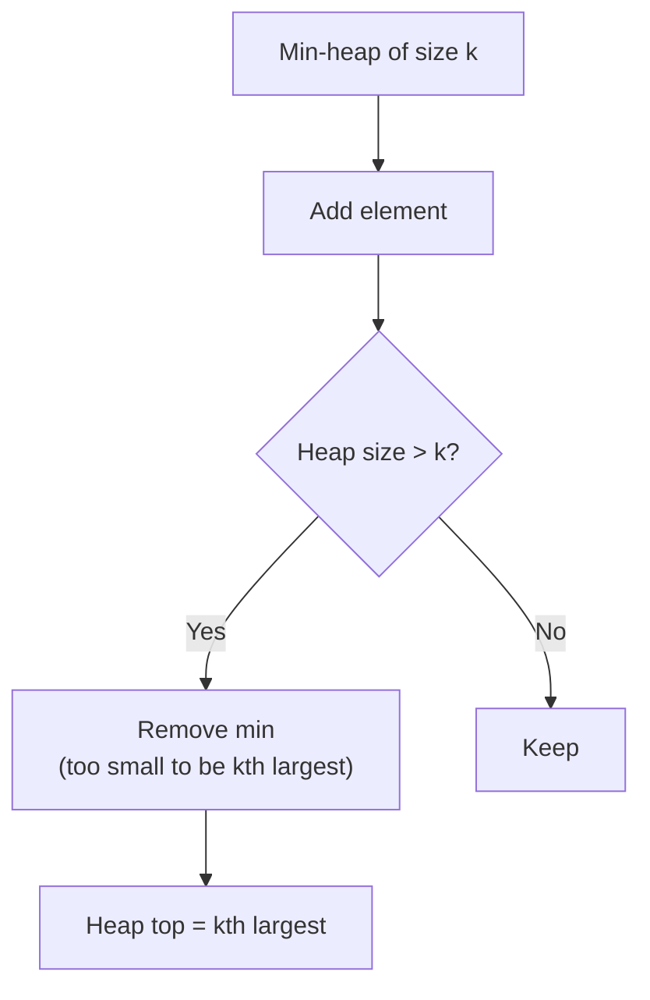
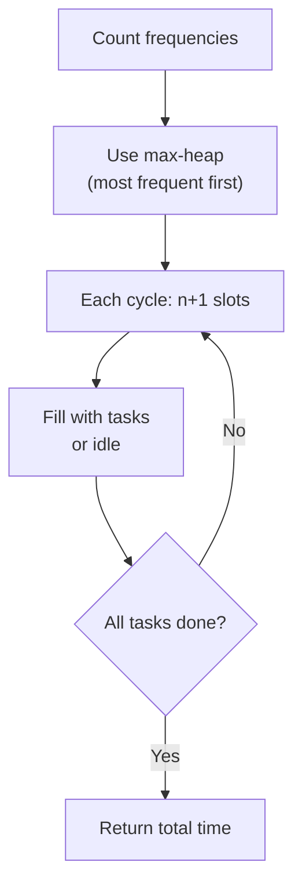
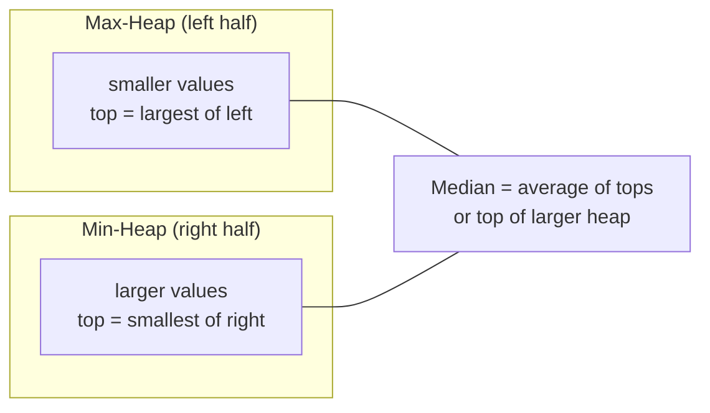

[🏠 Home](../../README.md) | [⬅️ Trees](../08-trees/00-overview.md) | [➡️ Graphs](../10-graphs/00-overview.md)

# ⛰️ Heaps & Priority Queues

> Efficient access to min/max elements

---

## 🎯 When to Use

| Clue | Pattern |
|------|---------|
| "K largest/smallest" | Min/Max Heap |
| "Top K frequent" | Heap + HashMap |
| "Continuous median" | Two heaps |
| "Merge K sorted" | Min heap |
| "Schedule tasks" | Priority Queue |

---

## 🧠 WHY Heaps Are Essential: The Developer's Guide

> **🎯 For Beginners:** Heaps give you O(log n) access to min/max - that's the key insight!

### The Core Insight: Partial Sorting

```
❌ Full Sort for Kth Largest: O(n log n)
   Sort entire array, pick index k
   
✅ Heap for Kth Largest: O(n log k)
   Only maintain k elements, not n!
   
   For k = 3, n = 1,000,000:
   Sort: 1,000,000 × log(1,000,000) ≈ 20 million ops
   Heap: 1,000,000 × log(3) ≈ 1.6 million ops
   
   10x faster for small k!
```

### Why Min-Heap for K LARGEST? (Counter-intuitive!)

```
Finding 3 largest from [3, 1, 5, 2, 4]:

✅ Min-Heap of size 3:
   Add 3: heap = [3]
   Add 1: heap = [1, 3]
   Add 5: heap = [1, 3, 5]
   Add 2: heap = [1, 3, 5] → 2 > 1, replace → [2, 3, 5]
   Add 4: heap = [2, 3, 5] → 4 > 2, replace → [3, 4, 5]
   
   Min-heap KICKS OUT small elements!
   What remains = K largest ✅

❌ Max-Heap of size 3:
   Would keep 5, 4, 3 at top... but needs O(n) to find 3rd
```

### Two Heaps: The Median Trick

```
Finding median from stream: [2, 3, 4]

Split data into two halves:
  
  MaxHeap (left half)     MinHeap (right half)
  ┌───────────────┐       ┌───────────────┐
  │     [2]       │       │     [4]       │
  │      ↓        │       │      ↓        │
  │    smaller    │       │    larger     │
  └───────────────┘       └───────────────┘
         ↑                       ↑
    max of left            min of right
    
  Median = (max of left + min of right) / 2
         = (2 + 4) / 2 = 3 ✓ (or just peek if odd count)

Both operations are O(log n)!
```

### Heap Internals (Why O(log n)?)

```
Heap is a COMPLETE BINARY TREE stored as array:

        [1]
       /   \
     [3]   [2]
     / \
   [5] [4]

Array: [1, 3, 2, 5, 4]
       0  1  2  3  4

Parent of i: (i-1) / 2
Left child: 2*i + 1
Right child: 2*i + 2

Height = log(n), so insert/remove = O(log n)
```

### Thought Process Template

```
🧠 "Should I use a Heap here?"

1. Need K largest/smallest?
   → Min-heap of size K for K largest
   → Max-heap of size K for K smallest

2. Need continuous median?
   → Two heaps (max-heap left, min-heap right)

3. Need to merge K sorted things?
   → Min-heap with one element from each

4. Need frequent min/max access?
   → That's exactly what heap does: O(1) peek, O(log n) remove
```

---

## 📊 Heap Structure — Visual



> **Key**: Parent `i` → Left child `2i+1`, Right child `2i+2`. Height = O(log n).

### 🧭 Heap Problem Selector



---

## 🔧 Java Heap Basics

```java
// Min Heap (default)
PriorityQueue<Integer> minHeap = new PriorityQueue<>();

// Max Heap
PriorityQueue<Integer> maxHeap = new PriorityQueue<>(Collections.reverseOrder());
// OR
PriorityQueue<Integer> maxHeap = new PriorityQueue<>((a, b) -> b - a);

// Custom comparator
PriorityQueue<int[]> pq = new PriorityQueue<>((a, b) -> a[0] - b[0]);
```

**Operations**:
| Operation | Time |
|-----------|------|
| offer/add | O(log n) |
| poll/remove | O(log n) |
| peek | O(1) |
| size | O(1) |

---

## 💻 Core Problems

### Problem 1: Kth Largest Element

```java
// Use min-heap of size k
public int findKthLargest(int[] nums, int k) {
    PriorityQueue<Integer> minHeap = new PriorityQueue<>();
    
    for (int num : nums) {
        minHeap.offer(num);
        if (minHeap.size() > k) {
            minHeap.poll();  // Remove smallest
        }
    }
    
    return minHeap.peek();  // Kth largest
}
```

**Visualization**:
```
nums = [3,2,1,5,6,4], k = 2

Add 3: heap = [3]
Add 2: heap = [2,3]
Add 1: heap = [1,2,3] → size>k, poll → [2,3]
Add 5: heap = [2,3,5] → poll → [3,5]
Add 6: heap = [3,5,6] → poll → [5,6]
Add 4: heap = [4,5,6] → poll → [5,6]

Answer: 5 (2nd largest)
```

**Complexity**: Time O(n log k). Space O(k).

---

### Problem 2: Top K Frequent Elements

```java
public int[] topKFrequent(int[] nums, int k) {
    // Count frequency
    Map<Integer, Integer> freq = new HashMap<>();
    for (int num : nums) {
        freq.put(num, freq.getOrDefault(num, 0) + 1);
    }
    
    // Min heap by frequency
    PriorityQueue<Integer> heap = new PriorityQueue<>(
        (a, b) -> freq.get(a) - freq.get(b)
    );
    
    for (int num : freq.keySet()) {
        heap.offer(num);
        if (heap.size() > k) {
            heap.poll();
        }
    }
    
    int[] result = new int[k];
    for (int i = 0; i < k; i++) {
        result[i] = heap.poll();
    }
    return result;
}
```

**Alternative: Bucket Sort O(n)**:
```java
public int[] topKFrequent(int[] nums, int k) {
    Map<Integer, Integer> freq = new HashMap<>();
    for (int num : nums) freq.merge(num, 1, Integer::sum);
    
    List<Integer>[] buckets = new List[nums.length + 1];
    for (int num : freq.keySet()) {
        int f = freq.get(num);
        if (buckets[f] == null) buckets[f] = new ArrayList<>();
        buckets[f].add(num);
    }
    
    int[] result = new int[k];
    int idx = 0;
    for (int i = buckets.length - 1; i >= 0 && idx < k; i--) {
        if (buckets[i] != null) {
            for (int num : buckets[i]) {
                result[idx++] = num;
                if (idx == k) break;
            }
        }
    }
    return result;
}
```

**Visualization (Heap approach)**:
```
nums = [1,1,1,2,2,3], k=2

Freq: {1:3, 2:2, 3:1}
Min-heap by freq, keep top 2:
  add 1(freq=3): heap=[1(3)]
  add 2(freq=2): heap=[2(2), 1(3)]
  add 3(freq=1): heap=[3(1), 2(2), 1(3)] → size>k, poll 3 → [2(2), 1(3)]

Result: [1, 2] ✅

Bucket Sort: buckets[3]=[1], buckets[2]=[2] → grab from highest → [1, 2]
```

**Complexity**: Heap: O(n log k). Bucket Sort: O(n). Space O(n).

---

### Problem 3: Find Median from Data Stream (Two Heaps)

```java
class MedianFinder {
    PriorityQueue<Integer> small; // Max heap (left half)
    PriorityQueue<Integer> large; // Min heap (right half)
    
    public MedianFinder() {
        small = new PriorityQueue<>(Collections.reverseOrder());
        large = new PriorityQueue<>();
    }
    
    public void addNum(int num) {
        small.offer(num);
        large.offer(small.poll());  // Balance
        
        if (large.size() > small.size()) {
            small.offer(large.poll());
        }
    }
    
    public double findMedian() {
        if (small.size() > large.size()) {
            return small.peek();
        }
        return (small.peek() + large.peek()) / 2.0;
    }
}
```

**Visualization**:
```
Stream: [2, 3, 4]

Add 2: small=[2], large=[]     → median=2
Add 3: small=[2], large=[3]    → median=2.5
Add 4: small=[3,2], large=[4]  → median=3
```

**Complexity**: addNum O(log n), findMedian O(1). Space O(n).

---

### Problem 4: Merge K Sorted Lists

```java
public ListNode mergeKLists(ListNode[] lists) {
    PriorityQueue<ListNode> heap = new PriorityQueue<>(
        (a, b) -> a.val - b.val
    );
    
    // Add first node of each list
    for (ListNode node : lists) {
        if (node != null) heap.offer(node);
    }
    
    ListNode dummy = new ListNode(0);
    ListNode curr = dummy;
    
    while (!heap.isEmpty()) {
        ListNode node = heap.poll();
        curr.next = node;
        curr = curr.next;
        
        if (node.next != null) {
            heap.offer(node.next);
        }
    }
    
    return dummy.next;
}
```

**Visualization**:
```
Lists: [1→4→5], [1→3→4], [2→6]

Heap starts: [1, 1, 2]  (heads of all lists)

Poll 1(list1) → result: 1, push 4  → heap=[1, 2, 4]
Poll 1(list2) → result: 1→1, push 3 → heap=[2, 3, 4]
Poll 2(list3) → result: 1→1→2, push 6 → heap=[3, 4, 6]
Poll 3       → result: 1→1→2→3, push 4 → heap=[4, 4, 6]
Poll 4(list1) → result: ...→4, push 5 → heap=[4, 5, 6]
Poll 4(list2) → result: ...→4→4, no next → heap=[5, 6]
Poll 5       → ...→5 → heap=[6]
Poll 6       → ...→6 → heap=[] → done ✅
```

**Complexity**: Time O(N log k) where N=total nodes, k=lists. Space O(k).

---

### Problem 5: Task Scheduler

```java
public int leastInterval(char[] tasks, int n) {
    int[] freq = new int[26];
    for (char task : tasks) {
        freq[task - 'A']++;
    }
    
    PriorityQueue<Integer> maxHeap = new PriorityQueue<>(Collections.reverseOrder());
    for (int f : freq) {
        if (f > 0) maxHeap.offer(f);
    }
    
    int time = 0;
    while (!maxHeap.isEmpty()) {
        List<Integer> temp = new ArrayList<>();
        
        // Process n+1 tasks (or idle)
        for (int i = 0; i <= n; i++) {
            if (!maxHeap.isEmpty()) {
                int count = maxHeap.poll() - 1;
                if (count > 0) temp.add(count);
            }
            time++;
            if (maxHeap.isEmpty() && temp.isEmpty()) break;
        }
        
        // Add back remaining tasks
        for (int count : temp) {
            maxHeap.offer(count);
        }
    }
    return time;
}
```

**Visualization**:
```
tasks = [A,A,A,B,B,B], n=2

Freq: A=3, B=3. maxHeap=[3,3]

Round 1 (slots=n+1=3): A B idle → time=3, remaining=[2,2]
Round 2: A B idle → time=6, remaining=[1,1]
Round 3: A B → time=8 (no idle needed, heap empty)

Schedule: A B _ A B _ A B → total=8 ✅

💡 Greedy: always pick highest-freq task first to minimize idle slots.
```

**Complexity**: Time O(n log 26) ≈ O(n). Space O(1) (at most 26 tasks).

---

## 🧠 Pattern Summary

```
┌─────────────────────────────────────────────────────┐
│                  HEAP PATTERNS                       │
├─────────────────────────────────────────────────────┤
│ K Largest:  Min-heap of size K                      │
│ K Smallest: Max-heap of size K                      │
│                                                      │
│ Median:     Two heaps (max for left, min for right) │
│                                                      │
│ Merge K:    Min-heap with one node from each list   │
│                                                      │
│ Top K Freq: Map frequency + heap by frequency       │
└─────────────────────────────────────────────────────┘
```

---

## 📊 Complexity Summary

| Problem | Time | Space |
|---------|------|-------|
| Kth Largest | O(n log k) | O(k) |
| Top K Frequent | O(n log k) | O(n) |
| Median Stream | O(log n) per add | O(n) |
| Merge K Lists | O(n log k) | O(k) |

---

## 📝 Practice Problems — Detailed Solutions

| # | Problem | Difficulty | Link | Key Insight |
|---|---------|------------|------|-------------|
| 1 | Kth Largest | 🟡 Medium | [LeetCode](https://leetcode.com/problems/kth-largest-element-in-an-array/) | Min heap size k |
| 2 | Last Stone Weight | 🟢 Easy | [LeetCode](https://leetcode.com/problems/last-stone-weight/) | Max heap |
| 3 | K Closest Points | 🟡 Medium | [LeetCode](https://leetcode.com/problems/k-closest-points-to-origin/) | Max heap by distance |
| 4 | Top K Frequent | 🟡 Medium | [LeetCode](https://leetcode.com/problems/top-k-frequent-elements/) | Freq map + heap |
| 5 | Task Scheduler | 🟡 Medium | [LeetCode](https://leetcode.com/problems/task-scheduler/) | Greedy max freq |
| 6 | Find Median | 🔴 Hard | [LeetCode](https://leetcode.com/problems/find-median-from-data-stream/) | Two heaps |
| 7 | Merge K Lists | 🔴 Hard | [LeetCode](https://leetcode.com/problems/merge-k-sorted-lists/) | Min heap |

---

### Problem 1: Kth Largest Element in an Array 🟡

> **Given** an integer array and k, find the kth largest element.

#### 🧠 Approach Diagram



#### ✅ Optimal: Min-Heap — O(n log k) Time, O(k) Space

```java
public int findKthLargest(int[] nums, int k) {
    PriorityQueue<Integer> minHeap = new PriorityQueue<>();
    
    for (int num : nums) {
        minHeap.offer(num);
        if (minHeap.size() > k) {
            minHeap.poll();  // remove smallest — not in top k
        }
    }
    return minHeap.peek();  // smallest of top k = kth largest
}
```

```
Example: nums = [3,2,1,5,6,4], k = 2

Add 3: heap=[3]
Add 2: heap=[2,3]
Add 1: size>2, poll 1: heap=[2,3]   (1 too small)
Add 5: size>2, poll 2: heap=[3,5]   (2 too small)
Add 6: size>2, poll 3: heap=[5,6]   (3 too small)
Add 4: size>2, poll 4: heap=[5,6]   (4 too small)

peek() = 5 ✅ (2nd largest)

💡 WHY min-heap of size k?
   The k largest elements stay in the heap.
   The smallest of these (heap top) is the kth largest.
```

---

### Problem 2: Last Stone Weight 🟢

> **Given** stones with weights, smash the two heaviest. Return the last remaining weight.

#### ✅ Optimal: Max-Heap — O(n log n) Time, O(n) Space

```java
public int lastStoneWeight(int[] stones) {
    PriorityQueue<Integer> maxHeap = new PriorityQueue<>(Collections.reverseOrder());
    for (int s : stones) maxHeap.offer(s);
    
    while (maxHeap.size() > 1) {
        int first = maxHeap.poll();   // heaviest
        int second = maxHeap.poll();  // second heaviest
        if (first != second) {
            maxHeap.offer(first - second);  // remaining fragment
        }
    }
    return maxHeap.isEmpty() ? 0 : maxHeap.peek();
}
```

```
Example: stones = [2,7,4,1,8,1]

Heap: [8,7,4,2,1,1]
Smash 8,7 → 1: [4,2,1,1,1]
Smash 4,2 → 2: [2,1,1,1]
Smash 2,1 → 1: [1,1,1]
Smash 1,1 → destroyed: [1]
Return 1 ✅

💡 Max-heap gives O(log n) access to the two heaviest stones.
```

---

### Problem 3: K Closest Points to Origin 🟡

> **Given** points on a plane, find the k closest to origin (0,0).

#### ✅ Optimal: Max-Heap of size k — O(n log k) Time, O(k) Space

```java
public int[][] kClosest(int[][] points, int k) {
    // Max-heap by distance (farthest at top)
    PriorityQueue<int[]> maxHeap = new PriorityQueue<>(
        (a, b) -> (b[0]*b[0] + b[1]*b[1]) - (a[0]*a[0] + a[1]*a[1])
    );
    
    for (int[] p : points) {
        maxHeap.offer(p);
        if (maxHeap.size() > k) {
            maxHeap.poll();  // remove farthest
        }
    }
    return maxHeap.toArray(new int[k][]);
}
```

```
Example: points = [[1,3],[-2,2],[5,8],[0,1]], k = 2

Distances: [1,3]=10, [-2,2]=8, [5,8]=89, [0,1]=1
Add [1,3](10): heap=[[1,3]]
Add [-2,2](8): heap=[[-2,2],[1,3]]  (max-heap: farthest on top)
Add [5,8](89): poll [1,3](10): heap=[[5,8],[-2,2]]... 
  Wait — poll removes farthest! heap=[[-2,2],[5,8]] → poll [5,8]
  heap=[[-2,2]]... then re-add: heap=[[-2,2],[1,3]]
  
Actually: Add [5,8], size>2, poll farthest [5,8]: heap=[[-2,2],[1,3]]
Add [0,1](1): poll farthest [1,3](10): heap=[[-2,2],[0,1]]

Result: [[-2,2],[0,1]] ✅

💡 No need to compute sqrt — comparing squared distances works!
```

---

### Problem 4: Top K Frequent Elements 🟡

> **Given** array, find the k most frequent elements.

#### ✅ Optimal: Bucket Sort — O(n) Time, O(n) Space

```java
public int[] topKFrequent(int[] nums, int k) {
    Map<Integer, Integer> freq = new HashMap<>();
    for (int n : nums) freq.merge(n, 1, Integer::sum);
    
    // Bucket sort — index = frequency
    List<Integer>[] buckets = new List[nums.length + 1];
    for (var entry : freq.entrySet()) {
        int f = entry.getValue();
        if (buckets[f] == null) buckets[f] = new ArrayList<>();
        buckets[f].add(entry.getKey());
    }
    
    // Collect from highest frequency
    int[] result = new int[k];
    int idx = 0;
    for (int i = buckets.length - 1; i >= 0 && idx < k; i--) {
        if (buckets[i] != null) {
            for (int num : buckets[i]) {
                result[idx++] = num;
                if (idx == k) break;
            }
        }
    }
    return result;
}
```

```
Example: nums = [1,1,1,2,2,3], k = 2

Freq: {1:3, 2:2, 3:1}
Buckets: [_, [3], [2], [1], _, _, _]
                 ↑freq=1 ↑freq=2 ↑freq=3

Collect from right: bucket[3]=[1], bucket[2]=[2]
Result: [1, 2] ✅

💡 ALTERNATIVE: Min-heap of size k → O(n log k)
   Bucket sort avoids heap entirely for O(n)!
```

---

### Problem 5: Task Scheduler 🟡

> **Given** tasks and cooldown `n`, find minimum intervals to complete all tasks.

#### 🧠 Approach Diagram



#### ✅ Optimal: Greedy + Formula — O(n) Time, O(1) Space

```java
public int leastInterval(char[] tasks, int n) {
    int[] freq = new int[26];
    for (char t : tasks) freq[t - 'A']++;
    
    int maxFreq = 0, maxCount = 0;
    for (int f : freq) {
        if (f > maxFreq) { maxFreq = f; maxCount = 1; }
        else if (f == maxFreq) maxCount++;
    }
    
    // Formula: (maxFreq - 1) × (n + 1) + maxCount
    int result = (maxFreq - 1) * (n + 1) + maxCount;
    return Math.max(result, tasks.length);
}
```

```
Example: tasks = [A,A,A,B,B,B], n = 2

maxFreq = 3 (A and B both appear 3 times)
maxCount = 2 (two tasks with max frequency)

Formula: (3-1) × (2+1) + 2 = 2 × 3 + 2 = 8

Schedule: A B _ A B _ A B
          ←n+1→ ←n+1→ +maxCount

Result: 8 ✅

💡 WHY this formula?
   - (maxFreq-1) full cycles of (n+1) slots each
   - Last partial cycle has only maxCount tasks
   - If tasks fill all idle slots → answer is just tasks.length
```

---

### Problem 6: Find Median from Data Stream 🔴

> **Design** a data structure that finds the median from a stream of integers.

#### 🧠 Approach Diagram



#### ✅ Optimal: Two Heaps — O(log n) add, O(1) find

```java
class MedianFinder {
    PriorityQueue<Integer> maxHeap = new PriorityQueue<>(Collections.reverseOrder()); // left
    PriorityQueue<Integer> minHeap = new PriorityQueue<>();  // right
    
    public void addNum(int num) {
        maxHeap.offer(num);                    // add to left
        minHeap.offer(maxHeap.poll());         // balance: move max of left to right
        
        if (minHeap.size() > maxHeap.size()) { // keep left >= right in size
            maxHeap.offer(minHeap.poll());
        }
    }
    
    public double findMedian() {
        if (maxHeap.size() > minHeap.size()) {
            return maxHeap.peek();
        }
        return (maxHeap.peek() + minHeap.peek()) / 2.0;
    }
}
```

```
Example: Stream = [5, 2, 8, 1]

Add 5: maxHeap=[5], minHeap=[]      → median=5
Add 2: maxHeap=[2], minHeap=[5]     → median=(2+5)/2=3.5
Add 8: maxHeap=[2,5], minHeap=[8]   → median=5
Add 1: maxHeap=[1,2], minHeap=[5,8] → median=(2+5)/2=3.5

Sorted: [1, 2, | 5, 8]
         maxHeap  minHeap

💡 INVARIANTS:
   1. All elements in maxHeap ≤ all elements in minHeap
   2. Size difference ≤ 1
   3. maxHeap.size() ≥ minHeap.size()
   This guarantees tops are always the middle elements!
```

---

### Problem 7: Merge K Sorted Lists 🔴

> **Given** k sorted linked lists, merge them into one sorted list.

#### ✅ Optimal: Min-Heap — O(N log k) Time, O(k) Space

```java
public ListNode mergeKLists(ListNode[] lists) {
    PriorityQueue<ListNode> heap = new PriorityQueue<>(
        (a, b) -> a.val - b.val
    );
    
    for (ListNode list : lists) {
        if (list != null) heap.offer(list);
    }
    
    ListNode dummy = new ListNode(0);
    ListNode curr = dummy;
    
    while (!heap.isEmpty()) {
        ListNode smallest = heap.poll();
        curr.next = smallest;
        curr = curr.next;
        if (smallest.next != null) heap.offer(smallest.next);
    }
    return dummy.next;
}
```

```
Example: lists = [[1,4,5], [1,3,4], [2,6]]

Heap: [1(list1), 1(list2), 2(list3)]
Poll 1(list1), push 4: [1(list2), 2, 4]
Poll 1(list2), push 3: [2, 3, 4]
Poll 2(list3), push 6: [3, 4, 6]
Poll 3, push 4:        [4, 4, 6]
Poll 4(list1), push 5: [4, 5, 6]
Poll 4(list2):          [5, 6]
Poll 5:                 [6]
Poll 6:                 []

Result: 1→1→2→3→4→4→5→6 ✅

💡 Heap always has at most k elements (one per list).
   Each of the N total elements is pushed/polled once → O(N log k).
```

---

## 📊 Complexity Comparison

| # | Problem | Time | Space | Heap Type |
|---|---------|------|-------|-----------|
| 1 | Kth Largest | O(n log k) | O(k) | Min-heap size k |
| 2 | Last Stone Weight | O(n log n) | O(n) | Max-heap |
| 3 | K Closest Points | O(n log k) | O(k) | Max-heap size k |
| 4 | Top K Frequent | O(n) | O(n) | Bucket sort |
| 5 | Task Scheduler | O(n) | O(1) | Formula/Greedy |
| 6 | Find Median | O(log n) add | O(n) | Two heaps |
| 7 | Merge K Lists | O(N log k) | O(k) | Min-heap |

---

*Next: [Graphs →](../10-graphs/00-overview.md)*
