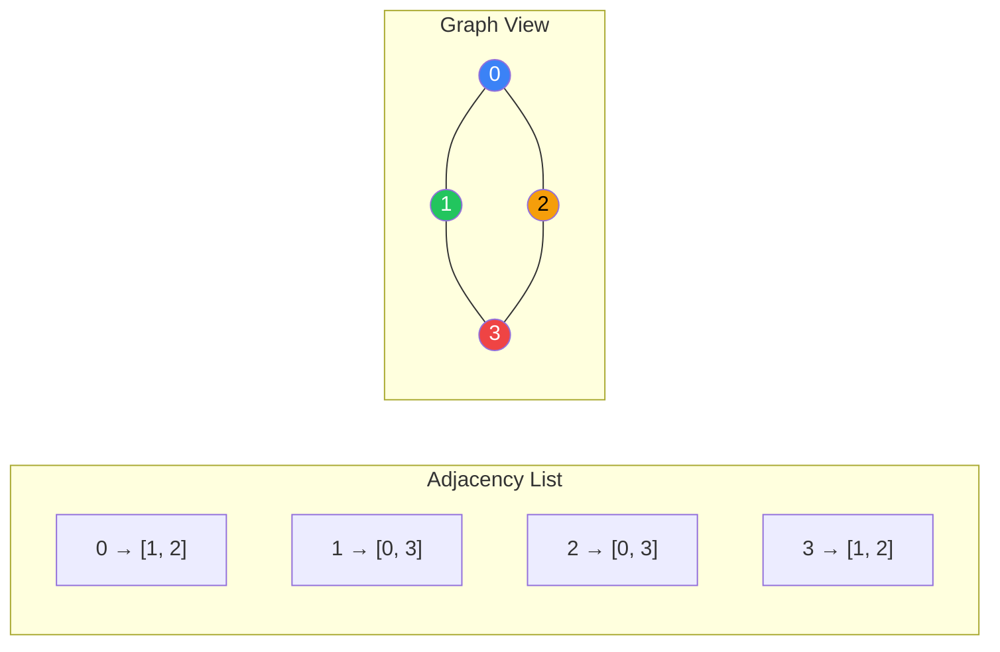
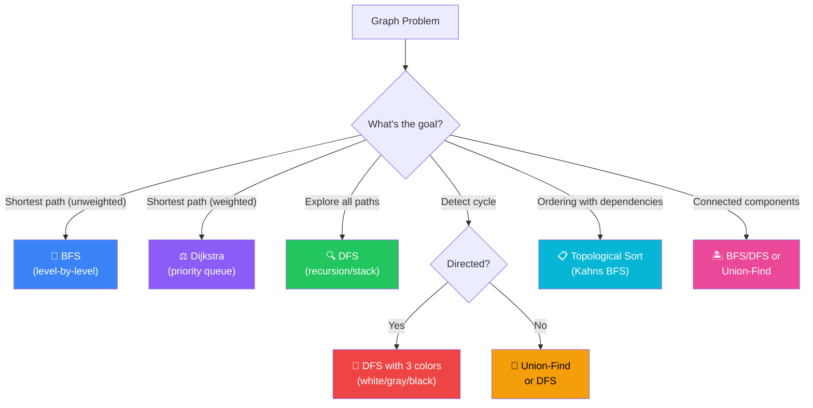
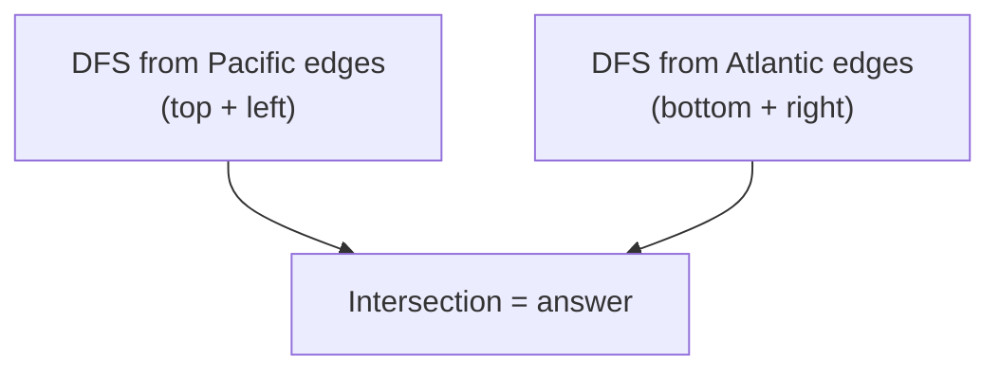

[🏠 Home](../../README.md) | [⬅️ Heaps](../09-heaps-priority-queues/00-overview.md) | [➡️ Backtracking](../11-backtracking/00-overview.md)

# 🕸️ Graph Patterns

> Traversing connections and finding paths

---

## 🎯 When to Use

| Clue | Pattern |
|------|---------|
| "Shortest path (unweighted)" | BFS |
| "Explore all paths / Maze" | DFS |
| "Detect cycle (directed)" | DFS (Recursion stack) |
| "Detect cycle (undirected)" | Union-Find or DFS |
| "Course prerequisites" | Topological Sort |
| "Connected components" | BFS/DFS/Union-Find |
| "Network delay / Cheapest flight" | Dijkstra (Weighted BFS) |

---

## 🧠 WHY Graph Algorithms Work: The Developer's Guide

> **🎯 For Beginners:** Graphs are everywhere - social networks, maps, dependencies. Master these patterns!

### The Core Insight: Everything is Connected

```
Graph = Nodes + Edges

Real-world graphs:
  ├── Social Network: People = nodes, Friendships = edges
  ├── Map: Cities = nodes, Roads = edges
  ├── Dependencies: Courses = nodes, Prerequisites = edges
  └── Web: Pages = nodes, Links = edges

Once you see the graph structure, patterns apply!
```

### BFS vs DFS: When to Use Which

```
BFS (Breadth-First Search):
  Explores LEVEL BY LEVEL (like ripples in water)
  
  Uses: Queue
  Perfect for: SHORTEST PATH (unweighted)
  
  Why? First time you reach a node is the shortest way!
  
       1         Level 0
      / \
     2   3       Level 1 (distance 1 from start)
    / \   \
   4   5   6     Level 2 (distance 2 from start)

DFS (Depth-First Search):
  Explores ONE PATH FULLY before backtracking
  
  Uses: Recursion / Stack
  Perfect for: ALL PATHS, cycle detection, connected components
  
  Why? Goes deep, then backtracks = explores all possibilities
```

### Cycle Detection: The Intuition

```
DIRECTED Graph (like course prerequisites):
  
  ❌ Cycle = IMPOSSIBLE to complete!
     A → B → C → A (circular dependency)
     
  Detection: If we visit a node that's CURRENTLY in our path
  
  States: WHITE (unvisited) → GRAY (processing) → BLACK (done)
  Cycle exists if we hit a GRAY node!

UNDIRECTED Graph:
  
  Detection: If we visit a node that's not our parent
  (Going back to where we came from is OK)
```

### Union-Find: Grouping Magic

```
"Are A and B connected?" - O(1) answer!

Key Insight: Each group has one "representative"

Initially: [0] [1] [2] [3] [4]
           Each node is its own group

Union(0, 1): [0, 1] [2] [3] [4]
             0 is the representative of {0, 1}

Union(1, 2): [0, 1, 2] [3] [4]
             All point to 0

Find(2) = Find(1) = Find(0) = 0

Are 0 and 2 connected? Find(0) == Find(2)? YES!
```

### Topological Sort: The Dependency Resolver

```
Course Schedule: What order to take courses?

Prerequisites: 
  Course 1 → Course 2 (take 1 before 2)
  Course 1 → Course 3
  Course 2 → Course 4

Topological Order: 1 → 2 → 3 → 4
                   or 1 → 3 → 2 → 4

Key: Process nodes with no incoming edges first!
If we can't process all nodes → CYCLE exists
```

### Thought Process Template

```
🧠 "How do I approach this graph problem?"

1. Is it a shortest path problem?
   → Unweighted: BFS
   → Weighted: Dijkstra

2. Need all paths or combinations?
   → DFS with backtracking

3. Detect cycle?
   → Directed: DFS with color/state
   → Undirected: Union-Find or DFS

4. Dependency ordering?
   → Topological Sort (Kahn's algorithm)

5. Count connected components?
   → BFS/DFS from each unvisited, or Union-Find
```

---

## 📊 Graph Representations — Visual



### 🧭 Graph Algorithm Selector



---

## 🔧 Core Traversals

### 1. BFS (Shortest Path)

```java
// Find shortest path from start to target in unweighted graph
public int bfs(int start, int target, List<List<Integer>> adj) {
    Queue<Integer> queue = new LinkedList<>();
    boolean[] visited = new boolean[adj.size()];
    
    queue.offer(start);
    visited[start] = true;
    int distance = 0;
    
    while (!queue.isEmpty()) {
        int size = queue.size();
        for (int i = 0; i < size; i++) {
            int node = queue.poll();
            if (node == target) return distance;
            
            for (int neighbor : adj.get(node)) {
                if (!visited[neighbor]) {
                    visited[neighbor] = true;
                    queue.offer(neighbor);
                }
            }
        }
        distance++;
    }
    return -1;
}
```

### 2. DFS (Exploration)

```java
// Visit all nodes in connected component
public void dfs(int node, List<List<Integer>> adj, boolean[] visited) {
    visited[node] = true;
    process(node);
    
    for (int neighbor : adj.get(node)) {
        if (!visited[neighbor]) {
            dfs(neighbor, adj, visited);
        }
    }
}
```

### 3. Grid Traversal (Implicit Graph)

```java
int[][] dirs = {{0,1}, {0,-1}, {1,0}, {-1,0}};

public void dfsGrid(int[][] grid, int r, int c, boolean[][] visited) {
    if (r < 0 || c < 0 || r >= grid.length || c >= grid[0].length || 
        visited[r][c] || grid[r][c] == 0) {
        return;
    }
    
    visited[r][c] = true;
    
    for (int[] d : dirs) {
        dfsGrid(grid, r + d[0], c + d[1], visited);
    }
}
```

---

## 💻 Core Problems

### Problem 1: Number of Islands

```java
public int numIslands(char[][] grid) {
    if (grid == null || grid.length == 0) return 0;
    
    int count = 0;
    int m = grid.length, n = grid[0].length;
    
    for (int i = 0; i < m; i++) {
        for (int j = 0; j < n; j++) {
            if (grid[i][j] == '1') {
                count++;
                dfs(grid, i, j);
            }
        }
    }
    return count;
}

private void dfs(char[][] grid, int r, int c) {
    if (r < 0 || c < 0 || r >= grid.length || c >= grid[0].length || grid[r][c] == '0') {
        return;
    }
    
    grid[r][c] = '0';  // Mark as visited by sinking
    
    dfs(grid, r+1, c);
    dfs(grid, r-1, c);
    dfs(grid, r, c+1);
    dfs(grid, r, c-1);
}
```

**Visualization**:
```
1 1 0 0 0    →    0 0 0 0 0
1 1 0 0 0         0 0 0 0 0
0 0 1 0 0         0 0 0 0 0
0 0 0 1 1         0 0 0 0 0
Island #1 found, sink neighbors. Then #2, #3. Total = 3
```

**Complexity**: Time O(m×n). Space O(m×n) worst-case recursion.

---

### Problem 2: Course Schedule (Topological Sort)

```java
// Can you finish all courses? (Cycle detection)
public boolean canFinish(int numCourses, int[][] prerequisites) {
    List<List<Integer>> adj = new ArrayList<>();
    for (int i = 0; i < numCourses; i++) adj.add(new ArrayList<>());
    
    int[] inDegree = new int[numCourses];
    for (int[] pr : prerequisites) {
        adj.get(pr[1]).add(pr[0]);
        inDegree[pr[0]]++;
    }
    
    Queue<Integer> queue = new LinkedList<>();
    for (int i = 0; i < numCourses; i++) {
        if (inDegree[i] == 0) queue.offer(i);
    }
    
    int count = 0;
    while (!queue.isEmpty()) {
        int course = queue.poll();
        count++;
        
        for (int neighbor : adj.get(course)) {
            inDegree[neighbor]--;
            if (inDegree[neighbor] == 0) {
                queue.offer(neighbor);
            }
        }
    }
    
    return count == numCourses;
}
```

**Visualization (Kahn's Algorithm)**:
```
numCourses=4, prereqs=[[1,0],[2,0],[3,1],[3,2]]

Graph:  0 → 1 → 3
        0 → 2 → 3

In-degrees: [0:0, 1:1, 2:1, 3:2]

Queue starts: [0]  (in-degree 0)
Poll 0: count=1. Decrement 1→0, 2→0 → queue=[1, 2]
Poll 1: count=2. Decrement 3→1 → queue=[2]
Poll 2: count=3. Decrement 3→0 → queue=[3]
Poll 3: count=4. No neighbors.

count(4) == numCourses(4) → true ✅ (no cycle)
```

**Complexity**: Time O(V+E). Space O(V+E).

---

### Problem 3: Clone Graph

```java
// Deep copy of connected graph
public Node cloneGraph(Node node) {
    if (node == null) return null;
    
    Map<Node, Node> visited = new HashMap<>(); // Original -> Clone
    
    return dfsClone(node, visited);
}

private Node dfsClone(Node node, Map<Node, Node> visited) {
    if (visited.containsKey(node)) return visited.get(node);
    
    Node clone = new Node(node.val);
    visited.put(node, clone);
    
    for (Node neighbor : node.neighbors) {
        clone.neighbors.add(dfsClone(neighbor, visited));
    }
    return clone;
}
```

**Visualization**:
```
Original:  1 --- 2       Clone:  1' --- 2'
           |     |               |      |
           4 --- 3               4' --- 3'

DFS from 1: create 1', recurse to neighbors
  Visit 2: create 2', recurse...
    Visit 3: create 3'. Visit 4→already cloned as 4' ✅
  Visit 4: create 4'. Visit 1→already cloned as 1' ✅

💡 HashMap prevents infinite loops and enables reconnecting clones.
```

**Complexity**: Time O(V+E). Space O(V).

---

### Problem 4: Pacific Atlantic Water Flow

```java
public List<List<Integer>> pacificAtlantic(int[][] heights) {
    int m = heights.length, n = heights[0].length;
    boolean[][] pacific = new boolean[m][n];
    boolean[][] atlantic = new boolean[m][n];
    
    // DFS from borders inward
    for (int i = 0; i < m; i++) {
        dfs(heights, pacific, i, 0, Integer.MIN_VALUE);      // Left border
        dfs(heights, atlantic, i, n-1, Integer.MIN_VALUE);   // Right border
    }
    for (int j = 0; j < n; j++) {
        dfs(heights, pacific, 0, j, Integer.MIN_VALUE);      // Top border
        dfs(heights, atlantic, m-1, j, Integer.MIN_VALUE);   // Bottom border
    }
    
    List<List<Integer>> result = new ArrayList<>();
    for (int i = 0; i < m; i++) {
        for (int j = 0; j < n; j++) {
            if (pacific[i][j] && atlantic[i][j]) {
                result.add(Arrays.asList(i, j));
            }
        }
    }
    return result;
}

private void dfs(int[][] h, boolean[][] visited, int r, int c, int prevH) {
    if (r<0 || c<0 || r>=h.length || c>=h[0].length || visited[r][c] || h[r][c] < prevH)
        return;
    
    visited[r][c] = true;
    dfs(h, visited, r+1, c, h[r][c]);
    dfs(h, visited, r-1, c, h[r][c]);
    dfs(h, visited, r, c+1, h[r][c]);
    dfs(h, visited, r, c-1, h[r][c]);
}
```

**Visualization**:
```
Heights:  1  2  2  3  5
          3  2  3  4  4
          2  4  5  3  1
          6  7  1  4  5

Pacific touches: top + left borders
Atlantic touches: bottom + right borders

DFS from Pacific borders (can reach ↑): marks reachable cells
DFS from Atlantic borders (can reach ↓): marks reachable cells
Result = intersection of both sets

💡 Reverse thinking: instead of "where does water flow?"
   ask "what cells can reach each ocean?" (DFS from ocean borders inward)
```

**Complexity**: Time O(m×n). Space O(m×n).

---

### Problem 5: Union-Find (Disjoint Set)

Used for connected components, cycle detection in undirected graphs.

```java
class UnionFind {
    int[] parent;
    int[] rank;
    
    public UnionFind(int n) {
        parent = new int[n];
        rank = new int[n];
        for (int i = 0; i < n; i++) parent[i] = i;
    }
    
    public int find(int x) {
        if (parent[x] != x) {
            parent[x] = find(parent[x]); // Path compression
        }
        return parent[x];
    }
    
    public boolean union(int x, int y) {
        int rootX = find(x);
        int rootY = find(y);
        
        if (rootX == rootY) return false; // Already connected
        
        if (rank[rootX] > rank[rootY]) {
            parent[rootY] = rootX;
        } else if (rank[rootX] < rank[rootY]) {
            parent[rootX] = rootY;
        } else {
            parent[rootY] = rootX;
            rank[rootX]++;
        }
        return true;
    }
}
```

**Use Case**: Number of Connected Components in an Undirected Graph.

**Visualization**:
```
Nodes: {0, 1, 2, 3, 4}. Edges: (0,1), (1,2), (3,4)

Initially: parent = [0,1,2,3,4] (each is own parent)

union(0,1): parent[1]=0 → {0,1} {2} {3} {4}
union(1,2): find(1)=0, parent[2]=0 → {0,1,2} {3} {4}
union(3,4): parent[4]=3 → {0,1,2} {3,4}

Connected components = 2 ✅

💡 Path compression: find(2) → 2→1→0, compress to 2→0 directly.
   Union by rank: always attach shorter tree under taller.
```

**Complexity**: Time O(α(n)) ≈ O(1) amortized per operation. Space O(n).

---

## 📊 Complexity Summary

| Algorithm | Time | Space |
|-----------|------|-------|
| BFS/DFS (Adjacency List) | O(V + E) | O(V) |
| BFS/DFS (Matrix) | O(R * C) | O(R * C) |
| Topological Sort | O(V + E) | O(V) |
| Union-Find | O(α(N)) ≈ O(1) | O(N) |

---

## 📝 Practice Problems — Detailed Solutions

| # | Problem | Difficulty | Link | Key Insight |
|---|---------|------------|------|-------------|
| 1 | Number of Islands | 🟡 Medium | [LeetCode](https://leetcode.com/problems/number-of-islands/) | Grid DFS/BFS |
| 2 | Clone Graph | 🟡 Medium | [LeetCode](https://leetcode.com/problems/clone-graph/) | HashMap visited |
| 3 | Max Area of Island | 🟡 Medium | [LeetCode](https://leetcode.com/problems/max-area-of-island/) | DFS counting |
| 4 | Pacific Atlantic | 🟡 Medium | [LeetCode](https://leetcode.com/problems/pacific-atlantic-water-flow/) | DFS from borders |
| 5 | Course Schedule | 🟡 Medium | [LeetCode](https://leetcode.com/problems/course-schedule/) | Topo Sort |
| 6 | Rotting Oranges | 🟡 Medium | [LeetCode](https://leetcode.com/problems/rotting-oranges/) | Multi-source BFS |
| 7 | Word Ladder | 🔴 Hard | [LeetCode](https://leetcode.com/problems/word-ladder/) | BFS shortest path |

---

### Problem 1: Number of Islands 🟡

> **Given** a 2D grid of '1's (land) and '0's (water), count the number of islands.

#### ✅ Optimal: DFS Flood Fill — O(R×C) Time, O(R×C) Space

```java
public int numIslands(char[][] grid) {
    int count = 0;
    for (int r = 0; r < grid.length; r++) {
        for (int c = 0; c < grid[0].length; c++) {
            if (grid[r][c] == '1') {
                count++;
                dfs(grid, r, c);  // sink the entire island
            }
        }
    }
    return count;
}

private void dfs(char[][] grid, int r, int c) {
    if (r < 0 || c < 0 || r >= grid.length || c >= grid[0].length || grid[r][c] == '0')
        return;
    grid[r][c] = '0';  // mark visited (sink)
    dfs(grid, r+1, c); dfs(grid, r-1, c);
    dfs(grid, r, c+1); dfs(grid, r, c-1);
}
```

```
Example:
1 1 0 0 0      0 0 0 0 0
1 1 0 0 0  →   0 0 0 0 0    Island 1 (sunk)
0 0 1 0 0      0 0 0 0 0    Island 2 (sunk)
0 0 0 1 1      0 0 0 0 0    Island 3 (sunk)

Count = 3 ✅

💡 DFS "sinks" each island by marking '1' → '0'.
   Each cell visited at most once → O(R×C).
```

---

### Problem 2: Clone Graph 🟡

> **Given** a reference of a node in an undirected graph, return a deep copy.

#### ✅ Optimal: BFS/DFS + HashMap — O(V+E) Time, O(V) Space

```java
public Node cloneGraph(Node node) {
    if (node == null) return null;
    
    Map<Node, Node> map = new HashMap<>();
    map.put(node, new Node(node.val));
    
    Queue<Node> queue = new LinkedList<>();
    queue.offer(node);
    
    while (!queue.isEmpty()) {
        Node curr = queue.poll();
        for (Node neighbor : curr.neighbors) {
            if (!map.containsKey(neighbor)) {
                map.put(neighbor, new Node(neighbor.val));
                queue.offer(neighbor);
            }
            map.get(curr).neighbors.add(map.get(neighbor));
        }
    }
    return map.get(node);
}
```

```
💡 HashMap serves dual purpose:
   1. Tracks visited nodes (prevents infinite loops in cycles)
   2. Maps original → clone (links new nodes)
```

---

### Problem 3: Max Area of Island 🟡

> **Given** a grid, find the island with the maximum area.

#### ✅ Optimal: DFS with area counting — O(R×C) Time

```java
public int maxAreaOfIsland(int[][] grid) {
    int maxArea = 0;
    for (int r = 0; r < grid.length; r++) {
        for (int c = 0; c < grid[0].length; c++) {
            if (grid[r][c] == 1) {
                maxArea = Math.max(maxArea, dfs(grid, r, c));
            }
        }
    }
    return maxArea;
}

private int dfs(int[][] grid, int r, int c) {
    if (r < 0 || c < 0 || r >= grid.length || c >= grid[0].length || grid[r][c] == 0)
        return 0;
    grid[r][c] = 0;  // mark visited
    return 1 + dfs(grid, r+1, c) + dfs(grid, r-1, c)
             + dfs(grid, r, c+1) + dfs(grid, r, c-1);
}
```

```
💡 Same as Number of Islands, but DFS RETURNS a count.
   Each recursive call returns 1 (for itself) + sum of neighbors.
```

---

### Problem 4: Pacific Atlantic Water Flow 🟡

> **Given** heights matrix, find cells that can flow to both Pacific and Atlantic oceans.

#### 🧠 Approach Diagram



#### ✅ Optimal: Reverse DFS from Borders — O(R×C) Time

```java
public List<List<Integer>> pacificAtlantic(int[][] heights) {
    int m = heights.length, n = heights[0].length;
    boolean[][] pacific = new boolean[m][n], atlantic = new boolean[m][n];
    
    for (int r = 0; r < m; r++) {
        dfs(heights, pacific, r, 0, 0);       // left edge (Pacific)
        dfs(heights, atlantic, r, n-1, 0);    // right edge (Atlantic)
    }
    for (int c = 0; c < n; c++) {
        dfs(heights, pacific, 0, c, 0);       // top edge (Pacific)
        dfs(heights, atlantic, m-1, c, 0);    // bottom edge (Atlantic)
    }
    
    List<List<Integer>> result = new ArrayList<>();
    for (int r = 0; r < m; r++)
        for (int c = 0; c < n; c++)
            if (pacific[r][c] && atlantic[r][c])
                result.add(Arrays.asList(r, c));
    return result;
}

private void dfs(int[][] h, boolean[][] visited, int r, int c, int prev) {
    if (r<0 || c<0 || r>=h.length || c>=h[0].length || visited[r][c] || h[r][c]<prev)
        return;
    visited[r][c] = true;
    dfs(h, visited, r+1, c, h[r][c]); dfs(h, visited, r-1, c, h[r][c]);
    dfs(h, visited, r, c+1, h[r][c]); dfs(h, visited, r, c-1, h[r][c]);
}
```

```
💡 REVERSE THINKING: Instead of "can water flow FROM cell TO ocean",
   ask "can ocean REACH cell?" (DFS uphill from ocean edges).
   Cells reachable by BOTH oceans are the answer.
```

---

### Problem 5: Course Schedule 🟡

> **Given** prerequisites, determine if you can finish all courses (cycle detection).

#### ✅ Optimal: Topological Sort (BFS/Kahn's) — O(V+E) Time

```java
public boolean canFinish(int numCourses, int[][] prerequisites) {
    int[] inDegree = new int[numCourses];
    List<List<Integer>> adj = new ArrayList<>();
    for (int i = 0; i < numCourses; i++) adj.add(new ArrayList<>());
    
    for (int[] pre : prerequisites) {
        adj.get(pre[1]).add(pre[0]);
        inDegree[pre[0]]++;
    }
    
    Queue<Integer> queue = new LinkedList<>();
    for (int i = 0; i < numCourses; i++)
        if (inDegree[i] == 0) queue.offer(i);
    
    int completed = 0;
    while (!queue.isEmpty()) {
        int course = queue.poll();
        completed++;
        for (int next : adj.get(course)) {
            if (--inDegree[next] == 0) queue.offer(next);
        }
    }
    return completed == numCourses;  // all courses completed = no cycle
}
```

```
Example: n=4, prereqs=[[1,0],[2,0],[3,1],[3,2]]
         0 → 1 → 3
         0 → 2 → 3

inDegree: [0, 1, 1, 2]
Queue: [0] → process 0, reduce 1,2
Queue: [1, 2] → process 1, reduce 3
Queue: [2] → process 2, reduce 3
Queue: [3] → process 3
completed=4 == numCourses=4 → true ✅

💡 If cycle exists, some nodes never reach inDegree 0,
   so completed < numCourses → return false.
```

---

### Problem 6: Rotting Oranges 🟡

> **Given** a grid with fresh(1) and rotten(2) oranges, find minutes until all rotten.

#### ✅ Optimal: Multi-source BFS — O(R×C) Time

```java
public int orangesRotting(int[][] grid) {
    Queue<int[]> queue = new LinkedList<>();
    int fresh = 0;
    
    // Add ALL rotten oranges to queue (multi-source)
    for (int r = 0; r < grid.length; r++)
        for (int c = 0; c < grid[0].length; c++) {
            if (grid[r][c] == 2) queue.offer(new int[]{r, c});
            else if (grid[r][c] == 1) fresh++;
        }
    
    int minutes = 0;
    int[][] dirs = {{1,0},{-1,0},{0,1},{0,-1}};
    
    while (!queue.isEmpty() && fresh > 0) {
        minutes++;
        int size = queue.size();
        for (int i = 0; i < size; i++) {
            int[] cell = queue.poll();
            for (int[] d : dirs) {
                int r = cell[0]+d[0], c = cell[1]+d[1];
                if (r>=0 && c>=0 && r<grid.length && c<grid[0].length && grid[r][c]==1) {
                    grid[r][c] = 2;
                    fresh--;
                    queue.offer(new int[]{r, c});
                }
            }
        }
    }
    return fresh == 0 ? minutes : -1;
}
```

```
Example:
2 1 1      2 2 1      2 2 2      2 2 2
1 1 0  →   2 1 0  →   2 2 0  →   2 2 0
0 1 1      0 1 1      0 1 1      0 2 1   → 1 more = 4 min

💡 MULTI-SOURCE BFS: All rotten oranges start simultaneously.
   Each BFS level = 1 minute. When fresh==0, we're done.
```

---

### Problem 7: Word Ladder 🔴

> **Given** beginWord, endWord, and wordList, find shortest transformation sequence.

#### ✅ Optimal: BFS — O(M² × N) Time (M=word length, N=wordList size)

```java
public int ladderLength(String beginWord, String endWord, List<String> wordList) {
    Set<String> wordSet = new HashSet<>(wordList);
    if (!wordSet.contains(endWord)) return 0;
    
    Queue<String> queue = new LinkedList<>();
    queue.offer(beginWord);
    int steps = 1;
    
    while (!queue.isEmpty()) {
        int size = queue.size();
        for (int i = 0; i < size; i++) {
            char[] word = queue.poll().toCharArray();
            
            for (int j = 0; j < word.length; j++) {
                char original = word[j];
                for (char c = 'a'; c <= 'z'; c++) {
                    word[j] = c;
                    String newWord = new String(word);
                    
                    if (newWord.equals(endWord)) return steps + 1;
                    if (wordSet.contains(newWord)) {
                        queue.offer(newWord);
                        wordSet.remove(newWord);  // mark visited
                    }
                }
                word[j] = original;
            }
        }
        steps++;
    }
    return 0;
}
```

```
Example: "hit" → "cog", wordList = ["hot","dot","dog","lot","log","cog"]

BFS Level 1: hit
BFS Level 2: hot (h→h, i→o)
BFS Level 3: dot, lot
BFS Level 4: dog, log
BFS Level 5: cog ← FOUND!

Return 5 ✅

💡 BFS guarantees shortest path!
   Try all 26 letter substitutions at each position.
   Remove from wordSet when visited to prevent cycles.
```

---

## 📊 Complexity Comparison

| # | Problem | Time | Space | Technique |
|---|---------|------|-------|-----------|
| 1 | Number of Islands | O(R×C) | O(R×C) | DFS flood fill |
| 2 | Clone Graph | O(V+E) | O(V) | BFS + HashMap |
| 3 | Max Area of Island | O(R×C) | O(R×C) | DFS counting |
| 4 | Pacific Atlantic | O(R×C) | O(R×C) | Reverse DFS |
| 5 | Course Schedule | O(V+E) | O(V+E) | Topological sort |
| 6 | Rotting Oranges | O(R×C) | O(R×C) | Multi-source BFS |
| 7 | Word Ladder | O(M²×N) | O(M×N) | BFS shortest path |

---

*Next: [Backtracking →](../11-backtracking/00-overview.md)*
