[🏠 Home](../../README.md) | [⬅️ Graphs](../10-graphs/00-overview.md) | [➡️ Dynamic Programming](../12-dynamic-programming/00-overview.md)

# 🔙 Backtracking Pattern

> Exhaustive search with pruning: "Try, Fail, Undo"

---

## 🎯 When to Use

| Clue | Pattern |
|------|---------|
| "Find all combinations" | Subsets / Combinations |
| "Find all permutations" | Permutations |
| "Find one valid solution" | Sudoku / N-Queens |
| "Partition string" | Palindrome Partitioning |
| "Constraints check" | Constraint Satisfaction |

---

## 🧠 WHY Backtracking Works: The Developer's Guide

> **🎯 For Beginners:** Backtracking = Smart brute force. Explore ALL possibilities, but PRUNE bad paths early!

### The Core Insight: Decision Tree Exploration

```
Problem: Generate all subsets of [1, 2]

Every element is a YES/NO decision:

                 []
                /  \
         [1]         []          ← Include 1 or not?
          / \        / \
    [1,2] [1]    [2]  []        ← Include 2 or not?
    
Result: [1,2], [1], [2], []

Backtracking = DFS on this decision tree!
```

### Why "Undo" is the Key

```
The backtrack step is what makes it work:

1. MAKE a choice     → state.add(choice)
2. EXPLORE           → backtrack(state)
3. UNDO the choice   → state.remove()   ← CRITICAL!

Without undo, state accumulates wrongly:

❌ Without backtrack:
   [1] → [1,2] → [1,2,3] ... stuck with everything!
   
✅ With backtrack:
   [1] → [1,2] → undo → [1,3] → undo → undo → [2] → ...

The undo restores state for the next branch!
```

### Pruning: Why Backtracking Beats Brute Force

```
Combination Sum: Find combinations summing to 7 from [2, 3, 6, 7]

❌ Brute Force: Try ALL 2^n subsets, then filter
   2^4 = 16 subsets to check

✅ Backtracking with pruning:
   [2] → sum=2, continue
   [2,2] → sum=4, continue
   [2,2,2] → sum=6, continue
   [2,2,2,2] → sum=8 > 7 → PRUNE! (stop this branch entirely)
   
   Skip exploration of [2,2,2,2,*] and beyond!
   
Pruning cuts branches before exploring them = huge savings!
```

### The 3 Types of Backtracking Problems

```
1. SUBSETS (Power Set):
   - Every state is valid
   - No length requirement
   - Add current state at each node

2. COMBINATIONS (k elements):
   - Only add when length == k
   - Use 'start' index to avoid duplicates

3. PERMUTATIONS (all orderings):
   - Every element used exactly once
   - Check if element already used
```

### Thought Process Template

```
🧠 "Is this a backtracking problem?"

1. Need to find ALL solutions?
   → Yes: Likely backtracking

2. Need to find ANY valid solution?
   → Yes: Backtracking (return early when found)

3. Can I make choices and undo them?
   → Yes: Backtracking framework applies

4. Can I identify invalid choices early?
   → Yes: Add pruning for efficiency

Template:
   backtrack(state):
     if goal_reached: save_result
     for each choice:
       if valid(choice):
         make_choice()
         backtrack()
         undo_choice()
```

---

## 📊 Backtracking — Decision Tree Visual

```mermaid
graph TD
    ROOT["Start: []"] --> A["Include 1?"]
    A -- Yes --> B["[1]"]
    A -- No --> C["[]"]
    B --> D["Include 2?"]
    D -- Yes --> E["[1,2] ✅"]
    D -- No --> F["[1] ✅"]
    C --> G["Include 2?"]
    G -- Yes --> H["[2] ✅"]
    G -- No --> I["[] ✅"]

    style ROOT fill:#6366f1,color:#fff
    style E fill:#22c55e,color:#fff
    style F fill:#22c55e,color:#fff
    style H fill:#22c55e,color:#fff
    style I fill:#22c55e,color:#fff
    style A fill:#f59e0b,color:#000
    style D fill:#f59e0b,color:#000
    style G fill:#f59e0b,color:#000
```



> Every leaf is a valid subset. The tree explores all 2ⁿ possibilities.

### 🧭 Backtracking Type Selector

```mermaid
flowchart TD
    A["Backtracking Problem"] --> B{"What are you finding?"}
    B -- "All subsets" --> C["📦 Subsets\n(every state is valid)"]
    B -- "Select k elements" --> D["🎯 Combinations\n(add at length k)"]
    B -- "All orderings" --> E["🔀 Permutations\n(use each once)"]
    B -- "Valid configuration" --> F["🧩 Constraint Satisfaction\n(Sudoku, N-Queens)"]
    B -- "Path in grid/string" --> G["🗺️ Grid/String DFS\n(mark visited, backtrack)"]

    C --> H["Use start index\nNo duplicates"]
    D --> H
    E --> I["Use visited array\nCheck all elements"]

    style C fill:#3b82f6,color:#fff
    style D fill:#22c55e,color:#fff
    style E fill:#8b5cf6,color:#fff
    style F fill:#ef4444,color:#fff
    style G fill:#f59e0b,color:#000
```



---

## 🔧 Core Template

```java
public void backtrack(State state) {
    // 1. Base case: Goal reached
    if (isSolution(state)) {
        res.add(new ArrayList<>(state));
        return;
    }
    
    // 2. Iterate through choices
    for (Choice choice : choices) {
        if (isValid(choice)) {
            // 3. Make choice
            state.add(choice);
            
            // 4. Recurse
            backtrack(state);
            
            // 5. Undo choice (Backtrack)
            state.remove(state.size() - 1);
        }
    }
}
```

---

## 💻 Core Problems

### Problem 1: Subsets (Power Set)

```java
// Findings all unique subsets of [1, 2, 3]
public List<List<Integer>> subsets(int[] nums) {
    List<List<Integer>> result = new ArrayList<>();
    backtrack(nums, 0, new ArrayList<>(), result);
    return result;
}

private void backtrack(int[] nums, int start, List<Integer> curr, List<List<Integer>> result) {
    // Every state is a valid subset
    result.add(new ArrayList<>(curr));
    
    for (int i = start; i < nums.length; i++) {
        curr.add(nums[i]);       // Include
        backtrack(nums, i + 1, curr, result);
        curr.remove(curr.size() - 1); // Exclude
    }
}
```

**Visualization**:
```
[]
 ├── [1]
 │    ├── [1,2]
 │    │    └── [1,2,3]
 │    └── [1,3]
 ├── [2]
 │    └── [2,3]
 └── [3]
```

---

### Problem 2: Permutations

```java
// All orderings of [1, 2, 3]
public List<List<Integer>> permute(int[] nums) {
    List<List<Integer>> result = new ArrayList<>();
    backtrack(nums, new ArrayList<>(), result);
    return result;
}

private void backtrack(int[] nums, List<Integer> curr, List<List<Integer>> result) {
    if (curr.size() == nums.length) {
        result.add(new ArrayList<>(curr));
        return;
    }
    
    for (int num : nums) {
        if (curr.contains(num)) continue; // Skip used
        
        curr.add(num);
        backtrack(nums, curr, result);
        curr.remove(curr.size() - 1);
    }
}
```

**Note**: For better performance than `contains`, use a boolean `used` array.

---

### Problem 3: Combination Sum

```java
// Find combinations that sum to target (reuse allowed)
public List<List<Integer>> combinationSum(int[] candidates, int target) {
    List<List<Integer>> result = new ArrayList<>();
    backtrack(candidates, target, 0, new ArrayList<>(), result);
    return result;
}

private void backtrack(int[] candidates, int remain, int start, 
                      List<Integer> curr, List<List<Integer>> result) {
    if (remain == 0) {
        result.add(new ArrayList<>(curr));
        return;
    }
    if (remain < 0) return;
    
    for (int i = start; i < candidates.length; i++) {
        curr.add(candidates[i]);
        // i (not i+1) because we can reuse same element
        backtrack(candidates, remain - candidates[i], i, curr, result);
        curr.remove(curr.size() - 1);
    }
}
```

---

### Problem 4: Word Search (2D Grid)

```java
public boolean exist(char[][] board, String word) {
    for (int i = 0; i < board.length; i++) {
        for (int j = 0; j < board[0].length; j++) {
            if (dfs(board, i, j, word, 0)) return true;
        }
    }
    return false;
}

private boolean dfs(char[][] board, int r, int c, String word, int idx) {
    if (idx == word.length()) return true;
    
    if (r < 0 || c < 0 || r >= board.length || c >= board[0].length || 
        board[r][c] != word.charAt(idx)) {
        return false;
    }
    
    char temp = board[r][c];
    board[r][c] = '#';  // Mark visited
    
    boolean found = dfs(board, r+1, c, word, idx+1) ||
                   dfs(board, r-1, c, word, idx+1) ||
                   dfs(board, r, c+1, word, idx+1) ||
                   dfs(board, r, c-1, word, idx+1);
                   
    board[r][c] = temp; // Backtrack
    return found;
}
```

---

## 🧠 Permutations vs Combinations vs Subsets

| Problem | Order Matters? | Distinct Length? | Logic |
|---------|---------------|------------------|-------|
| **Permutations** | Yes | n | Use every element once |
| **Combinations** | No | k | Select k elements |
| **Subsets** | No | 0 to n | Select any number |

**Duplicate Handling** (`nums = [1, 2, 2]`):
Sort array first.
```java
if (i > start && nums[i] == nums[i-1]) continue;
```

---

## 📊 Complexity Summary

| Problem | Time | Space |
|---------|------|-------|
| Subsets | O(n * 2ⁿ) | O(n) |
| Permutations | O(n * n!) | O(n) |
| Combination Sum | O(Target/MinVal) | O(Target/MinVal) |
| Word Search | O(R*C * 3ᴸ) | O(L) |

---

## 📝 Practice Problems

| # | Problem | Difficulty | Link | Key Insight |
|---|---------|------------|------|-------------|
| 1 | Subsets | 🟡 Medium | [LeetCode](https://leetcode.com/problems/subsets/) | Include vs Exclude |
| 2 | Combination Sum | 🟡 Medium | [LeetCode](https://leetcode.com/problems/combination-sum/) | Unbounded Knapsack-ish |
| 3 | Permutations | 🟡 Medium | [LeetCode](https://leetcode.com/problems/permutations/) | Used array |
| 4 | Word Search | 🟡 Medium | [LeetCode](https://leetcode.com/problems/word-search/) | Grid DFS + Backtrack |
| 5 | Palindrome Part. | 🟡 Medium | [LeetCode](https://leetcode.com/problems/palindrome-partitioning/) | Check prefix palindrome |
| 6 | N-Queens | 🔴 Hard | [LeetCode](https://leetcode.com/problems/n-queens/) | Diagonals tracking |

---

*Next: [Dynamic Programming →](../12-dynamic-programming/00-overview.md)*
