[🏠 Home](../../README.md) | [⬅️ Graphs](../10-graphs/00-overview.md) | [➡️ Dynamic Programming](../12-dynamic-programming/00-overview.md)

# 🔙 Backtracking Pattern

> Exhaustive search with pruning: "Try, Fail, Undo"

---

## 🎯 When to Use

| Clue | Pattern |
|------|---------|
| "Find all combinations" | Subsets / Combinations |
| "Find all permutations" | Permutations |
| "Find one valid solution" | Sudoku / N-Queens |
| "Partition string" | Palindrome Partitioning |
| "Constraints check" | Constraint Satisfaction |

---

## 🧠 WHY Backtracking Works: The Developer's Guide

> **🎯 For Beginners:** Backtracking = Smart brute force. Explore ALL possibilities, but PRUNE bad paths early!

### The Core Insight: Decision Tree Exploration

```
Problem: Generate all subsets of [1, 2]

Every element is a YES/NO decision:

                 []
                /  \
         [1]         []          ← Include 1 or not?
          / \        / \
    [1,2] [1]    [2]  []        ← Include 2 or not?
    
Result: [1,2], [1], [2], []

Backtracking = DFS on this decision tree!
```

### Why "Undo" is the Key

```
The backtrack step is what makes it work:

1. MAKE a choice     → state.add(choice)
2. EXPLORE           → backtrack(state)
3. UNDO the choice   → state.remove()   ← CRITICAL!

Without undo, state accumulates wrongly:

❌ Without backtrack:
   [1] → [1,2] → [1,2,3] ... stuck with everything!
   
✅ With backtrack:
   [1] → [1,2] → undo → [1,3] → undo → undo → [2] → ...

The undo restores state for the next branch!
```

### Pruning: Why Backtracking Beats Brute Force

```
Combination Sum: Find combinations summing to 7 from [2, 3, 6, 7]

❌ Brute Force: Try ALL 2^n subsets, then filter
   2^4 = 16 subsets to check

✅ Backtracking with pruning:
   [2] → sum=2, continue
   [2,2] → sum=4, continue
   [2,2,2] → sum=6, continue
   [2,2,2,2] → sum=8 > 7 → PRUNE! (stop this branch entirely)
   
   Skip exploration of [2,2,2,2,*] and beyond!
   
Pruning cuts branches before exploring them = huge savings!
```

### The 3 Types of Backtracking Problems

```
1. SUBSETS (Power Set):
   - Every state is valid
   - No length requirement
   - Add current state at each node

2. COMBINATIONS (k elements):
   - Only add when length == k
   - Use 'start' index to avoid duplicates

3. PERMUTATIONS (all orderings):
   - Every element used exactly once
   - Check if element already used
```

### Thought Process Template

```
🧠 "Is this a backtracking problem?"

1. Need to find ALL solutions?
   → Yes: Likely backtracking

2. Need to find ANY valid solution?
   → Yes: Backtracking (return early when found)

3. Can I make choices and undo them?
   → Yes: Backtracking framework applies

4. Can I identify invalid choices early?
   → Yes: Add pruning for efficiency

Template:
   backtrack(state):
     if goal_reached: save_result
     for each choice:
       if valid(choice):
         make_choice()
         backtrack()
         undo_choice()
```

---

## 📊 Backtracking — Decision Tree Visual

```mermaid
graph TD
    ROOT["Start: []"] --> A["Include 1?"]
    A -- Yes --> B["[1]"]
    A -- No --> C["[]"]
    B --> D["Include 2?"]
    D -- Yes --> E["[1,2] ✅"]
    D -- No --> F["[1] ✅"]
    C --> G["Include 2?"]
    G -- Yes --> H["[2] ✅"]
    G -- No --> I["[] ✅"]

    style ROOT fill:#6366f1,color:#fff
    style E fill:#22c55e,color:#fff
    style F fill:#22c55e,color:#fff
    style H fill:#22c55e,color:#fff
    style I fill:#22c55e,color:#fff
    style A fill:#f59e0b,color:#000
    style D fill:#f59e0b,color:#000
    style G fill:#f59e0b,color:#000
```



> Every leaf is a valid subset. The tree explores all 2ⁿ possibilities.

### 🧭 Backtracking Type Selector

```mermaid
flowchart TD
    A["Backtracking Problem"] --> B{"What are you finding?"}
    B -- "All subsets" --> C["📦 Subsets\n(every state is valid)"]
    B -- "Select k elements" --> D["🎯 Combinations\n(add at length k)"]
    B -- "All orderings" --> E["🔀 Permutations\n(use each once)"]
    B -- "Valid configuration" --> F["🧩 Constraint Satisfaction\n(Sudoku, N-Queens)"]
    B -- "Path in grid/string" --> G["🗺️ Grid/String DFS\n(mark visited, backtrack)"]

    C --> H["Use start index\nNo duplicates"]
    D --> H
    E --> I["Use visited array\nCheck all elements"]

    style C fill:#3b82f6,color:#fff
    style D fill:#22c55e,color:#fff
    style E fill:#8b5cf6,color:#fff
    style F fill:#ef4444,color:#fff
    style G fill:#f59e0b,color:#000
```



---

## 🔧 Core Template

```java
public void backtrack(State state) {
    // 1. Base case: Goal reached
    if (isSolution(state)) {
        res.add(new ArrayList<>(state));
        return;
    }
    
    // 2. Iterate through choices
    for (Choice choice : choices) {
        if (isValid(choice)) {
            // 3. Make choice
            state.add(choice);
            
            // 4. Recurse
            backtrack(state);
            
            // 5. Undo choice (Backtrack)
            state.remove(state.size() - 1);
        }
    }
}
```

---

## 💻 Core Problems

### Problem 1: Subsets (Power Set)

```java
// Findings all unique subsets of [1, 2, 3]
public List<List<Integer>> subsets(int[] nums) {
    List<List<Integer>> result = new ArrayList<>();
    backtrack(nums, 0, new ArrayList<>(), result);
    return result;
}

private void backtrack(int[] nums, int start, List<Integer> curr, List<List<Integer>> result) {
    // Every state is a valid subset
    result.add(new ArrayList<>(curr));
    
    for (int i = start; i < nums.length; i++) {
        curr.add(nums[i]);       // Include
        backtrack(nums, i + 1, curr, result);
        curr.remove(curr.size() - 1); // Exclude
    }
}
```

**Visualization**:
```
[]
 ├── [1]
 │    ├── [1,2]
 │    │    └── [1,2,3]
 │    └── [1,3]
 ├── [2]
 │    └── [2,3]
 └── [3]
```

**Complexity**: Time O(n × 2ⁿ). Space O(n) recursion depth.

---

### Problem 2: Permutations

```java
// All orderings of [1, 2, 3]
public List<List<Integer>> permute(int[] nums) {
    List<List<Integer>> result = new ArrayList<>();
    backtrack(nums, new ArrayList<>(), result);
    return result;
}

private void backtrack(int[] nums, List<Integer> curr, List<List<Integer>> result) {
    if (curr.size() == nums.length) {
        result.add(new ArrayList<>(curr));
        return;
    }
    
    for (int num : nums) {
        if (curr.contains(num)) continue; // Skip used
        
        curr.add(num);
        backtrack(nums, curr, result);
        curr.remove(curr.size() - 1);
    }
}
```

**Note**: For better performance than `contains`, use a boolean `used` array.

**Visualization**:
```
nums = [1, 2, 3]

          []
      /    |    \
    [1]   [2]   [3]
   / \     |     |
[1,2][1,3][2,1] [3,1]
  |    |  [2,3] [3,2]
[1,2,3][1,3,2] [2,1,3][2,3,1][3,1,2][3,2,1]

Total: 3! = 6 permutations ✅
```

**Complexity**: Time O(n × n!). Space O(n).

---

### Problem 3: Combination Sum

```java
// Find combinations that sum to target (reuse allowed)
public List<List<Integer>> combinationSum(int[] candidates, int target) {
    List<List<Integer>> result = new ArrayList<>();
    backtrack(candidates, target, 0, new ArrayList<>(), result);
    return result;
}

private void backtrack(int[] candidates, int remain, int start, 
                      List<Integer> curr, List<List<Integer>> result) {
    if (remain == 0) {
        result.add(new ArrayList<>(curr));
        return;
    }
    if (remain < 0) return;
    
    for (int i = start; i < candidates.length; i++) {
        curr.add(candidates[i]);
        // i (not i+1) because we can reuse same element
        backtrack(candidates, remain - candidates[i], i, curr, result);
        curr.remove(curr.size() - 1);
    }
}
```

**Visualization**:
```
candidates = [2, 3, 6, 7], target = 7

                    7
           /      |      \
       -2(5)   -3(4)    -7(0)✅
      /   |      |   \
  -2(3) -3(2) -3(1) -6(-2)✗
   |      |      |
 -2(1) -3(-1)✗ -7(-6)✗
 -3(-2)✗
   |
 -7(-6)✗

Valid: [2,2,3] and [7] ✅
💡 Pass i (not i+1) to reuse same element.
```

**Complexity**: Time O(Target/MinVal). Space O(Target/MinVal).

---

### Problem 4: Word Search (2D Grid)

```java
public boolean exist(char[][] board, String word) {
    for (int i = 0; i < board.length; i++) {
        for (int j = 0; j < board[0].length; j++) {
            if (dfs(board, i, j, word, 0)) return true;
        }
    }
    return false;
}

private boolean dfs(char[][] board, int r, int c, String word, int idx) {
    if (idx == word.length()) return true;
    
    if (r < 0 || c < 0 || r >= board.length || c >= board[0].length || 
        board[r][c] != word.charAt(idx)) {
        return false;
    }
    
    char temp = board[r][c];
    board[r][c] = '#';  // Mark visited
    
    boolean found = dfs(board, r+1, c, word, idx+1) ||
                   dfs(board, r-1, c, word, idx+1) ||
                   dfs(board, r, c+1, word, idx+1) ||
                   dfs(board, r, c-1, word, idx+1);
                   
    board[r][c] = temp; // Backtrack
    return found;
}
```

**Visualization**:
```
board =  A B C E     word = "ABCCED"
         S F C S
         A D E E

Start at (0,0)='A' → match word[0]
  (0,1)='B' → match word[1]
    (0,2)='C' → match word[2]
      (1,2)='C' → match word[3]
        (2,2)='E' → match word[4]
          (2,1)='D' → match word[5] → found! ✅

💡 Mark cell as '#' to prevent revisiting in same path.
   Restore after returning (backtrack). No extra visited array needed.
```

**Complexity**: Time O(R×C × 3^L). Space O(L) where L=word length.

---

## 🧠 Permutations vs Combinations vs Subsets

| Problem | Order Matters? | Distinct Length? | Logic |
|---------|---------------|------------------|-------|
| **Permutations** | Yes | n | Use every element once |
| **Combinations** | No | k | Select k elements |
| **Subsets** | No | 0 to n | Select any number |

**Duplicate Handling** (`nums = [1, 2, 2]`):
Sort array first.
```java
if (i > start && nums[i] == nums[i-1]) continue;
```

---

## 📊 Complexity Summary

| Problem | Time | Space |
|---------|------|-------|
| Subsets | O(n * 2ⁿ) | O(n) |
| Permutations | O(n * n!) | O(n) |
| Combination Sum | O(Target/MinVal) | O(Target/MinVal) |
| Word Search | O(R*C * 3ᴸ) | O(L) |

---

## 📝 Practice Problems — Detailed Solutions

| # | Problem | Difficulty | Link | Key Insight |
|---|---------|------------|------|-------------|
| 1 | Subsets | 🟡 Medium | [LeetCode](https://leetcode.com/problems/subsets/) | Include vs Exclude |
| 2 | Combination Sum | 🟡 Medium | [LeetCode](https://leetcode.com/problems/combination-sum/) | Unbounded Knapsack-ish |
| 3 | Permutations | 🟡 Medium | [LeetCode](https://leetcode.com/problems/permutations/) | Used array |
| 4 | Word Search | 🟡 Medium | [LeetCode](https://leetcode.com/problems/word-search/) | Grid DFS + Backtrack |
| 5 | Palindrome Part. | 🟡 Medium | [LeetCode](https://leetcode.com/problems/palindrome-partitioning/) | Check prefix palindrome |
| 6 | N-Queens | 🔴 Hard | [LeetCode](https://leetcode.com/problems/n-queens/) | Diagonals tracking |

---

### Problem 1: Subsets 🟡

> **Given** a set of distinct integers, return all subsets.

#### 🧠 Decision Tree


#### ✅ Optimal — O(n × 2ⁿ) Time, O(n) Space

```java
public List<List<Integer>> subsets(int[] nums) {
    List<List<Integer>> result = new ArrayList<>();
    backtrack(nums, 0, new ArrayList<>(), result);
    return result;
}

private void backtrack(int[] nums, int start, List<Integer> current, List<List<Integer>> result) {
    result.add(new ArrayList<>(current));  // every path is a valid subset
    
    for (int i = start; i < nums.length; i++) {
        current.add(nums[i]);
        backtrack(nums, i + 1, current, result);  // move forward only
        current.remove(current.size() - 1);         // backtrack
    }
}
```

```
Example: nums = [1, 2, 3]

backtrack(0, [])    → add []
  backtrack(1, [1]) → add [1]
    backtrack(2, [1,2]) → add [1,2]
      backtrack(3, [1,2,3]) → add [1,2,3]
    backtrack(3, [1,3]) → add [1,3]
  backtrack(2, [2]) → add [2]
    backtrack(3, [2,3]) → add [2,3]
  backtrack(3, [3]) → add [3]

Result: [[], [1], [1,2], [1,2,3], [1,3], [2], [2,3], [3]] ✅

💡 KEY: start from index i+1 to avoid duplicates.
   Every node in the recursion tree is a valid subset.
```

---

### Problem 2: Combination Sum 🟡

> **Given** candidates and target, find all combinations summing to target. Can reuse elements.

#### ✅ Optimal — O(N^(T/M)) Time (T=target, M=min candidate)

```java
public List<List<Integer>> combinationSum(int[] candidates, int target) {
    List<List<Integer>> result = new ArrayList<>();
    backtrack(candidates, target, 0, new ArrayList<>(), result);
    return result;
}

private void backtrack(int[] candidates, int remain, int start, 
                        List<Integer> current, List<List<Integer>> result) {
    if (remain == 0) { result.add(new ArrayList<>(current)); return; }
    if (remain < 0) return;
    
    for (int i = start; i < candidates.length; i++) {
        current.add(candidates[i]);
        backtrack(candidates, remain - candidates[i], i, current, result);  // i, not i+1!
        current.remove(current.size() - 1);
    }
}
```

```
Example: candidates = [2,3,6,7], target = 7

backtrack(7, 0, [])
  backtrack(5, 0, [2])
    backtrack(3, 0, [2,2])
      backtrack(1, 0, [2,2,2]) → can't reach 0
      backtrack(0, 1, [2,2,3]) → FOUND! ✅
    backtrack(2, 1, [2,3]) → can't reach 0
  backtrack(1, 1, [2,6]) → ...
  backtrack(0, 0, [7]) → FOUND! ✅

Result: [[2,2,3], [7]] ✅

💡 Use i (not i+1) as start to ALLOW reuse of same element.
   Use i+1 to PREVENT reuse (like Combination Sum II).
```

---

### Problem 3: Permutations 🟡

> **Given** distinct integers, return all permutations.

#### ✅ Optimal — O(n × n!) Time

```java
public List<List<Integer>> permute(int[] nums) {
    List<List<Integer>> result = new ArrayList<>();
    backtrack(nums, new ArrayList<>(), new boolean[nums.length], result);
    return result;
}

private void backtrack(int[] nums, List<Integer> current, boolean[] used, 
                        List<List<Integer>> result) {
    if (current.size() == nums.length) {
        result.add(new ArrayList<>(current));
        return;
    }
    
    for (int i = 0; i < nums.length; i++) {
        if (used[i]) continue;
        used[i] = true;
        current.add(nums[i]);
        backtrack(nums, current, used, result);
        current.remove(current.size() - 1);
        used[i] = false;  // backtrack
    }
}
```

```
Example: nums = [1, 2, 3]

Permutations: [1,2,3], [1,3,2], [2,1,3], [2,3,1], [3,1,2], [3,2,1]

💡 KEY DIFFERENCE from subsets:
   - Subsets: loop from start → forward only
   - Permutations: loop from 0 + boolean[] used → any position
```

---

### Problem 4: Word Search 🟡

> **Given** a 2D board and a word, check if the word exists in the grid.

#### ✅ Optimal: DFS + Backtrack — O(R×C × 3ᴸ) Time

```java
public boolean exist(char[][] board, String word) {
    for (int r = 0; r < board.length; r++)
        for (int c = 0; c < board[0].length; c++)
            if (dfs(board, word, r, c, 0)) return true;
    return false;
}

private boolean dfs(char[][] board, String word, int r, int c, int idx) {
    if (idx == word.length()) return true;
    if (r < 0 || c < 0 || r >= board.length || c >= board[0].length 
        || board[r][c] != word.charAt(idx)) return false;
    
    char temp = board[r][c];
    board[r][c] = '#';  // mark visited
    
    boolean found = dfs(board, word, r+1, c, idx+1) ||
                    dfs(board, word, r-1, c, idx+1) ||
                    dfs(board, word, r, c+1, idx+1) ||
                    dfs(board, word, r, c-1, idx+1);
    
    board[r][c] = temp;  // BACKTRACK — restore cell
    return found;
}
```

```
💡 BACKTRACK is essential here:
   - Mark cell '#' to avoid revisiting in same path
   - Restore cell after DFS returns so other paths can use it
   - 3ᴸ branching factor (3 not 4, because we can't go back)
```

---

### Problem 5: Palindrome Partitioning 🟡

> **Given** a string, partition it such that every substring is a palindrome.

#### ✅ Optimal — O(n × 2ⁿ) Time

```java
public List<List<String>> partition(String s) {
    List<List<String>> result = new ArrayList<>();
    backtrack(s, 0, new ArrayList<>(), result);
    return result;
}

private void backtrack(String s, int start, List<String> current, List<List<String>> result) {
    if (start == s.length()) {
        result.add(new ArrayList<>(current));
        return;
    }
    
    for (int end = start + 1; end <= s.length(); end++) {
        String sub = s.substring(start, end);
        if (isPalindrome(sub)) {
            current.add(sub);
            backtrack(s, end, current, result);
            current.remove(current.size() - 1);
        }
    }
}

private boolean isPalindrome(String s) {
    int l = 0, r = s.length() - 1;
    while (l < r) { if (s.charAt(l++) != s.charAt(r--)) return false; }
    return true;
}
```

```
Example: s = "aab"

backtrack(0, [])
  "a" palindrome → backtrack(1, ["a"])
    "a" palindrome → backtrack(2, ["a","a"])
      "b" palindrome → backtrack(3, ["a","a","b"]) → FOUND ✅
    "ab" not palindrome → skip
  "aa" palindrome → backtrack(2, ["aa"])
    "b" palindrome → backtrack(3, ["aa","b"]) → FOUND ✅
  "aab" not palindrome → skip

Result: [["a","a","b"], ["aa","b"]] ✅

💡 Only recurse when prefix is palindrome — prunes invalid paths early.
```

---

### Problem 6: N-Queens 🔴

> **Place** N queens on an N×N board such that no two attack each other.

#### 🧠 Approach Diagram


#### ✅ Optimal — O(N!) Time

```java
public List<List<String>> solveNQueens(int n) {
    List<List<String>> result = new ArrayList<>();
    Set<Integer> cols = new HashSet<>(), diag1 = new HashSet<>(), diag2 = new HashSet<>();
    char[][] board = new char[n][n];
    for (char[] row : board) Arrays.fill(row, '.');
    
    backtrack(board, 0, cols, diag1, diag2, result);
    return result;
}

private void backtrack(char[][] board, int row, Set<Integer> cols,
                        Set<Integer> diag1, Set<Integer> diag2, List<List<String>> result) {
    if (row == board.length) {
        List<String> solution = new ArrayList<>();
        for (char[] r : board) solution.add(new String(r));
        result.add(solution);
        return;
    }
    
    for (int col = 0; col < board.length; col++) {
        if (cols.contains(col) || diag1.contains(row - col) || diag2.contains(row + col))
            continue;
        
        board[row][col] = 'Q';
        cols.add(col); diag1.add(row - col); diag2.add(row + col);
        
        backtrack(board, row + 1, cols, diag1, diag2, result);
        
        board[row][col] = '.';
        cols.remove(col); diag1.remove(row - col); diag2.remove(row + col);
    }
}
```

```
Example: N = 4
Solution 1:       Solution 2:
. Q . .           . . Q .
. . . Q           Q . . .
Q . . .           . . . Q
. . Q .           . Q . .

💡 DIAGONAL TRACKING:
   - Same diagonal (↘): row - col is constant
   - Same anti-diagonal (↙): row + col is constant
   - Use HashSets for O(1) conflict checking
```

---

## 📊 Complexity Comparison

| # | Problem | Time | Space | Pattern |
|---|---------|------|-------|---------|
| 1 | Subsets | O(n × 2ⁿ) | O(n) | Include/Exclude |
| 2 | Combination Sum | O(N^(T/M)) | O(T/M) | Reuse allowed |
| 3 | Permutations | O(n × n!) | O(n) | Used array |
| 4 | Word Search | O(R×C × 3ᴸ) | O(L) | Grid backtrack |
| 5 | Palindrome Part. | O(n × 2ⁿ) | O(n) | Prefix check |
| 6 | N-Queens | O(N!) | O(N) | Constraint sets |

---

*Next: [Dynamic Programming →](../12-dynamic-programming/00-overview.md)*
