[🏠 Home](../../README.md) | [⬅️ Backtracking](../11-backtracking/00-overview.md) | [➡️ Greedy](../13-greedy/00-overview.md)

# 💡 Dynamic Programming

> Optimization by remembering the past: "Recursion + Memoization"

---

## 🎯 When to Use

| Clue | Approach |
|------|----------|
| "Max/Min value" | Optimization DP |
| "Number of ways" | Counting DP |
| "Can we reach target?" | Decision DP |
| "Distinct ways" | Counting DP |

**Core Properties**:
1. **Overlapping Subproblems**: Same subproblems solved repeatedly.
2. **Optimal Substructure**: Solution can be built from optimal sub-solutions.

---

## 🧠 WHY DP Works: The Beginner's Guide

> **🎯 For Beginners:** DP is just "smart recursion" - remember what you've already computed!

### The Core Insight: Avoiding Repeated Work

```
❌ Naive Recursion (Fibonacci):
   
   fib(5)
   ├── fib(4)
   │   ├── fib(3)
   │   │   ├── fib(2) ← Computed here
   │   │   └── fib(1)
   │   └── fib(2)     ← Computed AGAIN!
   └── fib(3)         ← Computed AGAIN!
       ├── fib(2)     ← Computed AGAIN!
       └── fib(1)

   fib(2) is computed 3 times!
   Total calls: O(2^n) - Exponential!

✅ DP (Memoization):
   Store each result after computing once
   
   fib(5): Check cache → Not found → Compute
   fib(4): Check cache → Not found → Compute
   fib(3): Check cache → Not found → Compute
   fib(2): Check cache → Not found → Compute → STORE
   fib(1): 1 (base case)
   fib(3): Check cache → FOUND! → Return stored value
   
   Total calls: O(n) - Linear!
```

### Mathematical Proof: O(2^n) → O(n)

```
Fibonacci without memoization:
  T(n) = T(n-1) + T(n-2) + O(1)
  
  This recurrence solves to O(2^n)
  (roughly doubling each level)

Fibonacci WITH memoization:
  Each fib(i) computed exactly ONCE
  We compute: fib(0), fib(1), fib(2), ..., fib(n)
  
  Total: n+1 computations = O(n)
```

### Top-Down vs Bottom-Up

```
TOP-DOWN (Memoization):
  Start from the problem, break down
  
  fib(5) → need fib(4), fib(3)
        → need fib(3), fib(2)
        → ... → base cases
  
  Natural recursive thinking!

BOTTOM-UP (Tabulation):
  Start from base cases, build up
  
  fib(0) = 0
  fib(1) = 1
  fib(2) = fib(0) + fib(1) = 1
  fib(3) = fib(1) + fib(2) = 2
  ...
  
  Usually more space-efficient!
```

### The DP Framework (5 Steps)

```
🧠 Solving ANY DP problem:

1. DEFINE STATE: What do I need to remember?
   → "dp[i] = answer for the first i elements"

2. FIND RECURRENCE: How do states relate?
   → "dp[i] = dp[i-1] + dp[i-2]"

3. BASE CASES: Where do I start?
   → "dp[0] = 0, dp[1] = 1"

4. ORDER: Bottom-up direction?
   → "Compute dp[0], then dp[1], then dp[2]..."

5. ANSWER: Which state is my final answer?
   → "Return dp[n]"
```

### Thought Process Template

```
🧠 "Is this a DP problem?"

1. Does the problem ask for MAX/MIN/COUNT?
   → Yes: DP candidate

2. Can I break it into smaller subproblems?
   → Yes: DP likely works

3. Do subproblems OVERLAP?
   → Yes: DP is efficient (memoization helps)
   → No: Just recursion, no need for DP

4. What is my STATE?
   → What changes as I make choices?
   → Index, remaining sum, current position...
```

---

## 📊 DP Approach — Visual Comparison

```mermaid
graph TD
    subgraph TopDown["🔽 Top-Down (Memoization)"]
        direction TB
        T5["fib(5)"] --> T4["fib(4)"]
        T5 --> T3a["fib(3) ← cached!"]
        T4 --> T3["fib(3)"]
        T4 --> T2a["fib(2) ← cached!"]
        T3 --> T2["fib(2)"]
        T3 --> T1["fib(1) = 1"]
        T2 --> T1a["fib(1) = 1"]
        T2 --> T0["fib(0) = 0"]
    end

    subgraph BottomUp["🔼 Bottom-Up (Tabulation)"]
        direction LR
        B0["dp[0]=0"] --> B1["dp[1]=1"] --> B2["dp[2]=1"] --> B3["dp[3]=2"] --> B4["dp[4]=3"] --> B5["dp[5]=5"]
    end

    style T5 fill:#ef4444,color:#fff
    style T3a fill:#22c55e,color:#fff
    style T2a fill:#22c55e,color:#fff
    style B5 fill:#3b82f6,color:#fff
```



### 🧭 DP Pattern Selector

```mermaid
flowchart TD
    A["DP Problem?"] --> B{"What type?"}
    B -- "Linear sequence" --> C["📊 1D DP\n(Fibonacci, House Robber)"]
    B -- "Two sequences" --> D["📋 2D DP\n(LCS, Edit Distance)"]
    B -- "Grid traversal" --> E["🗺️ Grid DP\n(Unique Paths, Min Path)"]
    B -- "Target sum/amount" --> F["🎒 Knapsack DP\n(Coin Change, Subset Sum)"]
    B -- "Subsequence length" --> G["📏 LIS Pattern\n(nested loop comparison)"]

    style C fill:#3b82f6,color:#fff
    style D fill:#8b5cf6,color:#fff
    style E fill:#22c55e,color:#fff
    style F fill:#f59e0b,color:#000
    style G fill:#ef4444,color:#fff
```



---

## 🔧 Top-Down vs Bottom-Up

### Problem: Fibonacci (n=5)

**Recursive (O(2ⁿ))**:
```
      5
     / \
    4   3    <-- 3 calculated again!
   / \ / \
  3  2 2  1
```

**1. Top-Down (Memoization) O(n)**
```java
Map<Integer, Integer> memo = new HashMap<>();

public int fib(int n) {
    if (n <= 1) return n;
    if (memo.containsKey(n)) return memo.get(n);
    
    int res = fib(n-1) + fib(n-2);
    memo.put(n, res);
    return res;
}
```

**2. Bottom-Up (Tabulation) O(n)**
```java
public int fib(int n) {
    if (n <= 1) return n;
    int[] dp = new int[n + 1];
    dp[0] = 0;
    dp[1] = 1;
    
    for (int i = 2; i <= n; i++) {
        dp[i] = dp[i-1] + dp[i-2];
    }
    return dp[n];
}
```

**3. Space Optimized O(1)**
```java
public int fib(int n) {
    if (n <= 1) return n;
    int prev = 0, curr = 1;
    
    for (int i = 2; i <= n; i++) {
        int next = prev + curr;
        prev = curr;
        curr = next;
    }
    return curr;
}
```

---

## 💻 Core Problems (1D DP)

### Problem 1: Climbing Stairs

```java
// Ways to reach step n taking 1 or 2 steps
public int climbStairs(int n) {
    if (n <= 2) return n;
    int one_back = 2;
    int two_back = 1;
    
    for (int i = 3; i <= n; i++) {
        int curr = one_back + two_back;
        two_back = one_back;
        one_back = curr;
    }
    return one_back;
}
```

### Problem 2: House Robber

```java
// Max money without robbing adjacent houses
// dp[i] = max(dp[i-1], dp[i-2] + nums[i])
public int rob(int[] nums) {
    int rob1 = 0, rob2 = 0;
    
    for (int n : nums) {
        int temp = Math.max(rob1 + n, rob2);
        rob1 = rob2;
        rob2 = temp;
    }
    return rob2;
}
```

### Problem 3: Longest Increasing Subsequence (LIS)

```java
// [10,9,2,5,3,7,101,18] → [2,3,7,101] len=4
public int lengthOfLIS(int[] nums) {
    int[] dp = new int[nums.length];
    Arrays.fill(dp, 1);
    int maxLen = 1;
    
    for (int i = 1; i < nums.length; i++) {
        for (int j = 0; j < i; j++) {
            if (nums[i] > nums[j]) {
                dp[i] = Math.max(dp[i], 1 + dp[j]);
            }
        }
        maxLen = Math.max(maxLen, dp[i]);
    }
    return maxLen;
}
```

---

## 💻 Core Problems (2D DP)

### Problem 4: Unique Paths

```java
// Ways to reach bottom-right from top-left
// dp[r][c] = dp[r-1][c] + dp[r][c-1]
public int uniquePaths(int m, int n) {
    int[] row = new int[n];
    Arrays.fill(row, 1);
    
    for (int i = 1; i < m; i++) {
        for (int j = 1; j < n; j++) {
            row[j] += row[j-1];
        }
    }
    return row[n-1];
}
```

### Problem 5: Longest Common Subsequence (LCS)

```java
// "abcde", "ace" → "ace" len=3
public int longestCommonSubsequence(String text1, String text2) {
    int[][] dp = new int[text1.length() + 1][text2.length() + 1];
    
    for (int i = 1; i <= text1.length(); i++) {
        for (int j = 1; j <= text2.length(); j++) {
            if (text1.charAt(i-1) == text2.charAt(j-1)) {
                dp[i][j] = 1 + dp[i-1][j-1];
            } else {
                dp[i][j] = Math.max(dp[i-1][j], dp[i][j-1]);
            }
        }
    }
    return dp[text1.length()][text2.length()];
}
```

**Grid Visualization**:
```
    "" a c e
""  0 0 0 0
a   0 1 1 1   Match 'a': 1+diag
b   0 1 1 1   No match: max(up, left)
c   0 1 2 2   Match 'c': 1+diag
d   0 1 2 2
e   0 1 2 3   Match 'e': 1+diag
```

---

### Problem 6: Unbounded Knapsack (Coin Change)

```java
// Fewest coins to make amount
public int coinChange(int[] coins, int amount) {
    int[] dp = new int[amount + 1];
    Arrays.fill(dp, amount + 1);
    dp[0] = 0;
    
    for (int a = 1; a <= amount; a++) {
        for (int c : coins) {
            if (a - c >= 0) {
                dp[a] = Math.min(dp[a], 1 + dp[a - c]);
            }
        }
    }
    return dp[amount] > amount ? -1 : dp[amount];
}
```

---

## 🧠 Common DP Patterns

| Pattern | Rule | Examples |
|---------|------|----------|
| **Fibonacci Style** | `dp[i] = dp[i-1] + dp[i-2]` | Climbing Stairs, House Robber |
| **Grid Paths** | `dp[i][j] = dp[i-1][j] + dp[i][j-1]` | Unique Paths, Min Path Sum |
| **String LCS** | `if match: 1+diag else: max(up, left)` | LCS, Edit Distance |
| **Knapsack** | `dp[w] = max(dp[w], val + dp[w-wt])` | Partition Subset, Coin Change |
| **LIS** | `nested loop: if increasing, taking max` | LIS |

---

## 📝 Practice Problems

| # | Problem | Difficulty | Link | Key Insight |
|---|---------|------------|------|-------------|
| 1 | Climbing Stairs | 🟢 Easy | [LeetCode](https://leetcode.com/problems/climbing-stairs/) | Fibonacci |
| 2 | House Robber | 🟡 Medium | [LeetCode](https://leetcode.com/problems/house-robber/) | Skip one |
| 3 | Longest Palindromic | 🟡 Medium | [LeetCode](https://leetcode.com/problems/longest-palindromic-substring/) | Expand center |
| 4 | Coin Change | 🟡 Medium | [LeetCode](https://leetcode.com/problems/coin-change/) | Unbounded Knapsack |
| 5 | LIS | 🟡 Medium | [LeetCode](https://leetcode.com/problems/longest-increasing-subsequence/) | Nested loop |
| 6 | LCS | 🟡 Medium | [LeetCode](https://leetcode.com/problems/longest-common-subsequence/) | 2D Grid |
| 7 | Edit Distance | 🔴 Hard | [LeetCode](https://leetcode.com/problems/edit-distance/) | Insert/Del/Replace |

---

*Next: [Greedy →](../13-greedy/00-overview.md)*
