[🏠 Home](../../../README.md) | [⬅️ Backtracking](../../system-design/components/overview.md) | [➡️ Greedy](../../system-design/components/overview.md)

# 💡 Dynamic Programming

> Optimization by remembering the past: "Recursion + Memoization"

---

## 🎯 When to Use

| Clue | Approach |
|------|----------|
| "Max/Min value" | Optimization DP |
| "Number of ways" | Counting DP |
| "Can we reach target?" | Decision DP |
| "Distinct ways" | Counting DP |

**Core Properties**:
1. **Overlapping Subproblems**: Same subproblems solved repeatedly.
2. **Optimal Substructure**: Solution can be built from optimal sub-solutions.

---

## 🧠 WHY DP Works: The Beginner's Guide

> **🎯 For Beginners:** DP is just "smart recursion" - remember what you've already computed!

### The Core Insight: Avoiding Repeated Work

```
❌ Naive Recursion (Fibonacci):
   
   fib(5)
   ├── fib(4)
   │   ├── fib(3)
   │   │   ├── fib(2) ← Computed here
   │   │   └── fib(1)
   │   └── fib(2)     ← Computed AGAIN!
   └── fib(3)         ← Computed AGAIN!
       ├── fib(2)     ← Computed AGAIN!
       └── fib(1)

   fib(2) is computed 3 times!
   Total calls: O(2^n) - Exponential!

✅ DP (Memoization):
   Store each result after computing once
   
   fib(5): Check cache → Not found → Compute
   fib(4): Check cache → Not found → Compute
   fib(3): Check cache → Not found → Compute
   fib(2): Check cache → Not found → Compute → STORE
   fib(1): 1 (base case)
   fib(3): Check cache → FOUND! → Return stored value
   
   Total calls: O(n) - Linear!
```

### Mathematical Proof: O(2^n) → O(n)

```
Fibonacci without memoization:
  T(n) = T(n-1) + T(n-2) + O(1)
  
  This recurrence solves to O(2^n)
  (roughly doubling each level)

Fibonacci WITH memoization:
  Each fib(i) computed exactly ONCE
  We compute: fib(0), fib(1), fib(2), ..., fib(n)
  
  Total: n+1 computations = O(n)
```

### Top-Down vs Bottom-Up

```
TOP-DOWN (Memoization):
  Start from the problem, break down
  
  fib(5) → need fib(4), fib(3)
        → need fib(3), fib(2)
        → ... → base cases
  
  Natural recursive thinking!

BOTTOM-UP (Tabulation):
  Start from base cases, build up
  
  fib(0) = 0
  fib(1) = 1
  fib(2) = fib(0) + fib(1) = 1
  fib(3) = fib(1) + fib(2) = 2
  ...
  
  Usually more space-efficient!
```

### The DP Framework (5 Steps)

```
🧠 Solving ANY DP problem:

1. DEFINE STATE: What do I need to remember?
   → "dp[i] = answer for the first i elements"

2. FIND RECURRENCE: How do states relate?
   → "dp[i] = dp[i-1] + dp[i-2]"

3. BASE CASES: Where do I start?
   → "dp[0] = 0, dp[1] = 1"

4. ORDER: Bottom-up direction?
   → "Compute dp[0], then dp[1], then dp[2]..."

5. ANSWER: Which state is my final answer?
   → "Return dp[n]"
```

### Thought Process Template

```
🧠 "Is this a DP problem?"

1. Does the problem ask for MAX/MIN/COUNT?
   → Yes: DP candidate

2. Can I break it into smaller subproblems?
   → Yes: DP likely works

3. Do subproblems OVERLAP?
   → Yes: DP is efficient (memoization helps)
   → No: Just recursion, no need for DP

4. What is my STATE?
   → What changes as I make choices?
   → Index, remaining sum, current position...
```

---

## 📊 DP Approach — Visual Comparison

```mermaid
graph TD
    subgraph TopDown["🔽 Top-Down (Memoization)"]
        direction TB
        T5["fib(5)"] --> T4["fib(4)"]
        T5 --> T3a["fib(3) ← cached!"]
        T4 --> T3["fib(3)"]
        T4 --> T2a["fib(2) ← cached!"]
        T3 --> T2["fib(2)"]
        T3 --> T1["fib(1) = 1"]
        T2 --> T1a["fib(1) = 1"]
        T2 --> T0["fib(0) = 0"]
    end

    subgraph BottomUp["🔼 Bottom-Up (Tabulation)"]
        direction LR
        B0["dp[0]=0"] --> B1["dp[1]=1"] --> B2["dp[2]=1"] --> B3["dp[3]=2"] --> B4["dp[4]=3"] --> B5["dp[5]=5"]
    end

    style T5 fill:#ef4444,color:#fff
    style T3a fill:#22c55e,color:#fff
    style T2a fill:#22c55e,color:#fff
    style B5 fill:#3b82f6,color:#fff
```



### 🧭 DP Pattern Selector


---

## 🔧 Top-Down vs Bottom-Up

### Problem: Fibonacci (n=5)

**Recursive (O(2ⁿ))**:
```
      5
     / \
    4   3    <-- 3 calculated again!
   / \ / \
  3  2 2  1
```

**1. Top-Down (Memoization) O(n)**
```java
Map<Integer, Integer> memo = new HashMap<>();

public int fib(int n) {
    if (n <= 1) return n;
    if (memo.containsKey(n)) return memo.get(n);
    
    int res = fib(n-1) + fib(n-2);
    memo.put(n, res);
    return res;
}
```

**2. Bottom-Up (Tabulation) O(n)**
```java
public int fib(int n) {
    if (n <= 1) return n;
    int[] dp = new int[n + 1];
    dp[0] = 0;
    dp[1] = 1;
    
    for (int i = 2; i <= n; i++) {
        dp[i] = dp[i-1] + dp[i-2];
    }
    return dp[n];
}
```

**3. Space Optimized O(1)**
```java
public int fib(int n) {
    if (n <= 1) return n;
    int prev = 0, curr = 1;
    
    for (int i = 2; i <= n; i++) {
        int next = prev + curr;
        prev = curr;
        curr = next;
    }
    return curr;
}
```

---

## 💻 Core Problems (1D DP)

### Problem 1: Climbing Stairs

```java
// Ways to reach step n taking 1 or 2 steps
public int climbStairs(int n) {
    if (n <= 2) return n;
    int one_back = 2;
    int two_back = 1;
    
    for (int i = 3; i <= n; i++) {
        int curr = one_back + two_back;
        two_back = one_back;
        one_back = curr;
    }
    return one_back;
}
```

**Visualization**:
```
n=5: How many ways to reach step 5?

Step:  1  2  3  4  5
Ways:  1  2  3  5  8   (Fibonacci!)

dp[3]=dp[2]+dp[1]=2+1=3.  dp[4]=dp[3]+dp[2]=3+2=5.  dp[5]=5+3=8 ✅
```

**Complexity**: Time O(n). Space O(1).

### Problem 2: House Robber

```java
// Max money without robbing adjacent houses
// dp[i] = max(dp[i-1], dp[i-2] + nums[i])
public int rob(int[] nums) {
    int rob1 = 0, rob2 = 0;
    
    for (int n : nums) {
        int temp = Math.max(rob1 + n, rob2);
        rob1 = rob2;
        rob2 = temp;
    }
    return rob2;
}
```

**Visualization**:
```
nums = [2, 7, 9, 3, 1]

i=0: rob1=0, rob2=max(0+2, 0)=2
i=1: rob1=2, rob2=max(2+7, 2)=9
i=2: rob1=9, rob2=max(9+9, 9)=18 → skip 7, take 2+9
i=3: rob1=18, rob2=max(18+3, 18)=21
i=4: rob1=21, rob2=max(21+1, 21)=22

Answer: 22 (houses 2+9+3+...no, 2+9+1? → actually 2+9=11? Let me recalc)
Actual: rob [2,9,1]=12 or [7,3]=10 → best [2,9,1]=12 ✅

💡 At each house: max(skip this house, rob this + what we had 2 ago)
```

**Complexity**: Time O(n). Space O(1).

### Problem 3: Longest Increasing Subsequence (LIS)

```java
// [10,9,2,5,3,7,101,18] → [2,3,7,101] len=4
public int lengthOfLIS(int[] nums) {
    int[] dp = new int[nums.length];
    Arrays.fill(dp, 1);
    int maxLen = 1;
    
    for (int i = 1; i < nums.length; i++) {
        for (int j = 0; j < i; j++) {
            if (nums[i] > nums[j]) {
                dp[i] = Math.max(dp[i], 1 + dp[j]);
            }
        }
        maxLen = Math.max(maxLen, dp[i]);
    }
    return maxLen;
}
```

**Visualization**:
```
nums = [10, 9, 2, 5, 3, 7, 101, 18]
dp   = [ 1, 1, 1, 2, 2, 3,  4,  4]

dp[3]=2: 2<5, so dp[3]=dp[2]+1=2   → LIS ending at 5: [2,5]
dp[5]=3: 2<7, 5<7, 3<7 → max=dp[4]+1=3 → LIS: [2,3,7]
dp[6]=4: many < 101 → max=dp[5]+1=4 → LIS: [2,3,7,101]

Answer: 4 ✅
```

**Complexity**: Time O(n²). Space O(n). (O(n log n) with patience sorting)

---

## 💻 Core Problems (2D DP)

### Problem 4: Unique Paths

```java
// Ways to reach bottom-right from top-left
// dp[r][c] = dp[r-1][c] + dp[r][c-1]
public int uniquePaths(int m, int n) {
    int[] row = new int[n];
    Arrays.fill(row, 1);
    
    for (int i = 1; i < m; i++) {
        for (int j = 1; j < n; j++) {
            row[j] += row[j-1];
        }
    }
    return row[n-1];
}
```

**Visualization**:
```
3×3 grid: dp[r][c] = paths from top-left

  1  1  1
  1  2  3
  1  3  6  ← answer: 6 paths

Space optimization: single row, each j adds from left.
row=[1,1,1] → [1,2,3] → [1,3,6] ✅
```

**Complexity**: Time O(m×n). Space O(n).

### Problem 5: Longest Common Subsequence (LCS)

```java
// "abcde", "ace" → "ace" len=3
public int longestCommonSubsequence(String text1, String text2) {
    int[][] dp = new int[text1.length() + 1][text2.length() + 1];
    
    for (int i = 1; i <= text1.length(); i++) {
        for (int j = 1; j <= text2.length(); j++) {
            if (text1.charAt(i-1) == text2.charAt(j-1)) {
                dp[i][j] = 1 + dp[i-1][j-1];
            } else {
                dp[i][j] = Math.max(dp[i-1][j], dp[i][j-1]);
            }
        }
    }
    return dp[text1.length()][text2.length()];
}
```

**Grid Visualization**:
```
    "" a c e
""  0 0 0 0
a   0 1 1 1   Match 'a': 1+diag
b   0 1 1 1   No match: max(up, left)
c   0 1 2 2   Match 'c': 1+diag
d   0 1 2 2
e   0 1 2 3   Match 'e': 1+diag
```

---

### Problem 6: Unbounded Knapsack (Coin Change)

```java
// Fewest coins to make amount
public int coinChange(int[] coins, int amount) {
    int[] dp = new int[amount + 1];
    Arrays.fill(dp, amount + 1);
    dp[0] = 0;
    
    for (int a = 1; a <= amount; a++) {
        for (int c : coins) {
            if (a - c >= 0) {
                dp[a] = Math.min(dp[a], 1 + dp[a - c]);
            }
        }
    }
    return dp[amount] > amount ? -1 : dp[amount];
}
```

**Visualization**:
```
coins = [1, 3, 4], amount = 6

dp: [0, 1, 2, 1, 1, 2, 2]
     0  1  2  3  4  5  6

dp[3] = min(dp[3-1]+1, dp[3-3]+1) = min(3, 1) = 1  (use coin 3)
dp[5] = min(dp[4]+1, dp[2]+1) = min(2, 3) = 2  (use coins 4+1)
dp[6] = min(dp[5]+1, dp[3]+1, dp[2]+1) = min(3,2,3) = 2  (use 3+3) ✅
```

**Complexity**: Time O(amount × coins). Space O(amount).

---

## 🧠 Common DP Patterns

| Pattern | Rule | Examples |
|---------|------|----------|
| **Fibonacci Style** | `dp[i] = dp[i-1] + dp[i-2]` | Climbing Stairs, House Robber |
| **Grid Paths** | `dp[i][j] = dp[i-1][j] + dp[i][j-1]` | Unique Paths, Min Path Sum |
| **String LCS** | `if match: 1+diag else: max(up, left)` | LCS, Edit Distance |
| **Knapsack** | `dp[w] = max(dp[w], val + dp[w-wt])` | Partition Subset, Coin Change |
| **LIS** | `nested loop: if increasing, taking max` | LIS |

---

## 📝 Practice Problems — Detailed Solutions

| # | Problem | Difficulty | Link | Key Insight |
|---|---------|------------|------|-------------|
| 1 | Climbing Stairs | 🟢 Easy | [LeetCode](https://leetcode.com/problems/climbing-stairs/) | Fibonacci |
| 2 | House Robber | 🟡 Medium | [LeetCode](https://leetcode.com/problems/house-robber/) | Skip one |
| 3 | Longest Palindromic | 🟡 Medium | [LeetCode](https://leetcode.com/problems/longest-palindromic-substring/) | Expand center |
| 4 | Coin Change | 🟡 Medium | [LeetCode](https://leetcode.com/problems/coin-change/) | Unbounded Knapsack |
| 5 | LIS | 🟡 Medium | [LeetCode](https://leetcode.com/problems/longest-increasing-subsequence/) | Nested loop |
| 6 | LCS | 🟡 Medium | [LeetCode](https://leetcode.com/problems/longest-common-subsequence/) | 2D Grid |
| 7 | Edit Distance | 🔴 Hard | [LeetCode](https://leetcode.com/problems/edit-distance/) | Insert/Del/Replace |

---

### Problem 1: Climbing Stairs 🟢

> **Given** n steps, you can climb 1 or 2 at a time. How many distinct ways?

#### ✅ Optimal — O(n) Time, O(1) Space

```java
public int climbStairs(int n) {
    if (n <= 2) return n;
    int prev2 = 1, prev1 = 2;
    for (int i = 3; i <= n; i++) {
        int curr = prev1 + prev2;
        prev2 = prev1;
        prev1 = curr;
    }
    return prev1;
}
```

```
n=5: ways = 1, 2, 3, 5, 8 → Fibonacci!

💡 dp[i] = dp[i-1] + dp[i-2]
   From step i: could have come from i-1 (1 step) or i-2 (2 steps)
   Only need last 2 values → O(1) space
```

---

### Problem 2: House Robber 🟡

> **Given** houses with money, rob maximum without robbing adjacent houses.

#### ✅ Optimal — O(n) Time, O(1) Space

```java
public int rob(int[] nums) {
    int prev2 = 0, prev1 = 0;
    for (int num : nums) {
        int curr = Math.max(prev1, prev2 + num);  // skip or rob
        prev2 = prev1;
        prev1 = curr;
    }
    return prev1;
}
```

```
Example: nums = [2, 7, 9, 3, 1]

i=0: max(0, 0+2) = 2  [rob house 0]
i=1: max(2, 0+7) = 7  [rob house 1]
i=2: max(7, 2+9) = 11 [rob houses 0,2]
i=3: max(11, 7+3) = 11 [skip house 3]
i=4: max(11, 11+1) = 12 [rob houses 0,2,4]

Result: 12 ✅

💡 At each house: max(skip it, rob it + best from 2 ago)
```

---

### Problem 3: Longest Palindromic Substring 🟡

> **Given** a string, find the longest palindromic substring.

#### ✅ Optimal: Expand Around Center — O(n²) Time, O(1) Space

```java
public String longestPalindrome(String s) {
    int start = 0, maxLen = 0;
    
    for (int i = 0; i < s.length(); i++) {
        int len1 = expand(s, i, i);     // odd: "aba"
        int len2 = expand(s, i, i + 1); // even: "abba"
        int len = Math.max(len1, len2);
        
        if (len > maxLen) {
            maxLen = len;
            start = i - (len - 1) / 2;
        }
    }
    return s.substring(start, start + maxLen);
}

private int expand(String s, int left, int right) {
    while (left >= 0 && right < s.length() && s.charAt(left) == s.charAt(right)) {
        left--; right++;
    }
    return right - left - 1;
}
```

```
Example: s = "babad"

Center i=0 'b': expand → "b" (len=1)
Center i=1 'a': expand → "bab" (len=3) ✅
Center i=2 'b': expand → "aba" (len=3)
Center i=3 'a': expand → "a" (len=1)

Result: "bab" ✅

💡 Every palindrome has a center. Try each char as center
   and expand outward. Check both odd and even lengths.
```

---

### Problem 4: Coin Change 🟡

> **Given** coins and amount, find fewest coins to make the amount.

#### ✅ Optimal: Bottom-Up DP — O(amount × coins) Time, O(amount) Space

```java
public int coinChange(int[] coins, int amount) {
    int[] dp = new int[amount + 1];
    Arrays.fill(dp, amount + 1);  // impossible value
    dp[0] = 0;
    
    for (int a = 1; a <= amount; a++) {
        for (int coin : coins) {
            if (coin <= a) {
                dp[a] = Math.min(dp[a], 1 + dp[a - coin]);
            }
        }
    }
    return dp[amount] > amount ? -1 : dp[amount];
}
```

```
Example: coins = [1,3,4], amount = 6

dp[0]=0
dp[1]=1 (1)
dp[2]=2 (1+1)
dp[3]=1 (3)
dp[4]=1 (4)
dp[5]=2 (1+4)
dp[6]=2 (3+3) ✅

💡 dp[a] = "fewest coins to make amount a"
   For each coin, check: "if I use this coin, how many more do I need?"
   dp[a] = min(dp[a], 1 + dp[a - coin])
```

---

### Problem 5: Longest Increasing Subsequence 🟡

> **Given** array, find length of longest strictly increasing subsequence.

#### ✅ Optimal: DP + Binary Search — O(n log n) Time

```java
public int lengthOfLIS(int[] nums) {
    List<Integer> tails = new ArrayList<>();
    
    for (int num : nums) {
        int pos = Collections.binarySearch(tails, num);
        if (pos < 0) pos = -(pos + 1);
        
        if (pos == tails.size()) tails.add(num);
        else tails.set(pos, num);
    }
    return tails.size();
}
```

```
Example: nums = [10, 9, 2, 5, 3, 7, 101, 18]

Process 10:  tails = [10]
Process 9:   tails = [9]     (replace 10)
Process 2:   tails = [2]     (replace 9)
Process 5:   tails = [2, 5]
Process 3:   tails = [2, 3]  (replace 5)
Process 7:   tails = [2, 3, 7]
Process 101: tails = [2, 3, 7, 101]
Process 18:  tails = [2, 3, 7, 18] (replace 101)

Length = 4 ✅ (subsequence: [2, 3, 7, 101] or [2, 3, 7, 18])

💡 tails[i] = smallest tail element for IS of length i+1
   Binary search finds where to place each number.
```

---

### Problem 6: Longest Common Subsequence 🟡

> **Given** two strings, find the length of their longest common subsequence.

#### ✅ Optimal: 2D DP — O(m×n) Time, O(m×n) Space

```java
public int longestCommonSubsequence(String text1, String text2) {
    int m = text1.length(), n = text2.length();
    int[][] dp = new int[m + 1][n + 1];
    
    for (int i = 1; i <= m; i++) {
        for (int j = 1; j <= n; j++) {
            if (text1.charAt(i-1) == text2.charAt(j-1)) {
                dp[i][j] = 1 + dp[i-1][j-1];  // match → diagonal + 1
            } else {
                dp[i][j] = Math.max(dp[i-1][j], dp[i][j-1]);  // skip one
            }
        }
    }
    return dp[m][n];
}
```

```
Example: text1 = "abcde", text2 = "ace"

    ""  a  c  e
""   0  0  0  0
a    0  1  1  1
b    0  1  1  1
c    0  1  2  2
d    0  1  2  2
e    0  1  2  3 ← LCS = "ace", length 3 ✅

💡 Match → take diagonal + 1 (both chars contribute)
   No match → max(skip char from text1, skip char from text2)
```

---

### Problem 7: Edit Distance 🔴

> **Given** two words, find minimum operations (insert/delete/replace) to convert.

#### 🧠 Approach Diagram


#### ✅ Optimal: 2D DP — O(m×n) Time, O(m×n) Space

```java
public int minDistance(String word1, String word2) {
    int m = word1.length(), n = word2.length();
    int[][] dp = new int[m + 1][n + 1];
    
    for (int i = 0; i <= m; i++) dp[i][0] = i;  // delete all
    for (int j = 0; j <= n; j++) dp[0][j] = j;  // insert all
    
    for (int i = 1; i <= m; i++) {
        for (int j = 1; j <= n; j++) {
            if (word1.charAt(i-1) == word2.charAt(j-1)) {
                dp[i][j] = dp[i-1][j-1];              // no cost
            } else {
                dp[i][j] = 1 + Math.min(dp[i-1][j-1], // replace
                               Math.min(dp[i-1][j],     // delete
                                        dp[i][j-1]));   // insert
            }
        }
    }
    return dp[m][n];
}
```

```
Example: word1 = "horse", word2 = "ros"

    ""  r  o  s
""   0  1  2  3
h    1  1  2  3
o    2  2  1  2
r    3  2  2  2
s    4  3  3  2
e    5  4  4  3 ← 3 operations ✅

Operations: horse → rorse (replace h→r) → rose (delete r) → ros (delete e)

💡 Base cases: empty → other word requires insert/delete for each char
   Three choices map to three DP neighbors (up, left, diagonal)
```

---

## 📊 Complexity Comparison

| # | Problem | Time | Space | DP Type |
|---|---------|------|-------|---------|
| 1 | Climbing Stairs | O(n) | O(1) | Fibonacci |
| 2 | House Robber | O(n) | O(1) | Fibonacci + skip |
| 3 | Longest Palindromic | O(n²) | O(1) | Expand center |
| 4 | Coin Change | O(a×c) | O(a) | Unbounded knapsack |
| 5 | LIS | O(n log n) | O(n) | Patience sorting |
| 6 | LCS | O(m×n) | O(m×n) | 2D grid |
| 7 | Edit Distance | O(m×n) | O(m×n) | 2D grid |

---

*Next: [Greedy →](../../system-design/components/overview.md)*
