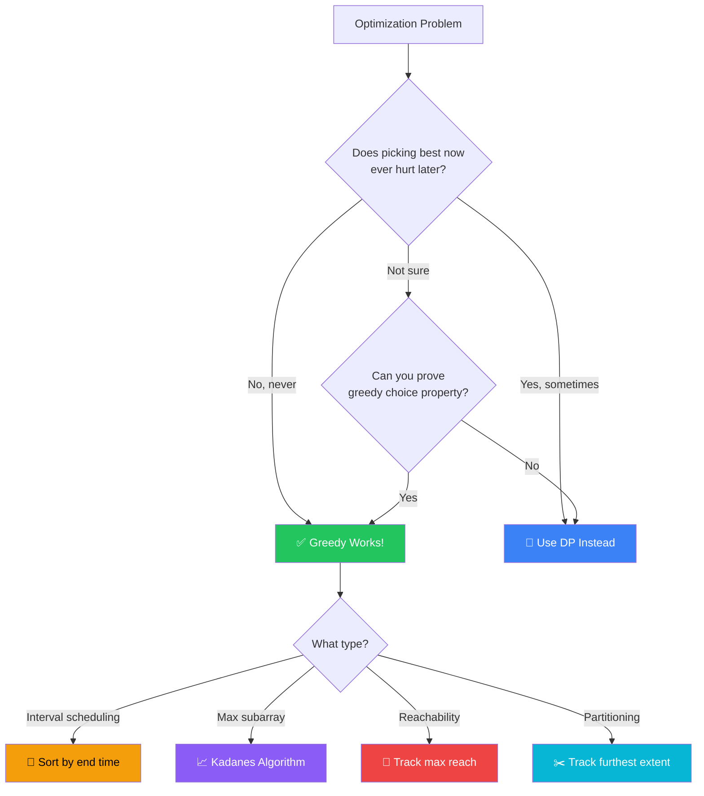

[🏠 Home](../../README.md) | [⬅️ Dynamic Programming](../12-dynamic-programming/00-overview.md) | [➡️ Intervals](../14-intervals/00-overview.md)

# 🤑 Greedy Pattern

> Making locally optimal choices for global optimum

---

## 🎯 When to Use

| Clue | Approach |
|------|----------|
| "Max/Min elements" | Sort + Pick best |
| "Activity selection" | Sort by end time |
| "Partition labels" | Furthest reach |
| "Jump Game" | Max reach so far |
| "Gas Station" | Current tank balance |

**Key**: Unlike DP, Greedy never looks back. Once a choice is made, it's final.

---

## 🧠 WHY Greedy Works (When It Works): Developer's Guide

> **🎯 For Beginners:** Greedy = Pick the BEST choice at each step. But be careful - it doesn't always give optimal!

### The Core Insight: Local Optimum → Global Optimum

```
WORKS: Activity Selection
  Problem: Schedule max non-overlapping activities
  
  Activities: [(1,3), (2,4), (3,5), (4,6)]
              [start, end]
  
  Greedy: Always pick activity that ENDS earliest
  
  Why? Ends earliest = leaves most room for future activities
  
  Pick (1,3) → Pick (4,6) → Done! 2 activities

DOESN'T WORK: Coin Change (some denominations)
  Problem: Coins [1, 3, 4], make 6
  
  Greedy: Pick largest coin that fits
  6 - 4 = 2, 2 - 1 = 1, 1 - 1 = 0 → 3 coins (4,1,1)
  
  Optimal: 3 + 3 = 6 → 2 coins!
  
  Greedy FAILED because local best ≠ global best
```

### When Can You Use Greedy?

```
Greedy works when problem has:

1. GREEDY CHOICE PROPERTY
   → A local optimal choice leads to global optimal
   → You never need to reconsider past choices

2. OPTIMAL SUBSTRUCTURE
   → Optimal solution contains optimal sub-solutions
   → (Same as DP, but greedy doesn't reconsider)

Quick test: Does picking "best now" ever hurt you later?
  → No: Greedy works
  → Yes: Need DP or other approach
```

### Greedy vs Dynamic Programming

```
GREEDY:                      DP:
├── One choice per step      ├── Consider ALL choices
├── Never look back          ├── Compare subproblems
├── O(n) or O(n log n)       ├── O(n²) or O(n×target)
├── Simpler but limited      ├── More powerful but complex
└── Must prove correctness   └── Always correct (if done right)

Example: Jump Game
  
  Greedy solution (works here):
    Track "max reachable index"
    If current index > max reachable → stuck → return false
    
  Why greedy works here?
    If you CAN reach index i, you can also reach all indices < i
    So tracking max is sufficient!
```

### Common Greedy Patterns

```
1. INTERVAL SCHEDULING:
   → Sort by end time
   → Pick non-overlapping greedily
   
2. MERGE INTERVALS:
   → Sort by start time
   → Merge if overlap
   
3. HUFFMAN / FREQUENCY-BASED:
   → Always process lowest frequency first
   
4. KADANE'S (Max Subarray):
   → Reset sum when it becomes negative
   → Local decision: "start fresh or continue?"
```

### Thought Process Template

```
🧠 "Can I solve this greedily?"

1. Is there a clear "best" choice at each step?
   → Yes: Formulate the greedy criterion

2. Does picking "best now" ever hurt later?
   → No: Greedy is likely correct
   → Yes: Consider DP instead

3. Can I prove correctness?
   → Exchange argument: Show greedy ≥ any other choice
   → Induction: Show greedy stays optimal

4. Common greedy signals:
   → "Maximum/minimum number of..."
   → "Earliest/latest..."
   → "Most/least frequent..."
```

---

### 🧭 Greedy vs DP Decision Flowchart



---

## 💻 Core Problems

### Problem 1: Maximum Subarray (Kadane's Algorithm)

```java
// Keep adding unless sum becomes negative
public int maxSubArray(int[] nums) {
    int currentSum = 0;
    int maxSum = nums[0];
    
    for (int num : nums) {
        if (currentSum < 0) {
            currentSum = 0;  // Reset if negative
        }
        currentSum += num;
        maxSum = Math.max(maxSum, currentSum);
    }
    return maxSum;
}
```

### Problem 2: Jump Game

```java
// Can you reach the last index?
public boolean canJump(int[] nums) {
    int maxReach = 0;
    
    for (int i = 0; i < nums.length; i++) {
        if (i > maxReach) return false;  // Stuck
        maxReach = Math.max(maxReach, i + nums[i]);
    }
    return true;
}
```

### Problem 3: Gas Station

```java
// Find valid starting station
public int canCompleteCircuit(int[] gas, int[] cost) {
    int totalGas = 0, totalCost = 0;
    for (int i = 0; i < gas.length; i++) {
        totalGas += gas[i];
        totalCost += cost[i];
    }
    if (totalGas < totalCost) return -1;
    
    int tank = 0;
    int start = 0;
    
    for (int i = 0; i < gas.length; i++) {
        tank += gas[i] - cost[i];
        if (tank < 0) {
            start = i + 1;  // Fail, try next
            tank = 0;
        }
    }
    return start;
}
```

### Problem 4: Partition Labels

```java
// Partition "ababcbacadefegdehijhklij" into parts
public List<Integer> partitionLabels(String s) {
    int[] lastIndex = new int[26];
    for (int i = 0; i < s.length(); i++) {
        lastIndex[s.charAt(i) - 'a'] = i;
    }
    
    List<Integer> result = new ArrayList<>();
    int start = 0, end = 0;
    
    for (int i = 0; i < s.length(); i++) {
        end = Math.max(end, lastIndex[s.charAt(i) - 'a']);
        
        if (i == end) {
            result.add(end - start + 1);
            start = i + 1;
        }
    }
    return result;
}
```

---

## 📝 Practice Problems — Detailed Solutions

| # | Problem | Difficulty | Link | Key Insight |
|---|---------|------------|------|-------------|
| 1 | Max Subarray | 🟡 Medium | [LeetCode](https://leetcode.com/problems/maximum-subarray/) | Kadane's |
| 2 | Jump Game | 🟡 Medium | [LeetCode](https://leetcode.com/problems/jump-game/) | Max reach |
| 3 | Jump Game II | 🟡 Medium | [LeetCode](https://leetcode.com/problems/jump-game-ii/) | BFS/Greedy |
| 4 | Gas Station | 🟡 Medium | [LeetCode](https://leetcode.com/problems/gas-station/) | Total sum check |
| 5 | Hand of Straights | 🟡 Medium | [LeetCode](https://leetcode.com/problems/hand-of-straights/) | Min heap / TreeMap |

---

### Problem 1: Maximum Subarray 🟡

> **Given** an integer array, find the contiguous subarray with the largest sum.

#### ✅ Optimal: Kadane's Algorithm — O(n) Time, O(1) Space

```java
public int maxSubArray(int[] nums) {
    int maxSum = nums[0], currSum = nums[0];
    
    for (int i = 1; i < nums.length; i++) {
        currSum = Math.max(nums[i], currSum + nums[i]);  // extend or restart
        maxSum = Math.max(maxSum, currSum);
    }
    return maxSum;
}
```

```
Example: nums = [-2, 1, -3, 4, -1, 2, 1, -5, 4]

i=0: curr=-2, max=-2
i=1: curr=max(1, -2+1)=1, max=1
i=2: curr=max(-3, 1-3)=-2, max=1
i=3: curr=max(4, -2+4)=4, max=4
i=4: curr=max(-1, 4-1)=3, max=4
i=5: curr=max(2, 3+2)=5, max=5
i=6: curr=max(1, 5+1)=6, max=6 ✅
i=7: curr=max(-5, 6-5)=1, max=6
i=8: curr=max(4, 1+4)=5, max=6

Result: 6 (subarray [4,-1,2,1]) ✅

💡 GREEDY DECISION: If current sum goes negative,
   better to start fresh from next element.
```

---

### Problem 2: Jump Game 🟡

> **Given** array where nums[i] = max jump from i, can you reach the last index?

#### ✅ Optimal: Greedy — O(n) Time, O(1) Space

```java
public boolean canJump(int[] nums) {
    int farthest = 0;
    
    for (int i = 0; i < nums.length; i++) {
        if (i > farthest) return false;  // can't reach this index
        farthest = Math.max(farthest, i + nums[i]);
    }
    return true;
}
```

```
Example: nums = [2, 3, 1, 1, 4]

i=0: farthest = max(0, 0+2) = 2
i=1: farthest = max(2, 1+3) = 4  (can reach end!)
i=2: farthest = max(4, 2+1) = 4
i=3: farthest = max(4, 3+1) = 4
i=4: reached! ✅

Example: nums = [3, 2, 1, 0, 4]
i=3: farthest=3, i+nums[i]=3+0=3 (stuck!)
i=4: i=4 > farthest=3 → false ✅

💡 Track the farthest reachable index. If current index > farthest, stuck!
```

---

### Problem 3: Jump Game II 🟡

> **Given** array, find minimum number of jumps to reach the last index.

#### ✅ Optimal: BFS-style Greedy — O(n) Time, O(1) Space

```java
public int jump(int[] nums) {
    int jumps = 0, currentEnd = 0, farthest = 0;
    
    for (int i = 0; i < nums.length - 1; i++) {
        farthest = Math.max(farthest, i + nums[i]);
        
        if (i == currentEnd) {       // exhausted current jump range
            jumps++;
            currentEnd = farthest;   // take the best jump
        }
    }
    return jumps;
}
```

```
Example: nums = [2, 3, 1, 1, 4]

i=0: farthest=2, i==currentEnd(0) → jump! jumps=1, end=2
i=1: farthest=4
i=2: farthest=4, i==currentEnd(2) → jump! jumps=2, end=4
→ reached end

Result: 2 ✅ (0→1→4)

💡 Think of it like BFS levels:
   Level 0: index 0
   Level 1: indices 1-2 (reachable from 0)
   Level 2: indices 3-4 (reachable from 1-2)
   Each level = one jump
```

---

### Problem 4: Gas Station 🟡

> **Given** gas stations in a circle, find starting station to complete the circuit.

#### ✅ Optimal: One Pass — O(n) Time, O(1) Space

```java
public int canCompleteCircuit(int[] gas, int[] cost) {
    int totalSurplus = 0, currentSurplus = 0, start = 0;
    
    for (int i = 0; i < gas.length; i++) {
        totalSurplus += gas[i] - cost[i];
        currentSurplus += gas[i] - cost[i];
        
        if (currentSurplus < 0) {
            start = i + 1;       // can't start from any station 0..i
            currentSurplus = 0;  // reset
        }
    }
    return totalSurplus >= 0 ? start : -1;
}
```

```
Example: gas = [1,2,3,4,5], cost = [3,4,5,1,2]

surplus = [-2,-2,-2,3,3]  totalSurplus = 0

i=0: curr=-2 < 0 → start=1, reset
i=1: curr=-2 < 0 → start=2, reset
i=2: curr=-2 < 0 → start=3, reset
i=3: curr=3
i=4: curr=6

totalSurplus=0 ≥ 0 → start=3 ✅

💡 If total gas ≥ total cost, solution exists.
   If running out at i, skip ALL stations 0..i (they all fail).
```

---

### Problem 5: Hand of Straights 🟡

> **Given** cards and groupSize, can we rearrange into groups of consecutive cards?

#### ✅ Optimal: TreeMap — O(n log n) Time

```java
public boolean isNStraightHand(int[] hand, int groupSize) {
    if (hand.length % groupSize != 0) return false;
    
    TreeMap<Integer, Integer> map = new TreeMap<>();
    for (int card : hand) map.merge(card, 1, Integer::sum);
    
    while (!map.isEmpty()) {
        int first = map.firstKey();  // smallest card
        for (int i = first; i < first + groupSize; i++) {
            if (!map.containsKey(i)) return false;
            map.merge(i, -1, Integer::sum);
            if (map.get(i) == 0) map.remove(i);
        }
    }
    return true;
}
```

```
Example: hand = [1,2,3,6,2,3,4,7,8], groupSize = 3

Map: {1:1, 2:2, 3:2, 4:1, 6:1, 7:1, 8:1}

Group 1: [1,2,3] → Map: {2:1, 3:1, 4:1, 6:1, 7:1, 8:1}
Group 2: [2,3,4] → Map: {6:1, 7:1, 8:1}
Group 3: [6,7,8] → Map: {} → true ✅

💡 Always start from smallest available card.
   TreeMap keeps cards sorted for O(log n) min access.
```

---

## 📊 Complexity Comparison

| # | Problem | Time | Space | Technique |
|---|---------|------|-------|-----------|
| 1 | Max Subarray | O(n) | O(1) | Kadane's |
| 2 | Jump Game | O(n) | O(1) | Farthest reach |
| 3 | Jump Game II | O(n) | O(1) | BFS-style greedy |
| 4 | Gas Station | O(n) | O(1) | Surplus tracking |
| 5 | Hand of Straights | O(n log n) | O(n) | TreeMap grouping |

---

*Next: [Intervals →](../14-intervals/00-overview.md)*
