[🏠 Home](../../README.md) | [⬅️ Dynamic Programming](../12-dynamic-programming/00-overview.md) | [➡️ Intervals](../14-intervals/00-overview.md)

# 🤑 Greedy Pattern

> Making locally optimal choices for global optimum

---

## 🎯 When to Use

| Clue | Approach |
|------|----------|
| "Max/Min elements" | Sort + Pick best |
| "Activity selection" | Sort by end time |
| "Partition labels" | Furthest reach |
| "Jump Game" | Max reach so far |
| "Gas Station" | Current tank balance |

**Key**: Unlike DP, Greedy never looks back. Once a choice is made, it's final.

---

## 🧠 WHY Greedy Works (When It Works): Developer's Guide

> **🎯 For Beginners:** Greedy = Pick the BEST choice at each step. But be careful - it doesn't always give optimal!

### The Core Insight: Local Optimum → Global Optimum

```
WORKS: Activity Selection
  Problem: Schedule max non-overlapping activities
  
  Activities: [(1,3), (2,4), (3,5), (4,6)]
              [start, end]
  
  Greedy: Always pick activity that ENDS earliest
  
  Why? Ends earliest = leaves most room for future activities
  
  Pick (1,3) → Pick (4,6) → Done! 2 activities

DOESN'T WORK: Coin Change (some denominations)
  Problem: Coins [1, 3, 4], make 6
  
  Greedy: Pick largest coin that fits
  6 - 4 = 2, 2 - 1 = 1, 1 - 1 = 0 → 3 coins (4,1,1)
  
  Optimal: 3 + 3 = 6 → 2 coins!
  
  Greedy FAILED because local best ≠ global best
```

### When Can You Use Greedy?

```
Greedy works when problem has:

1. GREEDY CHOICE PROPERTY
   → A local optimal choice leads to global optimal
   → You never need to reconsider past choices

2. OPTIMAL SUBSTRUCTURE
   → Optimal solution contains optimal sub-solutions
   → (Same as DP, but greedy doesn't reconsider)

Quick test: Does picking "best now" ever hurt you later?
  → No: Greedy works
  → Yes: Need DP or other approach
```

### Greedy vs Dynamic Programming

```
GREEDY:                      DP:
├── One choice per step      ├── Consider ALL choices
├── Never look back          ├── Compare subproblems
├── O(n) or O(n log n)       ├── O(n²) or O(n×target)
├── Simpler but limited      ├── More powerful but complex
└── Must prove correctness   └── Always correct (if done right)

Example: Jump Game
  
  Greedy solution (works here):
    Track "max reachable index"
    If current index > max reachable → stuck → return false
    
  Why greedy works here?
    If you CAN reach index i, you can also reach all indices < i
    So tracking max is sufficient!
```

### Common Greedy Patterns

```
1. INTERVAL SCHEDULING:
   → Sort by end time
   → Pick non-overlapping greedily
   
2. MERGE INTERVALS:
   → Sort by start time
   → Merge if overlap
   
3. HUFFMAN / FREQUENCY-BASED:
   → Always process lowest frequency first
   
4. KADANE'S (Max Subarray):
   → Reset sum when it becomes negative
   → Local decision: "start fresh or continue?"
```

### Thought Process Template

```
🧠 "Can I solve this greedily?"

1. Is there a clear "best" choice at each step?
   → Yes: Formulate the greedy criterion

2. Does picking "best now" ever hurt later?
   → No: Greedy is likely correct
   → Yes: Consider DP instead

3. Can I prove correctness?
   → Exchange argument: Show greedy ≥ any other choice
   → Induction: Show greedy stays optimal

4. Common greedy signals:
   → "Maximum/minimum number of..."
   → "Earliest/latest..."
   → "Most/least frequent..."
```

---

### 🧭 Greedy vs DP Decision Flowchart

```mermaid
flowchart TD
    A["Optimization Problem"] --> B{"Does picking best now\never hurt later?"}
    B -- "No, never" --> C["✅ Greedy Works!"]
    B -- "Yes, sometimes" --> D["🔄 Use DP Instead"]
    B -- "Not sure" --> E{"Can you prove\ngreedy choice property?"}
    E -- "Yes" --> C
    E -- "No" --> D

    C --> F{"What type?"}
    F -- "Interval scheduling" --> G["📅 Sort by end time"]
    F -- "Max subarray" --> H["📈 Kadanes Algorithm"]
    F -- "Reachability" --> I["🏃 Track max reach"]
    F -- "Partitioning" --> J["✂️ Track furthest extent"]

    style C fill:#22c55e,color:#fff
    style D fill:#3b82f6,color:#fff
    style G fill:#f59e0b,color:#000
    style H fill:#8b5cf6,color:#fff
    style I fill:#ef4444,color:#fff
    style J fill:#06b6d4,color:#fff
```



---

## 💻 Core Problems

### Problem 1: Maximum Subarray (Kadane's Algorithm)

```java
// Keep adding unless sum becomes negative
public int maxSubArray(int[] nums) {
    int currentSum = 0;
    int maxSum = nums[0];
    
    for (int num : nums) {
        if (currentSum < 0) {
            currentSum = 0;  // Reset if negative
        }
        currentSum += num;
        maxSum = Math.max(maxSum, currentSum);
    }
    return maxSum;
}
```

### Problem 2: Jump Game

```java
// Can you reach the last index?
public boolean canJump(int[] nums) {
    int maxReach = 0;
    
    for (int i = 0; i < nums.length; i++) {
        if (i > maxReach) return false;  // Stuck
        maxReach = Math.max(maxReach, i + nums[i]);
    }
    return true;
}
```

### Problem 3: Gas Station

```java
// Find valid starting station
public int canCompleteCircuit(int[] gas, int[] cost) {
    int totalGas = 0, totalCost = 0;
    for (int i = 0; i < gas.length; i++) {
        totalGas += gas[i];
        totalCost += cost[i];
    }
    if (totalGas < totalCost) return -1;
    
    int tank = 0;
    int start = 0;
    
    for (int i = 0; i < gas.length; i++) {
        tank += gas[i] - cost[i];
        if (tank < 0) {
            start = i + 1;  // Fail, try next
            tank = 0;
        }
    }
    return start;
}
```

### Problem 4: Partition Labels

```java
// Partition "ababcbacadefegdehijhklij" into parts
public List<Integer> partitionLabels(String s) {
    int[] lastIndex = new int[26];
    for (int i = 0; i < s.length(); i++) {
        lastIndex[s.charAt(i) - 'a'] = i;
    }
    
    List<Integer> result = new ArrayList<>();
    int start = 0, end = 0;
    
    for (int i = 0; i < s.length(); i++) {
        end = Math.max(end, lastIndex[s.charAt(i) - 'a']);
        
        if (i == end) {
            result.add(end - start + 1);
            start = i + 1;
        }
    }
    return result;
}
```

---

## 📝 Practice Problems

| # | Problem | Difficulty | Link | Key Insight |
|---|---------|------------|------|-------------|
| 1 | Max Subarray | 🟡 Medium | [LeetCode](https://leetcode.com/problems/maximum-subarray/) | Kadane's |
| 2 | Jump Game | 🟡 Medium | [LeetCode](https://leetcode.com/problems/jump-game/) | Max reach |
| 3 | Jump Game II | 🟡 Medium | [LeetCode](https://leetcode.com/problems/jump-game-ii/) | BFS/Greedy |
| 4 | Gas Station | 🟡 Medium | [LeetCode](https://leetcode.com/problems/gas-station/) | Total sum check |
| 5 | Hand of Straights | 🟡 Medium | [LeetCode](https://leetcode.com/problems/hand-of-straights/) | Min heap / TreeMap |

---

*Next: [Intervals →](../14-intervals/00-overview.md)*
