[🏠 Home](../../README.md) | [⬅️ Greedy](../13-greedy/00-overview.md) | [➡️ Bit Manipulation](../15-bit-manipulation/00-overview.md)

# 🕒 Interval Patterns

> Managing overlapping ranges and time slots

---

## 🎯 When to Use

| Clue | Approach |
|------|----------|
| "Merge overlapping" | Sort by start time |
| "Non-overlapping" | Sort by end time |
| "Meeting rooms required" | Min-heap or Two pointers |
| "Insert interval" | Linear scan |

---

## 🧠 WHY Interval Patterns Work: Developer's Guide

> **🎯 For Beginners:** Most interval problems become simple after sorting. The key is knowing WHAT to sort by!

### The Core Insight: Sorting Reveals Structure

```
Unsorted intervals: [(2,6), (1,3), (8,10), (15,18)]
                    
                    ???  Hard to see relationships

Sorted by START:    [(1,3), (2,6), (8,10), (15,18)]
                    
  Timeline:     1---3
                  2-------6
                            8----10
                                    15----18
                    
                    NOW we can see overlaps!
```

### Sort by START vs Sort by END

```
SORT BY START TIME:
  Use when: Merging overlapping intervals
  
  Why? Process left-to-right on timeline
  Each new interval either:
    - Overlaps with current → merge
    - Doesn't overlap → start new group
  
  [(1,3), (2,6)] → overlap! → merge to (1,6)

SORT BY END TIME:
  Use when: Maximizing non-overlapping intervals
  
  Why? Ending early = more room for future intervals
  
  [(1,4), (2,3), (3,5)]
  Sort by end: [(2,3), (1,4), (3,5)]
  
  Pick (2,3) → ends at 3
  Skip (1,4) → starts at 1 < 3 → overlaps
  Pick (3,5) → starts at 3 ≥ 3 → OK!
  
  Result: 2 non-overlapping intervals
```

### Detecting Overlap: The Key Condition

```
Two intervals [a, b] and [c, d] overlap if:

  a ≤ d AND c ≤ b
  
  OR more simply (when sorted by start):
  
  If intervals are sorted: [a,b] then [c,d] where a ≤ c
    Overlap if: c ≤ b  (next starts before current ends)
    
  Visual:
    a-------b
        c-------d    ← c ≤ b? YES → OVERLAP
        
    a---b
          c---d      ← c ≤ b? NO → NO OVERLAP
```

### Meeting Rooms: The Two-Pointer Trick

```
Problem: How many meeting rooms needed?

Intervals: [(0,30), (5,10), (15,20)]

Instead of simulation, use EVENT points:

  Start events: [0, 5, 15]
  End events:   [10, 20, 30]

  Process chronologically:
  t=0:  +1 room (start)     → rooms=1
  t=5:  +1 room (start)     → rooms=2  ← MAX
  t=10: -1 room (end)       → rooms=1
  t=15: +1 room (start)     → rooms=2
  t=20: -1 room (end)       → rooms=1
  t=30: -1 room (end)       → rooms=0

  Answer: 2 rooms needed
```

### Thought Process Template

```
🧠 "How do I solve this interval problem?"

1. What's the goal?
   → Merge overlaps: Sort by START
   → Max non-overlapping: Sort by END
   → Count simultaneous: Sweep line / two pointers

2. How do I detect overlap?
   → Sorted by start: next.start ≤ current.end

3. What do I do on overlap?
   → Merge: Extend current.end = max(current.end, next.end)
   → Count: Increment overlap counter
   → Remove: Don't add to result

4. What do I do on no overlap?
   → Start a new group/interval
```

---

### 🧭 Interval Problem Selector

```mermaid
flowchart TD
    A["Interval Problem"] --> B{"What's the goal?"}
    B -- "Merge overlapping" --> C["🔗 Sort by START\n(extend current end)"]
    B -- "Max non-overlapping" --> D["✂️ Sort by END\n(greedy: earliest finish)"]
    B -- "Count simultaneous" --> E["📊 Sweep Line\n(event points ±1)"]
    B -- "Insert new interval" --> F["📥 Linear Scan\n(before/overlap/after)"]
    B -- "Min rooms needed" --> G["🏢 Two Pointers\n(sort starts + ends)"]

    C --> H["Overlap: next.start ≤ curr.end\n→ Merge: extend end"]
    D --> I["Pick if start ≥ prev end\n→ Count: increment"]

    style C fill:#3b82f6,color:#fff
    style D fill:#22c55e,color:#fff
    style E fill:#8b5cf6,color:#fff
    style F fill:#f59e0b,color:#000
    style G fill:#ef4444,color:#fff
```



---

## 💻 Core Problems

### Problem 1: Merge Intervals

```java
// [[1,3],[2,6],[8,10],[15,18]] → [[1,6],[8,10],[15,18]]
public int[][] merge(int[][] intervals) {
    if (intervals.length <= 1) return intervals;
    
    // Sort by start time
    Arrays.sort(intervals, (a, b) -> Integer.compare(a[0], b[0]));
    
    List<int[]> result = new ArrayList<>();
    int[] current = intervals[0];
    result.add(current);
    
    for (int[] interval : intervals) {
        int currentEnd = current[1];
        int nextStart = interval[0];
        int nextEnd = interval[1];
        
        if (currentEnd >= nextStart) { // Overlap
            current[1] = Math.max(currentEnd, nextEnd);
        } else { // No overlap
            current = interval;
            result.add(current);
        }
    }
    
    return result.toArray(new int[result.size()][]);
}
```

**Visualization**:
```
Input: [[1,3],[2,6],[8,10],[15,18]]

Sorted: [1,3], [2,6], [8,10], [15,18]

[1,3]+[2,6]: overlap (3≥2) → merge to [1,6]
[1,6]+[8,10]: no overlap (6<8) → add [8,10]
[8,10]+[15,18]: no overlap → add [15,18]

Result: [[1,6],[8,10],[15,18]] ✅
💡 Sort by start. Overlap iff prev.end ≥ curr.start.
```

**Complexity**: Time O(n log n). Space O(n).

### Problem 2: Insert Interval

```java
// Insert newInterval into sorted intervals
public int[][] insert(int[][] intervals, int[] newInterval) {
    List<int[]> result = new ArrayList<>();
    int i = 0;
    
    // Add all before overlap
    while (i < intervals.length && intervals[i][1] < newInterval[0]) {
        result.add(intervals[i]);
        i++;
    }
    
    // Merge overlapping
    while (i < intervals.length && intervals[i][0] <= newInterval[1]) {
        newInterval[0] = Math.min(newInterval[0], intervals[i][0]);
        newInterval[1] = Math.max(newInterval[1], intervals[i][1]);
        i++;
    }
    result.add(newInterval);
    
    // Add all after
    while (i < intervals.length) {
        result.add(intervals[i]);
        i++;
    }
    
    return result.toArray(new int[result.size()][]);
}
```

**Visualization**:
```
intervals=[[1,2],[3,5],[6,7],[8,10],[12,16]], new=[4,8]

Phase 1: [1,2] end=2 < 4 → add directly
Phase 2: [3,5] overlaps → merge [3,8]
         [6,7] overlaps → [3,8]
         [8,10] overlaps → [3,10]
Phase 3: [12,16] → add directly

Result: [[1,2],[3,10],[12,16]] ✅
```

**Complexity**: Time O(n). Space O(n).

### Problem 3: Non-overlapping Intervals

```java
// Remove min intervals to make rest non-overlapping
public int eraseOverlapIntervals(int[][] intervals) {
    if (intervals.length == 0) return 0;
    
    // Sort by END time (Greedy!)
    Arrays.sort(intervals, (a, b) -> Integer.compare(a[1], b[1]));
    
    int end = intervals[0][1];
    int count = 1; // Count non-overlapping
    
    for (int i = 1; i < intervals.length; i++) {
        if (intervals[i][0] >= end) {
            count++;
            end = intervals[i][1];
        }
    }
    
    return intervals.length - count;
}
```

**Visualization**:
```
intervals = [[1,2],[2,3],[3,4],[1,3]]

Sorted by END: [1,2],[2,3],[1,3],[3,4]

end=2, count=1
[2,3]: start=2 ≥ end=2 → count=2, end=3
[1,3]: start=1 < end=3 → skip (remove this one)
[3,4]: start=3 ≥ end=3 → count=3, end=4

Remove: 4 - 3 = 1 ✅
💡 Sort by END time. Greedy: keep interval that ends earliest.
```

**Complexity**: Time O(n log n). Space O(1).

---

## 📝 Practice Problems — Detailed Solutions

| # | Problem | Difficulty | Link | Key Insight |
|---|---------|------------|------|-------------|
| 1 | Merge Intervals | 🟡 Medium | [LeetCode](https://leetcode.com/problems/merge-intervals/) | Sort start |
| 2 | Insert Interval | 🟡 Medium | [LeetCode](https://leetcode.com/problems/insert-interval/) | Linear scan |
| 3 | Non-overlapping | 🟡 Medium | [LeetCode](https://leetcode.com/problems/non-overlapping-intervals/) | Sort end |
| 4 | Meeting Rooms II | 🟡 Medium | [LeetCode](https://leetcode.com/problems/meeting-rooms-ii/) | Two pointers |

---

### Problem 1: Merge Intervals 🟡

> **Given** a collection of intervals, merge all overlapping intervals.

#### ✅ Optimal: Sort + Merge — O(n log n) Time

```java
public int[][] merge(int[][] intervals) {
    Arrays.sort(intervals, (a, b) -> a[0] - b[0]);
    List<int[]> result = new ArrayList<>();
    
    for (int[] interval : intervals) {
        if (result.isEmpty() || result.get(result.size()-1)[1] < interval[0]) {
            result.add(interval);  // no overlap, add new
        } else {
            result.get(result.size()-1)[1] = 
                Math.max(result.get(result.size()-1)[1], interval[1]);  // extend end
        }
    }
    return result.toArray(new int[result.size()][]);
}
```

```
Example: [[1,3],[2,6],[8,10],[15,18]]

Sorted: [1,3], [2,6], [8,10], [15,18]

[1,3] + [2,6] → overlap (3≥2) → merge to [1,6]
[1,6] + [8,10] → no overlap (6<8) → add [8,10]
[8,10] + [15,18] → no overlap → add [15,18]

Result: [[1,6], [8,10], [15,18]] ✅

💡 After sorting by start: overlap iff prev.end ≥ curr.start
   Merge by extending end to max(prev.end, curr.end)
```

---

### Problem 2: Insert Interval 🟡

> **Given** sorted non-overlapping intervals and a new interval, insert and merge.

#### ✅ Optimal: Three-Phase — O(n) Time

```java
public int[][] insert(int[][] intervals, int[] newInterval) {
    List<int[]> result = new ArrayList<>();
    int i = 0;
    
    // Phase 1: Add all intervals BEFORE newInterval
    while (i < intervals.length && intervals[i][1] < newInterval[0]) {
        result.add(intervals[i++]);
    }
    
    // Phase 2: Merge overlapping intervals with newInterval
    while (i < intervals.length && intervals[i][0] <= newInterval[1]) {
        newInterval[0] = Math.min(newInterval[0], intervals[i][0]);
        newInterval[1] = Math.max(newInterval[1], intervals[i][1]);
        i++;
    }
    result.add(newInterval);
    
    // Phase 3: Add all intervals AFTER newInterval
    while (i < intervals.length) {
        result.add(intervals[i++]);
    }
    return result.toArray(new int[result.size()][]);
}
```

```
Example: intervals = [[1,2],[3,5],[6,7],[8,10],[12,16]], newInterval = [4,8]

Phase 1: [1,2] → end=2 < 4 → add
Phase 2: [3,5] overlaps → merge [3,8]
         [6,7] overlaps → merge [3,8]
         [8,10] overlaps → merge [3,10]
Phase 3: [12,16] → add

Result: [[1,2], [3,10], [12,16]] ✅

💡 Three phases: before, overlap (merge), after.
   No sorting needed since input is already sorted.
```

---

### Problem 3: Non-overlapping Intervals 🟡

> **Given** intervals, find minimum number to remove to make them non-overlapping.

#### ✅ Optimal: Sort by End — O(n log n) Time

```java
public int eraseOverlapIntervals(int[][] intervals) {
    Arrays.sort(intervals, (a, b) -> a[1] - b[1]);  // sort by END
    int removals = 0, prevEnd = Integer.MIN_VALUE;
    
    for (int[] interval : intervals) {
        if (interval[0] >= prevEnd) {
            prevEnd = interval[1];  // no overlap, keep it
        } else {
            removals++;             // overlap, remove current
        }
    }
    return removals;
}
```

```
Example: [[1,2],[2,3],[3,4],[1,3]]

Sorted by end: [1,2], [2,3], [1,3], [3,4]

[1,2] → keep (prevEnd=2)
[2,3] → 2≥2, keep (prevEnd=3)
[1,3] → 1<3, overlap! remove
[3,4] → 3≥3, keep (prevEnd=4)

Removals: 1 ✅

💡 SORT BY END (not start)!
   This is the "activity selection" greedy — picking intervals
   that end earliest leaves maximum room for future intervals.
```

---

### Problem 4: Meeting Rooms II 🟡

> **Given** meeting time intervals, find the minimum number of conference rooms required.

#### ✅ Optimal: Min-Heap — O(n log n) Time

```java
public int minMeetingRooms(int[][] intervals) {
    Arrays.sort(intervals, (a, b) -> a[0] - b[0]);
    PriorityQueue<Integer> heap = new PriorityQueue<>();  // end times
    
    for (int[] interval : intervals) {
        if (!heap.isEmpty() && heap.peek() <= interval[0]) {
            heap.poll();  // reuse room (earliest ending meeting is done)
        }
        heap.offer(interval[1]);  // assign room
    }
    return heap.size();
}
```

```
Example: [[0,30],[5,10],[15,20]]

Sort by start: [0,30], [5,10], [15,20]

[0,30] → heap: [30] (1 room)
[5,10] → 30 > 5, can't reuse → heap: [10, 30] (2 rooms)
[15,20] → 10 ≤ 15, reuse room! heap: [20, 30] (still 2 rooms)

Result: 2 ✅

💡 Min-heap tracks "when each room becomes free" (end times).
   If earliest free room is done before new meeting starts, reuse it.
   Heap size = rooms in use.
```

---

## 📊 Complexity Comparison

| # | Problem | Time | Space | Technique |
|---|---------|------|-------|-----------|
| 1 | Merge Intervals | O(n log n) | O(n) | Sort + extend |
| 2 | Insert Interval | O(n) | O(n) | Three-phase |
| 3 | Non-overlapping | O(n log n) | O(1) | Sort by end |
| 4 | Meeting Rooms II | O(n log n) | O(n) | Min-heap |

---

*Next: [Bit Manipulation →](../15-bit-manipulation/00-overview.md)*
