[🏠 Home](../../README.md) | [⬅️ Intervals](../14-intervals/00-overview.md) | [➡️ Interview Q&A](../16-interview-qa.md)

# 0101 Bit Manipulation

> Low-level binary operations for optimization

---

## 🎯 When to Use

| Clue | Operation |
|------|-----------|
| "Unique number" | XOR (`^`) |
| "Count 1 bits" | `n & (n-1)` |
| "Power of 2" | `n & (n-1) == 0` |
| "Set/Get bit" | `|` and `&` |
| "Divide/Multiply by 2" | `>> 1` and `<< 1` |

---

## 🧠 WHY Bit Manipulation is Powerful: Developer's Guide

> **🎯 For Beginners:** Bits are the computer's native language. Bit tricks = O(1) operations that feel like magic!

### The Core Insight: XOR is Your Best Friend

```
XOR (^) Properties:

  a ^ 0 = a     (XOR with 0 keeps the value)
  a ^ a = 0     (XOR with itself cancels out)
  a ^ b = b ^ a (commutative)
  
Why this matters for "Single Number":

  nums = [4, 1, 2, 1, 2]
  
  XOR all: 4 ^ 1 ^ 2 ^ 1 ^ 2
         = 4 ^ (1 ^ 1) ^ (2 ^ 2)
         = 4 ^ 0 ^ 0
         = 4  ← The unique number!
         
  Pairs cancel out, singleton remains!
  Time: O(n), Space: O(1)
```

### The n & (n-1) Trick: Removing Rightmost 1

```
Why does n & (n-1) remove the rightmost set bit?

  n = 12      →  1100
  n - 1 = 11  →  1011
                 ----
  n & (n-1)   →  1000  (rightmost 1 is gone!)
  
  What happened?
  - Subtracting 1 flips all bits from rightmost 1 onwards
  - AND operation keeps only the unchanged bits
  
Use case: Count set bits (Hamming Weight)
  
  12 → 1100 → count++
   8 → 1000 → count++
   0 → 0000 → stop
   
  Done in O(number of 1s), not O(32)!
```

### Power of 2: The Elegant Check

```
A number is power of 2 if it has exactly ONE set bit:

  1  = 0001  ✓
  2  = 0010  ✓
  4  = 0100  ✓
  8  = 1000  ✓
  3  = 0011  ✗ (two 1s)
  
Test: n & (n-1) == 0

  8 = 1000
  7 = 0111
  --------
      0000  ← Only one 1, so result is 0 → Power of 2!
      
  6 = 0110
  5 = 0101
  --------
      0100  ← Non-zero → NOT power of 2
```

### Bit Manipulation Cheat Sheet

```
Operation              |  Code            |  Example (n=5=0101)
-----------------------|------------------|---------------------
Get bit at i           |  (n >> i) & 1    |  bit 0: (5>>0)&1 = 1
Set bit at i           |  n | (1 << i)    |  set 1: 5|(1<<1) = 7
Clear bit at i         |  n & ~(1 << i)   |  clear 0: 5&~1 = 4
Toggle bit at i        |  n ^ (1 << i)    |  toggle 2: 5^4 = 1
Check if power of 2    |  n & (n-1) == 0  |  5&4 = 4 ≠ 0 → No
Get lowest set bit     |  n & (-n)        |  5 & -5 = 1
Clear lowest set bit   |  n & (n-1)       |  5 & 4 = 4
```

### When to Think "Bits"?

```
🧠 Problem signals for bit manipulation:

1. "Find the unique/single element"
   → XOR all elements

2. "Count bits" or "Hamming distance"
   → n & (n-1) trick

3. "Power of 2" check
   → n & (n-1) == 0

4. "Subset generation"
   → Use bitmask (each bit = include/exclude)

5. Space constraint (O(1) extra space)
   → Bits can pack multiple booleans

6. "Swap without temp"
   → a ^= b; b ^= a; a ^= b;
```

---

### 🧭 Bit Operation Selector

```mermaid
flowchart TD
    A["Bit Manipulation Problem"] --> B{"What's the goal?"}
    B -- "Find unique element" --> C["⊕ XOR all elements\n(pairs cancel out)"]
    B -- "Count set bits" --> D["🔢 n & n-1 loop\n(removes rightmost 1)"]
    B -- "Check power of 2" --> E["✅ n & n-1 == 0\n(exactly one set bit)"]
    B -- "Get/Set/Clear bit i" --> F["🎯 Bitmask operations\n(shift + AND/OR)"]
    B -- "Generate all subsets" --> G["🔄 Bitmask enumeration\n(0 to 2^n - 1)"]
    B -- "Swap without temp" --> H["↔️ XOR swap\n(a^=b, b^=a, a^=b)"]

    style C fill:#3b82f6,color:#fff
    style D fill:#22c55e,color:#fff
    style E fill:#8b5cf6,color:#fff
    style F fill:#f59e0b,color:#000
    style G fill:#ef4444,color:#fff
    style H fill:#06b6d4,color:#fff
```



---

## 🔧 Core Operations

```java
// 1. Get bit at i
boolean getBit(int n, int i) {
    return (n & (1 << i)) != 0;
}

// 2. Set bit at i
int setBit(int n, int i) {
    return n | (1 << i);
}

// 3. Clear bit at i
int clearBit(int n, int i) {
    return n & ~(1 << i);
}

// 4. Update bit at i to v (0 or 1)
int updateBit(int n, int i, int v) {
    int mask = ~(1 << i);
    return (n & mask) | (v << i);
}
```

---

## 💻 Core Problems

### Problem 1: Single Number

```java
// Every number appears twice except one
// a ^ a = 0, a ^ 0 = a
public int singleNumber(int[] nums) {
    int count = 0;
    for (int n : nums) {
        count ^= n;
    }
    return count;
}
```

### Problem 2: Number of 1 Bits (Hamming Weight)

```java
public int hammingWeight(int n) {
    int count = 0;
    while (n != 0) {
        n = n & (n - 1);  // Removes last set bit (Brian Kernighan's Algorithm)
        count++;
    }
    return count;
}
```

### Problem 3: Counting Bits

```java
// Count bits for all numbers 0 to n
// dp[i] = dp[i >> 1] + (i & 1)
public int[] countBits(int n) {
    int[] ans = new int[n + 1];
    for (int i = 1; i <= n; i++) {
        ans[i] = ans[i >> 1] + (i & 1);
    }
    return ans;
}
```

---

## 📝 Practice Problems — Detailed Solutions

| # | Problem | Difficulty | Link | Key Insight |
|---|---------|------------|------|-------------|
| 1 | Single Number | 🟢 Easy | [LeetCode](https://leetcode.com/problems/single-number/) | XOR |
| 2 | Number of 1 Bits | 🟢 Easy | [LeetCode](https://leetcode.com/problems/number-of-1-bits/) | n & (n-1) |
| 3 | Counting Bits | 🟢 Easy | [LeetCode](https://leetcode.com/problems/counting-bits/) | DP + Bits |
| 4 | Reverse Bits | 🟢 Easy | [LeetCode](https://leetcode.com/problems/reverse-bits/) | Shift |
| 5 | Sum of Two Integers | 🟡 Medium | [LeetCode](https://leetcode.com/problems/sum-of-two-integers/) | Bits Adder |

---

### Problem 1: Single Number 🟢

> **Given** array where every element appears twice except one, find the single one.

#### ✅ Optimal: XOR — O(n) Time, O(1) Space

```java
public int singleNumber(int[] nums) {
    int result = 0;
    for (int num : nums) result ^= num;
    return result;
}
```

```
Example: nums = [4, 1, 2, 1, 2]

0 ^ 4 = 4     (0100)
4 ^ 1 = 5     (0101)
5 ^ 2 = 7     (0111)
7 ^ 1 = 6     (0110)   ← 1 cancels out
6 ^ 2 = 4     (0100)   ← 2 cancels out

Result: 4 ✅

💡 XOR properties:
   a ^ a = 0  (self-cancellation)
   a ^ 0 = a  (identity)
   Order doesn't matter (commutative & associative)
   All pairs cancel → only unique element remains!
```

---

### Problem 2: Number of 1 Bits 🟢

> **Given** an unsigned integer, return the number of '1' bits.

#### ✅ Optimal: Brian Kernighan's — O(k) Time (k = number of 1 bits)

```java
public int hammingWeight(int n) {
    int count = 0;
    while (n != 0) {
        n &= (n - 1);  // remove lowest set bit
        count++;
    }
    return count;
}
```

```
Example: n = 11 (1011)

n=1011: n-1=1010, n&(n-1)=1010, count=1
n=1010: n-1=1001, n&(n-1)=1000, count=2
n=1000: n-1=0111, n&(n-1)=0000, count=3
n=0000: done!

Result: 3 ✅

💡 n & (n-1) clears the LOWEST set bit.
   Each step removes exactly one '1' bit.
   Runs in O(k) where k = number of 1 bits, not 32.
```

---

### Problem 3: Counting Bits 🟢

> **Given** n, return array where ans[i] = number of 1's in binary of i.

#### ✅ Optimal: DP — O(n) Time, O(n) Space

```java
public int[] countBits(int n) {
    int[] dp = new int[n + 1];
    for (int i = 1; i <= n; i++) {
        dp[i] = dp[i >> 1] + (i & 1);  // right shift + check last bit
    }
    return dp;
}
```

```
i=0: dp[0] = 0         (0000) → 0
i=1: dp[0] + 1 = 1     (0001) → 1
i=2: dp[1] + 0 = 1     (0010) → 1
i=3: dp[1] + 1 = 2     (0011) → 2
i=4: dp[2] + 0 = 1     (0100) → 1
i=5: dp[2] + 1 = 2     (0101) → 2

Result: [0, 1, 1, 2, 1, 2] ✅

💡 i >> 1 strips the last bit → same number of 1's minus that bit
   i & 1 checks if last bit is 1
   So: bits(i) = bits(i/2) + lastBit(i)
```

---

### Problem 4: Reverse Bits 🟢

> **Given** a 32-bit unsigned integer, reverse its bits.

#### ✅ Optimal: Bit-by-Bit — O(1) Time, O(1) Space

```java
public int reverseBits(int n) {
    int result = 0;
    for (int i = 0; i < 32; i++) {
        result <<= 1;            // make room for next bit
        result |= (n & 1);      // add last bit of n
        n >>= 1;                 // remove last bit of n
    }
    return result;
}
```

```
Example: n = 43261596
Binary:  00000010100101000001111010011100
Reverse: 00111001011110000010100101000000

💡 Extract rightmost bit of n, place it in result,
   shift both. Repeat 32 times. Like reversing a string
   but with bits instead of characters.
```

---

### Problem 5: Sum of Two Integers 🟡

> **Given** two integers, return their sum without using + or -.

#### ✅ Optimal: Bit Manipulation — O(1) Time

```java
public int getSum(int a, int b) {
    while (b != 0) {
        int carry = (a & b) << 1;  // carry bits (both 1 → carry)
        a = a ^ b;                  // sum without carry
        b = carry;                  // add carry in next iteration
    }
    return a;
}
```

```
Example: a = 5 (101), b = 3 (011)

Iteration 1:
  carry = (101 & 011) << 1 = (001) << 1 = 010
  a = 101 ^ 011 = 110
  b = 010

Iteration 2:
  carry = (110 & 010) << 1 = (010) << 1 = 100
  a = 110 ^ 010 = 100
  b = 100

Iteration 3:
  carry = (100 & 100) << 1 = (100) << 1 = 1000
  a = 100 ^ 100 = 000
  b = 1000

Iteration 4:
  carry = (000 & 1000) << 1 = 0
  a = 000 ^ 1000 = 1000 = 8
  b = 0 → done!

Result: 8 ✅ (5 + 3 = 8)

💡 XOR = addition without carry
   AND + shift = carry bits
   Repeat until no more carry (b == 0)
```

---

## 📊 Complexity Comparison

| # | Problem | Time | Space | Technique |
|---|---------|------|-------|-----------|
| 1 | Single Number | O(n) | O(1) | XOR cancellation |
| 2 | Number of 1 Bits | O(k) | O(1) | Brian Kernighan's |
| 3 | Counting Bits | O(n) | O(n) | DP + right shift |
| 4 | Reverse Bits | O(1) | O(1) | Bit extraction |
| 5 | Sum of Two Ints | O(1) | O(1) | XOR + carry |

---

*Next: [Interview Q&A →](../16-interview-qa.md)*
