# 🧭 Pattern Selector — Which Pattern Should I Use?

> Your one-stop decision guide for choosing the right DSA pattern

---

## 🔀 Master Decision Flowchart

```mermaid
flowchart TD
    START["🧩 Read the Problem"] --> Q1{"Is the input sorted\nor can you sort it?"}

    Q1 -- "Yes, sorted" --> Q2{"Searching for\na target value?"}
    Q2 -- "Yes" --> BS["🔍 Binary Search"]
    Q2 -- "No" --> Q3{"Working with\npairs/triplets?"}
    Q3 -- "Yes" --> TP["👆 Two Pointers"]
    Q3 -- "No, intervals" --> INT["📅 Intervals"]

    Q1 -- "No / Not needed" --> Q4{"Does it involve\na sequence or subarray?"}

    Q4 -- "Yes, contiguous subarray" --> Q5{"Fixed-size or\nvariable window?"}
    Q5 -- "Fixed size" --> SW1["🪟 Sliding Window\n(Fixed)"]
    Q5 -- "Variable / condition-based" --> SW2["🪟 Sliding Window\n(Variable)"]

    Q4 -- "Yes, subsequence" --> Q6{"Optimization\n(min/max/count)?"}
    Q6 -- "Yes" --> DP["💡 Dynamic Programming"]
    Q6 -- "No, find all" --> BT["🔄 Backtracking"]

    Q4 -- "No" --> Q7{"Involves a\nlinked list?"}
    Q7 -- "Yes" --> LL["🔗 Linked Lists\n(Fast & Slow / Reversal)"]

    Q7 -- "No" --> Q8{"Involves a\ntree or graph?"}
    Q8 -- "Tree" --> Q9{"Level-by-level\nor path-based?"}
    Q9 -- "Level-by-level" --> BFS["🌳 Tree BFS\n(Queue)"]
    Q9 -- "Path / recursive" --> DFS["🌳 Tree DFS\n(Recursion)"]

    Q8 -- "Graph" --> Q10{"Shortest path\nor connectivity?"}
    Q10 -- "Shortest path" --> GBFS["🕸️ Graph BFS\n/ Dijkstra"]
    Q10 -- "Connectivity / cycle" --> GR["🕸️ Graph DFS\n/ Union-Find"]
    Q10 -- "Dependency order" --> TOPO["📋 Topological Sort"]

    Q8 -- "No" --> Q11{"Need fast\nlookup/counting?"}
    Q11 -- "Yes" --> HM["#️⃣ HashMap / HashSet"]

    Q11 -- "No" --> Q12{"Need ordered\naccess to min/max?"}
    Q12 -- "Yes, top-K or stream" --> HEAP["⛰️ Heap / Priority Queue"]
    Q12 -- "Yes, LIFO / matching" --> STK["📚 Stack"]

    Q12 -- "No" --> Q13{"Can greedy\nwork here?"}
    Q13 -- "Yes, local = global" --> GR2["✅ Greedy"]
    Q13 -- "No" --> Q14{"Bit-level\noperations?"}
    Q14 -- "Yes" --> BIT["🔢 Bit Manipulation"]
    Q14 -- "No" --> DP2["💡 Try DP or\nBrute Force + Optimize"]

    style BS fill:#3b82f6,color:#fff
    style TP fill:#22c55e,color:#fff
    style INT fill:#ec4899,color:#fff
    style SW1 fill:#f59e0b,color:#000
    style SW2 fill:#f59e0b,color:#000
    style DP fill:#8b5cf6,color:#fff
    style DP2 fill:#8b5cf6,color:#fff
    style BT fill:#ef4444,color:#fff
    style LL fill:#06b6d4,color:#fff
    style BFS fill:#10b981,color:#fff
    style DFS fill:#10b981,color:#fff
    style GBFS fill:#6366f1,color:#fff
    style GR fill:#6366f1,color:#fff
    style TOPO fill:#6366f1,color:#fff
    style HM fill:#f97316,color:#fff
    style HEAP fill:#14b8a6,color:#fff
    style STK fill:#a855f7,color:#fff
    style GR2 fill:#84cc16,color:#000
    style BIT fill:#64748b,color:#fff
```

---

## 📋 Quick Reference Table

| Clue in Problem | Pattern | File |
| --- | --- | --- |
| "Sorted array", "search" | Binary Search | [05](./05-binary-search.md) |
| "Two sum", "pair", "triplet" | Two Pointers | [03](./03-two-pointers.md) |
| "Subarray of size k", "consecutive" | Sliding Window (Fixed) | [04](./04-sliding-window.md) |
| "Longest/shortest subarray with condition" | Sliding Window (Variable) | [04](./04-sliding-window.md) |
| "Frequency", "duplicates", "anagram" | Arrays & Hashing | [02](./02-arrays-hashing.md) |
| "Linked list cycle", "middle node" | Linked Lists | [06](./06-linked-lists.md) |
| "Matching brackets", "next greater" | Stacks & Queues | [07](./07-stacks-queues.md) |
| "Level order", "min depth" | Trees (BFS) | [08](./08-trees.md) |
| "Path sum", "BST validate" | Trees (DFS) | [08](./08-trees.md) |
| "Top K", "k-th largest", "median stream" | Heaps | [09](./09-heaps-priority-queues.md) |
| "Islands", "shortest path", "connected" | Graphs | [10](./10-graphs.md) |
| "All combinations", "permutations" | Backtracking | [11](./11-backtracking.md) |
| "Min cost", "number of ways", "can reach" | Dynamic Programming | [12](./12-dynamic-programming.md) |
| "Best time", "max profit", "jump game" | Greedy | [13](./13-greedy.md) |
| "Merge intervals", "meeting rooms" | Intervals | [14](./14-intervals.md) |
| "Single number", "XOR", "bit count" | Bit Manipulation | [15](./15-bit-manipulation.md) |

---

## 🎯 Pattern Picking — 3-Step Method

1. **Read the clues** — What data structure? What's the question asking?
2. **Match the pattern** — Use the flowchart above or the clue table
3. **Pick the template** — Jump to the pattern file for code templates

> 💡 **Pro Tip**: Most problems combine 2 patterns (e.g., Binary Search + Two Pointers). If one pattern doesn't fully solve it, consider layering a second one.

---

*[⬅️ Back to Patterns Index](../../companies/barclays-interview-prep/README.md)*
