[🏠 Home](../../../README.md) | [⬅️ Blind 75](./18-blind-75.md) | [📋 Roadmap](./00-dsa-roadmap.md)

# 🔥 NEETCODE 150 — Complete Study Guide

> The expanded 150 LeetCode problems every software engineer should master — NeetCode's curated superset of BLIND 75

---

## 📊 Category Roadmap

```mermaid
flowchart TD
    AH["📦 Arrays & Hashing (9)"] --> TP["↔️ Two Pointers (5)"]
    TP --> SW["🪟 Sliding Window (6)"]
    SW --> ST["📚 Stack (7)"]
    ST --> BS["🔍 Binary Search (7)"]
    BS --> LL["🔗 Linked List (11)"]
    LL --> TR["🌲 Trees (15)"]
    TR --> TI["🔤 Tries (3)"]
    TI --> HP["⏫ Heap / PQ (7)"]
    HP --> BT["🔄 Backtracking (9)"]
    BT --> GR["🕸️ Graphs (13)"]
    GR --> AG["🗺️ Adv Graphs (6)"]
    AG --> DP1["📈 1-D DP (12)"]
    DP1 --> DP2["📐 2-D DP (11)"]
    DP2 --> GD["🏃 Greedy (8)"]
    GD --> IV["📅 Intervals (6)"]
    IV --> MG["🧮 Math & Geo (8)"]
    MG --> BM["⚡ Bit Manip (7)"]

    style AH fill:#7c3aed,stroke:#5b21b6,color:#fff,stroke-width:2px
    style TP fill:#6d28d9,stroke:#5b21b6,color:#fff,stroke-width:2px
    style SW fill:#0d9488,stroke:#0f766e,color:#fff,stroke-width:2px
    style ST fill:#0891b2,stroke:#0e7490,color:#fff,stroke-width:2px
    style BS fill:#2563eb,stroke:#1d4ed8,color:#fff,stroke-width:2px
    style LL fill:#7c3aed,stroke:#5b21b6,color:#fff,stroke-width:2px
    style TR fill:#059669,stroke:#047857,color:#fff,stroke-width:2px
    style TI fill:#0d9488,stroke:#0f766e,color:#fff,stroke-width:2px
    style HP fill:#d97706,stroke:#b45309,color:#fff,stroke-width:2px
    style BT fill:#dc2626,stroke:#b91c1c,color:#fff,stroke-width:2px
    style GR fill:#7c3aed,stroke:#5b21b6,color:#fff,stroke-width:2px
    style AG fill:#6d28d9,stroke:#4c1d95,color:#fff,stroke-width:2px
    style DP1 fill:#0891b2,stroke:#0e7490,color:#fff,stroke-width:2px
    style DP2 fill:#0d9488,stroke:#0f766e,color:#fff,stroke-width:2px
    style GD fill:#d97706,stroke:#b45309,color:#fff,stroke-width:2px
    style IV fill:#dc2626,stroke:#b91c1c,color:#fff,stroke-width:2px
    style MG fill:#059669,stroke:#047857,color:#fff,stroke-width:2px
    style BM fill:#2563eb,stroke:#1d4ed8,color:#fff,stroke-width:2px
```



---

## 📊 Overview — All 150 Problems

| # | Category | Count | Difficulty |
|---|----------|-------|------------|
| 1 | [Arrays & Hashing](#-arrays--hashing) | 9 | 🟣🟣🟣🟣 🔵🔵🔵🔵 🔴 |
| 2 | [Two Pointers](#️-two-pointers) | 5 | 🟣 🔵🔵🔵 🔴 |
| 3 | [Sliding Window](#-sliding-window) | 6 | 🟣 🔵🔵🔵🔵 🔴 |
| 4 | [Stack](#-stack) | 7 | 🟣 🔵🔵🔵🔵🔵 🔴 |
| 5 | [Binary Search](#-binary-search) | 7 | 🟣🟣 🔵🔵🔵🔵 🔴 |
| 6 | [Linked List](#-linked-list) | 11 | 🟣🟣🟣 🔵🔵🔵🔵🔵🔵 🔴🔴 |
| 7 | [Trees](#-trees) | 15 | 🟣🟣🟣🟣🟣🟣🟣 🔵🔵🔵🔵🔵🔵🔵 🔴 |
| 8 | [Tries](#-tries) | 3 | 🔵🔵 🔴 |
| 9 | [Heap / Priority Queue](#-heap--priority-queue) | 7 | 🟣 🔵🔵🔵🔵🔵 🔴 |
| 10 | [Backtracking](#-backtracking) | 9 | 🔵🔵🔵🔵🔵🔵🔵🔵 🔴 |
| 11 | [Graphs](#-graphs) | 13 | 🟣 🔵🔵🔵🔵🔵🔵🔵🔵🔵🔵🔵 🔴 |
| 12 | [Advanced Graphs](#️-advanced-graphs) | 6 | 🔵🔵🔵 🔴🔴🔴 |
| 13 | [1-D Dynamic Programming](#-1-d-dynamic-programming) | 12 | 🟣🟣🟣 🔵🔵🔵🔵🔵🔵🔵🔵🔵 |
| 14 | [2-D Dynamic Programming](#-2-d-dynamic-programming) | 11 | 🔵🔵🔵🔵🔵🔵🔵 🔴🔴🔴🔴 |
| 15 | [Greedy](#-greedy) | 8 | 🟣 🔵🔵🔵🔵🔵🔵 🔴 |
| 16 | [Intervals](#-intervals) | 6 | 🟣 🔵🔵🔵🔵 🔴 |
| 17 | [Math & Geometry](#-math--geometry) | 8 | 🟣🟣🟣 🔵🔵🔵🔵 🔴 |
| 18 | [Bit Manipulation](#-bit-manipulation) | 7 | 🟣🟣🟣 🔵🔵🔵🔵 |

> 🟣 Easy | 🔵 Medium | 🔴 Hard

**Total: 150 problems** | ⏱️ Estimated completion: 4–6 weeks

---

## 📅 4-Week Study Plan


| Week | Categories | Problems | Focus |
|------|-----------|----------|-------|
| **Week 1** | Arrays, Two Pointers, Sliding Window, Stack | 27 | Foundation patterns |
| **Week 2** | Binary Search, Linked List, Trees | 33 | Data structure mastery |
| **Week 3** | Tries, Heaps, Backtracking, Graphs | 32 | Graph & search patterns |
| **Week 4** | Adv Graphs, DP, Greedy, Intervals, Math, Bits | 58 | Advanced patterns |

---

# 📦 Arrays & Hashing

> [Deep dive →](./02-arrays-hashing.md)

### #217. Contains Duplicate 🟣

> **Problem:** Given an integer array `nums`, return `true` if any value appears **at least twice**, and `false` if every element is distinct.

```java
// HashSet: O(n) time, O(n) space
public boolean containsDuplicate(int[] nums) {
    Set<Integer> seen = new HashSet<>();
    for (int num : nums) {
        if (!seen.add(num)) return true;
    }
    return false;
}
```

```
nums = [1, 2, 3, 1]
         ↑idx0  ↑idx1  ↑idx2  ↑idx3

idx=0: add(1) → true  | seen={1}
idx=1: add(2) → true  | seen={1,2}
idx=2: add(3) → true  | seen={1,2,3}
idx=3: add(1) → FALSE | duplicate found! ✅

💡 HashSet.add() returns false if element already exists.
```

**Complexity**: Time O(n). Space O(n).

---

### #242. Valid Anagram 🟣

> **Problem:** Given two strings `s` and `t`, return `true` if `t` is an anagram of `s` (same characters, same frequencies, rearranged).

```java
public boolean isAnagram(String s, String t) {
    if (s.length() != t.length()) return false;
    int[] count = new int[26];
    for (int i = 0; i < s.length(); i++) {
        count[s.charAt(i) - 'a']++;
        count[t.charAt(i) - 'a']--;
    }
    for (int c : count) if (c != 0) return false;
    return true;
}
```

```
s="anagram", t="nagaram"
    idx: 0 1 2 3 4 5 6

idx=0: s[0]='a' → count[a]++, t[0]='n' → count[n]--
idx=1: s[1]='n' → count[n]++, t[1]='a' → count[a]--
...
Final count: a:3-3=0, n:1-1=0, g:1-1=0, r:1-1=0, m:1-1=0 → all zero ✅

💡 Increment for s, decrement for t. All zeros = anagram.
```

**Complexity**: Time O(n). Space O(1) (fixed 26 chars).

---

### #1. Two Sum 🟣

> **Problem:** Given an array of integers `nums` and an integer `target`, return the **indices** of the two numbers that add up to `target`. Each input has exactly one solution.

```java
// HashMap: O(n) time, O(n) space
public int[] twoSum(int[] nums, int target) {
    Map<Integer, Integer> map = new HashMap<>();
    for (int i = 0; i < nums.length; i++) {
        int complement = target - nums[i];
        if (map.containsKey(complement)) {
            return new int[]{map.get(complement), i};
        }
        map.put(nums[i], i);
    }
    return new int[]{};
}
```

```
nums = [2, 7, 11, 15], target = 9
        idx0 idx1 idx2  idx3

idx=0: comp=9-2=7, map={} → miss, store {2:idx0}
idx=1: comp=9-7=2, map={2:0} → HIT! return [0,1] ✅

💡 Store complement → one-pass lookup avoids O(n²).
```

**Complexity**: Time O(n). Space O(n).

---

### #49. Group Anagrams 🔵

> **Problem:** Given an array of strings `strs`, group the anagrams together. You can return the answer in any order.

```java
public List<List<String>> groupAnagrams(String[] strs) {
    Map<String, List<String>> map = new HashMap<>();
    for (String s : strs) {
        char[] chars = s.toCharArray();
        Arrays.sort(chars);
        String key = new String(chars);
        map.computeIfAbsent(key, k -> new ArrayList<>()).add(s);
    }
    return new ArrayList<>(map.values());
}
```

```
Input: ["eat","tea","tan","ate","nat","bat"]
        idx0  idx1  idx2  idx3  idx4  idx5

Sort each → key:
  idx0 "eat" → "aet"  |  idx1 "tea" → "aet"  |  idx3 "ate" → "aet"
  idx2 "tan" → "ant"  |  idx4 "nat" → "ant"
  idx5 "bat" → "abt"

Map: {"aet":["eat","tea","ate"], "ant":["tan","nat"], "abt":["bat"]} ✅

💡 Sorted string = canonical key for anagrams.
```

**Complexity**: Time O(n·k log k) where k=max string length. Space O(n·k).

---

### #347. Top K Frequent Elements 🔵

> **Problem:** Given an integer array `nums` and an integer `k`, return the `k` most frequent elements. Answer may be returned in any order.

```java
public int[] topKFrequent(int[] nums, int k) {
    Map<Integer, Integer> freq = new HashMap<>();
    for (int n : nums) freq.merge(n, 1, Integer::sum);

    List<Integer>[] buckets = new List[nums.length + 1];
    for (var e : freq.entrySet()) {
        int f = e.getValue();
        if (buckets[f] == null) buckets[f] = new ArrayList<>();
        buckets[f].add(e.getKey());
    }

    int[] res = new int[k];
    int idx = 0;
    for (int i = buckets.length - 1; i >= 0 && idx < k; i--) {
        if (buckets[i] != null)
            for (int n : buckets[i]) { res[idx++] = n; if (idx == k) break; }
    }
    return res;
}
```

```
nums = [1,1,1,2,2,3], k=2
        idx0-5

Freq: {1:3, 2:2, 3:1}
Buckets[idx]: [_,{3},{2},{1},_,_,_]  (bucket idx = frequency)
Scan from right: bucket[3]={1} → bucket[2]={2} → result=[1,2] ✅

💡 Bucket sort avoids heap's O(n log k) — achieves O(n).
```

**Complexity**: Time O(n). Space O(n).

---

### #238. Product of Array Except Self 🔵

> **Problem:** Given an integer array `nums`, return an array `answer` where `answer[i]` is the product of all elements of `nums` except `nums[i]`. You must solve it **without using division** and in O(n) time.

```java
public int[] productExceptSelf(int[] nums) {
    int n = nums.length;
    int[] result = new int[n];

    result[0] = 1;
    for (int i = 1; i < n; i++)
        result[i] = result[i-1] * nums[i-1];

    int right = 1;
    for (int i = n - 2; i >= 0; i--) {
        right *= nums[i+1];
        result[i] *= right;
    }
    return result;
}
```

```
nums = [1, 2, 3, 4]
        idx0 idx1 idx2 idx3

Pass 1 (left prefix):  result = [1, 1, 2, 6]
  idx0: 1, idx1: 1*1=1, idx2: 1*2=2, idx3: 2*3=6

Pass 2 (right suffix): right=1
  idx2: right=4,    result[2]=2*4=8
  idx1: right=4*3=12, result[1]=1*12=12
  idx0: right=12*2=24, result[0]=1*24=24

Result: [24, 12, 8, 6] ✅

💡 Two passes: left prefix × right suffix. No division needed.
```

**Complexity**: Time O(n). Space O(1) (output array doesn't count).

---

### #36. Valid Sudoku 🔵

> **Problem:** Determine if a 9×9 Sudoku board is valid. Only the filled cells need to be validated: each row, column, and 3×3 sub-box must contain digits 1–9 without repetition.

```java
public boolean isValidSudoku(char[][] board) {
    Set<String> seen = new HashSet<>();
    for (int i = 0; i < 9; i++) {
        for (int j = 0; j < 9; j++) {
            char c = board[i][j];
            if (c == '.') continue;
            if (!seen.add(c + " in row " + i) ||
                !seen.add(c + " in col " + j) ||
                !seen.add(c + " in box " + i/3 + "-" + j/3))
                return false;
        }
    }
    return true;
}
```

```
For cell (row=4,col=5) with value '7':
  Add "7 in row 4"     → row constraint
  Add "7 in col 5"     → col constraint
  Add "7 in box 1-1"   → (4/3=1, 5/3=1 → center box)

If any string already exists → invalid ✅

💡 Encode row/col/box constraints as unique strings in one set.
```

**Complexity**: Time O(81) = O(1). Space O(81) = O(1).

---

### #271. Encode and Decode Strings 🔵

> **Problem:** Design an algorithm to encode a list of strings into a single string and decode it back to the original list. The encoded string is transmitted over the network.

```java
public String encode(List<String> strs) {
    StringBuilder sb = new StringBuilder();
    for (String s : strs) sb.append(s.length()).append('#').append(s);
    return sb.toString();
}

public List<String> decode(String s) {
    List<String> result = new ArrayList<>();
    int i = 0;
    while (i < s.length()) {
        int j = s.indexOf('#', i);
        int len = Integer.parseInt(s.substring(i, j));
        result.add(s.substring(j + 1, j + 1 + len));
        i = j + 1 + len;
    }
    return result;
}
```

```
Input: ["leet", "co#de"]

Encode: "4#leet5#co#de"

Decode:
  idx=0: find '#' at idx=1, len=4 → "leet", i=6
  idx=6: find '#' at idx=7, len=5 → "co#de", i=13 ✅

💡 Length prefix avoids delimiter collision.
```

**Complexity**: Time O(n). Space O(n).

---

### #128. Longest Consecutive Sequence 🔵

> **Problem:** Given an unsorted array of integers `nums`, return the length of the **longest consecutive elements sequence**. You must solve it in O(n) time.

```java
public int longestConsecutive(int[] nums) {
    Set<Integer> set = new HashSet<>();
    for (int n : nums) set.add(n);

    int longest = 0;
    for (int n : set) {
        if (!set.contains(n - 1)) {
            int length = 1;
            while (set.contains(n + length)) length++;
            longest = Math.max(longest, length);
        }
    }
    return longest;
}
```

```
nums = [100, 4, 200, 1, 3, 2]
        idx0  idx1 idx2 idx3 idx4 idx5

Set = {1, 2, 3, 4, 100, 200}

100: no 99 → start! 100,101? no → length=1
4:   has 3 → skip (not start of sequence)
1:   no 0  → start! 1→2→3→4→5? no → length=4 ✅

💡 Only start counting from beginnings (no n-1). Each element visited once → O(n).
```

**Complexity**: Time O(n). Space O(n).

---

# ↔️ Two Pointers

> [Deep dive →](./03-two-pointers.md)

### #125. Valid Palindrome 🟣

> **Problem:** Given a string `s`, return `true` if it is a **palindrome** after converting to lowercase and removing all non-alphanumeric characters.

```java
public boolean isPalindrome(String s) {
    int l = 0, r = s.length() - 1;
    while (l < r) {
        while (l < r && !Character.isLetterOrDigit(s.charAt(l))) l++;
        while (l < r && !Character.isLetterOrDigit(s.charAt(r))) r--;
        if (Character.toLowerCase(s.charAt(l)) != Character.toLowerCase(s.charAt(r)))
            return false;
        l++; r--;
    }
    return true;
}
```

```
s = "A man, a plan, a canal: Panama"
     idx0                       idx29

l=idx0(A)   r=idx29(a) → match (case insensitive)
l=idx2(m)   r=idx27(m) → match
...continues matching... → true ✅

💡 Skip non-alphanumeric, compare case-insensitively from both ends.
```

**Complexity**: Time O(n). Space O(1).

---

### #167. Two Sum II (Sorted) 🔵

> **Problem:** Given a **1-indexed** sorted array `numbers`, find two numbers that add up to `target`. Return their indices `[index1, index2]`.

```java
public int[] twoSum(int[] numbers, int target) {
    int l = 0, r = numbers.length - 1;
    while (l < r) {
        int sum = numbers[l] + numbers[r];
        if (sum == target) return new int[]{l + 1, r + 1};
        if (sum < target) l++;
        else r--;
    }
    return new int[]{};
}
```

```
numbers = [2,7,11,15], target = 9
           idx0 idx1 idx2 idx3

l=idx0(2), r=idx3(15): sum=17 > 9 → r--
l=idx0(2), r=idx2(11): sum=13 > 9 → r--
l=idx0(2), r=idx1(7):  sum=9 == 9 → [1,2] ✅

💡 Sorted → narrowing window guarantees finding the pair.
```

**Complexity**: Time O(n). Space O(1).

---

### #15. 3Sum 🔵

> **Problem:** Given an integer array `nums`, return all triplets `[nums[i], nums[j], nums[k]]` such that `i ≠ j ≠ k` and `nums[i] + nums[j] + nums[k] == 0`. No duplicate triplets.

```java
public List<List<Integer>> threeSum(int[] nums) {
    Arrays.sort(nums);
    List<List<Integer>> result = new ArrayList<>();
    for (int i = 0; i < nums.length - 2; i++) {
        if (i > 0 && nums[i] == nums[i-1]) continue;
        int l = i + 1, r = nums.length - 1;
        while (l < r) {
            int sum = nums[i] + nums[l] + nums[r];
            if (sum < 0) l++;
            else if (sum > 0) r--;
            else {
                result.add(Arrays.asList(nums[i], nums[l], nums[r]));
                while (l < r && nums[l] == nums[l+1]) l++;
                while (l < r && nums[r] == nums[r-1]) r--;
                l++; r--;
            }
        }
    }
    return result;
}
```

```
nums = [-1, 0, 1, 2, -1, -4] → sorted: [-4,-1,-1,0,1,2]
                                         idx0 idx1 idx2 idx3 idx4 idx5

i=idx0(-4): l=idx1,r=idx5 → sum=-4+(-1)+2=-3 < 0 → l++ ... no triplet
i=idx1(-1): l=idx2,r=idx5 → sum=-1+(-1)+2=0 ✅ → [-1,-1,2]
             l=idx3,r=idx4 → sum=-1+0+1=0    ✅ → [-1,0,1]
i=idx2(-1): skip (duplicate of idx1)

💡 Fix one element, two-pointer on rest. Skip duplicates to avoid repeats.
```

**Complexity**: Time O(n²). Space O(1) extra.

---

### #11. Container With Most Water 🔵

> **Problem:** Given `n` vertical lines at positions `0..n-1` with heights `height[i]`, find two lines that together with the x-axis form a container holding the **most water**.

```java
public int maxArea(int[] height) {
    int l = 0, r = height.length - 1, max = 0;
    while (l < r) {
        int area = Math.min(height[l], height[r]) * (r - l);
        max = Math.max(max, area);
        if (height[l] < height[r]) l++;
        else r--;
    }
    return max;
}
```

```
height = [1,8,6,2,5,4,8,3,7]
          idx0-8

l=idx0(1),r=idx8(7): area=1*8=8, move l (shorter)
l=idx1(8),r=idx8(7): area=7*7=49 ✅ max so far
l=idx1(8),r=idx7(3): area=3*6=18, move r
...

💡 Always move the shorter side — moving the taller can only decrease area.
```

**Complexity**: Time O(n). Space O(1).

---

### #42. Trapping Rain Water 🔴

> **Problem:** Given `n` non-negative integers representing an elevation map where the width of each bar is 1, compute how much **water** it can trap after raining.

```java
public int trap(int[] height) {
    int l = 0, r = height.length - 1;
    int leftMax = 0, rightMax = 0, water = 0;
    while (l < r) {
        if (height[l] < height[r]) {
            leftMax = Math.max(leftMax, height[l]);
            water += leftMax - height[l];
            l++;
        } else {
            rightMax = Math.max(rightMax, height[r]);
            water += rightMax - height[r];
            r--;
        }
    }
    return water;
}
```

```
height = [0,1,0,2,1,0,1,3,2,1,2,1]
          idx0-11

l=idx0(0): leftMax=0, water+=0,  l++
l=idx1(1): leftMax=1, water+=0,  l++
l=idx2(0): leftMax=1, water+=1,  l++   → total=1
l=idx3(2): leftMax=2, water+=0,  l++
l=idx4(1): leftMax=2, water+=1,  l++   → total=2
l=idx5(0): leftMax=2, water+=2,  l++   → total=4
l=idx6(1): leftMax=2, water+=1,  l++   → total=5
...right side adds 1 more → total=6 ✅

💡 Water at position = min(leftMax, rightMax) - height. Two pointers avoid prefix arrays.
```

**Complexity**: Time O(n). Space O(1).

---

# 🪟 Sliding Window

> [Deep dive →](./04-sliding-window.md)

### #121. Best Time to Buy and Sell Stock 🟣

> **Problem:** Given an array `prices` where `prices[i]` is the price on day `i`, find the maximum profit from one buy-sell transaction. If no profit is possible, return `0`.

```java
public int maxProfit(int[] prices) {
    int min = Integer.MAX_VALUE, maxProfit = 0;
    for (int price : prices) {
        min = Math.min(min, price);
        maxProfit = Math.max(maxProfit, price - min);
    }
    return maxProfit;
}
```

```
prices = [7, 1, 5, 3, 6, 4]
          idx0 idx1 idx2 idx3 idx4 idx5

idx0: min=7, profit=0
idx1: min=1, profit=0
idx2: min=1, profit=4
idx4: min=1, profit=5 ✅ (buy at idx1, sell at idx4)

💡 Track running minimum. Profit = current - min so far.
```

**Complexity**: Time O(n). Space O(1).

---

### #3. Longest Substring Without Repeating Characters 🔵

> **Problem:** Given a string `s`, find the length of the **longest substring** without repeating characters.

```java
public int lengthOfLongestSubstring(String s) {
    Map<Character, Integer> map = new HashMap<>();
    int max = 0, left = 0;
    for (int right = 0; right < s.length(); right++) {
        char c = s.charAt(right);
        if (map.containsKey(c) && map.get(c) >= left) {
            left = map.get(c) + 1;
        }
        map.put(c, right);
        max = Math.max(max, right - left + 1);
    }
    return max;
}
```

```
s = "abcabcbb"
     idx0-7

right=idx0(a): map={a:0}, window[0..0]="a", max=1
right=idx1(b): map={a:0,b:1}, window[0..1]="ab", max=2
right=idx2(c): map={..c:2}, window[0..2]="abc", max=3
right=idx3(a): a at idx0 → left=idx1, window[1..3]="bca", max=3
right=idx4(b): b at idx1 → left=idx2, window[2..4]="cab", max=3

Answer: 3 ("abc") ✅

💡 Map stores last index. Jump left pointer past duplicate.
```

**Complexity**: Time O(n). Space O(min(n, 26)).

---

### #424. Longest Repeating Character Replacement 🔵

> **Problem:** Given a string `s` and integer `k`, you can replace at most `k` characters to make the longest substring of identical letters. Return its length.

```java
public int characterReplacement(String s, int k) {
    int[] count = new int[26];
    int maxFreq = 0, left = 0, result = 0;
    for (int right = 0; right < s.length(); right++) {
        count[s.charAt(right) - 'A']++;
        maxFreq = Math.max(maxFreq, count[s.charAt(right) - 'A']);
        while ((right - left + 1) - maxFreq > k) {
            count[s.charAt(left) - 'A']--;
            left++;
        }
        result = Math.max(result, right - left + 1);
    }
    return result;
}
```

```
s = "AABABBA", k = 1
     idx0-6

Window[idx0..idx2]="AAB": maxFreq=2(A), replacements=3-2=1 ≤ k ✅, result=3
Window[idx0..idx3]="AABA": maxFreq=3(A), replacements=4-3=1 ≤ k ✅, result=4
Window[idx0..idx4]="AABAB": replacements=5-3=2 > k → shrink left

Answer: 4 ✅

💡 windowSize - maxFreq = chars to replace. Keep ≤ k.
```

**Complexity**: Time O(n). Space O(1).

---

### #567. Permutation in String 🔵

> **Problem:** Given two strings `s1` and `s2`, return `true` if `s2` contains a **permutation** of `s1` as a substring.

```java
public boolean checkInclusion(String s1, String s2) {
    if (s1.length() > s2.length()) return false;
    int[] count = new int[26];
    for (char c : s1.toCharArray()) count[c - 'a']++;

    int[] window = new int[26];
    for (int i = 0; i < s2.length(); i++) {
        window[s2.charAt(i) - 'a']++;
        if (i >= s1.length()) window[s2.charAt(i - s1.length()) - 'a']--;
        if (Arrays.equals(count, window)) return true;
    }
    return false;
}
```

```
s1 = "ab", s2 = "eidbaooo"
                  idx0-7

Window size = len(s1) = 2
idx0-1: "ei" → window≠count
idx1-2: "id" → window≠count
idx2-3: "db" → window≠count
idx3-4: "ba" → window={a:1,b:1} == count ✅

💡 Fixed-size sliding window with frequency match.
```

**Complexity**: Time O(n). Space O(1).

---

### #76. Minimum Window Substring 🔴

> **Problem:** Given strings `s` and `t`, return the minimum window substring of `s` that contains all characters of `t` (including duplicates). Return `""` if no such window exists.

```java
public String minWindow(String s, String t) {
    int[] need = new int[128], have = new int[128];
    for (char c : t.toCharArray()) need[c]++;

    int required = 0;
    for (int n : need) if (n > 0) required++;

    int formed = 0, left = 0, minLen = Integer.MAX_VALUE, start = 0;
    for (int right = 0; right < s.length(); right++) {
        char c = s.charAt(right);
        have[c]++;
        if (need[c] > 0 && have[c] == need[c]) formed++;

        while (formed == required) {
            if (right - left + 1 < minLen) {
                minLen = right - left + 1;
                start = left;
            }
            char lc = s.charAt(left);
            have[lc]--;
            if (need[lc] > 0 && have[lc] < need[lc]) formed--;
            left++;
        }
    }
    return minLen == Integer.MAX_VALUE ? "" : s.substring(start, start + minLen);
}
```

```
s = "ADOBECODEBANC", t = "ABC"
     idx0-12

Expand right until all of "ABC" found...
Window[idx0..idx5] "ADOBEC": has A,B,C → valid, len=6
Shrink left: "DOBEC" → lost A → expand again
...
Window[idx9..idx12] "BANC": has B,A,N,C → valid, len=4 ✅

💡 Expand to satisfy, shrink to minimize. Track unique chars satisfied.
```

**Complexity**: Time O(n + m). Space O(1).

---

### #239. Sliding Window Maximum 🔴

> **Problem:** Given an array `nums` and a sliding window of size `k`, return the **max value** in each window as it moves from left to right.

```java
public int[] maxSlidingWindow(int[] nums, int k) {
    Deque<Integer> deque = new ArrayDeque<>();
    int[] result = new int[nums.length - k + 1];
    int ri = 0;

    for (int i = 0; i < nums.length; i++) {
        while (!deque.isEmpty() && deque.peekFirst() < i - k + 1)
            deque.pollFirst();
        while (!deque.isEmpty() && nums[deque.peekLast()] < nums[i])
            deque.pollLast();
        deque.offerLast(i);
        if (i >= k - 1) result[ri++] = nums[deque.peekFirst()];
    }
    return result;
}
```

```
nums = [1,3,-1,-3,5,3,6,7], k=3
        idx0-7

idx0: deque=[idx0(1)]
idx1: 3>1 → pop idx0, deque=[idx1(3)]
idx2: deque=[idx1(3),idx2(-1)] → result[0]=3
idx3: deque=[idx1(3),idx3(-3)] → result[1]=3
idx4: 5>-3,5>3 → deque=[idx4(5)] → result[2]=5
idx5: deque=[idx4(5),idx5(3)] → result[3]=5
idx6: 6>3,6>5 → deque=[idx6(6)] → result[4]=6
idx7: 7>6 → deque=[idx7(7)] → result[5]=7

Result: [3,3,5,5,6,7] ✅

💡 Monotonic decreasing deque. Front = max. Remove expired & smaller elements.
```

**Complexity**: Time O(n). Space O(k).

---

# 📚 Stack

> [Deep dive →](./07-stacks-queues.md)

### #20. Valid Parentheses 🟣

> **Problem:** Given a string `s` containing just the characters `(`, `)`, `{`, `}`, `[` and `]`, determine if the input string is valid (correct closing order).

```java
public boolean isValid(String s) {
    Stack<Character> stack = new Stack<>();
    for (char c : s.toCharArray()) {
        if (c == '(') stack.push(')');
        else if (c == '{') stack.push('}');
        else if (c == '[') stack.push(']');
        else if (stack.isEmpty() || stack.pop() != c) return false;
    }
    return stack.isEmpty();
}
```

```
s = "({[]})"
     idx0-5

idx0 '(': Push ')' → stack: [)]
idx1 '{': Push '}' → stack: [), }]
idx2 '[': Push ']' → stack: [), }, ]]
idx3 ']': Pop ']' matches ✅ → stack: [), }]
idx4 '}': Pop '}' matches ✅ → stack: [)]
idx5 ')': Pop ')' matches ✅ → stack: []
Stack empty → true ✅

💡 Push expected closing bracket. Pop and compare.
```

**Complexity**: Time O(n). Space O(n).

---

### #155. Min Stack 🔵

> **Problem:** Design a stack that supports push, pop, top, and retrieving the **minimum element** in constant time.

```java
class MinStack {
    Stack<int[]> stack = new Stack<>(); // [val, currentMin]

    public void push(int val) {
        int min = stack.isEmpty() ? val : Math.min(val, stack.peek()[1]);
        stack.push(new int[]{val, min});
    }
    public void pop() { stack.pop(); }
    public int top() { return stack.peek()[0]; }
    public int getMin() { return stack.peek()[1]; }
}
```

```
push(5): stack = [(5, min=5)]
push(3): stack = [(5,5), (3, min=3)]
push(7): stack = [(5,5), (3,3), (7, min=3)]
getMin() → 3 ✅
pop():    stack = [(5,5), (3, min=3)]
getMin() → 3 ✅

💡 Each entry stores the running minimum. O(1) getMin without scanning.
```

**Complexity**: All operations O(1). Space O(n).

---

### #150. Evaluate Reverse Polish Notation 🔵

> **Problem:** Evaluate the value of an arithmetic expression in **Reverse Polish Notation** (postfix). Valid operators are `+`, `-`, `*`, `/`.

```java
public int evalRPN(String[] tokens) {
    Stack<Integer> stack = new Stack<>();
    for (String t : tokens) {
        if ("+-*/".contains(t)) {
            int b = stack.pop(), a = stack.pop();
            switch (t) {
                case "+": stack.push(a + b); break;
                case "-": stack.push(a - b); break;
                case "*": stack.push(a * b); break;
                case "/": stack.push(a / b); break;
            }
        } else {
            stack.push(Integer.parseInt(t));
        }
    }
    return stack.pop();
}
```

```
tokens = ["2","1","+","3","*"]
          idx0 idx1 idx2 idx3 idx4

idx0 "2": push 2 → [2]
idx1 "1": push 1 → [2, 1]
idx2 "+": pop 1,2 → push 2+1=3 → [3]
idx3 "3": push 3 → [3, 3]
idx4 "*": pop 3,3 → push 3*3=9 → [9]

Result: 9 ✅

💡 Operands go on stack. Operators pop two, compute, push result.
```

**Complexity**: Time O(n). Space O(n).

---

### #22. Generate Parentheses 🔵

> **Problem:** Given `n` pairs of parentheses, write a function to generate all combinations of well-formed parentheses.

```java
public List<String> generateParenthesis(int n) {
    List<String> result = new ArrayList<>();
    backtrack(result, new StringBuilder(), 0, 0, n);
    return result;
}

void backtrack(List<String> res, StringBuilder sb, int open, int close, int n) {
    if (sb.length() == 2 * n) { res.add(sb.toString()); return; }
    if (open < n) { sb.append('('); backtrack(res, sb, open+1, close, n); sb.deleteCharAt(sb.length()-1); }
    if (close < open) { sb.append(')'); backtrack(res, sb, open, close+1, n); sb.deleteCharAt(sb.length()-1); }
}
```

```
n = 3 → generate all valid combinations

                    ""
           (                    
         ((          ()         
       (((  (()    ()(          
      ((()  (()( ()(( ()()     
     ((())) (()()) ()(()) ()()(  ...
                                
Result: ["((()))","(()())","(())()","()(())","()()()"] ✅

💡 Add '(' if open < n. Add ')' if close < open. Ensures validity.
```

**Complexity**: Time O(4ⁿ/√n). Space O(n).

---

### #739. Daily Temperatures 🔵

> **Problem:** Given an array of temperatures `temperatures`, return an array `answer` where `answer[i]` is the number of days you have to wait after the `i-th` day to get a warmer temperature. If there is no future day for which this is possible, keep `answer[i] == 0`.

```java
public int[] dailyTemperatures(int[] temperatures) {
    int n = temperatures.length;
    int[] result = new int[n];
    Stack<Integer> stack = new Stack<>(); // stores indices

    for (int i = 0; i < n; i++) {
        while (!stack.isEmpty() && temperatures[i] > temperatures[stack.peek()]) {
            int prev = stack.pop();
            result[prev] = i - prev;
        }
        stack.push(i);
    }
    return result;
}
```

```
temps = [73,74,75,71,69,72,76,73]
         idx0-7

idx0(73): stack=[idx0]
idx1(74): 74>73 → pop idx0, result[0]=1-0=1. stack=[idx1]
idx2(75): 75>74 → pop idx1, result[1]=2-1=1. stack=[idx2]
idx3(71): stack=[idx2,idx3]
idx4(69): stack=[idx2,idx3,idx4]
idx5(72): 72>69 → result[4]=5-4=1, 72>71 → result[3]=5-3=2. stack=[idx2,idx5]
idx6(76): 76>72 → result[5]=1, 76>75 → result[2]=4. stack=[idx6]

Result: [1,1,4,2,1,1,0,0] ✅

💡 Monotonic decreasing stack. Pop when warmer day found → distance = answer.
```

**Complexity**: Time O(n). Space O(n).

---

### #853. Car Fleet 🔵

> **Problem:** `n` cars are going to the same destination along a one-lane road. Given their `position` and `speed`, determine how many car fleets will arrive at the destination. (A fleet is a group of cars driving at the same speed, bounded by the slowest car in front).

```java
public int carFleet(int target, int[] position, int[] speed) {
    int n = position.length;
    double[][] cars = new double[n][2];
    for (int i = 0; i < n; i++)
        cars[i] = new double[]{position[i], (double)(target - position[i]) / speed[i]};

    Arrays.sort(cars, (a, b) -> Double.compare(b[0], a[0])); // sort by position desc

    int fleets = 0;
    double maxTime = 0;
    for (double[] car : cars) {
        if (car[1] > maxTime) {
            maxTime = car[1];
            fleets++;
        }
    }
    return fleets;
}
```

```
target=12, position=[10,8,0,5,3], speed=[2,4,1,1,3]

Cars sorted by position desc:
  pos=10, time=(12-10)/2=1.0
  pos=8,  time=(12-8)/4=1.0  → ≤ maxTime(1.0) → joins fleet
  pos=5,  time=(12-5)/1=7.0  → > maxTime → new fleet
  pos=3,  time=(12-3)/3=3.0  → ≤ maxTime(7.0) → joins fleet
  pos=0,  time=(12-0)/1=12.0 → > maxTime → new fleet

Result: 3 fleets ✅

💡 Sort by position desc. If arrival time > current max → new fleet.
```

**Complexity**: Time O(n log n). Space O(n).

---

### #84. Largest Rectangle in Histogram 🔴

> **Problem:** Given an array of integers `heights` representing the histogram's bar height where the width of each bar is 1, return the area of the **largest rectangle** in the histogram.

```java
public int largestRectangleArea(int[] heights) {
    Stack<Integer> stack = new Stack<>();
    int max = 0;
    for (int i = 0; i <= heights.length; i++) {
        int h = (i == heights.length) ? 0 : heights[i];
        while (!stack.isEmpty() && h < heights[stack.peek()]) {
            int height = heights[stack.pop()];
            int width = stack.isEmpty() ? i : i - stack.peek() - 1;
            max = Math.max(max, height * width);
        }
        stack.push(i);
    }
    return max;
}
```

```
heights = [2,1,5,6,2,3]
           idx0-5

idx0(2): stack=[idx0]
idx1(1): 1<2 → pop idx0, area=2*1=2. stack=[idx1]
idx2(5): stack=[idx1,idx2]
idx3(6): stack=[idx1,idx2,idx3]
idx4(2): 2<6 → pop idx3, area=6*1=6. 2<5 → pop idx2, area=5*2=10 ✅
idx5(3): stack=[idx1,idx4,idx5]
end(0):  pop all → area=3*1=3, area=2*2=4, area=1*6=6

Max: 10 ✅

💡 Monotonic increasing stack. Pop when shorter bar found → compute rectangle.
```

**Complexity**: Time O(n). Space O(n).

---

# 🔍 Binary Search

> [Deep dive →](./05-binary-search.md)

### #704. Binary Search 🟣

> **Problem:** Given an array of integers `nums` which is sorted in ascending order, and an integer `target`, write a function to search `target` in `nums`. If `target` exists, then return its index. Otherwise, return `-1`.

```java
public int search(int[] nums, int target) {
    int l = 0, r = nums.length - 1;
    while (l <= r) {
        int mid = l + (r - l) / 2;
        if (nums[mid] == target) return mid;
        if (nums[mid] < target) l = mid + 1;
        else r = mid - 1;
    }
    return -1;
}
```

```
nums = [-1,0,3,5,9,12], target = 9
        idx0-5

l=idx0, r=idx5, mid=idx2(3): 3<9 → l=idx3
l=idx3, r=idx5, mid=idx4(9): 9==9 → return idx4 ✅

💡 Classic binary search. Halve search space each step → O(log n).
```

**Complexity**: Time O(log n). Space O(1).

---

### #74. Search a 2D Matrix 🔵

> **Problem:** You are given an `m x n` integer matrix `matrix` with the following properties: Each row is sorted in non-decreasing order. The first integer of each row is greater than the last integer of the previous row. Given an integer `target`, return `true` if `target` is in `matrix` or `false` otherwise.

```java
public boolean searchMatrix(int[][] matrix, int target) {
    int m = matrix.length, n = matrix[0].length;
    int l = 0, r = m * n - 1;
    while (l <= r) {
        int mid = l + (r - l) / 2;
        int val = matrix[mid / n][mid % n];
        if (val == target) return true;
        if (val < target) l = mid + 1;
        else r = mid - 1;
    }
    return false;
}
```

```
matrix = [[1,3,5,7],[10,11,16,20],[23,30,34,60]], target = 3
          row0       row1          row2

Treat as flat array of 12 elements:
l=0, r=11, mid=5 → matrix[5/4][5%4] = matrix[1][1] = 11 > 3 → r=4
l=0, r=4,  mid=2 → matrix[2/4][2%4] = matrix[0][2] = 5 > 3 → r=1
l=0, r=1,  mid=0 → matrix[0][0] = 1 < 3 → l=1
l=1, r=1,  mid=1 → matrix[0][1] = 3 == 3 → true ✅

💡 Flatten 2D → 1D index. mid/n = row, mid%n = col.
```

**Complexity**: Time O(log(m·n)). Space O(1).

---

### #875. Koko Eating Bananas 🔵

> **Problem:** Koko loves to eat bananas. There are `n` piles of bananas, the `i-th` pile has `piles[i]` bananas. The guards have gone and will come back in `h` hours. Return the **minimum integer** `k` such that she can eat all the bananas within `h` hours.

```java
public int minEatingSpeed(int[] piles, int h) {
    int l = 1, r = Arrays.stream(piles).max().getAsInt();
    while (l < r) {
        int mid = l + (r - l) / 2;
        int hours = 0;
        for (int p : piles) hours += (p + mid - 1) / mid; // ceil division
        if (hours <= h) r = mid;
        else l = mid + 1;
    }
    return l;
}
```

```
piles = [3,6,7,11], h = 8

l=1, r=11
mid=6: hours = 1+1+2+2 = 6 ≤ 8 → r=6
mid=3: hours = 1+2+3+4 = 10 > 8 → l=4
mid=5: hours = 1+2+2+3 = 8 ≤ 8 → r=5
mid=4: hours = 1+2+2+3 = 8 ≤ 8 → r=4
l==r=4 → answer = 4 ✅

💡 Binary search on answer. Check if speed k finishes in ≤ h hours.
```

**Complexity**: Time O(n·log(max)). Space O(1).

---

### #153. Find Minimum in Rotated Sorted Array 🔵

> **Problem:** Suppose an array of length `n` sorted in ascending order is rotated between `1` and `n` times. Given the sorted rotated array `nums` of **unique** elements, return the **minimum element** of this array.

```java
public int findMin(int[] nums) {
    int l = 0, r = nums.length - 1;
    while (l < r) {
        int mid = l + (r - l) / 2;
        if (nums[mid] > nums[r]) l = mid + 1;
        else r = mid;
    }
    return nums[l];
}
```

```
nums = [3, 4, 5, 1, 2]
        idx0-4

l=idx0, r=idx4, mid=idx2(5): 5>2 → min in right → l=idx3
l=idx3, r=idx4, mid=idx3(1): 1<2 → min in left (incl mid) → r=idx3
l=idx3==r → return nums[idx3] = 1 ✅

💡 Compare mid with right. If mid > right, rotation point is right of mid.
```

**Complexity**: Time O(log n). Space O(1).

---

### #33. Search in Rotated Sorted Array 🔵

> **Problem:** There is an integer array `nums` sorted in ascending order (with **distinct** values). Prior to being passed to your function, `nums` is possibly rotated at an unknown pivot index. Given the array `nums` after the possible rotation and an integer `target`, return the index of `target` if it is in `nums`, or `-1` if it is not in `nums`.

```java
public int search(int[] nums, int target) {
    int l = 0, r = nums.length - 1;
    while (l <= r) {
        int mid = l + (r - l) / 2;
        if (nums[mid] == target) return mid;
        if (nums[l] <= nums[mid]) {
            if (target >= nums[l] && target < nums[mid]) r = mid - 1;
            else l = mid + 1;
        } else {
            if (target > nums[mid] && target <= nums[r]) l = mid + 1;
            else r = mid - 1;
        }
    }
    return -1;
}
```

```
nums = [4,5,6,7,0,1,2], target = 0
        idx0-6

l=idx0, r=idx6, mid=idx3(7): left [4,5,6,7] sorted, 0 not in [4,7] → l=idx4
l=idx4, r=idx6, mid=idx5(1): left [0,1] sorted, 0 in [0,1] → r=idx4
l=idx4, r=idx4, mid=idx4(0): found! return idx4 ✅

💡 One half always sorted. Determine which, check if target is there.
```

**Complexity**: Time O(log n). Space O(1).

---

### #981. Time Based Key-Value Store 🔵

> **Problem:** Design a time-based key-value data structure that can store multiple values for the same key at different time stamps and retrieve the key's value at a certain timestamp.

```java
class TimeMap {
    Map<String, TreeMap<Integer, String>> map = new HashMap<>();

    public void set(String key, String value, int timestamp) {
        map.computeIfAbsent(key, k -> new TreeMap<>()).put(timestamp, value);
    }

    public String get(String key, int timestamp) {
        if (!map.containsKey(key)) return "";
        Map.Entry<Integer, String> entry = map.get(key).floorEntry(timestamp);
        return entry == null ? "" : entry.getValue();
    }
}
```

```
set("foo", "bar", 1)   → map = {foo: {1:"bar"}}
set("foo", "bar2", 4)  → map = {foo: {1:"bar", 4:"bar2"}}

get("foo", 1) → floorEntry(1) = {1:"bar"} → "bar" ✅
get("foo", 3) → floorEntry(3) = {1:"bar"} → "bar" ✅
get("foo", 5) → floorEntry(5) = {4:"bar2"} → "bar2" ✅

💡 TreeMap.floorEntry() finds largest key ≤ timestamp → O(log n).
```

**Complexity**: Set O(log n). Get O(log n). Space O(n).

---

### #4. Median of Two Sorted Arrays 🔴

> **Problem:** Given two sorted arrays `nums1` and `nums2` of size `m` and `n` respectively, return the **median** of the two sorted arrays. The overall run time complexity should be `O(log (m+n))`.

```java
public double findMedianSortedArrays(int[] nums1, int[] nums2) {
    if (nums1.length > nums2.length) return findMedianSortedArrays(nums2, nums1);
    int m = nums1.length, n = nums2.length;
    int l = 0, r = m;
    while (l <= r) {
        int i = (l + r) / 2;
        int j = (m + n + 1) / 2 - i;
        int left1  = (i == 0) ? Integer.MIN_VALUE : nums1[i-1];
        int right1 = (i == m) ? Integer.MAX_VALUE : nums1[i];
        int left2  = (j == 0) ? Integer.MIN_VALUE : nums2[j-1];
        int right2 = (j == n) ? Integer.MAX_VALUE : nums2[j];
        if (left1 <= right2 && left2 <= right1) {
            if ((m + n) % 2 == 0) return (Math.max(left1, left2) + Math.min(right1, right2)) / 2.0;
            return Math.max(left1, left2);
        }
        if (left1 > right2) r = i - 1;
        else l = i + 1;
    }
    return 0;
}
```

```
nums1 = [1, 3], nums2 = [2]
         idx0-1          idx0

Total = 3 elements → median at position 2
Binary search on shorter array (nums1):
  i=1, j=1: left1=1, right1=3, left2=2, right2=MAX
  1<=MAX ✅ and 2<=3 ✅ → valid partition!
  Odd total → max(1, 2) = 2.0 ✅

💡 Binary search on partition of shorter array. O(log(min(m,n))).
```

**Complexity**: Time O(log(min(m,n))). Space O(1).

---

# 🔗 Linked List

> [Deep dive →](./06-linked-lists.md)

### #206. Reverse Linked List 🟣

> **Problem:** Given the `head` of a singly linked list, reverse the list, and return the reversed list.

```java
public ListNode reverseList(ListNode head) {
    ListNode prev = null, curr = head;
    while (curr != null) {
        ListNode next = curr.next;
        curr.next = prev;
        prev = curr;
        curr = next;
    }
    return prev;
}
```

```
1→2→3→null

Step 1: prev=null, curr=node1 → 1.next=null → prev=1, curr=2
Step 2: prev=1,    curr=node2 → 2.next=1    → prev=2, curr=3
Step 3: prev=2,    curr=node3 → 3.next=2    → prev=3, curr=null

Result: 3→2→1→null ✅

💡 Three pointers: prev, curr, next. Flip one link at a time.
```

**Complexity**: Time O(n). Space O(1).

---

### #21. Merge Two Sorted Lists 🟣

> **Problem:** You are given the heads of two sorted linked lists `list1` and `list2`. Merge the two lists into one sorted list. The list should be made by splicing together the nodes of the first two lists.

```java
public ListNode mergeTwoLists(ListNode l1, ListNode l2) {
    ListNode dummy = new ListNode(0), curr = dummy;
    while (l1 != null && l2 != null) {
        if (l1.val <= l2.val) { curr.next = l1; l1 = l1.next; }
        else { curr.next = l2; l2 = l2.next; }
        curr = curr.next;
    }
    curr.next = (l1 != null) ? l1 : l2;
    return dummy.next;
}
```

```
l1: 1→2→4
l2: 1→3→4

dummy→ compare 1,1 → pick l1(1) → 1
       compare 2,1 → pick l2(1) → 1→1
       compare 2,3 → pick l1(2) → 1→1→2
       compare 4,3 → pick l2(3) → 1→1→2→3
       compare 4,4 → pick l1(4) → 1→1→2→3→4
       l2 remaining: append 4 → 1→1→2→3→4→4 ✅

💡 Dummy head simplifies edge cases. Pick smaller, advance pointer.
```

**Complexity**: Time O(n+m). Space O(1).

---

### #141. Linked List Cycle 🟣

> **Problem:** Given `head`, the head of a linked list, determine if the linked list has a cycle in it.

```java
public boolean hasCycle(ListNode head) {
    ListNode slow = head, fast = head;
    while (fast != null && fast.next != null) {
        slow = slow.next;
        fast = fast.next.next;
        if (slow == fast) return true;
    }
    return false;
}
```

```
1→2→3→4→2 (cycle back to node2)

slow: 1→2→3→4→2→3
fast: 1→3→2→4→3→2
After 5 steps: slow=3, fast=3 → MEET! ✅

💡 Floyd's Tortoise & Hare. Fast moves 2x. If cycle exists, they meet.
```

**Complexity**: Time O(n). Space O(1).

---

### #143. Reorder List 🔵

> **Problem:** You are given the head of a singly linked-list. The list can be represented as: `L0 → L1 → … → Ln-1 → Ln`. Reorder the list to be on the following form: `L0 → Ln → L1 → Ln-1 → L2 → Ln-2 → …`.

```java
public void reorderList(ListNode head) {
    // 1. Find middle
    ListNode slow = head, fast = head;
    while (fast.next != null && fast.next.next != null) {
        slow = slow.next; fast = fast.next.next;
    }
    // 2. Reverse second half
    ListNode prev = null, curr = slow.next;
    slow.next = null;
    while (curr != null) {
        ListNode next = curr.next;
        curr.next = prev; prev = curr; curr = next;
    }
    // 3. Merge alternately
    ListNode l1 = head, l2 = prev;
    while (l2 != null) {
        ListNode n1 = l1.next, n2 = l2.next;
        l1.next = l2; l2.next = n1;
        l1 = n1; l2 = n2;
    }
}
```

```
1→2→3→4→5

Step 1: Find mid → slow=3. Split: 1→2→3 | 4→5
Step 2: Reverse 2nd half: 5→4
Step 3: Merge: 1→5→2→4→3 ✅

💡 Three-step: find middle, reverse back half, interleave.
```

**Complexity**: Time O(n). Space O(1).

---

### #19. Remove Nth Node From End 🔵

> **Problem:** Given the `head` of a linked list, remove the `n-th` node from the end of the list and return its head.

```java
public ListNode removeNthFromEnd(ListNode head, int n) {
    ListNode dummy = new ListNode(0, head);
    ListNode fast = dummy, slow = dummy;
    for (int i = 0; i <= n; i++) fast = fast.next;
    while (fast != null) { slow = slow.next; fast = fast.next; }
    slow.next = slow.next.next;
    return dummy.next;
}
```

```
1→2→3→4→5, n=2  (remove 4)

fast advances n+1=3 steps: fast=node3
Then both advance:
  slow=node1, fast=node4
  slow=node2, fast=node5
  slow=node3, fast=null → STOP
slow.next = slow.next.next → skip node4

Result: 1→2→3→5 ✅

💡 Two pointers with n+1 gap. When fast=null, slow is before target.
```

**Complexity**: Time O(n). Space O(1).

---

### #138. Copy List with Random Pointer 🔵

> **Problem:** A linked list of length `n` is given such that each node contains an additional random pointer, which could point to any node in the list, or null. Construct a **deep copy** of the list.

```java
public Node copyRandomList(Node head) {
    Map<Node, Node> map = new HashMap<>();
    Node curr = head;
    while (curr != null) {
        map.put(curr, new Node(curr.val));
        curr = curr.next;
    }
    curr = head;
    while (curr != null) {
        map.get(curr).next = map.get(curr.next);
        map.get(curr).random = map.get(curr.random);
        curr = curr.next;
    }
    return map.get(head);
}
```

```
Original: 7→13→11→10→1
Random:   7→null, 13→7, 11→1, 10→11, 1→7

Pass 1: Create clones → map: {7:7', 13:13', 11:11', 10:10', 1:1'}
Pass 2: Wire next & random pointers using map lookups

Result: Deep copy with all random pointers preserved ✅

💡 Two-pass: first clone nodes, then wire pointers via HashMap.
```

**Complexity**: Time O(n). Space O(n).

---

### #2. Add Two Numbers 🔵

> **Problem:** You are given two **non-empty** linked lists representing two non-negative integers. The digits are stored in **reverse order**, and each of their nodes contains a single digit. Add the two numbers and return the sum as a linked list.

```java
public ListNode addTwoNumbers(ListNode l1, ListNode l2) {
    ListNode dummy = new ListNode(0);
    ListNode curr = dummy;
    int carry = 0;
    while (l1 != null || l2 != null || carry > 0) {
        int sum = carry;
        if (l1 != null) { sum += l1.val; l1 = l1.next; }
        if (l2 != null) { sum += l2.val; l2 = l2.next; }
        carry = sum / 10;
        curr.next = new ListNode(sum % 10);
        curr = curr.next;
    }
    return dummy.next;
}
```

```
l1: 2→4→3  (represents 342)
l2: 5→6→4  (represents 465)

Step 1: 2+5+0 = 7, carry=0 → 7
Step 2: 4+6+0 = 10, carry=1 → 0
Step 3: 3+4+1 = 8, carry=0 → 8

Result: 7→0→8 (represents 807 = 342+465) ✅

💡 Process digit by digit with carry. Numbers stored in reverse order.
```

**Complexity**: Time O(max(m,n)). Space O(max(m,n)).

---

### #287. Find the Duplicate Number 🔵

> **Problem:** Given an array of integers `nums` containing `n + 1` integers where each integer is in the range `[1, n]` inclusive. There is only **one repeated number** in `nums`, return this repeated number. You must solve the problem **without** modifying the array `nums` and uses only constant extra space.

```java
public int findDuplicate(int[] nums) {
    int slow = nums[0], fast = nums[0];
    do {
        slow = nums[slow];
        fast = nums[nums[fast]];
    } while (slow != fast);

    slow = nums[0];
    while (slow != fast) {
        slow = nums[slow];
        fast = nums[fast];
    }
    return slow;
}
```

```
nums = [1,3,4,2,2]
        idx0-4

Phase 1 (detect cycle): treat as linked list (idx → nums[idx])
  slow: 0→1→3→2→4→2
  fast: 0→3→4→2→4→2 → meet at 2

Phase 2 (find entrance):
  slow: 0→1→3→2
  fast: 2→4→2 → meet at 2

Duplicate: 2 ✅

💡 Floyd's cycle detection on index graph. No extra space!
```

**Complexity**: Time O(n). Space O(1).

---

### #146. LRU Cache 🔵

> **Problem:** Design a data structure that follows the constraints of a **Least Recently Used (LRU) cache**. Implement the `LRUCache` class with `get` and `put` operations in `O(1)` time complexity.

```java
class LRUCache {
    int cap;
    Map<Integer, Node> map = new HashMap<>();
    Node head = new Node(0,0), tail = new Node(0,0);

    LRUCache(int capacity) { cap = capacity; head.next = tail; tail.prev = head; }

    public int get(int key) {
        if (!map.containsKey(key)) return -1;
        Node n = map.get(key);
        remove(n); insertFront(n);
        return n.val;
    }

    public void put(int key, int value) {
        if (map.containsKey(key)) remove(map.get(key));
        if (map.size() == cap) { map.remove(tail.prev.key); remove(tail.prev); }
        Node n = new Node(key, value);
        map.put(key, n); insertFront(n);
    }

    void remove(Node n) { n.prev.next = n.next; n.next.prev = n.prev; }
    void insertFront(Node n) { n.next = head.next; n.prev = head; head.next.prev = n; head.next = n; }

    class Node { int key, val; Node prev, next;
        Node(int k, int v) { key=k; val=v; }
    }
}
```

```
LRUCache(2)
put(1,1): [1]        | map={1:node1}
put(2,2): [2,1]      | map={1:node1, 2:node2}
get(1):   [1,2] → 1  | move 1 to front
put(3,3): [3,1]      | evict 2 (LRU), add 3
get(2):   -1          | not found ✅

💡 HashMap + Doubly Linked List. O(1) get/put with LRU eviction.
```

**Complexity**: All operations O(1). Space O(capacity).

---

### #23. Merge K Sorted Lists 🔴

> **Problem:** You are given an array of `k` linked-lists `lists`, each linked-list is sorted in ascending order. Merge all the linked-lists into one sorted linked-list and return it.

```java
public ListNode mergeKLists(ListNode[] lists) {
    PriorityQueue<ListNode> pq = new PriorityQueue<>((a,b) -> a.val - b.val);
    for (ListNode l : lists) if (l != null) pq.offer(l);

    ListNode dummy = new ListNode(0), curr = dummy;
    while (!pq.isEmpty()) {
        ListNode node = pq.poll();
        curr.next = node;
        curr = curr.next;
        if (node.next != null) pq.offer(node.next);
    }
    return dummy.next;
}
```

```
lists = [[1,4,5],[1,3,4],[2,6]]

PQ initially: [1, 1, 2]
Poll 1 → add 4 → PQ: [1, 2, 4]
Poll 1 → add 3 → PQ: [2, 3, 4]
Poll 2 → add 6 → PQ: [3, 4, 6]
Poll 3 → add 4 → PQ: [4, 4, 6]
...

Result: 1→1→2→3→4→4→5→6 ✅

💡 Min-heap always gives smallest across all lists. Push next from same list.
```

**Complexity**: Time O(n·log k) where n=total nodes, k=lists. Space O(k).

---

### #25. Reverse Nodes in K-Group 🔴

> **Problem:** Given the `head` of a linked list, reverse the nodes of the list `k` at a time, and return the modified list. If the number of nodes is not a multiple of `k` then left-out nodes, in the end, should remain as it is.

```java
public ListNode reverseKGroup(ListNode head, int k) {
    ListNode curr = head;
    int count = 0;
    while (curr != null && count < k) { curr = curr.next; count++; }
    if (count < k) return head;

    ListNode prev = reverseKGroup(curr, k);
    curr = head;
    for (int i = 0; i < k; i++) {
        ListNode next = curr.next;
        curr.next = prev;
        prev = curr;
        curr = next;
    }
    return prev;
}
```

```
1→2→3→4→5, k=2

Group 1: reverse [1,2] → 2→1
Group 2: reverse [3,4] → 4→3
Remaining: [5] → keep as is

Result: 2→1→4→3→5 ✅

💡 Recursively reverse k nodes at a time. Keep remainder unchanged.
```

**Complexity**: Time O(n). Space O(n/k) recursion stack.

---

# 🌲 Trees

> [Deep dive →](./08-trees.md)

### #226. Invert Binary Tree 🟣

> **Problem:** Given the `root` of a binary tree, invert the tree, and return its root.

```java
public TreeNode invertTree(TreeNode root) {
    if (root == null) return null;
    TreeNode temp = root.left;
    root.left = invertTree(root.right);
    root.right = invertTree(temp);
    return root;
}
```

```
     4              4
   /   \    →     /   \
  2     7        7     2
 / \   / \      / \   / \
1   3 6   9    9   6 3   1

💡 Recursively swap left and right children at every node.
```

**Complexity**: Time O(n). Space O(h) where h=height.

---

### #104. Maximum Depth of Binary Tree 🟣

> **Problem:** Given the `root` of a binary tree, return its maximum depth.

```java
public int maxDepth(TreeNode root) {
    if (root == null) return 0;
    return 1 + Math.max(maxDepth(root.left), maxDepth(root.right));
}
```

```
    3
   / \
  9  20       depth(3) = 1 + max(depth(9), depth(20))
    /  \              = 1 + max(1, 2) = 3 ✅
   15   7

💡 DFS: depth = 1 + max(left depth, right depth).
```

**Complexity**: Time O(n). Space O(h).

---

### #543. Diameter of Binary Tree 🟣

> **Problem:** Given the `root` of a binary tree, return the length of the **diameter** of the tree. The diameter is the length of the longest path between any two nodes in a tree. This path may or may not pass through the root.

```java
int diameter = 0;
public int diameterOfBinaryTree(TreeNode root) {
    height(root);
    return diameter;
}
int height(TreeNode node) {
    if (node == null) return 0;
    int l = height(node.left), r = height(node.right);
    diameter = Math.max(diameter, l + r);
    return 1 + Math.max(l, r);
}
```

```
      1
     / \
    2   3      diameter through node2: left=1 + right=1 = 2
   / \         diameter through node1: left=2 + right=1 = 3 ✅
  4   5

💡 Diameter = max(leftHeight + rightHeight) at any node.
```

**Complexity**: Time O(n). Space O(h).

---

### #110. Balanced Binary Tree 🟣

> **Problem:** Given a binary tree, determine if it is **height-balanced**. A height-balanced binary tree is defined as a binary tree in which the left and right subtrees of every node differ in height by no more than 1.

```java
public boolean isBalanced(TreeNode root) {
    return height(root) != -1;
}
int height(TreeNode node) {
    if (node == null) return 0;
    int l = height(node.left), r = height(node.right);
    if (l == -1 || r == -1 || Math.abs(l - r) > 1) return -1;
    return 1 + Math.max(l, r);
}
```

```
    3
   / \
  9  20      |height(9) - height(20)| = |1 - 2| = 1 ≤ 1 ✅
    /  \
   15   7

💡 Return -1 as sentinel for unbalanced. Avoids O(n²) repeated height calls.
```

**Complexity**: Time O(n). Space O(h).

---

### #100. Same Tree 🟣

> **Problem:** Given the roots of two binary trees `p` and `q`, write a function to check if they are the same or not.

```java
public boolean isSameTree(TreeNode p, TreeNode q) {
    if (p == null && q == null) return true;
    if (p == null || q == null || p.val != q.val) return false;
    return isSameTree(p.left, q.left) && isSameTree(p.right, q.right);
}
```

```
  1       1
 / \     / \
2   3   2   3   → same structure, same values → true ✅

💡 Recursively check: both null=true, one null=false, values match + children match.
```

**Complexity**: Time O(n). Space O(h).

---

### #572. Subtree of Another Tree 🟣

> **Problem:** Given the roots of two binary trees `root` and `subRoot`, return `true` if there is a subtree of `root` with the same structure and node values of `subRoot` and `false` otherwise.

```java
public boolean isSubtree(TreeNode root, TreeNode subRoot) {
    if (root == null) return false;
    if (isSameTree(root, subRoot)) return true;
    return isSubtree(root.left, subRoot) || isSubtree(root.right, subRoot);
}
```

```
     3            4
    / \          / \
   4   5        1   2
  / \
 1   2    → subtree rooted at node4 matches subRoot ✅

💡 At each node, check if subtree matches. Otherwise recurse left/right.
```

**Complexity**: Time O(m·n). Space O(h).

---

### #235. Lowest Common Ancestor of BST 🔵

> **Problem:** Given a binary search tree (BST), find the lowest common ancestor (LCA) node of two given nodes in the BST.

```java
public TreeNode lowestCommonAncestor(TreeNode root, TreeNode p, TreeNode q) {
    while (root != null) {
        if (p.val < root.val && q.val < root.val) root = root.left;
        else if (p.val > root.val && q.val > root.val) root = root.right;
        else return root;
    }
    return null;
}
```

```
        6
       / \
      2   8       LCA(2, 8) → 6 (split point)
     / \ / \      LCA(2, 4) → 2 (p is ancestor)
    0  4 7  9

💡 In BST: if both < root → go left. Both > root → go right. Else = split = LCA.
```

**Complexity**: Time O(h). Space O(1).

---

### #102. Binary Tree Level Order Traversal 🔵

> **Problem:** Given the `root` of a binary tree, return the **level order traversal** of its nodes' values. (i.e., from left to right, level by level).

```java
public List<List<Integer>> levelOrder(TreeNode root) {
    List<List<Integer>> result = new ArrayList<>();
    if (root == null) return result;
    Queue<TreeNode> queue = new LinkedList<>();
    queue.offer(root);
    while (!queue.isEmpty()) {
        int size = queue.size();
        List<Integer> level = new ArrayList<>();
        for (int i = 0; i < size; i++) {
            TreeNode node = queue.poll();
            level.add(node.val);
            if (node.left != null) queue.offer(node.left);
            if (node.right != null) queue.offer(node.right);
        }
        result.add(level);
    }
    return result;
}
```

```
    3
   / \
  9  20      Level 0: [3]
    /  \     Level 1: [9, 20]
   15   7   Level 2: [15, 7]

Result: [[3],[9,20],[15,7]] ✅

💡 BFS with queue. Process all nodes at current level before next level.
```

**Complexity**: Time O(n). Space O(n).

---

### #199. Binary Tree Right Side View 🔵

> **Problem:** Given the `root` of a binary tree, imagine yourself standing on the **right side** of it, return the values of the nodes you can see ordered from top to bottom.

```java
public List<Integer> rightSideView(TreeNode root) {
    List<Integer> result = new ArrayList<>();
    if (root == null) return result;
    Queue<TreeNode> queue = new LinkedList<>();
    queue.offer(root);
    while (!queue.isEmpty()) {
        int size = queue.size();
        for (int i = 0; i < size; i++) {
            TreeNode node = queue.poll();
            if (i == size - 1) result.add(node.val);
            if (node.left != null) queue.offer(node.left);
            if (node.right != null) queue.offer(node.right);
        }
    }
    return result;
}
```

```
    1
   / \
  2   3       Right view: [1, 3, 4]
   \   \      (last node at each level)
    5   4

💡 BFS level-order. Add only the last node of each level.
```

**Complexity**: Time O(n). Space O(n).

---

### #1448. Count Good Nodes in Binary Tree 🔵

> **Problem:** Given a binary tree `root`, a node X in the tree is named **good** if in the path from root to X there are no nodes with a value greater than X. Return the number of good nodes.

```java
public int goodNodes(TreeNode root) {
    return dfs(root, Integer.MIN_VALUE);
}
int dfs(TreeNode node, int maxSoFar) {
    if (node == null) return 0;
    int count = (node.val >= maxSoFar) ? 1 : 0;
    maxSoFar = Math.max(maxSoFar, node.val);
    return count + dfs(node.left, maxSoFar) + dfs(node.right, maxSoFar);
}
```

```
    3
   / \
  1   4       Path 3→1: 1<3 → not good
 /   / \      Path 3→4: 4≥3 → good
3   1   5     Path 3→1→3: 3≥3 → good
              Path 3→4→5: 5≥4 → good
              Result: 4 good nodes ✅

💡 DFS tracking max value on path from root. Node is "good" if val ≥ max.
```

**Complexity**: Time O(n). Space O(h).

---

### #98. Validate Binary Search Tree 🔵

> **Problem:** Given the `root` of a binary tree, determine if it is a valid binary search tree (BST).

```java
public boolean isValidBST(TreeNode root) {
    return validate(root, Long.MIN_VALUE, Long.MAX_VALUE);
}
boolean validate(TreeNode node, long min, long max) {
    if (node == null) return true;
    if (node.val <= min || node.val >= max) return false;
    return validate(node.left, min, node.val) && validate(node.right, node.val, max);
}
```

```
    5
   / \
  1   7       validate(5, -∞, ∞) → valid
     / \      validate(1, -∞, 5) → valid
    6   8     validate(7, 5, ∞) → valid
              validate(6, 5, 7) → valid ✅

💡 Pass valid range [min, max] down. Each node must be within range.
```

**Complexity**: Time O(n). Space O(h).

---

### #230. Kth Smallest Element in BST 🔵

> **Problem:** Given the `root` of a binary search tree, and an integer `k`, return the `k-th` smallest value (1-indexed) of all the values of the nodes in the tree.

```java
public int kthSmallest(TreeNode root, int k) {
    Stack<TreeNode> stack = new Stack<>();
    TreeNode curr = root;
    while (curr != null || !stack.isEmpty()) {
        while (curr != null) { stack.push(curr); curr = curr.left; }
        curr = stack.pop();
        if (--k == 0) return curr.val;
        curr = curr.right;
    }
    return -1;
}
```

```
    5
   / \
  3   6       Inorder: 2, 3, 4, 5, 6
 / \          k=3 → 3rd element = 4 ✅
2   4

💡 Iterative inorder traversal. BST inorder = sorted order. Stop at kth.
```

**Complexity**: Time O(h + k). Space O(h).

---

### #105. Construct Binary Tree from Preorder and Inorder 🔵

> **Problem:** Given two integer arrays `preorder` and `inorder` where `preorder` is the preorder traversal of a binary tree and `inorder` is the inorder traversal of the same tree, construct and return the binary tree.

```java
Map<Integer, Integer> inMap = new HashMap<>();
int preIdx = 0;

public TreeNode buildTree(int[] preorder, int[] inorder) {
    for (int i = 0; i < inorder.length; i++) inMap.put(inorder[i], i);
    return build(preorder, 0, inorder.length - 1);
}

TreeNode build(int[] preorder, int inL, int inR) {
    if (inL > inR) return null;
    TreeNode root = new TreeNode(preorder[preIdx++]);
    int inIdx = inMap.get(root.val);
    root.left = build(preorder, inL, inIdx - 1);
    root.right = build(preorder, inIdx + 1, inR);
    return root;
}
```

```
preorder = [3,9,20,15,7], inorder = [9,3,15,20,7]

preorder[0]=3 → root
inorder: [9 | 3 | 15,20,7] → left=[9], right=[15,20,7]
Recurse: left=9, right: pre[2]=20 → root, in=[15|20|7]

     3
    / \
   9  20    ✅
     / \
    15   7

💡 Preorder gives root. Inorder splits left/right subtrees.
```

**Complexity**: Time O(n). Space O(n).

---

### #124. Binary Tree Maximum Path Sum 🔴

> **Problem:** A **path** in a binary tree is a sequence of nodes where each pair of adjacent nodes in the sequence has an edge connecting them. Given the `root` of a binary tree, return the maximum **path sum** of any non-empty path.

```java
int maxSum = Integer.MIN_VALUE;
public int maxPathSum(TreeNode root) {
    dfs(root);
    return maxSum;
}
int dfs(TreeNode node) {
    if (node == null) return 0;
    int left = Math.max(0, dfs(node.left));
    int right = Math.max(0, dfs(node.right));
    maxSum = Math.max(maxSum, node.val + left + right);
    return node.val + Math.max(left, right);
}
```

```
   -10
   / \
  9  20       Path: 15→20→7 = 42
    /  \      But check all: 9+(-10)+20+15=34, 15+20+7=42 ✅
   15   7

💡 At each node: update global max with left+node+right. Return single path to parent.
```

**Complexity**: Time O(n). Space O(h).

---

### #297. Serialize and Deserialize Binary Tree 🔴

> **Problem:** Design an algorithm to serialize and deserialize a binary tree. There is no restriction on how your serialization/deserialization algorithm should work.

```java
public String serialize(TreeNode root) {
    if (root == null) return "null";
    return root.val + "," + serialize(root.left) + "," + serialize(root.right);
}

public TreeNode deserialize(String data) {
    Queue<String> queue = new LinkedList<>(Arrays.asList(data.split(",")));
    return buildTree(queue);
}

TreeNode buildTree(Queue<String> q) {
    String val = q.poll();
    if ("null".equals(val)) return null;
    TreeNode node = new TreeNode(Integer.parseInt(val));
    node.left = buildTree(q);
    node.right = buildTree(q);
    return node;
}
```

```
    1
   / \
  2   3       Serialize: "1,2,null,null,3,4,null,null,5,null,null"
     / \      Deserialize: parse tokens left-to-right, DFS preorder
    4   5

💡 Preorder traversal with "null" markers. Queue enables O(n) deserialize.
```

**Complexity**: Time O(n). Space O(n).

---

# 🔤 Tries

### #208. Implement Trie (Prefix Tree) 🔵

> **Problem:** Implement a Trie (Prefix Tree) with `insert`, `search`, and `startsWith` methods.

```java
class Trie {
    TrieNode root = new TrieNode();

    public void insert(String word) {
        TrieNode node = root;
        for (char c : word.toCharArray()) {
            if (node.children[c - 'a'] == null)
                node.children[c - 'a'] = new TrieNode();
            node = node.children[c - 'a'];
        }
        node.isEnd = true;
    }

    public boolean search(String word) {
        TrieNode node = find(word);
        return node != null && node.isEnd;
    }

    public boolean startsWith(String prefix) {
        return find(prefix) != null;
    }

    TrieNode find(String s) {
        TrieNode node = root;
        for (char c : s.toCharArray()) {
            if (node.children[c - 'a'] == null) return null;
            node = node.children[c - 'a'];
        }
        return node;
    }

    class TrieNode { TrieNode[] children = new TrieNode[26]; boolean isEnd; }
}
```

```
insert("apple"):
  root → a → p → p → l → e(end=true)

search("apple") → traverse a→p→p→l→e, isEnd=true → true ✅
search("app")   → traverse a→p→p, isEnd=false → false ✅
startsWith("app") → traverse a→p→p, node exists → true ✅

💡 Each node has 26 children (one per letter). isEnd marks complete words.
```

**Complexity**: Insert/Search O(m) where m=word length. Space O(n·m).

---

### #211. Design Add and Search Words Data Structure 🔵

> **Problem:** Design a data structure that supports adding new words and finding if a string matches any previously added string. The search query may contain dots `.` where a dot can be matched with any letter.

```java
class WordDictionary {
    TrieNode root = new TrieNode();

    public void addWord(String word) {
        TrieNode node = root;
        for (char c : word.toCharArray()) {
            if (node.children[c - 'a'] == null)
                node.children[c - 'a'] = new TrieNode();
            node = node.children[c - 'a'];
        }
        node.isEnd = true;
    }

    public boolean search(String word) {
        return dfs(word, 0, root);
    }

    boolean dfs(String word, int idx, TrieNode node) {
        if (idx == word.length()) return node.isEnd;
        char c = word.charAt(idx);
        if (c == '.') {
            for (TrieNode child : node.children)
                if (child != null && dfs(word, idx + 1, child)) return true;
            return false;
        }
        if (node.children[c - 'a'] == null) return false;
        return dfs(word, idx + 1, node.children[c - 'a']);
    }

    class TrieNode { TrieNode[] children = new TrieNode[26]; boolean isEnd; }
}
```

```
addWord("bad"), addWord("dad"), addWord("mad")

search("pad") → p not in root children → false ✅
search("b.d") → b→(try all)→d: b→a→d(end) → true ✅
search(".ad") → try all root children: b→a→d, d→a→d, m→a→d → true ✅

💡 Trie + DFS. '.' wildcard → try all 26 children at that position.
```

**Complexity**: Search O(m) without dots, O(26^dots · m) worst case. Space O(n·m).

---

### #212. Word Search II 🔴

> **Problem:** Given an `m x n` board of characters and a list of strings `words`, return all words on the board. Each word must be constructed from letters of sequentially adjacent cells (horizontally or vertically).

```java
public List<String> findWords(char[][] board, String[] words) {
    TrieNode root = new TrieNode();
    for (String w : words) {
        TrieNode node = root;
        for (char c : w.toCharArray()) {
            if (node.children[c - 'a'] == null)
                node.children[c - 'a'] = new TrieNode();
            node = node.children[c - 'a'];
        }
        node.word = w;
    }
    List<String> result = new ArrayList<>();
    for (int i = 0; i < board.length; i++)
        for (int j = 0; j < board[0].length; j++)
            dfs(board, i, j, root, result);
    return result;
}

void dfs(char[][] board, int i, int j, TrieNode node, List<String> result) {
    if (i < 0 || j < 0 || i >= board.length || j >= board[0].length) return;
    char c = board[i][j];
    if (c == '#' || node.children[c - 'a'] == null) return;
    node = node.children[c - 'a'];
    if (node.word != null) { result.add(node.word); node.word = null; }
    board[i][j] = '#';
    dfs(board, i+1, j, node, result);
    dfs(board, i-1, j, node, result);
    dfs(board, i, j+1, node, result);
    dfs(board, i, j-1, node, result);
    board[i][j] = c;
}

class TrieNode { TrieNode[] children = new TrieNode[26]; String word; }
```

```
board = [["o","a","a","n"],      words = ["oath","pea","eat","rain"]
         ["e","t","a","e"],
         ["i","h","k","r"],
         ["i","f","l","v"]]

Trie built from words. DFS from each cell:
  (0,0)'o' → (1,0)'e' → ... no match
  (0,1)'a' → ... no match
  ...
  (1,1)'t' → ... "eat" found via backtrack ✅
  (0,0)'o' → (0,1)'a' → (1,1)'t' → (2,1)'h' → "oath" ✅

Result: ["oath","eat"] ✅

💡 Build Trie from words. DFS on board using Trie to prune early.
```

**Complexity**: Time O(m·n·4^L) where L=max word length. Space O(W·L).

---

# ⏫ Heap / Priority Queue

> [Deep dive →](./09-heaps-priority-queues.md)

### #703. Kth Largest Element in a Stream 🟣

> **Problem:** Design a class to find the `k-th` largest element in a stream. Note that it is the `k-th` largest element in the sorted order, not the `k-th` distinct element.

```java
class KthLargest {
    PriorityQueue<Integer> minHeap;
    int k;

    KthLargest(int k, int[] nums) {
        this.k = k;
        minHeap = new PriorityQueue<>();
        for (int n : nums) add(n);
    }

    public int add(int val) {
        minHeap.offer(val);
        if (minHeap.size() > k) minHeap.poll();
        return minHeap.peek();
    }
}
```

```
KthLargest(3, [4,5,8,2])
Heap after init: [4,5,8] (size=k=3, min-heap top=4)

add(3): heap=[4,5,8], 3<4 → rejected. kth=4
add(5): heap=[5,5,8], kth=5
add(10): heap=[5,8,10], kth=5
add(9): heap=[8,9,10], kth=8 ✅

💡 Min-heap of size k. Top = kth largest. Smaller elements auto-rejected.
```

**Complexity**: Add O(log k). Space O(k).

---

### #1046. Last Stone Weight 🟣

> **Problem:** You are given an array of integers `stones` where `stones[i]` is the weight of the `i-th` stone. We are playing a game with the stones. On each turn, we choose the heaviest two stones and smash them together. Return the weight of the last remaining stone (or 0 if none).

```java
public int lastStoneWeight(int[] stones) {
    PriorityQueue<Integer> maxHeap = new PriorityQueue<>(Collections.reverseOrder());
    for (int s : stones) maxHeap.offer(s);
    while (maxHeap.size() > 1) {
        int a = maxHeap.poll(), b = maxHeap.poll();
        if (a != b) maxHeap.offer(a - b);
    }
    return maxHeap.isEmpty() ? 0 : maxHeap.peek();
}
```

```
stones = [2,7,4,1,8,1]

Max-heap: [8,7,4,2,1,1]
Smash 8,7 → 1 remains → [4,2,1,1,1]
Smash 4,2 → 2 remains → [2,1,1,1]
Smash 2,1 → 1 remains → [1,1,1]
Smash 1,1 → destroyed  → [1]
Result: 1 ✅

💡 Max-heap. Always smash two heaviest. If different, push remainder.
```

**Complexity**: Time O(n log n). Space O(n).

---

### #973. K Closest Points to Origin 🔵

> **Problem:** Given an array of points where `points[i] = [xi, yi]` represents a point on the X-Y plane and an integer `k`, return the `k` closest points to the origin `(0, 0)`.

```java
public int[][] kClosest(int[][] points, int k) {
    PriorityQueue<int[]> maxHeap = new PriorityQueue<>(
        (a, b) -> (b[0]*b[0] + b[1]*b[1]) - (a[0]*a[0] + a[1]*a[1])
    );
    for (int[] p : points) {
        maxHeap.offer(p);
        if (maxHeap.size() > k) maxHeap.poll();
    }
    return maxHeap.toArray(new int[k][]);
}
```

```
points = [[1,3],[-2,2]], k=1

dist([1,3]) = 1+9 = 10
dist([-2,2]) = 4+4 = 8

Max-heap of size 1: [-2,2] (closer) ✅

💡 Max-heap of size k. Farthest removed automatically. No need to sort all.
```

**Complexity**: Time O(n log k). Space O(k).

---

### #215. Kth Largest Element in an Array 🔵

> **Problem:** Given an integer array `nums` and an integer `k`, return the `k-th` largest element in the array. Note that it is the `k-th` largest element in the sorted order, not the `k-th` distinct element.

```java
public int findKthLargest(int[] nums, int k) {
    PriorityQueue<Integer> minHeap = new PriorityQueue<>();
    for (int n : nums) {
        minHeap.offer(n);
        if (minHeap.size() > k) minHeap.poll();
    }
    return minHeap.peek();
}
```

```
nums = [3,2,1,5,6,4], k=2

Process: add 3→[3], add 2→[2,3], add 1→poll 1→[2,3]
         add 5→poll 2→[3,5], add 6→poll 3→[5,6]
         add 4→poll 4→[5,6]

Min-heap top = 5 = 2nd largest ✅

💡 Min-heap of size k. After processing all, top = kth largest.
```

**Complexity**: Time O(n log k). Space O(k).

---

### #621. Task Scheduler 🔵

> **Problem:** Given a characters array `tasks`, representing the tasks a CPU needs to do, where each letter represents a different task. Tasks could be done in any order. Each task is done in one unit of time. For each unit of time, the CPU could complete either one task or just be idle. However, there is a non-negative integer `n` that represents the cooldown period between two **same tasks**. Return the least number of units of times that the CPU will take to finish all the given tasks.

```java
public int leastInterval(char[] tasks, int n) {
    int[] freq = new int[26];
    for (char t : tasks) freq[t - 'A']++;

    PriorityQueue<Integer> maxHeap = new PriorityQueue<>(Collections.reverseOrder());
    for (int f : freq) if (f > 0) maxHeap.offer(f);

    int time = 0;
    Queue<int[]> cooldown = new LinkedList<>(); // [count, availableTime]

    while (!maxHeap.isEmpty() || !cooldown.isEmpty()) {
        time++;
        if (!maxHeap.isEmpty()) {
            int cnt = maxHeap.poll() - 1;
            if (cnt > 0) cooldown.offer(new int[]{cnt, time + n});
        }
        if (!cooldown.isEmpty() && cooldown.peek()[1] == time)
            maxHeap.offer(cooldown.poll()[0]);
    }
    return time;
}
```

```
tasks = ["A","A","A","B","B","B"], n=2

time=1: A(3→2), cooldown=[(2,3)]
time=2: B(3→2), cooldown=[(2,3),(2,4)]
time=3: idle, A returns → heap=[2,2]
time=4: A(2→1), B returns → heap=[2], cooldown=[(1,6)]
time=5: B(2→1), cooldown=[(1,6),(1,7)]
time=6: idle, A returns
time=7: A(1→0), B returns
time=8: B(1→0) → done!

Result: 8 ✅

💡 Greedy: always schedule most frequent task. Cooldown queue for wait times.
```

**Complexity**: Time O(n·m) where m=unique tasks. Space O(m).

---

### #355. Design Twitter 🔵

> **Problem:** Design a simplified version of Twitter where users can post tweets, follow/unfollow another user, and is able to see the `10` most recent tweets in the user's news feed.

```java
class Twitter {
    Map<Integer, Set<Integer>> follows = new HashMap<>();
    Map<Integer, List<int[]>> tweets = new HashMap<>(); // [time, tweetId]
    int time = 0;

    public void postTweet(int userId, int tweetId) {
        tweets.computeIfAbsent(userId, k -> new ArrayList<>()).add(new int[]{time++, tweetId});
    }

    public List<Integer> getNewsFeed(int userId) {
        PriorityQueue<int[]> pq = new PriorityQueue<>((a,b) -> b[0] - a[0]);
        Set<Integer> users = follows.getOrDefault(userId, new HashSet<>());
        users.add(userId);
        for (int u : users) {
            List<int[]> t = tweets.getOrDefault(u, List.of());
            for (int[] tw : t) pq.offer(tw);
        }
        List<Integer> feed = new ArrayList<>();
        while (!pq.isEmpty() && feed.size() < 10) feed.add(pq.poll()[1]);
        users.remove(userId);
        return feed;
    }

    public void follow(int followerId, int followeeId) {
        follows.computeIfAbsent(followerId, k -> new HashSet<>()).add(followeeId);
    }
    public void unfollow(int followerId, int followeeId) {
        follows.getOrDefault(followerId, new HashSet<>()).remove(followeeId);
    }
}
```

```
postTweet(1, 5)     → user1 tweets [5]
follow(1, 2)        → user1 follows user2
postTweet(2, 6)     → user2 tweets [6]
getNewsFeed(1)      → merge user1+user2 tweets, top 10 → [6, 5] ✅
unfollow(1, 2)
getNewsFeed(1)      → only user1 → [5] ✅

💡 Max-heap merges tweets from all followed users. Return top 10.
```

**Complexity**: getNewsFeed O(n log n). Space O(users + tweets).

---

### #295. Find Median from Data Stream 🔴

> **Problem:** The median is the middle value in an ordered integer list. Implement the `MedianFinder` class: `addNum(int num)` adds the integer `num` from the data stream to the data structure. `findMedian()` returns the median of all elements so far.

```java
class MedianFinder {
    PriorityQueue<Integer> lo = new PriorityQueue<>(Collections.reverseOrder()); // max-heap
    PriorityQueue<Integer> hi = new PriorityQueue<>(); // min-heap

    public void addNum(int num) {
        lo.offer(num);
        hi.offer(lo.poll());
        if (hi.size() > lo.size()) lo.offer(hi.poll());
    }

    public double findMedian() {
        return lo.size() > hi.size() ? lo.peek() : (lo.peek() + hi.peek()) / 2.0;
    }
}
```

```
addNum(1): lo=[1], hi=[]          → median=1
addNum(2): lo=[1], hi=[2]         → median=1.5
addNum(3): lo=[2,1], hi=[3]      → median=2

       max-heap(lo)  |  min-heap(hi)
       [2, 1]        |  [3]
       smaller half  |  larger half
       top = median  ✅

💡 Two heaps: max-heap for lower half, min-heap for upper half. Tops give median.
```

**Complexity**: addNum O(log n). findMedian O(1). Space O(n).

---

# 🔄 Backtracking

> [Deep dive →](./11-backtracking.md)

### #78. Subsets 🔵

> **Problem:** Given an integer array `nums` of **unique** elements, return all possible subsets (the power set). The solution set **must not** contain duplicate subsets.

```java
public List<List<Integer>> subsets(int[] nums) {
    List<List<Integer>> result = new ArrayList<>();
    backtrack(nums, 0, new ArrayList<>(), result);
    return result;
}
void backtrack(int[] nums, int start, List<Integer> curr, List<List<Integer>> result) {
    result.add(new ArrayList<>(curr));
    for (int i = start; i < nums.length; i++) {
        curr.add(nums[i]);
        backtrack(nums, i + 1, curr, result);
        curr.remove(curr.size() - 1);
    }
}
```

```
nums = [1,2,3]

                 []
        /        |        \
      [1]       [2]       [3]
     /   \       |
   [1,2] [1,3] [2,3]
    |
  [1,2,3]

Result: [[],[1],[1,2],[1,2,3],[1,3],[2],[2,3],[3]] ✅

💡 Include or skip each element. Start index prevents duplicates.
```

**Complexity**: Time O(n·2ⁿ). Space O(n).

---

### #39. Combination Sum 🔵

> **Problem:** Given an array of **distinct** integers `candidates` and a target integer `target`, return a list of all unique combinations of `candidates` where the chosen numbers sum to `target`. You may return the combinations in any order. The same number may be chosen from `candidates` an unlimited number of times.

```java
public List<List<Integer>> combinationSum(int[] candidates, int target) {
    List<List<Integer>> result = new ArrayList<>();
    backtrack(candidates, target, 0, new ArrayList<>(), result);
    return result;
}
void backtrack(int[] nums, int remain, int start, List<Integer> curr, List<List<Integer>> result) {
    if (remain == 0) { result.add(new ArrayList<>(curr)); return; }
    if (remain < 0) return;
    for (int i = start; i < nums.length; i++) {
        curr.add(nums[i]);
        backtrack(nums, remain - nums[i], i, curr, result); // i, not i+1 (reuse allowed)
        curr.remove(curr.size() - 1);
    }
}
```

```
candidates = [2,3,6,7], target = 7

[2] → [2,2] → [2,2,2] → [2,2,2,2]=8 > 7 ✗
                        → [2,2,3]=7 ✅
[3] → [3,3] → [3,3,3]=9 > 7 ✗
[7]=7 ✅

Result: [[2,2,3],[7]] ✅

💡 Same element reusable (pass i, not i+1). Prune when remain < 0.
```

**Complexity**: Time O(n^(T/M)) where T=target, M=min candidate. Space O(T/M).

---

### #46. Permutations 🔵

> **Problem:** Given an array `nums` of **distinct** integers, return all the possible permutations. You can return the answer in any order.

```java
public List<List<Integer>> permute(int[] nums) {
    List<List<Integer>> result = new ArrayList<>();
    backtrack(nums, new boolean[nums.length], new ArrayList<>(), result);
    return result;
}
void backtrack(int[] nums, boolean[] used, List<Integer> curr, List<List<Integer>> result) {
    if (curr.size() == nums.length) { result.add(new ArrayList<>(curr)); return; }
    for (int i = 0; i < nums.length; i++) {
        if (used[i]) continue;
        used[i] = true;
        curr.add(nums[i]);
        backtrack(nums, used, curr, result);
        curr.remove(curr.size() - 1);
        used[i] = false;
    }
}
```

```
nums = [1,2,3]

[1] → [1,2] → [1,2,3] ✅
             → [1,3,2] ✅
[2] → [2,1] → [2,1,3] ✅
             → [2,3,1] ✅
[3] → [3,1] → [3,1,2] ✅
             → [3,2,1] ✅

Result: 6 permutations (3!) ✅

💡 Used[] array tracks which elements are in current permutation.
```

**Complexity**: Time O(n·n!). Space O(n).

---

### #90. Subsets II 🔵

> **Problem:** Given an integer array `nums` that **may contain duplicates**, return all possible subsets (the power set). The solution set **must not** contain duplicate subsets.

```java
public List<List<Integer>> subsetsWithDup(int[] nums) {
    Arrays.sort(nums);
    List<List<Integer>> result = new ArrayList<>();
    backtrack(nums, 0, new ArrayList<>(), result);
    return result;
}
void backtrack(int[] nums, int start, List<Integer> curr, List<List<Integer>> result) {
    result.add(new ArrayList<>(curr));
    for (int i = start; i < nums.length; i++) {
        if (i > start && nums[i] == nums[i-1]) continue; // skip duplicates
        curr.add(nums[i]);
        backtrack(nums, i + 1, curr, result);
        curr.remove(curr.size() - 1);
    }
}
```

```
nums = [1,2,2] (sorted)

[], [1], [1,2], [1,2,2], [2], [2,2]
Skip: when i>start and nums[i]==nums[i-1] → avoids duplicate [1,2] from second 2

Result: [[],[1],[1,2],[1,2,2],[2],[2,2]] ✅

💡 Sort + skip duplicates at same level. Only first occurrence used at each position.
```

**Complexity**: Time O(n·2ⁿ). Space O(n).

---

### #40. Combination Sum II 🔵

> **Problem:** Given a collection of candidate numbers `candidates` and a target number `target`, find all unique combinations in `candidates` where the candidate numbers sum to `target`. Each number in `candidates` may only be used **once** in the combination.

```java
public List<List<Integer>> combinationSum2(int[] candidates, int target) {
    Arrays.sort(candidates);
    List<List<Integer>> result = new ArrayList<>();
    backtrack(candidates, target, 0, new ArrayList<>(), result);
    return result;
}
void backtrack(int[] nums, int remain, int start, List<Integer> curr, List<List<Integer>> result) {
    if (remain == 0) { result.add(new ArrayList<>(curr)); return; }
    for (int i = start; i < nums.length; i++) {
        if (nums[i] > remain) break;
        if (i > start && nums[i] == nums[i-1]) continue;
        curr.add(nums[i]);
        backtrack(nums, remain - nums[i], i + 1, curr, result);
        curr.remove(curr.size() - 1);
    }
}
```

```
candidates = [10,1,2,7,6,1,5], target = 8 → sorted: [1,1,2,5,6,7,10]

[1,1,6]=8 ✅  |  [1,2,5]=8 ✅  |  [1,7]=8 ✅  |  [2,6]=8 ✅

💡 Sort + skip dups + i+1 (no reuse). Break early if nums[i] > remain.
```

**Complexity**: Time O(2ⁿ). Space O(n).

---

### #79. Word Search 🔵

> **Problem:** Given an `m x n` grid of characters `board` and a string `word`, return `true` if `word` exists in the grid. The word can be constructed from letters of sequentially adjacent cells (horizontally or vertically).

```java
public boolean exist(char[][] board, String word) {
    for (int i = 0; i < board.length; i++)
        for (int j = 0; j < board[0].length; j++)
            if (dfs(board, word, i, j, 0)) return true;
    return false;
}
boolean dfs(char[][] board, String word, int i, int j, int k) {
    if (k == word.length()) return true;
    if (i < 0 || j < 0 || i >= board.length || j >= board[0].length || board[i][j] != word.charAt(k)) return false;
    char temp = board[i][j];
    board[i][j] = '#';
    boolean found = dfs(board, word, i+1, j, k+1) || dfs(board, word, i-1, j, k+1) ||
                    dfs(board, word, i, j+1, k+1) || dfs(board, word, i, j-1, k+1);
    board[i][j] = temp;
    return found;
}
```

```
board = [["A","B","C","E"],    word = "ABCCED"
         ["S","F","C","S"],
         ["A","D","E","E"]]

Start (0,0)'A' → (0,1)'B' → (0,2)'C' → (1,2)'C' → (2,2)'E' → (2,1)'D' ✅

💡 DFS with in-place marking (#). Backtrack by restoring original char.
```

**Complexity**: Time O(m·n·4^L). Space O(L).

---

### #131. Palindrome Partitioning 🔵

> **Problem:** Given a string `s`, partition `s` such that every substring of the partition is a **palindrome**. Return all possible palindrome partitioning of `s`.

```java
public List<List<String>> partition(String s) {
    List<List<String>> result = new ArrayList<>();
    backtrack(s, 0, new ArrayList<>(), result);
    return result;
}
void backtrack(String s, int start, List<String> curr, List<List<String>> result) {
    if (start == s.length()) { result.add(new ArrayList<>(curr)); return; }
    for (int end = start; end < s.length(); end++) {
        if (isPalindrome(s, start, end)) {
            curr.add(s.substring(start, end + 1));
            backtrack(s, end + 1, curr, result);
            curr.remove(curr.size() - 1);
        }
    }
}
boolean isPalindrome(String s, int l, int r) {
    while (l < r) if (s.charAt(l++) != s.charAt(r--)) return false;
    return true;
}
```

```
s = "aab"

"a"|"a"|"b" → all palindromes ✅
"aa"|"b" → "aa" is palindrome, "b" is palindrome ✅
"aab" → not palindrome ✗

Result: [["a","a","b"],["aa","b"]] ✅

💡 Try every prefix. If palindrome, recurse on remaining. Backtrack.
```

**Complexity**: Time O(n·2ⁿ). Space O(n).

---

### #17. Letter Combinations of a Phone Number 🔵

> **Problem:** Given a string containing digits from `2-9` inclusive, return all possible letter combinations that the number could represent.

```java
String[] map = {"","","abc","def","ghi","jkl","mno","pqrs","tuv","wxyz"};
public List<String> letterCombinations(String digits) {
    List<String> result = new ArrayList<>();
    if (digits.isEmpty()) return result;
    backtrack(digits, 0, new StringBuilder(), result);
    return result;
}
void backtrack(String digits, int idx, StringBuilder sb, List<String> result) {
    if (idx == digits.length()) { result.add(sb.toString()); return; }
    for (char c : map[digits.charAt(idx) - '0'].toCharArray()) {
        sb.append(c);
        backtrack(digits, idx + 1, sb, result);
        sb.deleteCharAt(sb.length() - 1);
    }
}
```

```
digits = "23"

2 → "abc", 3 → "def"
a+d, a+e, a+f, b+d, b+e, b+f, c+d, c+e, c+f

Result: ["ad","ae","af","bd","be","bf","cd","ce","cf"] ✅

💡 For each digit, try all mapped letters. 3^n or 4^n combinations.
```

**Complexity**: Time O(4ⁿ). Space O(n).

---

### #51. N-Queens 🔴

> **Problem:** The **n-queens** puzzle is the problem of placing `n` queens on an `n x n` chessboard such that no two queens attack each other. Given an integer `n`, return all distinct solutions to the **n-queens puzzle**.

```java
public List<List<String>> solveNQueens(int n) {
    List<List<String>> result = new ArrayList<>();
    char[][] board = new char[n][n];
    for (char[] row : board) Arrays.fill(row, '.');
    backtrack(board, 0, result);
    return result;
}
void backtrack(char[][] board, int row, List<List<String>> result) {
    if (row == board.length) {
        List<String> snapshot = new ArrayList<>();
        for (char[] r : board) snapshot.add(new String(r));
        result.add(snapshot);
        return;
    }
    for (int col = 0; col < board.length; col++) {
        if (isValid(board, row, col)) {
            board[row][col] = 'Q';
            backtrack(board, row + 1, result);
            board[row][col] = '.';
        }
    }
}
boolean isValid(char[][] board, int row, int col) {
    for (int i = 0; i < row; i++) {
        if (board[i][col] == 'Q') return false;
        if (col-(row-i) >= 0 && board[i][col-(row-i)] == 'Q') return false;
        if (col+(row-i) < board.length && board[i][col+(row-i)] == 'Q') return false;
    }
    return true;
}
```

```
n = 4 → two solutions:

 .Q..    ..Q.
 ...Q    Q...
 Q...    ...Q
 ..Q.    .Q..

💡 Place one queen per row. Check column + both diagonals. Backtrack if conflict.
```

**Complexity**: Time O(n!). Space O(n²).

---

# 🕸️ Graphs

> [Deep dive →](./10-graphs.md)

### #200. Number of Islands 🔵

> **Problem:** Given an `m x n` 2D binary grid `grid` which represents a map of `'1'`s (land) and `'0'`s (water), return the number of islands (formed by connecting adjacent lands horizontally or vertically).

```java
public int numIslands(char[][] grid) {
    int count = 0;
    for (int i = 0; i < grid.length; i++)
        for (int j = 0; j < grid[0].length; j++)
            if (grid[i][j] == '1') { dfs(grid, i, j); count++; }
    return count;
}
void dfs(char[][] grid, int i, int j) {
    if (i < 0 || j < 0 || i >= grid.length || j >= grid[0].length || grid[i][j] != '1') return;
    grid[i][j] = '0';
    dfs(grid, i+1, j); dfs(grid, i-1, j); dfs(grid, i, j+1); dfs(grid, i, j-1);
}
```

```
grid = [["1","1","0","0","0"],
        ["1","1","0","0","0"],
        ["0","0","1","0","0"],
        ["0","0","0","1","1"]]

DFS from (0,0) → marks all connected '1's → island 1
DFS from (2,2) → island 2
DFS from (3,3) → marks (3,3) and (3,4) → island 3

Result: 3 islands ✅

💡 DFS/BFS flood fill. Mark visited by setting to '0'. Count starting points.
```

**Complexity**: Time O(m·n). Space O(m·n).

---

### #133. Clone Graph 🔵

> **Problem:** Given a reference of a node in a **connected** undirected graph. Return a **deep copy** (clone) of the graph.

```java
Map<Node, Node> visited = new HashMap<>();
public Node cloneGraph(Node node) {
    if (node == null) return null;
    if (visited.containsKey(node)) return visited.get(node);
    Node clone = new Node(node.val);
    visited.put(node, clone);
    for (Node neighbor : node.neighbors)
        clone.neighbors.add(cloneGraph(neighbor));
    return clone;
}
```

```
1 — 2      Clone: 1'— 2'
|   |              |   |
4 — 3              4'— 3'

DFS: clone(1) → clone(2) → clone(3) → clone(4) → already visited(1)

💡 HashMap maps original→clone. DFS clones recursively, handles cycles.
```

**Complexity**: Time O(V+E). Space O(V).

---

### #695. Max Area of Island 🔵

> **Problem:** You are given an `m x n` binary matrix `grid`. An island is a group of `1`s (land) connected 4-directionally. Return the maximum area of an island in `grid`. If there is no island, return `0`.

```java
public int maxAreaOfIsland(int[][] grid) {
    int max = 0;
    for (int i = 0; i < grid.length; i++)
        for (int j = 0; j < grid[0].length; j++)
            if (grid[i][j] == 1) max = Math.max(max, dfs(grid, i, j));
    return max;
}
int dfs(int[][] grid, int i, int j) {
    if (i < 0 || j < 0 || i >= grid.length || j >= grid[0].length || grid[i][j] != 1) return 0;
    grid[i][j] = 0;
    return 1 + dfs(grid, i+1, j) + dfs(grid, i-1, j) + dfs(grid, i, j+1) + dfs(grid, i, j-1);
}
```

```
DFS returns count of connected cells. Track maximum across all islands.

💡 Same as numIslands but DFS returns area count instead of just marking.
```

**Complexity**: Time O(m·n). Space O(m·n).

---

### #417. Pacific Atlantic Water Flow 🔵

> **Problem:** There is an `m x n` rectangular island that borders both the **Pacific Ocean** and **Atlantic Ocean**. The island is partitioned into a grid of square cells. Return a list of grid coordinates where rain water can flow to **both** the Pacific and Atlantic oceans.

```java
public List<List<Integer>> pacificAtlantic(int[][] heights) {
    int m = heights.length, n = heights[0].length;
    boolean[][] pacific = new boolean[m][n], atlantic = new boolean[m][n];
    for (int i = 0; i < m; i++) { dfs(heights, pacific, i, 0); dfs(heights, atlantic, i, n-1); }
    for (int j = 0; j < n; j++) { dfs(heights, pacific, 0, j); dfs(heights, atlantic, m-1, j); }
    List<List<Integer>> result = new ArrayList<>();
    for (int i = 0; i < m; i++)
        for (int j = 0; j < n; j++)
            if (pacific[i][j] && atlantic[i][j]) result.add(Arrays.asList(i, j));
    return result;
}
void dfs(int[][] h, boolean[][] visited, int i, int j) {
    visited[i][j] = true;
    int[][] dirs = {{1,0},{-1,0},{0,1},{0,-1}};
    for (int[] d : dirs) {
        int ni = i+d[0], nj = j+d[1];
        if (ni >= 0 && nj >= 0 && ni < h.length && nj < h[0].length && !visited[ni][nj] && h[ni][nj] >= h[i][j])
            dfs(h, visited, ni, nj);
    }
}
```

```
💡 Reverse flow: DFS from ocean borders uphill. Cells reachable by both = answer.
```

**Complexity**: Time O(m·n). Space O(m·n).

---

### #130. Surrounded Regions 🔵

> **Problem:** Given an `m x n` matrix `board` containing `'X'` and `'O'`, capture all regions that are 4-directionally surrounded by `'X'`. A region is captured by flipping all `'O'`s into `'X'`s in that surrounded region.

```java
public void solve(char[][] board) {
    int m = board.length, n = board[0].length;
    for (int i = 0; i < m; i++) { dfs(board, i, 0); dfs(board, i, n-1); }
    for (int j = 0; j < n; j++) { dfs(board, 0, j); dfs(board, m-1, j); }
    for (int i = 0; i < m; i++)
        for (int j = 0; j < n; j++) {
            if (board[i][j] == 'O') board[i][j] = 'X';
            if (board[i][j] == 'T') board[i][j] = 'O';
        }
}
void dfs(char[][] board, int i, int j) {
    if (i < 0 || j < 0 || i >= board.length || j >= board[0].length || board[i][j] != 'O') return;
    board[i][j] = 'T';
    dfs(board, i+1, j); dfs(board, i-1, j); dfs(board, i, j+1); dfs(board, i, j-1);
}
```

```
💡 Mark border-connected O's as temporary. Flip remaining O→X, then T→O.
```

**Complexity**: Time O(m·n). Space O(m·n).

---

### #994. Rotting Oranges 🔵

> **Problem:** You are given an `m x n` grid where each cell has values `0` (empty), `1` (fresh orange), or `2` (rotten orange). Every minute, any fresh orange that is 4-directionally adjacent to a rotten orange becomes rotten. Return the minimum number of minutes that must elapse until no cell has a fresh orange. If this is impossible, return `-1`.

> **Problem:** You are given an `m x n` grid where each cell has values `0` (empty), `1` (fresh orange), or `2` (rotten orange). Every minute, any fresh orange that is 4-directionally adjacent to a rotten orange becomes rotten. Return the minimum number of minutes that must elapse until no cell has a fresh orange. If this is impossible, return `-1`.

```java
public int orangesRotting(int[][] grid) {
    Queue<int[]> queue = new LinkedList<>();
    int fresh = 0;
    for (int i = 0; i < grid.length; i++)
        for (int j = 0; j < grid[0].length; j++) {
            if (grid[i][j] == 2) queue.offer(new int[]{i, j});
            if (grid[i][j] == 1) fresh++;
        }
    int minutes = 0;
    int[][] dirs = {{1,0},{-1,0},{0,1},{0,-1}};
    while (!queue.isEmpty() && fresh > 0) {
        minutes++;
        int size = queue.size();
        for (int q = 0; q < size; q++) {
            int[] cell = queue.poll();
            for (int[] d : dirs) {
                int ni = cell[0]+d[0], nj = cell[1]+d[1];
                if (ni >= 0 && nj >= 0 && ni < grid.length && nj < grid[0].length && grid[ni][nj] == 1) {
                    grid[ni][nj] = 2; fresh--; queue.offer(new int[]{ni, nj});
                }
            }
        }
    }
    return fresh == 0 ? minutes : -1;
}
```

```
grid = [[2,1,1],[1,1,0],[0,1,1]]

t=0: rotten at (0,0). fresh=6
t=1: (0,1),(1,0) rot. fresh=4
t=2: (0,2),(1,1) rot. fresh=2
t=3: (2,1) rots. fresh=1
t=4: (2,2) rots. fresh=0 → 4 minutes ✅

💡 Multi-source BFS from all rotten oranges simultaneously. Level = time.
```

**Complexity**: Time O(m·n). Space O(m·n).

---

### #684. Redundant Connection 🔵

> **Problem:** In this problem, a tree is an undirected graph that is connected and has no cycles. You are given a graph that started as a tree with `n` nodes labeled from `1` to `n`, with one additional edge added. Return an edge that can be removed so that the resulting graph is a tree of `n` nodes.

> **Problem:** In this problem, a tree is an undirected graph that is connected and has no cycles. You are given a graph that started as a tree with `n` nodes labeled from `1` to `n`, with one additional edge added. Return an edge that can be removed so that the resulting graph is a tree of `n` nodes.

```java
public int[] findRedundantConnection(int[][] edges) {
    int[] parent = new int[edges.length + 1];
    int[] rank = new int[edges.length + 1];
    for (int i = 0; i < parent.length; i++) parent[i] = i;

    for (int[] edge : edges) {
        int a = find(parent, edge[0]), b = find(parent, edge[1]);
        if (a == b) return edge;
        if (rank[a] < rank[b]) parent[a] = b;
        else if (rank[a] > rank[b]) parent[b] = a;
        else { parent[b] = a; rank[a]++; }
    }
    return new int[]{};
}
int find(int[] parent, int x) {
    while (parent[x] != x) { parent[x] = parent[parent[x]]; x = parent[x]; }
    return x;
}
```

```
edges = [[1,2],[1,3],[2,3]]

Add (1,2): union 1-2
Add (1,3): union 1-3
Add (2,3): find(2)=1, find(3)=1 → SAME → redundant! Return [2,3] ✅

💡 Union-Find. Edge creating cycle = both endpoints in same set already.
```

**Complexity**: Time O(n·α(n)) ≈ O(n). Space O(n).

---

### #127. Word Ladder 🔴

> **Problem:** A **transformation sequence** from word `beginWord` to word `endWord` using a dictionary `wordList` is a sequence of words `beginWord -> s1 -> s2 -> ... -> sk` such that every adjacent pair differs by a single letter, and `sk == endWord`. Return the number of words in the shortest transformation sequence, or `0` if no such sequence exists.

> **Problem:** A **transformation sequence** from word `beginWord` to word `endWord` using a dictionary `wordList` is a sequence of words `beginWord -> s1 -> s2 -> ... -> sk` such that every adjacent pair differs by a single letter, and `sk == endWord`. Return the number of words in the shortest transformation sequence, or `0` if no such sequence exists.

```java
public int ladderLength(String beginWord, String endWord, List<String> wordList) {
    Set<String> words = new HashSet<>(wordList);
    if (!words.contains(endWord)) return 0;
    Queue<String> queue = new LinkedList<>();
    queue.offer(beginWord);
    int level = 1;
    while (!queue.isEmpty()) {
        int size = queue.size();
        for (int q = 0; q < size; q++) {
            char[] word = queue.poll().toCharArray();
            for (int i = 0; i < word.length; i++) {
                char orig = word[i];
                for (char c = 'a'; c <= 'z'; c++) {
                    word[i] = c;
                    String next = new String(word);
                    if (next.equals(endWord)) return level + 1;
                    if (words.contains(next)) { words.remove(next); queue.offer(next); }
                }
                word[i] = orig;
            }
        }
        level++;
    }
    return 0;
}
```

```
begin="hit", end="cog", words=["hot","dot","dog","lot","log","cog"]

Level 1: "hit"
Level 2: "hot" (h→h, i→o)
Level 3: "dot","lot"
Level 4: "dog","log"
Level 5: "cog" → found! Return 5 ✅

💡 BFS. Each level tries all 26 letters at each position. Shortest path guaranteed.
```

**Complexity**: Time O(n·m·26) where m=word length. Space O(n·m).

---

### #207. Course Schedule 🔵

> **Problem:** There are `numCourses` courses you have to take, labeled from `0` to `numCourses - 1`. You are given an array `prerequisites` where `prerequisites[i] = [ai, bi]` indicates that you must take course `bi` first if you want to take course `ai`. Return `true` if you can finish all courses.

```java
public boolean canFinish(int numCourses, int[][] prerequisites) {
    List<List<Integer>> graph = new ArrayList<>();
    int[] indegree = new int[numCourses];
    for (int i = 0; i < numCourses; i++) graph.add(new ArrayList<>());
    for (int[] p : prerequisites) { graph.get(p[1]).add(p[0]); indegree[p[0]]++; }

    Queue<Integer> queue = new LinkedList<>();
    for (int i = 0; i < numCourses; i++) if (indegree[i] == 0) queue.offer(i);

    int count = 0;
    while (!queue.isEmpty()) {
        int course = queue.poll(); count++;
        for (int next : graph.get(course))
            if (--indegree[next] == 0) queue.offer(next);
    }
    return count == numCourses;
}
```

```
numCourses=4, prereqs=[[1,0],[2,0],[3,1],[3,2]]

0→1→3, 0→2→3
Indegree: [0,1,1,2]
BFS: 0 → 1,2 → 3 → count=4 == numCourses ✅

💡 Topological sort (Kahn's). If all courses processed, no cycle exists.
```

**Complexity**: Time O(V+E). Space O(V+E).

---

### #210. Course Schedule II 🔵

> **Problem:** Same as Course Schedule I, but return the ordering of courses you should take to finish all courses (valid topological sort). If there are many valid answers, return any of them. If it is impossible, return an empty array.

```java
public int[] findOrder(int numCourses, int[][] prerequisites) {
    List<List<Integer>> graph = new ArrayList<>();
    int[] indegree = new int[numCourses];
    for (int i = 0; i < numCourses; i++) graph.add(new ArrayList<>());
    for (int[] p : prerequisites) { graph.get(p[1]).add(p[0]); indegree[p[0]]++; }

    Queue<Integer> queue = new LinkedList<>();
    for (int i = 0; i < numCourses; i++) if (indegree[i] == 0) queue.offer(i);

    int[] order = new int[numCourses];
    int idx = 0;
    while (!queue.isEmpty()) {
        int course = queue.poll();
        order[idx++] = course;
        for (int next : graph.get(course))
            if (--indegree[next] == 0) queue.offer(next);
    }
    return idx == numCourses ? order : new int[]{};
}
```

```
Same as Course Schedule but returns the actual ordering.
numCourses=4 → order=[0,1,2,3] or [0,2,1,3] ✅

💡 Kahn's algorithm. Record order in result array.
```

**Complexity**: Time O(V+E). Space O(V+E).

---

### #323. Number of Connected Components 🔵

```java
public int countComponents(int n, int[][] edges) {
    int[] parent = new int[n];
    for (int i = 0; i < n; i++) parent[i] = i;
    int components = n;
    for (int[] e : edges) {
        int a = find(parent, e[0]), b = find(parent, e[1]);
        if (a != b) { parent[a] = b; components--; }
    }
    return components;
}
int find(int[] parent, int x) {
    while (parent[x] != x) { parent[x] = parent[parent[x]]; x = parent[x]; }
    return x;
}
```

```
n=5, edges=[[0,1],[1,2],[3,4]]

Components: 5 → union(0,1)→4 → union(1,2)→3 → union(3,4)→2
Result: 2 components {0,1,2} and {3,4} ✅

💡 Union-Find. Start with n components, decrement on each successful union.
```

**Complexity**: Time O(n·α(n)). Space O(n).

---

### #261. Graph Valid Tree 🔵

> **Problem:** You have a graph of `n` nodes labeled from `0` to `n - 1`. You are given an integer `n` and a list of `edges`. Return `true` if the edges of the given graph make up a valid tree, and `false` otherwise.

```java
public boolean validTree(int n, int[][] edges) {
    if (edges.length != n - 1) return false; // Tree has exactly n-1 edges
    int[] parent = new int[n];
    for (int i = 0; i < n; i++) parent[i] = i;
    for (int[] e : edges) {
        int a = find(parent, e[0]), b = find(parent, e[1]);
        if (a == b) return false; // Cycle detected
        parent[a] = b;
    }
    return true;
}
int find(int[] parent, int x) {
    while (parent[x] != x) { parent[x] = parent[parent[x]]; x = parent[x]; }
    return x;
}
```

```
n=5, edges=[[0,1],[0,2],[0,3],[1,4]]
edges.length=4 == n-1=4 ✅, no cycles → valid tree ✅

💡 Tree = connected + no cycles. Check: exactly n-1 edges + union-find detects no cycle.
```

**Complexity**: Time O(n·α(n)). Space O(n).

---

# 🗺️ Advanced Graphs

### #332. Reconstruct Itinerary 🔵

```java
public List<String> findItinerary(List<List<String>> tickets) {
    Map<String, PriorityQueue<String>> graph = new HashMap<>();
    for (List<String> t : tickets)
        graph.computeIfAbsent(t.get(0), k -> new PriorityQueue<>()).offer(t.get(1));
    List<String> result = new LinkedList<>();
    dfs("JFK", graph, result);
    return result;
}
void dfs(String airport, Map<String, PriorityQueue<String>> graph, List<String> result) {
    PriorityQueue<String> dests = graph.get(airport);
    while (dests != null && !dests.isEmpty())
        dfs(dests.poll(), graph, result);
    result.add(0, airport);
}
```

```
tickets = [["JFK","SFO"],["JFK","ATL"],["SFO","ATL"],["ATL","JFK"],["ATL","SFO"]]

Hierholzer's algo (Eulerian path):
JFK→ATL→JFK→SFO→ATL→SFO

Result: ["JFK","ATL","JFK","SFO","ATL","SFO"] ✅

💡 Euler path via DFS + post-order. PriorityQueue ensures lexical order.
```

**Complexity**: Time O(E log E). Space O(V+E).

---

### #1584. Min Cost to Connect All Points 🔵

> **Problem:** You are given an array `points` representing integer coordinates of some points on a 2D-plane, where `points[i] = [xi, yi]`. The cost of connecting two points `[xi, yi]` and `[xj, yj]` is the **Manhattan distance** between them: `|xi - xj| + |yi - yj|`. Return the minimum cost to make all points connected.

```java
public int minCostConnectPoints(int[][] points) {
    int n = points.length;
    boolean[] visited = new boolean[n];
    PriorityQueue<int[]> pq = new PriorityQueue<>((a,b) -> a[1] - b[1]); // [node, cost]
    pq.offer(new int[]{0, 0});
    int cost = 0, edges = 0;
    while (edges < n) {
        int[] curr = pq.poll();
        if (visited[curr[0]]) continue;
        visited[curr[0]] = true;
        cost += curr[1]; edges++;
        for (int i = 0; i < n; i++) {
            if (!visited[i]) {
                int dist = Math.abs(points[curr[0]][0]-points[i][0]) + Math.abs(points[curr[0]][1]-points[i][1]);
                pq.offer(new int[]{i, dist});
            }
        }
    }
    return cost;
}
```

```
points = [[0,0],[2,2],[3,10],[5,2],[7,0]]

Prim's MST: start from 0 → cheapest edge to 1 (dist=4) → to 3 (dist=3) → ...

💡 Prim's algorithm with min-heap. Manhattan distance as edge weight.
```

**Complexity**: Time O(n² log n). Space O(n²).

---

### #743. Network Delay Time 🔵

> **Problem:** You are given a network of `n` nodes, labeled from `1` to `n`. You are also given `times`, a list of travel times as directed edges `times[i] = (ui, vi, wi)`. We send a signal from a given node `k`. Return the minimum time it takes for all the `n` nodes to receive the signal. If it is impossible for all the `n` nodes to receive the signal, return `-1`.

```java
public int networkDelayTime(int[][] times, int n, int k) {
    Map<Integer, List<int[]>> graph = new HashMap<>();
    for (int[] t : times)
        graph.computeIfAbsent(t[0], x -> new ArrayList<>()).add(new int[]{t[1], t[2]});

    PriorityQueue<int[]> pq = new PriorityQueue<>((a,b) -> a[1] - b[1]);
    pq.offer(new int[]{k, 0});
    Map<Integer, Integer> dist = new HashMap<>();

    while (!pq.isEmpty()) {
        int[] curr = pq.poll();
        if (dist.containsKey(curr[0])) continue;
        dist.put(curr[0], curr[1]);
        for (int[] next : graph.getOrDefault(curr[0], List.of()))
            if (!dist.containsKey(next[0]))
                pq.offer(new int[]{next[0], curr[1] + next[1]});
    }
    if (dist.size() != n) return -1;
    return Collections.max(dist.values());
}
```

```
Dijkstra's from node k. Max distance in dist map = time for all nodes to receive signal.

💡 Dijkstra's shortest path. Answer = max of all shortest distances.
```

**Complexity**: Time O(E log V). Space O(V+E).

---

### #787. Cheapest Flights Within K Stops 🔵

> **Problem:** There are `n` cities connected by some number of flights. You are given an array `flights` where `flights[i] = [from_i, to_i, price_i]`. You are also given three integers `src`, `dst`, and `k`, return the cheapest price from `src` to `dst` with at most `k` stops. If there is no such route, return `-1`.

```java
public int findCheapestPrice(int n, int[][] flights, int src, int dst, int k) {
    int[] prices = new int[n];
    Arrays.fill(prices, Integer.MAX_VALUE);
    prices[src] = 0;

    for (int i = 0; i <= k; i++) {
        int[] temp = Arrays.copyOf(prices, n);
        for (int[] f : flights)
            if (prices[f[0]] != Integer.MAX_VALUE)
                temp[f[1]] = Math.min(temp[f[1]], prices[f[0]] + f[2]);
        prices = temp;
    }
    return prices[dst] == Integer.MAX_VALUE ? -1 : prices[dst];
}
```

```
n=4, flights=[[0,1,100],[1,2,100],[2,0,100],[1,3,600],[2,3,200]]
src=0, dst=3, k=1

Round 0: prices=[0,100,∞,600]    (direct from 0)
Round 1: prices=[0,100,200,300]  (via 1 stop)

Result: 700 → wait, with k=1: 0→1→3=700, but 0→1→2→3=400 needs 2 stops
With k=1: answer=700 ✅

💡 Bellman-Ford with k+1 iterations. Copy array prevents using same-round updates.
```

**Complexity**: Time O(k·E). Space O(n).

---

### #269. Alien Dictionary 🔴

> **Problem:** There is a new alien language that uses the English alphabet. However, the order among the letters is unknown to you. You are given a list of strings `words` from the alien language's dictionary, where the strings in `words` are **sorted lexicographically** by the rules of this new language. Return a string of the unique letters in the new alien language sorted in **lexicographically increasing order** by the new language's rules. If there is no solution, return `""`.

```java
public String alienOrder(String[] words) {
    Map<Character, Set<Character>> graph = new HashMap<>();
    Map<Character, Integer> indegree = new HashMap<>();
    for (String w : words) for (char c : w.toCharArray()) { graph.putIfAbsent(c, new HashSet<>()); indegree.putIfAbsent(c, 0); }

    for (int i = 0; i < words.length - 1; i++) {
        String w1 = words[i], w2 = words[i+1];
        if (w1.length() > w2.length() && w1.startsWith(w2)) return "";
        for (int j = 0; j < Math.min(w1.length(), w2.length()); j++) {
            if (w1.charAt(j) != w2.charAt(j)) {
                if (graph.get(w1.charAt(j)).add(w2.charAt(j)))
                    indegree.merge(w2.charAt(j), 1, Integer::sum);
                break;
            }
        }
    }

    Queue<Character> queue = new LinkedList<>();
    for (var e : indegree.entrySet()) if (e.getValue() == 0) queue.offer(e.getKey());
    StringBuilder sb = new StringBuilder();
    while (!queue.isEmpty()) {
        char c = queue.poll(); sb.append(c);
        for (char next : graph.get(c))
            if (indegree.merge(next, -1, Integer::sum) == 0) queue.offer(next);
    }
    return sb.length() == indegree.size() ? sb.toString() : "";
}
```

```
words = ["wrt","wrf","er","ett","rftt"]

Compare adjacent: w<e (from wrt,er), r<t (from wrt,wrf), t<f (from er,ett), e<r (from ett,rftt)
Topo sort: w→e→r→t→f

Result: "wertf" ✅

💡 Build DAG from adjacent word comparisons. Topological sort gives alien alphabet order.
```

**Complexity**: Time O(C) where C=total chars. Space O(unique chars).

---

### #778. Swim in Rising Water 🔴

> **Problem:** You are given an `n x n` integer matrix `grid` where each value `grid[i][j]` represents the elevation at that point (t). At time `t`, the depth of the water everywhere is `t`. You can swim from a square to another 4-directionally adjacent square if and only if the elevation of both squares individually are at most `t`. Return the least time until you can reach the bottom right square `(n-1, n-1)` if you start at the top left square `(0, 0)`.

```java
public int swimInWater(int[][] grid) {
    int n = grid.length;
    PriorityQueue<int[]> pq = new PriorityQueue<>((a,b) -> a[2] - b[2]);
    pq.offer(new int[]{0, 0, grid[0][0]});
    boolean[][] visited = new boolean[n][n];
    visited[0][0] = true;
    int[][] dirs = {{1,0},{-1,0},{0,1},{0,-1}};

    while (!pq.isEmpty()) {
        int[] curr = pq.poll();
        int maxElev = curr[2];
        if (curr[0] == n-1 && curr[1] == n-1) return maxElev;
        for (int[] d : dirs) {
            int ni = curr[0]+d[0], nj = curr[1]+d[1];
            if (ni >= 0 && nj >= 0 && ni < n && nj < n && !visited[ni][nj]) {
                visited[ni][nj] = true;
                pq.offer(new int[]{ni, nj, Math.max(maxElev, grid[ni][nj])});
            }
        }
    }
    return -1;
}
```

```
grid = [[0,2],[1,3]]

Start (0,0)=0 → try (0,1)=max(0,2)=2 or (1,0)=max(0,1)=1
Take (1,0)=1 → (1,1)=max(1,3)=3
Take (0,1)=2 → (1,1) already visited
Answer: 3 ✅

💡 Modified Dijkstra. Edge weight = max elevation on path. Min-heap finds optimal.
```

**Complexity**: Time O(n² log n). Space O(n²).

---

# 📊 1-D Dynamic Programming

> [Deep dive →](./12-dynamic-programming.md)

### #70. Climbing Stairs 🟣

> **Problem:** You are climbing a staircase. It takes `n` steps to reach the top. Each time you can either climb `1` or `2` steps. In how many distinct ways can you climb to the top?

```java
public int climbStairs(int n) {
    if (n <= 2) return n;
    int a = 1, b = 2;
    for (int i = 3; i <= n; i++) { int c = a + b; a = b; b = c; }
    return b;
}
```

```
n=5: ways(1)=1, ways(2)=2, ways(3)=3, ways(4)=5, ways(5)=8 ✅
Fibonacci pattern: each step = sum of (i-1) + (i-2)

💡 dp[i] = dp[i-1] + dp[i-2]. Space-optimized to two variables.
```

**Complexity**: Time O(n). Space O(1).

---

### #746. Min Cost Climbing Stairs 🟣

> **Problem:** You are given an integer array `cost` where `cost[i]` is the cost of `i-th` step on a staircase. Once you pay the cost, you can either climb one or two steps. You can either start from the step with index `0`, or the step with index `1`. Return the minimum cost to reach the top of the floor.

```java
public int minCostClimbingStairs(int[] cost) {
    int a = 0, b = 0;
    for (int i = 2; i <= cost.length; i++) {
        int c = Math.min(a + cost[i-2], b + cost[i-1]);
        a = b; b = c;
    }
    return b;
}
```

```
cost = [10,15,20]
dp[0]=0, dp[1]=0, dp[2]=min(0+10, 0+15)=10, dp[3]=min(0+15, 10+20)=15 ✅

💡 Min cost to reach each step. Can start from step 0 or 1.
```

**Complexity**: Time O(n). Space O(1).

---

### #198. House Robber 🔵

> **Problem:** You are a professional robber planning to rob houses along a street. Each house has a certain amount of money stashed, the only constraint stopping you is that adjacent houses have security systems connected and **it will automatically contact the police if two adjacent houses were broken into on the same night**. Return the maximum amount of money you can rob tonight without alerting the police.

```java
public int rob(int[] nums) {
    int prev2 = 0, prev1 = 0;
    for (int n : nums) { int curr = Math.max(prev1, prev2 + n); prev2 = prev1; prev1 = curr; }
    return prev1;
}
```

```
nums = [2,7,9,3,1]

Rob house: skip 2? take 2?
dp: 0→2→7→11→11→12

Take 2, skip 7, take 9, skip 3, take 1 → 12? No, 2+9+1=12 ✅

💡 dp[i] = max(dp[i-1], dp[i-2] + nums[i]). Rob or skip each house.
```

**Complexity**: Time O(n). Space O(1).

---

### #213. House Robber II 🔵

> **Problem:** You are a professional robber planning to rob houses along a street. Each house has a certain amount of money stashed. All houses at this place are **arranged in a circle**. That means the first house is the neighbor of the last one. Adjacent houses have security systems connected. Return the maximum amount of money you can rob tonight without alerting the police.

```java
public int rob(int[] nums) {
    if (nums.length == 1) return nums[0];
    return Math.max(robRange(nums, 0, nums.length-2), robRange(nums, 1, nums.length-1));
}
int robRange(int[] nums, int lo, int hi) {
    int prev2 = 0, prev1 = 0;
    for (int i = lo; i <= hi; i++) { int curr = Math.max(prev1, prev2 + nums[i]); prev2 = prev1; prev1 = curr; }
    return prev1;
}
```

```
nums = [2,3,2] (circular)

Case 1: rob [2,3] (skip last) → 3
Case 2: rob [3,2] (skip first) → 3
Result: max(3,3) = 3 ✅

💡 Circular: can't rob both first AND last. Run House Robber twice, excluding each end.
```

**Complexity**: Time O(n). Space O(1).

---

### #5. Longest Palindromic Substring 🔵

> **Problem:** Given a string `s`, return the longest palindromic substring in `s`.

```java
public String longestPalindrome(String s) {
    int start = 0, maxLen = 0;
    for (int i = 0; i < s.length(); i++) {
        int len1 = expand(s, i, i);     // odd length
        int len2 = expand(s, i, i+1);   // even length
        int len = Math.max(len1, len2);
        if (len > maxLen) { maxLen = len; start = i - (len - 1) / 2; }
    }
    return s.substring(start, start + maxLen);
}
int expand(String s, int l, int r) {
    while (l >= 0 && r < s.length() && s.charAt(l) == s.charAt(r)) { l--; r++; }
    return r - l - 1;
}
```

```
s = "babad"
Expand from each center:
  i=0 'b': odd=1, even=0
  i=1 'a': odd=3 "bab", even=0
  i=2 'b': odd=3 "aba", even=0
  ...
Max: "bab" (or "aba") length=3 ✅

💡 Expand around center. Try both odd/even lengths. O(n²) but simple.
```

**Complexity**: Time O(n²). Space O(1).

---

### #647. Palindromic Substrings 🔵

> **Problem:** Given a string `s`, return the number of **palindromic substrings** in it.

```java
public int countSubstrings(String s) {
    int count = 0;
    for (int i = 0; i < s.length(); i++) {
        count += expand(s, i, i);     // odd
        count += expand(s, i, i+1);   // even
    }
    return count;
}
int expand(String s, int l, int r) {
    int cnt = 0;
    while (l >= 0 && r < s.length() && s.charAt(l) == s.charAt(r)) { cnt++; l--; r++; }
    return cnt;
}
```

```
s = "aaa"
Centers: a(3 odd), aa(2 even), a(1 odd), aa(1 even), a(1 odd)
Total: 6 palindromic substrings ✅

💡 Same expand technique. Count expansions instead of tracking longest.
```

**Complexity**: Time O(n²). Space O(1).

---

### #91. Decode Ways 🔵

> **Problem:** A message containing letters from `A-Z` can be encoded into numbers using the mapping `'A' -> "1", 'B' -> "2", ... 'Z' -> "26"`. Given a string `s` containing only digits, return the number of ways to **decode** it.

```java
public int numDecodings(String s) {
    int n = s.length();
    int prev2 = 1, prev1 = s.charAt(0) == '0' ? 0 : 1;
    for (int i = 2; i <= n; i++) {
        int curr = 0;
        int oneDigit = s.charAt(i-1) - '0';
        int twoDigit = Integer.parseInt(s.substring(i-2, i));
        if (oneDigit >= 1) curr += prev1;
        if (twoDigit >= 10 && twoDigit <= 26) curr += prev2;
        prev2 = prev1; prev1 = curr;
    }
    return prev1;
}
```

```
s = "226"
'2' → A, '22' → V, '26' → Z, '2','2','6' → B,B,F, '2','26' → B,Z, '22','6' → V,F
dp[0]=1, dp[1]=1, dp[2]=2 (2|2 or 22), dp[3]=3 (2|2|6, 22|6, 2|26)
Result: 3 ✅

💡 1-digit valid if 1-9, 2-digit valid if 10-26. dp[i] = dp[i-1] + dp[i-2].
```

**Complexity**: Time O(n). Space O(1).

---

### #322. Coin Change 🔵

> **Problem:** You are given an integer array `coins` representing coins of different denominations and an integer `amount` representing a total amount of money. Return the fewest number of coins that you need to make up that amount. If that amount of money cannot be made up by any combination of the coins, return `-1`.

```java
public int coinChange(int[] coins, int amount) {
    int[] dp = new int[amount + 1];
    Arrays.fill(dp, amount + 1);
    dp[0] = 0;
    for (int i = 1; i <= amount; i++)
        for (int c : coins)
            if (c <= i) dp[i] = Math.min(dp[i], dp[i - c] + 1);
    return dp[amount] > amount ? -1 : dp[amount];
}
```

```
coins = [1,3,5], amount = 11

dp[0]=0, dp[1]=1, dp[2]=2, dp[3]=1, dp[4]=2
dp[5]=1, dp[6]=2, dp[7]=3, dp[8]=2, dp[9]=3
dp[10]=2, dp[11]=3 (5+5+1 or 5+3+3)
Result: 3 ✅

💡 dp[i] = min coins needed for amount i. Try each coin denomination.
```

**Complexity**: Time O(n·amount). Space O(amount).

---

### #152. Maximum Product Subarray 🔵

> **Problem:** Given an integer array `nums`, find a subarray that has the largest product, and return the product.

```java
public int maxProduct(int[] nums) {
    int max = nums[0], curMax = 1, curMin = 1;
    for (int n : nums) {
        int a = curMax * n, b = curMin * n;
        curMax = Math.max(n, Math.max(a, b));
        curMin = Math.min(n, Math.min(a, b));
        max = Math.max(max, curMax);
    }
    return max;
}
```

```
nums = [2,3,-2,4]

idx0(2): curMax=2, curMin=2, max=2
idx1(3): curMax=6, curMin=3, max=6
idx2(-2): curMax=-2(reset), curMin=-12, max=6
idx3(4): curMax=4, curMin=-48, max=6 ✅

💡 Track both max AND min (negative * negative = positive). Swap on negative.
```

**Complexity**: Time O(n). Space O(1).

---

### #139. Word Break 🔵

> **Problem:** Given a string `s` and a dictionary of strings `wordDict`, return `true` if `s` can be segmented into a space-separated sequence of one or more dictionary words.

```java
public boolean wordBreak(String s, List<String> wordDict) {
    Set<String> words = new HashSet<>(wordDict);
    boolean[] dp = new boolean[s.length() + 1];
    dp[0] = true;
    for (int i = 1; i <= s.length(); i++)
        for (int j = 0; j < i; j++)
            if (dp[j] && words.contains(s.substring(j, i))) { dp[i] = true; break; }
    return dp[s.length()];
}
```

```
s = "leetcode", wordDict = ["leet","code"]

dp[0]=T, dp[1..3]=F, dp[4]=T ("leet"), dp[5..7]=F, dp[8]=T ("code")
Result: true ✅

💡 dp[i] = can s[0..i] be segmented? Check all splits where dp[j]=true and s[j..i] is a word.
```

**Complexity**: Time O(n²·m). Space O(n).

---

### #300. Longest Increasing Subsequence 🔵

> **Problem:** Given an integer array `nums`, return the length of the longest strictly increasing subsequence.

```java
public int lengthOfLIS(int[] nums) {
    List<Integer> tails = new ArrayList<>();
    for (int n : nums) {
        int pos = Collections.binarySearch(tails, n);
        if (pos < 0) pos = -(pos + 1);
        if (pos == tails.size()) tails.add(n);
        else tails.set(pos, n);
    }
    return tails.size();
}
```

```
nums = [10,9,2,5,3,7,101,18]

tails: [10] → [9] → [2] → [2,5] → [2,3] → [2,3,7] → [2,3,7,101] → [2,3,7,18]
Length: 4 ✅ (e.g., [2,3,7,101])

💡 Patience sorting. Binary search to place each element. tails.size() = LIS length.
```

**Complexity**: Time O(n log n). Space O(n).

---

### #416. Partition Equal Subset Sum 🔵

> **Problem:** Given an integer array `nums`, return `true` if you can partition the array into two subsets such that the sum of the elements in both subsets is equal or `false` otherwise.

```java
public boolean canPartition(int[] nums) {
    int sum = Arrays.stream(nums).sum();
    if (sum % 2 != 0) return false;
    int target = sum / 2;
    boolean[] dp = new boolean[target + 1];
    dp[0] = true;
    for (int n : nums)
        for (int j = target; j >= n; j--)
            dp[j] = dp[j] || dp[j - n];
    return dp[target];
}
```

```
nums = [1,5,11,5], sum=22, target=11

dp after 1:  dp[1]=T
dp after 5:  dp[6]=T, dp[5]=T
dp after 11: dp[11]=T ✅ → found!
Result: true (subset {1,5,5}=11, {11}=11) ✅

💡 0/1 knapsack. Can we reach sum/2? Iterate backwards to avoid reuse.
```

**Complexity**: Time O(n·target). Space O(target).

---

# 📐 2-D Dynamic Programming

### #62. Unique Paths 🔵

> **Problem:** There is a robot on an `m x n` grid. The robot is initially located at the top-left corner (i.e., `grid[0][0]`). The robot tries to move to the bottom-right corner (i.e., `grid[m - 1][n - 1]`). The robot can only move either down or right at any point in time. Return the number of possible unique paths that the robot can take to reach the bottom-right corner.

```java
public int uniquePaths(int m, int n) {
    int[] dp = new int[n];
    Arrays.fill(dp, 1);
    for (int i = 1; i < m; i++)
        for (int j = 1; j < n; j++)
            dp[j] += dp[j-1];
    return dp[n-1];
}
```

```
3×7 grid:
1  1  1  1  1  1  1
1  2  3  4  5  6  7
1  3  6 10 15 21 28

Result: 28 ✅

💡 dp[i][j] = dp[i-1][j] + dp[i][j-1]. Space-optimized to 1D array.
```

**Complexity**: Time O(m·n). Space O(n).

---

### #1143. Longest Common Subsequence 🔵

> **Problem:** Given two strings `text1` and `text2`, return the length of their longest common subsequence. If there is no common subsequence, return `0`.

```java
public int longestCommonSubsequence(String text1, String text2) {
    int m = text1.length(), n = text2.length();
    int[] dp = new int[n + 1];
    for (int i = 1; i <= m; i++) {
        int prev = 0;
        for (int j = 1; j <= n; j++) {
            int temp = dp[j];
            dp[j] = text1.charAt(i-1) == text2.charAt(j-1) ? prev + 1 : Math.max(dp[j], dp[j-1]);
            prev = temp;
        }
    }
    return dp[n];
}
```

```
text1 = "abcde", text2 = "ace"

    ""  a  c  e
""   0  0  0  0
a    0  1  1  1
b    0  1  1  1
c    0  1  2  2
d    0  1  2  2
e    0  1  2  3

LCS = "ace", length = 3 ✅

💡 Match → diagonal+1. No match → max(left, top). Classic 2D DP.
```

**Complexity**: Time O(m·n). Space O(n).

---

### #309. Best Time to Buy and Sell Stock with Cooldown 🔵

> **Problem:** You are given an array `prices` where `prices[i]` is the price of a given stock on the `i-th` day. Find the maximum profit you can achieve. You may complete as many transactions as you like (i.e., buy one and sell one share of the stock multiple times) with the following restrictions: After you sell your stock, you cannot buy stock on the next day (i.e., cooldown one day).

```java
public int maxProfit(int[] prices) {
    int sold = 0, held = Integer.MIN_VALUE, rest = 0;
    for (int p : prices) {
        int prevSold = sold;
        sold = held + p;
        held = Math.max(held, rest - p);
        rest = Math.max(rest, prevSold);
    }
    return Math.max(sold, rest);
}
```

```
prices = [1,2,3,0,2]

States: held (own stock), sold (just sold), rest (cooldown/idle)
day0: held=-1, sold=-∞, rest=0
day1: held=-1, sold=1, rest=0
day2: held=-1, sold=2, rest=1
day3: held=1, sold=-1, rest=2
day4: held=1, sold=3, rest=2 → max(3,2) = 3 ✅

💡 State machine: rest→buy→held→sell→sold→cooldown→rest.
```

**Complexity**: Time O(n). Space O(1).

---

### #518. Coin Change II 🔵

> **Problem:** You are given an integer array `coins` representing coins of different denominations and an integer `amount` representing a total amount of money. Return the number of combinations that make up that amount. If that amount of money cannot be made up by any combination of the coins, return `0`.

```java
public int change(int amount, int[] coins) {
    int[] dp = new int[amount + 1];
    dp[0] = 1;
    for (int c : coins)
        for (int i = c; i <= amount; i++)
            dp[i] += dp[i - c];
    return dp[amount];
}
```

```
amount = 5, coins = [1,2,5]

Process coin 1: dp = [1,1,1,1,1,1]
Process coin 2: dp = [1,1,2,2,3,3]
Process coin 5: dp = [1,1,2,2,3,4]

4 ways: {5}, {2+2+1}, {2+1+1+1}, {1+1+1+1+1} ✅

💡 Unbounded knapsack. Outer loop coins (avoid duplicates), inner loop amounts.
```

**Complexity**: Time O(n·amount). Space O(amount).

---

### #494. Target Sum 🔵

> **Problem:** You are given an integer array `nums` and an integer `target`. You want to build an expression out of nums by adding one of the symbols `+` and `-` before each integer in nums and then concatenate all the integers. Return the number of different expressions that you can build, which evaluates to `target`.

```java
public int findTargetSumWays(int[] nums, int target) {
    int sum = Arrays.stream(nums).sum();
    if ((sum + target) % 2 != 0 || sum < Math.abs(target)) return 0;
    int subsetSum = (sum + target) / 2;
    int[] dp = new int[subsetSum + 1];
    dp[0] = 1;
    for (int n : nums)
        for (int j = subsetSum; j >= n; j--)
            dp[j] += dp[j - n];
    return dp[subsetSum];
}
```

```
nums = [1,1,1,1,1], target = 3

sum=5, subsetSum=(5+3)/2=4
Find subsets that sum to 4: {1,1,1,1} → 5 ways ✅

💡 Transform to subset sum: P - N = target, P + N = sum → P = (sum+target)/2.
```

**Complexity**: Time O(n·target). Space O(target).

---

### #97. Interleaving String 🔵

> **Problem:** Given strings `s1`, `s2`, and `s3`, find whether `s3` is formed by an **interleaving** of `s1` and `s2`.

```java
public boolean isInterleave(String s1, String s2, String s3) {
    int m = s1.length(), n = s2.length();
    if (m + n != s3.length()) return false;
    boolean[] dp = new boolean[n + 1];
    for (int i = 0; i <= m; i++)
        for (int j = 0; j <= n; j++) {
            if (i == 0 && j == 0) dp[j] = true;
            else if (i == 0) dp[j] = dp[j-1] && s2.charAt(j-1) == s3.charAt(j-1);
            else if (j == 0) dp[j] = dp[j] && s1.charAt(i-1) == s3.charAt(i-1);
            else dp[j] = (dp[j] && s1.charAt(i-1) == s3.charAt(i+j-1)) ||
                         (dp[j-1] && s2.charAt(j-1) == s3.charAt(i+j-1));
        }
    return dp[n];
}
```

```
s1="aab", s2="axy", s3="aaxaby"
Can form s3 by interleaving s1 and s2? → true ✅

💡 dp[i][j] = can s1[0..i] and s2[0..j] interleave to form s3[0..i+j]?
```

**Complexity**: Time O(m·n). Space O(n).

---

### #329. Longest Increasing Path in a Matrix 🔴

> **Problem:** Given an `m x n` integers matrix, return the length of the longest increasing path in `matrix`. From each cell, you can either move in four directions: left, right, up, or down. You **may not** move diagonally or move outside the boundary (i.e., wrap-around is not allowed).

```java
public int longestIncreasingPath(int[][] matrix) {
    int m = matrix.length, n = matrix[0].length;
    int[][] memo = new int[m][n];
    int max = 0;
    for (int i = 0; i < m; i++)
        for (int j = 0; j < n; j++)
            max = Math.max(max, dfs(matrix, memo, i, j));
    return max;
}
int dfs(int[][] matrix, int[][] memo, int i, int j) {
    if (memo[i][j] != 0) return memo[i][j];
    int[][] dirs = {{1,0},{-1,0},{0,1},{0,-1}};
    int max = 1;
    for (int[] d : dirs) {
        int ni = i+d[0], nj = j+d[1];
        if (ni >= 0 && nj >= 0 && ni < matrix.length && nj < matrix[0].length && matrix[ni][nj] > matrix[i][j])
            max = Math.max(max, 1 + dfs(matrix, memo, ni, nj));
    }
    return memo[i][j] = max;
}
```

```
matrix = [[9,9,4],
          [6,6,8],
          [2,1,1]]

Path: 1→2→6→9 = length 4 ✅

💡 DFS + memoization. Only move to strictly larger neighbors. No cycles possible.
```

**Complexity**: Time O(m·n). Space O(m·n).

---

### #115. Distinct Subsequences 🔴

> **Problem:** Given two strings `s` and `t`, return the number of distinct **subsequences** of `s` which equals `t`.

```java
public int numDistinct(String s, String t) {
    int m = s.length(), n = t.length();
    int[] dp = new int[n + 1];
    dp[0] = 1;
    for (int i = 1; i <= m; i++)
        for (int j = n; j >= 1; j--)
            if (s.charAt(i-1) == t.charAt(j-1)) dp[j] += dp[j-1];
    return dp[n];
}
```

```
s = "rabbbit", t = "rabbit"

How many ways to form "rabbit" from subsequences of "rabbbit"?
The 3 b's give 3 ways to choose 2 b's → answer = 3 ✅

💡 dp[j] = ways to form t[0..j] from s processed so far. Match → add dp[j-1].
```

**Complexity**: Time O(m·n). Space O(n).

---

### #72. Edit Distance 🔵

> **Problem:** Given two strings `word1` and `word2`, return the minimum number of operations required to convert `word1` to `word2`. You have the following three operations permitted on a word: Insert a character, Delete a character, Replace a character.

```java
public int minDistance(String word1, String word2) {
    int m = word1.length(), n = word2.length();
    int[] dp = new int[n + 1];
    for (int j = 0; j <= n; j++) dp[j] = j;
    for (int i = 1; i <= m; i++) {
        int prev = dp[0]; dp[0] = i;
        for (int j = 1; j <= n; j++) {
            int temp = dp[j];
            if (word1.charAt(i-1) == word2.charAt(j-1)) dp[j] = prev;
            else dp[j] = 1 + Math.min(prev, Math.min(dp[j], dp[j-1]));
            prev = temp;
        }
    }
    return dp[n];
}
```

```
word1 = "horse", word2 = "ros"

    ""  r  o  s
""   0  1  2  3
h    1  1  2  3
o    2  2  1  2
r    3  2  2  2
s    4  3  3  2
e    5  4  4  3

Result: 3 ops (horse→rorse→rose→ros) ✅

💡 Insert/Delete/Replace costs 1. dp[i][j] = min ops to convert word1[0..i] to word2[0..j].
```

**Complexity**: Time O(m·n). Space O(n).

---

### #312. Burst Balloons 🔴

> **Problem:** You are given `n` balloons, indexed from `0` to `n - 1`. Each balloon is painted with a number on it represented by an array `nums`. You are asked to burst all the balloons. If you burst the `i-th` balloon, you will get `nums[i - 1] * nums[i] * nums[i + 1]` coins. If `i - 1` or `i + 1` goes out of bounds of the array, then treat it as if there is a balloon with a `1` painted on it. Return the maximum coins you can collect by bursting the balloons wisely.

```java
public int maxCoins(int[] nums) {
    int n = nums.length;
    int[] arr = new int[n + 2];
    arr[0] = arr[n + 1] = 1;
    for (int i = 0; i < n; i++) arr[i + 1] = nums[i];
    int[][] dp = new int[n + 2][n + 2];
    for (int len = 1; len <= n; len++)
        for (int l = 1; l <= n - len + 1; l++) {
            int r = l + len - 1;
            for (int k = l; k <= r; k++)
                dp[l][r] = Math.max(dp[l][r], dp[l][k-1] + arr[l-1]*arr[k]*arr[r+1] + dp[k+1][r]);
        }
    return dp[1][n];
}
```

```
nums = [3,1,5,8]

Burst last: try each balloon as the LAST to burst in range.
dp[1][4] = max over k of dp[l][k-1] + boundary*k*boundary + dp[k+1][r]
Result: 167 ✅

💡 Think of k as LAST balloon to burst in [l,r]. Boundaries become arr[l-1] and arr[r+1].
```

**Complexity**: Time O(n³). Space O(n²).

---

### #10. Regular Expression Matching 🔴

> **Problem:** Given an input string `s` and a pattern `p`, implement regular expression matching with support for `.` and `*`. `.` Matches any single character. `*` Matches zero or more of the preceding element. The matching should cover the **entire** input string (not partial).

```java
public boolean isMatch(String s, String p) {
    int m = s.length(), n = p.length();
    boolean[][] dp = new boolean[m + 1][n + 1];
    dp[0][0] = true;
    for (int j = 2; j <= n; j += 2)
        if (p.charAt(j-1) == '*') dp[0][j] = dp[0][j-2];
    for (int i = 1; i <= m; i++)
        for (int j = 1; j <= n; j++) {
            if (p.charAt(j-1) == '*') {
                dp[i][j] = dp[i][j-2]; // zero match
                if (p.charAt(j-2) == '.' || p.charAt(j-2) == s.charAt(i-1))
                    dp[i][j] |= dp[i-1][j]; // one+ match
            } else {
                dp[i][j] = dp[i-1][j-1] && (p.charAt(j-1) == '.' || p.charAt(j-1) == s.charAt(i-1));
            }
        }
    return dp[m][n];
}
```

```
s = "aab", p = "c*a*b"

c* matches "" (zero c's), a* matches "aa", b matches "b" → true ✅

💡 * means zero or more of preceding char. dp[i][j] = does s[0..i] match p[0..j]?
```

**Complexity**: Time O(m·n). Space O(m·n).

---

# 🏃 Greedy

### #53. Maximum Subarray 🔵

> **Problem:** Given an integer array `nums`, find the subarray with the largest sum, and return its sum.

```java
public int maxSubArray(int[] nums) {
    int max = nums[0], curr = nums[0];
    for (int i = 1; i < nums.length; i++) {
        curr = Math.max(nums[i], curr + nums[i]);
        max = Math.max(max, curr);
    }
    return max;
}
```

```
nums = [-2,1,-3,4,-1,2,1,-5,4]

curr: -2→1→-2→4→3→5→6→1→5
max:  -2→1→ 1→4→4→5→6→6→6 ✅

Subarray [4,-1,2,1] = 6

💡 Kadane's: extend current subarray or start fresh. Greedy choice at each step.
```

**Complexity**: Time O(n). Space O(1).

---

### #55. Jump Game 🔵

> **Problem:** You are given an integer array `nums`. You are initially positioned at the array's **first index**, and each element in the array represents your maximum jump length at that position. Return `true` if you can reach the last index, or `false` otherwise.

```java
public boolean canJump(int[] nums) {
    int maxReach = 0;
    for (int i = 0; i < nums.length; i++) {
        if (i > maxReach) return false;
        maxReach = Math.max(maxReach, i + nums[i]);
    }
    return true;
}
```

```
nums = [2,3,1,1,4]

i=0: maxReach = max(0, 0+2) = 2
i=1: maxReach = max(2, 1+3) = 4
i=2: maxReach = max(4, 2+1) = 4
4 >= last index → true ✅

💡 Track farthest reachable index. If current index > maxReach → stuck.
```

**Complexity**: Time O(n). Space O(1).

---

### #45. Jump Game II 🔵

> **Problem:** You are given a 0-indexed array of integers `nums` of length `n`. You are initially positioned at `nums[0]`. Each element `nums[i]` represents the maximum length of a forward jump from index `i`. Return the minimum number of jumps to reach `nums[n - 1]`.

```java
public int jump(int[] nums) {
    int jumps = 0, end = 0, farthest = 0;
    for (int i = 0; i < nums.length - 1; i++) {
        farthest = Math.max(farthest, i + nums[i]);
        if (i == end) { jumps++; end = farthest; }
    }
    return jumps;
}
```

```
nums = [2,3,1,1,4]

i=0: farthest=2, i==end(0) → jump! end=2, jumps=1
i=1: farthest=4
i=2: farthest=3, i==end(2) → jump! end=4, jumps=2 ✅

💡 BFS-like levels. When reaching current level's end, must jump.
```

**Complexity**: Time O(n). Space O(1).

---

### #134. Gas Station 🔵

> **Problem:** There are `n` gas stations along a circular route, where the amount of gas at the `i-th` station is `gas[i]`. You have a car with an unlimited gas tank and it costs `cost[i]` of gas to travel from the `i-th` station to its next `(i + 1)-th` station. Return the starting gas station's index if you can travel around the circuit once in the clockwise direction, otherwise return `-1`.

```java
public int canCompleteCircuit(int[] gas, int[] cost) {
    int total = 0, tank = 0, start = 0;
    for (int i = 0; i < gas.length; i++) {
        total += gas[i] - cost[i];
        tank += gas[i] - cost[i];
        if (tank < 0) { start = i + 1; tank = 0; }
    }
    return total >= 0 ? start : -1;
}
```

```
gas=[1,2,3,4,5], cost=[3,4,5,1,2]

total: -2,-4,-6,-3,0 → total=0 ≥ 0 → solution exists
tank resets at i=2 → start=3
From station 3: 4-1=3, 3+5-2=6, 6+1-3=4, 4+2-4=2, 2+3-5=0 ✅

💡 If total gas ≥ total cost, solution exists. Start after last tank < 0 point.
```

**Complexity**: Time O(n). Space O(1).

---

### #846. Hand of Straights 🔵

> **Problem:** Alice has some number of cards and she wants to rearrange the cards into groups so that each group is of size `groupSize`, and consists of `groupSize` consecutive cards. Given an integer array `hand` and an integer `groupSize`, return `true` if she can rearrange the cards, or `false` otherwise.

```java
public boolean isNStraightHand(int[] hand, int groupSize) {
    if (hand.length % groupSize != 0) return false;
    TreeMap<Integer, Integer> count = new TreeMap<>();
    for (int h : hand) count.merge(h, 1, Integer::sum);
    while (!count.isEmpty()) {
        int first = count.firstKey();
        for (int i = first; i < first + groupSize; i++) {
            if (!count.containsKey(i)) return false;
            if (count.merge(i, -1, Integer::sum) == 0) count.remove(i);
        }
    }
    return true;
}
```

```
hand = [1,2,3,6,2,3,4,7,8], groupSize = 3

Sorted groups: [1,2,3], [2,3,4], [6,7,8] ✅

💡 Greedy: always start group from smallest available card.
```

**Complexity**: Time O(n log n). Space O(n).

---

### #763. Partition Labels 🔵

> **Problem:** You are given a string `s`. We want to partition the string into as many parts as possible so that each letter appears in at most one part. Return a list of integers representing the size of these parts.

```java
public List<Integer> partitionLabels(String s) {
    int[] last = new int[26];
    for (int i = 0; i < s.length(); i++) last[s.charAt(i) - 'a'] = i;
    List<Integer> result = new ArrayList<>();
    int start = 0, end = 0;
    for (int i = 0; i < s.length(); i++) {
        end = Math.max(end, last[s.charAt(i) - 'a']);
        if (i == end) { result.add(end - start + 1); start = end + 1; }
    }
    return result;
}
```

```
s = "ababcbacadefegdehijhklij"

Last occurrence: a=8, b=5, c=7, d=14, e=15, ...
Partition at i=8 (size 9), i=15 (size 7), i=23 (size 8) ✅

💡 Track last occurrence of each char. Partition when i reaches the end boundary.
```

**Complexity**: Time O(n). Space O(1).

---

### #678. Valid Parenthesis String 🔵

> **Problem:** Given a string `s` containing only three types of characters: `(`, `)` and `*`, return `true` if `s` is valid. `*` could be treated as a single right parenthesis `)`, a single left parenthesis `(`, or an empty string `""`.

```java
public boolean checkValidString(String s) {
    int lo = 0, hi = 0; // range of possible open counts
    for (char c : s.toCharArray()) {
        if (c == '(') { lo++; hi++; }
        else if (c == ')') { lo--; hi--; }
        else { lo--; hi++; } // * can be (, ), or empty
        if (hi < 0) return false;
        lo = Math.max(lo, 0);
    }
    return lo == 0;
}
```

```
s = "(*))"
lo/hi: (1,1)→(0,2)→(-1→0,1)→(-1→0,0) → lo=0 ✅

💡 Track range [lo, hi] of possible open parens. * expands range. Valid if 0 in range.
```

**Complexity**: Time O(n). Space O(1).

---

### #1899. Merge Triplets to Form Target Triplet 🔵

> **Problem:** A triplet is an array of three integers. You are given a 2D integer array `triplets` and an integer array `target`. We want to obtain `target` by picking some triplets and merging them. Return `true` if updates are possible to form the `target` triplet.

```java
public boolean mergeTriplets(int[][] triplets, int[] target) {
    boolean[] found = new boolean[3];
    for (int[] t : triplets) {
        if (t[0] <= target[0] && t[1] <= target[1] && t[2] <= target[2]) {
            for (int i = 0; i < 3; i++)
                if (t[i] == target[i]) found[i] = true;
        }
    }
    return found[0] && found[1] && found[2];
}
```

```
triplets = [[2,5,3],[1,8,4],[1,7,5]], target = [2,7,5]

[2,5,3]: all ≤ target ✅ → found[0]=true (2==2)
[1,8,4]: 8 > 7 → skip
[1,7,5]: all ≤ target ✅ → found[1]=true (7==7), found[2]=true (5==5)

All found → true ✅

💡 Skip triplets exceeding target in any position. Check if remaining cover all target values.
```

**Complexity**: Time O(n). Space O(1).

---

# ⏰ Intervals

### #57. Insert Interval 🔵

> **Problem:** You are given an array of non-overlapping intervals `intervals` sorted by start time and a new interval `newInterval`. Insert `newInterval` into `intervals` such that `intervals` is still sorted and non-overlapping (merge overlapping intervals if necessary).

```java
public int[][] insert(int[][] intervals, int[] newInterval) {
    List<int[]> result = new ArrayList<>();
    for (int[] i : intervals) {
        if (i[1] < newInterval[0]) result.add(i);
        else if (i[0] > newInterval[1]) { result.add(newInterval); newInterval = i; }
        else newInterval = new int[]{Math.min(i[0], newInterval[0]), Math.max(i[1], newInterval[1])};
    }
    result.add(newInterval);
    return result.toArray(new int[0][]);
}
```

```
intervals = [[1,3],[6,9]], newInterval = [2,5]

[1,3] overlaps [2,5] → merge to [1,5]
[6,9] > [1,5] → add [1,5], then [6,9]

Result: [[1,5],[6,9]] ✅

💡 Three cases: before (add), after (swap), overlap (merge). Single pass.
```

**Complexity**: Time O(n). Space O(n).

---

### #56. Merge Intervals 🔵

> **Problem:** Given an array of `intervals` where `intervals[i] = [start_i, end_i]`, merge all overlapping intervals, and return an array of the non-overlapping intervals that cover all the intervals in the input.

```java
public int[][] merge(int[][] intervals) {
    Arrays.sort(intervals, (a,b) -> a[0] - b[0]);
    List<int[]> merged = new ArrayList<>();
    for (int[] i : intervals) {
        if (merged.isEmpty() || merged.get(merged.size()-1)[1] < i[0])
            merged.add(i);
        else
            merged.get(merged.size()-1)[1] = Math.max(merged.get(merged.size()-1)[1], i[1]);
    }
    return merged.toArray(new int[0][]);
}
```

```
intervals = [[1,3],[2,6],[8,10],[15,18]]

Sort by start: already sorted
[1,3]+[2,6] → overlap → [1,6]
[8,10] → no overlap → add
[15,18] → no overlap → add

Result: [[1,6],[8,10],[15,18]] ✅

💡 Sort by start. Merge if current overlaps previous (start ≤ prev end).
```

**Complexity**: Time O(n log n). Space O(n).

---

### #435. Non-overlapping Intervals 🔵

> **Problem:** Given an array of intervals `intervals`, return the minimum number of intervals you need to remove to make the rest of the intervals non-overlapping.

```java
public int eraseOverlapIntervals(int[][] intervals) {
    Arrays.sort(intervals, (a,b) -> a[1] - b[1]);
    int count = 0, end = Integer.MIN_VALUE;
    for (int[] i : intervals) {
        if (i[0] >= end) end = i[1];
        else count++;
    }
    return count;
}
```

```
intervals = [[1,2],[2,3],[3,4],[1,3]]

Sort by end: [[1,2],[2,3],[1,3],[3,4]]
Keep [1,2], keep [2,3], remove [1,3] (overlaps), keep [3,4]
Removals: 1 ✅

💡 Sort by end time. Greedy: keep interval finishing earliest, count removals.
```

**Complexity**: Time O(n log n). Space O(1).

---

### #252. Meeting Rooms 🟣

> **Problem:** Given an array of meeting time intervals where `intervals[i] = [start_i, end_i]`, determine if a person could attend all meetings.

```java
public boolean canAttendMeetings(int[][] intervals) {
    Arrays.sort(intervals, (a,b) -> a[0] - b[0]);
    for (int i = 1; i < intervals.length; i++)
        if (intervals[i][0] < intervals[i-1][1]) return false;
    return true;
}
```

```
intervals = [[0,30],[5,10],[15,20]]
Sort: [[0,30],[5,10],[15,20]]
5 < 30 → overlap → false ✅

💡 Sort by start. If any meeting starts before previous ends → conflict.
```

**Complexity**: Time O(n log n). Space O(1).

---

### #253. Meeting Rooms II 🔵

> **Problem:** Given an array of meeting time intervals where `intervals[i] = [start_i, end_i]`, return the minimum number of conference rooms required.

```java
public int minMeetingRooms(int[][] intervals) {
    int[] starts = new int[intervals.length], ends = new int[intervals.length];
    for (int i = 0; i < intervals.length; i++) { starts[i] = intervals[i][0]; ends[i] = intervals[i][1]; }
    Arrays.sort(starts); Arrays.sort(ends);
    int rooms = 0, end = 0;
    for (int start : starts) {
        if (start < ends[end]) rooms++;
        else end++;
    }
    return rooms;
}
```

```
intervals = [[0,30],[5,10],[15,20]]
starts: [0,5,15], ends: [10,20,30]

t=0: 0<10 → room++ (1)
t=5: 5<10 → room++ (2)
t=15: 15≥10 → reuse room, end++

Result: 2 rooms ✅

💡 Two pointer on sorted starts/ends. New room if meeting starts before earliest end.
```

**Complexity**: Time O(n log n). Space O(n).

---

### #1851. Minimum Interval to Include Each Query 🔴

> **Problem:** You are given a 2D integer array `intervals` and an integer array `queries`. For each query, finding the **size of the smallest interval** that contains it. If no such interval exists, the answer is `-1`.

```java
public int[] minInterval(int[][] intervals, int[] queries) {
    Arrays.sort(intervals, (a,b) -> a[0] - b[0]);
    int[][] sortedQ = new int[queries.length][2];
    for (int i = 0; i < queries.length; i++) sortedQ[i] = new int[]{queries[i], i};
    Arrays.sort(sortedQ, (a,b) -> a[0] - b[0]);

    PriorityQueue<int[]> pq = new PriorityQueue<>((a,b) -> a[0] - b[0]); // [size, end]
    int[] result = new int[queries.length];
    Arrays.fill(result, -1);
    int j = 0;

    for (int[] q : sortedQ) {
        while (j < intervals.length && intervals[j][0] <= q[0])
            pq.offer(new int[]{intervals[j][1] - intervals[j][0] + 1, intervals[j++][1]});
        while (!pq.isEmpty() && pq.peek()[1] < q[0]) pq.poll();
        if (!pq.isEmpty()) result[q[1]] = pq.peek()[0];
    }
    return result;
}
```

```
intervals = [[1,4],[2,4],[3,6],[4,4]], queries = [2,3,4,5]

Sort intervals & queries. For each query add valid intervals, remove expired.
q=2: add [1,4](size=4), [2,4](size=3) → min=3
q=3: add [3,6](size=4) → min=3
q=4: add [4,4](size=1) → min=1
q=5: remove expired → min=4

💡 Offline processing. Sort both. Min-heap by interval size, lazily remove expired.
```

**Complexity**: Time O(n log n + q log q). Space O(n + q).

---

# 🔢 Math & Geometry

### #48. Rotate Image 🔵

> **Problem:** You are given an `n x n` 2D matrix representing an image, rotate the image by **90 degrees** (clockwise). You have to rotate the image **in-place**.

```java
public void rotate(int[][] matrix) {
    int n = matrix.length;
    for (int i = 0; i < n; i++)
        for (int j = i; j < n; j++)
            { int tmp = matrix[i][j]; matrix[i][j] = matrix[j][i]; matrix[j][i] = tmp; }
    for (int[] row : matrix)
        for (int l = 0, r = n-1; l < r; l++, r--)
            { int tmp = row[l]; row[l] = row[r]; row[r] = tmp; }
}
```

```
[1,2,3]    Transpose    [1,4,7]    Reverse rows   [7,4,1]
[4,5,6]  →              [2,5,8]  →                 [8,5,2]
[7,8,9]                  [3,6,9]                    [9,6,3]  ✅

💡 90° clockwise = transpose + reverse each row. In-place, no extra space.
```

**Complexity**: Time O(n²). Space O(1).

---

### #54. Spiral Matrix 🔵

> **Problem:** Given an `m x n` matrix, return all elements of the matrix in **spiral order**.

```java
public List<Integer> spiralOrder(int[][] matrix) {
    List<Integer> result = new ArrayList<>();
    int top = 0, bottom = matrix.length-1, left = 0, right = matrix[0].length-1;
    while (top <= bottom && left <= right) {
        for (int j = left; j <= right; j++) result.add(matrix[top][j]); top++;
        for (int i = top; i <= bottom; i++) result.add(matrix[i][right]); right--;
        if (top <= bottom) { for (int j = right; j >= left; j--) result.add(matrix[bottom][j]); bottom--; }
        if (left <= right) { for (int i = bottom; i >= top; i--) result.add(matrix[i][left]); left++; }
    }
    return result;
}
```

```
[1, 2, 3]
[4, 5, 6]  → [1,2,3,6,9,8,7,4,5] ✅
[7, 8, 9]

💡 Four boundaries: top, bottom, left, right. Shrink inward after each pass.
```

**Complexity**: Time O(m·n). Space O(1).

---

### #73. Set Matrix Zeroes 🔵

> **Problem:** Given an `m x n` integer matrix `matrix`, if an element is `0`, set its entire row and column to `0`'s. You must do it **in-place**.

```java
public void setZeroes(int[][] matrix) {
    int m = matrix.length, n = matrix[0].length;
    boolean firstRow = false, firstCol = false;
    for (int i = 0; i < m; i++) if (matrix[i][0] == 0) firstCol = true;
    for (int j = 0; j < n; j++) if (matrix[0][j] == 0) firstRow = true;
    for (int i = 1; i < m; i++)
        for (int j = 1; j < n; j++)
            if (matrix[i][j] == 0) { matrix[i][0] = 0; matrix[0][j] = 0; }
    for (int i = 1; i < m; i++)
        for (int j = 1; j < n; j++)
            if (matrix[i][0] == 0 || matrix[0][j] == 0) matrix[i][j] = 0;
    if (firstRow) Arrays.fill(matrix[0], 0);
    if (firstCol) for (int i = 0; i < m; i++) matrix[i][0] = 0;
}
```

```
💡 Use first row/col as markers. O(1) extra space instead of O(m+n).
```

**Complexity**: Time O(m·n). Space O(1).

---

### #202. Happy Number 🟣

> **Problem:** Write an algorithm to determine if a number `n` is happy. A happy number is a number defined by the following process: Starting with any positive integer, replace the number by the sum of the squares of its digits. Repeat the process until the number equals 1 (where it will stay), or it loops endlessly in a cycle which does not include 1. Those numbers for which this process ends in 1 are happy.

```java
public boolean isHappy(int n) {
    Set<Integer> seen = new HashSet<>();
    while (n != 1 && !seen.contains(n)) {
        seen.add(n);
        int sum = 0;
        while (n > 0) { int d = n % 10; sum += d * d; n /= 10; }
        n = sum;
    }
    return n == 1;
}
```

```
n = 19: 1²+9² = 82 → 8²+2² = 68 → 6²+8² = 100 → 1²+0²+0² = 1 → happy! ✅

💡 Sum of squared digits. Detect cycle with HashSet (or Floyd's).
```

**Complexity**: Time O(log n). Space O(log n).

---

### #66. Plus One 🟣

> **Problem:** You are given a large integer represented as an integer array `digits`, where each `digits[i]` is the `i-th` digit of the integer. The digits are ordered from most significant to least significant in left-to-right order. Increment the large integer by one and return the resulting array of digits.

```java
public int[] plusOne(int[] digits) {
    for (int i = digits.length - 1; i >= 0; i--) {
        if (digits[i] < 9) { digits[i]++; return digits; }
        digits[i] = 0;
    }
    int[] result = new int[digits.length + 1];
    result[0] = 1;
    return result;
}
```

```
digits = [1,2,9] → [1,3,0] ✅
digits = [9,9,9] → [1,0,0,0] ✅

💡 Carry propagation from right. If all 9s, create new array with leading 1.
```

**Complexity**: Time O(n). Space O(1) or O(n) for carry.

---

### #50. Pow(x, n) 🔵

> **Problem:** Implement `pow(x, n)`, which calculates `x` raised to the power `n` (i.e., `x^n`).

```java
public double myPow(double x, int n) {
    long N = n;
    if (N < 0) { x = 1 / x; N = -N; }
    double result = 1;
    while (N > 0) {
        if (N % 2 == 1) result *= x;
        x *= x;
        N /= 2;
    }
    return result;
}
```

```
x=2, n=10:
N=10: result=1, x=4, N=5
N=5:  result=4, x=16, N=2
N=2:  result=4, x=256, N=1
N=1:  result=1024, N=0 → 1024 ✅

💡 Binary exponentiation. Square x and halve n. O(log n) multiplications.
```

**Complexity**: Time O(log n). Space O(1).

---

### #43. Multiply Strings 🔵

> **Problem:** Given two non-negative integers `num1` and `num2` represented as strings, return the product of `num1` and `num2`, also represented as a string. You must not use any built-in BigInteger library or convert the inputs to integer directly.

```java
public String multiply(String num1, String num2) {
    int m = num1.length(), n = num2.length();
    int[] result = new int[m + n];
    for (int i = m - 1; i >= 0; i--)
        for (int j = n - 1; j >= 0; j--) {
            int mul = (num1.charAt(i) - '0') * (num2.charAt(j) - '0');
            int p1 = i + j, p2 = i + j + 1;
            int sum = mul + result[p2];
            result[p2] = sum % 10;
            result[p1] += sum / 10;
        }
    StringBuilder sb = new StringBuilder();
    for (int r : result) if (!(sb.length() == 0 && r == 0)) sb.append(r);
    return sb.length() == 0 ? "0" : sb.toString();
}
```

```
"123" × "456"
Digit-by-digit multiplication in positions [i+j, i+j+1]:
Result array accumulates products and carries.
"56088" ✅

💡 Grade school multiplication. Position i*j contributes to result[i+j] and result[i+j+1].
```

**Complexity**: Time O(m·n). Space O(m+n).

---

### #2013. Detect Squares 🔵

> **Problem:** You are given a stream of points on the X-Y plane. Design an algorithm that counts the number of ways to form an axis-aligned square with point `(px, py)` as one of the 4 corners, and chosen points from the stream as the other 3 corners.

```java
class DetectSquares {
    Map<String, Integer> count = new HashMap<>();
    List<int[]> points = new ArrayList<>();

    public void add(int[] point) {
        String key = point[0] + "," + point[1];
        count.merge(key, 1, Integer::sum);
        points.add(point);
    }

    public int count(int[] point) {
        int total = 0;
        int px = point[0], py = point[1];
        for (int[] p : points) {
            if (Math.abs(p[0] - px) != Math.abs(p[1] - py) || p[0] == px && p[1] == py) continue;
            int side = Math.abs(p[0] - px);
            String k1 = px + "," + p[1], k2 = p[0] + "," + py;
            total += count.getOrDefault(k1, 0) * count.getOrDefault(k2, 0);
        }
        return total;
    }
}
```

```
💡 For each diagonal point, check if two other corners exist to form axis-aligned square.
```

**Complexity**: count O(n). Space O(n).

---

# 🔧 Bit Manipulation

### #136. Single Number 🟣

> **Problem:** Given a non-empty array of integers `nums`, every element appears twice except for one. Find that single one. You must implement a solution with a linear runtime complexity and use only constant extra space.

```java
public int singleNumber(int[] nums) {
    int result = 0;
    for (int n : nums) result ^= n;
    return result;
}
```

```
nums = [4,1,2,1,2]
0^4=4, 4^1=5, 5^2=7, 7^1=6, 6^2=4 ✅

💡 XOR: a^a=0, a^0=a. Duplicates cancel out, leaving the single number.
```

**Complexity**: Time O(n). Space O(1).

---

### #191. Number of 1 Bits 🟣

> **Problem:** Write a function that takes the binary representation of a positive integer and returns the number of set bits (hamming weight).

```java
public int hammingWeight(int n) {
    int count = 0;
    while (n != 0) { n &= (n - 1); count++; }
    return count;
}
```

```
n = 11 (binary: 1011)
1011 & 1010 = 1010 (count=1)
1010 & 1001 = 1000 (count=2)
1000 & 0111 = 0000 (count=3) ✅

💡 n & (n-1) clears the lowest set bit. Count iterations.
```

**Complexity**: Time O(k) where k=number of 1 bits. Space O(1).

---

### #338. Counting Bits 🟣

> **Problem:** Given an integer `n`, return an array `ans` of length `n + 1` such that for each `i` (`0 <= i <= n`), `ans[i]` is the number of `1`'s in the binary representation of `i`.

```java
public int[] countBits(int n) {
    int[] dp = new int[n + 1];
    for (int i = 1; i <= n; i++) dp[i] = dp[i >> 1] + (i & 1);
    return dp;
}
```

```
n=5: [0,1,1,2,1,2]
dp[0]=0, dp[1]=dp[0]+1=1, dp[2]=dp[1]+0=1, dp[3]=dp[1]+1=2, dp[4]=dp[2]+0=1, dp[5]=dp[2]+1=2 ✅

💡 dp[i] = bits in i/2 + last bit. Right shift + AND 1.
```

**Complexity**: Time O(n). Space O(n).

---

### #190. Reverse Bits 🟣

> **Problem:** Reverse bits of a given 32 bits unsigned integer.

```java
public int reverseBits(int n) {
    int result = 0;
    for (int i = 0; i < 32; i++) {
        result = (result << 1) | (n & 1);
        n >>= 1;
    }
    return result;
}
```

```
n = 00000010100101000001111010011100
→   00111001011110000010100101000000 ✅

💡 Extract last bit of n, append to result. Shift n right, result left. 32 iterations.
```

**Complexity**: Time O(1). Space O(1).

---

### #268. Missing Number 🟣

> **Problem:** Given an array `nums` containing `n` distinct numbers in the range `[0, n]`, return the only number in the range that is missing from the array.

```java
public int missingNumber(int[] nums) {
    int n = nums.length, sum = n * (n + 1) / 2;
    for (int num : nums) sum -= num;
    return sum;
}
```

```
nums = [3,0,1], n=3
Expected sum = 3*4/2 = 6
Actual sum = 3+0+1 = 4
Missing: 6-4 = 2 ✅

💡 Gauss formula: sum(0..n) - sum(array) = missing number. Or use XOR.
```

**Complexity**: Time O(n). Space O(1).

---

### #371. Sum of Two Integers 🔵

> **Problem:** Given two integers `a` and `b`, return the sum of the two integers without using the operators `+` and `-`.

```java
public int getSum(int a, int b) {
    while (b != 0) {
        int carry = (a & b) << 1;
        a = a ^ b;
        b = carry;
    }
    return a;
}
```

```
a=1(01), b=2(10):
carry = (01 & 10) << 1 = 0
a = 01 ^ 10 = 11 (3)
b = 0 → return 3 ✅

a=3(11), b=5(101):
carry = (011 & 101) << 1 = (001) << 1 = 010
a = 011 ^ 101 = 110, b = 010
carry = (110 & 010) << 1 = (010) << 1 = 100
a = 110 ^ 010 = 100, b = 100
carry = (100 & 100) << 1 = 1000
a = 100 ^ 100 = 000, b = 1000
→ a = 1000 = 8 ✅

💡 XOR = sum without carry. AND << 1 = carry. Repeat until no carry.
```

**Complexity**: Time O(1). Space O(1).

---

### #7. Reverse Integer 🔵

> **Problem:** Given a signed 32-bit integer `x`, return `x` with its digits reversed. If reversing `x` causes the value to go outside the signed 32-bit integer range `[-2^31, 2^31 - 1]`, then return `0`.

```java
public int reverse(int x) {
    int rev = 0;
    while (x != 0) {
        int pop = x % 10;
        if (rev > Integer.MAX_VALUE/10 || rev < Integer.MIN_VALUE/10) return 0;
        rev = rev * 10 + pop;
        x /= 10;
    }
    return rev;
}
```

```
x = 123: rev=3→32→321 ✅
x = -123: rev=-3→-32→-321 ✅
x = 1534236469: would overflow → return 0 ✅

💡 Pop last digit, push to result. Check overflow before each push.
```

**Complexity**: Time O(log x). Space O(1).

---

# 📋 Quick Reference

| # | Problem | Pattern | Difficulty |
|---|---------|---------|------------|
| 217 | Contains Duplicate | Arrays & Hashing | 🟣 Easy |
| 242 | Valid Anagram | Arrays & Hashing | 🟣 Easy |
| 1 | Two Sum | Arrays & Hashing | 🟣 Easy |
| 49 | Group Anagrams | Arrays & Hashing | 🔵 Medium |
| 347 | Top K Frequent Elements | Arrays & Hashing | 🔵 Medium |
| 271 | Encode and Decode Strings | Arrays & Hashing | 🔵 Medium |
| 238 | Product of Array Except Self | Arrays & Hashing | 🔵 Medium |
| 36 | Valid Sudoku | Arrays & Hashing | 🔵 Medium |
| 128 | Longest Consecutive Sequence | Arrays & Hashing | 🔵 Medium |
| 125 | Valid Palindrome | Two Pointers | 🟣 Easy |
| 167 | Two Sum II | Two Pointers | 🔵 Medium |
| 15 | 3Sum | Two Pointers | 🔵 Medium |
| 11 | Container With Most Water | Two Pointers | 🔵 Medium |
| 42 | Trapping Rain Water | Two Pointers | 🔴 Hard |
| 121 | Best Time to Buy and Sell Stock | Sliding Window | 🟣 Easy |
| 3 | Longest Substring Without Repeating | Sliding Window | 🔵 Medium |
| 424 | Longest Repeating Character Replacement | Sliding Window | 🔵 Medium |
| 567 | Permutation in String | Sliding Window | 🔵 Medium |
| 76 | Minimum Window Substring | Sliding Window | 🔴 Hard |
| 239 | Sliding Window Maximum | Sliding Window | 🔴 Hard |
| 20 | Valid Parentheses | Stack | 🟣 Easy |
| 155 | Min Stack | Stack | 🔵 Medium |
| 150 | Evaluate Reverse Polish Notation | Stack | 🔵 Medium |
| 22 | Generate Parentheses | Stack | 🔵 Medium |
| 739 | Daily Temperatures | Stack | 🔵 Medium |
| 853 | Car Fleet | Stack | 🔵 Medium |
| 84 | Largest Rectangle in Histogram | Stack | 🔴 Hard |
| 704 | Binary Search | Binary Search | 🟣 Easy |
| 74 | Search a 2D Matrix | Binary Search | 🔵 Medium |
| 875 | Koko Eating Bananas | Binary Search | 🔵 Medium |
| 153 | Find Minimum in Rotated Sorted Array | Binary Search | 🔵 Medium |
| 33 | Search in Rotated Sorted Array | Binary Search | 🔵 Medium |
| 981 | Time Based Key-Value Store | Binary Search | 🔵 Medium |
| 4 | Median of Two Sorted Arrays | Binary Search | 🔴 Hard |
| 206 | Reverse Linked List | Linked List | 🟣 Easy |
| 21 | Merge Two Sorted Lists | Linked List | 🟣 Easy |
| 143 | Reorder List | Linked List | 🔵 Medium |
| 19 | Remove Nth Node From End | Linked List | 🔵 Medium |
| 138 | Copy List with Random Pointer | Linked List | 🔵 Medium |
| 2 | Add Two Numbers | Linked List | 🔵 Medium |
| 141 | Linked List Cycle | Linked List | 🟣 Easy |
| 287 | Find the Duplicate Number | Linked List | 🔵 Medium |
| 146 | LRU Cache | Linked List | 🔵 Medium |
| 23 | Merge k Sorted Lists | Linked List | 🔴 Hard |
| 25 | Reverse Nodes in k-Group | Linked List | 🔴 Hard |
| 226 | Invert Binary Tree | Trees | 🟣 Easy |
| 104 | Maximum Depth of Binary Tree | Trees | 🟣 Easy |
| 543 | Diameter of Binary Tree | Trees | 🟣 Easy |
| 110 | Balanced Binary Tree | Trees | 🟣 Easy |
| 100 | Same Tree | Trees | 🟣 Easy |
| 572 | Subtree of Another Tree | Trees | 🟣 Easy |
| 235 | Lowest Common Ancestor of BST | Trees | 🔵 Medium |
| 102 | Binary Tree Level Order Traversal | Trees | 🔵 Medium |
| 199 | Binary Tree Right Side View | Trees | 🔵 Medium |
| 1448 | Count Good Nodes | Trees | 🔵 Medium |
| 98 | Validate BST | Trees | 🔵 Medium |
| 230 | Kth Smallest in BST | Trees | 🔵 Medium |
| 105 | Construct BT from Preorder & Inorder | Trees | 🔵 Medium |
| 124 | Binary Tree Maximum Path Sum | Trees | 🔴 Hard |
| 297 | Serialize and Deserialize BT | Trees | 🔴 Hard |
| 208 | Implement Trie | Tries | 🔵 Medium |
| 211 | Add and Search Words | Tries | 🔵 Medium |
| 212 | Word Search II | Tries | 🔴 Hard |
| 703 | Kth Largest in Stream | Heap / PQ | 🟣 Easy |
| 1046 | Last Stone Weight | Heap / PQ | 🟣 Easy |
| 973 | K Closest Points to Origin | Heap / PQ | 🔵 Medium |
| 215 | Kth Largest in Array | Heap / PQ | 🔵 Medium |
| 621 | Task Scheduler | Heap / PQ | 🔵 Medium |
| 355 | Design Twitter | Heap / PQ | 🔵 Medium |
| 295 | Find Median from Data Stream | Heap / PQ | 🔴 Hard |
| 78 | Subsets | Backtracking | 🔵 Medium |
| 39 | Combination Sum | Backtracking | 🔵 Medium |
| 46 | Permutations | Backtracking | 🔵 Medium |
| 90 | Subsets II | Backtracking | 🔵 Medium |
| 40 | Combination Sum II | Backtracking | 🔵 Medium |
| 79 | Word Search | Backtracking | 🔵 Medium |
| 131 | Palindrome Partitioning | Backtracking | 🔵 Medium |
| 17 | Letter Combinations | Backtracking | 🔵 Medium |
| 51 | N-Queens | Backtracking | 🔴 Hard |
| 200 | Number of Islands | Graphs | 🔵 Medium |
| 133 | Clone Graph | Graphs | 🔵 Medium |
| 695 | Max Area of Island | Graphs | 🔵 Medium |
| 417 | Pacific Atlantic Water Flow | Graphs | 🔵 Medium |
| 130 | Surrounded Regions | Graphs | 🔵 Medium |
| 994 | Rotting Oranges | Graphs | 🔵 Medium |
| 684 | Redundant Connection | Graphs | 🔵 Medium |
| 127 | Word Ladder | Graphs | 🔴 Hard |
| 207 | Course Schedule | Graphs | 🔵 Medium |
| 210 | Course Schedule II | Graphs | 🔵 Medium |
| 323 | Connected Components | Graphs | 🔵 Medium |
| 261 | Graph Valid Tree | Graphs | 🔵 Medium |
| 332 | Reconstruct Itinerary | Adv. Graphs | 🔵 Medium |
| 1584 | Min Cost Connect Points | Adv. Graphs | 🔵 Medium |
| 743 | Network Delay Time | Adv. Graphs | 🔵 Medium |
| 787 | Cheapest Flights K Stops | Adv. Graphs | 🔵 Medium |
| 269 | Alien Dictionary | Adv. Graphs | 🔴 Hard |
| 778 | Swim in Rising Water | Adv. Graphs | 🔴 Hard |
| 70 | Climbing Stairs | 1-D DP | 🟣 Easy |
| 746 | Min Cost Climbing Stairs | 1-D DP | 🟣 Easy |
| 198 | House Robber | 1-D DP | 🔵 Medium |
| 213 | House Robber II | 1-D DP | 🔵 Medium |
| 5 | Longest Palindromic Substring | 1-D DP | 🔵 Medium |
| 647 | Palindromic Substrings | 1-D DP | 🔵 Medium |
| 91 | Decode Ways | 1-D DP | 🔵 Medium |
| 322 | Coin Change | 1-D DP | 🔵 Medium |
| 152 | Maximum Product Subarray | 1-D DP | 🔵 Medium |
| 139 | Word Break | 1-D DP | 🔵 Medium |
| 300 | Longest Increasing Subsequence | 1-D DP | 🔵 Medium |
| 416 | Partition Equal Subset Sum | 1-D DP | 🔵 Medium |
| 62 | Unique Paths | 2-D DP | 🔵 Medium |
| 1143 | Longest Common Subsequence | 2-D DP | 🔵 Medium |
| 309 | Stock Buy/Sell with Cooldown | 2-D DP | 🔵 Medium |
| 518 | Coin Change II | 2-D DP | 🔵 Medium |
| 494 | Target Sum | 2-D DP | 🔵 Medium |
| 97 | Interleaving String | 2-D DP | 🔵 Medium |
| 329 | Longest Increasing Path in Matrix | 2-D DP | 🔴 Hard |
| 115 | Distinct Subsequences | 2-D DP | 🔴 Hard |
| 72 | Edit Distance | 2-D DP | 🔵 Medium |
| 312 | Burst Balloons | 2-D DP | 🔴 Hard |
| 10 | Regular Expression Matching | 2-D DP | 🔴 Hard |
| 53 | Maximum Subarray | Greedy | 🔵 Medium |
| 55 | Jump Game | Greedy | 🔵 Medium |
| 45 | Jump Game II | Greedy | 🔵 Medium |
| 134 | Gas Station | Greedy | 🔵 Medium |
| 846 | Hand of Straights | Greedy | 🔵 Medium |
| 763 | Partition Labels | Greedy | 🔵 Medium |
| 678 | Valid Parenthesis String | Greedy | 🔵 Medium |
| 1899 | Merge Triplets | Greedy | 🔵 Medium |
| 57 | Insert Interval | Intervals | 🔵 Medium |
| 56 | Merge Intervals | Intervals | 🔵 Medium |
| 435 | Non-overlapping Intervals | Intervals | 🔵 Medium |
| 252 | Meeting Rooms | Intervals | 🟣 Easy |
| 253 | Meeting Rooms II | Intervals | 🔵 Medium |
| 1851 | Min Interval for Query | Intervals | 🔴 Hard |
| 48 | Rotate Image | Math & Geometry | 🔵 Medium |
| 54 | Spiral Matrix | Math & Geometry | 🔵 Medium |
| 73 | Set Matrix Zeroes | Math & Geometry | 🔵 Medium |
| 202 | Happy Number | Math & Geometry | 🟣 Easy |
| 66 | Plus One | Math & Geometry | 🟣 Easy |
| 50 | Pow(x, n) | Math & Geometry | 🔵 Medium |
| 43 | Multiply Strings | Math & Geometry | 🔵 Medium |
| 2013 | Detect Squares | Math & Geometry | 🔵 Medium |
| 136 | Single Number | Bit Manipulation | 🟣 Easy |
| 191 | Number of 1 Bits | Bit Manipulation | 🟣 Easy |
| 338 | Counting Bits | Bit Manipulation | 🟣 Easy |
| 190 | Reverse Bits | Bit Manipulation | 🟣 Easy |
| 268 | Missing Number | Bit Manipulation | 🟣 Easy |
| 371 | Sum of Two Integers | Bit Manipulation | 🔵 Medium |
| 7 | Reverse Integer | Bit Manipulation | 🔵 Medium |

---

> **150 problems. One guide. Ship it.** 🚀

