[🏠 Home](../../README.md) | [➡️ OOD Fundamentals](./01-ood-fundamentals.md)

# 🎯 LLD Interview Roadmap

> A complete guide to mastering Low-Level Design (Machine Coding) interviews

---

## What is LLD?

**Low-Level Design (LLD)** focuses on the **implementation details** of a system:
- Class structures and relationships
- Method signatures and logic
- Design patterns application
- Code organization and extensibility

| Aspect | HLD (High-Level Design) | LLD (Low-Level Design) |
|--------|-------------------------|------------------------|
| Focus | Architecture, components | Classes, methods, code |
| Diagrams | System diagrams | Class diagrams, sequence diagrams |
| Output | Distributed system design | Working code or pseudocode |
| Time | 45-60 mins | 45-90 mins |

---

## 🎓 Interview Expectations

### What Interviewers Look For

1. **Requirement Gathering** - Ask clarifying questions
2. **Core OOP Concepts** - Proper use of classes, interfaces, inheritance
3. **SOLID Principles** - Maintainable and extensible design
4. **Design Patterns** - Appropriate pattern application
5. **Code Quality** - Clean, readable, modular code
6. **Edge Cases** - Handling exceptions and boundaries

### Time Management (60 min interview)

| Phase | Time | Activities |
|-------|------|------------|
| Requirements | 5-10 min | Ask questions, clarify scope |
| Design | 10-15 min | Identify entities, draw class diagram |
| Implementation | 30-35 min | Write core classes and methods |
| Discussion | 5-10 min | Explain choices, handle follow-ups |

---

## 📚 Learning Path

```mermaid
flowchart LR
    OOP[1️⃣ OOP Fundamentals] --> SOLID[2️⃣ SOLID Principles]
    SOLID --> DP[3️⃣ Design Patterns]
    DP --> Practice[4️⃣ Practice Problems]
    Practice --> Mock[5️⃣ Mock Interviews]
```

### Recommended Order

1. **[OOD Fundamentals](./01-ood-fundamentals.md)** - Master core OOP concepts
2. **[SOLID Principles](./02-solid-principles.md)** - Write maintainable code
3. **Design Patterns**
   - [Overview](./03-design-patterns/00-patterns-overview.md)
   - [Creational](./03-design-patterns/01-creational-patterns.md)
   - [Structural](./03-design-patterns/02-structural-patterns.md)
   - [Behavioral](./03-design-patterns/03-behavioral-patterns.md)
4. **Common Designs** (in priority order)
   - [Parking Lot](./04-common-designs/01-parking-lot.md) ⭐
   - [Elevator System](./04-common-designs/02-elevator-system.md) ⭐
   - [Movie Ticket Booking](./04-common-designs/03-movie-ticket-booking.md) ⭐
   - [Vending Machine](./04-common-designs/04-vending-machine.md)
   - [Chess Game](./04-common-designs/05-chess-game.md)
   - [Expense Splitter](./04-common-designs/06-expense-splitter.md)
   - [Library Management](./04-common-designs/07-library-management.md)
   - [Car Rental](./04-common-designs/08-car-rental.md)
   - [Tic-Tac-Toe](./04-common-designs/09-tic-tac-toe.md)
   - [ATM Machine](./04-common-designs/08-atm-machine.md)
   - [Snake & Ladder](./04-common-designs/10-snake-ladder.md)
5. **[Interview Q&A](./05-interview-qa.md)** - Common questions and answers

---

## 🔧 Step-by-Step Approach

### Step 1: Clarify Requirements

**Ask these questions:**
- What are the core features? (MVP)
- Who are the actors/users?
- What are the constraints?
- Is concurrency required?
- What scale are we designing for?

### Step 2: Identify Entities

- List all nouns from requirements → potential classes
- Identify relationships (has-a, is-a)
- Determine responsibilities for each class

### Step 3: Draw Class Diagram

### Step 4: Define Key Methods

- Focus on core operations first
- Think about input/output types
- Consider return values and exceptions

### Step 5: Implement Core Logic

- Start with the most critical class
- Use interfaces for flexibility
- Apply patterns where appropriate

### Step 6: Handle Edge Cases

- Null checks
- Boundary conditions
- Concurrent access
- Error handling

---

## 💡 Pro Tips

> [!TIP]
> **Start Simple**: Begin with a minimal working design, then extend.

> [!TIP]
> **Think Aloud**: Explain your reasoning as you code.

> [!TIP]
> **Use Enums**: For fixed sets of values (status, types).

> [!TIP]
> **Favor Composition**: Over inheritance for flexibility.

> [!WARNING]
> **Don't Over-Engineer**: Apply patterns only when they solve a real problem.

---

## 📊 Most Asked LLD Problems (by frequency)

| Tier | Problem | Frequency |
|------|---------|-----------|
| 🔥 Tier 1 | Parking Lot System | Very High |
| 🔥 Tier 1 | Elevator System | Very High |
| 🔥 Tier 1 | Movie Ticket Booking | Very High |
| ⭐ Tier 2 | Vending Machine | High |
| ⭐ Tier 2 | Library Management | High |
| ⭐ Tier 2 | Chess / Tic-Tac-Toe | High |
| 📌 Tier 3 | Expense Splitter (Splitwise) | Medium |
| 📌 Tier 3 | ATM Machine | Medium |
| 📌 Tier 3 | Car Rental | Medium |
| 📌 Tier 3 | Snake & Ladder | Medium |

---

## 🎯 Quick Reference: Key Patterns for LLD

| Pattern | Common Use Cases |
|---------|-----------------|
| **Singleton** | Database connection, Logger, Config |
| **Factory** | Vehicle creation, Payment methods |
| **Strategy** | Pricing algorithms, Sorting |
| **Observer** | Event notifications, Subscriptions |
| **State** | Order status, Game state |
| **Command** | Undo/Redo, Request queuing |

---

*Next: [OOD Fundamentals →](./01-ood-fundamentals.md)*
