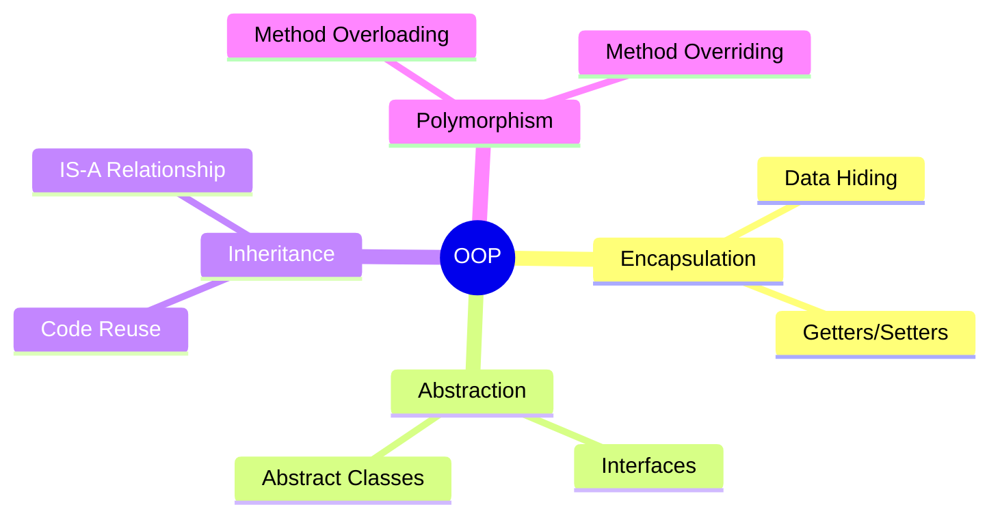
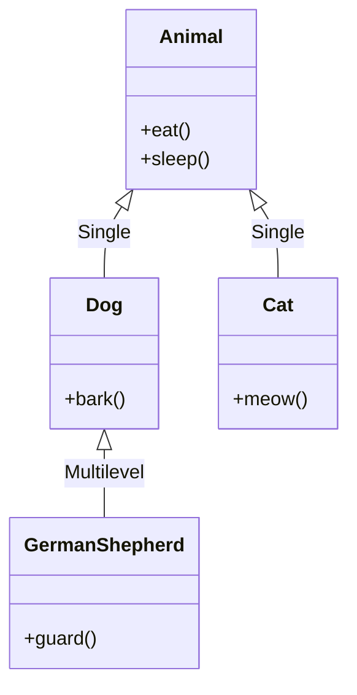

[🏠 Home](../../README.md) | [⬅️ LLD Roadmap](./00-lld-interview-roadmap.md) | [➡️ SOLID Principles](./02-solid-principles.md)

# 🧱 Object-Oriented Design Fundamentals

> Master the four pillars of OOP and essential concepts for LLD interviews

---

## The Four Pillars of OOP



---

## 1. Encapsulation

**Definition**: Bundling data (fields) and methods that operate on that data within a single unit (class), while restricting direct access to internal state.

### ❌ Bad Example (No Encapsulation)

```java
public class BankAccount {
    public double balance;  // Exposed!
}

// Anyone can do this:
account.balance = -1000;  // Invalid state!
```

### ✅ Good Example (Proper Encapsulation)

```java
public class BankAccount {
    private double balance;  // Hidden

    public BankAccount(double initialBalance) {
        if (initialBalance < 0) {
            throw new IllegalArgumentException("Initial balance cannot be negative");
        }
        this.balance = initialBalance;
    }

    public double getBalance() {
        return balance;
    }

    public void deposit(double amount) {
        if (amount <= 0) {
            throw new IllegalArgumentException("Deposit amount must be positive");
        }
        this.balance += amount;
    }

    public void withdraw(double amount) {
        if (amount <= 0) {
            throw new IllegalArgumentException("Withdrawal amount must be positive");
        }
        if (amount > balance) {
            throw new IllegalStateException("Insufficient funds");
        }
        this.balance -= amount;
    }
}
```

> [!TIP]
> **Interview Tip**: Always make fields `private` and provide controlled access through methods.

---

## 2. Abstraction

**Definition**: Hiding complex implementation details and showing only the essential features to the user.

### Interface vs Abstract Class

| Aspect | Interface | Abstract Class |
|--------|-----------|----------------|
| Methods | Only abstract (pre-Java 8) | Both abstract and concrete |
| Variables | Only `public static final` | Any type |
| Inheritance | Multiple interfaces | Single class |
| Constructor | No | Yes |
| Use When | Defining a contract | Sharing common code |

### Interface Example

```java
public interface PaymentProcessor {
    boolean processPayment(double amount);
    void refund(String transactionId);
}

public class CreditCardProcessor implements PaymentProcessor {
    @Override
    public boolean processPayment(double amount) {
        // Connect to credit card gateway
        System.out.println("Processing credit card payment: $" + amount);
        return true;
    }

    @Override
    public void refund(String transactionId) {
        System.out.println("Refunding transaction: " + transactionId);
    }
}

public class UPIProcessor implements PaymentProcessor {
    @Override
    public boolean processPayment(double amount) {
        // Connect to UPI gateway
        System.out.println("Processing UPI payment: ₹" + amount);
        return true;
    }

    @Override
    public void refund(String transactionId) {
        System.out.println("UPI Refund: " + transactionId);
    }
}
```

### Abstract Class Example

```java
public abstract class Vehicle {
    protected String registrationNumber;
    protected String color;

    public Vehicle(String registrationNumber, String color) {
        this.registrationNumber = registrationNumber;
        this.color = color;
    }

    // Concrete method
    public String getRegistrationNumber() {
        return registrationNumber;
    }

    // Abstract method - subclasses must implement
    public abstract double calculateParkingFee(int hours);
}

public class Car extends Vehicle {
    public Car(String registrationNumber, String color) {
        super(registrationNumber, color);
    }

    @Override
    public double calculateParkingFee(int hours) {
        return hours * 20.0;  // ₹20 per hour
    }
}

public class Motorcycle extends Vehicle {
    public Motorcycle(String registrationNumber, String color) {
        super(registrationNumber, color);
    }

    @Override
    public double calculateParkingFee(int hours) {
        return hours * 10.0;  // ₹10 per hour
    }
}
```

---

## 3. Inheritance

**Definition**: Creating new classes based on existing ones, establishing an "IS-A" relationship.

### Types of Inheritance in Java



### When to Use Inheritance

✅ **Use when**:
- There's a clear "IS-A" relationship
- You want to share common behavior
- Subclasses are true specializations

❌ **Avoid when**:
- Relationship is "HAS-A" (use composition)
- Just to reuse code (use composition)
- It creates tight coupling

### Composition Over Inheritance

```java
// ❌ Inheritance Approach
public class Car extends Engine { }  // Car IS-A Engine? No!

// ✅ Composition Approach
public class Car {
    private Engine engine;  // Car HAS-A Engine
    private List<Wheel> wheels;

    public Car(Engine engine) {
        this.engine = engine;
        this.wheels = new ArrayList<>();
    }

    public void start() {
        engine.ignite();
    }
}
```

> [!IMPORTANT]
> **Favor composition over inheritance** - it provides more flexibility and avoids fragile base class problems.

---

## 4. Polymorphism

**Definition**: The ability of objects to take multiple forms, allowing the same interface to be used for different underlying types.

### Compile-Time (Method Overloading)

```java
public class Calculator {
    public int add(int a, int b) {
        return a + b;
    }

    public double add(double a, double b) {
        return a + b;
    }

    public int add(int a, int b, int c) {
        return a + b + c;
    }
}
```

### Runtime (Method Overriding)

```java
public interface Shape {
    double calculateArea();
}

public class Circle implements Shape {
    private double radius;

    public Circle(double radius) {
        this.radius = radius;
    }

    @Override
    public double calculateArea() {
        return Math.PI * radius * radius;
    }
}

public class Rectangle implements Shape {
    private double width, height;

    public Rectangle(double width, double height) {
        this.width = width;
        this.height = height;
    }

    @Override
    public double calculateArea() {
        return width * height;
    }
}

// Usage - polymorphism in action
public class AreaCalculator {
    public double calculateTotalArea(List<Shape> shapes) {
        return shapes.stream()
                     .mapToDouble(Shape::calculateArea)
                     .sum();
    }
}
```

---

## 5. Cohesion & Coupling

### High Cohesion (Good)

All methods in a class should be related to a single purpose.

```java
// ✅ High Cohesion - All methods relate to User operations
public class UserService {
    public User createUser(UserDTO dto) { ... }
    public User findById(String id) { ... }
    public void updateUser(User user) { ... }
    public void deleteUser(String id) { ... }
}
```

### Low Coupling (Good)

Classes should have minimal dependencies on each other.

```java
// ❌ Tight Coupling
public class OrderService {
    private MySQLDatabase database = new MySQLDatabase();  // Direct dependency
}

// ✅ Loose Coupling
public class OrderService {
    private Database database;  // Depends on abstraction

    public OrderService(Database database) {  // Injected
        this.database = database;
    }
}
```

---

## 6. Class vs Object

| Concept | Class | Object |
|---------|-------|--------|
| Definition | Blueprint/Template | Instance of a class |
| Memory | No memory allocated | Heap memory allocated |
| Creation | `class Car { }` | `Car car = new Car();` |
| Existence | Design time | Runtime |

---

## 7. Access Modifiers

| Modifier | Same Class | Same Package | Subclass | Everywhere |
|----------|-----------|--------------|----------|------------|
| `private` | ✅ | ❌ | ❌ | ❌ |
| `default` | ✅ | ✅ | ❌ | ❌ |
| `protected` | ✅ | ✅ | ✅ | ❌ |
| `public` | ✅ | ✅ | ✅ | ✅ |

---

## 📝 Interview Questions

### Q1: What is the difference between abstraction and encapsulation?

**Answer**:
- **Abstraction** hides *implementation complexity* (what it does, not how)
- **Encapsulation** hides *data* (protecting internal state)

### Q2: Can we achieve multiple inheritance in Java?

**Answer**:
Java doesn't support multiple inheritance with classes to avoid the "Diamond Problem." However, we can achieve it using:
- Multiple interfaces
- Default methods (Java 8+)

### Q3: What is method hiding vs method overriding?

**Answer**:
- **Overriding**: Instance method in subclass replaces parent's method (runtime polymorphism)
- **Hiding**: Static method in subclass hides parent's static method (compile-time)

---

*Next: [SOLID Principles →](./02-solid-principles.md)*
