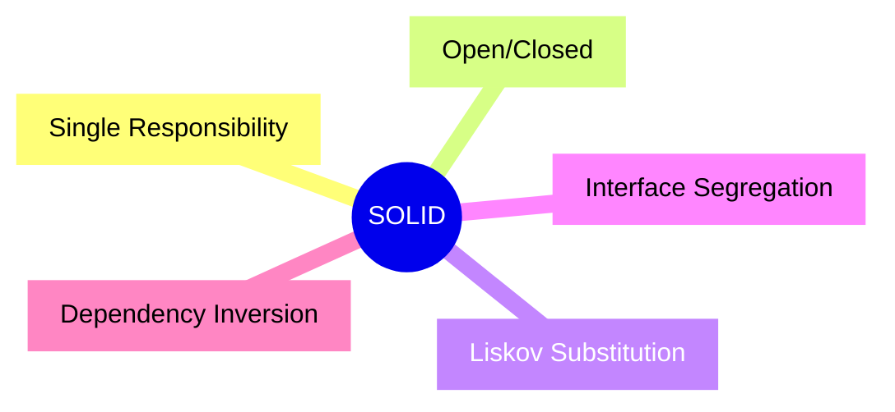
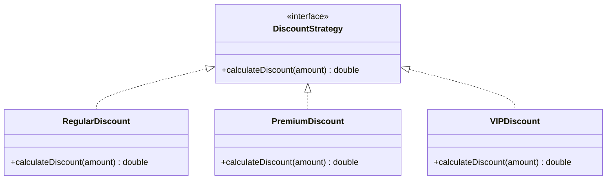
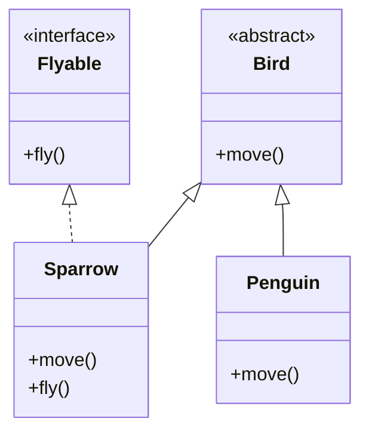
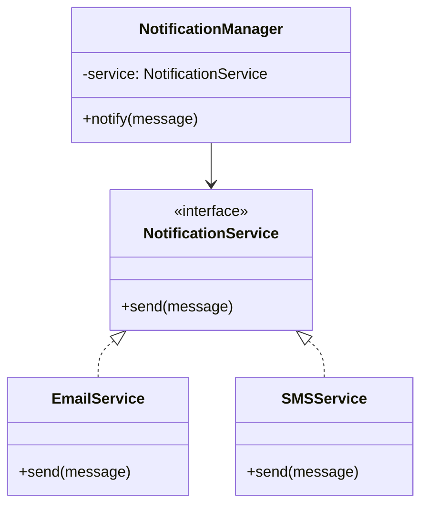

[🏠 Home](../README.md) | [⬅️ OOD Fundamentals](./01-ood-fundamentals.md) | [➡️ Design Patterns](./03-design-patterns/00-patterns-overview.md)

# 🏛️ SOLID Principles

> Write maintainable, scalable, and testable code using the five fundamental principles

---

## Overview



| Principle | One-Liner |
|-----------|-----------|
| **S**ingle Responsibility | One class = One job |
| **O**pen/Closed | Open for extension, closed for modification |
| **L**iskov Substitution | Subtypes must be substitutable for base types |
| **I**nterface Segregation | Many specific interfaces > One general interface |
| **D**ependency Inversion | Depend on abstractions, not concretions |

---

## S - Single Responsibility Principle (SRP)

> "A class should have only one reason to change."

### ❌ Violation

```java
public class Employee {
    private String name;
    private double salary;

    // Responsibility 1: Employee data
    public String getName() { return name; }
    public double getSalary() { return salary; }

    // Responsibility 2: Tax calculation (should be separate!)
    public double calculateTax() {
        return salary * 0.3;
    }

    // Responsibility 3: Persistence (should be separate!)
    public void saveToDatabase() {
        // JDBC code here
    }

    // Responsibility 4: Reporting (should be separate!)
    public String generatePaySlip() {
        return "PaySlip for " + name;
    }
}
```

### ✅ Refactored

```java
// Only handles employee data
public class Employee {
    private String name;
    private double salary;

    public Employee(String name, double salary) {
        this.name = name;
        this.salary = salary;
    }

    public String getName() { return name; }
    public double getSalary() { return salary; }
}

// Only handles tax calculation
public class TaxCalculator {
    public double calculateTax(Employee employee) {
        return employee.getSalary() * 0.3;
    }
}

// Only handles persistence
public class EmployeeRepository {
    public void save(Employee employee) {
        // Database logic
    }

    public Employee findById(String id) {
        // Database logic
        return null;
    }
}

// Only handles reporting
public class PaySlipGenerator {
    public String generate(Employee employee) {
        return "PaySlip for " + employee.getName();
    }
}
```

> [!TIP]
> **Interview Tip**: If you describe a class using "AND", it likely violates SRP.

---

## O - Open/Closed Principle (OCP)

> "Software entities should be open for extension but closed for modification."

### ❌ Violation

```java
public class DiscountCalculator {
    public double calculateDiscount(String customerType, double amount) {
        if (customerType.equals("REGULAR")) {
            return amount * 0.1;
        } else if (customerType.equals("PREMIUM")) {
            return amount * 0.2;
        } else if (customerType.equals("VIP")) {
            return amount * 0.3;
        }
        // Adding new customer type requires modifying this class!
        return 0;
    }
}
```

### ✅ Refactored

```java
public interface DiscountStrategy {
    double calculateDiscount(double amount);
}

public class RegularDiscount implements DiscountStrategy {
    @Override
    public double calculateDiscount(double amount) {
        return amount * 0.1;
    }
}

public class PremiumDiscount implements DiscountStrategy {
    @Override
    public double calculateDiscount(double amount) {
        return amount * 0.2;
    }
}

public class VIPDiscount implements DiscountStrategy {
    @Override
    public double calculateDiscount(double amount) {
        return amount * 0.3;
    }
}

// New type? Just create a new class!
public class StudentDiscount implements DiscountStrategy {
    @Override
    public double calculateDiscount(double amount) {
        return amount * 0.15;
    }
}

public class DiscountCalculator {
    public double calculate(DiscountStrategy strategy, double amount) {
        return strategy.calculateDiscount(amount);
    }
}
```



---

## L - Liskov Substitution Principle (LSP)

> "Subtypes must be substitutable for their base types without altering program correctness."

### ❌ Violation

```java
public class Bird {
    public void fly() {
        System.out.println("Flying...");
    }
}

public class Penguin extends Bird {
    @Override
    public void fly() {
        throw new UnsupportedOperationException("Penguins can't fly!");
    }
}

// This breaks LSP!
public void makeBirdFly(Bird bird) {
    bird.fly();  // Crashes if bird is Penguin
}
```

### ✅ Refactored

```java
public abstract class Bird {
    public abstract void move();
}

public interface Flyable {
    void fly();
}

public class Sparrow extends Bird implements Flyable {
    @Override
    public void move() {
        fly();
    }

    @Override
    public void fly() {
        System.out.println("Sparrow flying...");
    }
}

public class Penguin extends Bird {
    @Override
    public void move() {
        System.out.println("Penguin swimming...");
    }
}
```



> [!IMPORTANT]
> **LSP Check**: Can I replace the parent with any child without breaking behavior?

---

## I - Interface Segregation Principle (ISP)

> "Clients should not be forced to depend on methods they do not use."

### ❌ Violation

```java
public interface Worker {
    void work();
    void eat();
    void sleep();
}

public class Robot implements Worker {
    @Override
    public void work() {
        System.out.println("Robot working...");
    }

    @Override
    public void eat() {
        throw new UnsupportedOperationException("Robots don't eat!");
    }

    @Override
    public void sleep() {
        throw new UnsupportedOperationException("Robots don't sleep!");
    }
}
```

### ✅ Refactored

```java
public interface Workable {
    void work();
}

public interface Eatable {
    void eat();
}

public interface Sleepable {
    void sleep();
}

public class Human implements Workable, Eatable, Sleepable {
    @Override
    public void work() {
        System.out.println("Human working...");
    }

    @Override
    public void eat() {
        System.out.println("Human eating...");
    }

    @Override
    public void sleep() {
        System.out.println("Human sleeping...");
    }
}

public class Robot implements Workable {
    @Override
    public void work() {
        System.out.println("Robot working 24/7...");
    }
}
```

---

## D - Dependency Inversion Principle (DIP)

> "Depend on abstractions, not on concretions."

### ❌ Violation

```java
public class EmailService {
    public void sendEmail(String message) {
        System.out.println("Email: " + message);
    }
}

public class NotificationManager {
    private EmailService emailService = new EmailService();  // Tight coupling!

    public void notify(String message) {
        emailService.sendEmail(message);
    }
}
```

### ✅ Refactored

```java
public interface NotificationService {
    void send(String message);
}

public class EmailService implements NotificationService {
    @Override
    public void send(String message) {
        System.out.println("Email: " + message);
    }
}

public class SMSService implements NotificationService {
    @Override
    public void send(String message) {
        System.out.println("SMS: " + message);
    }
}

public class PushNotificationService implements NotificationService {
    @Override
    public void send(String message) {
        System.out.println("Push: " + message);
    }
}

public class NotificationManager {
    private NotificationService service;  // Depends on abstraction

    // Dependency Injection via constructor
    public NotificationManager(NotificationService service) {
        this.service = service;
    }

    public void notify(String message) {
        service.send(message);
    }
}

// Usage
NotificationManager manager = new NotificationManager(new EmailService());
manager.notify("Hello!");
```



---

## 📊 SOLID Summary Cheatsheet

| Principle | Problem It Solves | Key Technique |
|-----------|-------------------|---------------|
| SRP | God classes | Split by responsibility |
| OCP | Modification side effects | Strategy pattern, inheritance |
| LSP | Broken polymorphism | Proper abstraction hierarchy |
| ISP | Fat interfaces | Split into smaller interfaces |
| DIP | Tight coupling | Dependency injection |

---

## 📝 Interview Questions

### Q1: Which SOLID principle does the Factory pattern help with?

**Answer**: Open/Closed Principle (OCP). New products can be added without modifying existing factory code.

### Q2: How does Dependency Injection relate to DIP?

**Answer**: DI is a technique to achieve DIP. It allows injecting abstractions (interfaces) rather than creating concrete dependencies inside a class.

### Q3: Give a real-world example of ISP violation.

**Answer**: A `Printer` interface with `print()`, `scan()`, and `fax()` methods forces a basic printer to implement `scan()` and `fax()` even if it doesn't support them.

---

*Next: [Design Patterns Overview →](./03-design-patterns/00-patterns-overview.md)*
