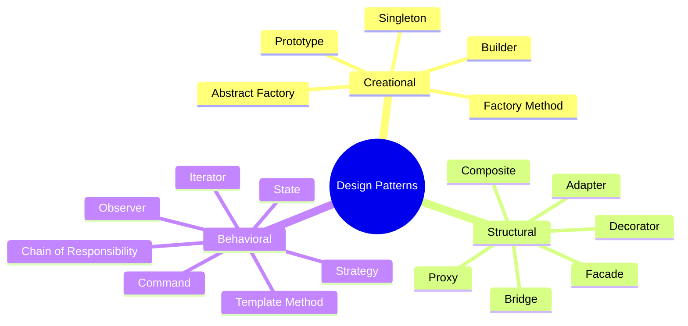
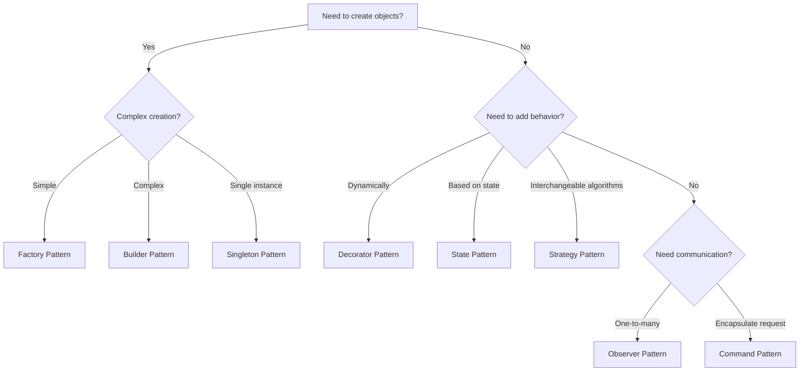

[🏠 Home](../../../README.md) | [⬅️ SOLID Principles](../02-solid-principles.md) | [➡️ Creational Patterns](./01-creational-patterns.md)

# 🎨 Design Patterns Overview

> Reusable solutions to common software design problems

---

## What are Design Patterns?

Design patterns are **proven solutions** to recurring problems in software design. They are:
- Language-agnostic templates
- Best practices evolved over time
- Communication tools between developers

---

## Categories of Design Patterns

---

## Pattern Categories Explained

| Category | Purpose | Examples |
|----------|---------|----------|
| **Creational** | Object creation mechanisms | Singleton, Factory, Builder |
| **Structural** | Class/object composition | Adapter, Decorator, Facade |
| **Behavioral** | Object interaction & responsibility | Observer, Strategy, State |

---

## 🔥 Most Important Patterns for LLD Interviews

### Tier 1 (Must Know)

| Pattern | Category | Common Use Cases |
|---------|----------|------------------|
| **Singleton** | Creational | Database connection, Logger, Config |
| **Factory Method** | Creational | Creating vehicles, documents, notifications |
| **Builder** | Creational | Complex object construction (Queries, Meals) |
| **Strategy** | Behavioral | Payment methods, Pricing algorithms |
| **Observer** | Behavioral | Event systems, Notifications |
| **State** | Behavioral | Order status, Game states, Vending machine |

### Tier 2 (Good to Know)

| Pattern | Category | Common Use Cases |
|---------|----------|------------------|
| **Decorator** | Structural | Adding features to objects dynamically |
| **Adapter** | Structural | Legacy system integration |
| **Facade** | Structural | Simplifying complex subsystems |
| **Command** | Behavioral | Undo/Redo, Request queuing |
| **Template Method** | Behavioral | Algorithm skeleton with customizable steps |

---

## Pattern Selection Guide

---

## Quick Reference: When to Use Each Pattern

### Creational Patterns

| Pattern | Use When... |
|---------|-------------|
| **Singleton** | Need exactly one instance globally |
| **Factory Method** | Don't know exact types beforehand |
| **Abstract Factory** | Need families of related objects |
| **Builder** | Object has many optional parameters |
| **Prototype** | Cloning is cheaper than creating new |

### Structural Patterns

| Pattern | Use When... |
|---------|-------------|
| **Adapter** | Need to use incompatible interface |
| **Bridge** | Want to vary abstraction and implementation independently |
| **Composite** | Need tree structures (file systems) |
| **Decorator** | Add responsibilities dynamically |
| **Facade** | Simplify complex subsystem interface |
| **Proxy** | Control access to an object |

### Behavioral Patterns

| Pattern | Use When... |
|---------|-------------|
| **Chain of Responsibility** | Multiple handlers for a request |
| **Command** | Encapsulate requests, support undo |
| **Iterator** | Traverse collections uniformly |
| **Observer** | Object changes should notify others |
| **State** | Behavior depends on internal state |
| **Strategy** | Interchangeable algorithms at runtime |
| **Template Method** | Same algorithm, varying steps |

---

## 💡 Interview Tips

> [!TIP]
> **Don't force patterns** - Use them when they solve a real problem, not to show off knowledge.

> [!TIP]
> **Know trade-offs** - Every pattern has pros and cons. Be ready to discuss them.

> [!TIP]
> **Combine patterns** - Real systems often use multiple patterns together (e.g., Factory + Singleton).

---

## Learning Path

1. **[Creational Patterns →](./01-creational-patterns.md)** - Singleton, Factory, Builder, Prototype
2. **[Structural Patterns →](./02-structural-patterns.md)** - Adapter, Decorator, Facade, Proxy
3. **[Behavioral Patterns →](./03-behavioral-patterns.md)** - Observer, Strategy, State, Command

---

*Next: [Creational Patterns →](./01-creational-patterns.md)*
