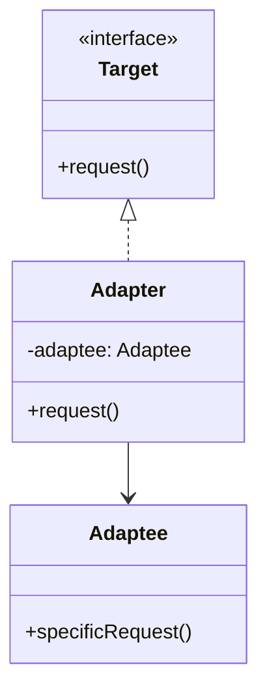
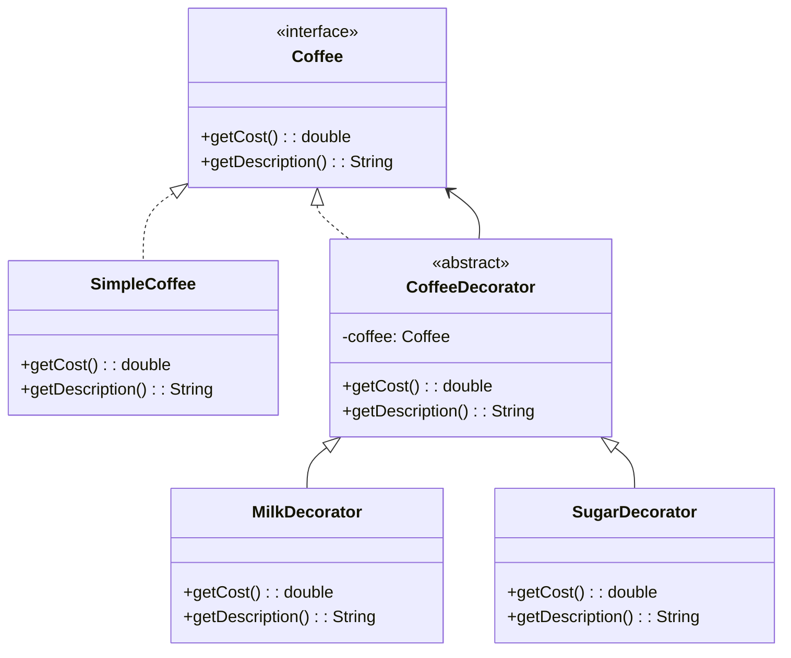
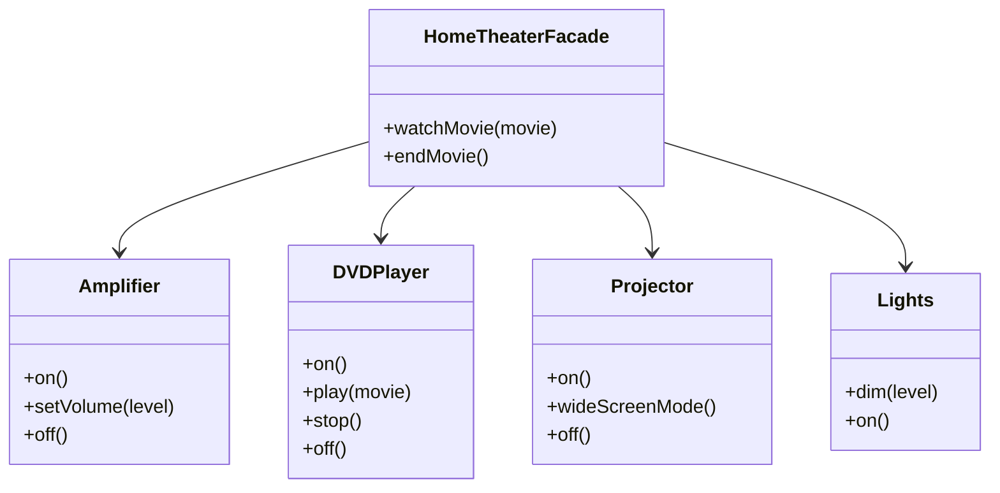

[🏠 Home](../../../README.md) | [⬅️ Creational Patterns](./01-creational-patterns.md) | [➡️ Behavioral Patterns](./03-behavioral-patterns.md)

# 🏗️ Structural Design Patterns

> Patterns that deal with object composition and class relationships

---

## 1. Adapter Pattern

### Intent
Convert the interface of a class into another interface that clients expect. Allows incompatible interfaces to work together.

### When to Use
- Integrate legacy code with new systems
- Use third-party libraries with incompatible interfaces
- Wrap an existing class with a new interface

### Class Diagram



### Implementation

```java
// Target interface (what client expects)
public interface MediaPlayer {
    void play(String filename);
}

// Adaptee (legacy/third-party class with different interface)
public class VLCPlayer {
    public void playVLC(String filename) {
        System.out.println("Playing VLC file: " + filename);
    }
}

public class MP4Player {
    public void playMP4(String filename) {
        System.out.println("Playing MP4 file: " + filename);
    }
}

// Adapter
public class MediaAdapter implements MediaPlayer {
    private VLCPlayer vlcPlayer;
    private MP4Player mp4Player;

    public MediaAdapter(String audioType) {
        if (audioType.equalsIgnoreCase("vlc")) {
            vlcPlayer = new VLCPlayer();
        } else if (audioType.equalsIgnoreCase("mp4")) {
            mp4Player = new MP4Player();
        }
    }

    @Override
    public void play(String filename) {
        if (vlcPlayer != null) {
            vlcPlayer.playVLC(filename);
        } else if (mp4Player != null) {
            mp4Player.playMP4(filename);
        }
    }
}

// Client
public class AudioPlayer implements MediaPlayer {
    @Override
    public void play(String filename) {
        String extension = getExtension(filename);
        
        if (extension.equalsIgnoreCase("mp3")) {
            System.out.println("Playing MP3 file: " + filename);
        } else if (extension.equalsIgnoreCase("vlc") || 
                   extension.equalsIgnoreCase("mp4")) {
            MediaAdapter adapter = new MediaAdapter(extension);
            adapter.play(filename);
        } else {
            System.out.println("Invalid format: " + extension);
        }
    }

    private String getExtension(String filename) {
        return filename.substring(filename.lastIndexOf('.') + 1);
    }
}

// Usage
MediaPlayer player = new AudioPlayer();
player.play("song.mp3");   // Playing MP3 file: song.mp3
player.play("movie.mp4");  // Playing MP4 file: movie.mp4
player.play("video.vlc");  // Playing VLC file: video.vlc
```

---

## 2. Decorator Pattern

### Intent
Attach additional responsibilities to an object dynamically. Provides a flexible alternative to subclassing for extending functionality.

### When to Use
- Add features to objects without modifying their class
- When subclassing leads to class explosion
- Features need to be added/removed at runtime

### Class Diagram



### Implementation

```java
// Component interface
public interface Coffee {
    double getCost();
    String getDescription();
}

// Concrete component
public class SimpleCoffee implements Coffee {
    @Override
    public double getCost() {
        return 50.0;
    }

    @Override
    public String getDescription() {
        return "Simple Coffee";
    }
}

// Base decorator
public abstract class CoffeeDecorator implements Coffee {
    protected final Coffee decoratedCoffee;

    public CoffeeDecorator(Coffee coffee) {
        this.decoratedCoffee = coffee;
    }

    @Override
    public double getCost() {
        return decoratedCoffee.getCost();
    }

    @Override
    public String getDescription() {
        return decoratedCoffee.getDescription();
    }
}

// Concrete decorators
public class MilkDecorator extends CoffeeDecorator {
    public MilkDecorator(Coffee coffee) {
        super(coffee);
    }

    @Override
    public double getCost() {
        return super.getCost() + 15.0;
    }

    @Override
    public String getDescription() {
        return super.getDescription() + ", Milk";
    }
}

public class SugarDecorator extends CoffeeDecorator {
    public SugarDecorator(Coffee coffee) {
        super(coffee);
    }

    @Override
    public double getCost() {
        return super.getCost() + 5.0;
    }

    @Override
    public String getDescription() {
        return super.getDescription() + ", Sugar";
    }
}

public class WhippedCreamDecorator extends CoffeeDecorator {
    public WhippedCreamDecorator(Coffee coffee) {
        super(coffee);
    }

    @Override
    public double getCost() {
        return super.getCost() + 25.0;
    }

    @Override
    public String getDescription() {
        return super.getDescription() + ", Whipped Cream";
    }
}

// Usage
Coffee coffee = new SimpleCoffee();
System.out.println(coffee.getDescription() + " = ₹" + coffee.getCost());
// Simple Coffee = ₹50.0

coffee = new MilkDecorator(coffee);
System.out.println(coffee.getDescription() + " = ₹" + coffee.getCost());
// Simple Coffee, Milk = ₹65.0

coffee = new SugarDecorator(coffee);
coffee = new WhippedCreamDecorator(coffee);
System.out.println(coffee.getDescription() + " = ₹" + coffee.getCost());
// Simple Coffee, Milk, Sugar, Whipped Cream = ₹95.0
```

> [!TIP]
> **Real-World Example**: Java I/O streams use Decorator pattern. `BufferedInputStream` decorates `FileInputStream`.

---

## 3. Facade Pattern

### Intent
Provide a unified interface to a set of interfaces in a subsystem. Facade defines a higher-level interface that makes the subsystem easier to use.

### When to Use
- Simplify complex subsystems
- Reduce dependencies on subsystem internals
- Layer your system (entry point for each layer)

### Class Diagram



### Implementation

```java
// Subsystem classes
public class Amplifier {
    public void on() { System.out.println("Amplifier on"); }
    public void setVolume(int level) { System.out.println("Volume set to " + level); }
    public void off() { System.out.println("Amplifier off"); }
}

public class DVDPlayer {
    public void on() { System.out.println("DVD Player on"); }
    public void play(String movie) { System.out.println("Playing: " + movie); }
    public void stop() { System.out.println("DVD Player stopped"); }
    public void off() { System.out.println("DVD Player off"); }
}

public class Projector {
    public void on() { System.out.println("Projector on"); }
    public void wideScreenMode() { System.out.println("Widescreen mode enabled"); }
    public void off() { System.out.println("Projector off"); }
}

public class Lights {
    public void dim(int level) { System.out.println("Lights dimmed to " + level + "%"); }
    public void on() { System.out.println("Lights on"); }
}

// Facade
public class HomeTheaterFacade {
    private final Amplifier amp;
    private final DVDPlayer dvd;
    private final Projector projector;
    private final Lights lights;

    public HomeTheaterFacade(Amplifier amp, DVDPlayer dvd, 
                              Projector projector, Lights lights) {
        this.amp = amp;
        this.dvd = dvd;
        this.projector = projector;
        this.lights = lights;
    }

    public void watchMovie(String movie) {
        System.out.println("=== Get ready to watch a movie ===");
        lights.dim(10);
        projector.on();
        projector.wideScreenMode();
        amp.on();
        amp.setVolume(5);
        dvd.on();
        dvd.play(movie);
    }

    public void endMovie() {
        System.out.println("=== Shutting down movie theater ===");
        dvd.stop();
        dvd.off();
        amp.off();
        projector.off();
        lights.on();
    }
}

// Usage
HomeTheaterFacade theater = new HomeTheaterFacade(
    new Amplifier(), new DVDPlayer(), new Projector(), new Lights()
);

theater.watchMovie("Inception");
// ...watch movie...
theater.endMovie();
```

---

## 4. Proxy Pattern

### Intent
Provide a surrogate or placeholder for another object to control access to it.

### Types of Proxies
- **Virtual Proxy**: Delays expensive object creation
- **Protection Proxy**: Controls access based on permissions
- **Remote Proxy**: Represents an object in different address space
- **Caching Proxy**: Caches results of expensive operations

### Implementation: Protection Proxy

```java
public interface Document {
    void display();
    void edit(String content);
}

public class RealDocument implements Document {
    private String content;
    private String filename;

    public RealDocument(String filename) {
        this.filename = filename;
        loadFromDisk();
    }

    private void loadFromDisk() {
        System.out.println("Loading document: " + filename);
        this.content = "Document content...";
    }

    @Override
    public void display() {
        System.out.println("Displaying: " + content);
    }

    @Override
    public void edit(String newContent) {
        this.content = newContent;
        System.out.println("Document edited");
    }
}

// Protection Proxy
public class DocumentProxy implements Document {
    private RealDocument realDocument;
    private final String filename;
    private final User user;

    public DocumentProxy(String filename, User user) {
        this.filename = filename;
        this.user = user;
    }

    @Override
    public void display() {
        if (realDocument == null) {
            realDocument = new RealDocument(filename);
        }
        realDocument.display();
    }

    @Override
    public void edit(String content) {
        if (!user.hasEditPermission()) {
            System.out.println("Access Denied: No edit permission");
            return;
        }
        if (realDocument == null) {
            realDocument = new RealDocument(filename);
        }
        realDocument.edit(content);
    }
}

public class User {
    private final String name;
    private final boolean editPermission;

    public User(String name, boolean editPermission) {
        this.name = name;
        this.editPermission = editPermission;
    }

    public boolean hasEditPermission() {
        return editPermission;
    }
}

// Usage
User admin = new User("Admin", true);
User viewer = new User("Viewer", false);

Document adminDoc = new DocumentProxy("secret.pdf", admin);
adminDoc.display();        // Loads and displays
adminDoc.edit("New data"); // Success

Document viewerDoc = new DocumentProxy("secret.pdf", viewer);
viewerDoc.display();        // Loads and displays
viewerDoc.edit("Hacked!");  // Access Denied
```

---

## 📊 Comparison Table

| Pattern | Problem | Solution | Real-World Example |
|---------|---------|----------|-------------------|
| Adapter | Incompatible interfaces | Wrapper that translates | Power adapters |
| Decorator | Add features dynamically | Wrap and extend | Java I/O streams |
| Facade | Complex subsystem | Unified simple interface | Home automation |
| Proxy | Control object access | Surrogate object | Security proxy |

---

## 📝 Interview Questions

### Q1: Decorator vs Adapter?

**Answer**:
- **Adapter** changes interface to match what client expects
- **Decorator** keeps the same interface but adds new behavior

### Q2: When to use Facade vs just calling subsystem directly?

**Answer**: Use Facade when:
- Subsystem is complex with many classes
- You want to decouple client from subsystem changes
- You need a clean entry point for testing

### Q3: Proxy vs Decorator?

**Answer**:
- **Proxy** controls access to the object (same interface, controls when/how it's used)
- **Decorator** adds new behavior (same interface, enhances functionality)

---

*Next: [Behavioral Patterns →](./03-behavioral-patterns.md)*
